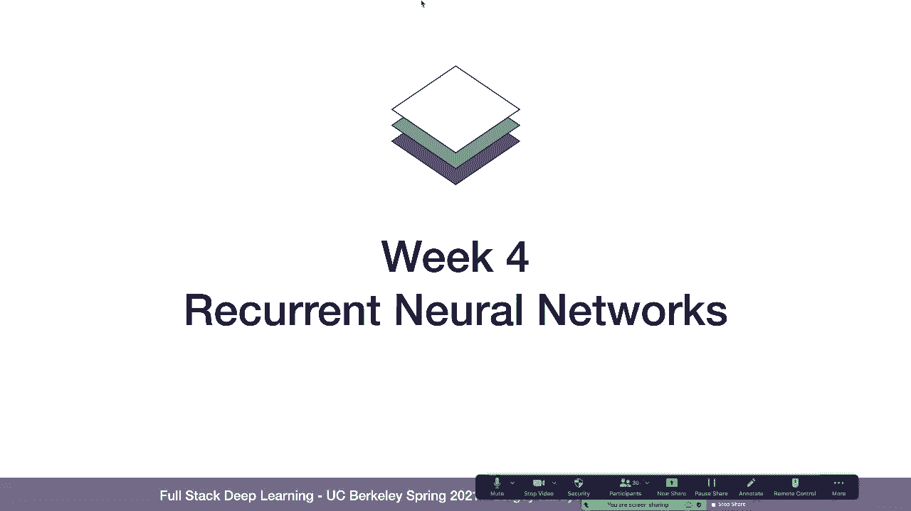
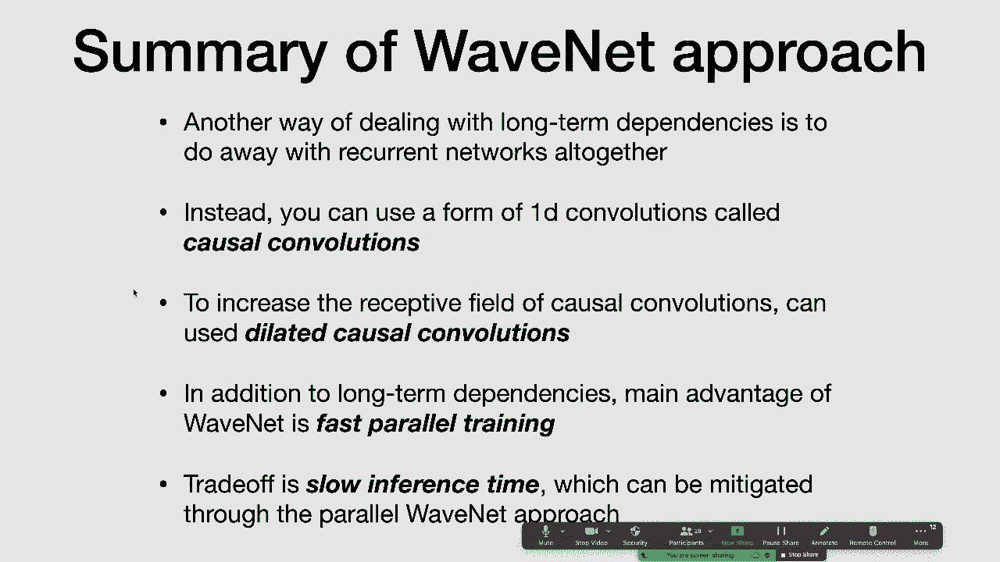

# 7：L3-循环神经网络 🧠

在本节课中，我们将要学习循环神经网络。这是一种专门为处理序列数据而设计的神经网络架构。我们将探讨其工作原理、解决的问题、存在的挑战以及一些改进方案。

---

## 序列问题概述 📊

上一节我们介绍了循环神经网络的基本概念，本节中我们来看看它旨在解决哪些问题。序列问题是指输入或输出（或两者）是数据序列的任务。

以下是几种主要的序列问题类型：
*   **一对一**：输入和输出都是单个数据点。
*   **一对多**：输入是单个数据点，输出是一个序列。例如，根据一张图片生成描述文本。
*   **多对一**：输入是一个序列，输出是单个数据点。例如，根据一段文本判断其情感倾向。
*   **多对多**：输入和输出都是序列。例如，机器翻译或语音识别。

---

## 为何不使用前馈网络？ 🤔

一个自然的问题是：为什么不直接使用标准的前馈神经网络来处理序列？一种方法是将整个序列拼接成一个长向量作为输入。

这种方法存在几个问题：
*   **无法处理任意长度**：需要将序列填充到固定长度。
*   **计算效率低**：模型参数量随序列最大长度线性增长。
*   **数据效率低**：模型需要为序列中每个位置独立学习相同的模式，无法有效利用序列的重复性结构。

---

## 循环神经网络核心思想 🔄

循环神经网络的核心思想是引入“状态”或“记忆”。模型在每个时间步的**输出不仅取决于当前输入，还取决于一个随时间传递的隐藏状态**。

其计算过程可以形式化地描述。在每个时间步 `t`，RNN 执行以下操作：
1.  计算新的隐藏状态：`h_t = activation(W_hh * h_{t-1} + W_xh * x_t + b_h)`
2.  计算当前输出：`y_t = W_hy * h_t + b_y`

其中，`h_t` 是当前隐藏状态，`h_{t-1}` 是上一时刻隐藏状态，`x_t` 是当前输入，`W_*` 和 `b_*` 是可学习的权重和偏置，`activation` 是激活函数（如 `tanh`）。

这种结构使得 RNN 能够捕捉序列中的时间依赖性。

---

## 处理多对一问题：编码器-解码器模式 🏗️

上一节我们介绍了基础的 RNN 结构，本节中我们来看看如何用它解决更复杂的问题。对于“多对一”问题（如情感分析），我们只关心序列的最终输出。

解决方案是使用**编码器-解码器**架构：
1.  **编码器**：一个 RNN 处理整个输入序列，其最终隐藏状态 `h_T` 被视作整个输入序列的“摘要”或“编码”。
2.  **解码器**：一个简单的分类器（如前馈网络）接收这个编码 `h_T`，并产生最终的输出（如情感标签）。

虽然概念上是两个网络，但在训练时，梯度会从解码器一直反向传播回编码器，整个系统是端到端训练的。

---

## 处理一对多问题：序列生成 🎨

对于“一对多”问题（如图像描述生成），输入是单个数据点（如图像），输出是一个序列。

以下是实现步骤：
1.  **编码**：使用一个卷积神经网络处理输入图像，提取一个特征向量作为初始隐藏状态 `h_0`。
2.  **解码**：一个 RNN 解码器以 `h_0` 为起点开始生成序列。在每个时间步，它将**上一个时间步的生成结果**作为当前输入，并结合当前隐藏状态，预测序列中的下一个元素（如一个词）。
3.  **终止**：在词汇表中引入一个特殊的“结束符”。当解码器生成该符号时，序列生成停止。

训练时，通常使用**交叉熵损失**，将每个时间步的预测与真实序列的对应元素进行比较，并将所有时间步的损失求和。

---

## 处理多对多问题：机器翻译案例研究 🌐

最一般的情况是“多对多”问题，且输入输出序列长度可能不同，例如机器翻译。

基础的编码器-解码器架构如下：
1.  **编码器 RNN**：逐词读入源语言句子，最终隐藏状态 `h_T^enc` 编码了整个句子的信息。
2.  **状态传递**：`h_T^enc` 作为解码器 RNN 的初始隐藏状态 `h_0^dec`。
3.  **解码器 RNN**：从 `h_0^dec` 开始，以上一步的输出为输入，逐步生成目标语言句子。

然而，这种方法存在**信息瓶颈**：无论源句子多长，所有信息都必须压缩进一个固定维度的向量 `h_T^enc` 中，这对于长句子来说非常困难。

---

## RNN 的挑战与 LSTM 🚧

基础 RNN 在处理长序列时面临**梯度消失/爆炸**问题，导致其难以学习长期依赖关系。这是因为在反向传播时，梯度需要跨多个时间步连乘，如果每个局部梯度很小（对于 `tanh`/`sigmoid`）或很大（对于 `ReLU`），整体梯度就会迅速衰减或激增。

**长短期记忆网络** 是 RNN 的一个成功变体，它通过引入“细胞状态”和“门控机制”来更好地控制信息的流动和记忆。

LSTM 单元的核心组件包括：
*   **遗忘门**：决定从细胞状态中丢弃哪些旧信息。`f_t = sigmoid(W_f * [h_{t-1}, x_t] + b_f)`
*   **输入门**：决定将哪些新信息存入细胞状态。`i_t = sigmoid(W_i * [h_{t-1}, x_t] + b_i)`， `\tilde{C}_t = tanh(W_C * [h_{t-1}, x_t] + b_C)`
*   **细胞状态更新**：`C_t = f_t * C_{t-1} + i_t * \tilde{C}_t`
*   **输出门**：基于细胞状态决定输出什么。`o_t = sigmoid(W_o * [h_{t-1}, x_t] + b_o)`， `h_t = o_t * tanh(C_t)`

这些门使 LSTM 能够有选择地保留长期信息，有效缓解了梯度消失问题。**GRU** 是 LSTM 的一个流行简化版本，在实践中表现也常与 LSTM 相当。

---

## 改进机器翻译：注意力机制与双向性 ✨

为了解决信息瓶颈问题，**注意力机制**被引入。其核心思想是：在解码器生成每个词时，允许它直接“查看”编码器在所有时间步的隐藏状态，并动态地决定关注输入序列的哪些部分。

具体来说：
1.  解码器在时间步 `t` 计算一个**注意力分数**（相关性权重）`α_{t,i}`，对应于编码器每个隐藏状态 `h_i^enc`。
2.  这些分数通过 softmax 归一化，形成注意力分布。
3.  计算**上下文向量** `c_t` 作为编码器隐藏状态的加权和：`c_t = Σ_i (α_{t,i} * h_i^enc)`。
4.  将上下文向量 `c_t` 与解码器当前状态结合，用于预测输出。

此外，使用**双向 LSTM** 作为编码器可以让模型同时考虑过去和未来的上下文，这对理解当前词的含义很有帮助。

一个2016年的先进机器翻译系统结合了：**堆叠的 LSTM**、**残差连接**（便于训练深层网络）、**注意力机制**和**双向编码器**，并使用大规模平行语料库和交叉熵损失进行训练。

---

## 连接时序分类损失 📝

在一些任务中，输入和输出序列之间存在**不对齐**的问题，例如手写文字识别：输入是图像序列（滑动窗口），输出是字符序列，但两者长度和对应关系不确定。

**CTC损失** 专门用于处理这类问题。它允许模型输出一个长度等于输入长度的序列，其中包含：
*   有效字符
*   一个特殊的“空白”符（`ε`）

解码时，应用两条规则将模型输出转换为最终序列：
1.  合并重复的连续字符。
2.  删除所有的空白符 `ε`。

例如，模型输出 `[c, ε, a, a, t, ε]` 经过 CTC 解码后变为 `cat`。CTC 损失在训练时考虑了所有可能对齐路径的概率，是可微的。

---

## RNN 的优缺点 ⚖️

**优点**：
*   **架构灵活**：编码器-解码器模式可适应多种序列任务（一对一、一对多、多对多）。
*   **历史成功**：在 NLP、语音等领域曾有广泛应用，并在 Transformer 出现前长期占据主导地位。

**缺点**：
*   **训练并行性差**：由于状态的顺序依赖性，训练本质上是串行的，难以充分利用现代硬件。
*   **训练调优难**：LSTM/GRU 等模型通常需要仔细的调参和训练技巧。
*   **长程依赖仍具挑战**：尽管 LSTM 有所改善，但处理非常长的序列依然困难。

---

## 非循环序列模型预览：WaveNet 🌊

序列建模不一定必须使用循环网络。**WaveNet** 是一个使用**因果膨胀卷积**的卷积序列模型，用于生成高质量音频。

其核心思想：
*   **因果卷积**：每个输出仅依赖于当前及过去的输入，不依赖未来，满足自回归生成的要求。
*   **膨胀卷积**：通过跳跃式地连接输入，指数级地增大模型的**感受野**，使其能够捕捉很长期的依赖关系。

**优势**：
*   **高度并行化训练**：所有时间步的输出可以同时计算，训练速度远快于 RNN。
*   **有效捕捉长程依赖**：通过堆叠膨胀卷积层实现。

**劣势**：
*   **推理速度慢**：生成时仍需按顺序进行，因为每一步的输出是下一步的输入。后续有研究专门优化其推理效率。

---

## 总结 🎯

本节课中我们一起学习了循环神经网络。我们从序列问题入手，探讨了基础 RNN 的原理及其在处理多对一、一对多和多对多问题时的编码器-解码器框架。我们深入分析了 RNN 在训练长序列时面临的梯度消失问题，并介绍了 LSTM 的门控机制作为解决方案。通过机器翻译的案例，我们看到了注意力机制和双向性如何显著提升模型性能。此外，我们还了解了用于处理未对齐序列的 CTC 损失，并讨论了 RNN 架构的优缺点。最后，我们预览了非循环的序列模型 WaveNet，它展示了使用卷积网络处理序列数据的另一种强大范式。这些知识为我们理解更现代的序列模型（如 Transformer）奠定了基础。