# 8：【Lab3】RNN 序列模型 📘


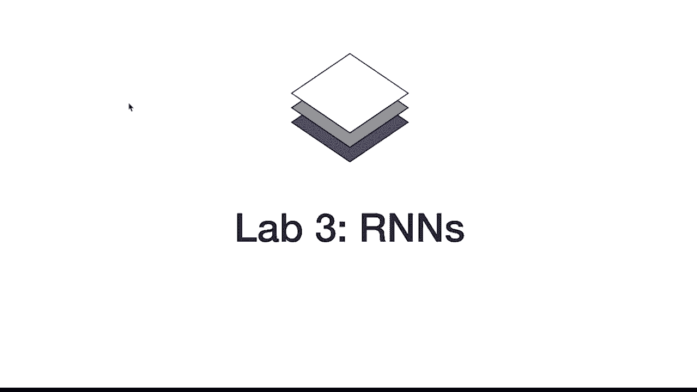

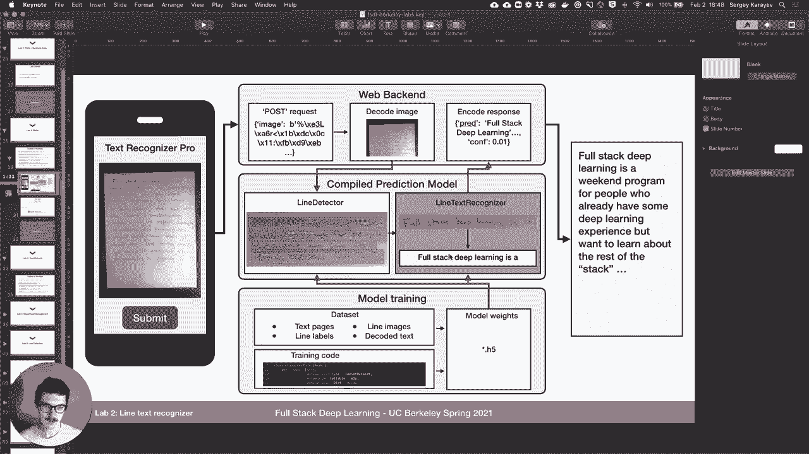

在本课程中，我们将学习如何构建一个用于识别手写文本行的序列模型。我们将从简单的滑动窗口方法开始，逐步引入更高效的卷积网络结构，并最终结合CTC损失函数和LSTM网络来处理可变长度和重叠字符的复杂情况。

---

## 🧠 概述与问题定义

Lab3 的核心是构建序列模型。在之前的实验中，我们使用MLP处理MNIST（Lab1），并引入了扩展的字符数据集，使用CNN进行训练（Lab2）。本周，我们将训练一个LSTM模型来识别我们生成的手写文本行。

我们的目标是构建一个完整的“文本行识别器”。

---

## 📁 项目结构与数据

项目文件结构与Lab2类似，但新增了一些关键文件。所有数据集，包括 `emnist_lines`，都与Lab2相同。在 `lit_models` 目录下，新增了一个 `CTCLitModel` 包装器。在 `models` 目录中，新增了三个模型：`line_cnn_simple`、`line_cnn` 和 `line_cnn_lstm`。我们将按顺序讲解它们。

首先，我们回顾一下标签映射。模型输出的整数标签需要映射到可打印的字符，其中包含一些特殊标记：
*   **B**：序列开始
*   **S**：空格
*   **E**：序列结束
*   **P**：填充符

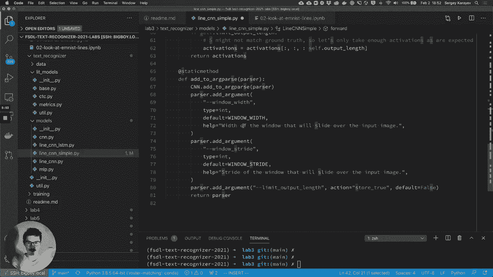

我们使用 **P** 将所有生成的字符串填充到最大长度。


我们的数据是通过将28x28像素的EMNIST字符拼接成行而生成的。初始时，我们生成无重叠的字符行，这看起来还不太像真实笔迹，但这是我们起步的基础。

---

## 🔍 模型一：LineCNNSimple（简单滑动窗口CNN）

首先，我们来看 `line_cnn_simple` 模型。这个模型实例化了一个与上周识别单个字符相同的CNN网络。

模型的 `forward` 方法接收一个输入图像，其尺寸为 `(batch_size, channels, height, width)`。对于文本行图像，高度仍是28，但宽度可能达到400以上。模型需要输出 `(batch_size, num_classes, sequence_length)`。

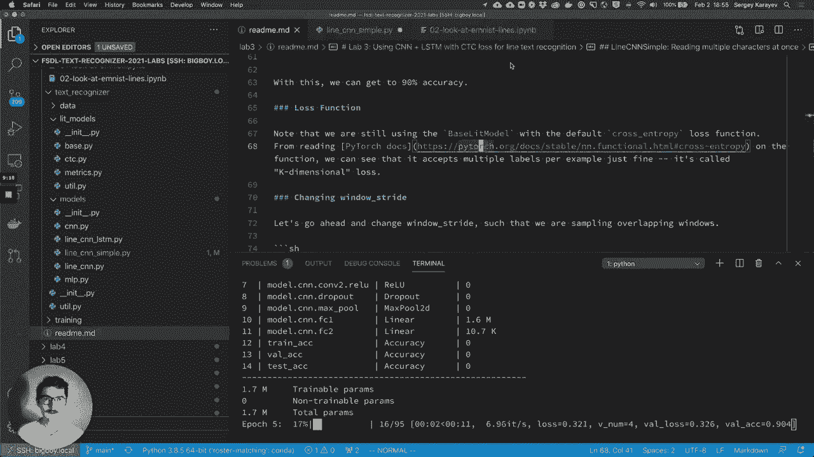

该模型的核心思想是使用滑动窗口。它接收两个超参数：
*   **`window_width`**：滑动窗口的宽度。
*   **`window_stride`**：滑动窗口的步长。

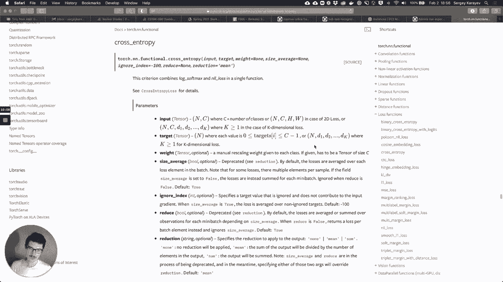

**窗口数量计算公式**为：
`num_windows = (image_width - window_width) / window_stride + 1`

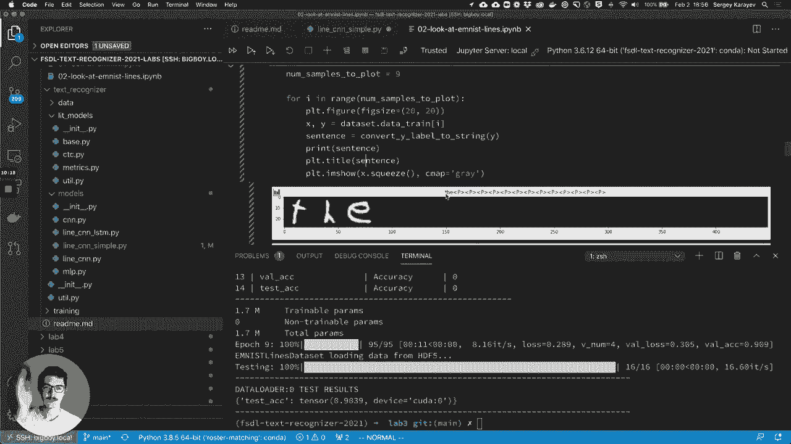

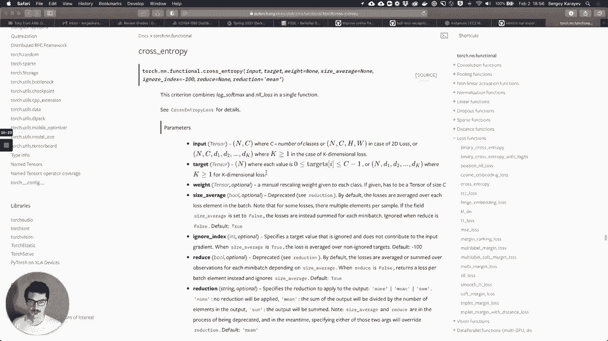

对于每个窗口，我们将其裁剪出来，并通过相同的CNN网络前向传播，得到该窗口对应位置的字符分类激活值。

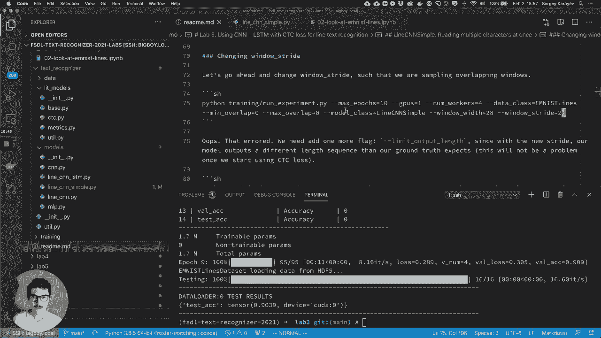

我们可以运行一个实验，在无重叠的数据上（`min_overlap=0, max_overlap=0`），设置 `window_width=28` 和 `window_stride=28`，这相当于逐字符进行识别。模型很快能达到约89%的验证准确率，效果与识别单个字符时类似。


此时我们使用的损失函数是默认的**交叉熵损失（CrossEntropyLoss）**。需要注意的是，现在的目标（target）不再是一个单独的整数，而是一个向量（例如 `[T, H, E, P, P, P...]`），对应一行中的每个字符位置。PyTorch的交叉熵损失可以直接处理这种多目标情况（通过指定 `ignore_index` 来忽略填充符 **P**），这被称为 **K维损失**。

---

## 🔄 引入重叠与挑战

接下来，我们让滑动窗口重叠。例如，设置 `window_width=28`, `window_stride=20`。这意味着相邻窗口有8个像素的重叠。

如果数据本身是无重叠生成的，模型窗口与字符不再精确对齐，准确率会下降到约60%。为了解决这个问题，我们可以让生成的数据也带有重叠（例如 `overlap=0.25`），这样准确率能回升到80%以上。

然而，真实手写面临更大的挑战：
1.  字符宽度不同（如‘i’和‘w’）。
2.  字符间距因人而异，时疏时密。

我们可以通过设置可变的字符重叠来模拟这种情况（例如 `min_overlap=0, max_overlap=0.33`）。这生成了看起来更真实的手写行。但对于固定的 `window_width` 和 `window_stride` 的 `LineCNNSimple` 模型，这成为了一个挑战，最佳准确率也只能达到60%左右。

我们知道解决方案是：**使用更小的步长进行密集采样，并引入CTC损失函数来处理可能重复的字符输出**。

---

## ⚡ 模型二：LineCNN（高效全卷积网络）

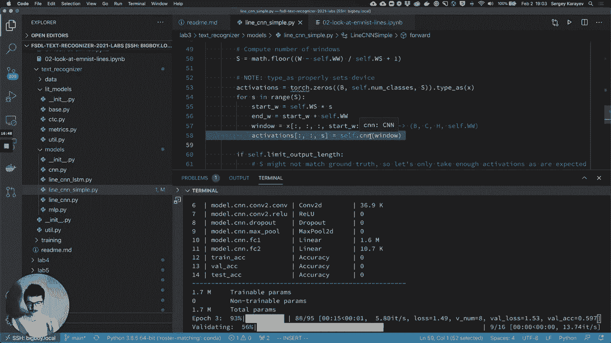

在介绍CTC之前，我们先优化模型效率。`LineCNNSimple` 在重叠窗口上重复计算了大量卷积操作，效率低下。

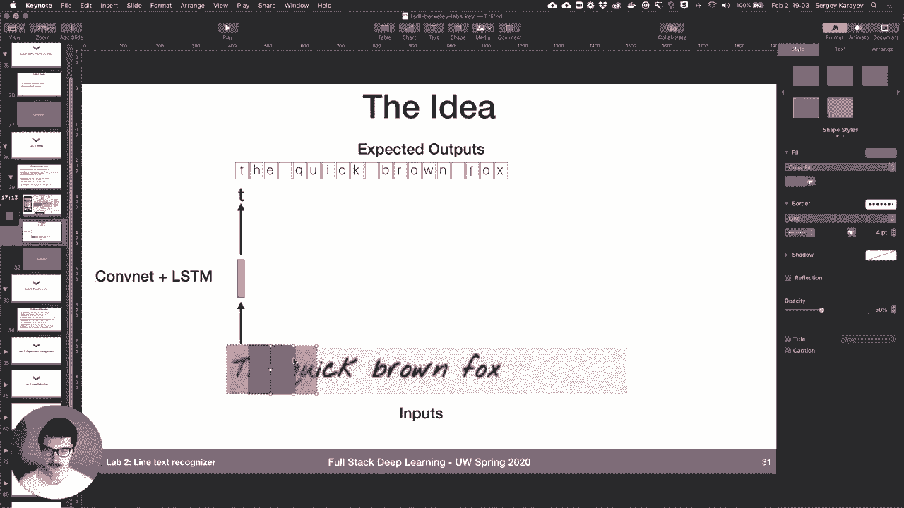

`LineCNN` 模型采用了不同的结构。它使用**步长为2的卷积层**进行下采样，替代了之前的最大池化层。最关键的是，它引入了一个**核高度与特征图高度相同**的卷积层。

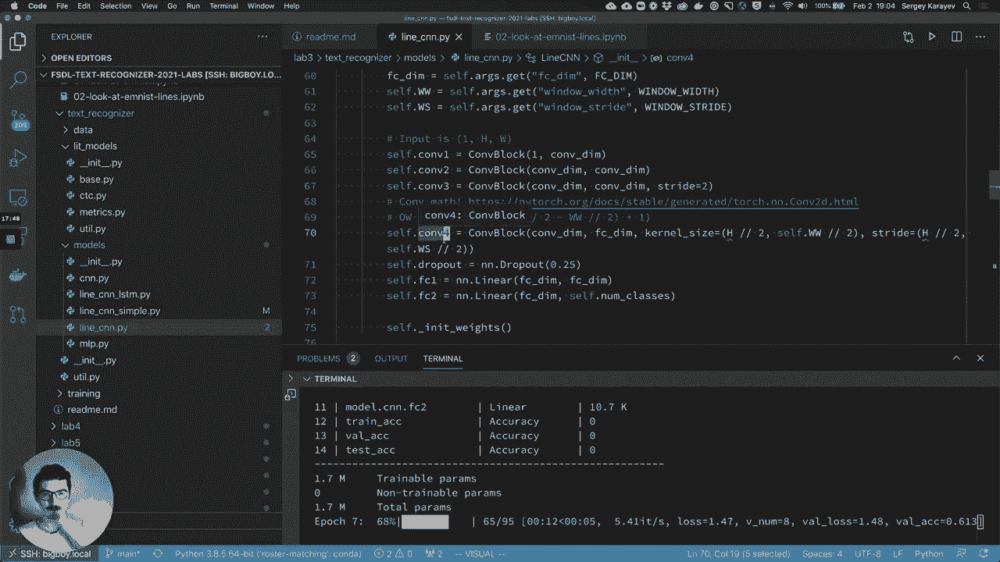

**代码示例：**
```python
# 这相当于一个在宽度方向上进行操作的“全连接层”
self.conv4 = nn.Conv2d(in_channels=64, out_channels=num_classes, kernel_size=(feature_height, 8))
```


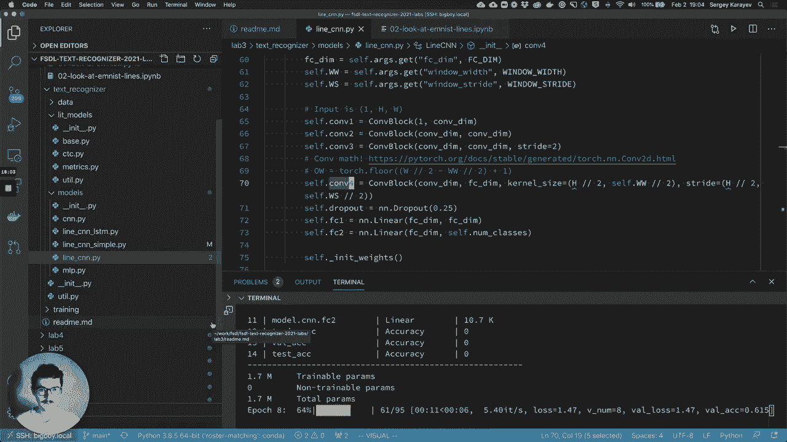

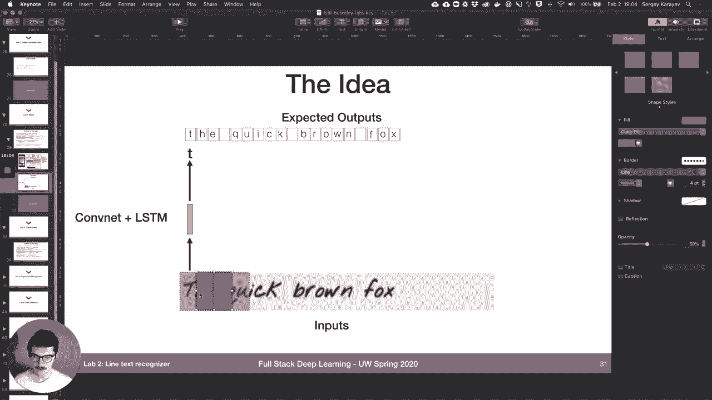

这个卷积层的作用类似于一个全连接层，但它是在整个特征图的宽度上并行操作的，一次性输出整个序列的激活图，避免了重复计算。`forward` 方法依次通过各层卷积，并进行一些尺寸计算以确保输出序列长度符合预期，最后可能再添加全连接层进行微调。

它的效果与 `LineCNNSimple` 相同，但运行速度更快。

---

## 🎯 模型三：引入CTC损失函数

真正的改进来自于CTC（Connectionist Temporal Classification）损失函数。我们将使用一个新的LitModel包装器：`CTCLitModel`。

`BaseLitModel` 负责初始化优化器、损失函数和评估指标（如准确率）。`CTCLitModel` 的不同之处在于：
*   **损失函数**：使用 `torch.nn.CTCLoss`。
*   **评估指标**：除了准确率，新增了**字符错误率（Character Error Rate, CER）**。

在训练步骤中，`CTCLitModel` 将模型输出的 logits 转换为概率（使用 softmax），并调整维度顺序以满足 `CTCLoss` 的输入要求 `(sequence_length, batch_size, num_classes)`。同时，它还需要提供输入序列长度和目标序列长度。

在验证和测试步骤中，除了计算损失，还需要计算字符错误率。这需要一个 `greedy_decode` 函数，其作用是在推理时，将模型输出的序列进行解码：**合并重复的字符，并移除空白标记（blank token）**。理解这个函数是作业的一部分。

使用相同的 `LineCNN` 模型，但将损失函数换为CTC，并在可变重叠的数据上训练，字符错误率可以从99%迅速下降到18%左右，效果显著提升。

---

## 🧬 模型四：LineCNN LSTM（结合上下文信息）

最后，我们在CNN提取的特征序列之上添加一个LSTM网络，以利用上下文信息进行更好的预测。

`LineCNNLSTM` 模型内部初始化了一个 `LineCNN` 和一个 **双向LSTM**。在前向传播过程中：
1.  输入图像先通过 `LineCNN`，得到 `(batch, classes, seq_len)` 的特征序列。
2.  调整维度为 `(seq_len, batch, classes)` 以适应LSTM输入。
3.  特征序列通过双向LSTM，输出两个方向的隐藏状态。
4.  将两个方向的输出相加，以融合上下文信息。
5.  通过一个全连接层进行最终映射。
6.  将输出维度调整回 `(batch, classes, seq_len)` 以供 `CTCLitModel` 使用。

添加LSTM后，模型参数从170万增加到230万。在CTC损失的基础上，结合LSTM的上下文建模能力，有望获得更低的字符错误率。

---

## 📝 作业与总结

在本节课中，我们一起学习了构建手写文本行识别器的完整流程：

1.  从简单的滑动窗口CNN（`LineCNNSimple`）开始，理解序列建模的基本思想。
2.  为了提高效率，将其改进为全卷积网络（`LineCNN`）。
3.  为了处理可变长度和重叠字符，引入了强大的CTC损失函数。
4.  最后，通过添加LSTM网络来利用序列的上下文信息，进一步提升模型性能。

**课后作业包括：**
*   实验不同的超参数（如 `window_width`, `window_stride`, `lstm_dim`）。
*   尝试修改模型结构（例如，在LSTM中添加注意力机制）。
*   描述 `character_error_rate` 指标的计算方式。
*   解释 `greedy_decode` 函数的具体作用和工作原理。

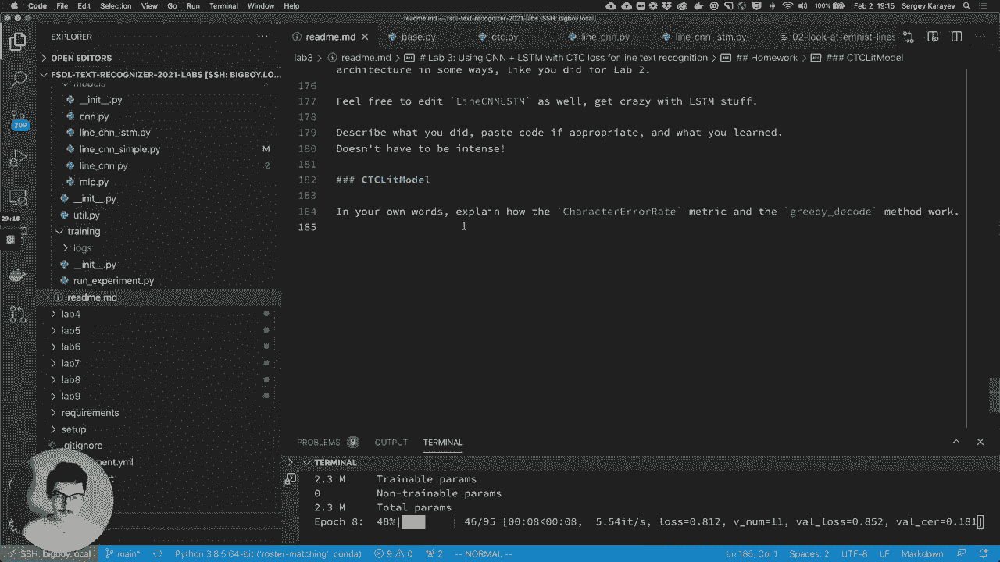

通过本实验，你应该对如何使用CNN、CTC和RNN（LSTM）来解决序列识别问题有了扎实的理解。