# 9：L4 - 迁移学习和 Transformer 🚀

在本节课中，我们将要学习迁移学习的概念，了解它如何从计算机视觉领域兴起并应用于自然语言处理。我们将探讨词嵌入、语言模型，以及被称为 NLP 的“ImageNet 时刻”的重要转折点。最后，我们将深入解析 Transformer 模型的核心机制——注意力机制，并介绍一系列基于 Transformer 的著名模型。

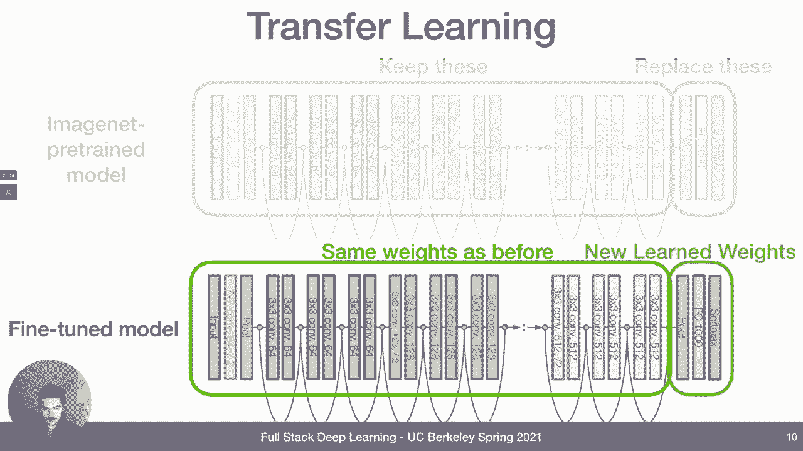

## 从计算机视觉到迁移学习

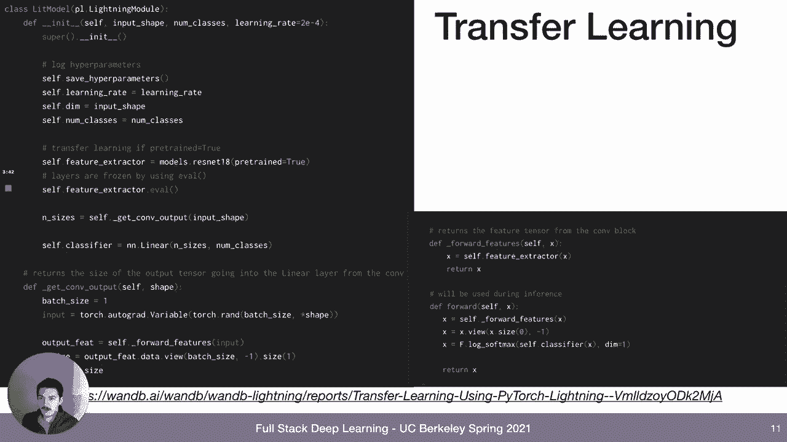

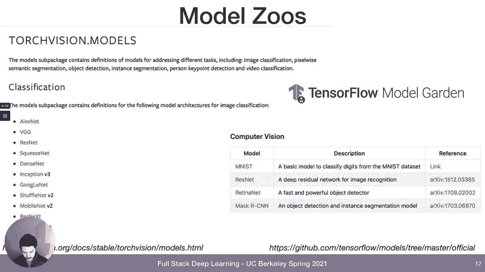

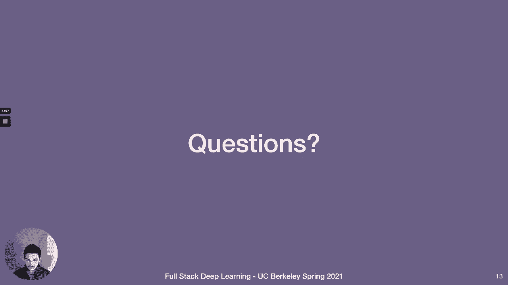

上一节我们概述了课程内容，本节中我们来看看迁移学习在计算机视觉中的起源。假设我们想对鸟类图像进行分类，但只有 10,000 张带标签的图像。相比之下，ImageNet 数据集拥有百万级图像，像 ResNet50 这样的深度神经网络在其中表现优异。然而，ResNet50 模型层数多、参数量大，在我们的小数据集上直接训练容易导致过拟合。

一种解决方案是，先在完整的 ImageNet 数据集上训练神经网络，然后在我们的小型鸟类数据上进行**微调**。这种方法通常能获得比任何其他方法都更好的性能。这就是迁移学习的核心概念。

在传统机器学习中，我们使用大量数据训练出一个大模型。而在迁移学习中，我们先在大数据上训练一个大模型，然后只需用少得多的数据，通过替换或添加新层的方式继续训练。这耗时更少且效果出色。

以下是迁移学习的一个典型流程：

1.  获取一个在大型数据集（如 ImageNet）上预训练好的模型。
2.  保留模型的前面若干层（特征提取器），移除最后的全连接层和 softmax 分类层。
3.  根据新任务，添加新的分类层。
4.  在小型新数据集上训练时，**冻结**预训练层的权重，只更新新添加层的权重。

在 PyTorch 中，实现迁移学习非常简便。以下是一个使用 PyTorch Lightning 的示例代码片段：

```python
import torchvision.models as models

class BirdClassifier(pl.LightningModule):
    def __init__(self, num_classes, pretrained=True):
        super().__init__()
        # 加载在 ImageNet 上预训练的 ResNet18
        self.feature_extractor = models.resnet18(pretrained=pretrained)
        # 冻结特征提取器的权重
        self.feature_extractor.eval()
        for param in self.feature_extractor.parameters():
            param.requires_grad = False
        # 替换最后的分类层
        num_features = self.feature_extractor.fc.in_features
        self.classifier = nn.Linear(num_features, num_classes)
```

PyTorch 的 `torchvision` 和 TensorFlow 的 `tf.keras.applications` 等模型库提供了大量现成的预训练模型，方便我们直接使用。

## 自然语言处理中的词向量表示

上一节我们介绍了计算机视觉中的迁移学习，本节中我们来看看如何将其思想应用到语言世界。首先需要解决的问题是，深度神经网络处理的是向量，而我们的输入通常是单词，因此需要将单词转换为向量。

一种简单的方法是**独热编码**。假设词典有 10,000 个词，要编码某个词，就生成一个长度为 10,000 的向量，仅在对应词的位置为 1，其余全为 0。这种方法存在几个问题：向量维度随词汇表增大而增高；向量非常稀疏；并且无法体现单词之间的语义相似性（例如，“跑”和“跑步”的距离与“跑”和“诗歌”的距离一样远）。

更好的方法是使用**词嵌入**，将稀疏的高维独热向量映射到稠密的低维向量空间。这通过一个嵌入矩阵实现：`嵌入向量 = 独热向量 × 嵌入矩阵`。嵌入矩阵的维度是 `词汇表大小 × 嵌入维度`。

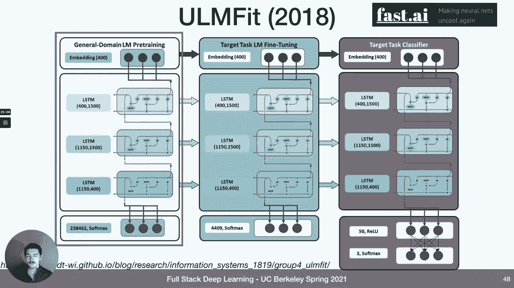

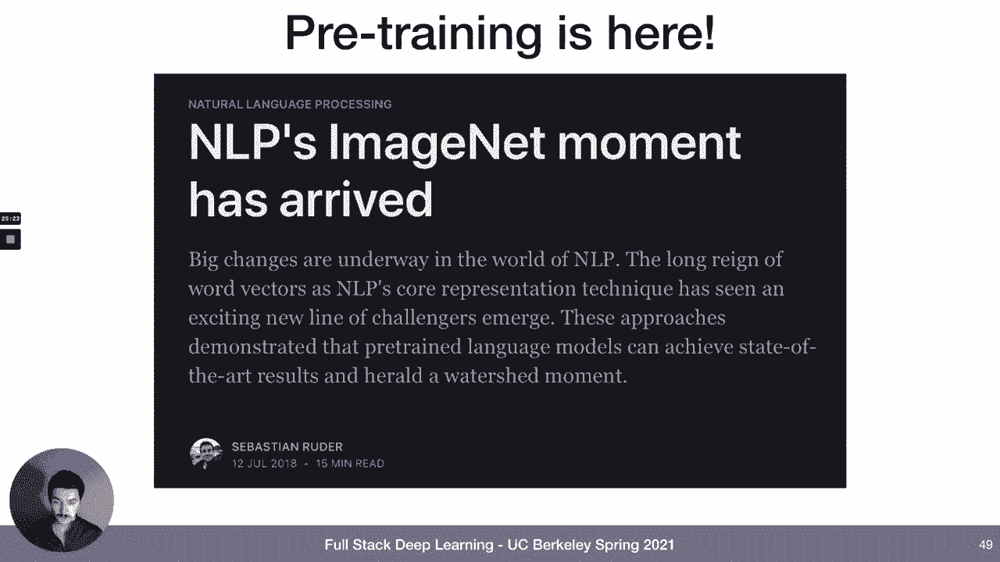

接下来的关键问题是，如何设定嵌入矩阵的值？一种方法是在特定任务中将其作为模型的一部分进行学习。另一种更通用的方法是**预训练**词嵌入，使其对多种任务都有用。这可以通过在大规模文本语料库（如维基百科）上训练一个语言模型来实现，例如训练模型预测下一个单词。

以下是构建训练数据的一种方式：

*   **N-gram 方法**：在语料库上滑动一个固定大小的窗口，形成 `(上下文词，目标词)` 对。
*   **Skip-gram 方法**（更高效）：对于中心词，同时用其周围的前后文词作为正样本，并采样一些非周围词作为负样本，将其构建为一个二分类问题（判断两个词是否相邻）。

通过这种方式学习到的词嵌入具有有趣的向量空间特性，例如可以进行向量运算（国王 - 男人 + 女人 ≈ 女王），并能捕捉动词时态、国家-首都等语义关系。

## NLP 的“ImageNet 时刻”与早期预训练模型

我们讨论了基于 ImageNet 的预训练和传统的词嵌入方法。现在，我们将探讨 NLP 的“ImageNet 时刻”，它结合了这两种趋势，大约发生在 2017-2018 年。

此前，Word2Vec 和 GloVe 等词嵌入方法通过预训练提升了各种 NLP 任务的性能，但提升幅度有限（通常不到 10%）。这些表示是“浅层”的，意味着只有模型的第一层（嵌入层）受益于预训练知识，更深层的网络仍需从头在小数据集上训练。

为了捕获更复杂的语言现象（如词性消歧、语法规则），我们需要预训练更深层的网络。**ELMo** 是这一方向的先驱之一（2018年）。它使用了一个双向堆叠的 LSTM 模型，通过预测单词来学习上下文相关的词表示。ELMo 在多项任务上显著提升了当时的最高水平，特别是在 SQuAD 问答数据集上。

为了理解这些进展，我们需要了解一些核心的 NLP 评测数据集：

*   **SQuAD**：阅读理解数据集，包含约10万个问题-答案对，答案均来自给定的原文段落。
*   **SNLI**：自然语言推理数据集，包含57万对句子，任务是判断两个句子之间的关系（蕴含、矛盾、中立）。
*   **GLUE**：通用语言理解评估基准，包含9个不同的任务（如情感分析、文本相似度、自然语言推理），旨在全面评估模型的语言理解能力。

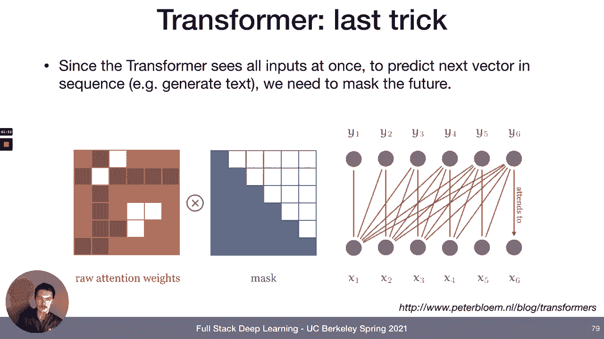

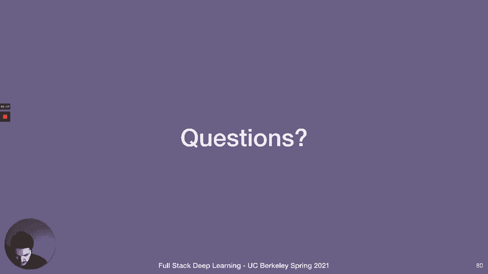

紧随 ELMo 之后，**ULMFiT** 模型也采用了类似的双向 LSTM 架构，并进一步推动了迁移学习在 NLP 中的应用。2018 年夏天，人们普遍认为 NLP 的“ImageNet 时刻”已经到来，预训练语言模型将成为未来处理所有 NLP 任务的标准方法。这一点也反映在 PyTorch 和 TensorFlow 的模型库中，开始涌现大量如 BERT、ALBERT、Transformer-XL 等预训练模型。

## Transformer 模型的核心：注意力机制

上一节我们看到了预训练语言模型的兴起，本节中我们来看看其背后的核心架构——Transformer。Transformer 始于 2017 年的论文《Attention Is All You Need》。它是一个编码器-解码器架构，但完全摒弃了 RNN 或 LSTM，仅使用注意力机制和全连接层，并在翻译任务上取得了突破性成果。

为了简化，我们聚焦于 Transformer 的**编码器**部分。其核心组件包括：
1.  自注意力
2.  位置编码
3.  前馈神经网络
4.  层归一化

首先，让我们详细探讨**自注意力**。其基本思想是：输入是一个序列的向量 `[x1, x2, ..., xt]`，输出也是一个序列 `[y1, y2, ..., yt]`。但每个输出向量 `yi` 都是所有输入向量的**加权和**。最初，权重可以是输入向量 `xi` 和 `xj` 的点积，并通过 softmax 归一化，使其和为 1。

为了引入可学习的参数，我们将每个输入向量 `xi` 通过三个不同的权重矩阵进行线性变换，生成三个新向量：
*   **查询向量 qi = Wq * xi**
*   **键向量 ki = Wk * xi**
*   **值向量 vi = Wv * xi**

然后，计算输出 `yi` 的公式为：
`注意力权重 αij = softmax(qi · kj / √dk)`
`yi = Σ(αij * vj)`
其中 `dk` 是键向量的维度，用于缩放点积。

**多头注意力**意味着我们并行地学习多组 `(Wq, Wk, Wv)` 矩阵，让模型能够同时关注来自不同表示子空间的信息。

然而，基本的自注意力对输入序列的顺序不敏感。为了解决这个问题，Transformer 引入了**位置编码**。我们将一个仅与单词在序列中位置相关的向量（位置嵌入）加到单词嵌入向量上。这样，输入向量就同时包含了语义信息和位置信息。

**层归一化**是一种技术，用于稳定深度网络的训练。它在每个子层（自注意力和前馈网络）之后应用，将激活值重新调整为均值为 0、方差为 1，有助于缓解训练过程中的梯度问题。

对于像 GPT 这样的生成式模型，还需要使用**掩码**。在训练时，为了防止模型在预测当前位置时“偷看”未来的信息，会在计算注意力权重时，将未来位置的权重掩码掉（设为负无穷），迫使模型只能关注过去的信息。

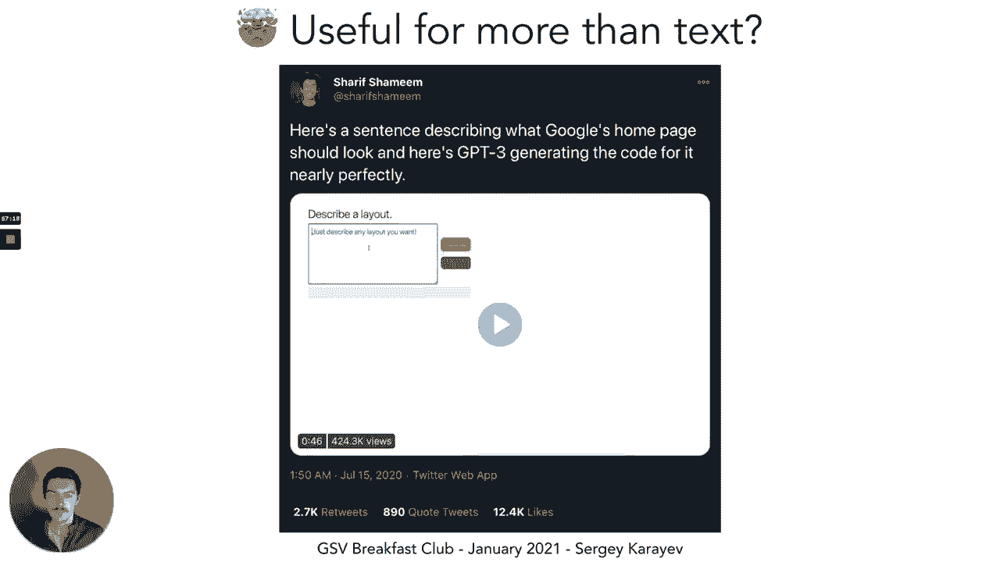

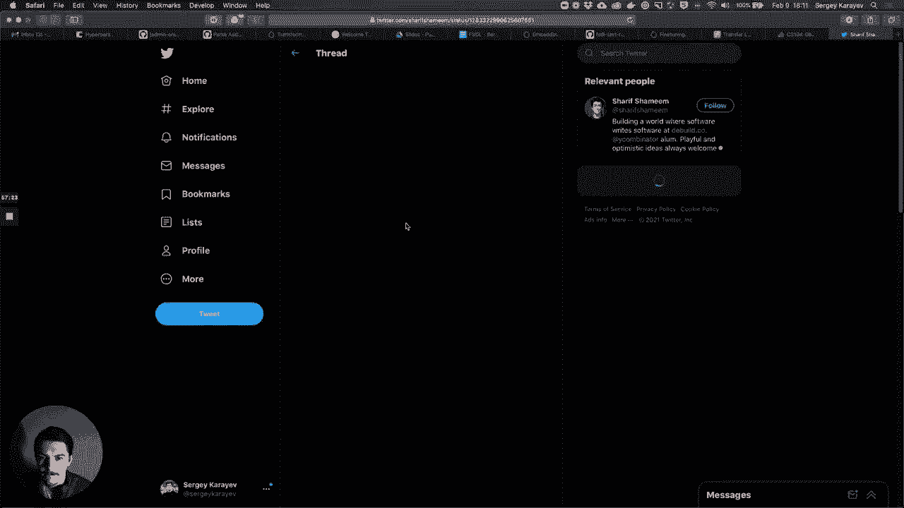

## 基于 Transformer 的著名模型演进


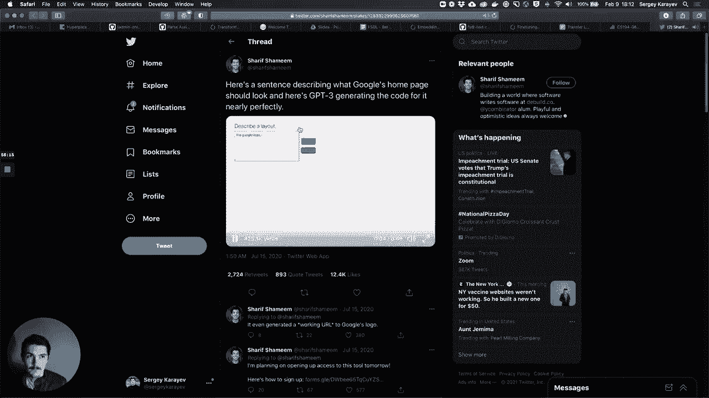

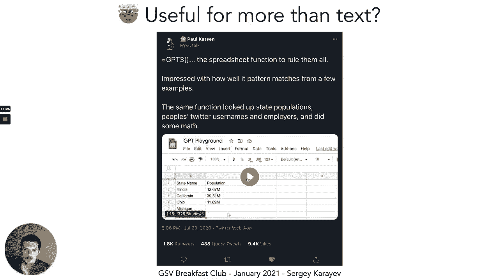


理解了 Transformer 的核心机制后，本节中我们来看看一系列基于它构建的、影响深远的模型。

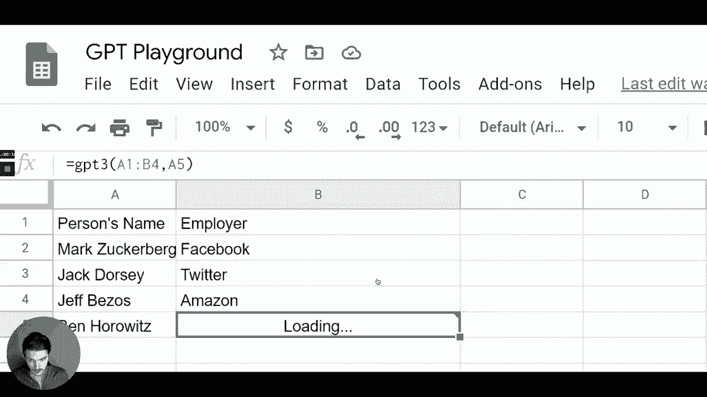

*   **GPT（生成式预训练 Transformer）**： 使用 Transformer 的解码器部分，通过预测下一个单词进行训练（自回归）。它采用了掩码注意力，只能关注左侧上下文。初代 GPT 在约 800 万个网页上训练。
*   **BERT（双向编码器表示）**： 使用 Transformer 的编码器部分，是双向的（无掩码）。其训练采用了两个任务：1) **掩码语言模型**：随机遮盖输入中的一些词，让模型预测它们；2) **下一句预测**：判断两个句子是否连续。BERT-large 拥有 3.4 亿参数。
*   **T5（文本到文本传输 Transformer）**： 回归完整的编码器-解码器架构。其创新在于将所有 NLP 任务都统一为“文本到文本”的格式。例如，输入可以是 `“翻译英文为法文：That is good.”`，输出则是 `“C‘est bon.”`。T5 在巨大的 “Colossal Clean Crawled Corpus” 上训练，参数达 110 亿。
*   **GPT-3**： GPT 系列的第三代，模型规模急剧扩大，达到 1750 亿参数。它展示了惊人的上下文学习能力，只需在输入中给出几个示例（少样本学习），就能执行新任务。由于其强大的生成能力和潜在滥用风险，OpenAI 未开源其权重，仅通过 API 提供访问。
*   **模型小型化探索**： 鉴于大模型训练成本高昂，研究者也在探索“以小博大”。例如 **DistilBERT** 使用知识蒸馏技术，用一个更小的模型去学习 BERT 的输出，在参数减少 40% 的情况下保留了 97% 的性能。

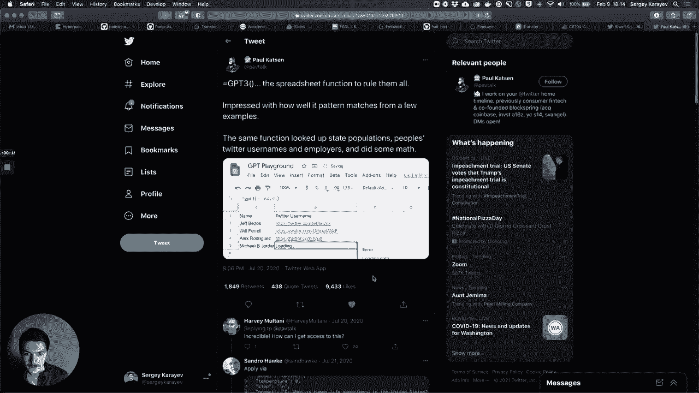

这些模型的演进呈现出一个明显趋势：**扩大模型规模（参数和数据）能持续提升性能**。这被强化学习先驱 Rich Sutton 称为“苦涩的教训”，即长期来看，利用计算能力的通用方法（如缩放神经网络）最终会胜过依赖大量人类精心设计的算法。

## 总结与工具推荐

本节课中，我们一起学习了迁移学习的思想及其从计算机视觉到自然语言处理的应用历程。我们深入探讨了将单词表示为向量的方法，见证了以 ELMo、BERT 为代表的 NLP“ImageNet 时刻”。我们重点剖析了 Transformer 模型，理解了其核心——自注意力机制、位置编码等组件的工作原理。最后，我们回顾了 GPT、BERT、T5、GPT-3 等基于 Transformer 的里程碑式模型，并看到了模型规模化发展的趋势与挑战。

对于希望跟进最新研究或应用这些模型的学习者，以下工具和资源非常有用：

*   **Hugging Face Transformers**： 一个提供了数千个预训练 Transformer 模型的 Python 库，支持 PyTorch 和 TensorFlow，极大简化了使用和实验过程。
*   **Papers With Code**： 网站，将最新的研究论文与其代码实现链接起来，并按任务和数据集排名。
*   **NLP Progress**： 网站，追踪各 NLP 任务上的最新技术水平（SOTA）。

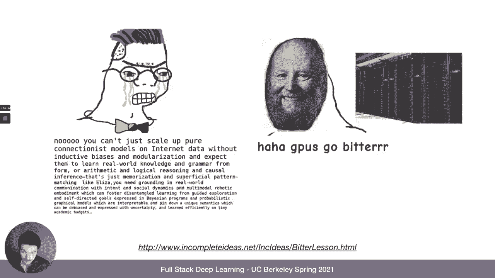

通过本课的学习，你应该对现代 NLP 的基石——迁移学习和 Transformer 架构——有了一个清晰而全面的认识。