# 11：L5 - 机器学习项目全流程 🚀

在本节课中，我们将学习如何成功启动和管理一个端到端的机器学习项目。课程将涵盖项目生命周期、项目选择与优先级评估、项目类型、关键指标设定以及基线建立等核心内容。我们将通过一个“姿态估计”的案例研究来贯穿始终，帮助初学者理解如何将理论应用于实践。

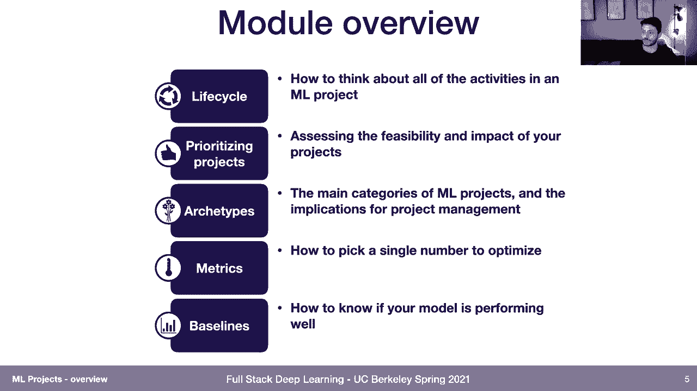

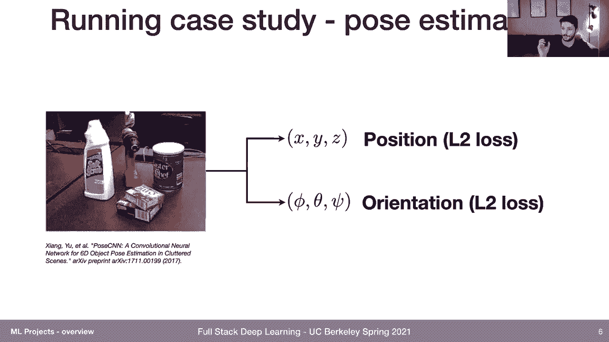

## 机器学习项目生命周期 🔄

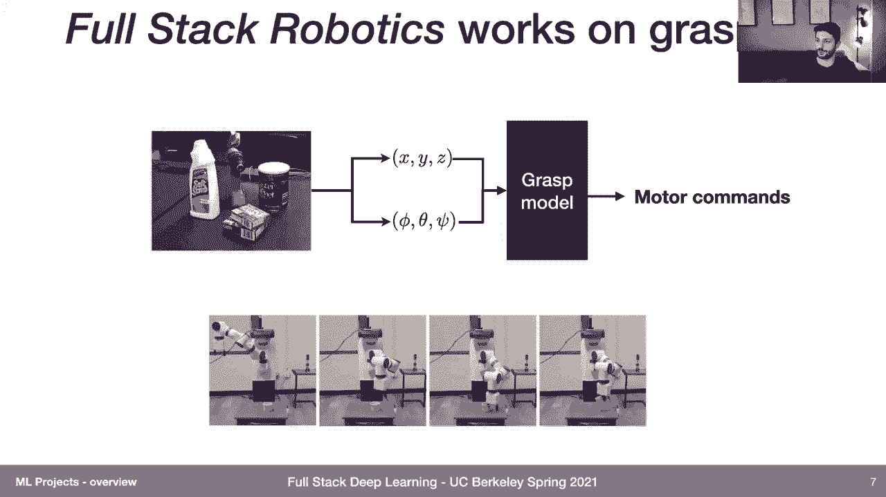

上一节我们介绍了课程概览，本节中我们来看看一个机器学习项目从构思到上线的完整生命周期。这个过程并非线性，而是一个需要不断迭代和回溯的循环。

一个典型的机器学习项目生命周期包含以下几个主要阶段：

1.  **规划与项目启动**：决定项目方向，明确需求和目标，分配资源，并考虑项目的伦理影响。
2.  **数据收集与标注**：收集原始数据，设置传感器（如摄像头），并找到方法为数据标注真实值（Ground Truth）。
3.  **模型训练与调试**：实现基线模型，复现前沿研究，花费大量时间调试模型，并尝试改进模型架构。
4.  **部署与测试**：运行试点项目，编写回归测试以防止后续改动破坏模型，并评估模型的偏见问题。
5.  **生产发布与迭代**：将模型部署到生产环境，并根据实际表现循环回到之前的阶段进行优化。

**关键点**：机器学习项目是一个迭代循环。例如，在数据收集阶段，你可能会发现任务定义得太难，从而需要回到规划阶段重新调整。同样，在部署后，你可能会发现数据分布偏移，需要回到数据收集阶段。

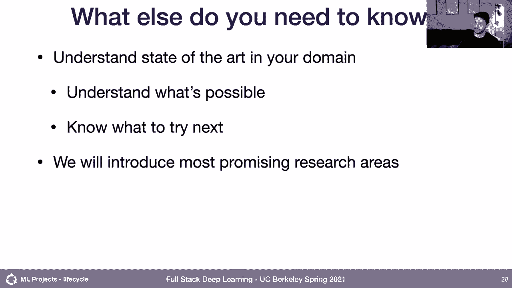

除了项目层面的活动，作为一个机器学习团队，还需要解决跨项目的基础设施和工具建设问题。

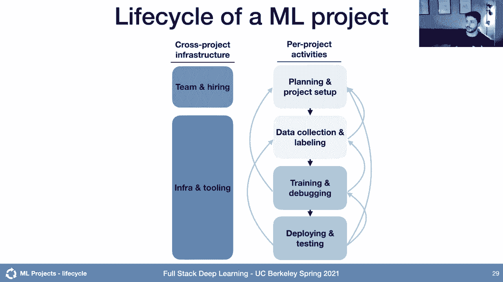

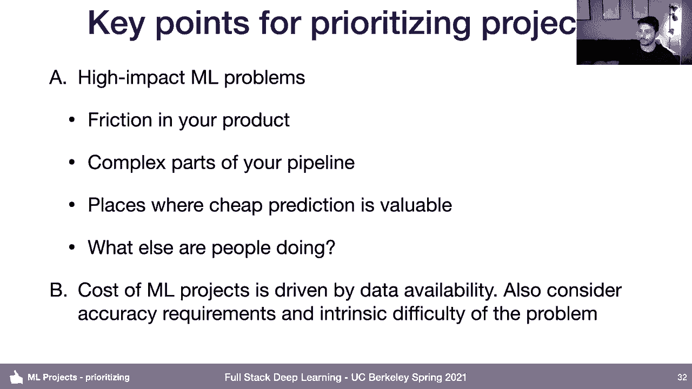

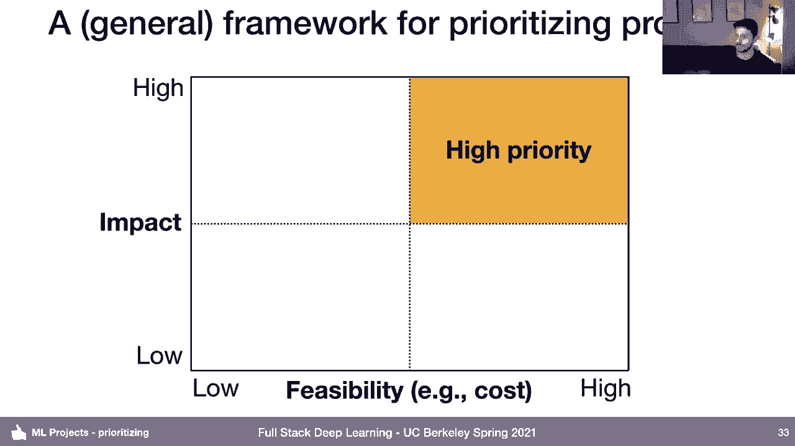

## 如何选择与评估机器学习项目 📊

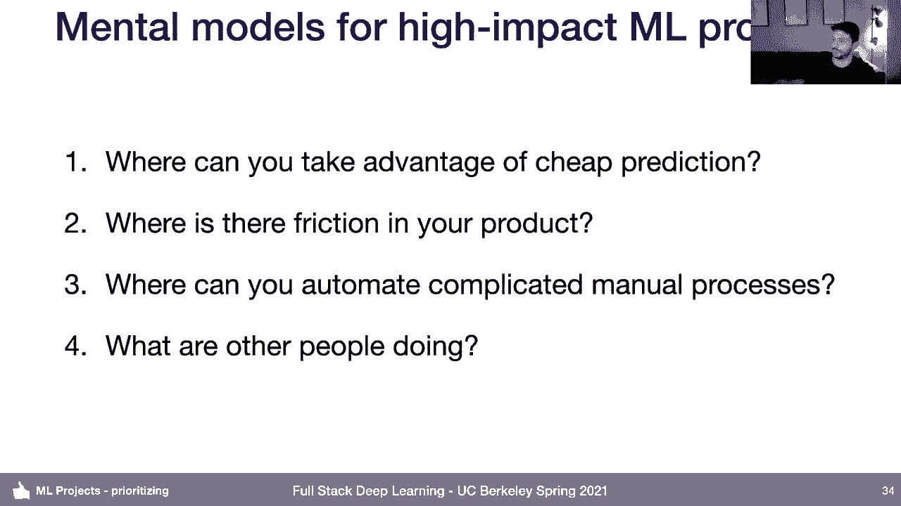

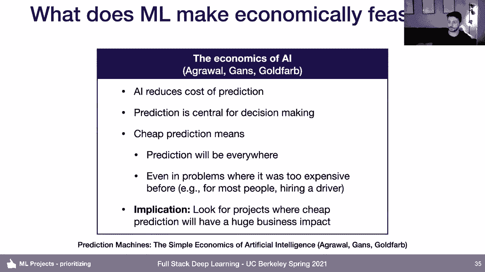

了解了项目生命周期后，我们需要知道如何选择一个好的起点。本节我们将探讨如何评估项目的潜在影响和可行性，从而进行优先级排序。

一个通用的项目优先级评估框架是寻找**高潜在影响**且**相对可行**的项目。我们可以从两个维度来评估：

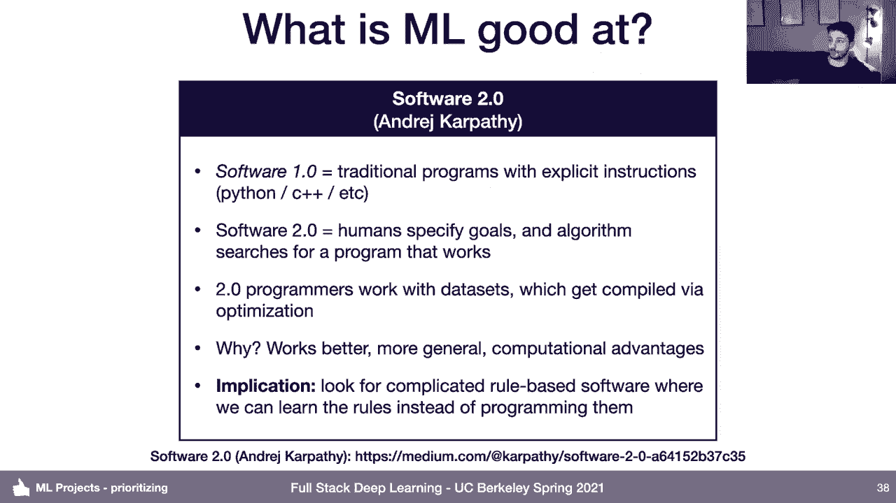

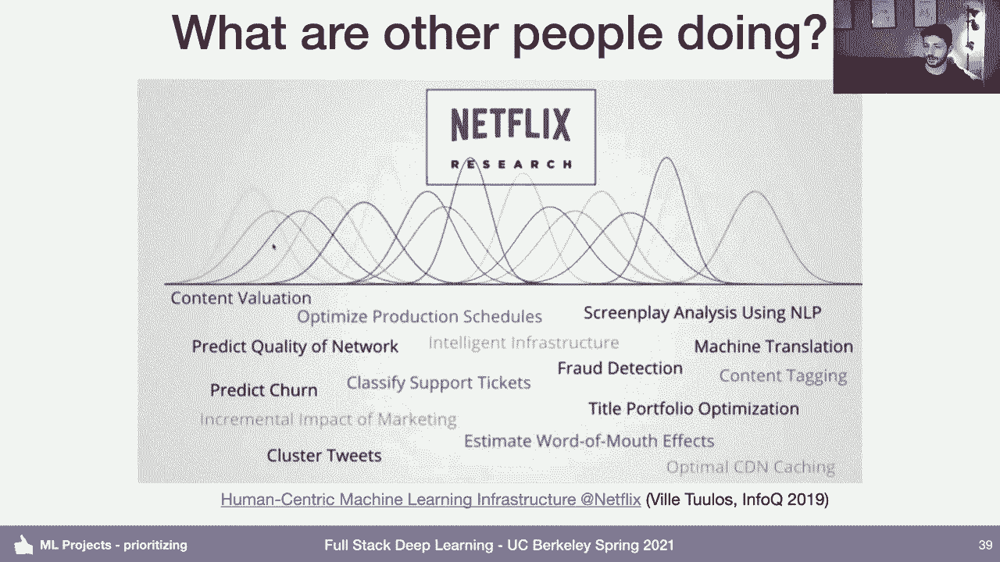

*   **潜在影响**：项目成功能带来多大价值？
*   **可行性**：项目成功的可能性有多大？

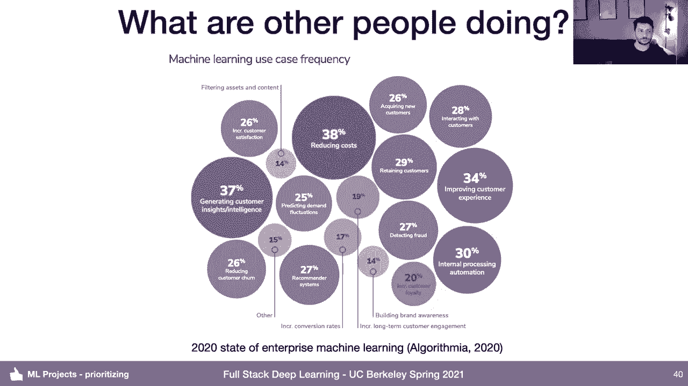

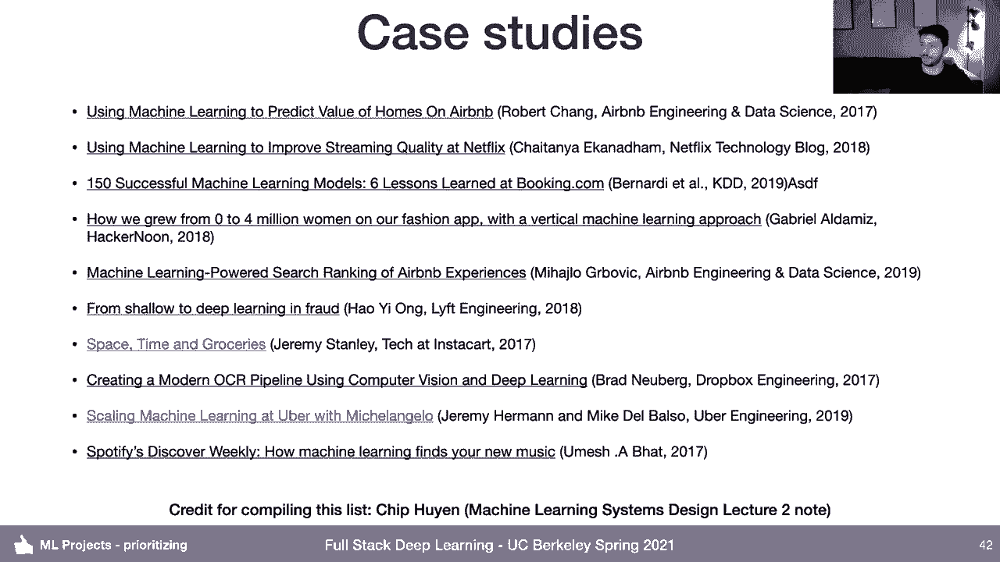

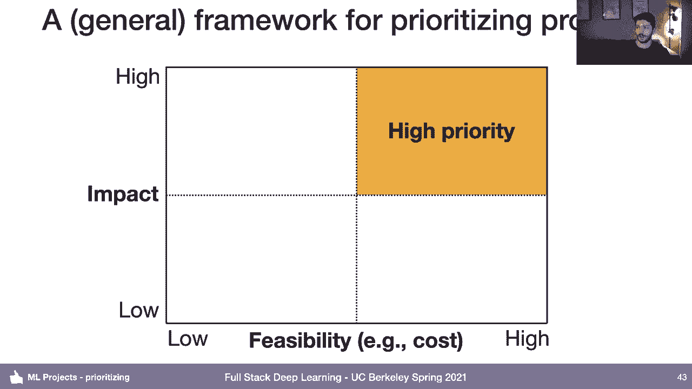

以下是评估项目潜在影响的几种思路：

*   **利用廉价预测**：寻找那些原本需要专家判断，但通过机器学习可以低成本自动化的预测任务。
*   **消除产品摩擦点**：从产品体验出发，寻找用户操作中高摩擦、低效的环节，用机器学习将其自动化。
*   **替代复杂规则系统**（软件2.0）：寻找现有系统中由复杂、手工规则驱动的部分，用从数据中学习到的模型来替代。
*   **借鉴行业实践**：参考其他成功公司（如Netflix、Spotify）或行业报告中的机器学习用例，获取灵感。

评估项目可行性时，主要考虑以下三个成本驱动因素：

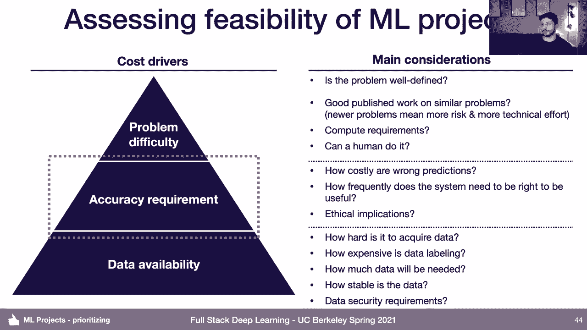

1.  **数据可用性**：数据是否容易获取？标注成本高吗？需要多少数据？数据是否稳定（分布是否随时间变化）？是否有数据安全限制？
2.  **准确率要求**：错误预测的代价有多大（如自动驾驶 vs. 推荐系统）？系统需要多高的准确率才能有用？是否有公平性等伦理考量？
3.  **问题内在难度**：问题是否被明确定义为机器学习问题？是否有类似问题的已发表工作？这些工作的计算成本（训练和推理）如何？人类能否仅凭模型可用的输入就解决该问题？

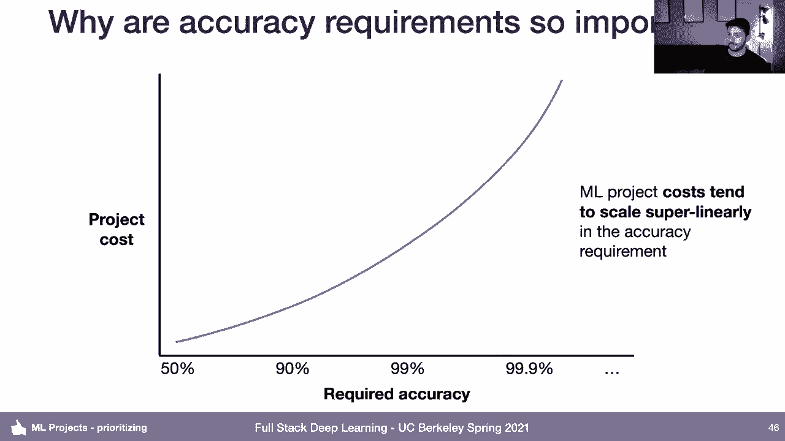

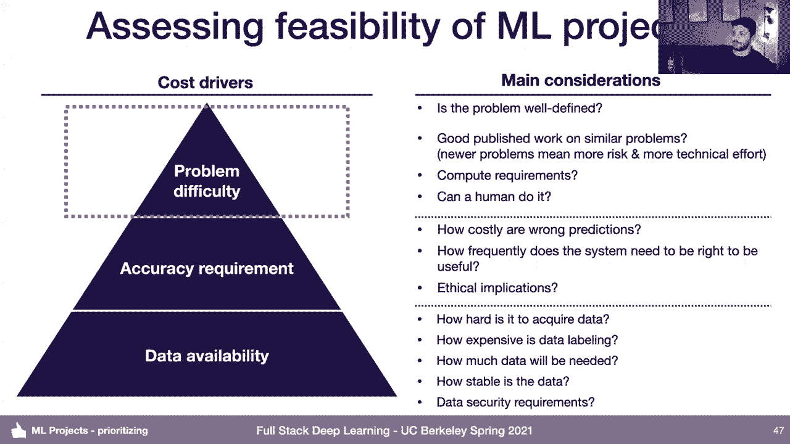

**重要提示**：项目成本通常随准确率要求呈超线性增长。将准确率从99.9%提升到99.99%所需的努力和资源，可能比从90%提升到99%还要多。

**案例研究：姿态估计的可行性评估**
*   **影响**：可靠的姿态估计是实现机器人抓取的关键，可以替代传统复杂、脆弱的机器人流程。
*   **可行性**：
    *   *数据*：相对容易在实验室收集，但3D姿态标注可能有挑战（可通过仪器辅助解决）。
    *   *准确率*：需要较高精度（如位置误差<0.5厘米）才能成功抓取，但单次失败成本低。
    *   *问题难度*：有相关研究，但需适配到特定机器人和物体上，属于中等偏低难度。

## 机器学习项目类型及其策略 🏗️

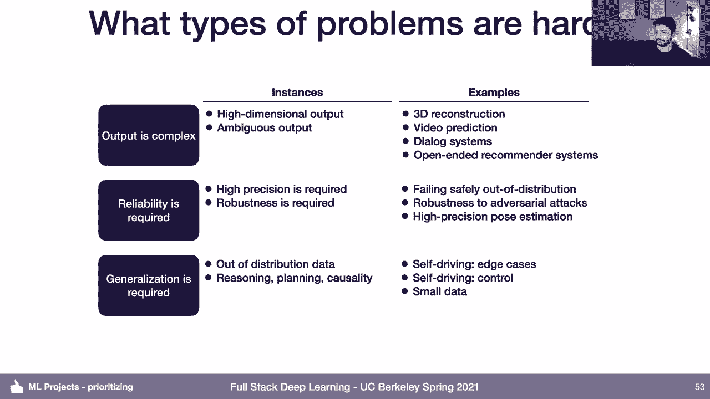

根据项目目标的不同，机器学习项目可以分为几种典型类型，每种类型的管理策略和成功要点也不同。

以下是三种常见的项目类型：

1.  **软件2.0项目**：用机器学习改进现有规则系统。例如，改进代码补全算法、推荐系统或游戏AI。
    *   **关键问题**：性能提升是否转化为业务价值？是否能形成数据飞轮？
2.  **人在环路项目**：模型的输出需要经过人工审核。例如，草图转幻灯片、邮件自动补全、辅助放射科医生。
    *   **关键问题**：系统需要达到多好才有用？如何收集足够数据使其达到可用水平？
3.  **自治系统项目**：系统在现实世界中自主做出决策。例如，全自动驾驶、全自动客服。
    *   **关键问题**：可接受的失败率是多少？如何保证系统不超出该失败率？能否低成本地标注系统产生的数据？

**数据飞轮**：这是项目成功的黄金标准。它指“更好的模型 → 更好的产品 → 更多用户 → 更多数据 → 更好的模型”这样一个正向反馈循环。建立数据飞轮能显著提升项目的可行性和长期价值。

**通过产品设计降低难度**：优秀的产品设计可以降低对模型准确率的苛刻要求，从而提高项目可行性。
*   **示例**：Facebook照片标签是“建议”而非“自动执行”；Grammarly提供修改解释而非强制修改；推荐系统提供多个选项而非单个推荐。

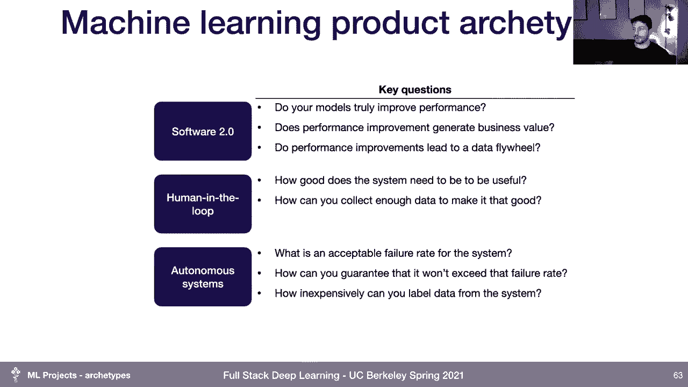

**资源推荐**：苹果的《机器学习产品设计指南》和微软的《人机交互指南》提供了如何设计优秀机器学习产品的宝贵启发。

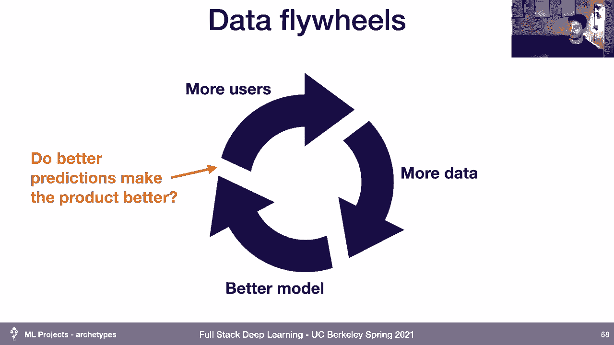

**使自治系统更可行**：可以通过使其“不那么自治”来降低难度，例如加入安全员（人在环路）、设置运行护栏（如限定运行区域），或大幅缩小问题初始范围（如先解决养老社区内的自动驾驶）。

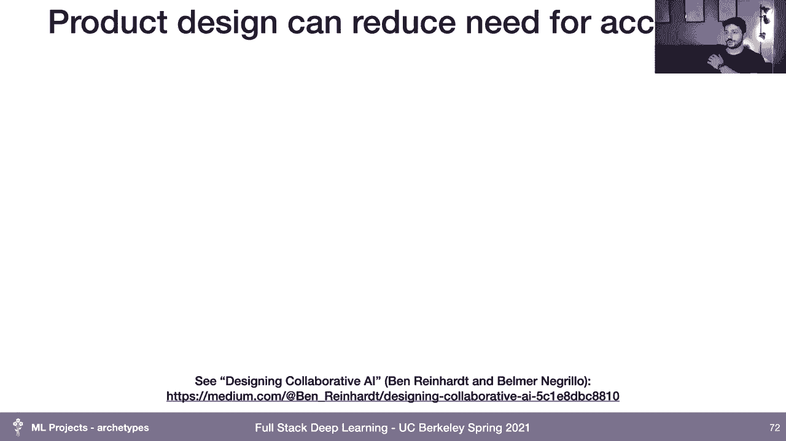

## 如何选择与优化评估指标 📈

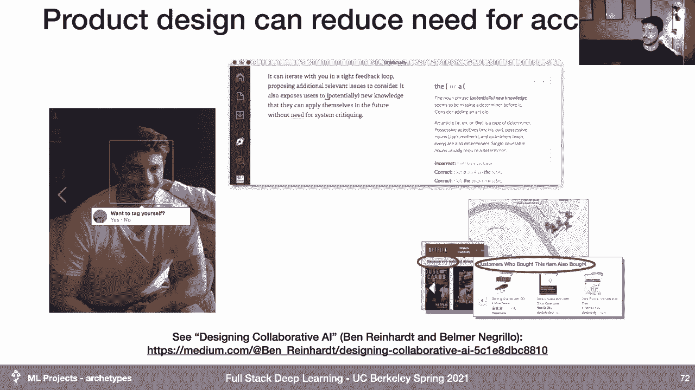

确定了项目方向后，我们需要一个明确的“指挥棒”来指导模型优化。本节我们讨论如何从众多关心的指标中，选出一个当前需要集中优化的单一指标。

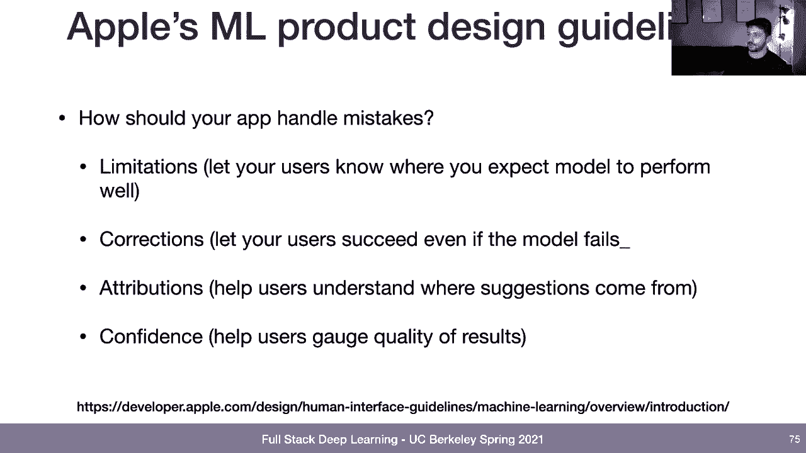

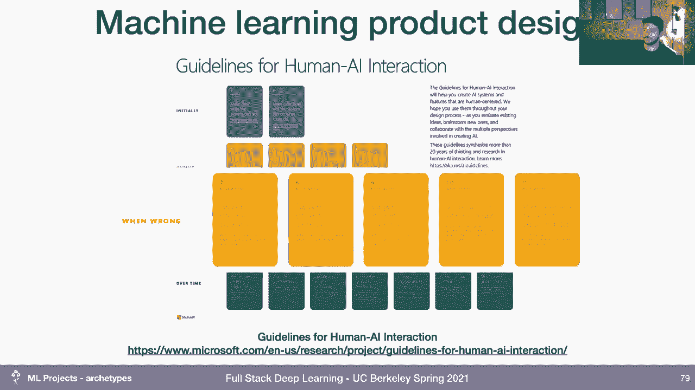

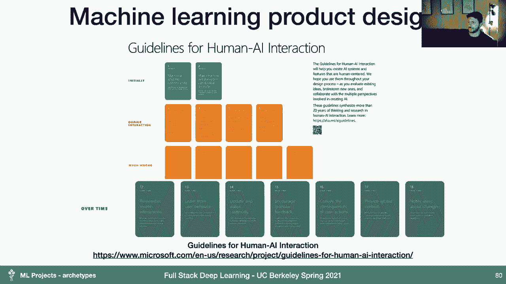

**为什么需要单一优化指标？**
现实世界是复杂的，我们几乎总是关心多个指标（如准确率、延迟、模型大小）。但在模型训练、评估和比较过程中，如果同时优化多个目标，会难以抉择。拥有一个单一指标能极大简化迭代过程。

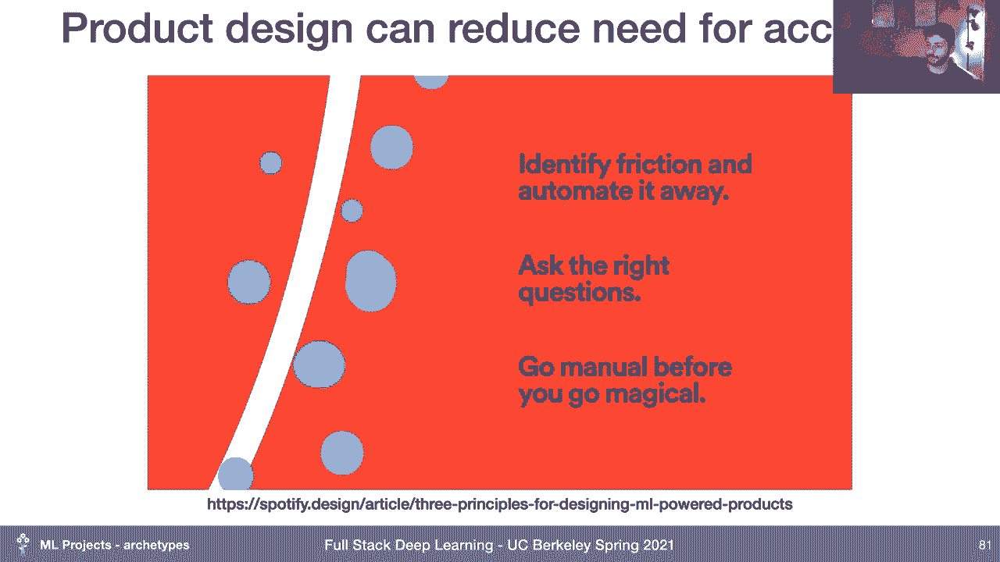

**如何将多个指标合并为单一指标？**
以下是几种常见策略：

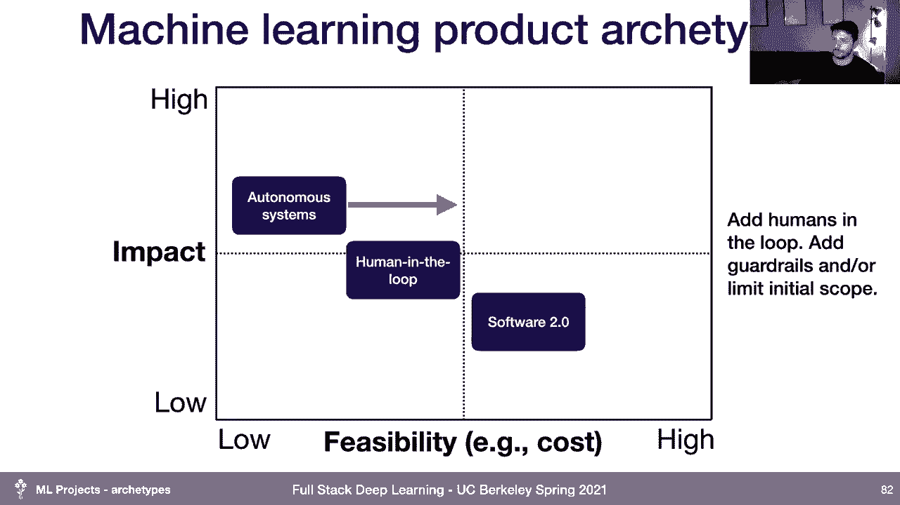

1.  **取平均值或加权平均值**：例如，对精确率和召回率取平均（F1分数）。
2.  **设定满意度指标**：这是**最常用**的策略。对`N`个关心的指标，为其中`N-1`个设定**性能阈值**（满意度指标），然后优化剩下的那一个指标。
    *   **示例**：在满足“模型大小 < 100MB”和“推理延迟 < 50ms”的前提下，尽可能优化准确率。
3.  **使用领域特定复合指标**：某些领域有公认的复合指标。例如，在目标检测中常用**平均精度均值**。

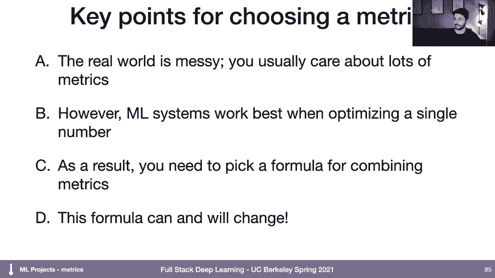

**如何选择要优化的指标？**
这需要结合领域知识和项目阶段来判断：
*   **领域依赖性**：某些指标可能更容易通过工程手段优化（如缓存可以优化延迟），而准确率则必须通过改进模型。
*   **指标敏感性**：选择那些对模型架构变化更敏感的指标进行优化。
*   **项目阶段**：在早期，让模型“能工作”可能比满足所有生产约束更重要。随着进展，再切换优化重点。

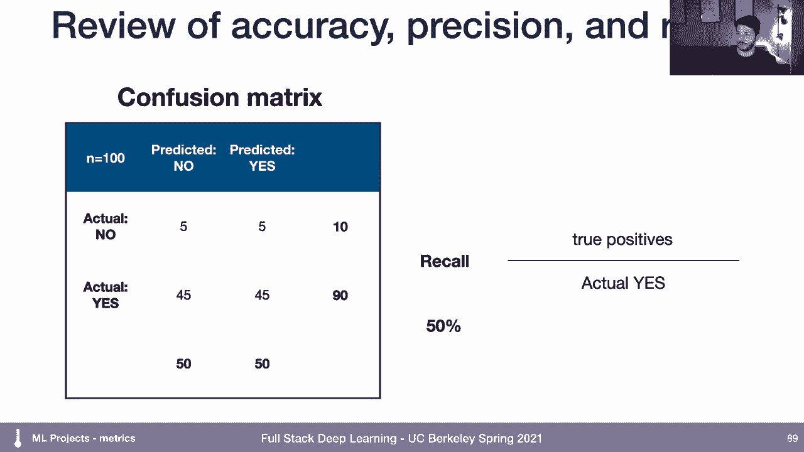

**案例研究：姿态估计的指标选择**
*   **需求清单**：位置误差 < 1厘米，角度误差 < 10度，推理时间 < 100毫秒。
*   **现状评估**：初步模型的位置误差接近1厘米，角度误差高达60度，推理时间远超100毫秒。
*   **决策**：
    1.  **阈值指标**：位置误差（设定阈值1厘米，避免模型变差）。
    2.  **优化指标**：角度误差（当前差距最大，是主要瓶颈）。
    3.  **暂时忽略**：推理时间（先解决功能问题，再优化性能）。
*   **迭代**：当角度误差降低到接近10度后，再将优化重点切换到推理时间上。

**核心公式示例：F1分数（精确率与召回率的调和平均数）**
`F1 = 2 * (Precision * Recall) / (Precision + Recall)`

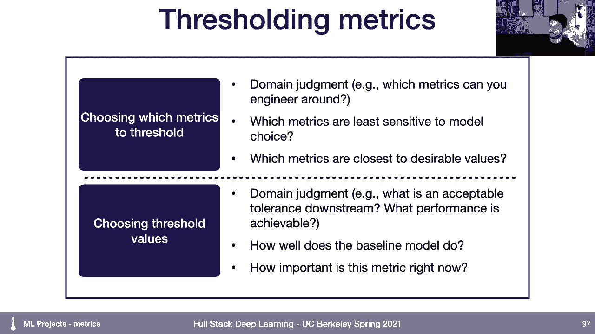

## 建立有效的性能基线 🎯

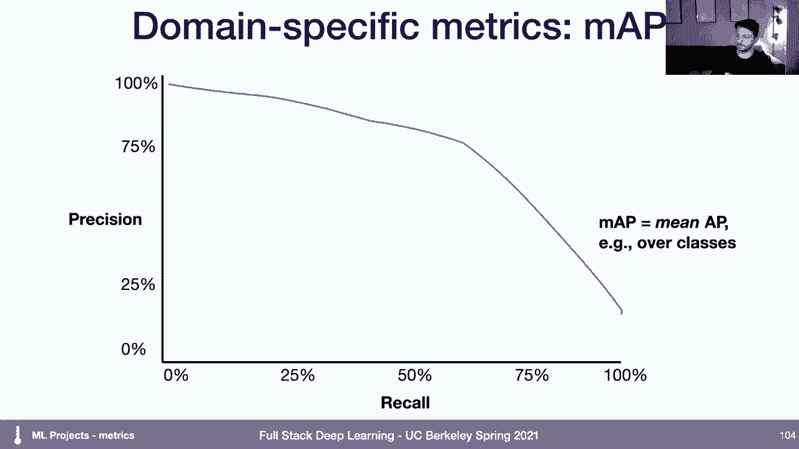

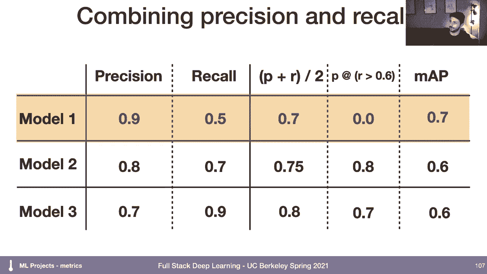

最后，为了判断模型性能的好坏，我们需要一个参照物——基线。本节我们学习为什么需要基线以及如何建立好的基线。

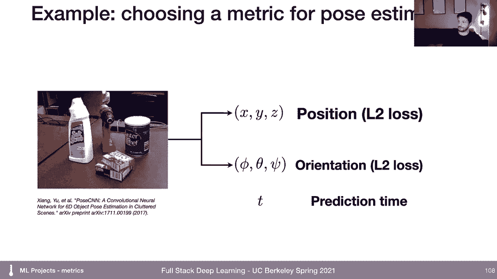

**为什么基线很重要？**
基线给出了模型性能的**下限期望**。一个好的基线能告诉你模型是否真的学到了东西，并指导你下一步的优化方向。

**示例**：相同的训练/验证损失曲线，如果基线（如人类性能）很高，说明模型欠拟合，应优先提升模型容量；如果基线很低且训练损失已接近基线，但验证损失高，说明模型过拟合，应优先解决泛化问题。

**基线来源有哪些？**
*   **外部基线**：
    *   **项目需求**：将产品需求直接作为基线。
    *   **已发表成果**：查阅论文中在相似问题上的结果（需注意数据差异可能造成不公平比较）。
*   **内部基线**：
    *   **基于规则的脚本**：使用启发式方法或传统算法（如OpenCV函数）构建一个解决方案。这是**非常强大**的基线。
    *   **简单机器学习模型**：使用线性回归等简单模型作为基线。如果你的复杂模型不如它，说明数据或模型有问题。
    *   **简单统计值**：例如，对于回归任务，使用目标值的平均值作为预测。这是一个最低限度的合理性检查。
    *   **人类表现**：这是**非常有力**的基线，尤其当你的标签也来自人类时。它几乎代表了模型性能的上限。

**如何获取人类表现基线？**
在标注质量、成本和可扩展性之间存在权衡：
*   **众包平台**：成本低，易扩展，但质量可能不高。
*   **众包+集成**：让多人标注同一数据并集成结果，质量更好，成本稍高。
*   **领域专家**：质量最高，但成本昂贵且难以扩展。

**选择策略**：应选择在项目预算内，既能提供高质量基线，又能在未来相对容易地扩展数据标注的方案。

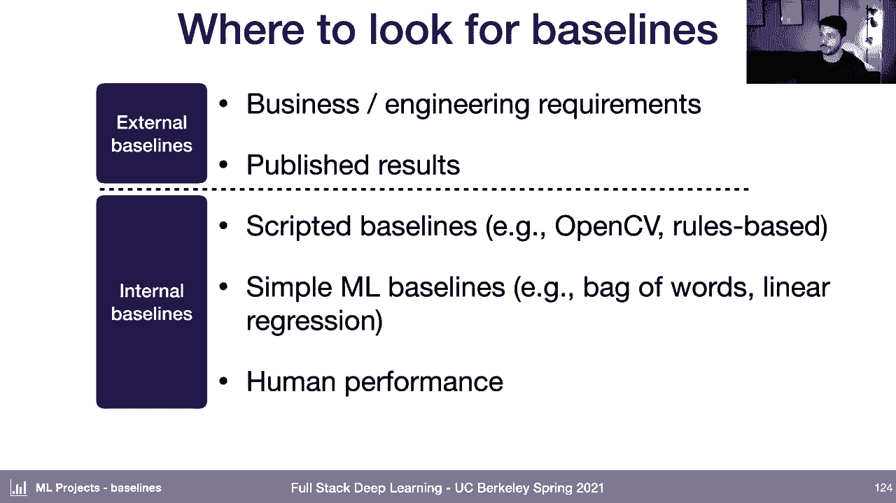

## 课程总结 🎓

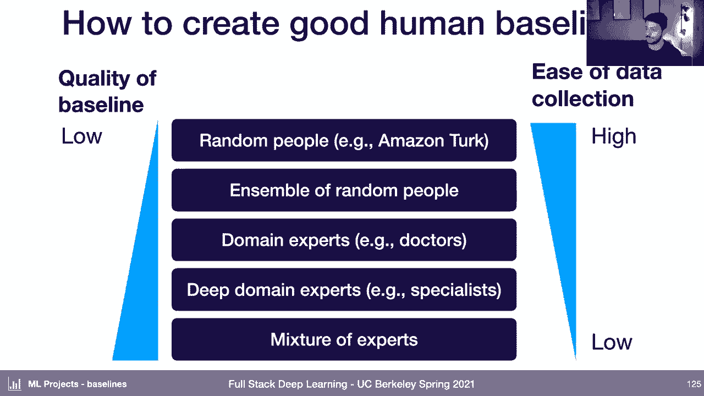

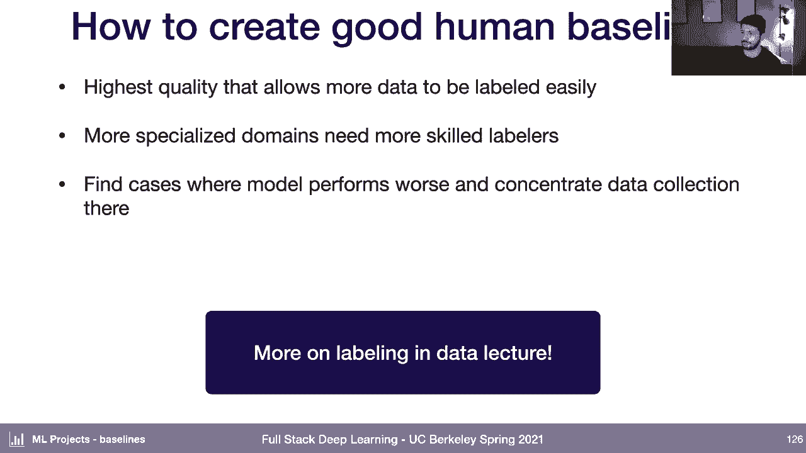

本节课中我们一起学习了成功启动和管理机器学习项目的核心框架：

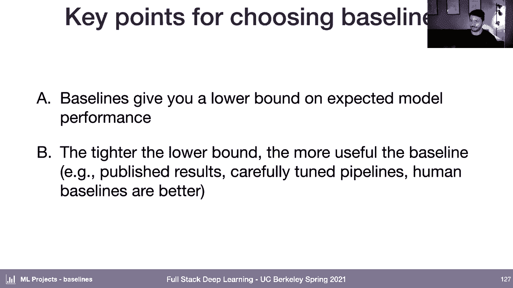

1.  **项目生命周期**：理解机器学习项目是一个非线性的迭代循环，尽早完成循环（快速部署）有助于加速迭代。
2.  **项目选择与评估**：寻找**高影响**（如利用廉价预测、消除产品摩擦）且**相对可行**（数据易得、错误成本低、问题定义清晰）的项目。
3.  **项目类型与策略**：识别项目属于**软件2.0**、**人在环路**还是**自治系统**类型，并采取相应策略（如建立数据飞轮、通过产品设计降低难度、添加安全护栏）来提高成功率。
4.  **评估指标**：在现实中关心多个指标，但在**任一给定时间点**，应集中优化一个单一指标（通常通过为其他指标设定阈值来实现），并随着项目进展重新评估优化重点。
5.  **性能基线**：建立好的基线（如规则系统、人类表现）至关重要，它能提供性能下限，帮助你诊断问题是欠拟合还是过拟合，从而将优化精力投入到正确的地方。

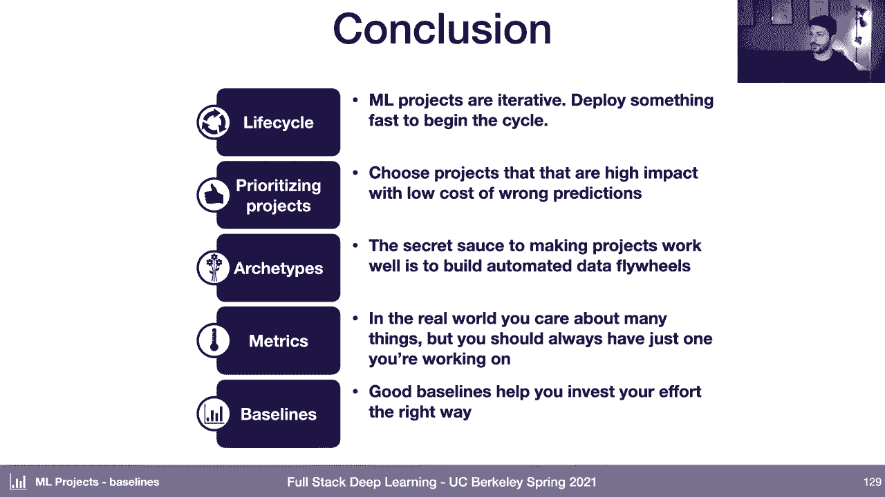

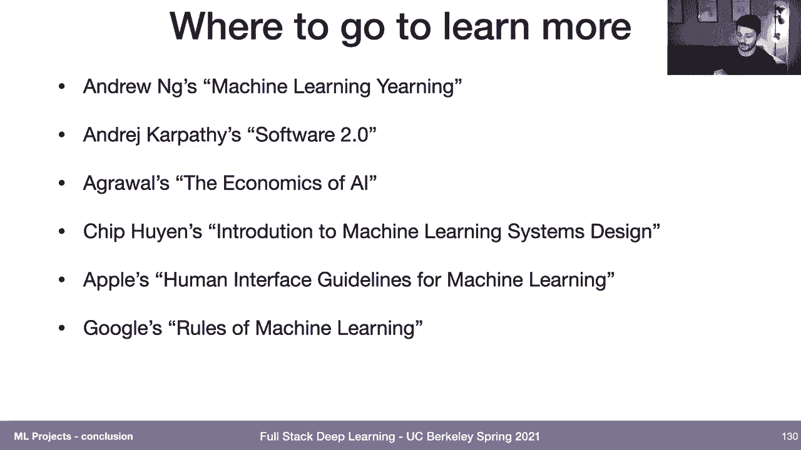

通过将这些原则应用于像“全栈机器人公司姿态估计”这样的案例，我们可以更有条理、更高效地将机器学习想法转化为实际可用的生产系统。