# 12：L6 - 基础设置与工具 🛠️

在本节课中，我们将学习构建和运行机器学习系统所需的基础设施与工具。我们将从理想的工作流程开始，探讨现实中的挑战，并详细介绍从软件开发、计算资源管理到实验跟踪和模型部署的各个环节。

## 概述

机器学习从业者的理想是：提供数据，然后自动获得一个优秀的预测系统，该系统可以作为可扩展的API或边缘部署使用。这个部署会为我们生成更多数据，用于改进系统。

然而，现实情况是，你不能只是将数据交给系统。你需要寻找、聚合、处理、清洗、标注、版本化数据。然后，你需要编写和调试模型代码，寻找计算资源，运行大量实验，审查结果，发现错误或尝试不同的架构，编写更多代码，配置更多计算资源，再次重复。当你对模型满意时，需要部署它，然后监控模型在生产数据上的预测，以便收集好的样本，聚合、处理、清洗、标注它们，将它们添加到数据集中，进行版本控制，然后重新开始整个过程。

这个观察在几年前的一篇著名论文《机器学习：技术债务的高息信用卡》中被提出。论文指出，代码库中的机器学习部分实际上只占很小一部分。为了交付这部分功能，你需要构建和维护许多其他系统组件，从而承担大量技术债务。

我们可以将所需的基础设施大致分为三类：**数据**、**模型训练与评估**以及**部署**。今天，我们将重点讨论中间部分：**训练与评估**。

## 软件工程基础 🐍

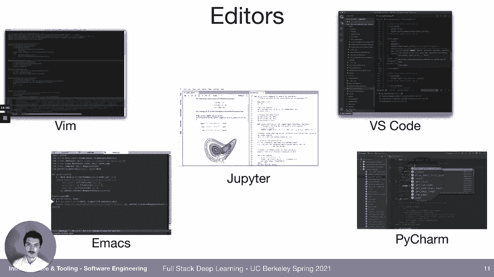

上一节我们概述了机器学习系统的全貌，本节中我们来看看最基础的部分：软件工程。在深度学习和机器学习领域，我们主要使用的编程语言是 **Python**。这主要是因为围绕Python构建的丰富库生态，而非语言本身的特性。Python在科学计算和数据计算领域是明确的赢家。它易于与C等低级语言互操作，但这也意味着要编写高性能的科学计算代码，通常需要使用Cython或C++编写，然后通过库与Python集成。不过，Python对于编写脚本和快速原型开发非常友好，其语法接近自然语言，易于理解。

为了编辑代码，我们使用文本编辑器。以下是常见的选项：
*   **传统编辑器**：如 Vim、Emacs。
*   **Notebooks**：如 Jupyter Notebook，这是一种交互式计算环境，可以逐个单元执行代码并查看结果。
*   **现代编辑器**：如 **Visual Studio Code**，这是一个来自微软的开源项目，提供了优秀的Python开发体验。
*   **Python专用IDE**：如 PyCharm。

我们推荐使用 **Visual Studio Code**，因为它免费、易于设置，并且拥有强大的生态系统。它内置了版本控制、代码差异对比、智能代码补全、远程项目开发、代码检查等功能，特别是其集成的终端和远程开发支持，使得工作流程非常顺畅。

接下来，我们谈谈代码规范和类型提示。**Linter** 是定义代码风格规则的工具，例如行长度限制、变量命名规范等。自动化执行这些规则可以保持代码一致性。静态分析工具（如 Pylint）还能捕获未定义变量等潜在错误。**类型提示** 通过在函数签名中指定变量类型（例如 `def train_model(model: Model, epochs: int)`），既能作为代码文档，也能帮助在开发早期发现类型不匹配的bug。我们将在后续的实验中为代码库设置这些工具。

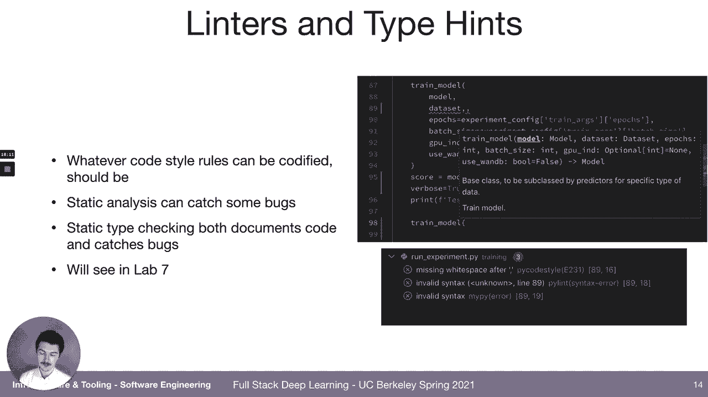

## Jupyter Notebooks 与替代方案 📓

上一节我们介绍了代码编辑工具，本节中我们来看看在数据科学中广泛使用的 **Jupyter Notebooks**。Notebooks 非常适合项目的初稿和探索性分析。它们允许你交互式地执行代码、可视化结果，并混合代码、文本和输出。

然而，使用 Notebooks 构建可扩展、可复现和经过良好测试的代码库是困难的。原因包括：
*   **难以版本控制**：代码和单元输出交织在一起。
*   **开发环境原始**：不如专业IDE强大。
*   **难以测试**：缺乏成熟的单元测试框架集成。
*   **无序执行**：可能导致代码状态混乱，难以推理。
*   **难以运行长任务或分布式任务**。

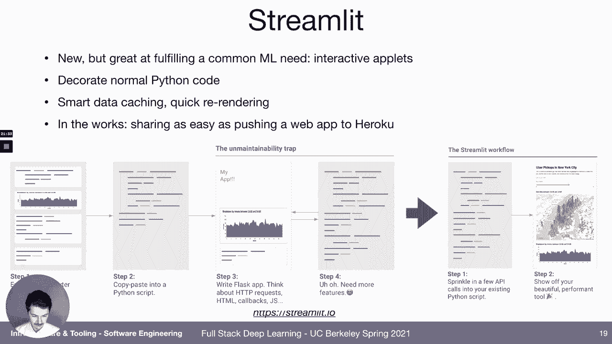

尽管如此，一些成功的机器学习团队（如 fast.ai）的整个工作流都基于 Notebooks。他们开发了 `nbdev` 等项目，展示了如何在 Notebook 中开发结构良好、可测试的代码。

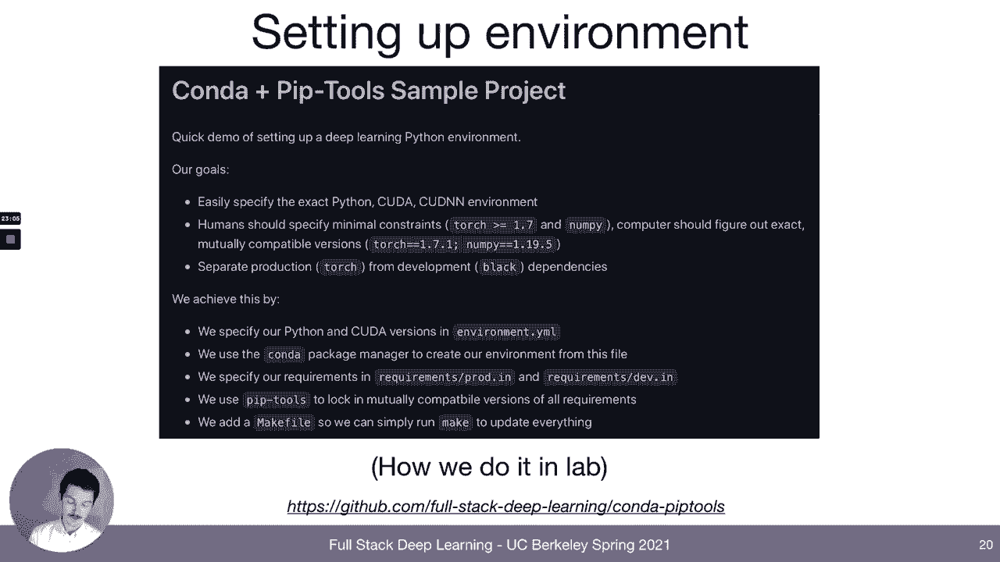

一个有趣的 Notebook 替代方案是 **Streamlit**。它专注于创建交互式应用。你只需编写普通的 Python 代码，并使用 Streamlit 提供的按钮、滑块、图表等组件，就能快速构建出可分享的 Web 应用。它让创建交互式演示变得非常简单。

## 依赖管理与环境配置 📦

在开始任何项目之前，我们需要定义和管理项目依赖。以下是推荐的工具链：

我们推荐使用 **Conda** 来管理 Python 解释器、CUDA 和 cuDNN 等底层环境。但是，对于 Python 包本身（如 PyTorch, pandas）的管理，我们使用 **pip-tools**。

使用 pip-tools 的原因在于，它能很好地将依赖项分解到多个文件中（例如，生产环境、开发环境、测试环境的需求分开）。它还能“锁定”依赖的确切版本，确保项目的可复现性。我们将在示例项目和实验中使用这种方法。

## 深度学习计算需求 💻

上一节我们配置好了开发环境，本节中我们来看看运行深度学习模型所需的计算资源。我们可以将需求分为两个阶段：**早期开发** 和 **规模化训练与评估**。

在早期开发阶段，我们编写代码、调试模型、查看结果，希望快速迭代。理想情况下，我们能在本地或易于访问的计算机上使用 GPU。这可以是本地桌面电脑（配备 GPU），也可以是云上易于 SSH 连接的实例。

在规模化训练阶段，我们需要进行架构搜索、超参数调优，或者训练无法在少量 GPU 上容纳的大型模型。这时，我们需要能够轻松启动大量实验，并有效审查结果。这通常需要一个机器集群，可以是本地部署的，也可以是云上的。

深度学习研究使用的计算量正在快速增长。从 Transformer 模型（如 GPT-3, Switch Transformer）的发展可以看出，模型规模和所需算力都在急剧上升。因此，有效管理计算资源至关重要。

## GPU 基础与选择策略 🎮

要决定是购买自有硬件还是直接使用云服务，我们需要了解 GPU 的基础知识、云选项和本地选项。

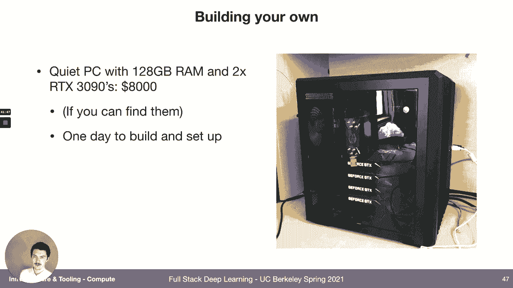

目前，**NVIDIA GPU** 是深度学习领域的主流选择（尽管 Google 的 TPU 在某些场景下速度更快）。NVIDIA 每年都会推出新的架构（如 Kepler, Pascal, Volta, Turing, Ampere）。通常先推出服务器版本，然后是高端消费级版本。

选择 GPU 时，**显存大小** 是关键，因为它决定了单次能处理的数据量（批次大小）。更大的批次通常意味着更快的训练速度。

在精度方面，深度学习通常使用 **32位浮点数**。但从 Volta 架构开始，NVIDIA 引入了 **Tensor Cores**，专门用于混合精度计算（16位和32位混合），能大幅加速矩阵运算。纯 **16位训练** 也能在几乎不影响精度的情况下，允许使用更大的批次。

以下是各代架构的简单对比：
*   **Kepler/Maxwell**：较慢，不建议购买新卡，但在云上（如 K80）可能因价格低廉而出现。
*   **Pascal**：如 GTX 1080 Ti，对于某些任务仍可接受。
*   **Volta/Turing**：支持 Tensor Cores 和混合精度训练，是性价比较高的选择（如 RTX 2080 Ti, Titan RTX）。云上的 V100 也属于此类。
*   **Ampere**：最新架构（如 RTX 3090, A100），拥有最多的 Tensor Cores 和最高的性能。

一个很好的参考资源是 Tim Dettmers 的博客，他会定期更新深度学习 GPU 购买指南。

## 云服务与本地硬件对比 ☁️ vs 🖥️

主要的云服务提供商有 **Amazon Web Services**, **Google Cloud Platform** 和 **Microsoft Azure**。它们提供的 GPU 类型和价格大致相似。GCP 价格略低，并且提供独有的 **TPU**。此外，还有一些初创公司提供更具竞争力的价格，例如 **Lambda Labs** 和 **CoreWeave**。

在本地，你可以选择：
*   **自己组装机器**：对于最多4张 RTX 2080 Ti 或 2张 RTX 3090 的配置是可行的。
*   **购买预装机器**：如 Lambda Labs 或 NVIDIA 提供的整机。
*   **购买服务器级机器**：如配备8张 V100 的服务器，价格昂贵。

进行成本分析时，以一台4x RTX 2080 Ti 的机器（约1万美元）为例，如果全天候使用云上4x V100实例（约12美元/小时），大约5周后云服务的花费就会超过本地机器的成本。如果每天使用16小时，每周5天，则需约10周。

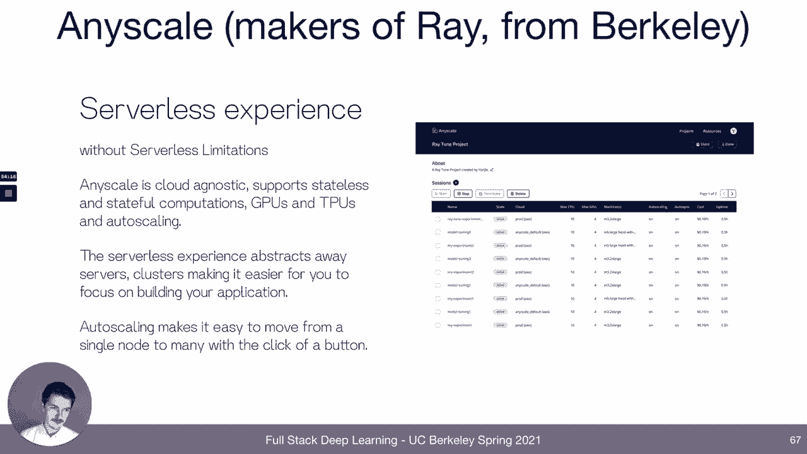

因此，对于个人爱好者，我们推荐**自建PC**。如果想进行大规模实验，可以使用 **Lambda Labs** 或 **CoreWeave** 等性价比更高的云服务。对于初创公司，可以为每位科学家配备一台强大的本地机器，并在需要时使用云实例进行扩展。对于大公司，资金充裕，可以直接使用云上最快、最便捷的实例。

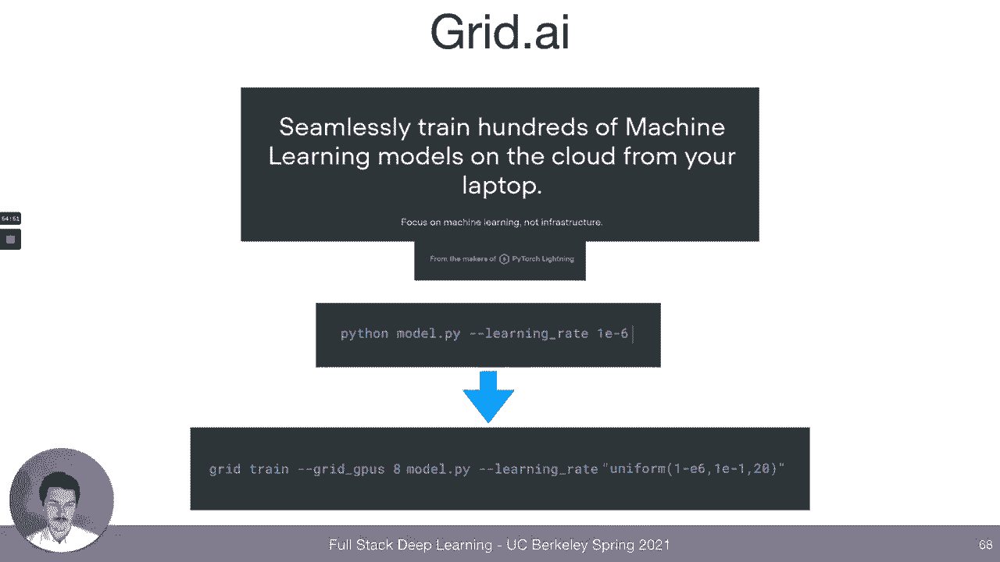


云服务的另一个优势是**抢占式实例**，价格更低，适合同时启动大量实验，即使部分实例中途被终止也能接受。这可以显著加快实验周期。

## 计算资源管理 ⚙️

当我们拥有多台机器、多个科学家和多个实验时，需要有效管理资源。目标是让科学家能够轻松运行大量实验，每个实验都有其特定的依赖和资源需求（GPU、CPU、内存）。

解决方案包括：
*   **自定义脚本**：手动检查并锁定可用资源。
*   **Slurm**：一个成熟的开源集群作业调度系统。用户提交定义资源需求的作业脚本，Slurm 负责调度执行。
*   **Docker 与 Kubernetes**：Docker 用于打包应用及其所有依赖；Kubernetes 用于在集群上编排和管理 Docker 容器。**Kubeflow** 是一个基于 Kubernetes 的机器学习工作流平台。
*   **专用解决方案**：如 **Amazon SageMaker**, **Domino Data Lab**, **Determined AI** 等一体化平台。
*   **新兴初创公司**：如 **Anyscale** 和 **Grid AI**，旨在让从本地开发无缝扩展到云端变得极其简单。

目前，对于大多数团队，**Slurm** 是一个可靠的选择。但随着生态发展，更高级的解决方案可能会成为主流。

## 深度学习框架与分布式训练 🧠

深度学习框架抽象了底层复杂性，让我们能专注于模型设计。主要框架有：
*   **TensorFlow**：早期以生产部署和静态计算图著称，但开发体验稍复杂。TensorFlow 2.0 引入了即时执行，改善了体验。
*   **PyTorch**：以动态计算图和优秀的开发体验（更“Pythonic”）而闻名，在学术界和新项目中非常流行。
*   **高级库**：如基于 PyTorch 的 **fast.ai** 和 **PyTorch Lightning**，它们封装了最佳实践，让训练循环、分布式训练等变得更简单。

目前，**PyTorch** 在新项目开发中占据主导地位。我们将在实验中使用 **PyTorch Lightning**。

**分布式训练** 是利用多个 GPU 或多个机器训练单个模型的技术，对于大数据集和大模型至关重要。
*   **数据并行**：将批次数据拆分到多个 GPU 上，每个 GPU 拥有完整的模型副本，计算梯度后同步平均。这是最常用的方式，能带来近乎线性的加速。
*   **模型并行**：将模型本身拆分到多个 GPU 上。当模型太大，单个 GPU 无法容纳时使用，但实现更复杂。

在 PyTorch 中实现数据并行很简单：
```python
if torch.cuda.device_count() > 1:
    model = nn.DataParallel(model)
```
在 PyTorch Lightning 中更简单，只需在训练器初始化时指定 `gpus` 参数即可。

## 实验管理 📊

即使只运行一个实验，也很容易忘记是哪个代码版本、哪些超参数、哪份数据产生了某个模型。当同时运行数十上百个实验时，问题会变得更严重。

低技术解决方案是使用**电子表格**手动记录。**TensorBoard** 可以自动跟踪单个实验的训练曲线和指标，是查看单个实验的好工具。

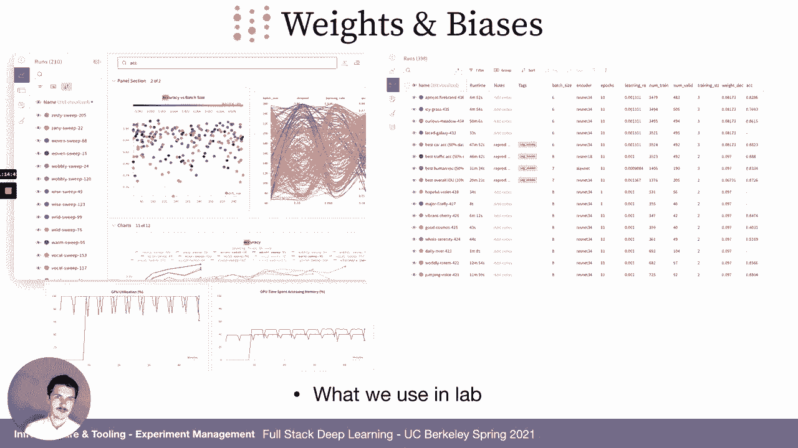

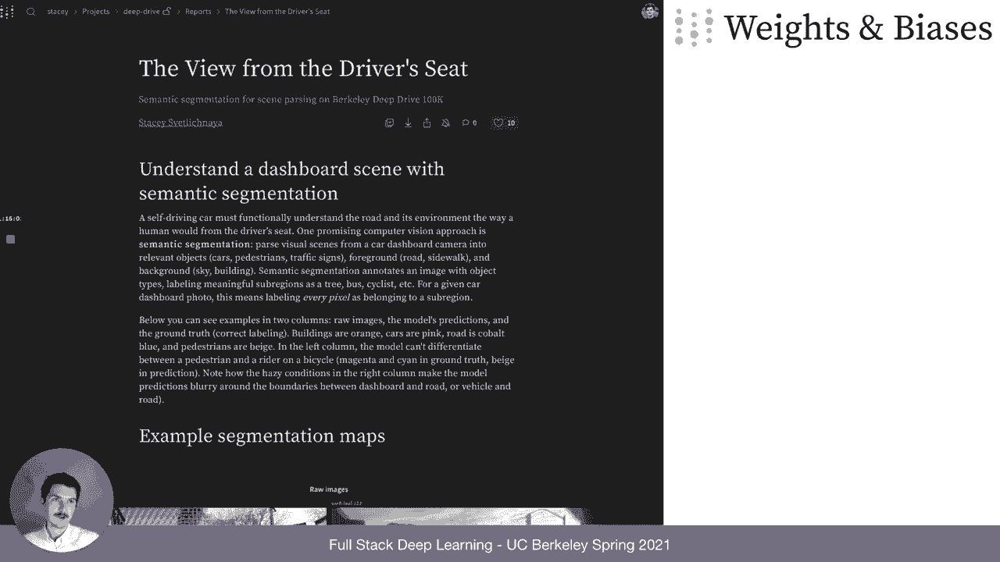

但对于管理大量实验，我们需要更强大的工具：
*   **MLflow**：一个开源的实验管理平台。
*   **Comet**, **Neptune**：提供实验仪表盘、可搜索的实验表格、超参数敏感性分析等功能。
*   **Weights & Biases**：一个功能全面的实验跟踪平台，我们将在实验中使用它。它可以记录超参数、指标、系统资源（GPU使用率）、输出图表，并能将结果组织成可分享的报告。

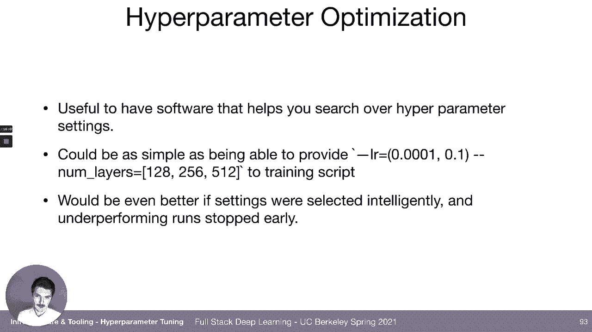

## 超参数优化 🔍

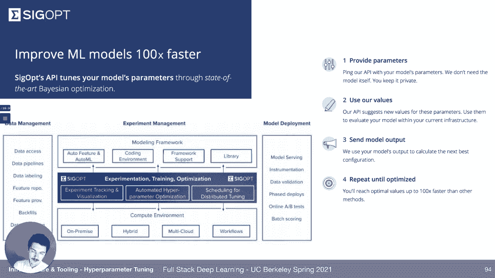

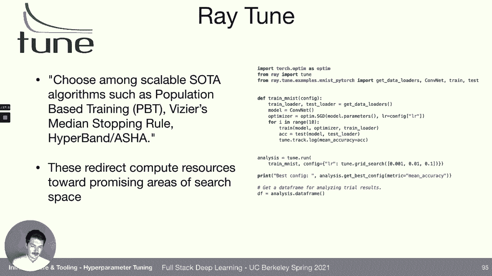

除了记录实验，我们还需要软件帮助我们**决定运行哪些实验**。这可以是从简单的网格搜索或随机搜索，到更智能的贝叶斯优化等方法。

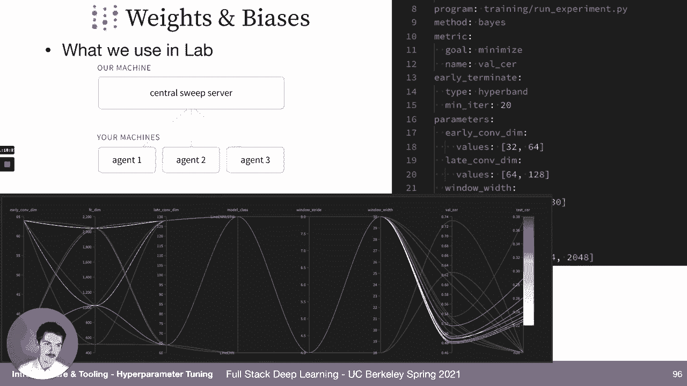

智能超参数优化的优势在于：
*   **基于已有结果建议新参数**：更高效地探索参数空间。
*   **提前终止**：自动停止表现明显不佳的实验，节省计算资源。

一些解决方案包括：
*   **SigOpt**：提供超参数优化 API 服务。
*   **Ray Tune**：Ray 生态系统中的超参数调优库。
*   **Weights & Biases Sweeps**：W&B 内置的超参数优化工具，我们将在实验中使用。你可以定义一个参数搜索空间和优化策略，W&B 会协调多个“代理”来并行运行实验。

## 一体化机器学习平台 🚀

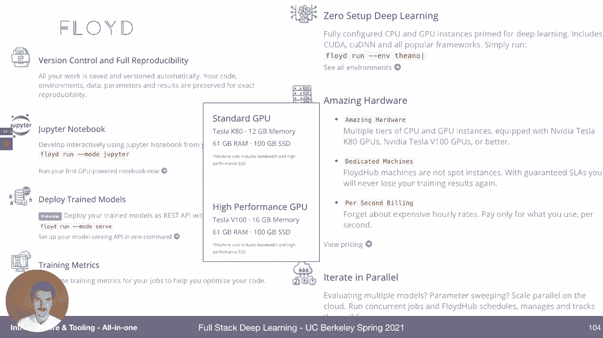

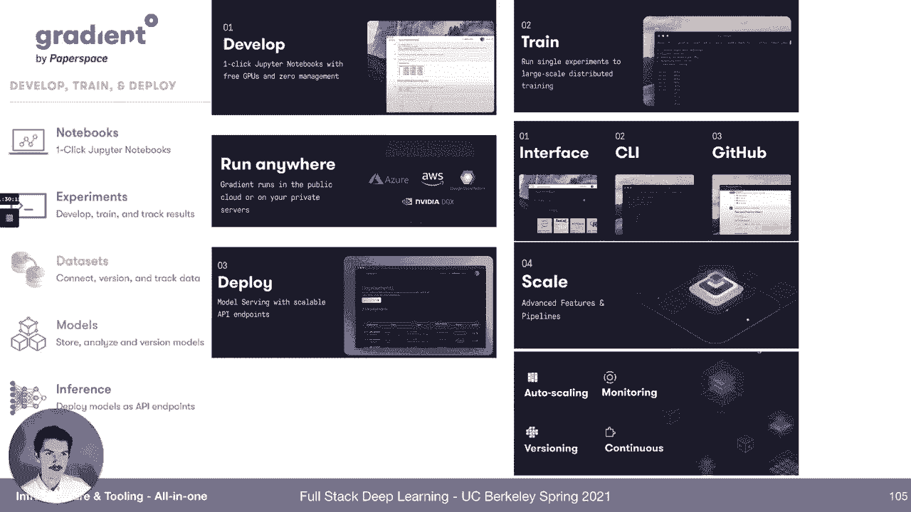

最后，市场上存在一些试图覆盖从数据到部署全流程的**一体化平台**。早期的例子是 Facebook 的 FBLearner。现在，各大云厂商和初创公司都提供了类似方案：

*   **云厂商平台**：如 **Google Cloud AI Platform**, **Amazon SageMaker**, **Microsoft Azure Machine Learning**。它们提供数据标注、处理、笔记本开发、一键训练、实验跟踪、模型部署和监控等功能，但通常价格较高。
*   **初创公司平台**：如 **Domino Data Lab**, **Determined AI**, **Gradient**。它们也提供类似的功能集，定价模式各异。Determined AI 是开源的。

这些平台的优势在于集成度和易用性，但可能会将你锁定在特定的生态系统中，并且有额外的费用。对于刚起步的团队，从 Weights & Biases 等专注于特定环节的优秀工具开始，可能更灵活。

## 总结

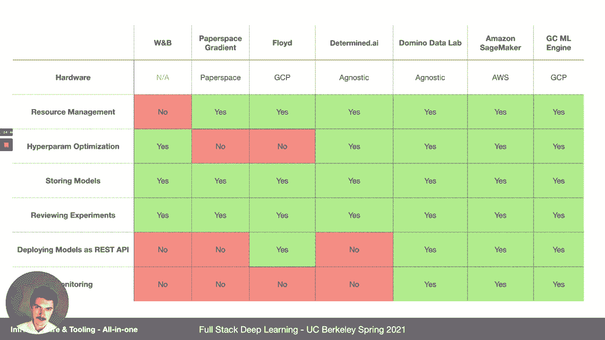

本节课我们一起学习了构建机器学习系统所需的基础设施和工具链。我们从理想的自动化工作流出发，探讨了现实中数据、训练、部署各环节的挑战。我们详细介绍了：
1.  以 Python 和 VS Code 为核心的**软件开发环境**。
2.  **依赖管理**的最佳实践。
3.  深度学习对**计算资源**的需求，以及如何根据自身情况在**本地硬件**和**云服务**之间做出选择。
4.  使用 **Slurm** 或 **Kubernetes** 等工具进行**计算资源管理**。
5.  主流的**深度学习框架**（PyTorch/TensorFlow）及其高级封装。
6.  **分布式训练**的基本概念。
7.  使用 **Weights & Biases** 等工具进行**实验管理和跟踪**。
8.  使用 **W&B Sweeps** 等进行**超参数优化**。
9.  市面上主要的**一体化机器学习平台**及其特点。

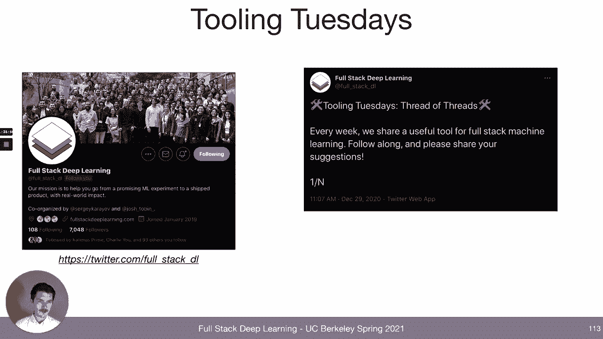

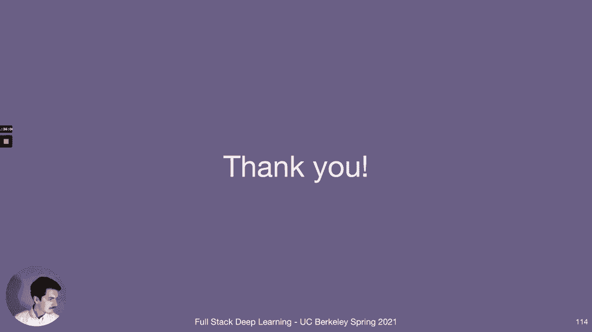

理解并合理运用这些工具，将帮助你更高效、更系统地构建、迭代和部署机器学习模型。