# 13：【Lab5】实验管理 📚

在本节课中，我们将学习实验管理。课程将介绍 IAM 手写数据集，并展示如何通过数据增强技术，使我们的合成数据集更接近真实数据。我们将引入 Weights & Biases 工具来跟踪实验，并在增强后的数据集上运行实验。最后，我们将启动一个超参数扫描任务。

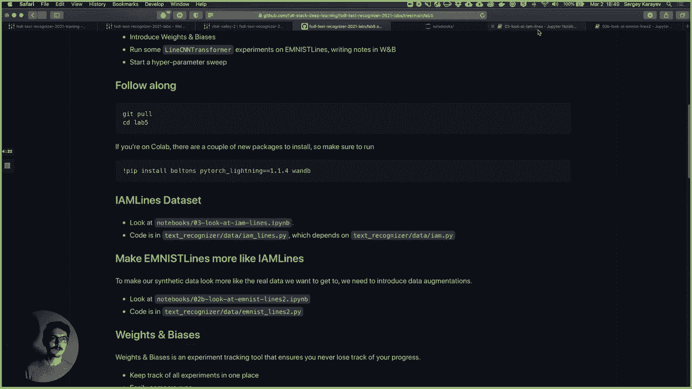

## 🗂️ 数据集介绍：IAM

首先，我们来介绍一个新的数据集——IAM。这是一个真实手写文本的数据集，收集时间可能在 90 年代或 21 世纪初。我们可以通过查看笔记本来了解它的样子。

在查看笔记本之前，我们先检查一下代码仓库。仓库中包含了 IAM 的原始数据和一个 README 文件。该文件描述了数据来源、任何预处理步骤、数据应如何分割等信息。这个数据集包含大约 1500 页扫描文本，被分割成 13000 行文本。元数据中包含了数据下载链接、用于校验下载文件正确性的哈希值，以及应属于测试集的页面 ID。如果我们想与已发表的结果进行比较，这一点很重要。

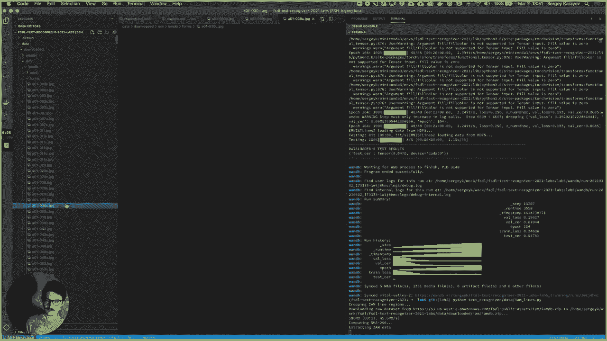

运行以下命令可以下载并处理数据集：
```bash
python text_recognizer/data/iam_lines.py
```
该命令会将数据集下载到 `data/` 目录下。下载的文件夹中包含 `forms` 目录，里面是原始图像。我们可以查看这些图像的样子。


这是人们提供的数据类型。他们被要求在一张纸上书写，然后数据标注员会为每一行甚至每个单词绘制矩形框。因此，在这个数据集中，我们拥有这些位置信息。

现在，我们切换到笔记本。我们将 `augment_data` 参数设为 `False`，以便先不查看增强效果。数据加载后，图像的尺寸是高 56 像素，长 1024 像素。最大序列长度是 89 个字符。我们可以通过绘图并将标签作为每个图的标题来查看数据。你会注意到，每个标签都以一个起始标记开始，以一个结束标记结束。我过滤掉了填充标记，所以每个序列都被填充到了最大长度 89。图像看起来是这样的。


这里有各种各样的手写体：有些在水平方向上被压缩，有些是倾斜的，有些整体方向可能有些旋转。查看数据的目的是了解可能存在的多样性。我们还将数据绘制在 0 到 1 之间，黑色是 0，纯白色是 1。我们看到大多数墨迹的灰度值大约在 0.7 到 0.8 之间，并非纯白。

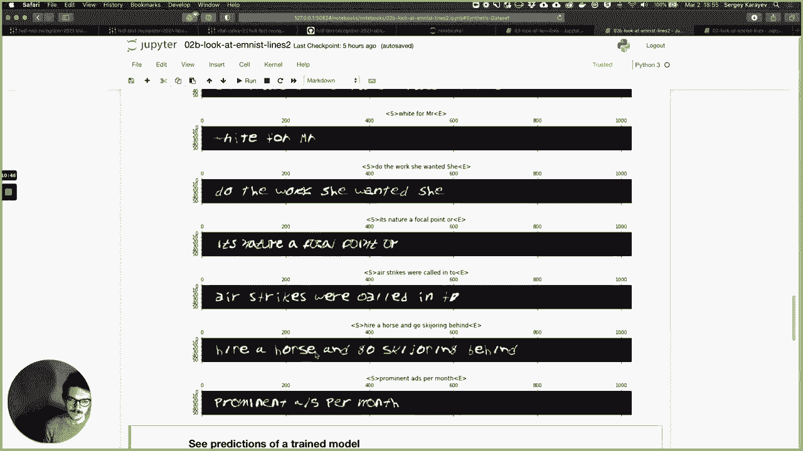

## 🛠️ 合成数据增强：EmnistLines2

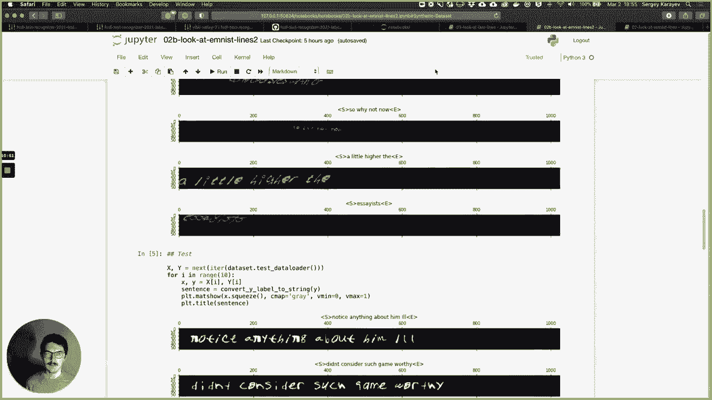

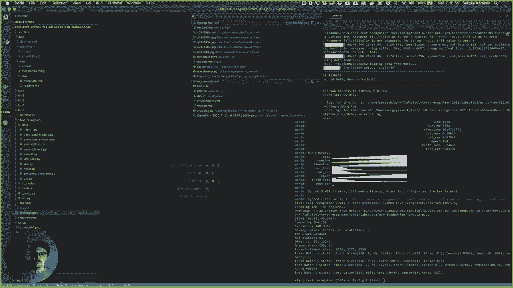

现在我们已经了解了真实数据，可以尝试让我们的合成数据集看起来更像它。我们之前构建了 `EmnistLines` 数据集。

在 `notebook 02` 中查看这个数据集是一个好习惯。记得我们有一些简单的字符串，然后我们引入了一些更复杂的字符串，比如包含字符重叠和更长序列的情况。但它们都很简单：文本总是填满行的整个垂直空间，总是从左侧边缘开始，并且都处于相同的水平维度，没有任何拉伸、倾斜或旋转。

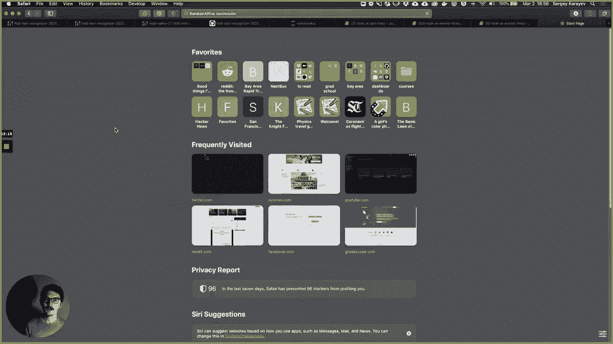

为了让这些数据看起来更像真实数据，我们需要引入一些额外的变换。为此，我们创建了 `EmnistLines2` 数据集。它的代码大部分与 `EmnistLines` 相同，但现在看起来是这样的。

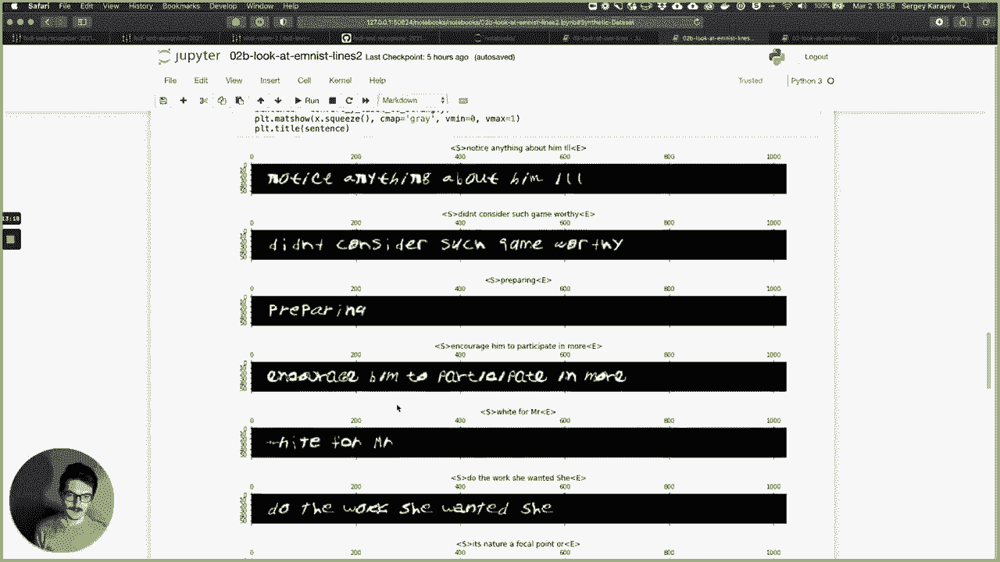


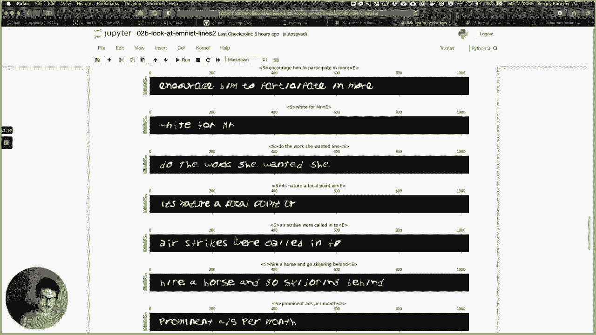

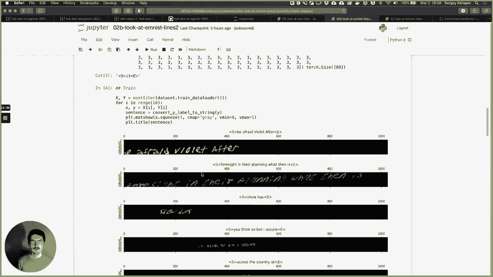

这里有旋转、颜色不那么纯白（有时更淡）、水平压缩、有些存在倾斜（倾斜方向可以是双向的），并且文本不一定从行的开头开始。这看起来真实多了。我们也可以查看测试集，它看起来仍然是旧的样子。

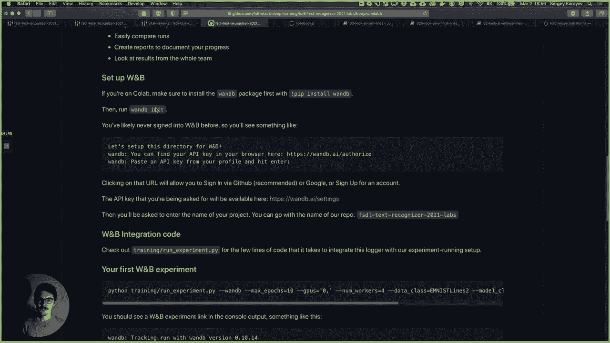


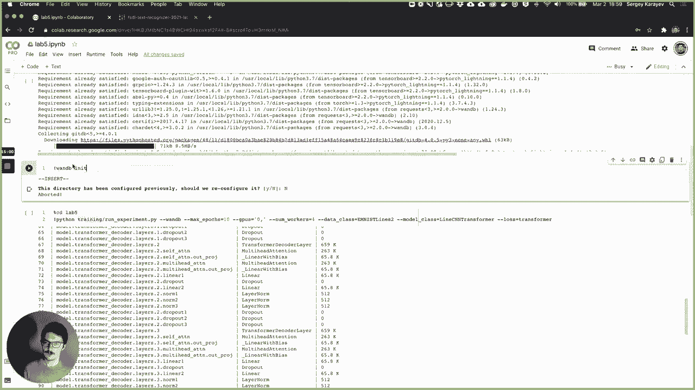

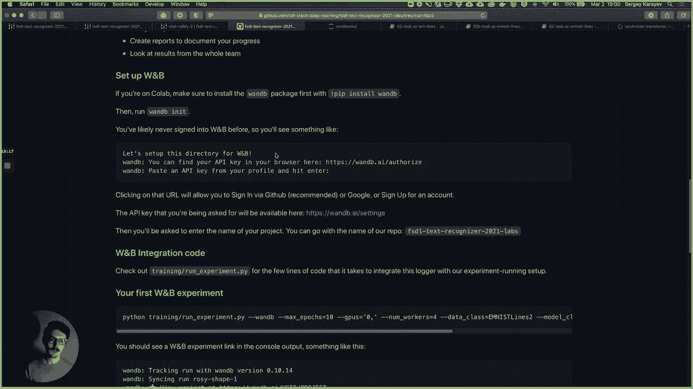

我想简要展示一下实现这些效果的代码。打开 `emnist_lines2.py`，关键代码是我们传递给数据集的 `transform`。为了创建训练集和验证集，我们传递这个 `transform`，它是 `get_transform` 函数的结果，并且 `augment` 参数为 `True`。

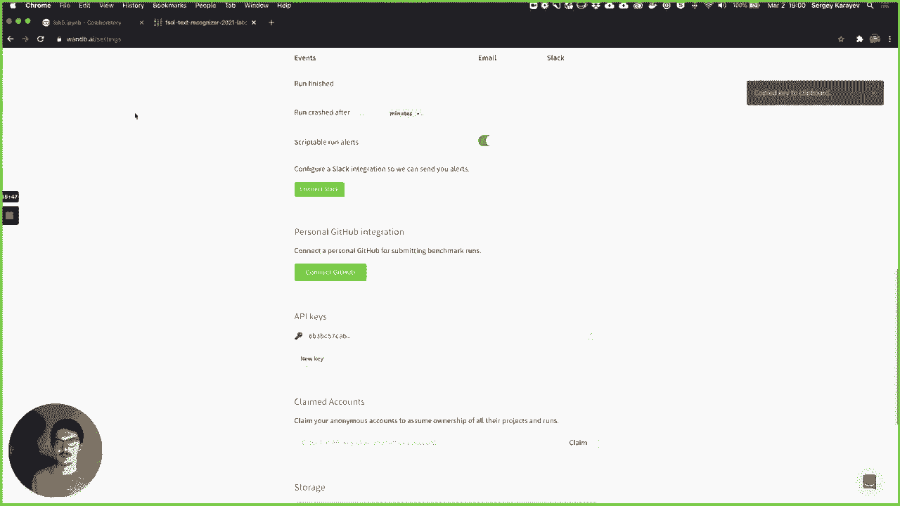

那么什么是 `transform` 呢？这被称为数据增强。我们之前使用的 `transform` 只是将 NumPy 数组或 PIL 图像转换为 PyTorch 张量，即 `transforms.ToTensor()`。但现在，如果 `augment` 为 `True`，我们还会进行颜色抖动（使亮度在原始值的一半到原始值之间随机变化），并添加一个随机仿射变换。

我们可以搜索 `torchvision.transforms.RandomAffine` 来了解它。它可以围绕中心点旋转图像、在垂直和水平方向上平移图像、缩放图像以及剪切图像。我们会对这四种变换都应用一点点。它的美妙之处在于它是随机的，所以每次加载批次时，都会对图像应用不同的随机变换。这对于防止过拟合至关重要。

这就是我们的数据的样子。我们不对测试集应用数据增强，这就是为什么测试集看起来仍然是旧的样子。通常，保持测试集不受数据增强的影响是一种好的做法，这样每次在测试集上运行时，性能指标都是完全相同的，不依赖于任何随机因素。

## 📊 实验跟踪：Weights & Biases

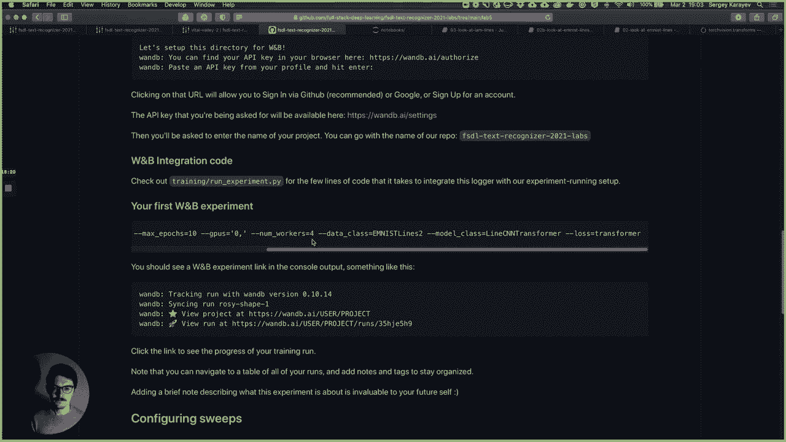

现在我们已经准备好了 `EmnistLines2` 数据集，可以运行一些实验了。这次我们将使用 Weights & Biases 来跟踪实验。如果不记得了，它是我们在基础设施课程中介绍的实验管理工具之一，其他还有 Comet.ml、MLflow、Determined AI 等。我喜欢 Weights & Biases，因为它速度快，功能全面，并且有一些更高级的功能，比如我们将在本实验中使用的超参数扫描。

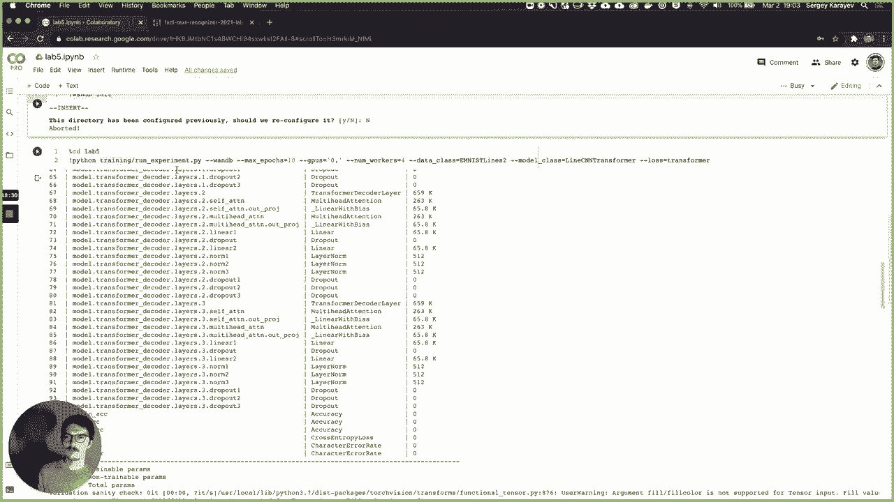

要设置 Weights & Biases，首先运行：
```bash
wandb init
```
这会弹出一条消息，要求你粘贴 API 密钥。然后它会引导你到 `wandb.ai` 进行授权。如果你还没有账户，可以通过 GitHub（我认为最简单）、Google 登录或注册一个新账户。账户是免费的，这些功能也都是免费的。

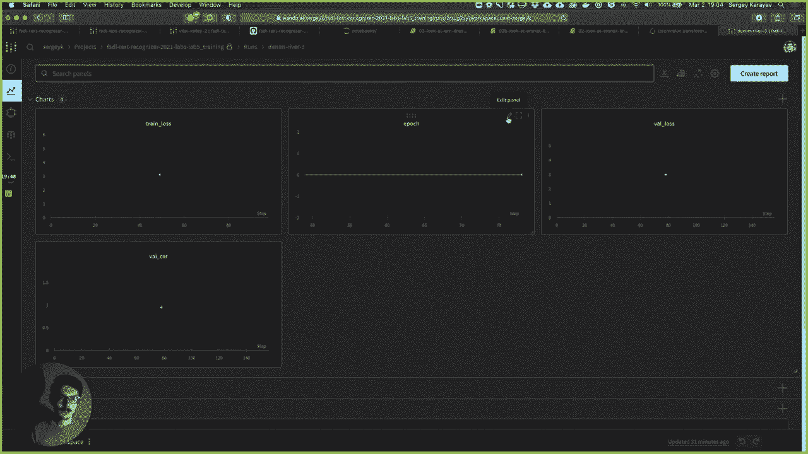

登录后，进入设置页面，复制 API 密钥，然后粘贴到你的 Colab 或终端中。接下来，它会要求你输入项目名称，你可以输入任何名称，但最好输入这个代码仓库的名称，例如 `fsdl-text-recognizer-2021-labs`。

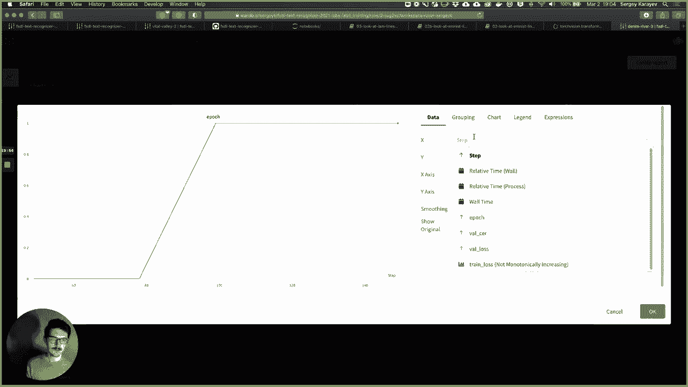

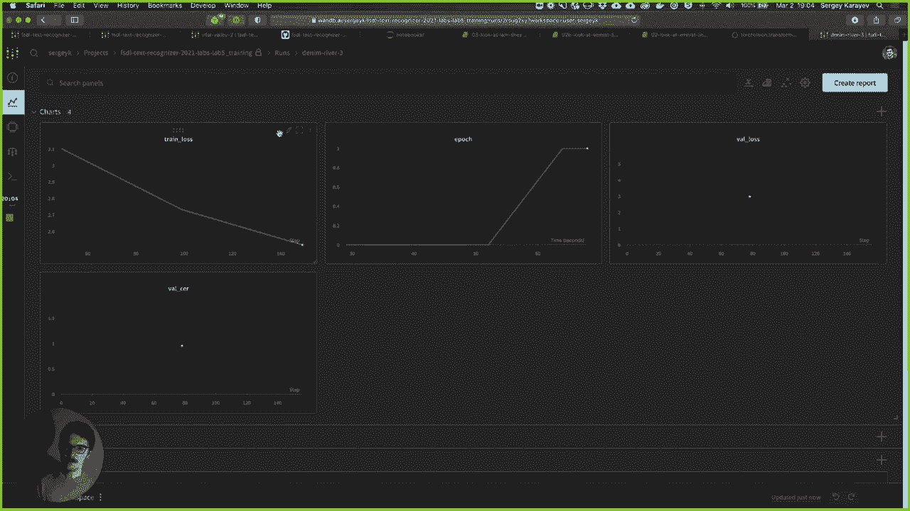

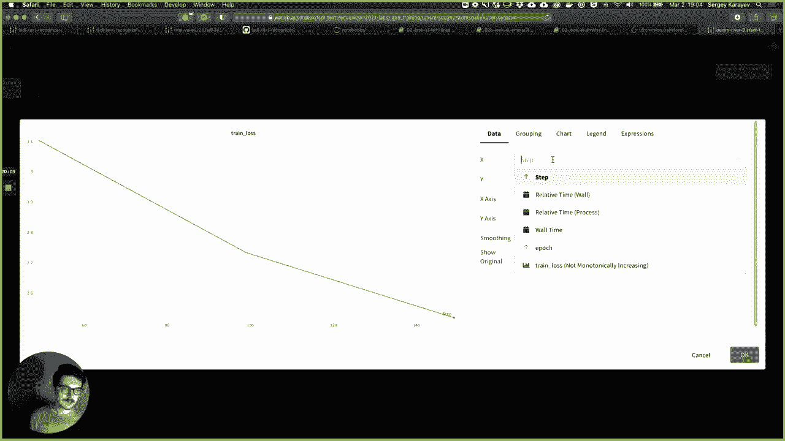

现在我们已经登录并设置了 Weights & Biases。那么，我们需要添加或已经为我们添加了哪些代码来使用 Weights & Biases 进行日志记录呢？

新的代码在 `run_experiment.py` 中。`run_experiment.py` 是我们的框架，它从命令行读取参数并加载数据。现在我们可以传递一个命令行标志 `--wandb`。如果这样做，它将用 Weights & Biases 的记录器替换默认的 TensorBoard 记录器。这是为了使用 Weights & Biases 所做的唯一更改，这非常方便。

此外，我们还可以（这是可选的）让记录器监视模型，这将跟踪模型中的所有梯度，并能够在 Weights & Biases 上绘制所有梯度的大小。我们还将记录所有超参数。对我们来说，所有超参数就是命令行中的所有内容。因此，如果我们想改变代码中的某些内容并希望搜索其不同值，我们就把它变成一个命令行参数，然后我们把所有的命令行参数都称为超参数。

集成的程度非常简洁。接下来，我们想运行一个实验。我们使用以下命令：
```bash
python run_experiment.py --wandb ... (其他参数)
```
在终端或 Colab 中运行（在 Colab 中记得在前面加上 `!`）。这是训练开始的标准输出，它会打印模型信息等等。但现在，一开始它会显示 Weights & Biases 的信息，比如我们当前已登录，并链接到这个项目和这个特定的运行，我们可以查看配置（所有超参数）、图表（很快就会在我们完成第一个周期后显示）以及媒体（我稍后会谈到）。

第一个周期完成后，我们有一个数据点用于训练损失、验证损失、验证字符错误率和周期。我喜欢做的一件事是将周期图表改为基于相对墙上时间，这样便于比较多个运行的时长。然后，训练损失图以周期数而不是步数（步数是批次的另一种说法）显示可能更好看一些。也许我还想稍微调整一下布局，让训练损失和验证损失并排显示。

我们记录了模型中所有层的梯度大小，这很酷。我们可以看到梯度大小的简要分布。这可以让你看到梯度爆炸（你会看到一条粗的、颜色均匀的线，而不是细的蓝线）或梯度消失（所有值基本上都为零，周围没有梯度大小的分布）。

现在训练正在进行中。我可以切换到一些已经运行完毕的实验。在这个特定的项目中，我有三个运行，其中一个刚刚启动（旁边有绿点），另外两个已经完成。我们可以比较它们，这非常有帮助。我们可以看到最终的测试字符错误率。

我想谈谈这个“媒体”部分。如果这个实验正在运行，你会看到一个叫做“验证预测示例”的东西，图像是静止的，预测是“the stare and the the at”，这不太准确。这是从哪里来的呢？

这来自 `lab5/text_recognizer/line_cnn_transformer.py`。在验证步骤和测试步骤中，现在有了一小段代码：我们在批次上进行预测，然后对于该批次的第一个元素，我们将预测转换为可读的字符串，然后使用 `wandb.logger` 将其记录为 `val_pred_example`。这很有帮助，因为 Weights & Biases 能够将这些记录为媒体。Weights & Biases 还支持音频和其他不同格式的数据。

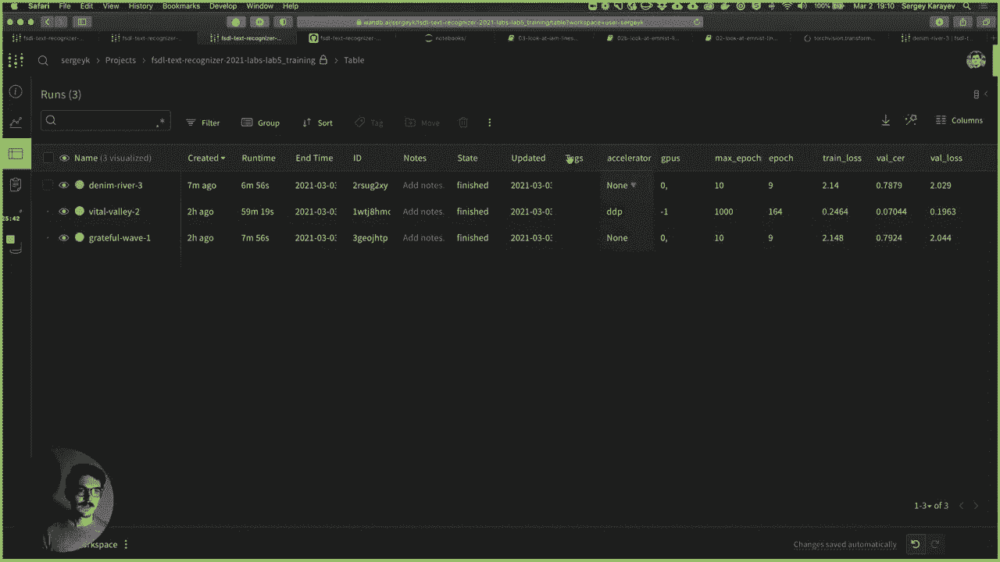

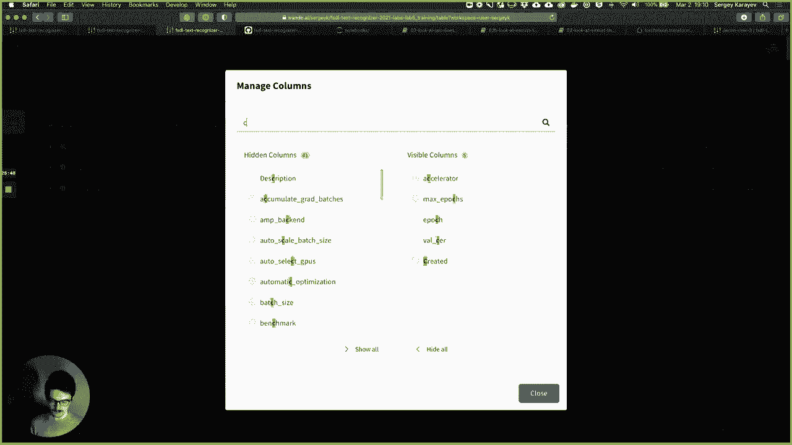

如你所见，这个预测目前完全是垃圾，但有趣的是，它是英文垃圾。这告诉我们，在这短短的时间内，我们模型的 Transformer 部分实际上已经学会了如何生成文本，但还没有学会理解图像。它能生成任何文本已经很了不起了。

如果我们查看已经训练好的其他运行，比如这个橙色的运行 `vital_valley_2`，它得到了 4% 的测试字符错误率。点击进入，训练损失降得很低，验证损失也是如此。看看它实际产生的验证预测示例：图像是“something truly amazing”，预测也是“something truly amazing”，这很酷。我们可以逐步查看，这里有一个错误：“read for a few moments”，但模型预测的是“read for afu menendez”。但很酷的是，你可以回溯时间，看到模型在训练过程中是如何变得更好的。当然，在测试集评估运行完成后，我们也会得到测试预测示例。

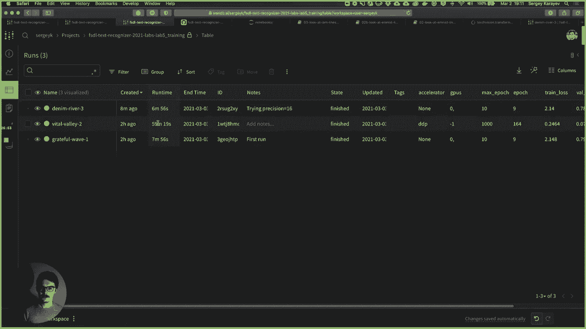

在 Weights & Biases 实验管理中，这个图表视图很酷，因为你可以比较曲线。但这个表格视图也很酷，因为你可以添加笔记。在表格视图中，首先要做的是点击“自动显示最有用的列”按钮，这通常会显示运行之间所有不同的内容。在这个例子中，实际上没有超参数不同，但我们可以手动将它们从隐藏列拖到可见列，然后查看超参数是什么。

这个笔记功能非常有帮助，因为当你进行实验时，你可以按创建日期排序，最新的运行在最上面。也许这个运行有什么不同你想记录下来，你可以添加一个笔记，比如“尝试 precision=16”。这对你自己来说是一个记录，让你知道你实际在做什么。如果你有一个真正的项目在进行，这非常有用，因为通常你不仅在命令行上更改超参数，还在更改代码，而这些代码更改以后很难追踪。添加一个小笔记，甚至做一个 Git 提交，对于知道你明天到底做了什么（比如尝试 precision=16）至关重要。

现在，我们可以在命令行上尝试 `precision=16`，它将以混合精度模式运行相同的实验，使用 PyTorch 原生的 16 位支持。这可以通过降低内存占用显著加快实验速度。如果你设置 `precision=16`，你现在可以增加批次大小。我们的默认值是 128，但我们可以尝试增加到 256。这基本上总是值得作为默认设置开启的。

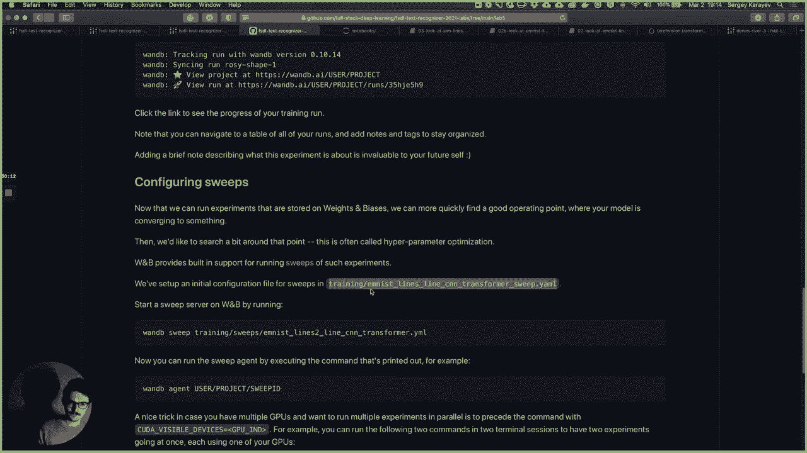

## 🔍 超参数扫描

最后，我想谈谈超参数扫描。我们已经运行了第一个 Weights & Biases 实验。现在假设我们达到了一个点，对我们的实验比较满意，比如可能收敛了，但花了很长时间；或者可能没有完全收敛，但感觉如果我们只是改变学习率或层数，它可能就会收敛。这时就是进行超参数搜索的好时机。

我们已经为你设置了一个扫描（Weights & Biases 对超参数优化实验的称呼）。让我们来看一个训练扫描配置文件：`emnist_lines2_line_cnn_transformer.yml`。

重要的是，我们指定要运行的程序 `training/run_experiment.py`，超参数优化方法（可以是网格搜索、随机搜索或贝叶斯优化，Josh 都讲过），我们想要优化的指标（这里是最小化验证损失），以及一个很酷的功能——使用 Hyperband 算法进行早停。它会在前 20 个周期内，如果一个实验不比已存在的实验更好，就终止该实验。这需要注意，因为如果你使用较低的学习率，可能在 20 个周期内达到的点不如使用较高学习率在 60 个周期内达到的点。所以在这里保守一点比较好，也许将早停周期设为 60。

然后是我们想要传递给模型的参数列表。如果你不想改变某个参数，可以排除它；或者如果你想记住它是什么，可以给它一个单一的值，比如 `window_stride: 8`。但如果你想让它在一个范围内变化，比如浮点参数学习率，你可以设置 `min: 0.0001` 和 `max: 0.1`，然后它会随机采样。当然，我们也可以手动列出几个值。总的来说，我认为对于我们正在做的事情，值得把它们都写出来，这样你可以看到所有将要尝试的配置。

我们将进行 16 位精度训练，使用 `line_cnn_transformer` 模型和 `emnist_lines2` 数据集，然后随机采样所有这些参数的设置。

要启动这个扫描，运行：
```bash
wandb sweep path/to/sweep.yml
```
这将联系 Weights & Biases 服务器并在服务器上设置一个扫描点，我们的代理现在可以调用它并请求一组参数。下一步是启动一个代理。我的机器上有两个 GPU，我喜欢做的一件事是使用 `CUDA_VISIBLE_DEVICES` 环境变量，只将一个 GPU 暴露给即将运行的进程。我会运行一个代理，然后打开另一个终端，暴露第二个 GPU 并启动另一个代理。这样我就有两个 Weights & Biases 代理，每个都调用 Weights & Biases 获取一组参数，然后开始运行。所有这些运行都会显示在我启动扫描时显示的 URL 中。

在 Weights & Biases 界面的“Sweeps”部分，可以看到扫描的运行情况。随着运行的完成，它们会根据你关心的指标（可能是验证损失或验证字符错误率）进行排序，我们希望这个值低。我们可以看到所有我们关心的参数的设置，这些设置导致了最低的验证损失。

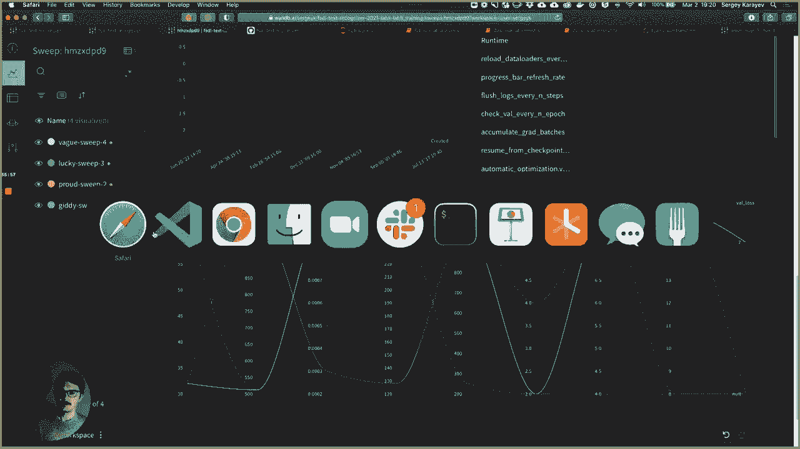

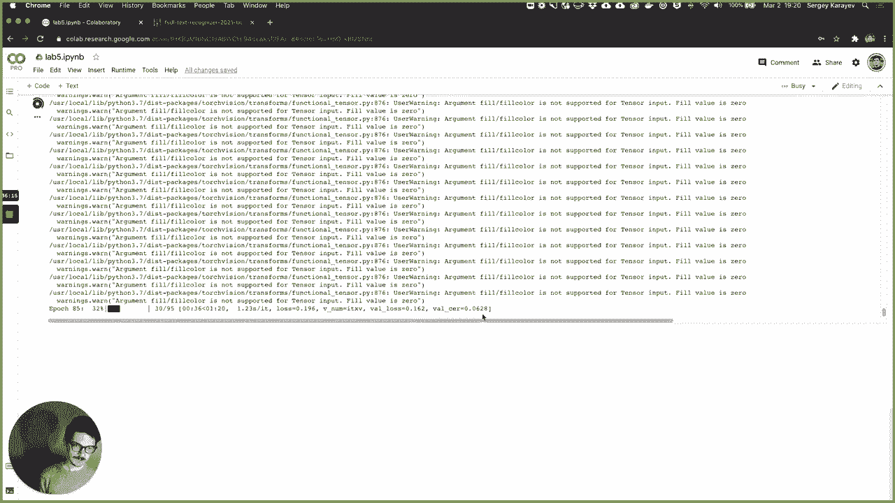

你也可以在 Colab 中做这个，这很酷。我在 Colab 中创建了扫描，并在 Colab 中运行了代理，它正在愉快地运行。这个运行的验证错误率降到了 6%，我认为这已经很不错了。

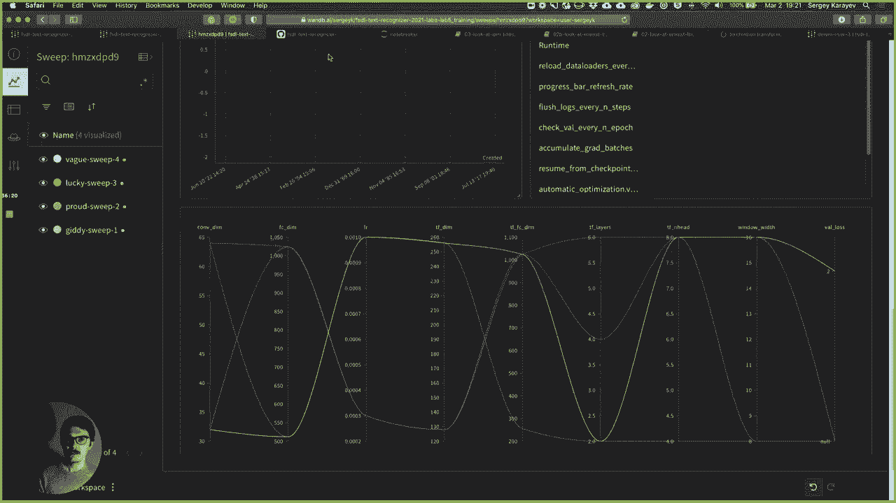

## 🎯 总结与作业

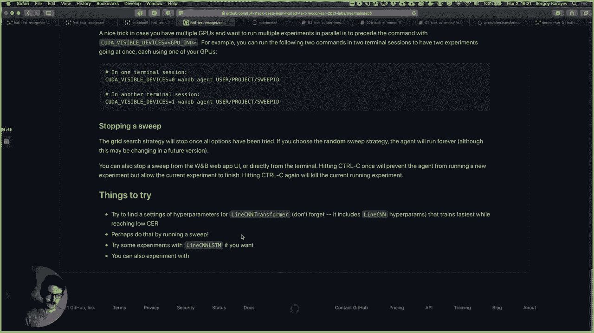

在本节课中，我们一起学习了实验管理的核心内容。我们介绍了真实的 IAM 手写数据集，并通过数据增强技术创建了更逼真的合成数据集 `EmnistLines2`。我们集成了 Weights & Biases 工具来跟踪和比较实验，包括记录指标、梯度、超参数和预测示例。最后，我们启动了超参数扫描来自动化寻找最佳模型配置的过程。

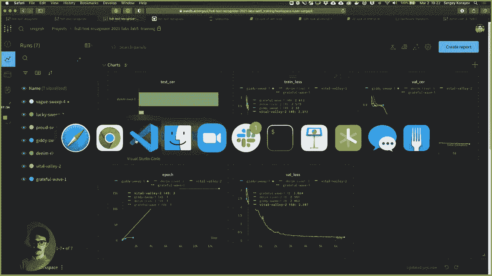

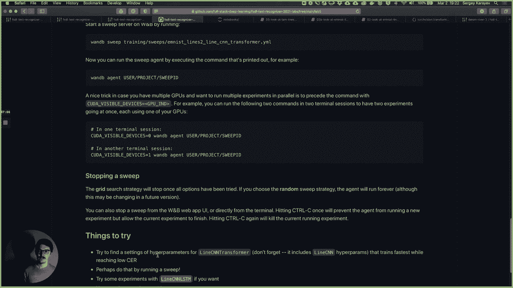

你的作业是至少运行一个使用 Weights & Biases 记录日志的实验，并上传一张你的 Weights & Biases 运行表格的截图。你可以尝试为当前实验找到一组能最快完成训练的超参数设置（例如，减少 Transformer 层数或压缩维度）。你也可以尝试用 `line_cnn_lstm` 替换 `line_cnn_transformer`，或者在 IAM 真实数据上运行实验。基本上，你可以尝试任何你想做的事情，包括运行一个扫描。