# 14：L7- 深度神经网络调试与故障处理 🐛🔧

在本节课中，我们将要学习如何系统地调试和优化深度神经网络。构建机器学习系统时，常常感觉像是在处理一堆随机数据，期望得到更好的结果。即使是顶尖的从业者，大部分时间也花在调试和调优模型上。本课程的目标不是消除这些必要的工作，而是提供一套策略，让这个过程更有条理，减少盲目性。

## 为什么调试如此困难？🤔

首先，我们需要理解为什么深度神经网络的调试如此具有挑战性。

一个常见场景是：你复现了一篇论文中的模型（例如 ResNet），但性能远不如论文中报告的结果。问题出在哪里？性能不佳可能有多种根源，且它们常常难以区分。

**1. 实现中的 Bug**
大多数深度学习 Bug 是隐形的，不会导致程序崩溃。例如，一个常见的 Bug 是数据加载顺序的非确定性（如 Python 中 `glob` 的返回顺序），这可能导致模型完全无法学习。

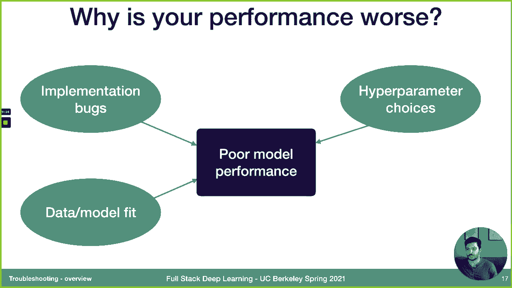

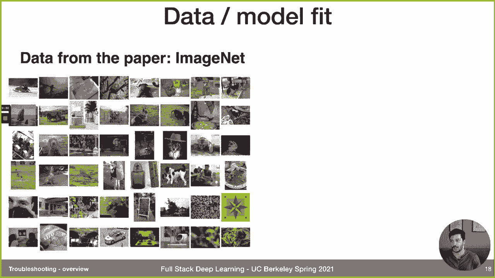

**2. 超参数选择敏感**
模型性能对超参数（如学习率、权重初始化）的微小变化可能极其敏感。例如，使用错误的学习率可能导致模型完全不收敛，而合适的权重初始化可能是模型成功训练的关键。

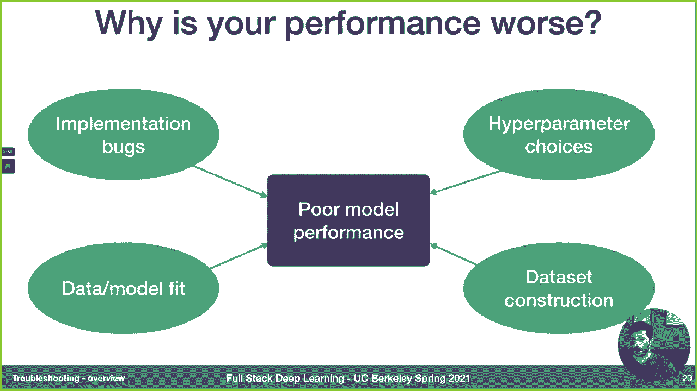

**3. 数据与模型匹配问题**
你使用的数据集（如自动驾驶图像）可能与原论文的数据集（如 ImageNet）分布不同，这自然会导致性能差异。

**4. 数据集构建问题**
在工业界，大部分时间花在处理数据上。数据集问题可能包括：数据量不足、类别不平衡、标注噪声、训练集与测试集分布不一致等。

**总结来说，调试困难的原因在于：**
*   很难第一时间确定问题是否是 Bug。
*   即使知道有问题，也难以定位具体原因（是 Bug、超参数还是数据？）。
*   模型对超参数和数据集的微小变化非常敏感。

## 核心策略：从简到繁，逐步迭代 🔄

为了克服上述困难，我们推荐的核心策略是：**保持悲观心态，从最简单的版本开始，逐步增加复杂性**。

这样，在每一步中，我们只引入微小的变化。如果性能出现意外下降，我们就可以将问题隔离到刚刚引入的变更上，从而高效地进行调试。

该策略的具体流程如下：
1.  **从简开始**：选择简单的模型和数据集，精简问题。
2.  **实现与调试**：实现所选模型，并确保其没有 Bug。
3.  **评估模型**：使用评估结果决定下一步行动（改进模型、改进数据或调优超参数）。
4.  **迭代**：循环执行上述步骤，直到模型达到预定目标。

接下来，我们将详细探讨每个步骤。

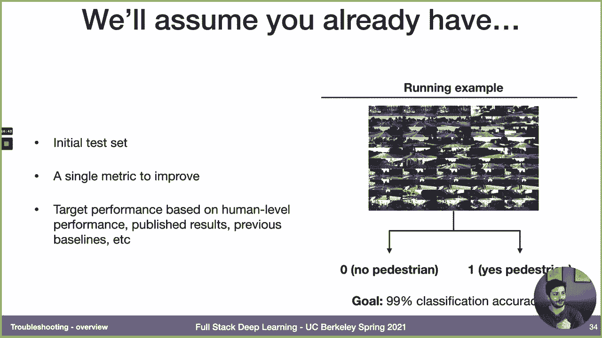

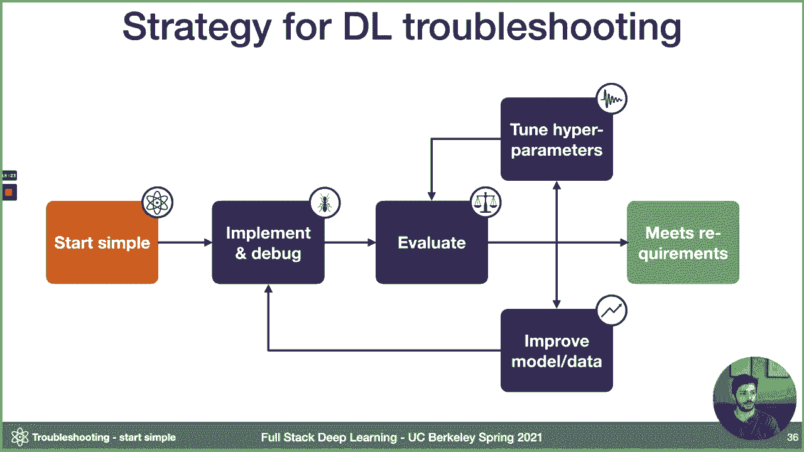

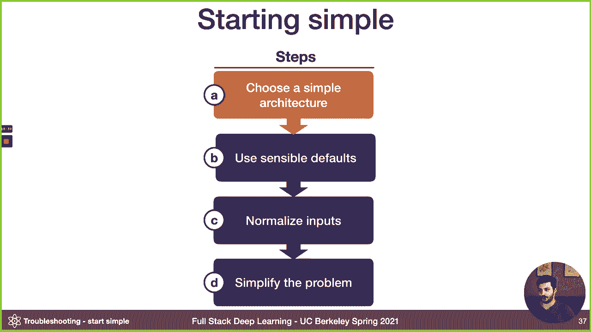

## 第一步：从简开始 🏁

在项目初期，我们的目标是建立一个尽可能简单、可调试的基线系统。

### 1. 选择简单的模型架构

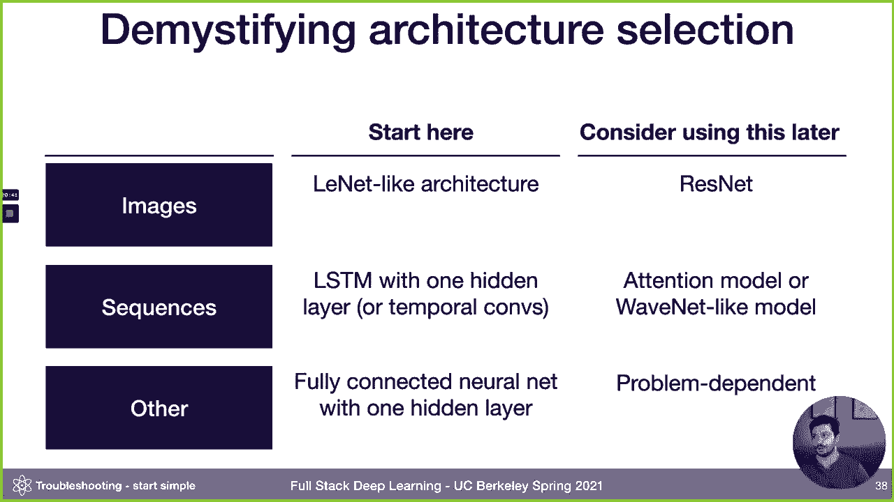

对于不同的输入数据类型，可以遵循以下建议选择初始架构：

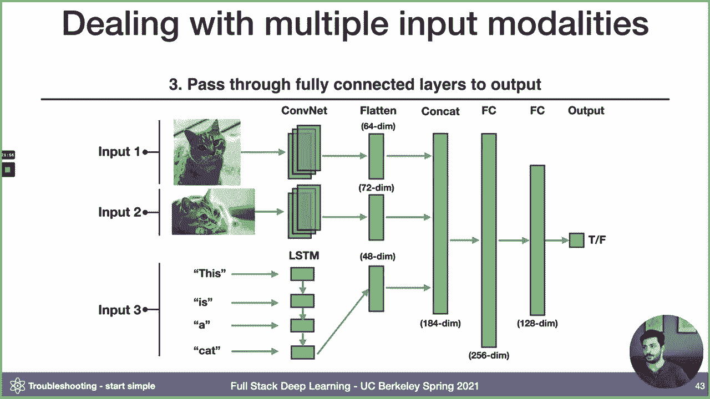

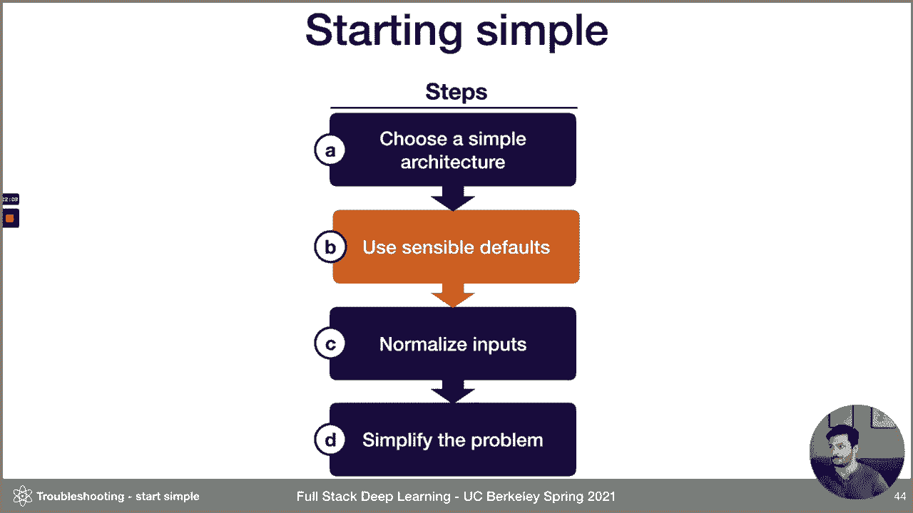

*   **图像数据**：从简单的 **CNN（如 LeNet）** 开始。
*   **序列数据**：可以从 **单层 LSTM** 开始。如今，从 **Transformer** 开始也是一个有效的选择。
*   **其他数据**：从 **单隐藏层的全连接神经网络** 开始。
*   **多模态数据**：将每种模态的数据分别通过适合的架构（如图像用 CNN，文本用 LSTM）映射到低维特征空间，然后将这些特征向量**拼接（Concatenate）**起来，最后通过一个或多个全连接层得到输出。这是一个强大且易于调试的基线。

### 2. 选择合理的默认超参数

在第一次实现时，使用以下经过验证的默认值可以省去很多麻烦：

*   **优化器**：`Adam`
*   **学习率**：`3e-4` （常被称为“魔法学习率”）
*   **激活函数**：`ReLU` （对于 RNN 可用 `tanh`）
*   **权重初始化**：
    *   CNN/FC 层：`He normal` 初始化
    *   LSTM 层：`Orthogonal` 初始化
*   **重要建议**：在第一个版本中，**不要使用任何正则化（如 Dropout, BatchNorm）或复杂的数据标准化**。这些是常见的 Bug 来源，应先确保核心实现无误后再加入。

### 3. 标准化输入

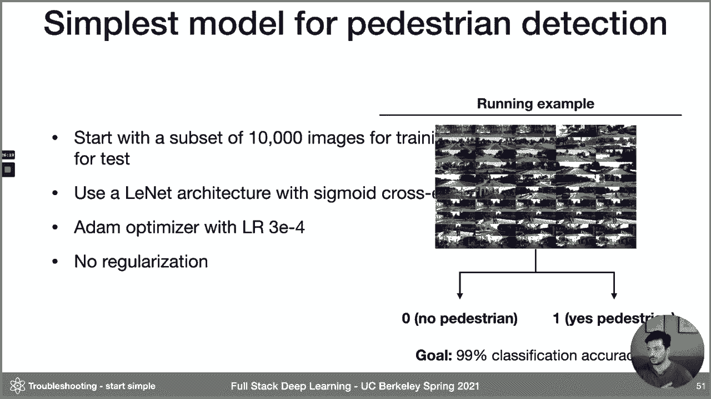

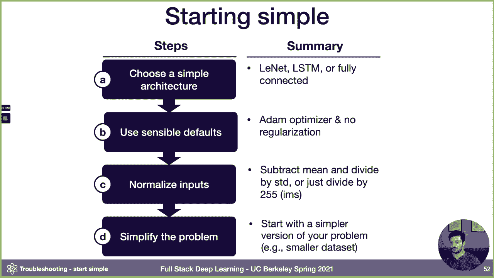

这是一个绝不能跳过的步骤。对于大多数数据，标准化意味着减去均值并除以方差。对于图像，简单地将像素值缩放到 `[0, 1]` 或 `[-0.5, 0.5]` 即可。**忘记标准化或重复标准化是导致模型学习缓慢或失败的常见原因。**

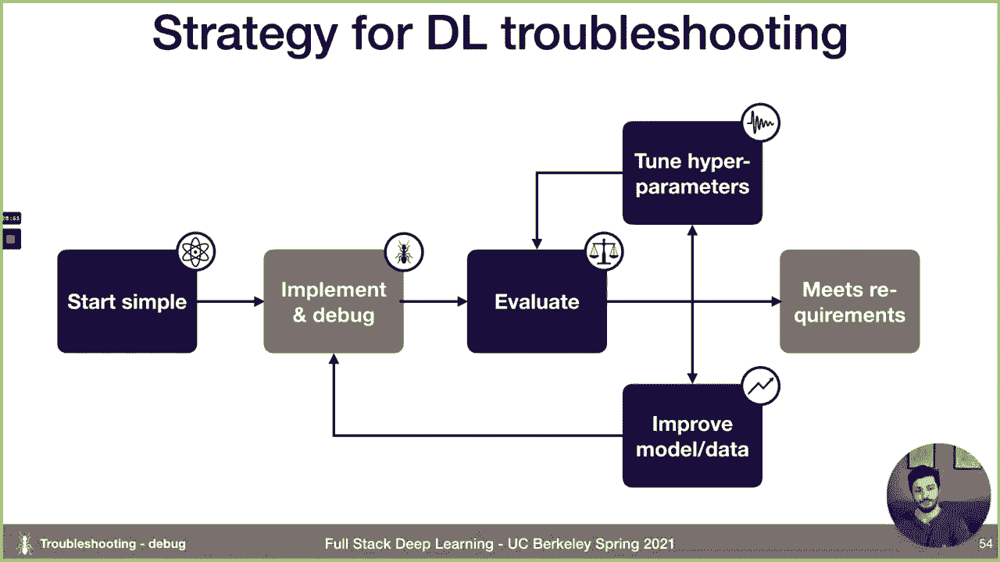

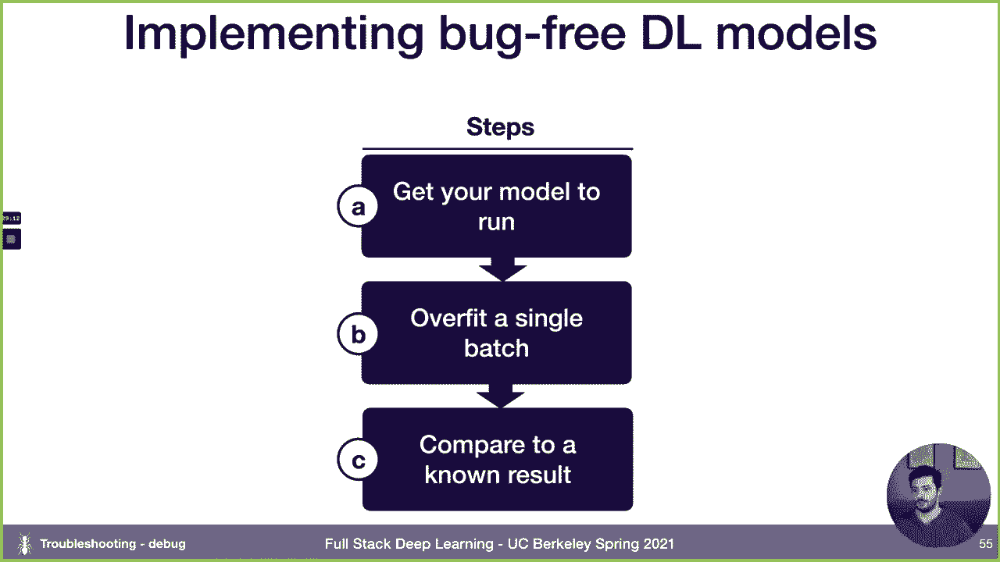

### 4. 简化问题本身

在解决最终目标之前，先在一个简化版本上验证你的流程：

*   使用**更小的训练集**。
*   减少分类的**类别数量**。
*   降低**输入尺寸**（如图像分辨率）。
*   甚至可以考虑使用**合成数据集**。

**示例：行人分类任务**
假设我们的目标是 99% 的分类准确率。在项目初期，我们可以：
*   使用 **10，000 张图像**的子集进行训练，**1，000 张**用于测试。
*   选择简单的 **LeNet** 架构。
*   使用 `Adam` 优化器和 `3e-4` 的学习率。
*   暂时**不使用任何正则化**。

## 第二步：实现与调试 🛠️

现在，我们开始实现模型并进行系统性调试。

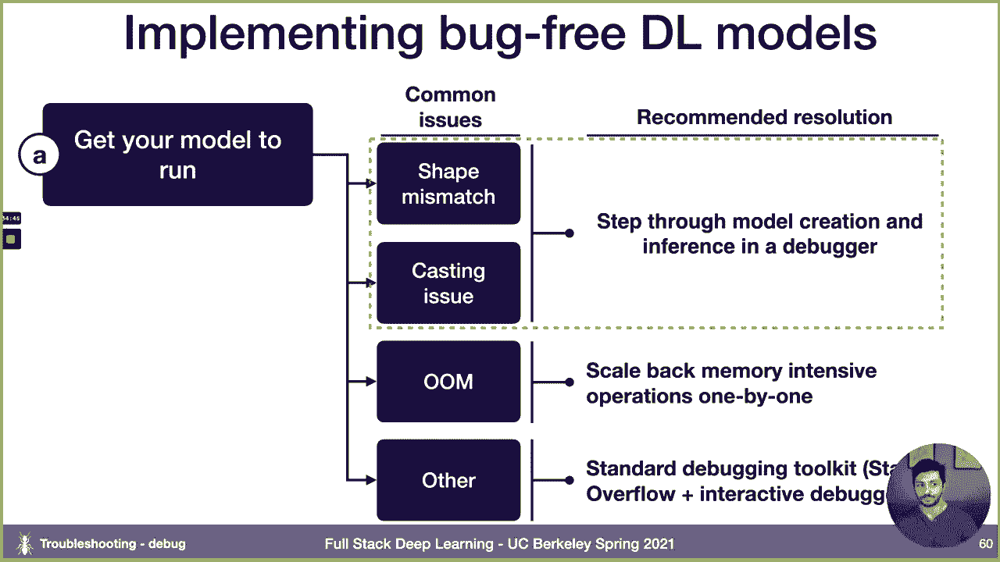

### 阶段一：让模型运行起来

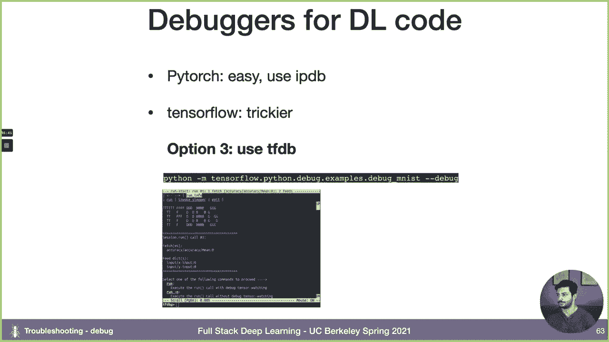

首先，确保模型能够正常执行前向和反向传播，不报错。

以下是常见的初期问题及解决方法：

*   **张量形状不匹配/类型错误**：使用调试器（如 `ipdb`）逐步执行模型创建和前向传播过程，检查每一步输出的张量形状和数据类型。
*   **内存不足（OOM）**：逐步缩小内存密集型操作（如减小批大小、减少通道数），直到模型能够运行，从而定位问题。
*   **其他问题**：运用标准的软件工程调试技巧（如搜索错误信息）。

**调试技巧**：
*   尽量保持第一个版本的代码**轻量**（目标少于 200 行），不包括已测试的基础设施代码。
*   **尽可能使用高级框架**（如 Keras， PyTorch Lightning），利用其内置的、经过充分测试的层实现，避免自己编写容易出错的数学运算。
*   初期使用可以**全部加载到内存中的数据集**，避免复杂数据管道引入的 Bug。

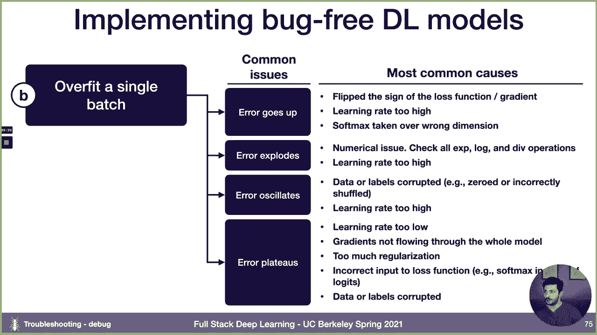

### 阶段二：过拟合一个批次

这是验证模型学习能力的关键测试。具体做法是：**只用一小批数据（如 2， 4， 32 个样本），训练模型使其损失降到任意接近零**。

如果无法过拟合，说明存在 Bug。常见现象和可能原因：

*   **误差上升**：可能损失函数符号取反。
*   **误差爆炸（先降后升）**：数值不稳定问题，或学习率过高。
*   **误差振荡（周期性升降）**：**数据或标签损坏**（如标签顺序被打乱），或学习率过高。
*   **误差平台期（降到某个值后不再下降）**：尝试增大学习率；检查是否误用了正则化；仔细检查损失函数计算和数据管道。

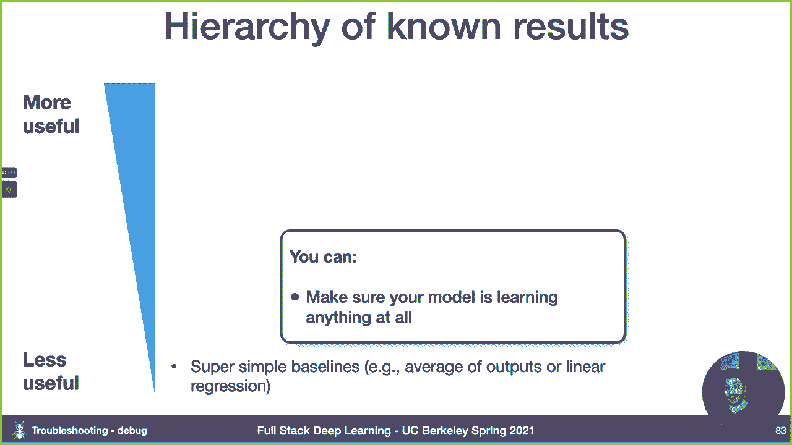

**这个测试成本极低（几分钟），但能提前发现许多隐蔽的 Bug，强烈推荐。**

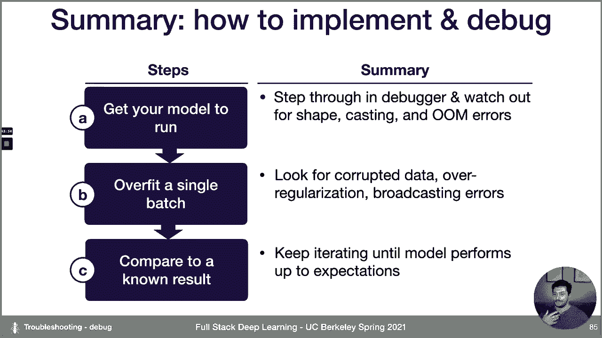

### 阶段三：与已知结果对比

在增加复杂性之前，将你的模型结果与某个“已知良好”的结果进行对比。

按推荐度降序排列的对比基准：
1.  **官方实现**：在同一数据集上对比，可以逐行比对代码和性能。
2.  **基准数据集**：在 MNIST 等标准数据集上运行你的模型。如果准确率低于 99%，很可能存在 Bug。
3.  **论文结果**：对比性能是否在同一量级，但无法帮助定位问题。
4.  **简单基线**：至少确保你的模型性能优于随机猜测或预测均值。

**实现与调试流程总结**：
1.  **让模型运行**：处理形状、类型、内存错误。
2.  **过拟合一个批次**：确保模型具备基本学习能力，排查数据、正则化、广播错误。
3.  **对比已知结果**：持续迭代，直到模型性能达到预期。

## 第三步：模型评估与改进决策 📊

模型运行无误后，我们需要评估其性能，并决定下一步优化方向。这里我们使用 **偏差-方差分解** 作为分析框架。

### 偏差-方差分解

假设我们有一个目标性能（如人类水平），训练误差和验证误差曲线如下图所示。测试误差可以分解为：
`测试误差 = 不可避免误差 + 偏差 + 方差 + 验证集过拟合`

*   **不可避免误差**：问题固有的难度（如人类水平）。
*   **偏差**：训练误差与目标性能的差距，反映**欠拟合**程度。
*   **方差**：验证误差与训练误差的差距，反映**过拟合**程度。
*   **验证集过拟合**：测试误差与验证误差的差距，因在验证集上迭代过多导致。

### 处理分布偏移

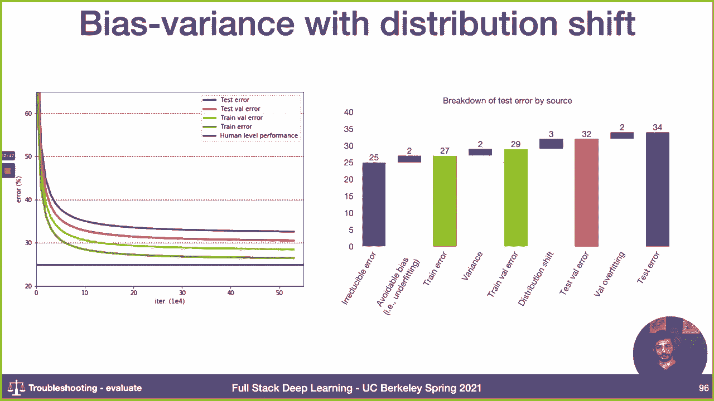

现实中，训练集和测试集分布可能不同（如训练数据是白天场景，测试需要处理夜间场景）。建议使用**两个验证集**：
*   **训练验证集**：从训练分布中采样。
*   **测试验证集**：从测试/目标分布中采样。

这样，误差分解中会多出一项：**分布偏移误差**（两个验证集性能的差距）。

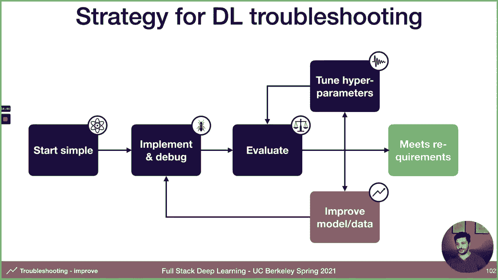

**示例：行人分类任务评估**
假设我们训练初始模型后得到：
*   目标误差：1%
*   训练误差：20%
*   验证误差：25%
*   测试误差：26%

分析：
*   **偏差很大**（20% - 1% = 19%）：模型严重欠拟合。
*   **方差存在**（25% - 20% = 5%）：同时存在过拟合。
*   **分布偏移小**（26% - 25% = 1%）：暂不主要关注。
*   **验证集过拟合小**：暂不关注。

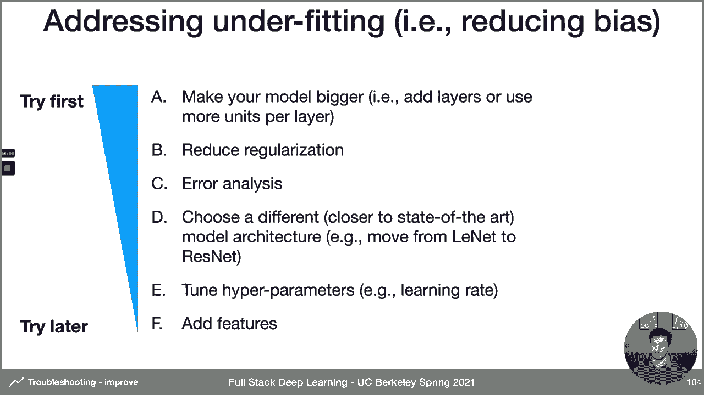

**结论**：当前首要任务是解决**欠拟合（高偏差）**问题。

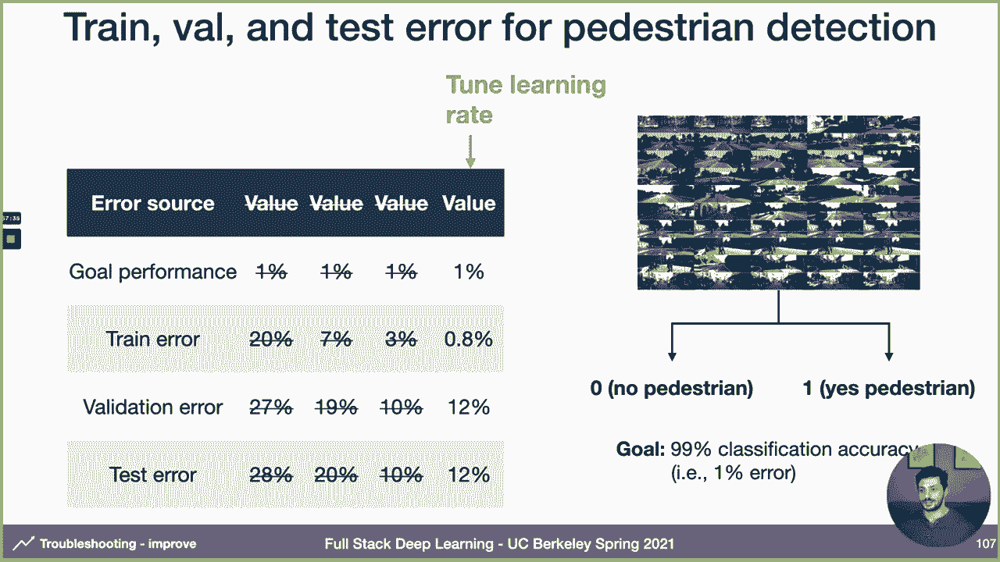

## 第四步：改进模型与数据 🚀

根据偏差-方差分解的结果，我们按以下优先级解决问题：**先解决欠拟合（偏差），再解决过拟合（方差），接着处理分布偏移，最后处理验证集过拟合。**

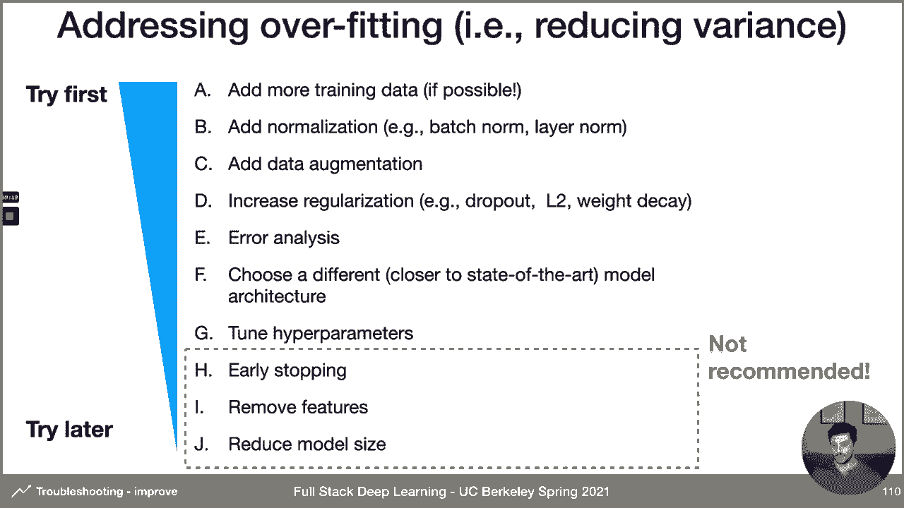

### 1. 解决欠拟合（减少偏差）

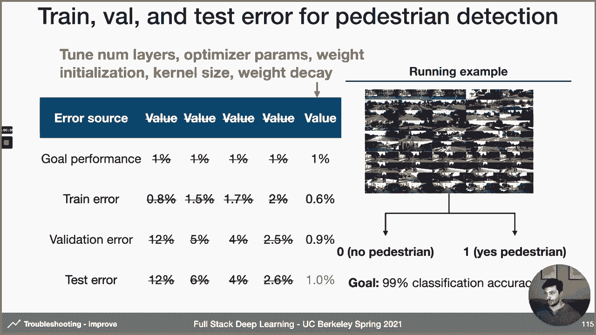

以下策略按推荐度排序：

*   **增大模型容量**：添加更多层，或每层使用更多单元。
*   **减少正则化**：如果初始版本加入了正则化，可以减弱或移除。
*   **错误分析**：人工检查模型在训练集上分错的样本，寻找规律。
*   **选择更先进的架构**：例如，从 LeNet 切换到 ResNet。
*   **调优超参数**：特别是学习率。
*   **添加特征**：在深度学习中不常手动进行，但有时很有效。

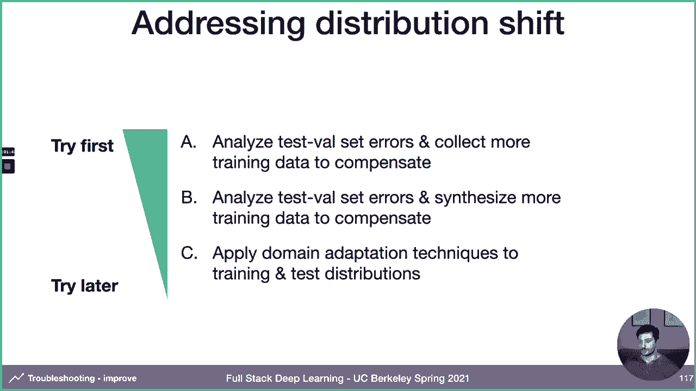

**示例迭代**：
1.  为 CNN 添加更多层 → 训练误差降至 7%。
2.  换用 ResNet 架构 → 训练误差降至 3%。
3.  调优学习率 → 训练误差达到目标 1%。

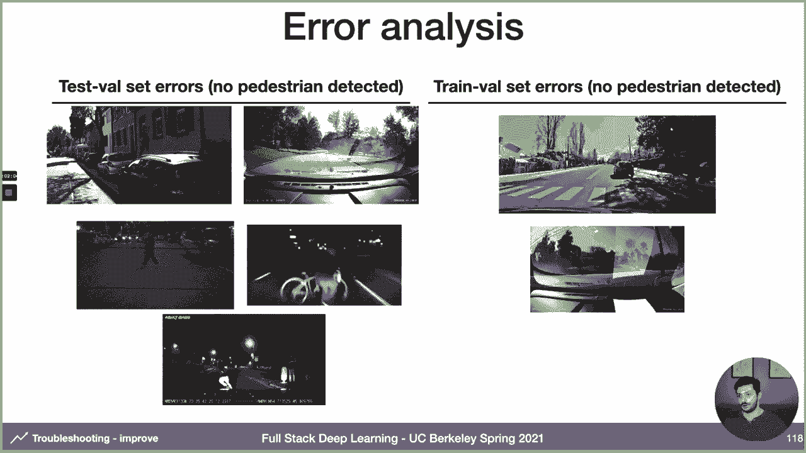

此时，训练误差达标，但验证误差可能仍很高（例如 10%），表明**过拟合（高方差）**成为主要矛盾。

### 2. 解决过拟合（减少方差）

以下策略按推荐度排序：

*   **添加更多训练数据**：最根本的方法。
*   **添加数据增强**：对图像进行旋转、裁剪等。
*   **添加正则化**：如权重衰减（L2）、Dropout。
*   **添加归一化层**：如 BatchNorm， LayerNorm。
*   **错误分析**：检查验证集错误。
*   **使用更合适的架构**。
*   **调优超参数**。
*   （不推荐）使用早停、减少特征。

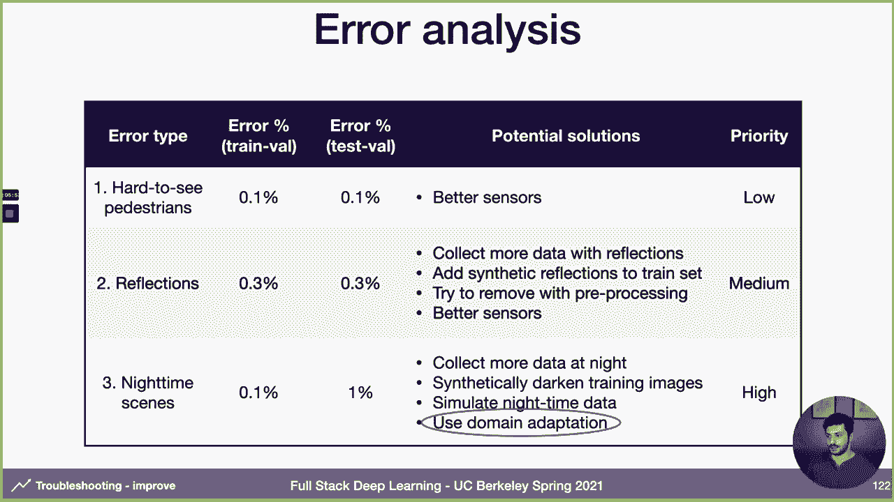

**示例迭代**：
1.  使用全量数据（25万张）→ 验证误差降低。
2.  添加权重衰减 → 验证误差进一步降低。
3.  添加数据增强（随机翻转、亮度调整）→ 验证误差接近训练误差。
4.  再次调优超参数（学习率、正则化强度）→ 验证误差达到目标 1%。

### 3. 解决分布偏移

如果“测试验证集”误差显著高于“训练验证集”误差，说明存在分布偏移。

解决策略：
1.  **错误分析并收集数据**：手动分析测试验证集上的错误样本，找出特有模式（如夜间图像），然后有针对性地收集更多此类数据。
2.  **合成数据**：对现有训练数据进行修改以模拟测试分布（如将白天图像调暗）。
3.  **领域自适应**：利用来自目标域的无标签或少量标签数据来调整模型。

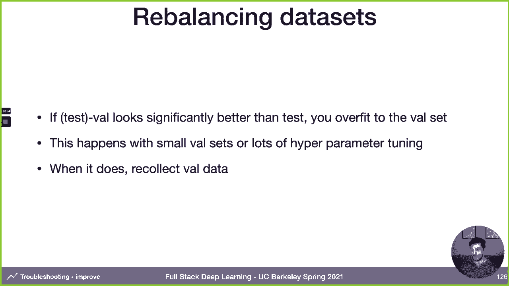

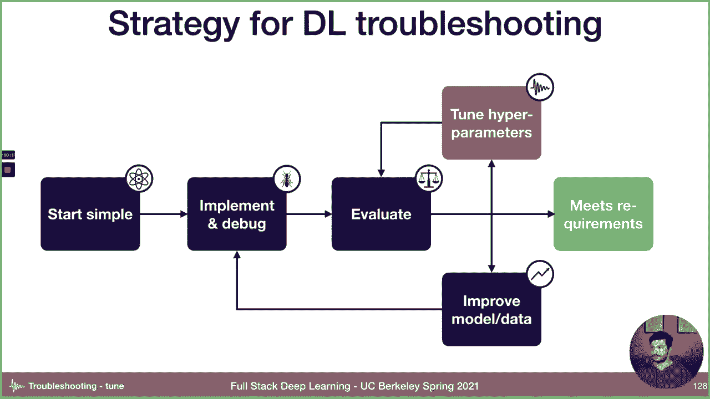

**错误分析表示例**：
| 错误类型 | 训练验证集占比 | 测试验证集占比 | 潜在解决方案 | 优先级 |
| :--- | :--- | :--- | :--- | :--- |
| 行人难以看清 | 小 | 小 | 使用更好传感器 | 低 |
| 图像反光 | 中 | 中 | 收集反光数据/数据增强 | 中 |
| **夜间场景** | **小** | **大** | **收集夜间数据/合成黑暗图像** | **高** |

### 4. 解决验证集过拟合

如果最终测试集性能显著低于验证集性能，说明可能对验证集进行了过拟合。解决方案是：**重新采样或收集新的验证集**。

## 第五步：超参数调优 🎛️

超参数调优是模型改进中的重要环节。

### 选择调优哪些超参数？

模型对不同超参数的敏感度不同。以下是根据经验总结的调优优先级（在已使用合理默认值的前提下）：

1.  **学习率及学习率调度**：几乎总是最敏感。
2.  **模型深度（层数）**、**层宽度（单元数）**：影响容量。
3.  **优化器相关**（如 `Adam` 的 `beta1`）：有时有效。
4.  **正则化强度**（如权重衰减系数）。
5.  **激活函数**、**批大小**、**权重初始化**：调整它们有时有提升，但通常不是首选。

### 调优方法

以下是几种常见方法，按推荐度排序：

*   **手动调优（“研究生下降法”）**：依靠经验和直觉。计算效率可能最高，但耗时且需要深厚知识。可作为其他方法的补充。
*   **网格搜索**：在定义好的网格上均匀采样。简单但效率低，尤其对多个超参数。
*   **随机搜索**：在定义好的范围内随机采样。**实证表明，在相同计算预算下，随机搜索通常优于网格搜索。** 实现简单。
*   **由粗到精的随机搜索**：
    1.  在较宽的范围进行随机搜索。
    2.  锁定表现最好的若干次运行。
    3.  在这些点周围缩小范围，进行新一轮随机搜索。
    4.  可重复此过程。**这是实践中强烈推荐的方法**，能在手动干预和自动化之间取得良好平衡。
*   **贝叶斯超参数优化**：使用概率模型指导搜索方向，效率最高。但实现和集成较复杂，适合成熟的项目或使用现有工具（如 `Optuna`， `Hyperopt`）。

**总结**：对于新项目，从**由粗到精的随机搜索**开始。随着项目成熟，可以考虑引入**贝叶斯优化方法**。

## 课程总结 📝

本节课中，我们一起学习了深度神经网络调试与故障处理的系统化方法。

我们认识到调试困难的根本原因在于：性能下降的根源多种多样且难以区分。为此，我们介绍了一套核心策略：**保持悲观，从最简单的可行方案开始，逐步、迭代地增加复杂性**。

我们详细探讨了该策略的四个阶段：
1.  **从简开始**：选择简单架构、合理默认值、标准化输入、简化问题。
2.  **实现与调试**：确保模型能运行、能过拟合一个批次、能与已知结果对比。
3.  **评估与决策**：运用**偏差-方差分解**框架分析误差来源，确定优化优先级（偏差->方差->分布偏移->验证集过拟合）。
4.  **迭代改进**：根据评估结果，有针对性地改进模型、数据，并运用**由粗到精的随机搜索**等方法进行超参数调优。

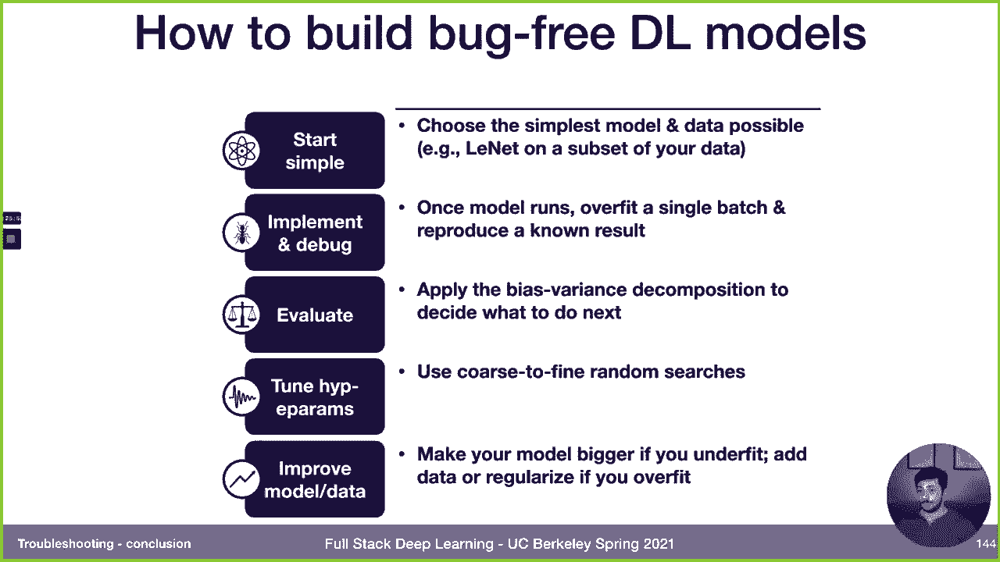

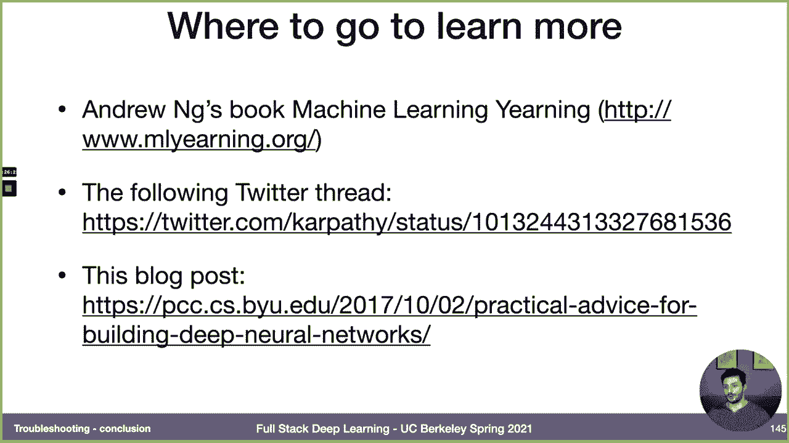

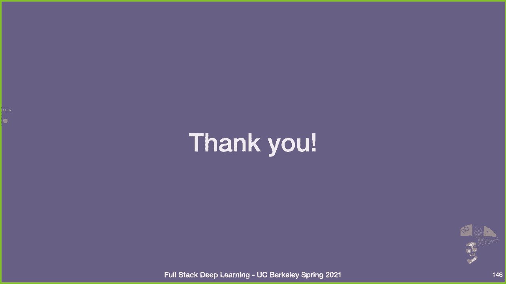

通过遵循这个流程，你可以更有信心、更高效地构建和优化深度学习模型，减少在“随机搅拌数据”中的迷茫时间。