# 15：L8- 数据管理 📊

在本节课中，我们将要学习深度学习项目中数据管理的核心概念、工具与最佳实践。数据是机器学习项目的基石，高效地获取、处理、探索和版本化管理数据，对于项目的成功至关重要。

## 概述与动机

我们首先来看一些关于数据重要性的观点。许多初级机器学习工程师最大的失败之一，是对构建数据集缺乏兴趣。实际上，在整理数据集的过程中可以学到很多东西。

一项针对数据科学家的调查显示，他们大部分时间都花在了数据清洗和数据移动上。另一位从业者也指出，在最近的几个项目中，数据管理占据了绝大部分工作量。

当我们具体思考深度学习的数据管理时，其过程可能涉及许多环节。数据可能最初以日志文件的形式散落在文件系统甚至多台机器上，或者存储在数据库中。但最终，我们需要将所有数据转移到GPU（或多GPU）旁边的本地文件系统中，这是进行深度学习训练的一个关键约束条件。

将数据转换为可训练格式的路径，对于每个项目、每家公司而言都是独特的。例如，你可能在ImageNet上训练，所有图像都是S3链接，你只需将它们下载到本地文件系统。或者，你可能自己从某处爬取了一批文本文件，然后使用Spark在集群上处理它们，得到一个可供分析和任务选择的数据框，再将子集转移到GPU。又或者，你正在从数据库收集日志和记录到数据湖或数据仓库（如Snowflake），然后从中处理数据并转换为可训练格式。

数据管理的可能性非常多，我们无法在本讲座中完全覆盖。事实上，我们将更多地讨论数据管理的细节。但在深入之前，我想先强调几个关键点。

**第一点**，我们不应在数据集上花费过多时间，但我们应该花十倍于预期的时间去真正“理解”数据，让数据“流过”你的思维。

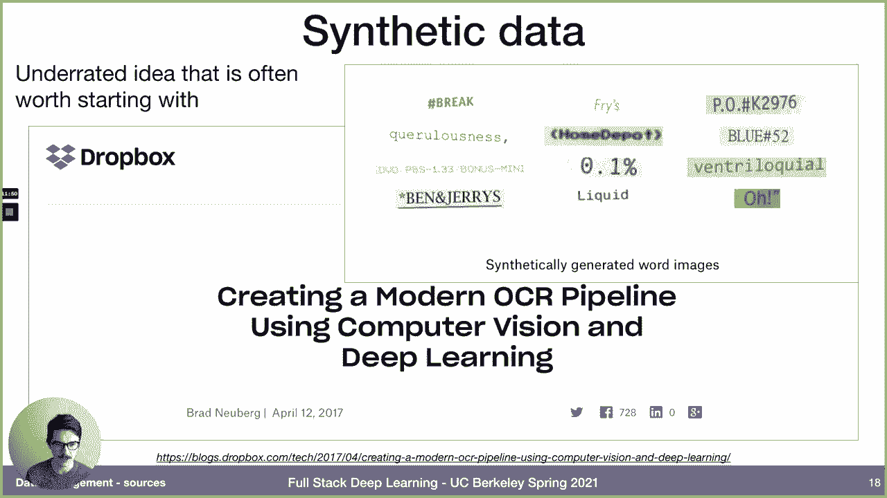

**第二点**，数据通常是提升整个机器学习项目性能的最佳途径。与其尝试新算法、新架构或启动超参数搜索，增加更多数据通常是改进性能的最好方法。在没有新数据的情况下，至少要想办法增强现有数据。

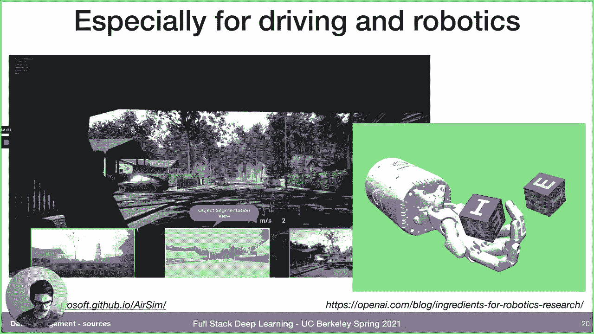

**第三点**，我们将讨论许多复杂的流程和术语，了解它们固然重要，但保持简单也同样关键。不要过度复杂化事情。归根结底，我们只是试图将数据转换成可以加载到GPU上的形式，这并非火箭科学。虽然这最终会占用我们大量时间，但我们仍应尽可能保持简单。

## 🗺️ 数据管理全景图

在几周前的基础设施讲座中，我们重点讨论了全景图中的训练和评估部分。今天，我们将重点关注数据部分，这包括数据源、数据湖/数据仓库、数据处理、数据探索、数据标注和数据版本控制。

对于大多数深度学习应用，我们需要大量专有数据。当然也有例外，例如强化学习、GANs，或者那些竞争壁垒不在于专有数据集，而在于专有计算方法的项目（例如需要数千个GPU和数百万美元，以及如何运行它们的专业知识，GPT-3可能就是这种情况）。但对于大多数其他情况，我们需要专有数据集。

公开可用的数据集很有用，但它们没有竞争优势，因为任何人都可以获得相同的公开数据集，并达到与你的模型相同的性能水平。然而，它们对我们仍然有用，可以作为基准测试的工具。

通常，公司或项目最终会花费资金和时间来标注自己的数据。例如，为金融、房地产或农业应用开发模型，你可能需要不同于其他人的标签。很多时候，你必须购买数据，并购买人力时间来标注它。

**数据飞轮**是一个有趣的概念。如果你能让模型面向用户，并以一种让用户实际贡献优质数据、清理数据甚至修正模型预测的方式来开发产品，这通常被称为数据飞轮，它可以在V1模型发布后实现快速改进。

**半监督学习**是当前非常流行的一个重要思想。其理念是你不一定需要花钱标注数据，而是可以通过重新定义问题，让任务略有不同。例如，对于文本，你可以用过去的数据预测未来的数据（如补全句子），或者用句子结尾预测开头，用周围词语预测中间词语，或者判断两个句子是否出现在训练语料库的同一段落中。有很多方法可以构建问题，使你实际上不需要标注任何东西，只需用数据自我监督。这同样适用于视觉领域。事实上，就在几天前，Facebook AI Research发布了一个名为SEER的模型，它在10亿张随机图像（而非ImageNet的100万张标注图像）上训练，却能在ImageNet的Top-1预测任务上达到最先进的准确率。他们发布了用于构建任务的库（称为Vissel），其中包含对比散度损失等损失函数，值得一看。

**增强训练数据**是必须做的事情，至少在视觉模型中如此。例如，你可以调整图像对比度、裁剪不同部分、遮挡图像块、像素化、旋转、剪切等。TensorFlow、PyTorch等框架都提供了帮助实现这些功能的函数。数据增强通常在CPU上与GPU训练并行进行：GPU训练时，CPU生成增强后的训练数据。

对于表格数据，你可以通过空白部分单元格来模拟缺失数据。对于文本数据，虽然没有非常成熟的技术，但你可以用同义词替换词语，或者改变某些内容的顺序。对于语音和视频等时序数据，你可以裁剪部分内容、改变速度、拉伸或压缩时间线、注入不同类型的噪声，或者在不同频率上进行掩码。

**合成数据**是一个有趣的想法，通常值得从它开始，但根据我的经验，实际使用并不频繁。这里链接了一篇来自Dropbox的博客文章，他们使用大量合成生成的单词图像构建了一个OCR（光学字符识别）流程，用于处理用户存储在Dropbox中的文档。

合成数据可以做得非常深入。例如，Andrew Moffett的一个项目，在收据图像上训练OCR，这些收据实际上是在Unreal Engine等3D引擎中渲染的。因此，这是一个完整的3D表面变形模拟，可以模拟疯狂的照明条件和阴影。右侧的所有图像都是合成生成的，但你仍然拥有完美的真实数据，因为你确切知道变形是如何完成的，从而知道图像中每个像素的标签。

对于驾驶和机器人技术，合成数据几乎是必须的，这通常被称为“仿真到现实”。Josh Tobin在这方面做过研究，如果你想了解更多可以与他交流。

## 🧱 数据存储基础：块、文件系统与数据库

接下来，我们讨论数据存储的基础：文件系统、对象存储、数据库、数据湖/数据仓库。什么数据应该放在哪里？以及我们如何了解更多。

**文件系统**是存储数据的基础层，我们习惯以文件为单位进行思考。文件可以是文本文件或二进制文件。文件系统本身不提供版本控制，文件容易被覆盖或删除。文件系统可以是你插入并格式化的硬盘，也可以是网络文件系统（如NFS），使得同一硬盘可从不同机器访问，还可以是分布式文件系统（如Hadoop文件系统），数据存储并访问自多台机器。

在存储速度方面，最新的NVMe SSD技术非常快。例如，SATA硬盘的吞吐量约为200 MB/s，SATA SSD约为500 MB/s，而NVMe SSD可达3 GB/s。寻道时间也是如此：硬盘约2毫秒，SSD更快，NVMe SSD则快得多。

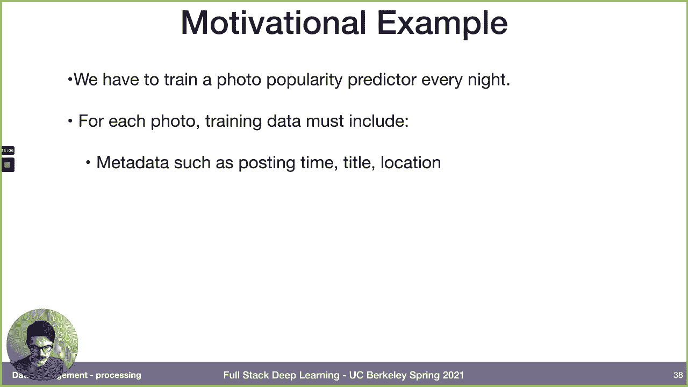

我们应该以什么格式存储数据？对于图像、音频、视频等二进制数据，通常直接存储为文件，例如文件夹中的图像文件。TensorFlow有TFRecord格式，用于批处理二进制文件，将大量单个文件打包成批次文件，这在旧式硬盘上很有意义，但对于高速NVMe驱动器似乎不那么必要。

对于大型表格数据或文本数据，有一些选择。你可以将它们存储为文件，这完全可以。但如果你从不同来源加载文件到数据框中，并希望存储以便下次项目可以从某个中间格式开始，而不是从头开始，你有几个选择：HDF5功能强大但臃肿，似乎不再活跃开发；Parquet格式来自Hadoop和Spark大数据世界，目前我推荐使用它来存储这类数据；Feather是最新的好选择，由Apache Arrow开源项目支持，发展迅速，旨在成为数据分析的交换格式，它是一种内存映射的列式数据存储，操作速度非常快。

PyTorch等框架提供了自己的数据集接口（如DataLoader），应尽可能使用它们，因为这是官方支持的数据加载方式。偏离越远，越可能遇到问题。

**对象存储**可以看作是文件系统之上的API。Amazon S3是典型例子，我们可以通过REST API调用获取、存放、删除文件，而不必担心文件具体在哪个物理磁盘上。对象可以是文本文件或二进制文件（通常是二进制文件）。有趣的是，你可以在API中内置版本控制和冗余。存储文件时，后端可以递增版本号，而不是覆盖旧文件。对象存储的速度不如从本地驱动器读取文件快，但在云环境中（例如云计算实例访问S3文件）通常足够快。

实际上，Databricks有一张幻灯片建议人们将日志文件等存储在S3上，而不是配置自己的HDFS文件系统。他们给出的理由是S3具有弹性（可存储任意数量的文件）、相当便宜、高可用性、非常耐用，甚至可以有事务性保证，相当不错。

**数据库**这个词指的是持久、快速、可扩展的结构化数据存储和检索系统，这些数据会被反复访问。例如，日志是结构化数据（包含时间戳、访问页面、REST动词等），但通常不会被反复访问，它只是被存储以备不时之需。而在数据库中，你不会存储日志，你会存储像用户名、图像标签等可能变化且需要反复查看的数据。

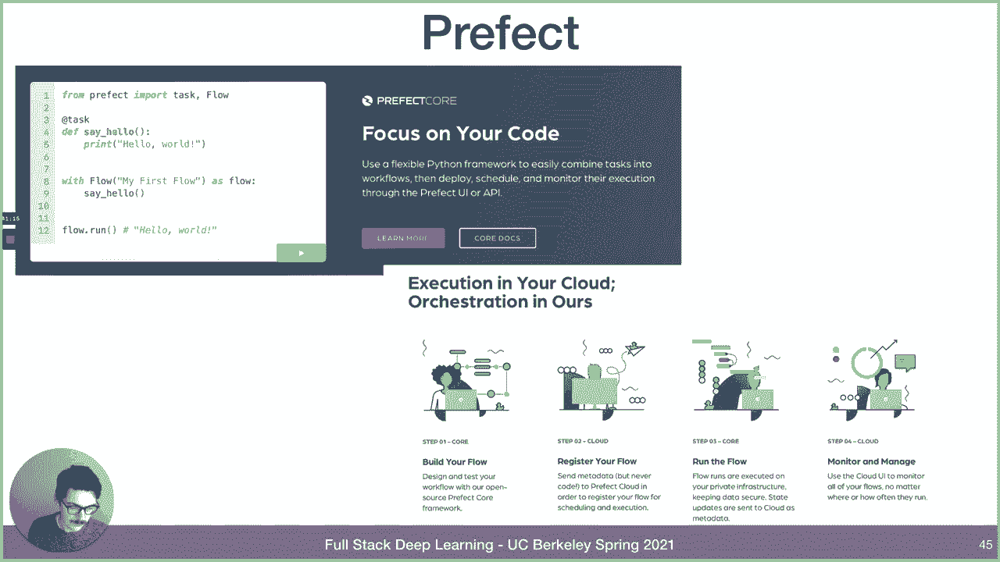

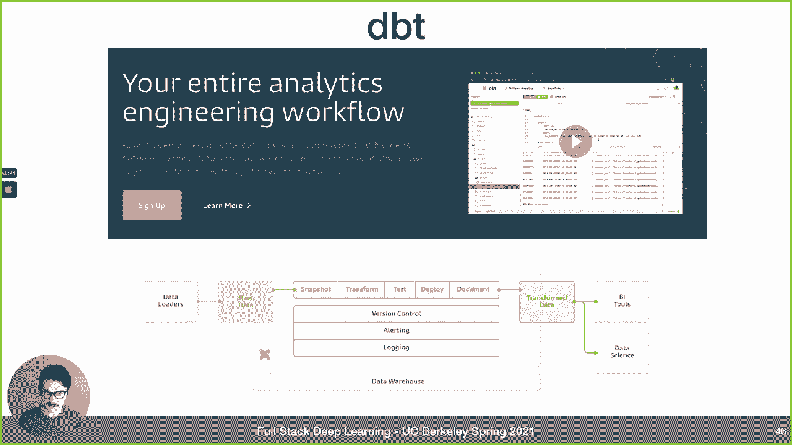

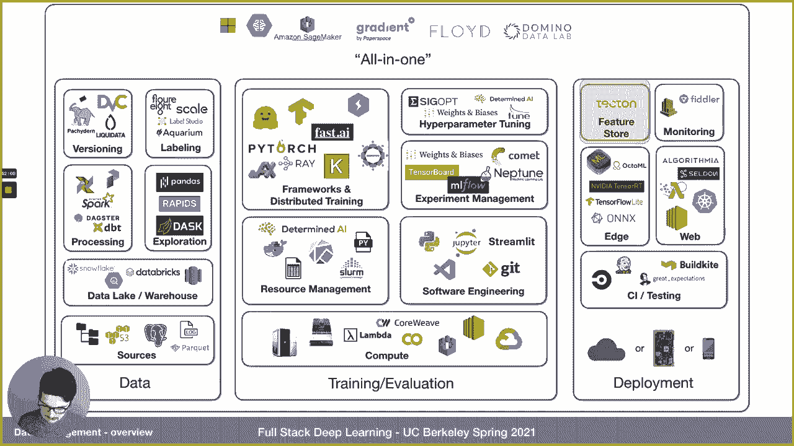

你可能听说过OLTP（在线事务处理），这就是我们所说的数据库类型。其速度之所以快，是因为所有数据实际上都保存在内存中。有一台运行中的机器将所有数据保存在其内存中，并保证会持久化到磁盘且不会丢失，同时有一致性保证（例如不允许两个冲突的写入同时通过）。但速度快的主要原因是因为大多数时候它并不从磁盘寻址，数据就在RAM中。注意，数据库不存储二进制数据，你应该在数据库中存储对二进制数据的引用（例如S3的URL），而将实际的二进制图像存储在S3中。

我们大多数时候推荐使用PostgreSQL数据库，因为它是一个优秀的SQL数据库，同时也支持非结构化的JSON。SQLite非常适合小型项目，事实上很多移动应用等都在使用它。

你可能听说过NoSQL，这在2010年代是件大事。NoSQL主要指存储非结构化的JSON数据。与拥有模式（Schema）不同，NoSQL方法是不定义模式，只是将你想存储的任何数据做成JSON文档存入NoSQL数据库，然后能够获取它。显然，它在获取或分析数据时不会那么快，也可能存在一些一致性问题（例如两个单独的写入可能通过，但与对世界状态的理解相冲突）。当你只需要一个简单的键值存储时，NoSQL非常有用。对于很多项目，你不需要完整的数据库，只需要一个持久的字典，Redis在这方面很棒。

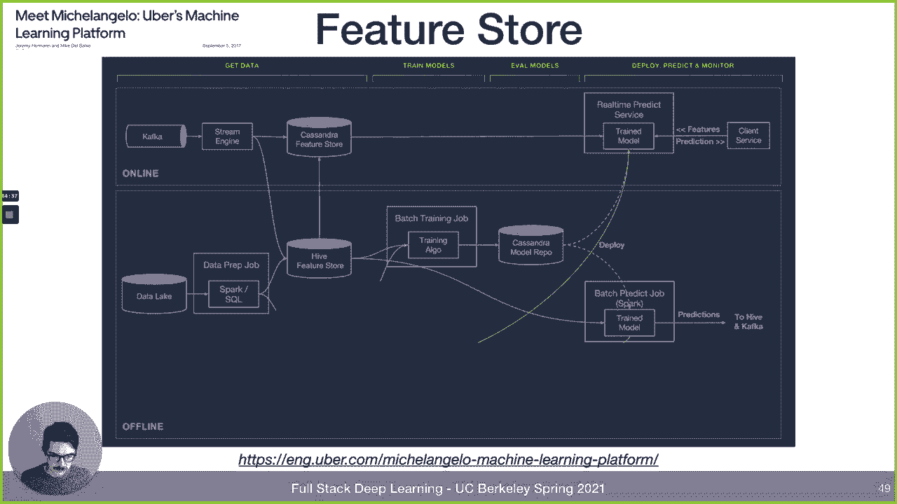

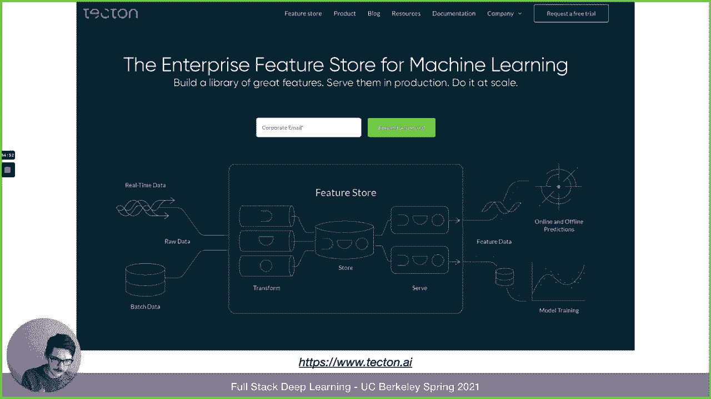

**数据仓库**是不同数据源的某种聚合，结构化在一个单一位置用于分析，也称为OLAP（在线分析处理），与OLTP相对。另一个你可能听说过的缩写是ETL，代表提取、转换、加载。其思想是你有所有这些不同的数据源（如云中的日志、事务处理数据库PostgreSQL、平面文本文件等），你将从中提取数据，转换为某种通用模式，然后加载到数据仓库中。之后，你可以从仓库加载所需的数据子集，生成报告，运行分析查询。这类软件包括Google的BigQuery、Amazon的Redshift、Snowflake等。大多数这些解决方案使用SQL作为数据接口。

SQL显然是一门古老的语言。而有些解决方案（如Databricks）使用数据框（DataFrame）代替SQL。SQL是结构化数据的标准接口，但在Python中，Pandas是主要的数据框解决方案，通常是人们需要分析数据时的首选。

右侧有一个SQL和数据框的对比示例。例如，你想从名为`tips`的数据表中选择三列并获取前五个结果。在SQL中，你写：`SELECT total_bill, tip, smoker, time FROM tips LIMIT 5`。而在Pandas这样的数据框语言中，你将`tips`作为一个对象，选择列`total_bill, tip, smoker, time`，然后调用`.head(5)`获取前五个结果。当然，当你开始连接不同数据源、按不同列分组、计数、聚合时，情况会更有趣。在第一个仅选择列的例子中，我更喜欢数据框语言；但在第二个需要进行分析性分组等操作的例子中，我实际上更喜欢SQL。如果你从未使用过SQL和Pandas，我们的建议是尝试使用两者。找一个有机会使用SQL的项目，再找一个有机会使用Pandas的项目。要成为一名优秀的数据工程师、数据科学家、机器学习工程师甚至机器学习科学家，你应该真正精通SQL。

**数据湖**的概念源于数据仓库。其思想是：我们有数据库、日志等所有这些数据源，数据仓库的方法是必须确定一个模式，将所有数据源转换到该模式中然后存储。但如果相反，我们采用提取、加载然后转换的方式呢？即从所有数据源提取数据，加载到数据湖中，然后稍后根据分析需要转换原始数据。我们只是将所有东西“倾倒”进这个湖里，然后以后能够对湖中的原始数据进行转换，可能加载到数据仓库，或者加载到其他东西中。

该领域的趋势是在同一套件中同时实现两者。Databricks的Lakehouse平台既是一个仓库也是一个数据湖，它是一个名为Delta Lake的开源项目，非常不错。你可以在其中存储所有数据：结构化数据、半结构化数据（如日志）以及非结构化数据（如从互联网爬取的文本文件、图像甚至视频）。然后，你的分析引擎甚至机器学习引擎稍后可以使用它。这是Databricks的愿景，也是整个领域的愿景。

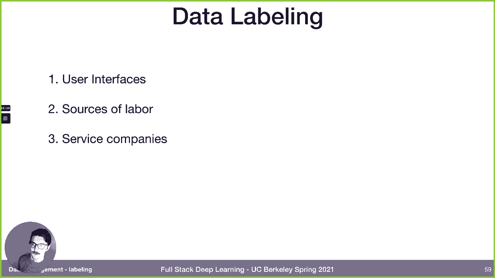

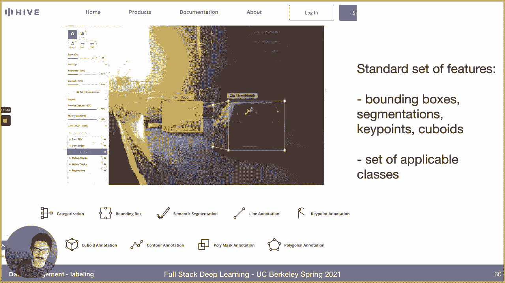

以上内容很多，但现在可以这样简单理解：如果你必须存储数据，对于图像等二进制数据，将其作为对象存储在S3中。对于关于该数据的元数据（如图像标签或用户活动记录，如谁上传了文件），将其存入事务型数据库。如果你需要数据库中尚未存在的特征（例如用户登录并查看此图像的次数日志），那么建立一个数据湖，将数据转储、处理、聚合。当你真正准备使用深度学习训练该数据时，再将所需的一切复制到GPU旁边的本地文件系统上，使用你能管理的最快的驱动器。

关于数据管理的故事还有很多，整个领域实际上都处于不断变化之中，数据侧与训练和评估侧一样充满活力。本周的阅读材料是一篇关于新兴数据基础设施架构的文章。如果你真的对此感兴趣，可以学习更多课程（如数据库课程），也可以阅读《Designing Data-Intensive Applications》这本书，这是一本非常好的书，也是这类主题的常用资源。

## ⚙️ 数据处理流水线

我们一直在暗示一些动机，现在让我们具体化。假设我们必须每晚训练一个照片流行度预测器，因为我们运营着一个对此有用的网站。对于每张照片，训练数据应包含：发布时间、标题、发布地点、用户相关信息（如当天登录次数），以及一些机器学习模型识别的图像内容（如内容、风格是快乐还是悲伤等）。

因此，元数据将存储在我们的数据库中。关于用户的一些特征，我们可能需要从日志中计算，因为它们不在数据库中。而要了解图像内容，我们需要实际运行一些分类器模型。在训练实际预测流行度的模型之前，有许多任务必须完成。例如，在完成所有内容/风格模型的运行以及日志分析等工作之前，我们无法开始训练流行度预测器。当一个任务完成时，它应该触发依赖于它的任务，因为我们不想一直管理这个过程，只想启动它。理想情况下，重新计算某些内容应取决于其内容，而不是日期等其他因素。

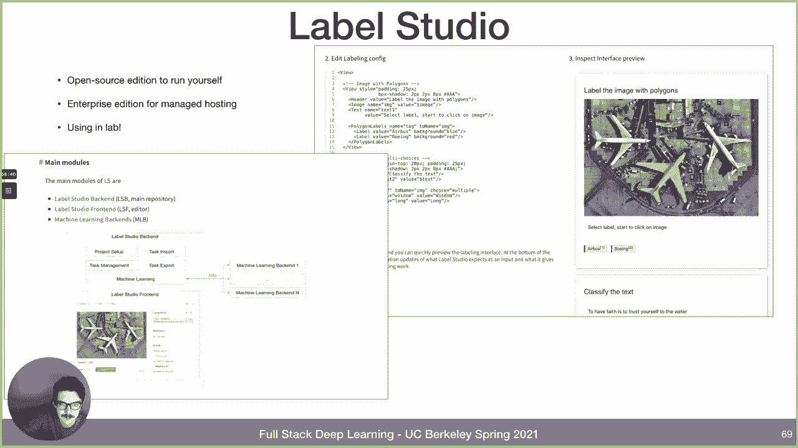

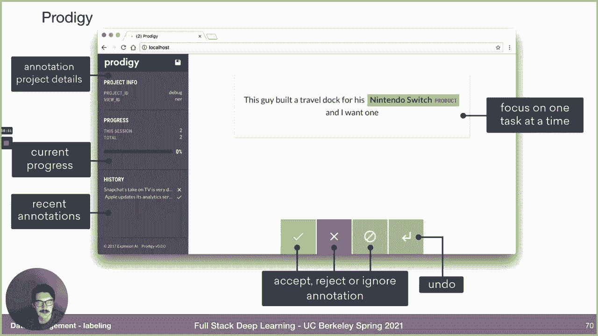

我们讨论的依赖关系可能不是简单的文件，也可能是程序的输出或数据库中的内容。我们的工作可能不仅在一台机器上进行，而是分布在许多不同的机器上。而且，我们可能不是唯一训练预测器的人，可能其他人也在同时训练不同的东西，所以多个任务同时发生。

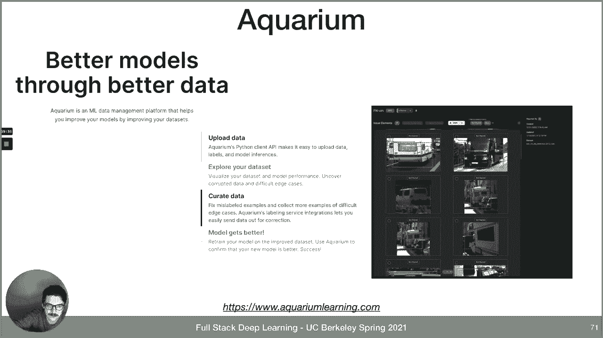

旧的“大数据”风格解决方案是Hadoop和MapReduce实现。你需要处理大量数据，因此启动许多不同的任务，每个任务处理一部分数据（映射），然后将它们的输出合并为单个输出（归约）。它应该能在商用硬件或多样化硬件上运行，并且有一些缓存方法可以真正加速它，这某种程度上让Spark崭露头角。

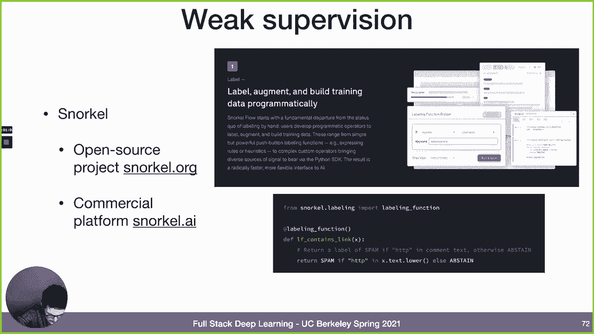

但这有点过时了，因为它假设了一个庞大或单一的处理环境。在现代环境中，例如，你不能在运行Spark作业的同时运行一个机器学习模型，除非该模型本身是用Spark编写的。但如果你有一个PyTorch模型、一个TensorFlow模型，还需要分析日志，这些都非常不同。

更现代的工具可能从Apache Airflow开始。它允许你定义作业的有向无环图（DAG），这些作业可以是SQL操作、Python程序执行，甚至是简单的文件。它允许你用不同的东西定义DAG然后运行它。为了运行它，你需要一个管理器——工作流管理器，这通常被称为工作流处理。工作流管理器有一个包含所有待完成任务队列，它们知道任务之间的依赖关系，知道能够执行任务的工人，然后管理任务：将任务分配给工人，如果失败则重启它们。

Apache Beam是这类工具之一。TensorFlow团队通过TensorFlow Datasets接口提供了许多数据集，他们似乎使用Apache Beam进行这类处理，并在Google Cloud Dataflow（一种云编排器）上运行。例如，几周前我们讨论过的T5 Transformer模型，是在一个名为“Colossal Clean Corpus”的网页爬取语料库上训练的，该语料库大小为7TB。在实际训练之前，你需要将原始的爬取输出处理成某种可训练的形式。我不完全确定他们为什么没有为我们做这件事，但他们给了我们原始形式和脚本来处理它，我认为这需要数百个工人和大约20小时来处理。

Prefect是越来越多人用来替代Airflow的工具，但理念相同。它是一个Python框架，可以更轻松地定义任务（任务可以是代码或SQL等），然后Prefect托管解决方案会为你编排，你不需要担心启动自己的编排器，只需定义任务并将其推送到Prefect，然后Prefect告诉你自己的硬件实际运行什么任务。

DBT提供了用SQL完成这类事情的能力。因此，与其为大量处理编写Python代码，是否可以只写SQL来完成？这对于熟悉SQL的数据科学家（很多数据科学家都熟悉）和数据工程师来说是一个不错的解决方案，他们称之为分析工程，这是一个很好的想法。

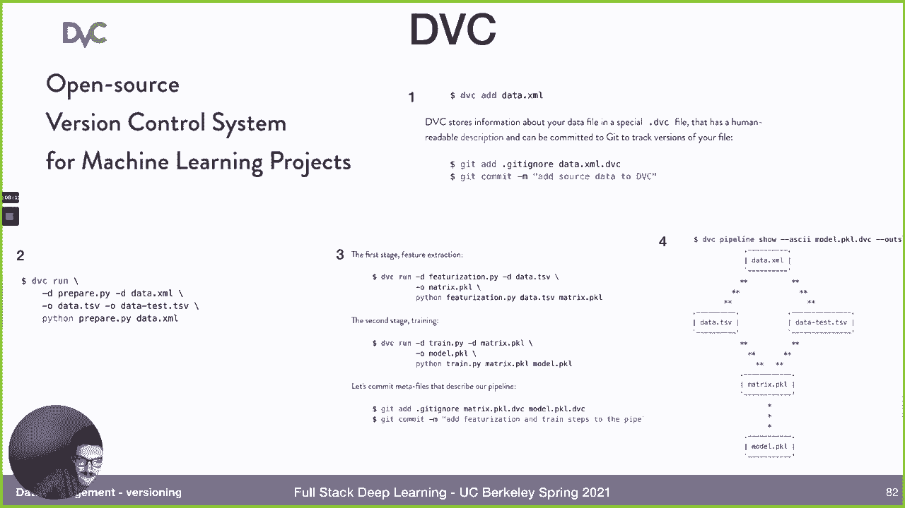

Dagster是另一个目前似乎相当流行的数据编排器，可以与许多工具配合使用，并支持本地测试。

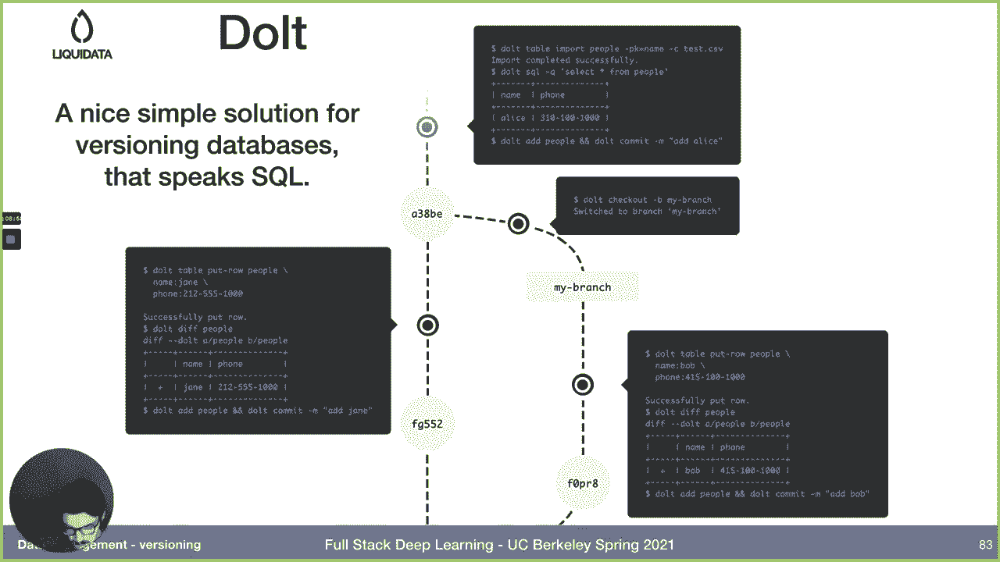

最后，我们将跳到部署端，讨论**特征存储**的概念。特征存储的想法最早由Uber推广，当时他们公开了名为Michelangelo的机器学习平台。特征存储分为两部分：上半部分是在线处理，下半部分是离线处理。

其思想是：训练模型是一个离线任务。因此，我们将从数据湖中获取数据（以Uber为例，假设我们正在训练一个模型来预测乘车价格，基于大量关于需求、行程长度、司机可用性等历史数据）。所有这些数据都在我们的数据湖中，来自多个数据库和日志文件等。我们将使用Spark或SQL准备数据，并将其加载到基于Hive的特征存储中。然后，该特征存储可以向我们的训练算法提供训练数据，从而得到一个模型放入模型仓库。最后，当模型准备好时，我们可以在预测服务中部署它。但在预测服务中，模型用于预测的数据流并不相同：它不是来自数据湖，不经过Spark，不落地到Hive，而是通过一个单独的流（本例中是Kafka流引擎）进入Cassandra（另一种类型的数据库特征存储），然后从那里到训练好的模型。

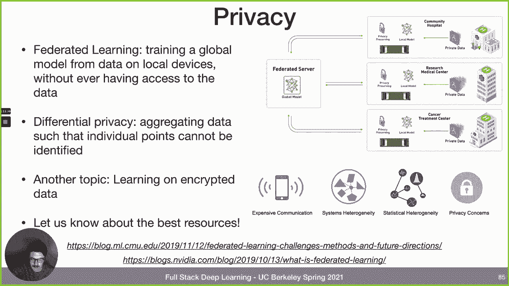

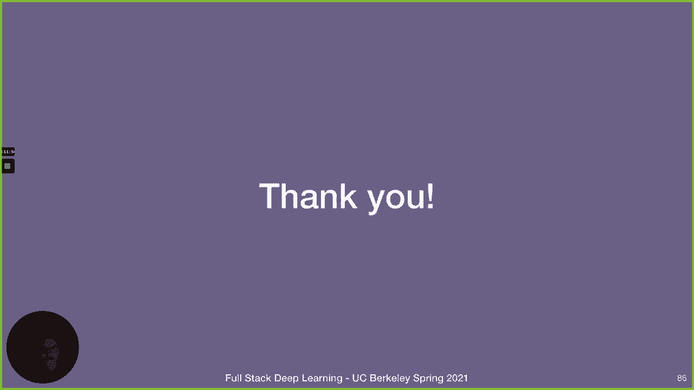

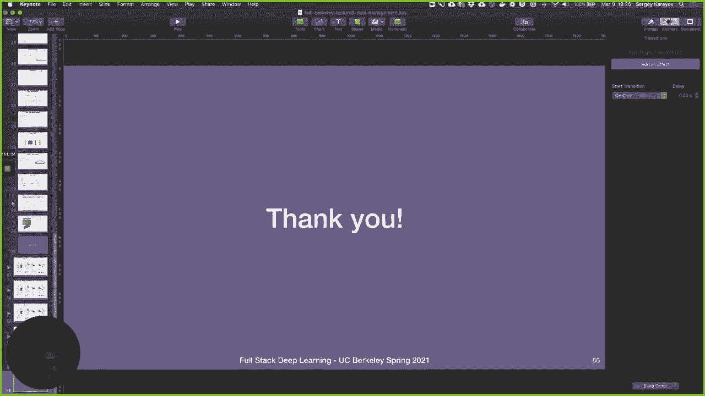

这里强调这一点是因为这可能导致很多错误，因为这是两个不同的数据处理流水线：一个是离线的，一个是在线的。但如果我们将它们的逻辑尽可能统一到这个统一的特征存储中，那会好得多：我们不需要两个独立的代码库，不需要两个独立的错误源等等。Uber的一些人创办了一家名为Tecton的公司，它是主要的特征存储公司