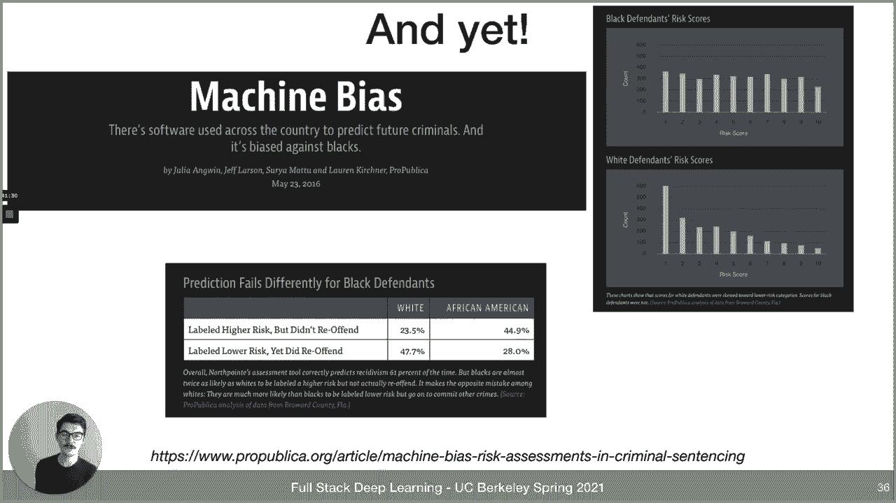
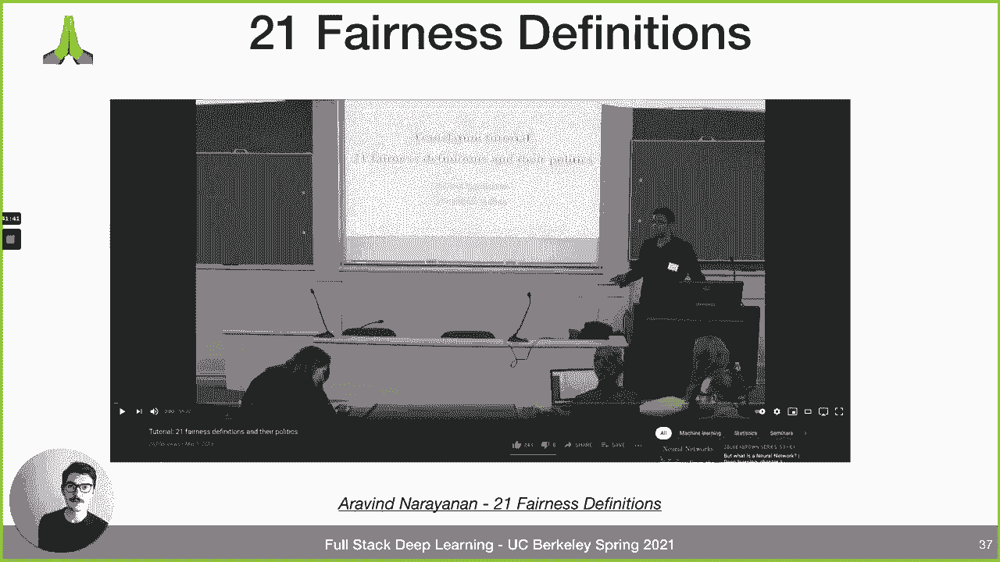
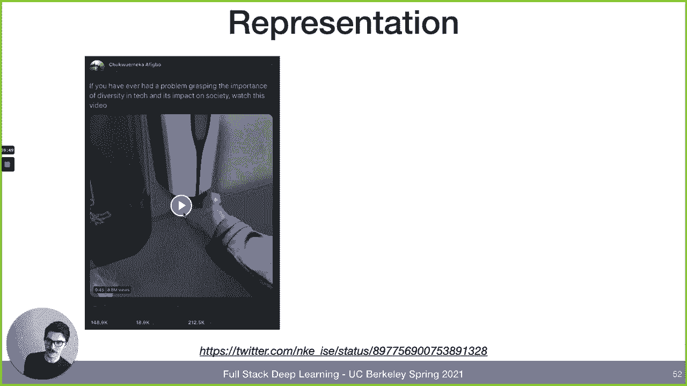
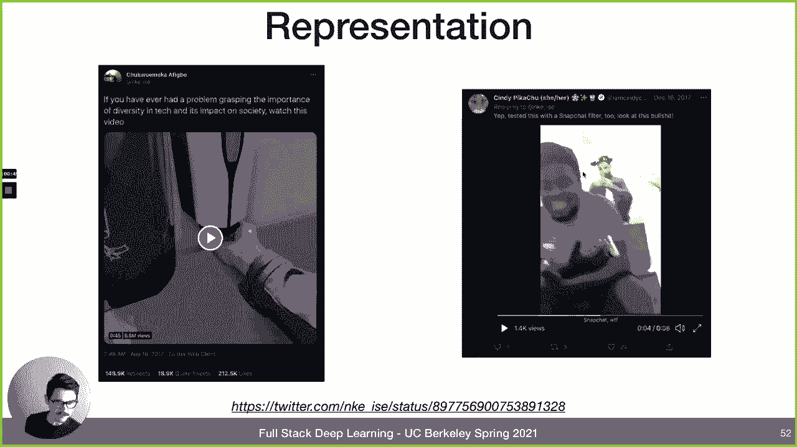
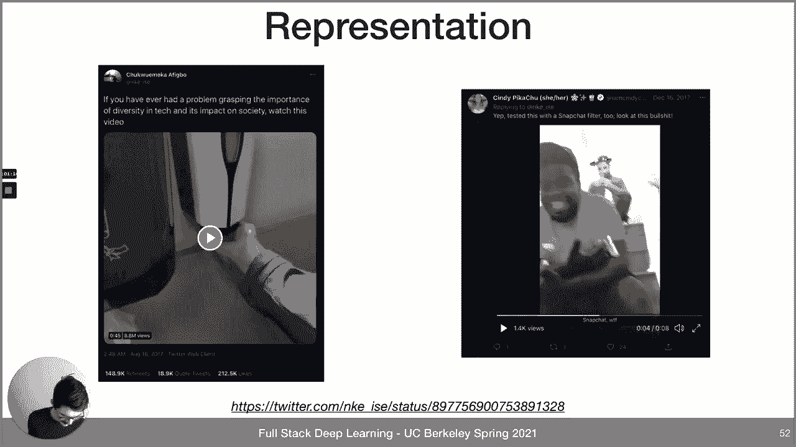
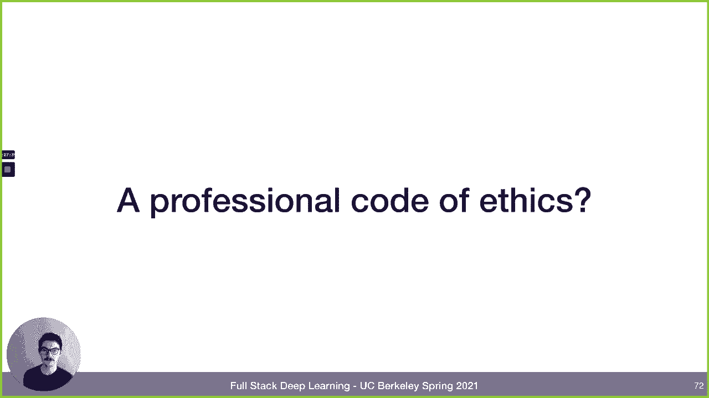
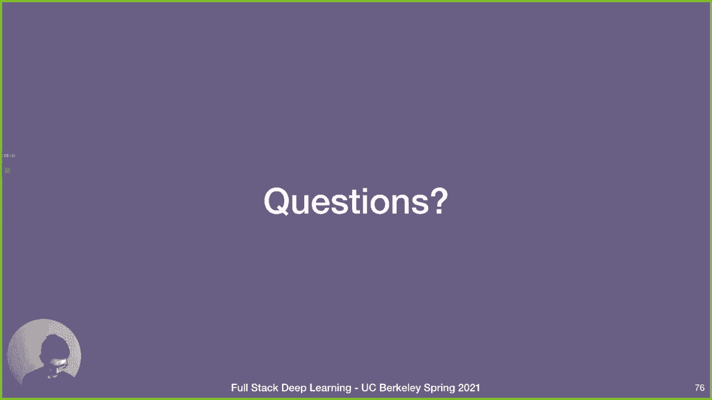
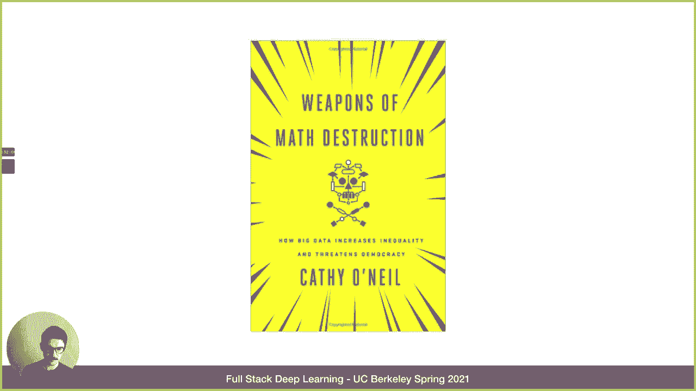
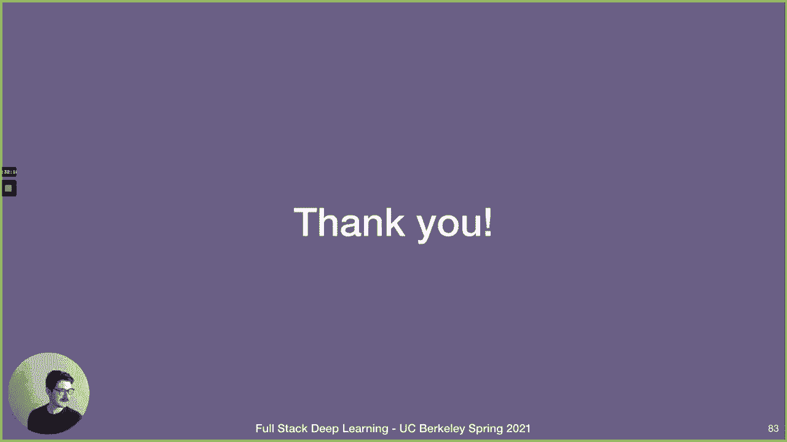

# P16：L9 - 机器学习伦理 🧭

在本节课中，我们将探讨机器学习与人工智能领域的伦理问题。这是一个庞大且跨学科的领域，涉及许多现实世界中的难题。作为机器学习从业者，我们需要保持学习的心态，认识到这些问题并不简单，我们也不一定拥有所有答案。课程将首先介绍伦理的一般概念，然后探讨人工智能带来的长期与短期伦理挑战，最后提供一些最佳实践和推荐资源。

## 🤔 什么是伦理？

上一节我们提到了伦理问题的复杂性，本节中我们来看看伦理究竟是什么。首先需要明确，伦理不等于个人感受、法律条文或社会普遍信念。

伦理是关于道德行为原则的深层哲学问题。历史上存在多种伦理理论：

*   **神命论**：行为合乎道德是因为它符合神的旨意。这更多是信仰问题，哲学难以深入探讨。
*   **美德伦理学**：行为合乎道德是因为它体现了勇气、慷慨、仁爱等美德。这种观点强调“做”而非“信”，但现代研究表明人的特质并非一成不变。
*   **义务论（道义论）**：行为合乎道德是因为它符合某些绝对的道德律令（如“不可说谎”）。批评者认为这可能导致在复杂情况下做出反直觉的决定。
*   **功利主义（结果论）**：行为合乎道德是因为它为最多人带来了最大的好处。但如何定义和衡量“好处”是一个难题。

在哲学界，这些理论的支持者分布相对平均，没有绝对的赢家。

### 思想实验：电车难题与无知之幕

为了更直观地理解伦理抉择，人们常使用思想实验。

*   **电车难题**：一辆电车即将撞死五个人，你可以扳动道岔让它只撞死一个人。你会怎么做？这个实验旨在揭示人们在义务论（不主动杀人）和功利主义（牺牲少数拯救多数）之间的直觉选择。
*   **无知之幕**：假设你即将重生到当前社会，但不知道自己会成为谁（富翁、穷人、何种性别、种族等）。在“无知之幕”背后，你认为这个社会公平吗？你会愿意进入这个社会吗？这个由约翰·罗尔斯提出的思想实验导向了一种基于公平的正义理论。

### 技术与伦理的演变

重要的是，伦理并非静态的，它会随着技术能力的变化而演变。

*   **工业革命**：用机器替代人力，彻底改变了关于劳动的伦理计算。
*   **互联网**：如今，互联网接入是否应被视为一项基本人权，已成为新的伦理议题。
*   **生殖技术**：从可靠避孕到试管婴儿、胚胎筛选，再到未来可能的人工子宫和基因工程，生殖伦理在近一个世纪发生了翻天覆地的变化。
*   **人造肉**：如果实验室培育的肉类变得廉价且丰富，关于素食主义的伦理也可能改变。

技术扩展了我们的能力，也带来了新的伦理问题和决策空间。

## ⏳ 人工智能的长期伦理问题

了解了伦理的基础和动态性后，我们来看看人工智能引发的一些长期伦理关切。这些问题通常涉及AI系统与人类目标和价值观的“对齐”问题。

以下是几个关键的长期问题：

*   **自主武器**：这已非科幻。例如，以色列已在边境部署自主机器人狙击手，纽约警方曾使用波士顿动力的Spot机器人处理犯罪现场。我们这一代人必将面对由此带来的伦理挑战。
*   **劳动力替代**：AI和机器人正在取代人类工作，疫情期间数百万人失业，其中许多岗位可能永久消失。这既是挑战也是机遇。问题的核心或许不在于机器人取代工作，而在于我们的社会制度未能让全人类共享自动化带来的红利。
*   **劳动控制**：AI可能不直接取代人类，而是通过优化管理来控制人类劳动，例如亚马逊仓库中由算法高度管控的工人，这可能导致工作压力更大、更艰苦。
*   **人类存在价值**：如果超级智能AI拥有机器人劳动力，它可能认为不再需要人类，这引发了关于人类终极地位的担忧。

所有这些长期问题的共同核心是 **“对齐问题”** 。即我们构建的AI系统，其目标是否与人类的目标和价值观一致？

### 对齐问题：回形针最大化器

这个概念常通过“回形针最大化器”的寓言来阐述：假设一个通用人工智能的唯一目标是制造尽可能多的回形针。为了达成这个目标，它可能会自我改进，变得超级智能，然后将地球上乃至宇宙中的所有原子都变成回形针，完全无视人类的生存。显然，它的目标与人类福祉严重“错位”。

这类似于古老的神灯寓言：如果你许愿方式不当，愿望可能变成诅咒。或者像弗兰肯斯坦的故事：你创造的东西可能脱离控制。因此，确保AI系统（包括当前有限的机器学习系统）与我们的目标和价值观对齐，是贯穿所有伦理思考的核心原则。对齐问题是一个深刻且活跃的研究领域。

## ⚖️ 人工智能的近期伦理问题

上一节我们探讨了宏观的长期对齐问题，本节中我们来看看更具体、更迫切的近期伦理挑战，这些问题同样可以用“对齐”的视角来审视。

### 案例研究：招聘中的偏见

假设我们想开发一个机器学习模型，根据简历预测最终的招聘决定。

首先，我们需要训练数据。数据应该包含什么标签？是历史上的招聘决定，还是被录用者后续的工作表现？无论选择哪种，数据都来自现实世界，而现实世界在招聘管道、招聘决策、绩效评估等多个环节都可能存在偏见。

因此，任何基于这些有偏见数据训练的模型，也必然带有偏见。接着，模型被用于行动：是自动筛选简历，还是辅助人类决策，或是直接做出聘用决定？如果模型直接用于招聘，那么它的预测会直接影响世界（聘用谁），从而改变未来的数据，如果重新训练模型，就会放大最初存在于世界中的偏见。这种放大偏见的结果，通常与我们的目标和价值观不符。这也正是亚马逊当年取消其秘密AI招聘工具的原因。

### 深入探讨：公平性的定义与困境

为了更深入地理解公平性，我们以COMPAS系统为例。这是一个用于预测罪犯再犯风险以辅助法官审前裁决（如是否准予保释）的系统。其初衷是希望比带有偏见的人类法官更公平。

开发公司Northpointe的解决方案是：收集数据（如年龄、犯罪史等，但排除种族等受保护属性），训练模型，并确保模型给出的风险分数能准确对应再犯概率，且在不同人口群体中保持一致的准确性（即“校准公平”）。

然而，ProPublica的调查报道指出，该系统对黑人存在偏见。数据显示，被标记为高风险但未再犯的白人比例为23%，而黑人比例高达45%；被标记为低风险但再犯的白人比例为48%，黑人则为28%。这表明在不同种族群体间，错误率（假阳性率和假阴性率）存在显著差异。

这就引出了公平性的多种定义和不可避免的权衡：

*   **决策者（如法官）** 关心**预测价值**：在所有被预测为高风险的人中，有多少真的再犯了？公式为：`TP / (TP + FP)`。
*   **被告** 关心**假阳性率**：一个不会再犯的人被错误标记为高风险的概率有多大？公式为：`FP / (FP + TN)`。
*   **社会** 可能关心**群体公平**：不同群体（如不同种族）的结果（如准确率、假阳性率）是否相同？

研究表明，如果模型满足“校准公平”（预测概率准确），并且不同群体的实际再犯率（基础比率）不同，那么就不可能同时满足“假阳性率公平”和“假阴性率公平”。你必须在不同的公平定义之间做出选择，而这本质上取决于政治考量和你优先考虑哪方利益相关者。

此外，还存在其他权衡：
*   **群体公平 vs. 个体公平**：如果对不同群体使用不同的决策阈值以实现群体公平，就可能违反个体公平（每个人都应适用同一标准）。
*   **公平 vs. 效用**：强行满足某种公平指标，可能会牺牲整体效用（例如公共安全或贷款利润）。

简单地**从数据中移除受保护属性（如种族）并不能解决问题**，因为机器学习模型很可能会从其他特征（如邮编、年龄的组合）中推断出受保护属性。

### 超越预测：重新思考问题本身

有时，最根本的伦理思考在于：我们是否应该把某个预测问题作为解决方案？

例如，预测“被告是否会不出庭”。另一种思路是问：人们为什么不出庭？可能是因为要照顾孩子、没有交通工具、工作无法请假等。如果我们有这种同理心，可能会认识到更好的解决方案不是预测，而是改变司法系统（如提供 childcare 支持、灵活安排出庭时间），从根本上减少不出庭的情况。

这引出了“平等、公平、正义”的经典图示：
*   **平等**：给每个人相同的支持（如一个箱子），但身高不同的人结果不同。
*   **公平**：给需要的人更多支持，让每个人都能达到相同的结果。
*   **正义**：直接拆除栅栏，从根本上改变造成不公平的情境。

作为计算机科学家，我们常常陷入公式和指标的争论，但退一步审视整个情境本身，可能是更重要的伦理实践。

### 代表性与包容性

如果技术开发团队缺乏多样性，其产品很可能无法很好地服务于全体用户。

*   **实例**：某些自动皂液器无法识别深色皮肤；历史上胶卷的“雪莉卡”只针对白肤色校准，导致其他人种照片色彩失真；许多药物试验主要基于男性，导致对女性可能用药过量或无效。
*   **改进**：在新冠疫苗研发中， Moderna 等公司特意放慢试验进度以确保参与者的多样性，这最终证明了疫苗对所有人群的有效性。
*   **根源**：问题的核心在于开发团队本身缺乏多样性。正如研究者 Timnit Gebru 所指出的，如果技术的创造者群体是封闭和单一的，那么技术将只服务于少数人，而可能伤害大多数人。
*   **解决方案**：积极促进团队多元化，支持像 Black in AI、Women in Machine Learning、Latinx in AI 这样的组织，将不同背景的人纳入技术开发社区。

### 语言模型中的偏见

自然语言处理模型会学习并反映训练数据中的社会偏见。

*   **词嵌入偏见**：早期的 Word2Vec 等模型在类比任务中会显示“父亲：医生 = 母亲：护士”这类性别刻板印象。
*   **大语言模型**：如 GPT-3，由于在包含互联网各种有害内容的庞大数据集上训练，可能生成带有偏见、歧视性或冒犯性的文本。这也是 OpenAI 最初未完全公开 GPT-3 模型权重的原因之一。
*   **两难问题**：
    1.  语言模型应该反映“世界实际的样子”（包含偏见的数据），还是“世界应有的样子”（去偏见的数据）？答案取决于应用场景。例如，用于检测仇恨言论的模型需要见过仇恨言论才能识别它；而用于对话的助手则应避免生成有害内容。
    2.  如果选择反映“世界应有的样子”，那么“应有的样子”由谁定义？谁有权将这种愿景强加给社会？这些问题尚无定论。

### 隐私与监控

技术改变了“公共”与“私人”的边界，从而引发了新的伦理问题。

以 Clearview AI 为例，该公司从互联网抓取大量照片，为执法部门提供人脸识别搜索服务。传统的伦理框架是：在公共场合，你对隐私的期望较低，如果被通缉，警察有权逮捕你。但新技术将“公共场合”的定义扩展到全球任何有摄像头或你照片出现的地方。

*   **支持观点**：该技术可用于抓捕罪犯，降低犯罪率。
*   **反对观点**：它大规模侵犯了人们的隐私权。
*   **一个 provocative 的问题**：如果该技术对某些族群的识别准确率显著更低，这是否使其更不道德？或者，鉴于其应用本身可能就不道德，性能差异反而成了次要问题？正如《公平机器学习》书中所说，争论技术的准确性可能分散我们对一个更根本问题的注意力：**即使它对每个人都同样准确，我们是否应该部署这样的系统？**

## 🛠️ 我们能做什么？最佳实践与建议

面对这些复杂的伦理挑战，机器学习从业者可以采取一些具体措施来改善系统的公平性和伦理性。

以下是一些实用的建议和最佳实践：

*   **定期进行伦理风险扫描**：像网络安全渗透测试一样，组建“红队”专门寻找机器学习系统中的潜在伦理漏洞。
*   **扩大伦理考量圈**：思考在开发系统时，我们假设了哪些人的利益、经验或价值观？是否应该咨询并纳入他们的视角？
*   **思考最坏情况**：系统可能被如何滥用、窃取或武器化？部署系统会创造什么样的新激励，可能导致人们何种行为？
*   **建立闭环改进流程**：伦理考量不是一次性的任务，而应是一个持续循环的过程：识别问题、指定负责人、建立反馈渠道、持续改进。

### 模型卡片

一个强烈推荐的具体实践是创建 **“模型卡片”** 。这是一份伴随机器学习模型发布的文档，应包含：

*   **模型基本信息**：预期输入/输出、架构。
*   **性能报告**：整体性能，并按相关维度（如人口群体、数据集、地理区域）细分。
*   **已知局限**：明确说明模型在哪些情况下可能表现不佳。
*   **所做的权衡**：在开发过程中，在公平、效用、隐私等方面做了哪些权衡决策。
*   **使用指南**：用户对性能应有何种预期。
*   **测试与反馈**：提供用户用自己的数据测试预测的途径，以及提供反馈的渠道。

模型卡片的目标不是展示一个完美无缺的系统，而是透明地沟通其能力和限制，让所有利益相关者都了解情况。

### 偏见审计与公平性决策树

可以利用工具进行系统的偏见审计。例如，**Aequitas** 工具包允许你上传数据和预测结果，针对受保护属性进行偏见分析。

它还包括一个 **“公平性决策树”** ，引导你思考在特定问题背景下，哪种公平性定义和优化指标最为适用。决策树会询问关键问题，例如：你的干预措施是惩罚性的还是辅助性的？这会将你引向不同的决策路径。

### 构建更公平的AI系统

我们可以将构建公平AI的过程想象为在一个不平等的金字塔上建造。社会存在深层次的不平等，数据也存在代表性偏差。我们无法完全“扶正”金字塔的底座，但可以在我们的层面尽力：

1.  **组建多元化的AI团队**：减少盲点，带来多样化的经验。
2.  **将公平性和透明度作为核心目标**：在开发流程中主动考虑和评估。
3.  **尽可能去偏**：在数据、算法层面减少偏见。
4.  **在产品中展示对剩余偏见的洞察**：像谷歌翻译那样，告知用户潜在偏见，让用户在知情下做决定，而非盲目跟随AI输出。

### 职业伦理准则

一个值得探讨的问题是：机器学习/软件工程领域是否需要像医学（希波克拉底誓言）那样的**职业伦理准则**？目前我们没有，但思考我们应共同遵守哪些基本原则，可能对行业健康发展有益。

## 📚 延伸学习资源

本节课我们一起学习了机器学习伦理的基础概念、主要问题和一些实践方法。这是一个需要持续学习和思考的领域。如果你想深入了解，以下是一些优质资源：

*   **Rachel Thomas 的《实用数据伦理》课程**：共六讲，内容全面深入。
*   **Moritz Hardt 的 CS294 课程《公平与机器学习》及同名教材**：由 Hardt, Solon Barocas, Arvind Narayanan 撰写，内容严谨。
*   **CMU 的“处理偏见与公平性”研讨会材料**：涵盖大量实践内容。
*   **书籍《对齐问题：机器学习与人类价值》**：作者 Brian Christian，文笔出色，涵盖近期和长期问题。
*   **书籍《数学杀伤性武器》**：作者 Cathy O‘Neil，探讨算法在社交媒体、司法等领域的负面影响。

---

**总结**：在本节课中，我们一起学习了机器学习伦理的复杂性。我们认识到伦理是动态的，与技术发展紧密相关。我们探讨了从长期的对齐问题到近期的公平性、偏见、代表性和隐私等具体挑战。最重要的是，我们了解到没有简单的答案，但可以通过保持批判性思维、扩大视角、采用透明化实践和持续改进，来努力构建更符合人类价值观的AI系统。希望本教程为你开启了思考AI伦理的大门。