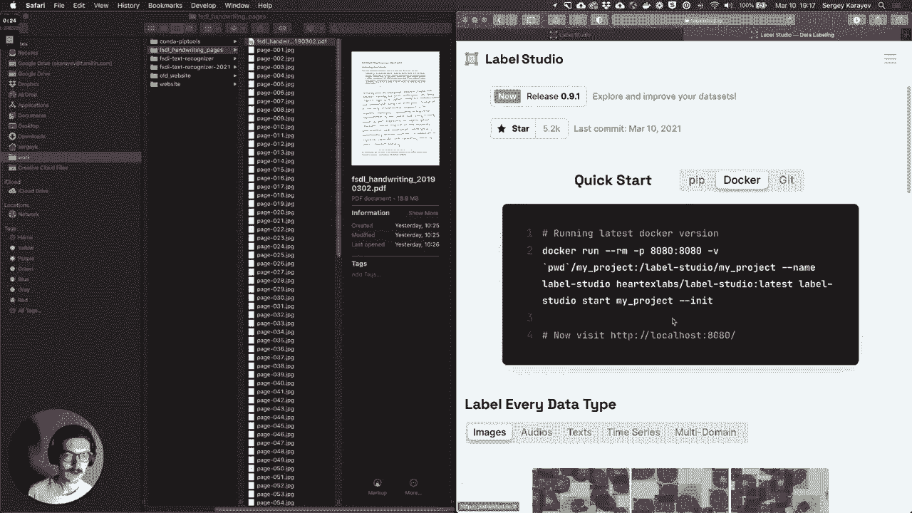
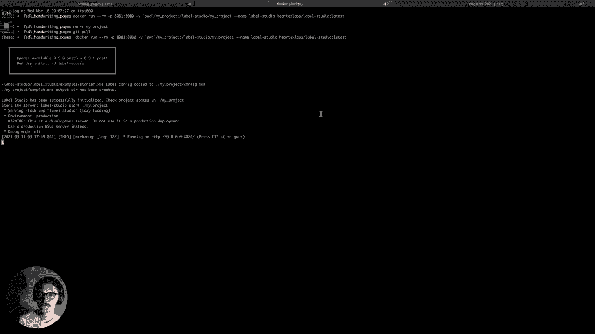
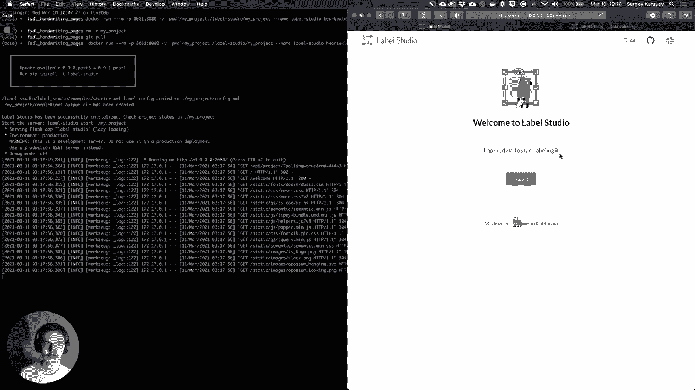
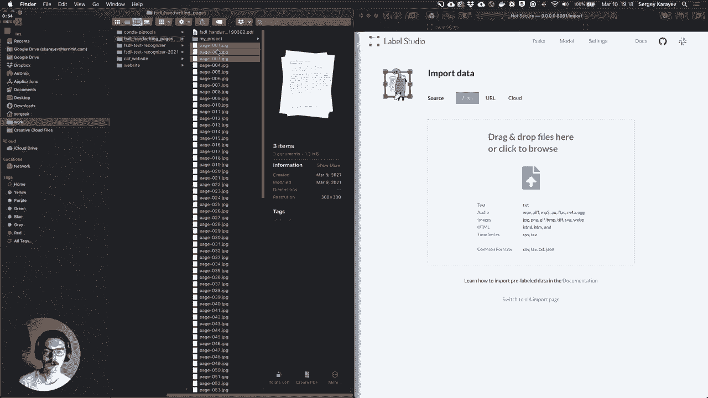
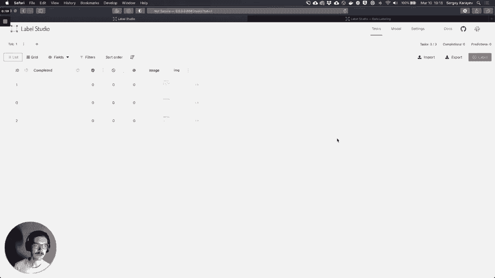
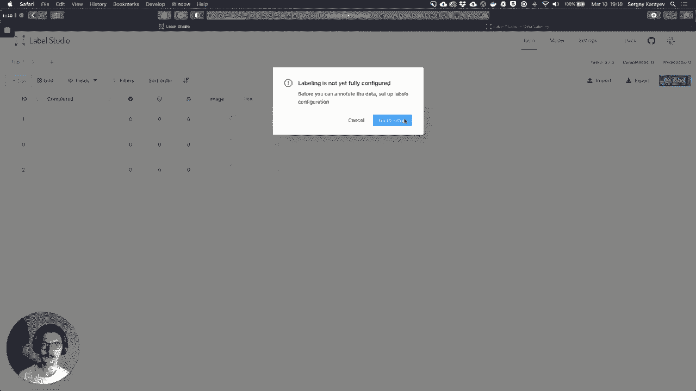
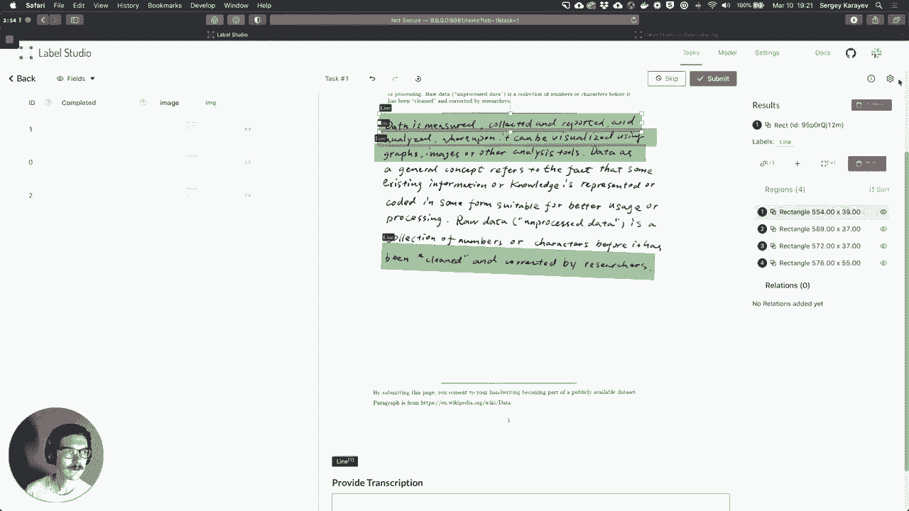
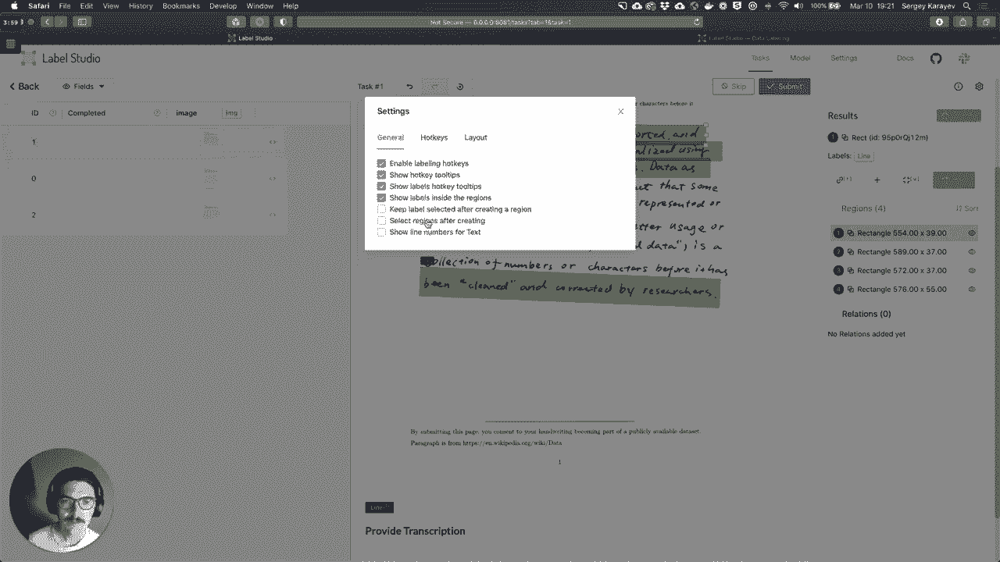
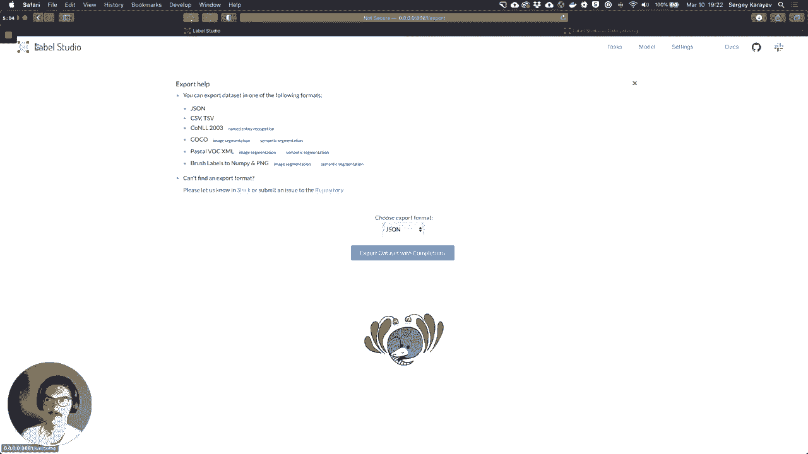

# 17：【Lab6】数据标记 📝

在本节课中，我们将学习如何使用开源数据标注工具 Label Studio，为手写图像数据添加行级文本标注。我们将从安装工具开始，逐步完成数据导入、标注配置、实际标注以及结果导出的完整流程。

---

## 🚀 安装与启动 Label Studio



Label Studio 是一个基于 Python 的开源数据标注工具。你可以使用 `pip` 命令安装它。



```bash
pip install label-studio
```



在本教程中，我们将使用 Docker 方式安装和启动 Label Studio。


启动后，在浏览器中访问相应地址即可进入 Label Studio 的欢迎界面。







---



## 📂 导入数据

进入 Label Studio 后，第一件事是导入需要标注的数据。

对于本实验，你需要从指定的 S3 存储桶下载一些手写图像。我已经提前下载好了这些图像，因此可以直接将它们拖入界面进行导入。


数据导入后，理论上可以开始标注，但在这之前，我们需要先配置标注任务。

---

## ⚙️ 配置标注任务

Label Studio 具有高度可配置性，其配置使用一种类似 HTML 或 React 的语言。我们可以基于现有模板进行修改。

首先，我们参考“目标检测”模板，它允许我们为不同类别的对象添加标注。


我们的任务中只有一个对象类别，即“一行文字”。对于每一行，我们需要为其添加文本转录。

因此，我们将模板中的媒体类型从“音频”修改为“图像”。这样，我们就可以在图像上绘制一个矩形框来框选一行文字，然后点击该框为其添加文本转录。

对这个界面配置感到满意后，保存配置即可。

---

## ✍️ 开始标注

配置完成后，我们就可以开始标注了。Label Studio 提供了键盘快捷键以提高效率。

例如，按下键盘上的 `1` 键，然后在图像上拖拽，即可绘制一个矩形框。你需要为图像中的每一行文字都绘制一个框。

在标注时，你可能会面临一些选择：

*   对于略微倾斜的文字行，你可以选择绘制一个普通的矩形框将其大致框住。
*   你也可以选择旋转矩形框，使其更贴合文字行的倾斜角度。
*   除了矩形，你还可以切换到多边形标注模式，或者尝试其他我们尚未想到的标注方式。

绘制矩形框后，点击它即可在侧边栏输入该行文字的转录内容。





---

## ❓ 处理模糊或难辨的文字


在标注过程中，你偶尔会遇到一些难以辨认的字符。这时你需要考虑如何处理：


*   是否应该根据最佳猜测进行转录？
*   是否应该使用一个特殊的标记（如 `[UNREADABLE]`）来表示无法识别？
*   如果发现明显的拼写错误，是否应该直接纠正？
*   如果完全无法阅读，是否应该去查找已知的源文本来确认，还是直接标注为不可读？

你需要根据实际情况和项目要求做出决定。

---

## 💾 提交与导出标注

完成一张图片上所有行的标注后，点击提交。

当你完成了所有分配图像的标注工作，就可以导出标注结果了。



Label Studio 支持导出多种格式（如 JSON、CSV 等），你可以选择适合后续模型训练的格式进行导出。

---

## 📚 课程总结


在本节课中，我们一起学习了使用 Label Studio 进行数据标注的完整流程。我们从工具的安装与启动开始，逐步完成了数据导入、标注任务配置、实际标注操作（包括处理模糊文字的策略），最后学习了如何提交和导出标注结果。掌握这些步骤，你就能为自己的机器学习项目创建高质量的标注数据集了。