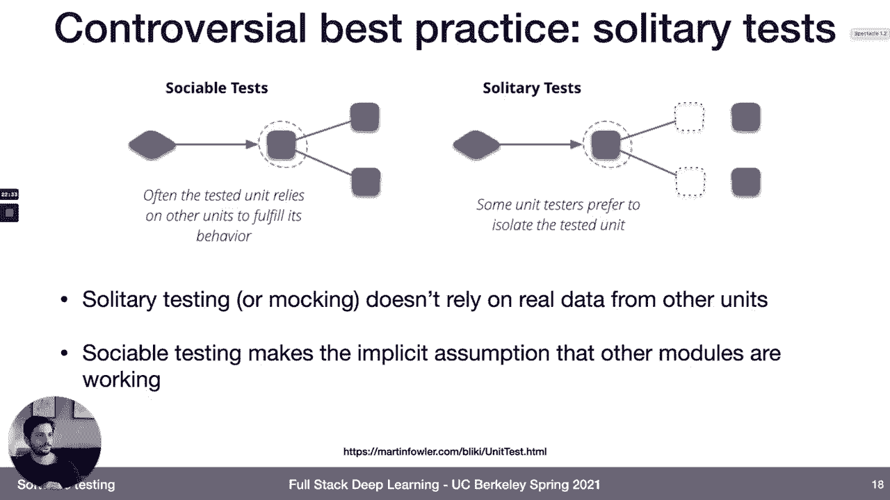
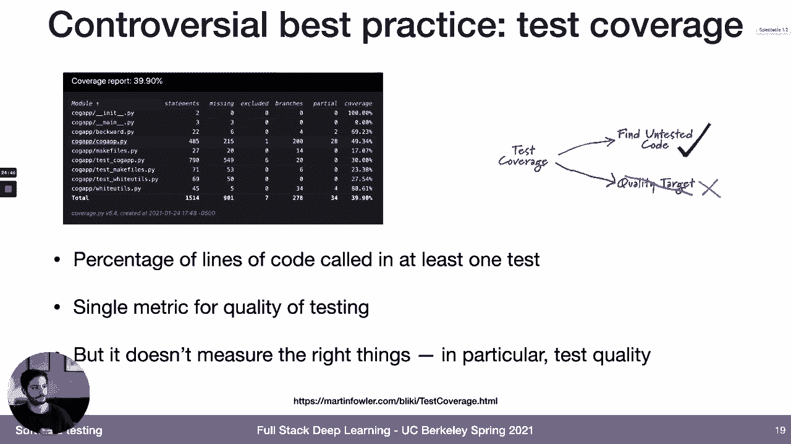
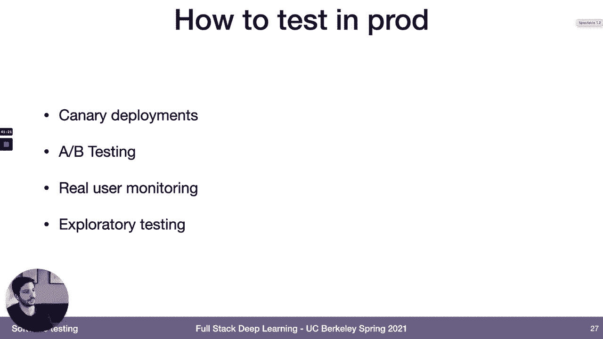
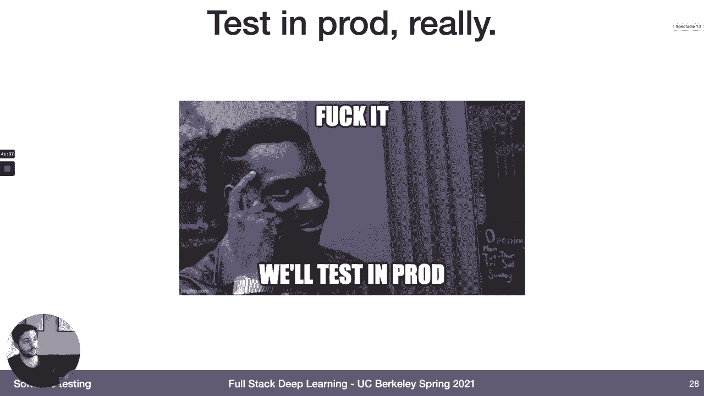
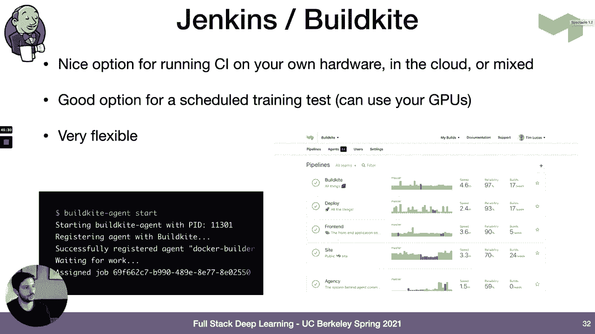
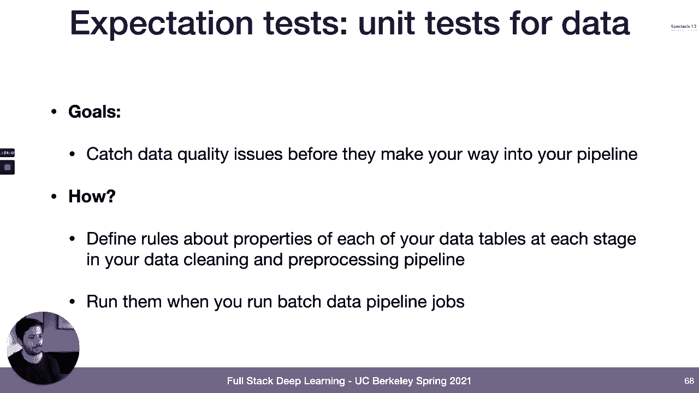
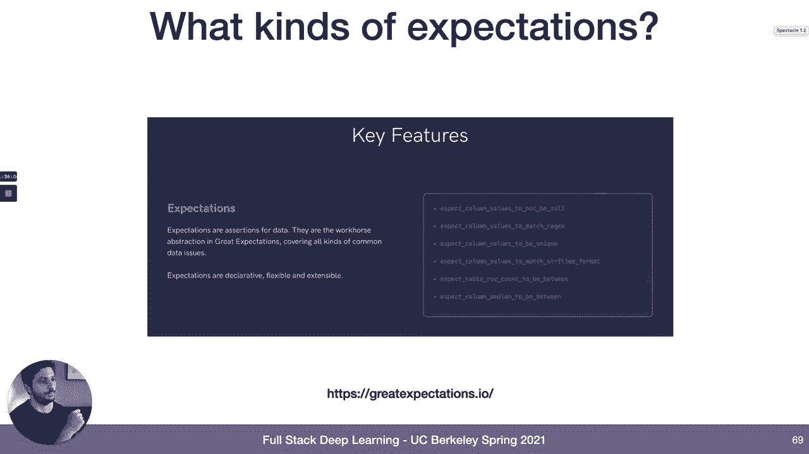
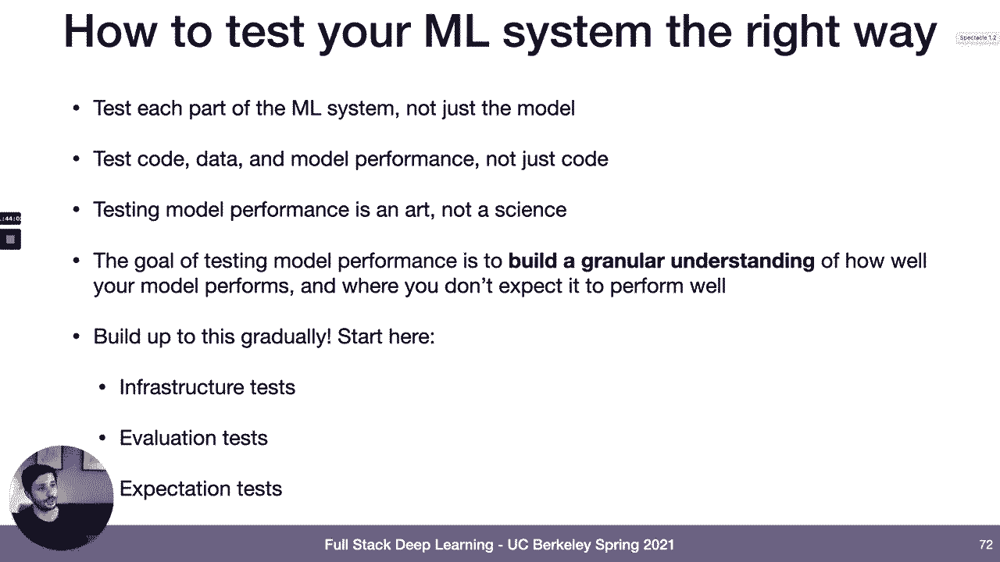

# 19：L10A 机器学习测试 🧪

在本节课中，我们将要学习如何测试机器学习系统。我们将从软件测试的基础概念讲起，然后深入探讨测试机器学习系统时面临的独特挑战和具体方法。最后，我们会介绍可解释性AI的概念及其与测试的关系。

---

## 软件测试概述

上一节我们介绍了课程目标，本节中我们来看看软件测试的基础知识。软件测试是确保代码质量和功能正确性的关键环节。

### 测试类型

以下是三种基本的软件测试类型：

*   **单元测试**：目标是测试单个代码单元的功能。这可以是对单行代码、单个函数或单个类的断言。核心在于隔离测试该单元。
*   **集成测试**：目标是测试多个单元组合在一起时的工作情况。仅测试单个单元时，组合后可能出现问题，集成测试就是为了发现这类问题。
*   **端到端测试**：目标是测试整个系统在组装完成后的工作情况。理想情况下，使用真实用户的输入进行测试，确保整个系统协同工作。

### 测试最佳实践

接下来，我们来看看一些编写和有效执行测试的最佳实践。

*   **自动化测试**：目标是让测试能够独立运行，无需人工介入。测试系统应能明确输出“通过”或“失败”的结果。
*   **保持测试的可靠性、速度和正确性**：随着项目规模增长，测试数量会增加。如果测试不可靠（如随机失败）、速度慢或测试代码本身有缺陷，就会成为开发的阻碍。
*   **强制执行测试通过**：在团队中建立规范，要求所有测试必须在代码合并到主分支前通过。这可以作为一项强制措施，确保代码质量。
*   **在适当的时候添加测试**：编写新功能时是添加测试的好时机。另一个好时机是修复线上Bug后，为这个Bug创建一个测试，防止未来被意外引入。
*   **遵循测试金字塔**：建议编写大量单元测试，适量集成测试，少量端到端测试。单元测试运行更快、更可靠，且能更好地定位故障原因。

### 有争议的最佳实践

除了普遍认可的最佳实践，还有一些方法存在争议，但仍有其价值。



*   **独立单元测试 vs. 协作单元测试**：
    *   **协作单元测试**：测试一个单元时，依赖其他单元的正确运行。
    *   **独立单元测试**：使用模拟数据，完全隔离地测试单个单元。很多人偏好这种方式，因为它能精确隔离问题，但有时难以实现。
*   **测试覆盖率**：衡量代码中被测试覆盖的行数百分比。它有助于发现未测试的代码，但**不能衡量测试的质量**。追求高覆盖率有时会导致编写无意义的测试。
*   **测试驱动开发**：在编写功能代码之前先编写测试。测试作为功能规范，然后编写最小化代码使测试通过，最后重构。这种方法并非人人遵循，但在复杂场景下是一个有用的工具。



### 线上测试

线上测试是一种不同于离线测试的理念，在机器学习系统中尤为重要。

传统的观点认为，测试的目的是防止有缺陷的软件上线。然而，对于复杂的分布式系统，尤其是机器学习系统，线上Bug难以完全避免。

线上测试的哲学是：既然Bug不可避免，不如设置系统，让用户帮助你发现它们。这需要足够的用户规模、先进的监控和可观测性系统。当新代码上线后，通过监控错误率等指标，一旦发现问题就快速回滚。

具体策略包括：
*   **金丝雀发布**：仅向一小部分用户（如1%）发布新版本，观察其行为。
*   **A/B测试**：在新旧版本间进行更严谨的统计测试。
*   **探索性分析**：不仅看聚合指标，也跟踪真实用户的使用路径，进行探索性分析。

结论是，随着系统复杂度增加，线上测试可能成为一种必然，是工具箱中的重要工具。






### 持续集成与持续部署

CI/CD 系统是自动化软件测试的一种实现方式。



CI/CD 系统与代码仓库集成，在特定事件（如推送代码、合并分支、提交拉取请求）时触发任务。这些任务负责构建代码、运行测试、生成报告，并决定代码是否能进入下一阶段（如合并到主分支）。

有多种SaaS提供商（如 GitHub Actions, CircleCI）提供此服务，它们易于设置但可能有资源限制（如缺少GPU）。也可以使用更灵活但设置更复杂的自托管方案（如 Jenkins, Buildkite）。通常，团队会从SaaS方案开始，当遇到限制时再考虑自建。

---

## 测试机器学习系统

上一节我们介绍了通用软件测试，本节中我们来看看如何将这些概念应用到机器学习系统中。

### 机器学习系统的独特性

机器学习系统也是软件，许多软件测试的经验可以借鉴。但它们也有独特之处，增加了测试的复杂性：

1.  **代码与数据的结合**：ML系统是代码和数据的结合体，需要测试数据。
2.  **人类直觉有限**：软件由人类编写以解决问题，开发者对其行为有直觉。ML系统由优化器根据代理指标“编译”而成，开发者对其内部行为可能缺乏直觉。
3.  **静默失败**：软件失败通常会产生错误或日志。ML系统可能只是性能下降，而不触发任何明显错误。
4.  **动态性**：软件在理论上可以是静态的。ML系统面对的数据分布几乎总是在变化，模型需要持续适应。

### 常见错误

基于这些差异，测试ML系统时常犯以下错误：
*   只测试模型，而非整个ML系统。
*   不测试数据。
*   不在部署前建立对模型性能的细粒度理解。
*   不闭环验证模型指标与业务指标的关系。
*   过度依赖自动化测试，忽视了探索性分析和线上测试的重要性。
*   低估线上测试对ML系统的重要性。

### 测试整个机器学习系统

一个生产级机器学习系统远不止一个模型，它包含多个组件。我们需要测试整个系统。

```
[训练系统] -> [模型] -> [预测系统] -> [服务系统]
      ^                                         |
      |                                         v
[标签系统] <- [存储与预处理系统] <- [监控与反馈]
```

以下是针对不同组件和集成的测试方法：

**1. 训练系统单元测试**
*   **目标**：避免训练管道中的代码错误。
*   **方法**：
    *   对训练代码进行常规单元测试。
    *   **单批次/单周期测试**：确保所有重要模型都能在小数据集上运行至少一个梯度步骤或一个训练周期。这能快速捕捉代码错误，适合在开发中频繁运行。

**2. 数据与训练系统集成测试**
*   **目标**：确保训练作业的可复现性，防止未来无法复现过去的成功。
*   **方法**：
    *   使用固定的数据集重新训练模型，检查性能是否与参考结果一致。
    *   也可以使用滑动时间窗口的数据进行测试，这更像端到端测试。
*   **运行策略**：这类测试较慢，建议定期（如每晚）运行，而非每次提交都运行。

**3. 预测系统单元测试**
*   **目标**：避免预测代码的回归错误。
*   **方法**：
    *   对预测代码进行常规单元测试。
    *   **功能测试**：对固定模型，在几个关键输入样例上运行预测代码，验证输出是否符合预期。可以快速运行。

**4. 训练与预测系统集成测试**
*   **目标**：评估新训练的模型在预测系统中的表现是否足够好，可以部署。
*   **方法**：**模型评估测试**。这是ML测试的核心，不仅仅是验证集分数。

### 模型评估测试详解

模型评估测试需要超越单一指标，从多维度理解模型。

**评估的指标类型**：
*   **模型指标**：如准确率、精确率、召回率、F1分数等。
*   **行为测试**：测试模型是否表现出预期的行为。
    *   **不变性测试**：输入的非关键变化不应影响输出。（例如，推文中地点的改变不应改变情感分类）。
    *   **方向性测试**：输入的特定变化应以预期方式影响输出。（例如，将负面词改为正面词，情感应从负转正）。
    *   **最小功能测试**：测试模型是否遵循某些基本规则。（例如，双重否定句的情感判断）。
*   **鲁棒性测试**：理解模型的性能边界。
    *   **特征重要性**：了解模型依赖哪些特征。如果特征值异常，模型可能失效。
    *   **对数据陈旧度的敏感性**：测试模型性能随时间衰减的速度，为生产环境中的模型更新周期提供参考。
    *   **对数据漂移的敏感性**：衡量模型对分布变化的脆弱性（目前较难实现）。
    *   **模型指标与业务指标的关系**：建立模型性能变化与核心业务指标（如收入、用户参与度）变化之间的映射。
*   **隐私与公平性测试**：确保模型没有对不同用户群体产生偏见。可以使用谷歌的 Fairness Indicators 等工具。
*   **模拟测试**：对于影响环境的系统（如自动驾驶、推荐系统），在模拟环境中测试模型行为。这非常强大但也非常复杂。

**数据分片**：
不要只看整体指标，还要将数据按不同维度切片，评估各切片上的性能。一个数据切片可以是任何将数据点映射到类别的方式，例如：
*   按分类特征值（如国家=美国）。
*   按连续特征的区间（如年龄18-30岁）。
*   甚至可以用另一个模型来定义切片。

工具如 Google 的 What-If Tool 或 Slice Finder 可以帮助发现性能异常的数据切片。

**使用多个数据集**：
除了主测试集（应尽可能接近生产数据分布），还可以添加专门的数据集用于评估：
*   针对特定边缘案例收集的数据集。
*   来自不同数据模态或分布的数据集（如不同地区、语言）。
*   合成数据或外部收购的数据。

**评估报告与决策**：
评估会产生包含大量指标和切片数据的报告。决策时通常进行两种比较：
1.  **与旧模型比较**：新模型是否在所有关键指标和切片上优于或至少不差于即将被替换的旧模型？
2.  **与固定基线模型比较**：防止模型性能通过多次微小退化而逐渐变差。

需要为关键指标和切片设置性能阈值（如准确率下降不超过2%）。有时还需要设置切片间的性能差异阈值，以确保公平性。

**5. 预测与服务系统集成测试**
*   **目标**：在影响用户前捕获生产环境中的Bug。
*   **方法**：**影子测试**。将新模型与当前生产模型并行部署，接收相同的真实流量，但只将当前模型的预测返回给用户，同时收集新模型的预测结果进行分析。可以检查：
    *   生产部署中的Bug。
    *   离线模型与在线模型的不一致性（常见于特征工程代码不一致）。
    *   离线数据未出现的问题。

**6. 服务系统测试**
*   **目标**：测试用户和系统对新模型预测的实际反应。
*   **方法**：**A/B测试**。
    *   **金丝雀发布**：将一小部分流量（如1%）导向新模型，并实际返回预测，密切监控该用户群组的业务指标。
    *   **正式A/B测试**：进行统计上严谨的对比实验。
    *   **持续监控**：模型上线后，持续监控其输入数据和输出性能的变化。

**7. 标签系统单元测试**
*   **目标**：确保标签质量，避免垃圾数据导致垃圾模型。
*   **方法**：
    *   对标注员进行培训和认证。
    *   **标签聚合**：让多个标注员标注同一数据，通过一致性来评估标签质量和标注员可信度。
    *   **人工抽查**：定期手动检查一批标签。可以通过模型预测与标注结果的差异来定位需要重点检查的样本。

**8. 数据存储与预处理系统测试**
*   **目标**：在数据进入训练管道前捕获数据质量问题。
*   **方法**：**期望测试**。可以理解为“数据的单元测试”。
*   **实施**：在数据清洗和预处理管道的每个阶段，对输出数据表定义规则和阈值。例如：
    *   某列不能有空值。
    *   某列的值必须唯一（如ID）。
    *   数据表行数不能太少。
    *   某数值列的均值应在特定范围内。
*   **工具**：Great Expectations 是一个流行的开源库，用于定义和执行此类数据期望。
*   **阈值设定**：可以手动基于领域知识设定，也可以基于一个“好”的数据集生成统计档案作为基线，然后手动调整。

### 实施挑战与建议

将上述测试投入生产环境会面临一些挑战：
*   **组织上**：数据科学团队可能不像软件工程团队那样习惯测试文化。
*   **基础设施**：许多CI/CD SaaS平台对ML任务（需要GPU、大数据IO）支持不佳。
*   **工具**：用于细粒度模型性能分析和比较的工具仍在发展中。
*   **决策**：如何根据复杂的多维度评估报告决定模型是否“足够好”上线，是一个持续的挑战。



**实践建议**：
1.  **测试整个系统，而不仅仅是模型**。
2.  **既测试代码，也测试数据和模型性能**。
3.  **将模型评估视为一门艺术与科学**，目标是建立对模型性能边界的深入理解。
4.  **循序渐进**，不要试图一开始就实现所有测试。建议的起点是：
    *   **训练代码的单批次测试**：简单易行，能捕捉大量Bug。
    *   **模型评估测试**：尽早开始思考关键指标和分片，避免被单一聚合分数误导。
    *   **数据期望测试**：使用现有库（如Great Expectations），能有效防止数据质量问题。



---

## 可解释AI与测试的关系

由于时间关系，本节对可解释AI的详细讨论将被省略。但其核心思想是提供技术来理解模型为何做出特定预测。这与测试紧密相关，因为可解释性工具可以帮助我们：
*   诊断模型在特定输入上失败的原因。
*   识别模型可能依赖的虚假相关性。
*   验证模型的行为是否符合人类的领域知识和直觉。
*   从而帮助我们设计更好的测试用例，并建立对模型性能边界的信任。

---

## 总结




本节课中我们一起学习了机器学习测试的完整框架。我们从通用的软件测试原则出发，探讨了单元测试、集成测试、端到端测试以及线上测试等概念。随后，我们深入分析了机器学习系统的特殊性，并系统地介绍了如何测试ML系统中的各个组件：训练系统、数据系统、预测系统、服务系统、标签系统等。我们重点强调了模型评估测试需要超越单一指标，通过多指标、数据分片和多数据集来建立对模型性能边界的细粒度理解。最后，我们指出了实施这些测试的挑战，并给出了循序渐进的实践建议。掌握这些测试方法，对于构建可靠、可信赖的生产级机器学习系统至关重要。