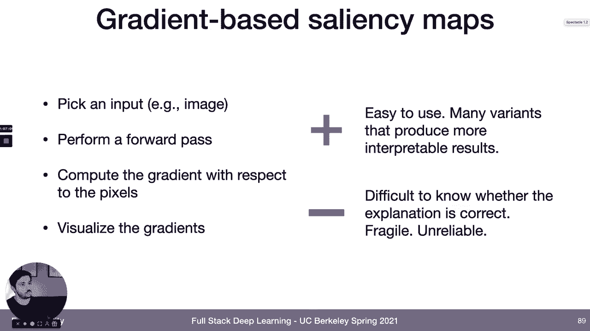
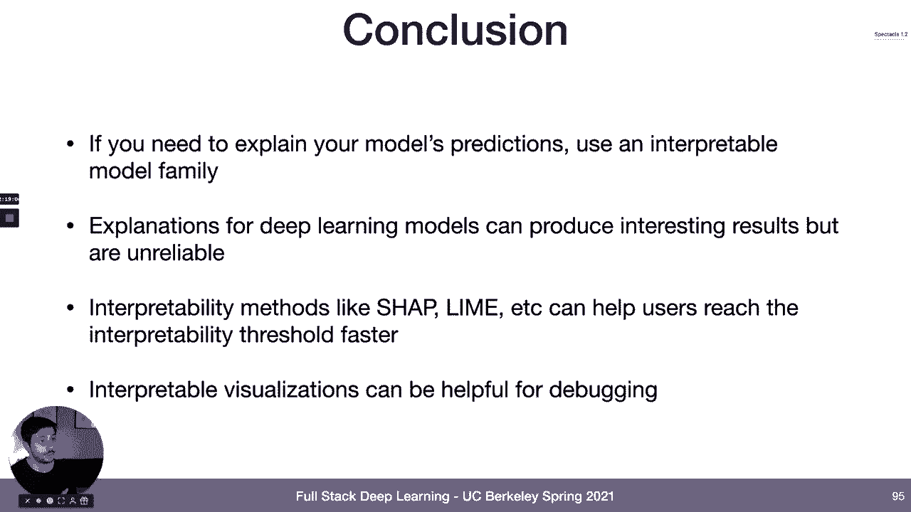

# 20：L10B 机器学习可解释性 🧠

在本节课中，我们将要学习机器学习可解释性的核心概念、定义以及几种主流技术方法。我们会探讨可解释性与可理解性的区别，并分析不同技术在实际应用中的优缺点。

---

## 概述

机器学习可解释性是一个热门话题。本节课将首先明确可解释性的相关定义，然后介绍几种主要的技术类别，包括使用可解释模型族、模型蒸馏、特征贡献分析等。我们也会讨论这些技术在实际应用中的局限性。

---

## 核心定义

在深入技术细节之前，我们需要明确几个核心概念的定义。这些定义并非行业标准，但有助于我们更清晰地讨论问题。

**领域可预测性** 指的是我们对于新数据点是否超出模型能力范围的可知程度。即，我们能否预知模型在哪些数据上表现良好，在哪些数据上可能表现不佳。

**可理解性** 指的是我们作为人类能够预测模型在给定数据上会产生何种结果的程度。这关乎我们是否在头脑中有一个关于模型行为的准确“心智模型”。

**可解释性** 指的是人类不仅能预测模型在数据上的行为，还能理解模型做出特定决策的**原因**。

---

## 主要技术类别概览

接下来，我们将快速概览几种主要的可解释性技术类别，并讨论它们分别对应上述哪种定义。

以下是几种主要的技术路径：

1.  **使用可解释的模型族**
2.  **将复杂模型蒸馏为简单模型**
3.  **理解单个特征对预测的贡献**
4.  **理解单个数据点对预测的贡献**

---

## 1. 使用可解释的模型族

上一节我们介绍了核心定义，本节中我们来看看第一种技术路径：直接使用本身具有可解释性的模型。

一些可解释的模型族包括线性回归、逻辑回归、广义线性模型和决策树。这些模型之所以可解释，是因为如果你理解其数学原理，就很容易理解它们为何做出某个特定决策。

例如，对于线性回归或逻辑回归模型，其决策过程是权重矩阵与特征向量的乘法运算。因此，你可以通过公式 `y = w1*x1 + w2*x2 + ... + b` 来理解不同特征值及其权重对输出的贡献，这本身就是模型的决策解释。

这类模型的主要优点是它们既具有可理解性，在某种意义上也具有真正的可解释性。但需要注意的是，这种解释只对“合适的用户”有效。如果你向非技术用户展示回归系数，这可能并不能构成有效的解释。

这类模型的一个主要缺点是性能往往不够强大。你会注意到，深度学习模型并不在此列。

有人可能会问：注意力机制呢？注意力图可视化后难道不是可解释的吗？这确实是一个有用的工具，可以帮助我们建立关于模型行为的直觉。但其主要缺陷在于，很多人误将其用作获取可解释性的方式。

**注意力图不能提供可靠解释的原因有两点：**
*   **解释不完整**：例如，在一张“站在硬木地板上的狗”的图片中，注意力图可能主要指向狗，解释了“狗”的预测，但无法解释“站立”和“硬木地板”的预测来源。
*   **解释不可靠**：研究表明，注意力图显示的是模型“在看哪里”，但这并不等同于“它为何做出这个决策”。模型可能对不同的预测问题（例如“这是哈士奇” vs “这是长笛”）产生几乎相同的注意力图。

因此，**注意力图不是解释**。

---

## 2. 将复杂模型蒸馏为简单模型

我们讨论了直接使用简单模型，接下来看看另一种思路：先训练一个能解决任务的复杂模型，然后将其“蒸馏”或简化为一个可解释的模型，并用后者来生成解释。

这类技术的核心是**代理模型**。其思想是：在训练好用于预测的复杂模型后，使用该模型的训练数据，再训练一个更简单的模型（如线性模型或决策树）。关键区别在于，这个简单模型不是去预测真实标签，而是去预测**原始复杂模型的预测结果**。当需要解释时，我们就用这个代理模型的解释来近似理解原始模型。

这种技术的优点是易于使用且通用，几乎适用于任何模型。但存在一个根本性问题：如果代理模型非常准确，那你为什么不直接用它作为主模型？如果它不准确，你又如何能信任它的解释？此外，如果我们的目标是真正的可解释性（理解原因），我们如何知道简单模型的决策方式与复杂模型相同？

另一类代理模型技术是**局部代理模型**，其中最常用的方法是 **LIME**。它的思路不是全局解释模型，而是针对单个数据点，在其周围采样生成扰动数据点，然后用原始模型对这些扰动点进行预测，最后用一个简单的局部模型（如线性模型）来拟合这些扰动点与预测结果之间的映射关系。

从概念上讲，LIME 比全局代理模型更合理，因为我们有理由相信，在某个数据点的局部邻域内，简单模型可以较好地近似复杂模型的行为。LIME 在实践中应用广泛，并且可以扩展到文本和图像数据。

LIME 的挑战在于如何正确定义“扰动”和“邻域”。实践中，研究表明 LIME 产生的解释可能不稳定，对输入条件的微小改变可能导致解释的巨大变化，因此也容易被操纵。

---

## 3. 理解特征对预测的贡献

我们介绍了可解释模型族和模型蒸馏，下一类技术则专注于理解输入特征对模型预测的贡献。这个类别包含很多方法。

一种方式是通过**数据可视化**。

以下是两种常见的可视化图表：
*   **部分依赖图**：展示某个特定特征的值与模型预测输出之间的关联，可以看出改变该特征如何影响预测函数。
*   **个体条件期望图**：与PDP类似，但它为每个数据点单独绘制一条线，可以展示特征与预测关系的变化分布。

在更数值化地评估特征重要性方面，一个常见的方法是**排列特征重要性**。其原理很简单：选择要评估的特征，在数据集中随机打乱该特征值的顺序，然后评估模型在特征被打乱的数据集上的性能下降程度。性能下降越多，说明该特征越重要。

这是一种易于使用且在实践中相对广泛的方法。但其挑战在于，对于高维数据（如图像）效果不佳，并且无法捕捉特征之间的相互依赖关系。

一个更理论化的方法是 **SHAP**。其核心思想是衡量在控制所有其他特征值的情况下，某个特征的存在与否（或值的变化）对模型预测的影响有多大。SHAP 的优点是适用于多种数据类型，数学原理较为严谨，得到的特征重要性具有可加性等良好性质。缺点是实现起来比较复杂，并且它更像是一种可理解性工具而非完全的可解释性工具。

**显著性图**是另一种评估特征重要性的常见方法，其中最常用的是基于梯度的显著性图。其基本原理是：对于给定的输入（如图像），计算模型输出相对于每个输入像素的梯度，并将该梯度可视化。这衡量了每个像素值的单位变化对模型预测的影响程度。

这种方法易于使用，存在许多变体以产生更可解释或更理论化的结果，在研究界应用广泛。但其挑战与使用注意力机制类似：我们如何知道这是否是正确的解释？这种解释与模型实际做出预测的方式之间有何对应关系？

---

## 4. 理解数据点对预测的贡献

除了特征，另一类技术试图理解单个数据点对模型或特定预测的贡献。即，哪些数据点对模型至关重要？

以下是两类技术（在本课程中不深入展开）：
*   **原型与批评**：原型是能解释数据集中大量变体的聚类中心；批评则是那些无法被原型很好解释的数据点。
*   **影响实例**：寻找那些如果从数据集中移除，会导致最终生成的分类器发生重大变化的数据点。

---

## 反思：可解释性是正确的目标吗？

在快速浏览了主要技术后，我们需要退一步思考一个高层次问题：可解释性真的是我们正确的目标吗？

人们追求模型可解释性通常有几个原因：
1.  **监管要求**：某些行业规定模型必须可解释。对此，务实的回应可能是进行一些可解释性分析以确保合规。
2.  **用户需求**：用户希望信任模型的预测，因此需要解释。这里需要考虑产品设计的作用，良好的产品设计（如允许用户覆盖预测）可以减少对解释的绝对需求。此外，用户与模型的交互频率也很关键。对于低频、高影响的决策（如贷款审批），可靠的解释可能非常重要；对于高频交互场景（如推荐系统），帮助用户建立对模型行为的直觉（即可理解性）可能更为重要。
3.  **模型可信度**：开发者不确定是否应该信任模型并将其部署到生产环境。**我认为，在这种情况下，我们真正需要的目标不是可解释性，而是之前定义的“领域可预测性”**。我们想知道模型性能的边界在哪里，希望尽可能减少“未知的未知”。一些可解释性文献中的可视化工具可能有助于建立领域可预测性或进行调试。

关于当前（2021年中）深度学习模型的可解释性，我得出的结论是：**真正的可解释性目前对于深度学习系统来说还不是一个现实的目标**。现有方法在忠实反映原始模型行为方面并不可靠，它们往往比较脆弱，且通常无法完整解释模型的决策。

因此，**如果你确实需要解释模型的预测**，目前唯一可靠的答案是**使用本身就可解释的模型族**，如线性模型、决策树等。你可以尝试解释深度学习模型，甚至训练一个模型来为深度学习模型的预测输出解释语句，这是一个有趣的研究方向，但就生产环境所需的可靠可解释性而言，目前尚不成熟。

对于**可理解性**方法，如 SHAP 和 LIME，在实践中应用最多。我认为它们非常有用的一个场景是：**帮助用户更快地建立对模型的直觉，从而信任模型的预测**。这些可视化可以帮助用户理解模型在哪些方面表现好或不好。

最后，尽管我对该领域在深度学习中的应用价值持一定怀疑态度，但这并不意味着这些可视化毫无用处。事实上，许多可视化工具在**调试模型和确定改进模型性能的优先级**方面非常有用。我只是不确定它们是否已经准备好为模型的决策提供**准确、完整的解释**。

---

## 总结

本节课中我们一起学习了机器学习可解释性的核心概念。我们首先区分了领域可预测性、可理解性和可解释性的定义。然后，我们快速概览了四种主要的技术路径：使用可解释模型族、模型蒸馏、分析特征贡献以及分析数据点贡献。最后，我们深入反思了追求可解释性这一目标本身的合理性，并指出在当前阶段，对于深度学习模型，实现真正的、可靠的可解释性仍面临挑战，而可理解性工具和领域可预测性可能是更实际和重要的目标。