# 21：【Lab8】测试与持续集成 🧪

在本节课中，我们将学习如何为机器学习项目添加代码规范检查、系统功能测试、模型评估测试以及训练系统测试。我们还将设置持续集成流程，确保每次向代码仓库推送代码时，这些测试都能自动运行。我们将使用 CircleCI 作为持续集成工具。

## 📝 代码规范检查

上一节我们介绍了课程目标，本节中我们来看看代码规范检查。代码规范检查指使用静态分析工具检查代码文件的风格、文档和一些基本错误。这在多人协作的代码库中非常必要，可以统一代码风格，并提前发现一些运行时才会暴露的错误。

我们有一个用于设置所有检查的脚本文件 `tasks/lint`。它是一个 Bash 脚本，会依次运行 `safety`、`pylint`、`pycodestyle`、`pydocstyle`、`mypy`、`bandit` 和 `shellcheck`。如果其中任何一个检查失败（除了 `safety`），整个规范检查就会失败。如果全部通过，则显示“linting passed”。

以下是各个工具的作用：

*   **safety**：扫描 Python 包依赖项中的安全漏洞。
*   **pylint**：进行静态分析，检查代码错误和风格问题。
*   **pycodestyle**：专门检查代码风格，与 `pylint` 部分重叠但包含一些额外规则。
*   **pydocstyle**：检查函数、类和模块的文档字符串。
*   **mypy**：利用静态类型提示进行类型检查。
*   **bandit**：查找 Python 代码中常见的安全漏洞，例如使用 `eval` 函数。
*   **shellcheck**：对 Bash 脚本进行规范检查。

这些检查工具的配置位于几个文件中，最主要的是 `.pylintrc` 和 `setup.cfg`。它们定义了诸如最大行长度、要禁用的警告消息等规则。

此外，我们还可以使用一个名为 **black** 的自动化代码格式化工具。它可以应用于 Python 文件，你也可以将其设置为在保存代码时自动运行。它会执行一系列更改，使不同开发者的代码风格高度统一，例如将单引号替换为双引号、强制行长度限制、对过长的函数调用进行缩进等。它与 `pylint` 兼容，值得使用。

## 🧪 系统功能测试

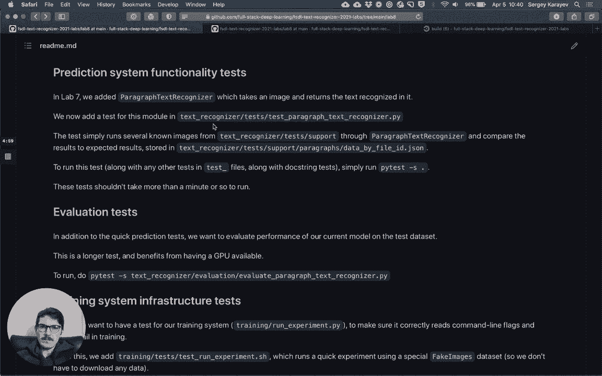

了解了代码规范检查后，本节我们来看看系统功能测试。我们正在开发一个应用程序，它可以拍摄手写文本的图片并返回其中的文字。我们的代码库包含多个模块：模型训练模块、预测模型模块和 Web 后端模块。

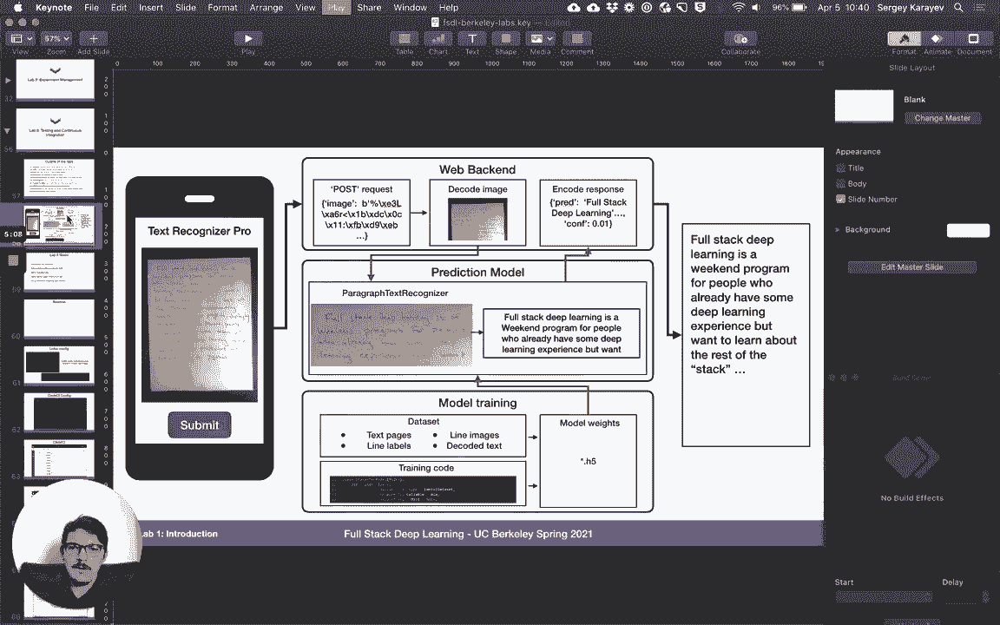

在之前的 Lab 7 中，我们添加了 `ParagraphTextRecognizer` 模块，它接收一张图片并返回其中的文字。在本实验中，我们将为该模块添加一个测试。

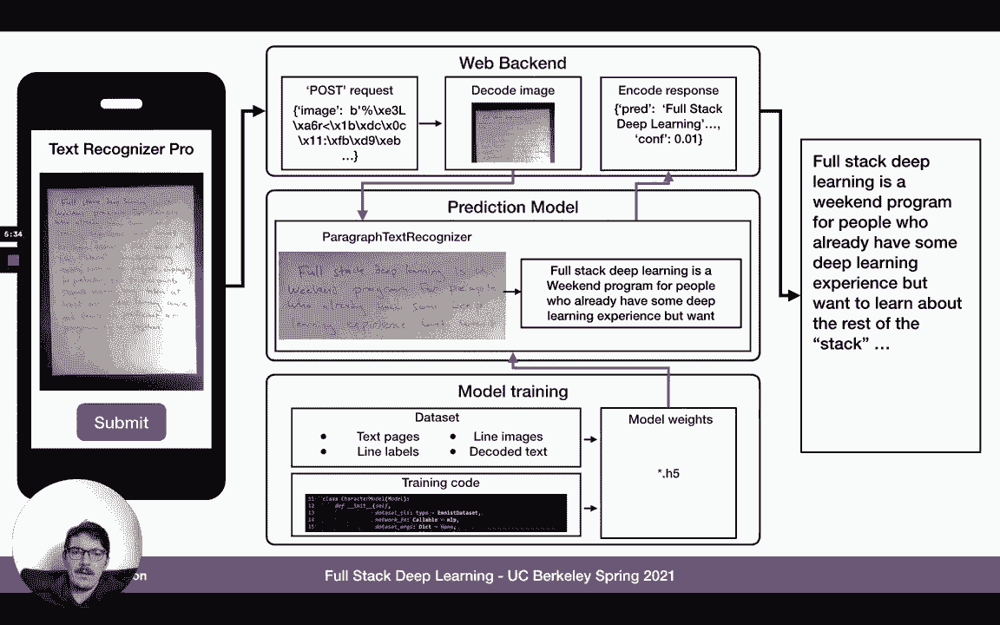

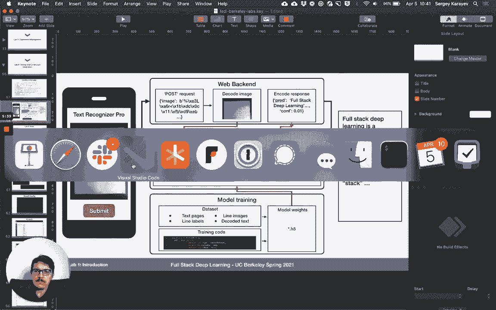

测试位于 `text_recognizer/test/test_paragraph_text_recognizer.py` 中。首先，我们禁用 CUDA，以便在测试时不使用 GPU。测试中使用了一些位于 `tests/support/` 目录下的支持文件，这些图片模拟了生产环境中可能遇到的用例，实际上来自 IAM 数据集。同时，还有一个 JSON 文件为每张图片指定了真实文本和预期的错误率。

该测试的基本流程是：将这些支持文件通过段落识别器运行，然后检查预测文本是否与预期匹配，字符错误率是否符合预期，并报告运行时间。这些测试的目标是运行时间不应超过一分钟，以便我们可以频繁地运行它们。

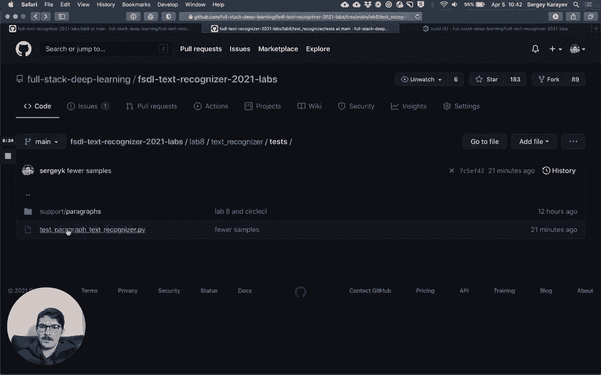

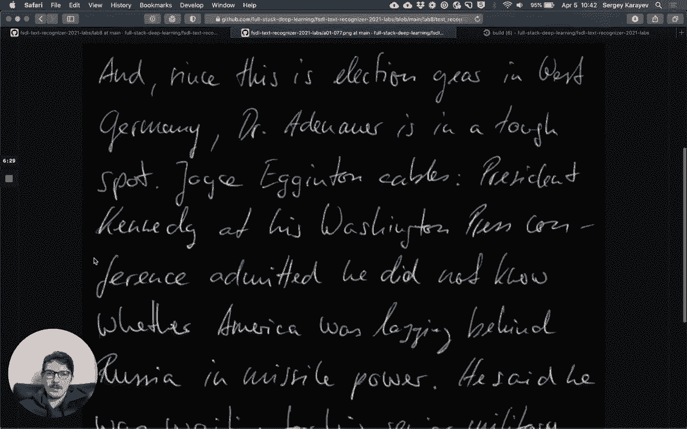

## 📊 模型评估测试

完成了系统功能测试，接下来我们关注模型评估测试。该测试位于 `text_recognizer/evaluation/evaluate_paragraph_text_recognizer.py`。这个测试运行时间较长，因此我们希望使用 GPU。

该测试会评估我们的 `ParagraphTextRecognizer` 模型（它会加载训练好的权重和配置）在 IAM 段落测试数据集上的性能。最终，它会报告字符错误率和所用时间，并断言字符错误率低于预期值，且所用时间也少于预期。目前，我们的模型预期字符错误率约为 17%。

测试过程很简单：加载数据集，加载 `ParagraphTextRecognizer`（这是一个 PyTorch Lightning 模型），然后使用 PyTorch Lightning 的 `Trainer` 进行评估。

## ⚙️ 训练系统测试

在模型评估之后，我们还需要确保训练流程本身是可靠的。我们称之为基础设施测试，位于 `training/tests/test_run_experiment.py`。

这个测试实际上会运行一个 Python 命令行，在一个名为 `FakeImageDataModule` 的新数据集上进行训练。这个数据集提供合成图像，这样我们就不需要下载真实数据并花费大量时间。我们训练一个 `ConvNet`，并传入一些参数以测试对参数的理解。我们只训练几个周期，目的是验证训练过程能够成功完成。

这个测试并不检查模型的正确性，只是检查我们是否能够进行训练。因为有时引入的某些错误可能会导致训练系统无法运行。我们可以通过改进这个测试，确保它能在该数据上训练出一个高精度的模型，但这可以作为课后练习。

## 🔄 设置持续集成

最后，我们将设置持续集成，确保每次将代码推送到 GitHub 仓库时都能自动运行上述测试。我们将使用 CircleCI 来实现。

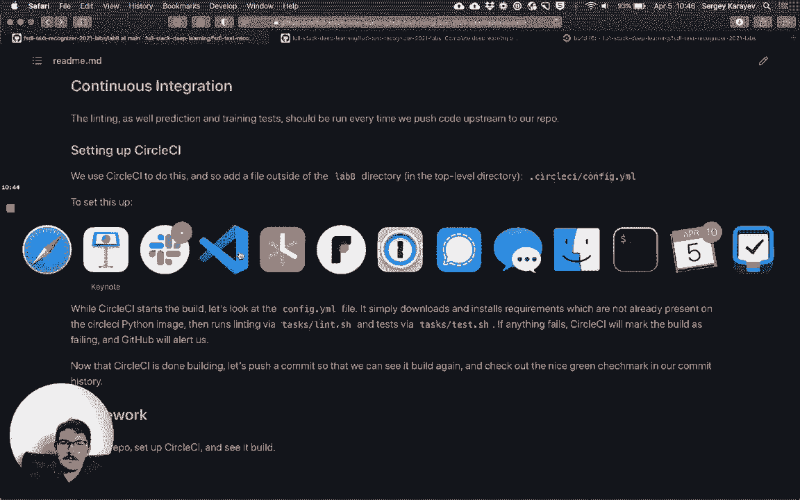

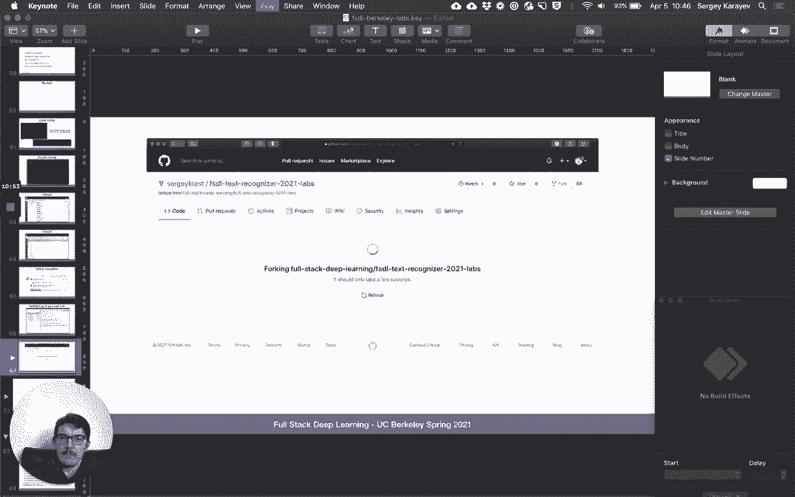

首先，我们需要 Fork 本实验的代码仓库到自己的 GitHub 账户。然后，登录 CircleCI 并使用 GitHub 授权。接着，在 CircleCI 中选择我们 Fork 的仓库。CircleCI 会自动检测仓库中的配置文件（`.circleci/config.yml`），然后我们可以点击“Start Building”开始构建。

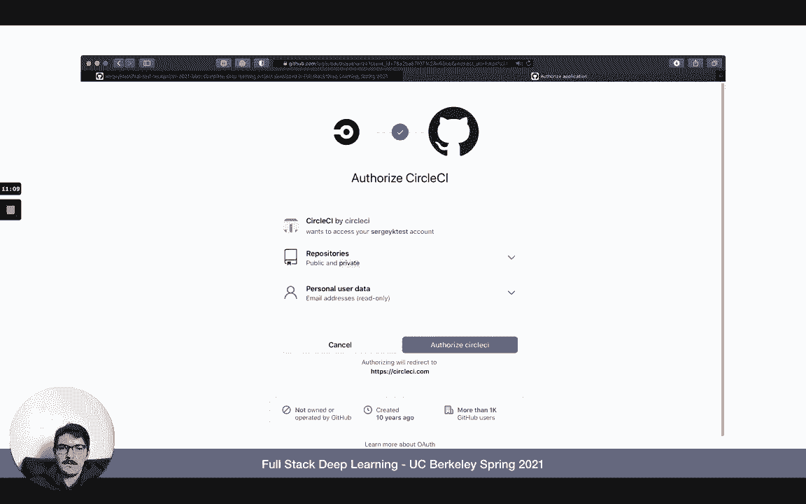

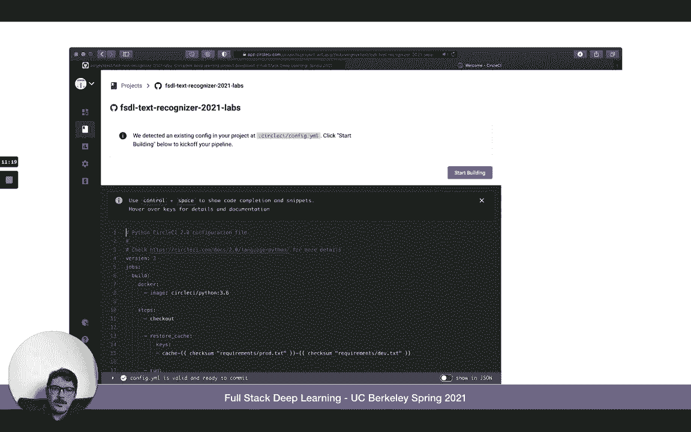

构建成功后，所有测试项都会显示为绿色的对勾。如果出现问题，则会显示红色的叉号。这能让我们及时知道持续集成失败了。如果我们创建拉取请求，GitHub 也会集成显示 CircleCI 的状态。

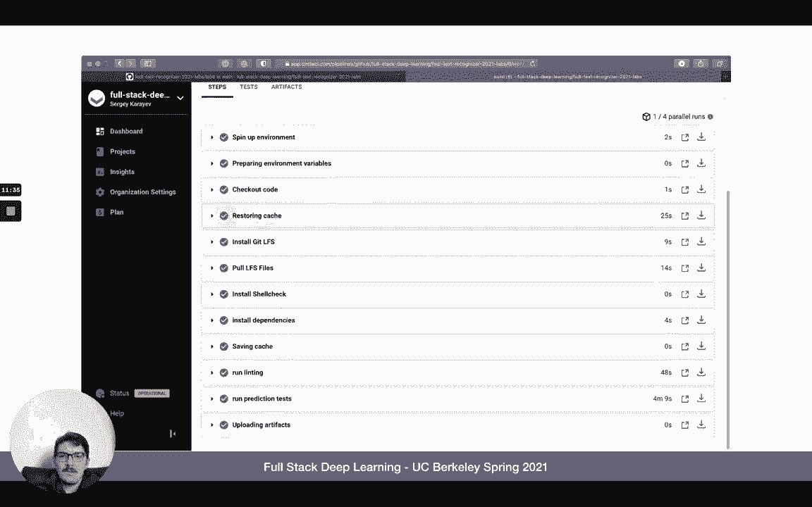

让我们看一下 `.circleci/config.yml` 文件的内容。它使用一个 Python 3.6 的 Docker 镜像，安装了 `git-lfs`（用于获取大文件）、`shellcheck`（用于规范检查）以及我们指定的依赖包版本。然后，它首先运行代码规范检查，接着运行测试。即使其中一项失败，另一项仍会运行，这样如果规范检查失败，我们仍然可以看到测试是否通过。

配置非常简单，这就是设置持续集成所需的基本步骤。我们没有在 CircleCI 中运行评估测试，因为 CircleCI 不提供 GPU，而没有 GPU 运行该测试会耗时过长。

## 📚 课程总结

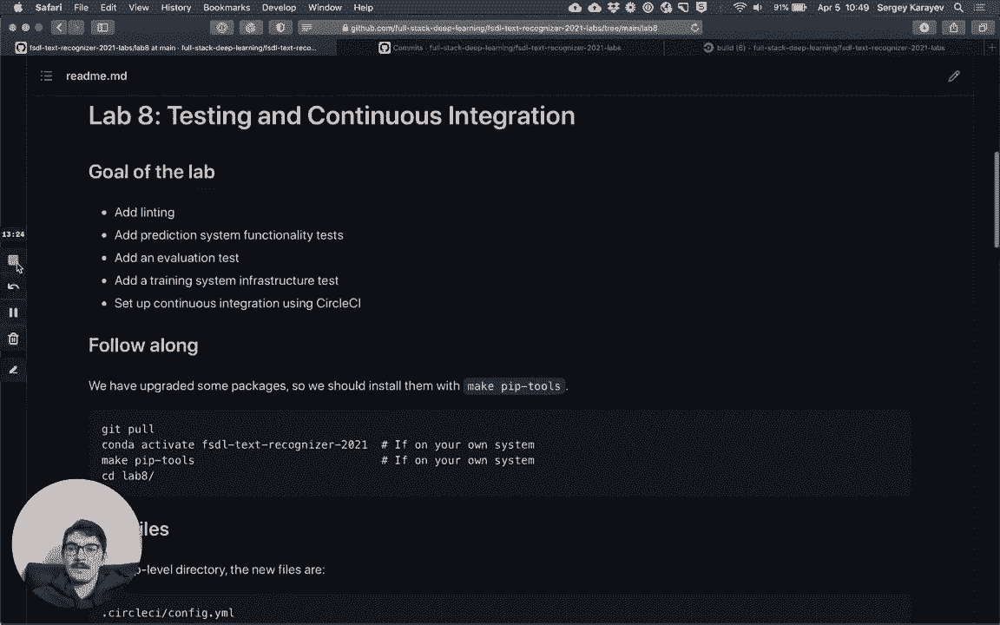

本节课中我们一起学习了如何为机器学习项目构建完整的测试与持续集成流程。我们介绍了代码规范检查的重要性及工具，为预测系统、模型评估和训练流程添加了不同类型的测试，并最终使用 CircleCI 搭建了自动化的持续集成管道。这套流程能有效保障代码质量，并在团队协作中确保项目的稳定性和可维护性。