# 22：L11A - 部署机器学习模型 🚀

在本节课中，我们将要学习如何将训练好的机器学习模型部署到生产环境，并探讨部署后的监控与维护。我们将从部署的不同模式讲起，涵盖从简单的批处理预测到复杂的模型服务化部署，并讨论如何优化性能、管理依赖以及进行水平扩展。

---

## 📦 部署模式概览

部署机器学习模型时，一个核心的决策点是将模型放置在应用架构的哪个位置。下图展示了一个典型Web应用的简化架构：

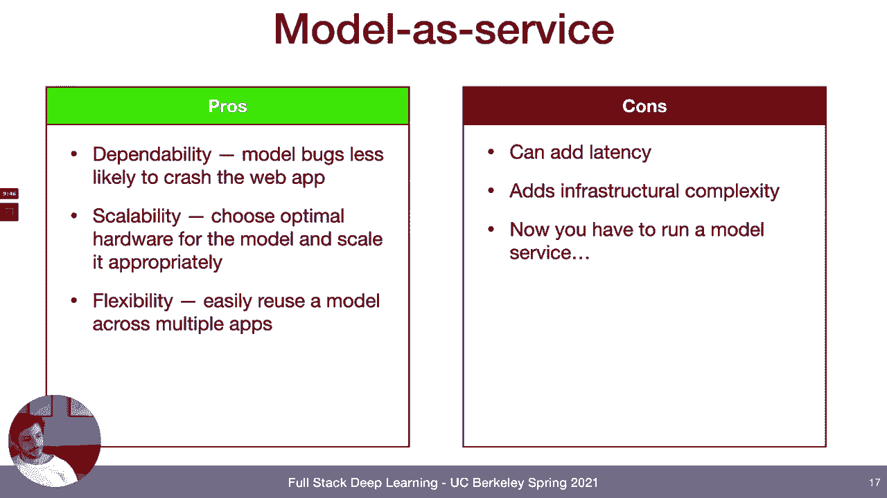

用户通过客户端（如浏览器）连接到运行代码的服务器，服务器处理后端逻辑并可能与数据库交互，最终将结果返回给用户。

### 1. 批处理预测

第一种部署模式是**批处理预测**。在这种模式下，我们不实时运行模型，而是定期在新数据上运行模型，并将预测结果缓存到数据库中。当用户请求时，应用直接从数据库读取缓存的结果。

以下是批处理预测的优缺点：

*   **优点**：
    *   对应用代码改动极小。
    *   对用户而言延迟很低，因为响应只是快速的数据库查询。
*   **缺点**：
    *   适用范围有限，仅适用于输入空间可枚举的场景（例如，每天为每个用户生成一个推荐）。
    *   用户无法获得最新的预测，预测结果总是“过时”的。
    *   如果缓存更新失败，很难被检测到，用户会持续收到旧的预测。


上一节我们介绍了离线批处理的模式，本节中我们来看看如何将模型集成到在线服务中。

### 2. 模型内置于Web服务

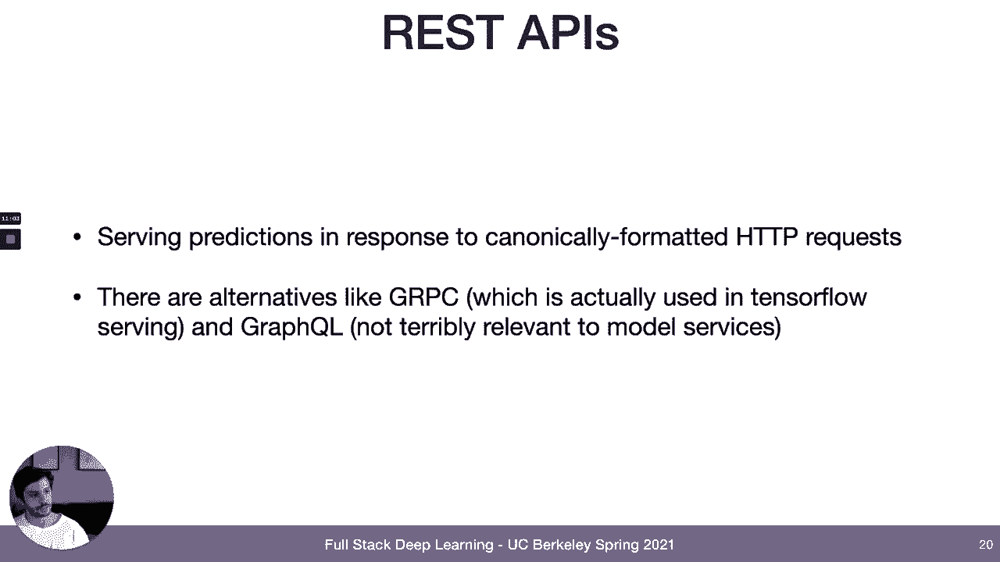

第二种模式是将模型直接打包，作为现有Web服务的一部分进行部署。具体做法是，将模型权重文件（或从如S3的存储中下载）加载到Web服务器中，当请求到来时直接调用模型进行预测。

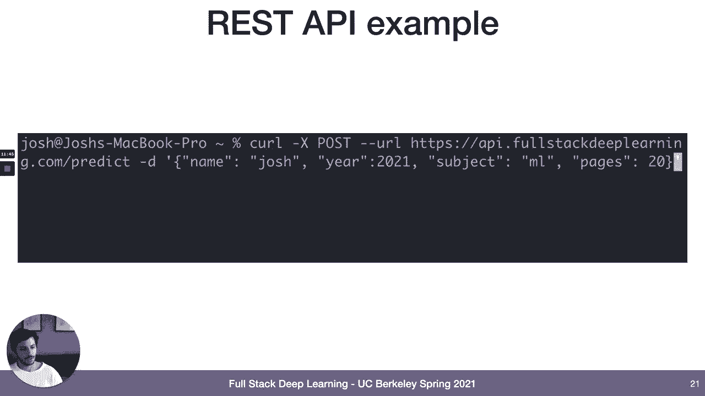

以下是这种模式的优缺点：

*   **优点**：
    *   实现简单。
    *   复用现有的Web服务基础设施。
*   **缺点**：
    *   **技术栈冲突**：Web服务器可能由不同团队用不同语言（如Node.js）编写，而模型可能是Python代码，需要额外的桥接。
    *   **耦合部署**：模型更新需要重新部署整个Web服务。
    *   **资源竞争**：模型推理可能消耗大量计算资源（如GPU），影响Web服务的其他功能。
    *   **伸缩性一致**：Web服务和模型必须按相同方式伸缩，无法根据各自需求独立优化。

鉴于这些限制，更常见的模式是将模型部署为独立的服务。

### 3. 独立的模型服务

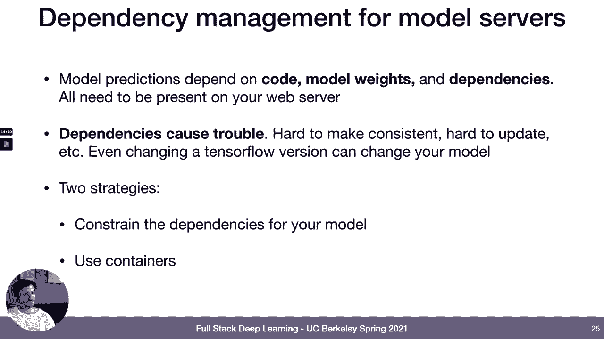

第三种，也是最常见的模式，是将模型部署为独立的Web服务。后端服务器或客户端通过向这个模型服务发送请求并接收响应来获取预测结果。

以下是这种模式的优缺点：

*   **优点**：
    *   **解耦与容错**：模型的问题（如内存泄漏）不会导致整个Web应用崩溃。
    *   **独立伸缩**：可以为模型服务选择专用硬件（如GPU服务器），并根据模型负载独立进行水平扩展。
    *   **灵活复用**：多个应用可以共享同一个模型服务。
*   **缺点**：
    *   **增加延迟**：需要额外的网络调用。
    *   **增加基础设施复杂度**：需要部署和维护一个新的服务。
    *   **运维责任**：需要负责运行和维护自己的模型服务。

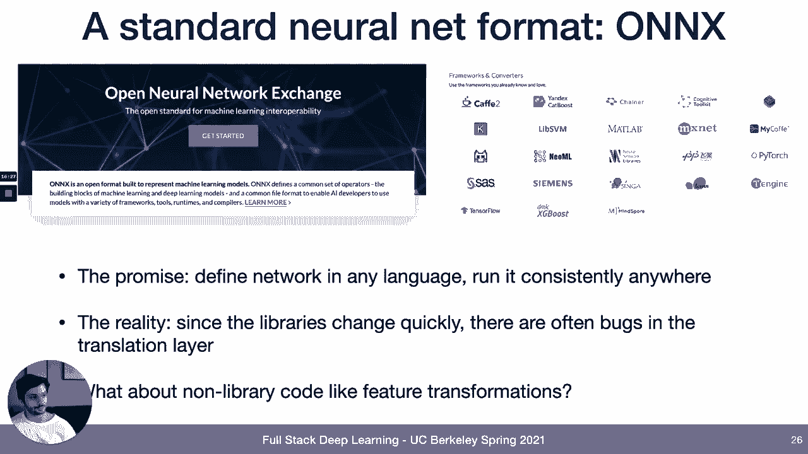

接下来，我们将深入探讨如何构建和管理这样一个独立的模型服务。

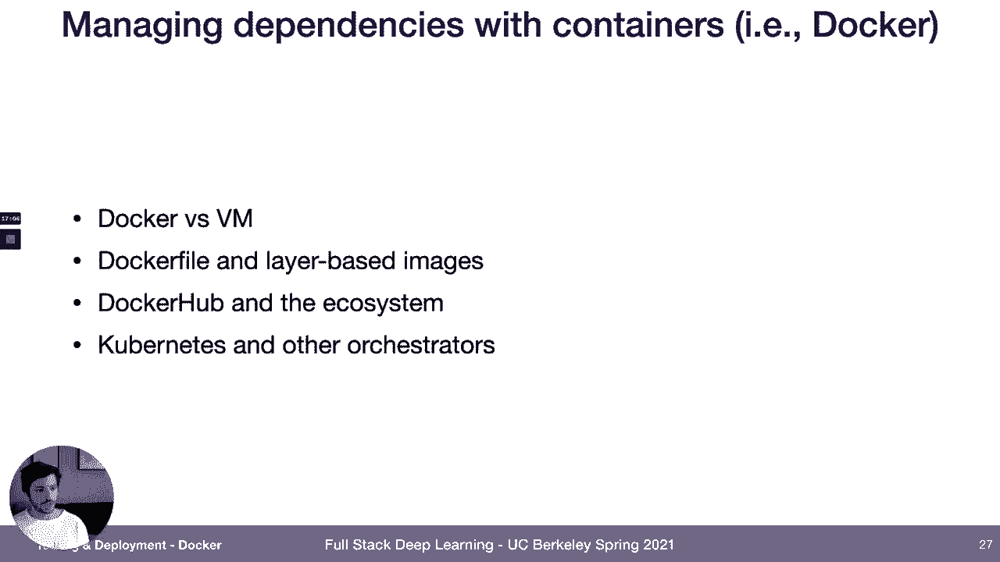

---

## 🔧 构建模型服务

构建模型服务涉及多个方面。以下是核心内容：

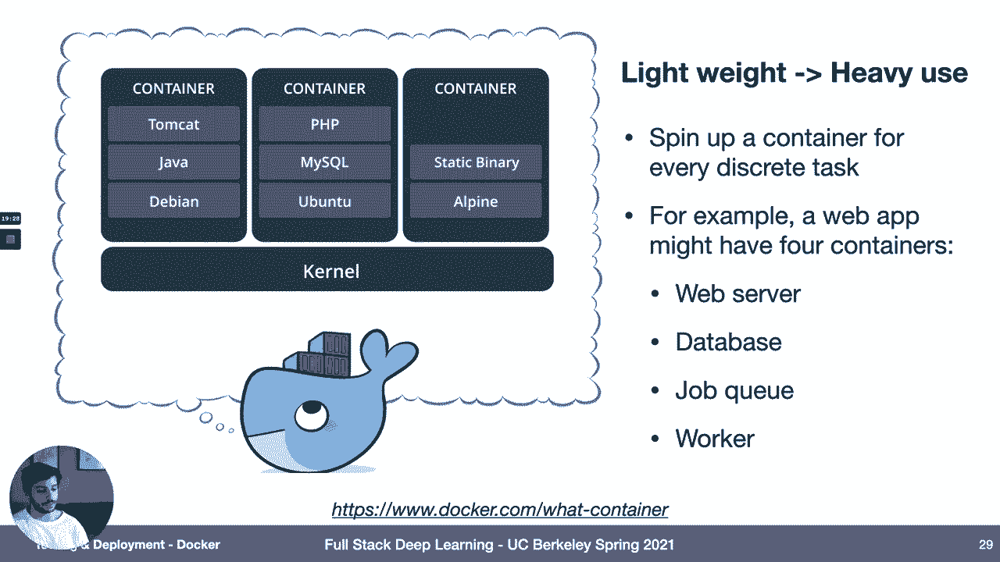

### 1. REST API

REST API是一种通过HTTP请求/响应提供预测服务的标准方式。虽然存在其他协议（如gRPC、GraphQL），但REST是目前实践中最常用的。

一个调用模型REST API的示例使用 `curl` 命令：
```bash
curl -X POST https://api.example.com/predict \
  -H “Content-Type: application/json” \
  -d ‘{“input”: [1, 2, 3]}’
```
响应可能是JSON格式：
```json
{“prediction”: 0.85}
```

目前，机器学习模型的REST API请求/响应格式尚无统一标准。各大云平台（Google Cloud, Azure, AWS）的格式也各不相同。建议选择一种对你有意义或参考主流平台的格式。

### 2. 依赖管理

模型服务需要包含以下元素才能运行：
*   **服务代码**：处理请求和调用模型的逻辑。
*   **模型权重**：训练好的模型参数。
*   **代码依赖**：运行代码所需的所有库（如TensorFlow、PyTorch）。

模型权重和代码可以通过常规的代码部署流程复制到服务器。对于大型权重文件，通常会在服务启动时从远程存储（如S3）下载。

依赖管理更具挑战性，因为库版本的不一致可能影响模型行为。有两种主要策略：

**策略一：约束依赖**
尝试使用标准格式保存模型，以减少对特定机器学习库版本的依赖。**ONNX** 是一个开放格式，旨在让模型能在任何地方运行。然而在实践中，转换层可能存在bug，且模型相关的预处理代码无法被ONNX捕获，依赖问题依然存在。

**策略二：使用容器**
更健壮的方法是使用容器技术，如 **Docker**。

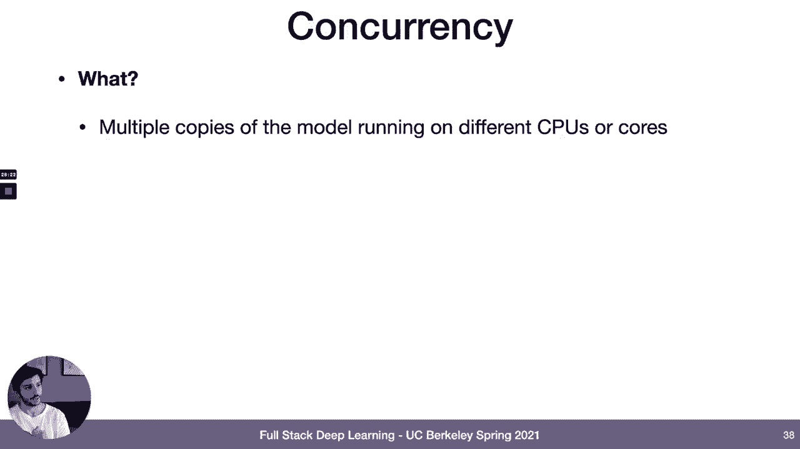

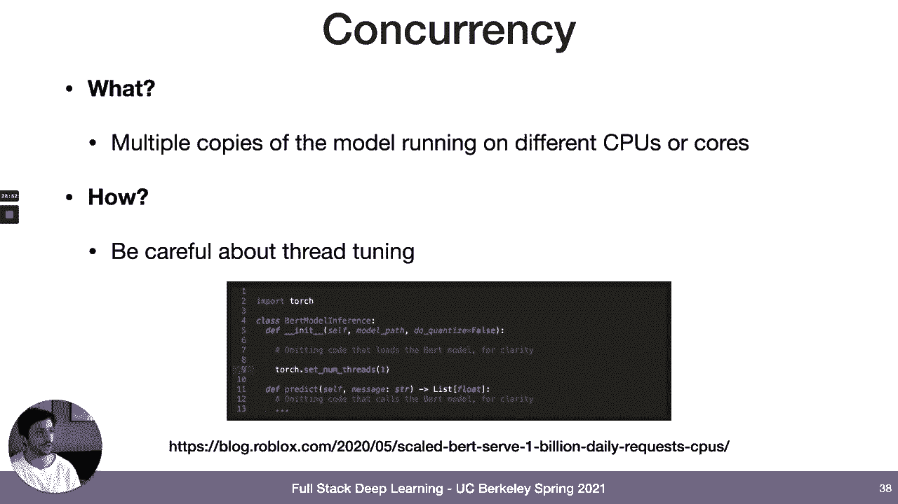

### 3. Docker 容器

Docker容器是一种轻量级的虚拟化技术。与传统的虚拟机不同，容器共享主机操作系统内核，因此更加轻量和快速。


在微服务架构中，应用的每个组件（Web服务器、数据库、模型服务）都可以运行在独立的容器中，各自管理自己的依赖。

通过 **Dockerfile** 定义容器环境：
```dockerfile
FROM python:3.8-slim
WORKDIR /app
COPY requirements.txt .
RUN pip install -r requirements.txt
COPY model_weights.pth .
COPY app.py .
EXPOSE 8080
ENV MODEL_PATH=“model_weights.pth”
CMD [“python”, “app.py”]
```

容器镜像可以推送到 **Docker Registry**（如Docker Hub），确保环境的一致性。Docker拥有强大的生态系统，有大量预构建的镜像可供使用。

当应用由多个容器组成时，需要 **容器编排** 工具来管理它们的部署、伸缩和通信。**Kubernetes** 是目前的主流选择，**Docker Compose** 则适用于本地开发和简单场景。

---

## ⚡ 性能优化

模型服务部署后，我们需要让它运行得更快、更高效。以下是在单机上可以采用的优化技术：

### 1. GPU vs CPU 推理

*   **使用GPU推理**：
    *   **优点**：通常能获得最高吞吐量；与训练硬件一致。
    *   **缺点**：设置更复杂；在实践中通常更昂贵。
*   **使用CPU推理**：
    *   **优点**：更简单，成本可能更低。
    *   **缺点**：对于大型模型，吞吐量可能较低。

决策取决于你的延迟、吞吐量和预算要求。

### 2. 并发

即使使用CPU，也可以通过**并发**来利用多核优势。即在同一台机器上运行模型的多个副本（或进程），每个处理不同的请求。关键是要进行**线程调优**，确保每个模型副本只使用必要的线程数，避免资源争用。

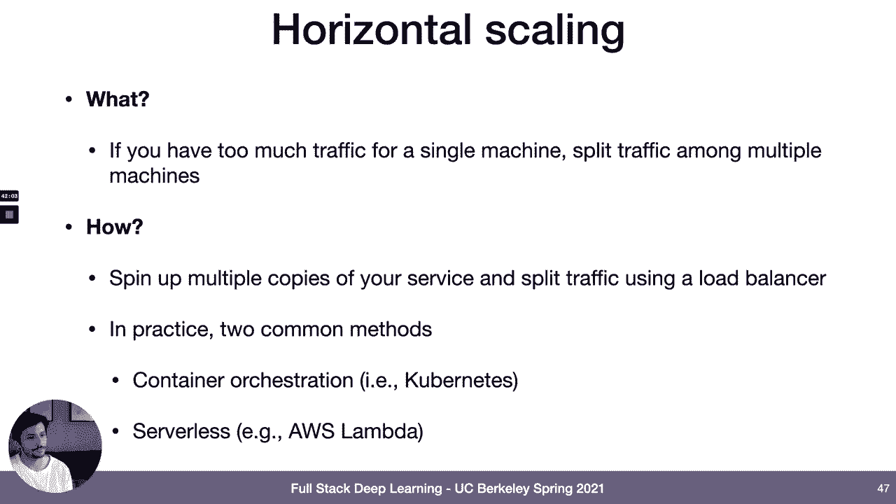

### 3. 模型蒸馏与量化

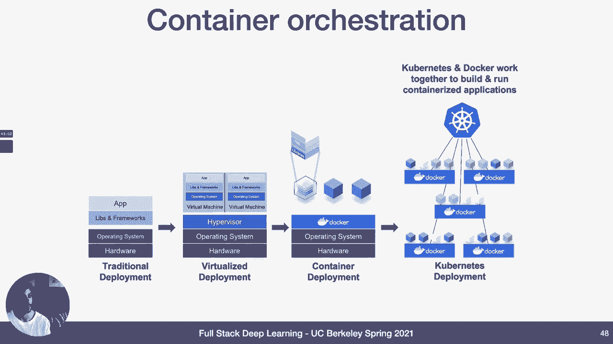

*   **模型蒸馏**：训练一个更小的“学生”模型来模仿大型“教师”模型的行为，以牺牲少量精度换取更小的模型尺寸和更快的推理速度。在实践中可能较难稳定实现，但可以优先考虑使用预训练的蒸馏模型（如DistilBERT）。
*   **量化**：将模型权重从32位浮点数转换为更低精度的表示（如8位整数），从而减少模型大小、提升推理速度。PyTorch和TensorFlow Lite都提供了量化工具。可以采用**量化感知训练**来减少精度损失。

### 4. 缓存与批处理

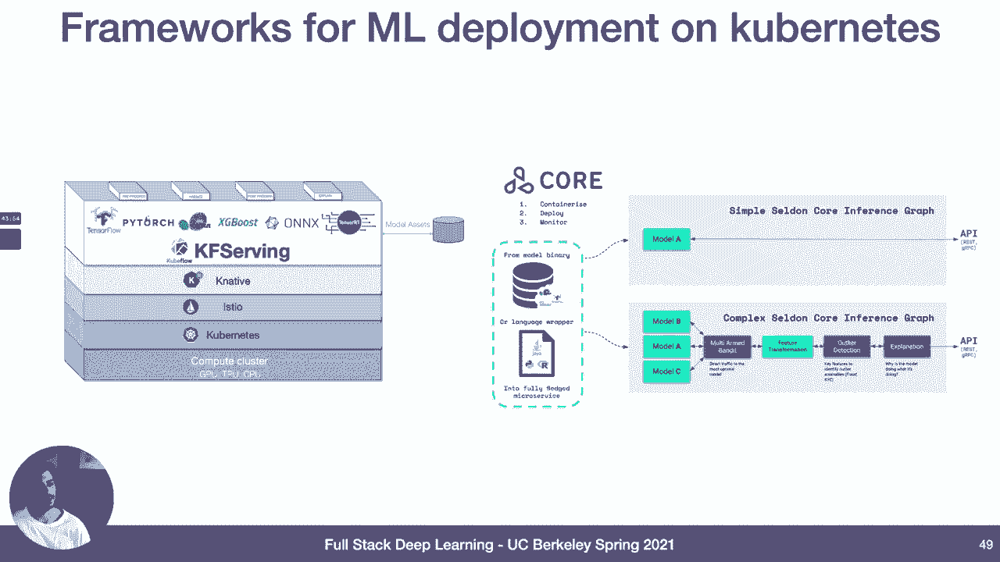

*   **缓存**：对于频繁出现的输入，可以缓存其预测结果，避免重复运行模型。Python的 `functools.lru_cache` 可以用于实现简单的内存缓存。
*   **批处理**：将多个输入请求组合成一个批次送入模型，能极大提升GPU利用率和平行计算效率。这需要服务端累积请求，并处理好批次拆分与结果返回，需要在吞吐量和延迟之间进行权衡。

### 5. GPU共享与专用库

*   **GPU共享**：当一个模型的批处理不足以占满GPU时，可以让多个模型或多个任务的推理共享同一块GPU，提高资源利用率。这是一项前沿技术。
*   **使用专用服务库**：避免重复造轮子。**TensorFlow Serving**、**TorchServe**、**NVIDIA Triton** 等库内置了批处理、并发等优化，是进行GPU推理的推荐选择。

---

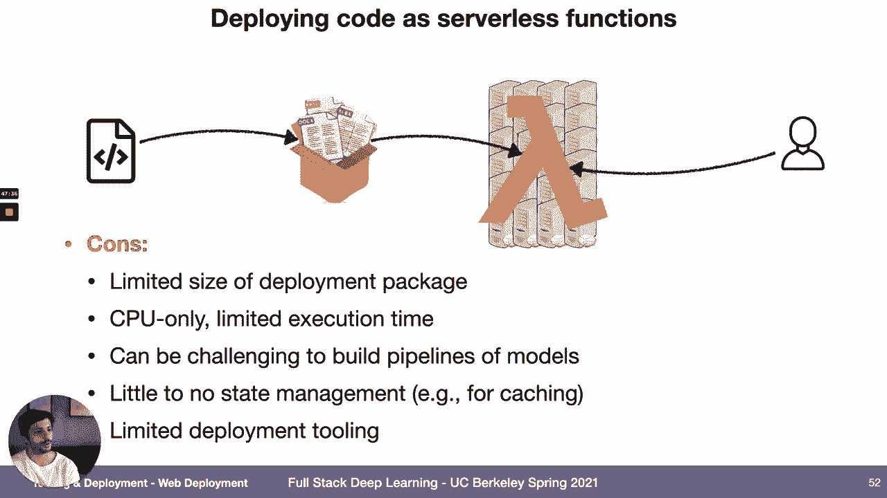

## 📈 水平扩展

当单个服务器的流量过大时，需要进行**水平扩展**：创建模型的多个副本，并使用负载均衡器将流量分发到这些副本上。

主要有两种实现方式：

### 1. 基于容器编排（如Kubernetes）

使用Kubernetes可以方便地管理模型服务容器的多个副本，并自动进行负载均衡和故障恢复。一些开源项目如 **KServe** (原KFServing) 和 **Seldon Core** 在Kubernetes上提供了更高级的机器学习模型服务功能。


### 2. 无服务器函数（Serverless）

如 **AWS Lambda**、**Google Cloud Functions**。你将模型代码和依赖打包，云服务商负责运行、伸缩和负载均衡。你只需按请求付费。

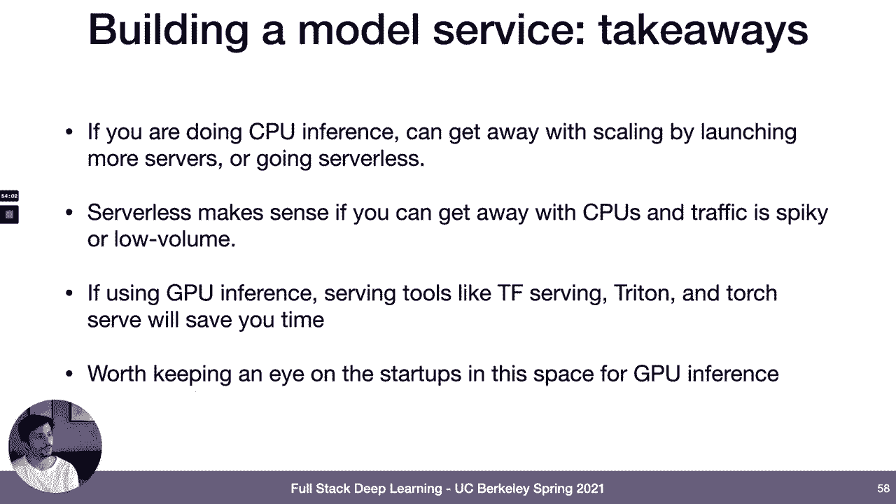

*   **优点**：无需管理服务器；成本效益高（尤其适用于流量波动的场景）；伸缩完全自动化。
*   **缺点**：部署包大小和函数运行时间有限制；状态管理困难；部署工具链可能不如传统方式完善。

**选择建议**：
*   如果进行**CPU推理**且流量不大或呈波动态，**无服务器函数**是简单易用的选择。
*   如果进行**GPU推理**或需要细粒度控制，建议使用**专用服务库**并结合**容器编排**进行部署。

---

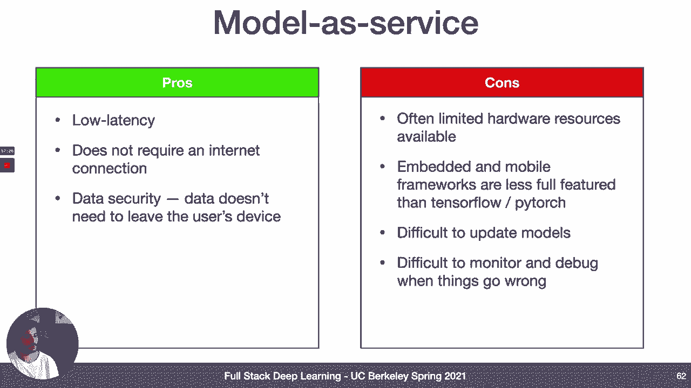

## 🚢 部署流程与托管选项

### 部署流程

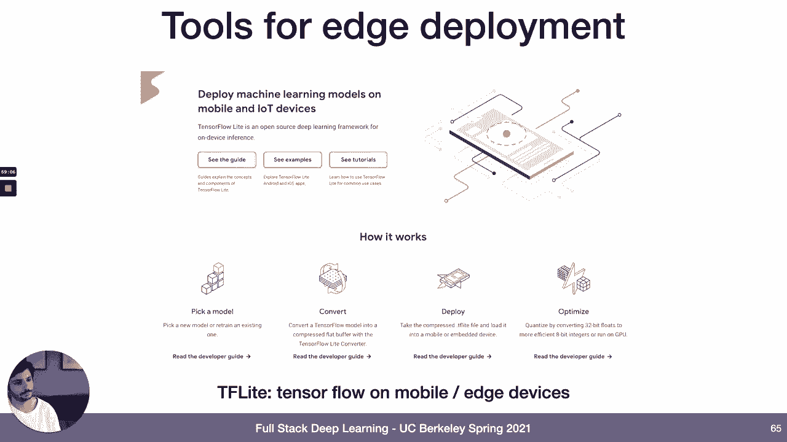

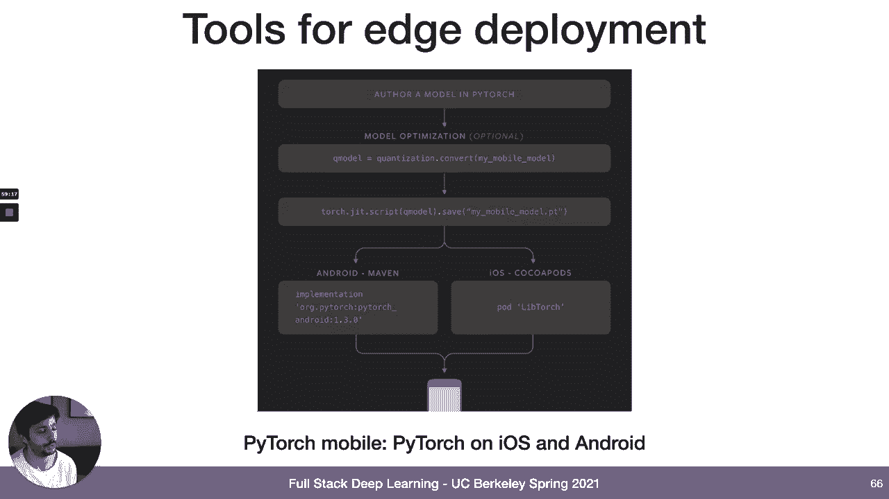

模型部署不仅关乎技术，还涉及流程。最佳实践包括：
*   **渐进式发布**：先将少量流量（如1%）导向新模型，逐步增加至100%。
*   **快速回滚**：一旦发现问题，能立即切换回旧版本。
*   **管道部署**：支持部署由多个模型组成的推理管道。

### 托管服务

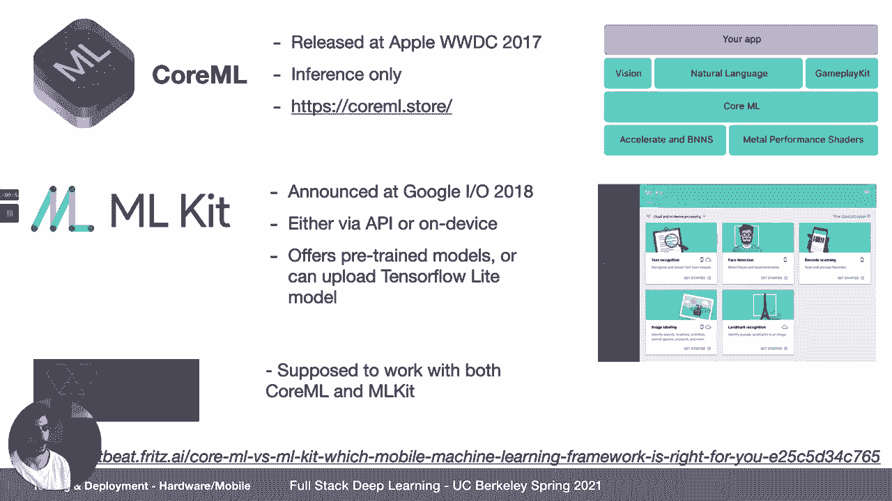

如果你不想管理任何基础设施，可以考虑云厂商或第三方提供的**全托管机器学习部署服务**，如：
*   Google Cloud AI Platform Prediction
*   Amazon SageMaker
*   Azure Machine Learning
*   初创公司：Algorithmia, Cortex

这些服务简化了部署，但通常价格昂贵。

---

## 📱 边缘/客户端部署

最后一种部署模式是将模型直接部署到**客户端设备**上，如手机、浏览器或物联网设备。这被称为**边缘预测**。

### 优缺点

*   **优点**：
    *   **延迟最低**：推理在本地完成。
    *   **离线工作**：无需网络连接。
    *   **隐私保护**：用户数据无需离开设备。
*   **缺点**：
    *   **资源受限**：客户端硬件（算力、内存）有限。
    *   **框架受限**：需使用精简版框架（如TensorFlow Lite）。
    *   **更新困难**：模型权重已分发到设备，更新麻烦。
    *   **调试困难**：难以获取设备上的模型运行数据和性能指标。

### 工具与框架

针对不同的边缘设备，有不同的优化工具：
*   **NVIDIA设备**：**TensorRT**
*   **跨框架/跨硬件编译**：**Apache TVM**
*   **TensorFlow移动端**：**TensorFlow Lite**
*   **PyTorch移动端**：**PyTorch Mobile**
*   **浏览器**：**TensorFlow.js**
*   **苹果设备**：**Core ML**
*   **安卓设备**：**ML Kit**

### 开发心态调整

进行边缘部署时，需要调整开发心态：
1.  **早期考虑硬件约束**：从一开始就选择适合目标硬件的模型架构（如MobileNet， DistilBERT）。优化技术（蒸馏、量化）通常只能带来2-10倍的提升，如果初始模型不在目标范围内，后续会非常困难。
2.  **将边缘优化视为风险点**：在测试阶段，必须在目标硬件或模拟环境中充分测试编译后的模型，确保性能和准确性。
3.  **设计降级方案**：为模型可能出现的失败或延迟设计后备方案（如使用规则系统或简化模型），这对安全关键应用尤为重要。

**总体建议**：Web部署通常更容易。只有在确实需要超低延迟、离线功能或强隐私保护时，才考虑边缘部署。选择工具时，尽量匹配目标硬件对应的优化框架。

---

## 🎯 总结

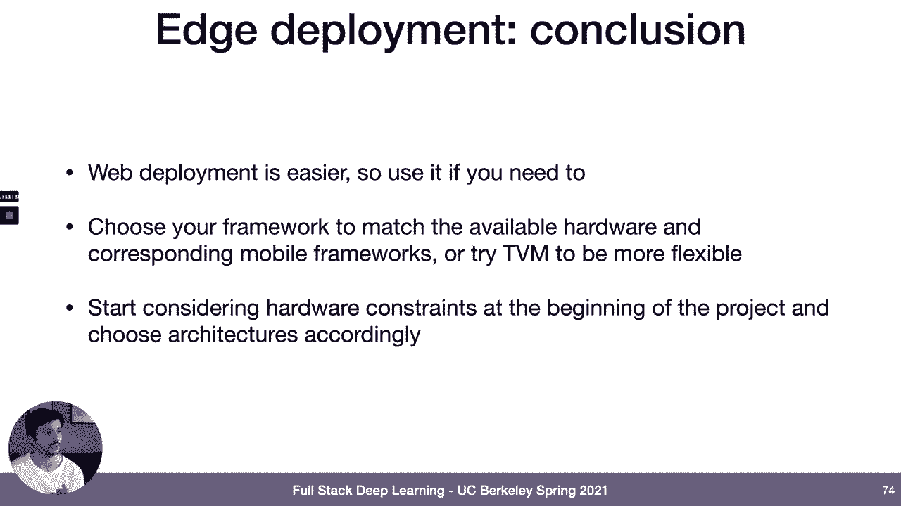

本节课中我们一起学习了机器学习模型部署的核心知识。我们探讨了三种主要部署模式：批处理预测、模型内置Web服务以及独立的模型服务，并详细分析了各自的适用场景和优劣。我们深入研究了如何构建模型服务，包括设计REST API、使用Docker管理依赖、进行性能优化（如并发、量化、批处理）以及通过容器编排或无服务器函数实现水平扩展。最后，我们简要介绍了边缘部署的概念、工具链以及与之相关的特殊开发考量。掌握这些内容，将帮助你更顺利地将机器学习模型从实验环境推向实际生产，并保障其稳定、高效地运行。