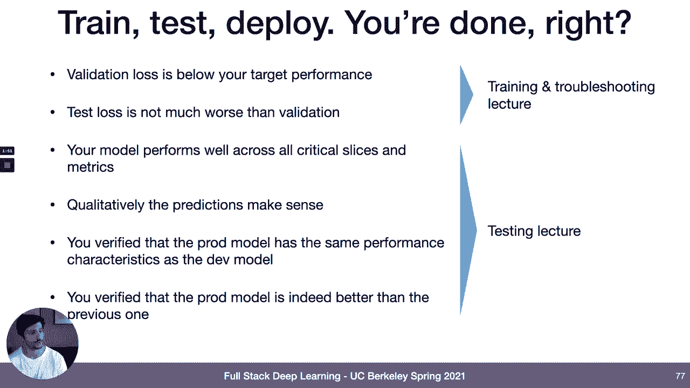
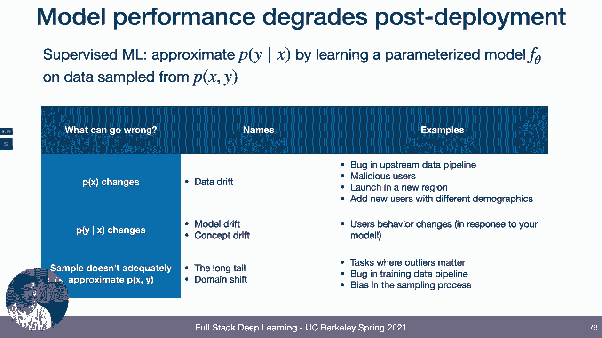
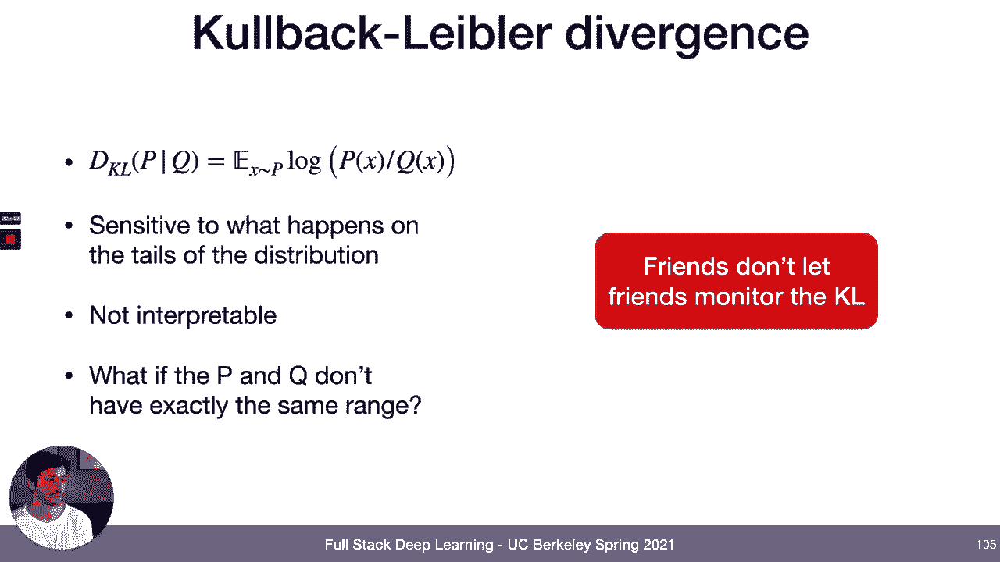
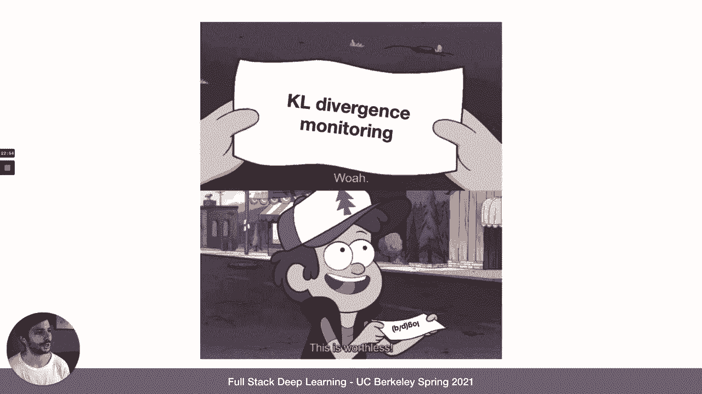
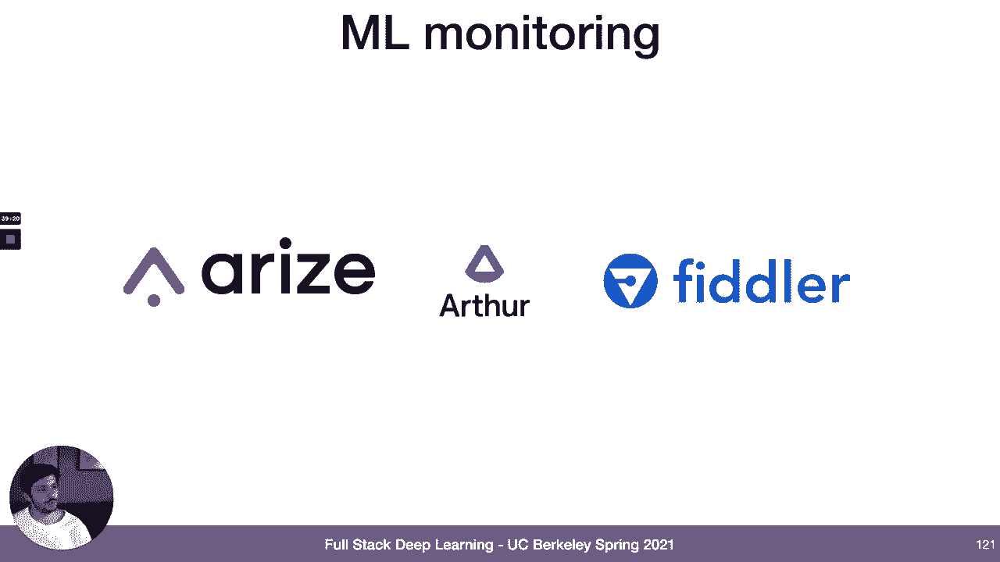
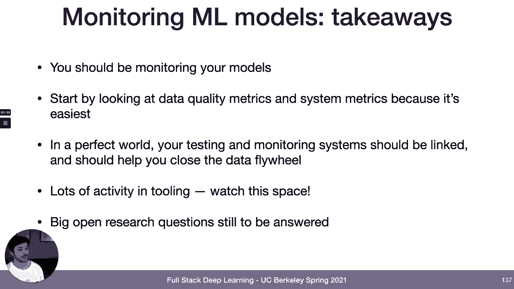

# 23：L11B - 监控机器学习模型 📊

在本节课中，我们将要学习如何监控已部署的机器学习模型。模型部署后，确保其持续健康运行至关重要，因为许多因素都可能导致模型性能下降。我们将探讨性能下降的原因、如何检测这些变化，以及构建监控系统的最佳实践。

## 🎯 概述：为什么需要监控模型

上一节我们讨论了模型训练和评估，本节中我们来看看模型部署后的情况。模型部署后，许多因素可能导致其性能下降。理论上，问题可能源于输入数据分布 `P(x)` 的变化（数据漂移），或条件概率 `P(y|x)` 的变化（概念漂移），亦或是训练数据采样过程引入的偏差。

## 🔍 监控什么：关键信号

为了判断模型性能是否发生变化，我们需要监控几个关键信号。以下是四种值得监控的信号，它们在信息价值与获取难度之间存在权衡。

*   **模型性能指标**：最直接的监控对象。通过对比预测值与真实标签，可以准确评估模型表现。然而，获取及时、低成本的标注数据通常是最大挑战。
*   **业务指标**：例如推荐系统的用户点击率或参与度。这些指标易于测量，但受多种因素影响，不能直接反映模型准确率。
*   **模型输入与预测分布**：通过分析输入特征和输出预测的分布变化来检测漂移。即使没有真实标签，这种方法也颇具参考价值。
*   **系统性能指标**：监控GPU利用率、请求延迟等系统健康指标。这有助于发现严重的系统级故障，但无法捕捉模型特有的性能问题。

## 📊 如何测量变化：检测数据漂移

我们讨论了可以监控哪些信号，接下来看看如何实际测量这些信号是否发生了变化。检测分布变化的总体策略是：选择一个代表“健康”状态的参考数据窗口，再选择一个待测量的当前数据窗口，然后使用某种距离度量来比较这两个窗口。

### 选择参考窗口与测量窗口

*   **参考窗口**：通常可以使用训练集或评估集作为参考，因为它们代表了模型被设计和优化的数据分布。
*   **测量窗口**：根据具体问题选择，例如监控过去一小时、一天或一周的数据。也可以设置多个滑动窗口进行持续监控。

### 一维数据的距离度量

对于连续的一维数据，主要有两类度量方法：

**基于规则的度量（数据质量检查）**
以下是常见的基于规则的检查项：
*   检查特征的最小值、最大值、均值是否在参考窗口定义的允许范围内。
*   检查数据点数量是否充足，或缺失值、NaN值是否过多。
*   检查更复杂的规则，例如某一列的值是否始终大于另一列。

**统计距离度量**
以下是几种常用的统计距离：
*   **KL散度**：`D_KL(P||Q) = Σ P(i) * log(P(i)/Q(i))`。不推荐用于监控，因为它对分布尾部的噪声非常敏感，且难以解释。
*   **KS统计量**：`D_KS = max_x |CDF_P(x) - CDF_Q(x)|`。它度量了两个累积分布函数之间的最大距离，解释性强，推荐使用。
*   **PSI（群体稳定性指数）** 或 **D1距离**：`D1 = Σ |P(i) - Q(i)|`。计算两个概率密度函数差异的绝对值之和，直观且易于解释。

### 高维数据的处理方法

处理高维数据的漂移检测仍是一个开放性问题。以下是一些可行策略：
*   **进行多个一维比较**：分别计算每个特征的距离度量，然后取最大值或关注最重要的特征。
*   **使用多维检验**：例如最大均值差异（MMD），它比较两个分布在高维特征空间中的均值差异。
*   **使用投影方法**：先将高维数据投影到低维空间，再在低维空间进行检验。投影方式可以是：
    *   **领域知识投影**：如对图像计算平均像素值，对文本计算句子长度。
    *   **随机投影**：使用随机矩阵进行线性投影。
    *   **统计模型投影**：使用PCA、自编码器或密度模型（如计算数据点的似然）进行投影。

## ⚠️ 如何判断变化是否严重：设置警报阈值

我们知道了如何测量变化，但如何判断这种变化是否需要干预呢？不幸的是，目前还没有非常完美的自动化方案。

*   **统计检验的局限性**：像KS检验这类给出p值的方法，在数据量很大时，即使微小的、无关紧要的分布变化也会导致极低的p值，从而产生大量误报。
*   **常见的实践方法**：
    *   **手动设置规则**：根据领域知识，为关键指标设置固定的允许范围（如“特征A的均值必须在X和Y之间”）。
    *   **在时间序列上应用异常检测**：将距离度量值本身视为一个时间序列，对其应用异常检测算法来发现异常点。
*   **未来方向**：理想的方法是能够**近似估计数据分布变化对模型性能的具体影响**，而不仅仅是给出一个抽象的“漂移分数”。这将是该领域一个有价值的研究方向。

## 🛠️ 监控工具概览

了解核心概念后，我们快速浏览一下可用的工具类别。

*   **系统监控工具**：用于设置系统级警报（如CPU、内存、延迟）。例如云服务商提供的Amazon CloudWatch、以及Datadog、New Relic等。
*   **数据质量工具**：专注于基于规则的数据质量检查。例如开源库Great Expectations，以及商业产品Monte Carlo和Anomalo。
*   **机器学习监控平台**：新兴的、专门为ML模型监控设计的平台，如Arize AI、Arthur AI和Fiddler。这个领域正在快速发展。

## 🔄 监控在ML系统中的地位：从监控到评估存储

最后，我们将监控置于更广阔的机器学习系统中来看。在传统软件中，监控主要用于故障检测和诊断。但在机器学习中，监控扮演着更核心的角色。

1.  **问题的隐蔽性**：ML模型的故障通常是“静默”的性能退化，而非系统崩溃，因此更需要主动监控来发现。
2.  **数据飞轮的核心**：监控收集的数据（模型输入、预测、预估性能）本身就是迭代和改进模型的关键燃料。因此，监控系统应更紧密地集成到整个ML工作流中，我倾向于称之为 **“评估存储”**。

这个“评估存储”系统可以帮助：
*   **训练时**：记录基准数据分布和模型性能。
*   **评估时**：用于A/B测试和离线评估。
*   **监控时**：持续评估模型在线上数据上的近似性能。
*   **数据收集**：根据预估性能低的区域，有针对性地采样更多数据用于标注和重新训练。
*   **重训练决策**：通过评估性能下降程度，辅助决定何时需要重新训练模型。

## 📝 总结与要点

本节课中，我们一起学习了机器学习模型监控的核心知识。

*   **监控是必要的**：模型部署后性能会随时间退化，必须通过监控来发现和解决问题。
*   **从简单开始**：建议从监控数据质量规则（特征范围、缺失值）和系统指标入手，这能捕获大部分问题。
*   **理解漂移类型**：关注数据漂移和概念漂移，并使用合适的统计量（如KS统计量、PSI）进行测量。
*   **阈值设置是挑战**：判断变化是否严重目前仍需人工参与，未来需要能关联漂移与性能影响的技术。
*   **融入系统循环**：理想的监控系统应超越告警，成为“评估存储”，紧密集成到训练、评估、数据收集和重训练的整个迭代循环中，助力闭合数据飞轮。
*   **工具与研究方向**：该领域工具正在成熟，同时存在大量未解决的研究问题，例如如何量化漂移对性能的影响，是一个非常有价值的探索方向。