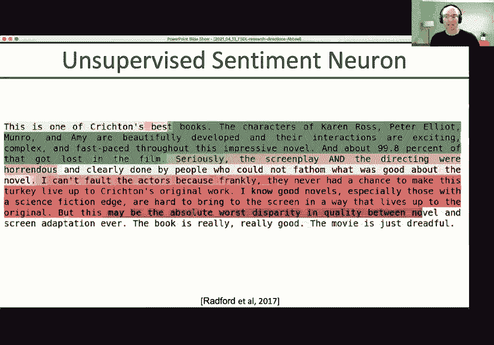
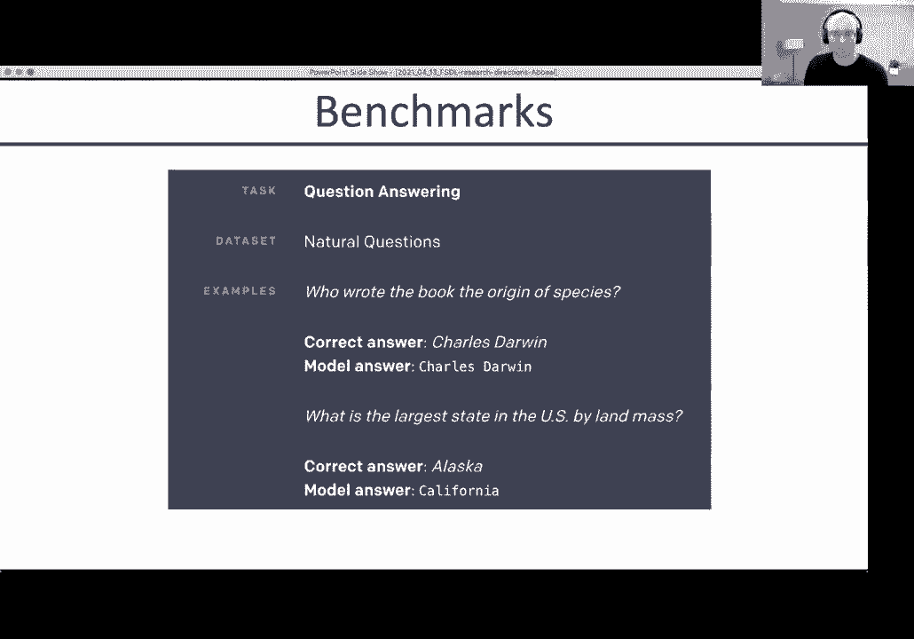
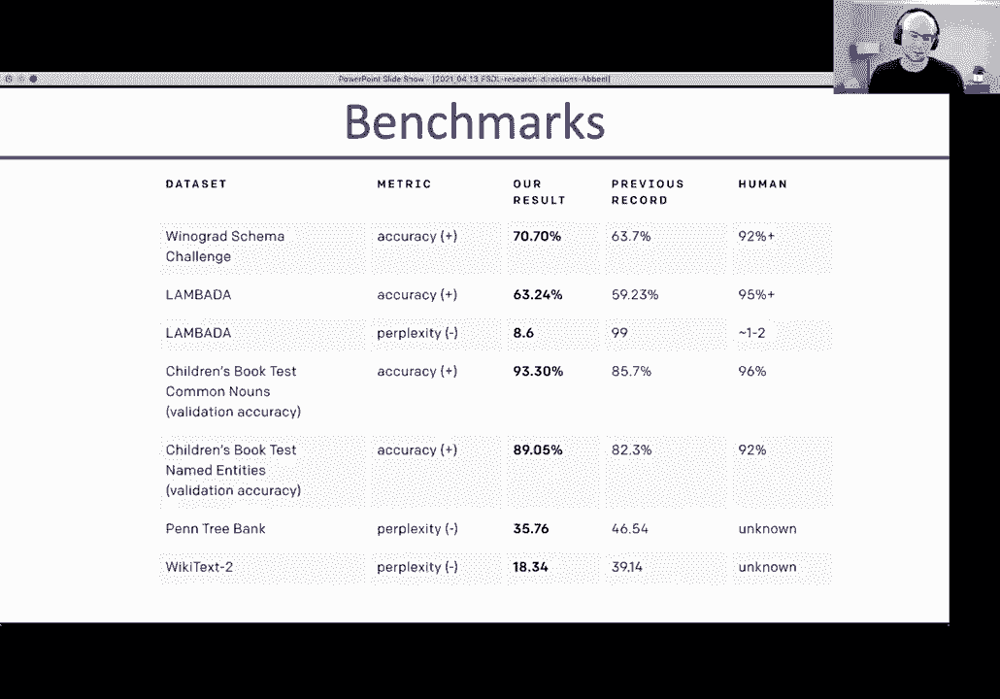
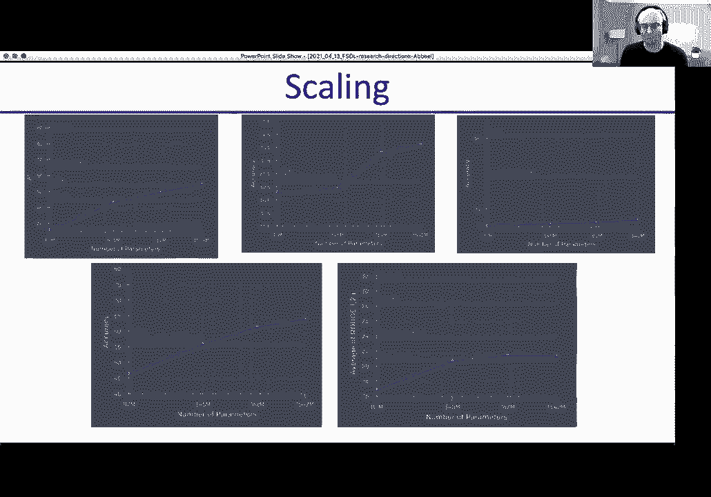
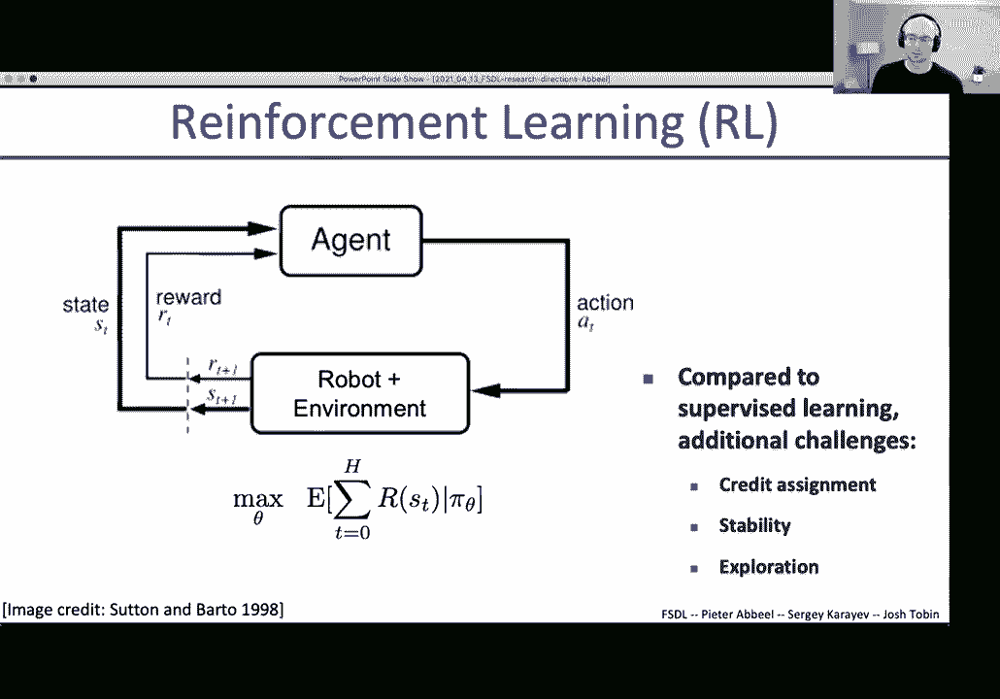
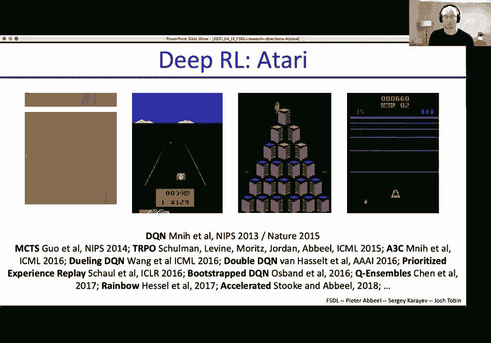
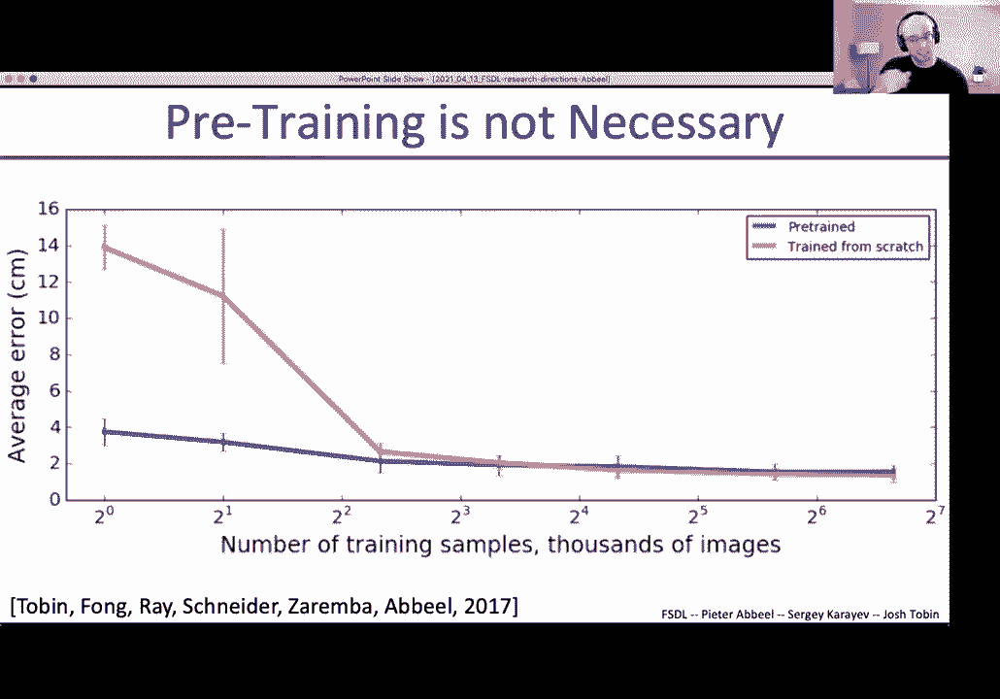
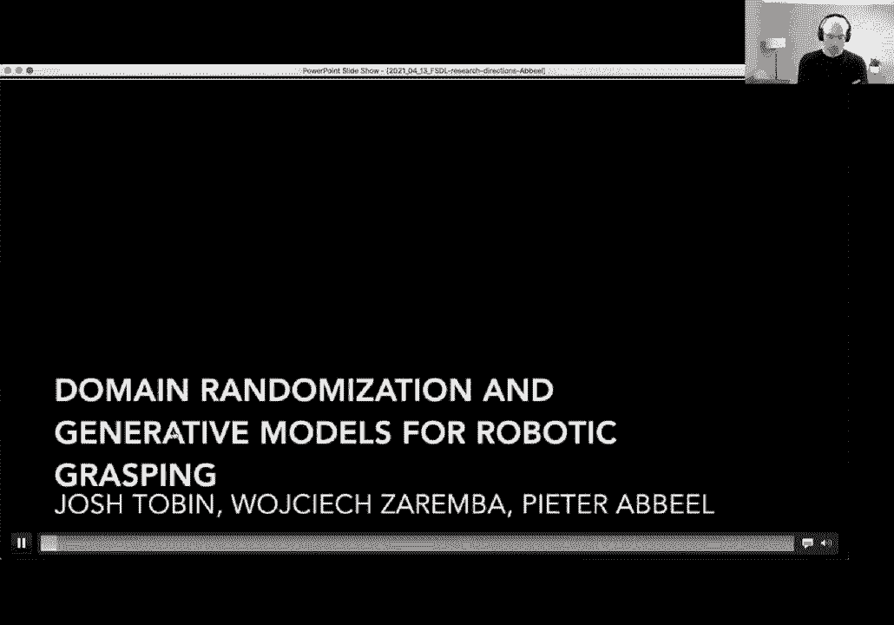
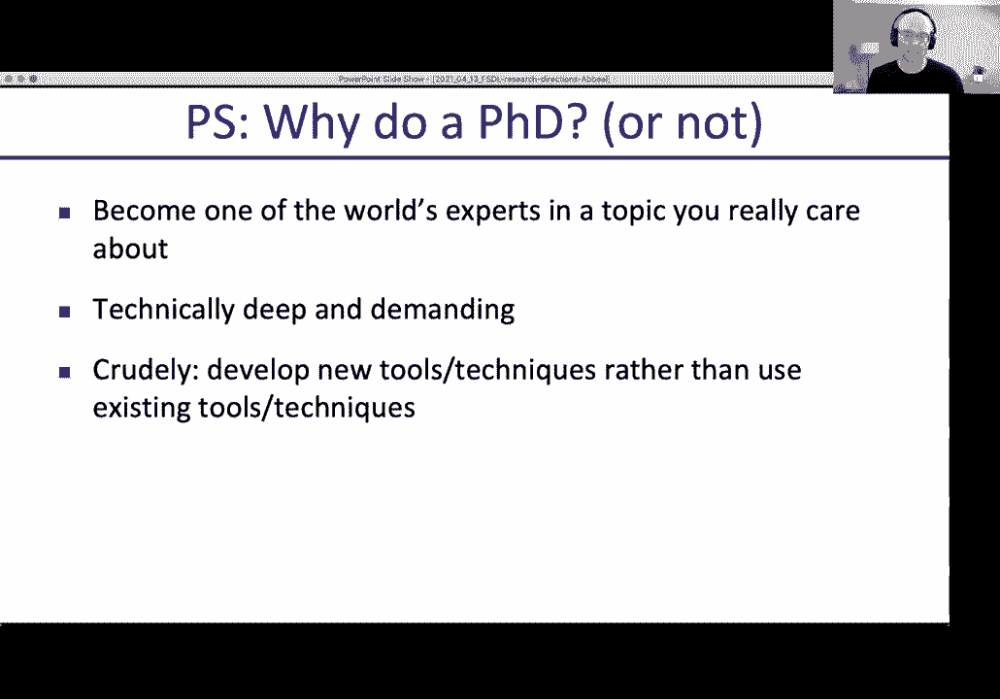
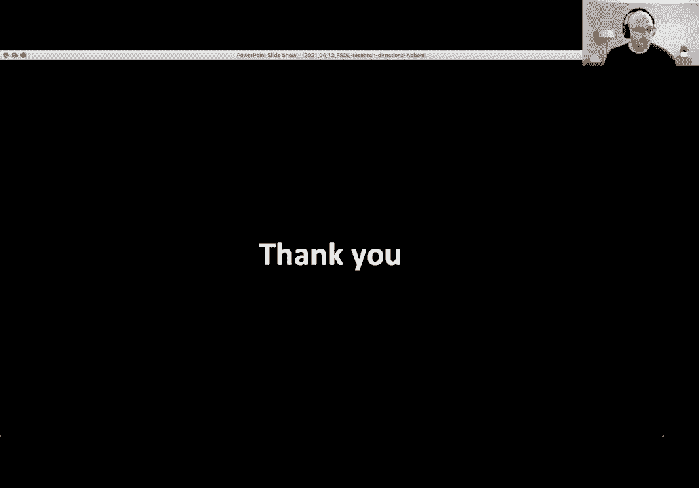

# 24：L12 - 研究方向 📚

在本节课中，我们将探讨深度学习的研究方向。虽然本课程主要关注实践应用，但理解研究前沿至关重要，因为深度学习领域的研究与实践联系紧密，新成果往往在一年内就能投入实际应用。我们将概览几个关键研究方向，并讨论如何跟上快速发展的研究步伐。

## 无监督学习 🤖

上一节我们介绍了深度学习在实践中的应用，本节中我们来看看如何减少对标注数据的依赖。深度监督学习需要大量标注数据，而无监督学习旨在从无标签或部分标签的数据中学习。

### 半监督学习

半监督学习结合了有监督和无监督学习。我们仍然处理分类问题，但只拥有部分数据的标签。

以下是其核心思想：
*   **标签传播**：如果未标记的数据点靠近已标记的同类数据点，则它们很可能属于同一类别。通过这种方式，标签可以从已标记数据“传播”到其邻近的未标记数据。
*   **噪声学生方法**：首先用有标签数据训练一个“教师”模型。然后，用这个教师模型为无标签数据生成“伪标签”。将有信心的伪标签数据加入训练集，并加入噪声（如Dropout、数据增强）重新训练一个更鲁棒的“学生”模型。

研究表明，这种方法可以在ImageNet等任务上显著提升模型性能。

### 无监督学习

无监督学习更进一步，完全不依赖任务相关的标注数据。其核心思想是设计一个**辅助的无监督预测任务**，让模型从中学习通用的特征表示，这些特征随后可用于下游的有监督任务。

常见的无监督预测任务包括：
*   **语言**：预测句子中的下一个词（如GPT系列）或填充被掩盖的词（如BERT）。
*   **图像**：预测图像缺失的补丁、解决拼图游戏或预测图像的旋转角度。

一个突破性的例子是**GPT-2**。它通过海量文本训练来预测下一个词，展示了强大的文本生成和理解能力，甚至能在少量示例下完成情感分类、常识推理等任务。公式上，其目标是最大化序列的似然估计：
`P(x_t | x_1, ..., x_{t-1})`
其中 `x_t` 是当前位置的单词，模型基于之前的所有单词进行预测。

在计算机视觉领域，**对比学习**（如SimCLR、MoCo）取得了巨大成功。其核心思想是：
*   对同一张图像进行两次不同的数据增强（如裁剪、变色），得到两个变体。
*   训练模型使这两个变体在特征空间中的表示尽可能接近（正样本对）。
*   同时，使来自不同原始图像的变体在特征空间中的表示尽可能远离（负样本对）。

通过这种方式，模型学会了提取图像的本质特征，这些特征可以很好地迁移到图像分类等有监督任务中。

无监督学习是近年来从研究到实践转化最快的领域之一，已广泛应用于NLP，并正在改变计算机视觉领域。

## 强化学习 🎮

现在让我们从被动感知转向主动决策。强化学习研究的是智能体如何通过与环境的交互来学习达成目标的最佳策略。

与监督学习不同，强化学习面临独特挑战：
*   **信用分配问题**：智能体在完成一系列动作后获得一个总奖励，但很难确定每个具体动作的贡献。
*   **探索与利用的权衡**：智能体需要在尝试新动作（探索）和利用已知有效动作（利用）之间取得平衡。
*   **稳定性**：学习过程中的试错可能导致策略剧烈波动。

尽管如此，强化学习已取得瞩目成就：
*   **游戏**：DeepMind的DQN学会了玩Atari游戏，AlphaGo/AlphaZero在围棋、象棋上超越人类。
*   **机器人控制**：让机器人学习跑步、翻转、操作物体（如将积木放入对应形状的孔中、解魔方）。
*   **动画**：DeepMimic等工作可以生成逼真的人物和生物运动，用于游戏和电影。

将无监督学习与强化学习结合是当前的研究热点。例如，在训练智能体时，同时使用对比学习从图像中提取更好的特征表示，可以显著加快从像素输入中学习的速度，使其性能接近甚至达到直接使用环境状态信息进行训练的水平。

## 元强化学习 🔄

上一节我们介绍了通用强化学习算法，本节中我们来看看能否让AI自己学会学习。通用RL算法（如PPO、DQN）适用于任何环境，但学习速度可能较慢。元强化学习的目标是**学习一个更好的强化学习算法本身**。

其核心思想是：让一个“元智能体”在许多不同的训练环境中学习。通过这个过程，它能够掌握快速适应新环境的策略或学习机制。当被放入一个全新的但相关的测试环境时，它就能利用之前积累的经验快速学习。

一种实现方式是将智能体建模为一个**循环神经网络**。RNN的内部权重定义了其学习算法，而激活状态则代表了其当前的策略。通过在外层使用传统RL方法优化这个RNN，我们可以得到一个能快速适应新任务的智能体。实验表明，这种方法在诸如多臂老虎机、迷宫导航等任务上，可以超越一些传统的最优算法。

## 模拟到真实迁移 🏗️

在现实世界中训练机器人成本高、风险大。利用模拟器生成数据是一种高效的替代方案。关键挑战在于：如何在模拟器中训练，却能应用到真实世界？

主要有以下几种方法：
1.  **提高模拟器逼真度**：尽可能让模拟器接近现实，但这通常会导致计算成本飙升。
2.  **域适应/域混淆**：训练一个判别器来区分特征来自模拟器还是真实世界。同时训练主网络，使其提取的特征能够“欺骗”判别器，从而让后续网络无法区分数据来源，实现知识迁移。
3.  **域随机化**：这是目前非常有效且简单的方法。其核心思想是：**不在追求模拟器的绝对真实，而是在模拟器中创建大量随机变化**（如物体颜色、纹理、光照、物理参数等）。虽然每个随机场景都不真实，但模型在见识了足够多的变化后，学到的策略反而能很好地泛化到从未见过的真实世界。

例如，在模拟器中用随机生成的形状和纹理训练机器人抓取模型，该模型可以直接在真实世界中抓取新物体。OpenAI的机械手解魔方项目也大量使用了域随机化技术。

## 深度学习用于科学与工程 🧬

最后，我们来看一个可能产生颠覆性影响的领域。与模仿人类能力的CV、NLP不同，AI用于科学和工程有望解决人类自身难以解决的问题。

一个标志性成果是DeepMind的**AlphaFold 2**。它能够根据蛋白质的氨基酸序列，高精度地预测其三维结构，在权威的CASP竞赛中取得了接近实验测量精度的成绩，解决了困扰生物学界数十年的“蛋白质折叠问题”。

其模型架构复杂，整合了多序列比对、注意力机制和几何约束推理。这展示了深度学习在推动基础科学发现方面的巨大潜力。

此外，深度学习还可用于：
*   **加速设计**：用神经网络替代昂贵的仿真器，快速评估芯片、材料、药物分子等设计方案的性能。
*   **增强数据**：用生成模型为科学计算补充数据。
*   **解决数学问题**：用Transformer等模型进行符号积分或求解微分方程。

## 研究趋势与如何跟进 📈

当前研究的一个显著趋势是**计算量呈指数级增长**。最前沿实验所使用的算力（以PetaFLOP-day计）每年都在大幅增加。这意味着，许多过去因算力限制而无法探索的想法，现在成为了可能。

对于研究者而言，可以选择：
*   **依赖人类智慧的问题**：需要精巧算法和深刻见解。
*   **依赖数据与算力的问题**：利用前所未有的海量数据和强大算力开辟新领域，这里可能存在更多“低垂的果实”。

### 如何跟上研究步伐

面对每月数千篇的新论文，我们需要高效的学习策略。

**首先，如何不读论文也能跟进前沿：**
以下是几个高效的信息源：
*   **顶级会议的教程**：通常能浓缩某个方向上百篇论文的精华。
*   **研究生课程与研讨会**：内容系统，易于消化。
*   **YouTube频道**：如Yannic Kilcher的论文讲解、Two Minute Papers的快速概览。
*   **优质通讯**：如Andrew Ng的《The Batch》，Jack Clark的《Import AI》。
*   **社交媒体**：关注领域内的活跃研究者（如Sergey Levine, Josh Tobin）。

**当你决定读论文时：**
*   **利用工具筛选**：如`arxiv-sanity.com`，可以查看最近最受欢迎、最受热议的论文。
*   **掌握阅读技巧**：不要逐字阅读。先读标题、摘要、结论，再看图表，快速判断论文价值。
*   **组建阅读小组**：与同伴一起学习，分工分享，事半功倍。

### 关于攻读博士学位的思考

最后，简要探讨是否要攻读博士学位。如今，AI领域实践机会丰富，不读博士同样可以构建出色的应用。攻读博士的理由在于：如果你渴望在某个**精深的技术方向**（如小样本学习、基于模型的强化学习）成为世界级专家，致力于创造新的工具和方法（发明“锤子”），而不仅仅是使用现有工具，那么博士生涯将提供这样的深度训练机会。

---

本节课中我们一起学习了深度学习的多个前沿研究方向，包括无监督学习、强化学习、元学习、模拟到真实迁移以及AI在科学中的应用。我们看到了研究如何快速推动实践，并讨论了在这个信息爆炸的时代如何高效地保持知识更新。希望本课能为你进一步探索AI的广阔世界提供有用的指引。