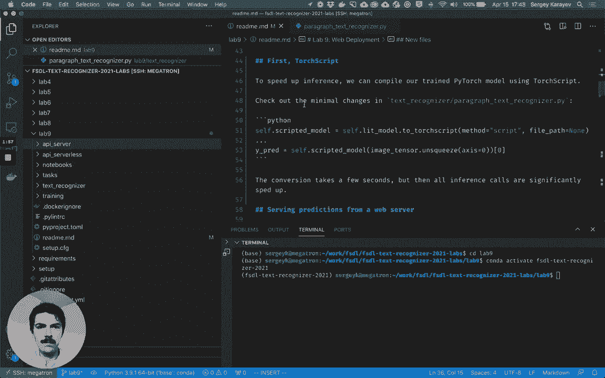
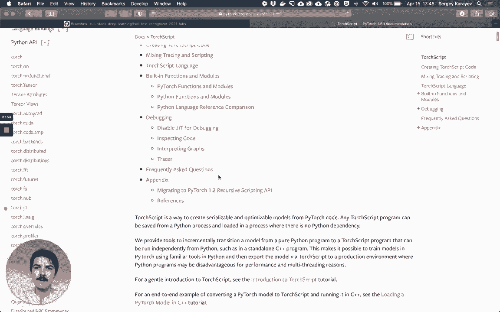
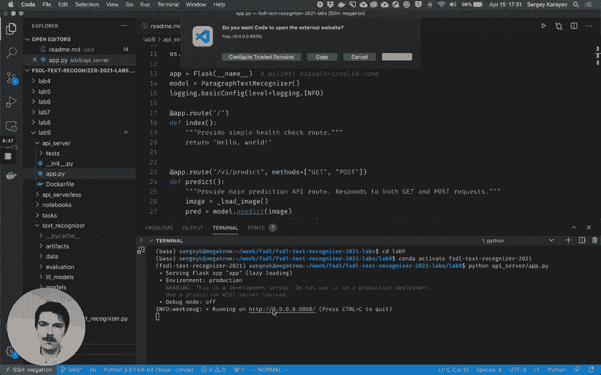
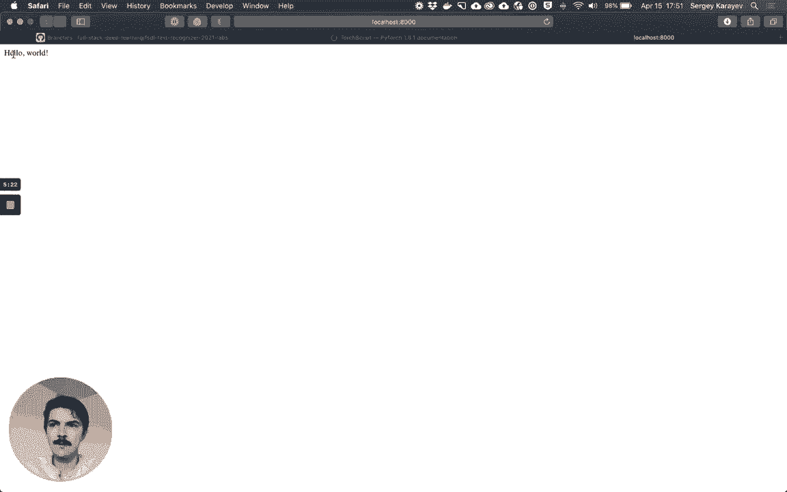
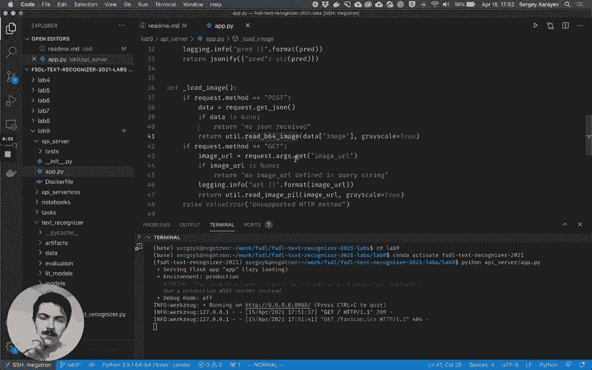
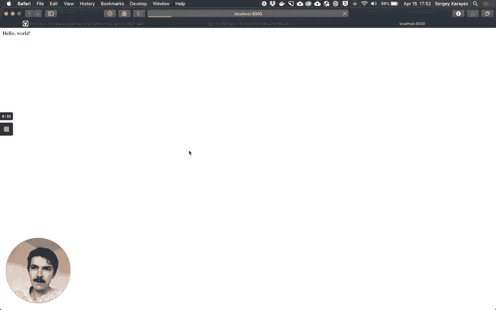
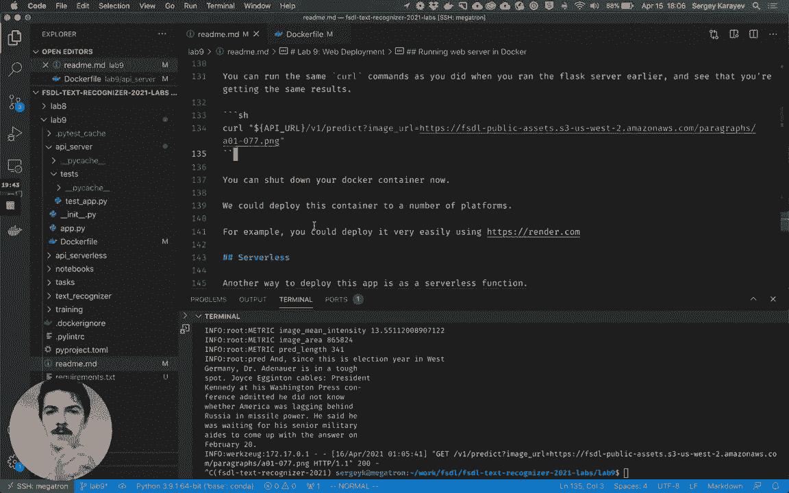
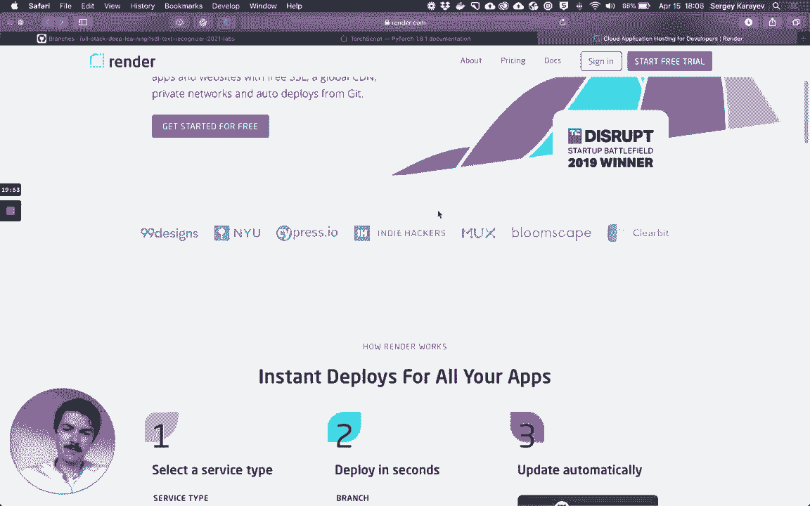
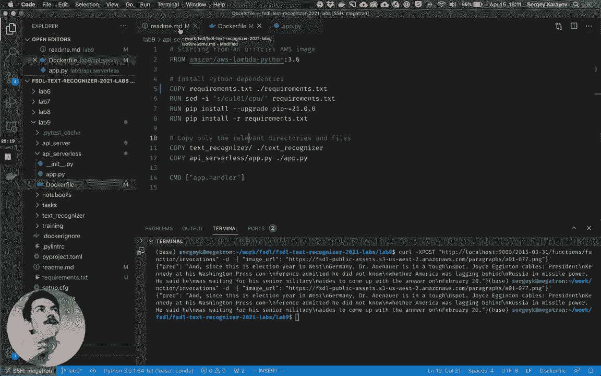

# 25：【Lab9】Web 部署 🚀

在本节课中，我们将学习如何将 Lab 8 中开发的段落文本识别模型进行 Web 部署。我们将通过 TorchScript 加速模型推理，将其封装为 Web 应用，并最终打包为 Docker 容器，为部署到无服务器函数（如 AWS Lambda）做好准备。

## 准备工作

在开始之前，请确保完成以下准备工作：



以下是具体步骤：
*   更新到最新的实验代码库：`git pull`。
*   激活 `fsdl-text-recognizer-2021` 环境。
*   安装本实验所需的最新 Python 依赖包。

本实验新增了许多文件，主要集中在 `api/` 目录下，包括 `api/server` 和 `api/serverless`。



## 使用 TorchScript 加速推理 🔥

上一节我们完成了准备工作，本节中我们来看看如何加速模型推理。

我们目前拥有一个在 Lab 8 中训练好的 PyTorch 模型。为了加速推理，我们可以使用 **TorchScript**。

TorchScript 的本质是将动态定义的 PyTorch 代码编译成静态定义的格式，并利用更快的 C++ 前端路径执行。它最初是 Caffe2 项目的扩展，后与 PyTorch 项目合并。这能显著提升推理速度，而所需的代码改动非常小。

所有改动都集中在 `text_recognizer/paragraph_text_recognizer.py` 文件中。核心步骤如下：

以下是关键代码修改：
```python
# 将 Lightning 模型转换为 TorchScript
self.model = self.model.to_torchscript()
# 设置为评估模式
self.model.eval()
# 进行推理时，像使用原模型一样使用脚本化模型
prediction = self.model(input_tensor)
```

只需添加几行代码。别忘了将模型设置为评估模式（`eval`），然后转换为 TorchScript。进行推理时，可以像使用原始模型一样使用脚本化模型。如果需要进行大量推理调用，这个步骤是值得的。我们也可以将脚本化模型保存到磁盘。





## 构建 Flask Web 服务器 🌐

上一节我们介绍了如何加速模型，本节中我们来看看如何构建一个 Web 服务。

我们将使用 Flask 库来搭建一个 Web 服务器并提供预测服务。Flask 是 Python 中标准的 Web 服务器库。在实际生产部署中，可能会选择更现代的 FastAPI，它支持异步和类型提示，性能可能更高。但 Flask 作为行业标准之一，足以满足本实验的需求。





运行服务器的主文件是 `api/server/app.py`。它是一个 Flask Web 服务器，用于提供段落文本识别预测。

以下是该应用的核心结构：
*   **导入与初始化**：导入 Flask，初始化应用和模型，并设置日志。
*   **路由**：通过装饰器定义 URL 端点。
    *   `@app.route(‘/‘)`：根路径，返回 “Hello World”。
    *   `@app.route(‘/v1/predict‘)`：预测路径，同时支持 GET 和 POST 请求。这是版本化 API 的良好实践。
*   **预测逻辑**：
    *   加载图像（POST 请求从 JSON 中读取 base64 编码图像；GET 请求从 URL 查询参数 `image_url` 读取）。
    *   使用模型进行预测。
    *   收集并打印统计信息。
    *   将预测结果以字符串形式返回。

启动服务器后，我们可以通过另一个终端标签页发送请求进行测试。

以下是发送请求的示例命令：
```bash
# 发送 POST 请求（base64 图像）
cat tests/support/example_image_base64.txt | curl -X POST -H “Content-Type: application/json“ -d @- http://localhost:8000/v1/predict

# 发送 GET 请求（图像 URL）
curl “http://localhost:8000/v1/predict?image_url=https://example.com/image.jpg“
```

两种方式都很常见，同时支持它们会很有用。测试完成后，可以按 `Ctrl+C` 关闭服务器。

我们还可以为 Web 服务器编写测试，确保其按预期工作。测试文件位于 `api/server/` 目录下，可以像测试其他代码一样运行它们。

## 使用 Docker 容器化应用 📦

上一节我们构建了本地 Web 服务，本节中我们来看看如何将其标准化部署。

我们现在已经可以部署应用了。但为了确保生产环境的一致性并简化部署，我们将应用及其所有依赖打包到一个 **Docker** 镜像中。Docker 提供了一种轻量级、快速的虚拟化方式。

首先，将仅用于生产环境的依赖复制到 `requirements.txt` 中。然后，使用 `api/server/Dockerfile` 来构建镜像。

以下是构建和运行 Docker 镜像的命令：
```bash
# 构建 Docker 镜像
docker build -t text-recognizer-api-server -f api/server/Dockerfile .

# 运行 Docker 容器
docker run -p 8000:8000 -it --rm text-recognizer-api-server
```

`Dockerfile` 基于官方的 Python 3.6 镜像，执行了以下步骤：安装系统依赖、设置工作目录、安装 Python 依赖（将 CUDA 版本的 PyTorch 替换为 CPU 版本以减小镜像）、复制应用代码、暴露端口、设置环境变量，并指定容器启动命令。

Docker 使用层缓存机制。将代码复制步骤放在依赖安装步骤之后，可以充分利用缓存，加快后续构建速度。

运行容器后，我们可以使用与之前完全相同的 `curl` 命令来测试 API，因为我们已经将容器的 8000 端口映射到了本地主机的 8000 端口。

拥有这个 Dockerfile 后，我们就可以将应用部署到多种平台，例如 **Render.com**，只需几分钟即可完成。

## 准备无服务器函数部署 (AWS Lambda) ⚡

上一节我们将应用打包成了容器，本节中我们来看看另一种流行的部署方式。





除了作为常驻 Web 服务器运行，我们还可以将应用部署为 **无服务器函数**。AWS、GCP 和 Azure 都支持这种部署方式。这里我们将以 AWS Lambda 为目标。

相关代码位于 `api/serverless/` 目录。`app.py` 文件的结构与 Flask 应用类似，但遵循 Lambda 的规范。

以下是 Lambda 处理函数的核心逻辑：
```python
def handler(event, context):
    # 从 event 中获取 image_url
    image_url = event.get(‘image_url‘)
    # 读取图像并进行预测
    prediction = model.predict(image_url)
    # 返回结果
    return {‘prediction‘: prediction}
```

我们在模块级别加载模型，这样每次函数调用时都可以复用。`handler` 方法是 Lambda 的入口点，它接收 `event` 和 `context` 参数。我们从 `event` 中获取图像 URL，进行预测，然后返回结果。

`api/serverless/Dockerfile` 基于 AWS 提供的官方 Python 3.6 Lambda 镜像构建，安装依赖的方式与之前类似。最后，它指定启动命令为 `app.handler`。

构建并运行此 Docker 镜像后，我们可以使用一个特定的 `curl` 命令来本地测试 Lambda 函数。

以下是本地测试 Lambda 容器的命令：
```bash
# 构建 Lambda Docker 镜像
docker build -t text-recognizer-lambda -f api/serverless/Dockerfile .

# 本地运行 Lambda 容器（使用 AWS 提供的运行时接口模拟器）
docker run -p 9000:8080 -it --rm text-recognizer-lambda

# 在另一个终端发送测试请求
curl -X POST “http://localhost:9000/2015-03-31/functions/function/invocations“ -d ‘{“image_url“:“https://example.com/image.jpg“}‘
```

Lambda Docker 镜像大小最多可达 10GB，足以容纳许多大型模型。我们可以轻松地将其与 AWS 服务集成，例如，配置为当图像上传到 S3 时自动触发 Lambda 执行，或者在其前面放置一个轻量级的 API 网关（如 Amazon API Gateway）以提供 RESTful 接口。我们将在下一个实验中设置基本的监控。

## 总结

本节课中我们一起学习了完整的 Web 部署流程。

我们首先使用 **TorchScript** 加速了训练好的模型。接着，我们使用 **Flask** 构建了一个简单的 Web 服务器，并通过 `curl` 命令本地测试了其 API。然后，我们创建了一个 **Dockerfile**，将整个应用及其依赖打包成容器镜像，实现了环境标准化。最后，我们调整了应用代码和 Dockerfile，为部署到 **AWS Lambda** 无服务器平台做好了准备。



通过本实验，你掌握了将机器学习模型从本地开发推向可部署的 Web 服务的关键步骤。在接下来的实验中，我们将实际完成云端部署。