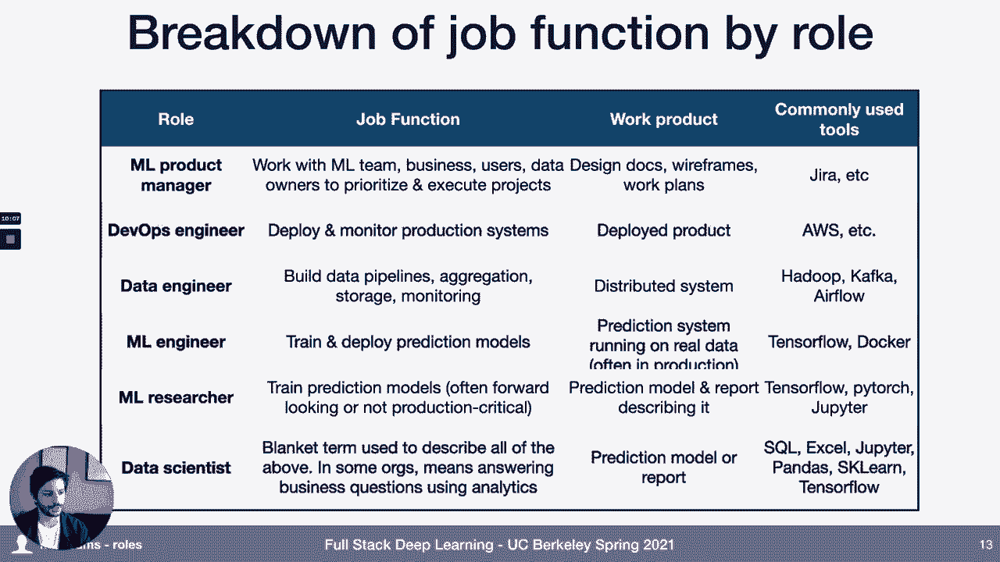
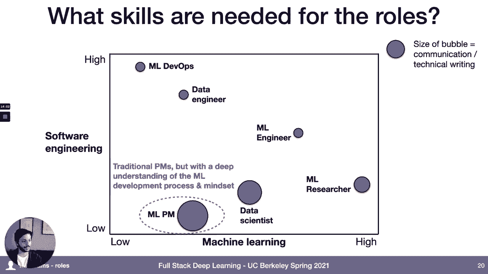
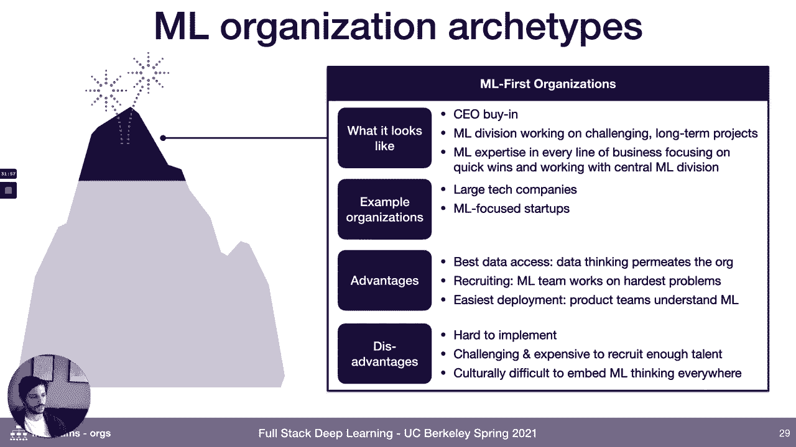
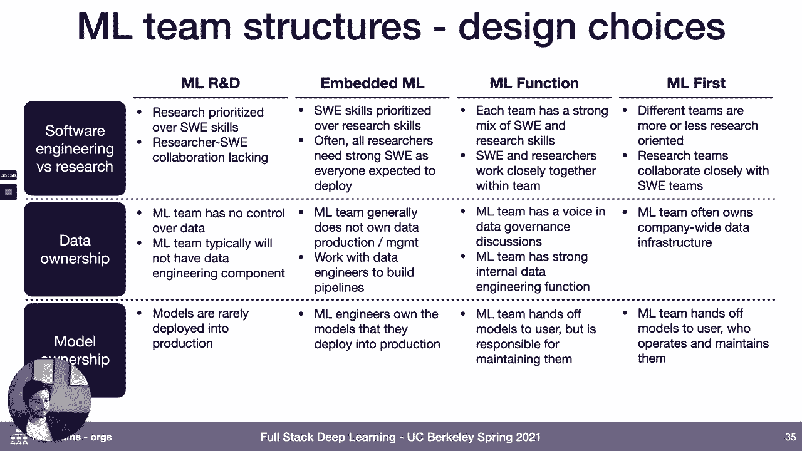
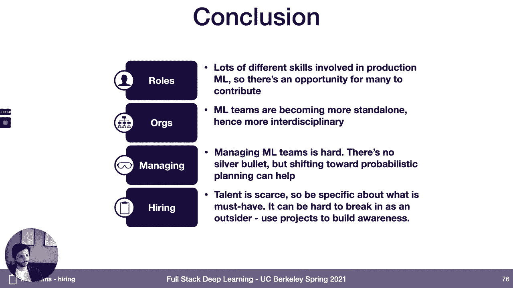

# 27：L13 机器学习团队管理 🧠

在本节课中，我们将要学习如何构建和管理一个高效的机器学习团队。我们将探讨团队中的不同角色、团队在组织中的定位、管理机器学习团队的特殊挑战，以及招聘机器学习人才的策略。

---

## 🤔 为什么需要讨论机器学习团队？

为什么我们要将机器学习团队作为本课程的一部分来讨论？这与构建可工作的机器学习系统有什么关系？

管理任何技术团队都具有挑战性。招聘优秀人才、管理团队并促进其成长、确保团队产出符合预期、做出明智的长期技术决策、管理技术债务以及应对领导的期望，这些对于任何技术团队来说都是难题。

然而，机器学习为这些挑战增加了额外的复杂性：
*   机器学习人才通常昂贵且稀缺。
*   需要多种不同的角色协同工作才能使机器学习项目成功。
*   机器学习项目通常具有很高的不确定性，使得管理产出更加困难。
*   机器学习领域发展迅速，技术债务问题尤为突出。
*   在许多组织中，领导层可能并不真正理解人工智能及其与常规软件开发的差异，这使管理工作更具挑战性。

即使你目前不管理团队，了解这些内容也能帮助你理解管理者如何构建和管理机器学习团队。此外，本课中的许多建议也旨在帮助你如何在机器学习领域找到工作。

---

## 👥 机器学习团队中的角色

首先，我们将介绍机器学习组织中存在的不同角色，以及每个角色所需的技能。

以下是机器学习项目中常见的一些角色：
*   **机器学习产品经理**
*   **DevOps工程师**
*   **数据工程师**
*   **机器学习工程师**
*   **机器学习研究员**
*   **数据科学家**

你可能会问，这些角色之间有什么区别？它们如何协同工作来构建系统？

以下是每个角色的简要说明：
*   **机器学习产品经理**：负责与机器学习团队合作，帮助确定项目优先级并推动执行。他们的工作成果通常是设计文档、线框图和项目计划。
*   **DevOps工程师**：负责部署和监控生产系统。他们的工作成果是最终部署的机器学习系统。
*   **数据工程师**：负责构建数据管道，包括数据的聚合、存储和监控，这些数据用于创建机器学习系统。他们本质上是在构建分布式系统。
*   **机器学习工程师**：通常负责训练和部署预测模型本身。他们的工作成果是在生产环境中处理真实数据的预测系统。他们不仅使用TensorFlow等框架，也使用Docker等工具来将系统产品化。
*   **机器学习研究员**：也训练预测模型，但这些模型通常更具前瞻性、探索性，或与机器学习工程师紧密合作将其产品化。他们产出一个模型和一份描述该模型的报告，但通常不负责部署到生产环境。
*   **数据科学家**：这是一个涵盖性术语。在某些组织中，它可以指代上述任何角色；而在另一些组织中，它可能更像商业分析师，通过运行SQL查询来制作仪表板，回答关键业务问题。因此，看到这个术语时需要深入了解其在特定组织中的具体含义。

---

### 📊 不同角色所需的技能组合

接下来，我们来看看这些不同角色所需的技能组合。我们可以从两个维度来考虑：**软件工程技能**和**机器学习专业知识**。

以下是不同角色在这两个维度上的大致定位：
*   **ML DevOps工程师**：需要非常高的软件工程技能，对机器学习只需基本了解。他们通常来自传统的软件工程背景。
*   **数据工程师**：需要很高的软件工程技能，并开始需要一些机器学习基础知识，因为机器学习团队是他们重要的“客户”。
*   **机器学习工程师**：位于中间，既需要大量的机器学习技能和经验，也需要扎实的软件工程基础。这是比较罕见的组合，通常来自有软件工程经验并自学机器学习的人，或拥有理工科博士学位并接受了软件工程训练的人。
*   **机器学习研究员**：他们是机器学习专家，通常拥有计算机科学或统计学的硕士或博士学位，或在工业研究项目中受过训练。
*   **数据科学家**：背景非常广泛，从本科数据科学专业到物理学博士都有可能。
*   **机器学习产品经理**：这是一个新兴角色，通常来自传统产品管理背景，但对机器学习流程有较多接触；或者是从机器学习领域转行而来。

在初创公司中，通常更倾向于雇佣能做多种事情的“通才”角色，比如机器学习工程师。专门的MLPM或ML研究员角色在初创公司中较少见，除非是自动驾驶等以机器学习为核心的公司。DevOps角色在初创公司中也相对少见，因为随着产品和工程团队复杂度的增加，这个角色才变得关键。数据工程则是初创公司应该尽早投资的领域。

---

## 🏢 机器学习团队在组织中的定位

上一节我们介绍了机器学习团队中的不同角色，本节中我们来看看机器学习团队本身在更广泛的组织环境中是如何定位的。

通过与许多从业者交流，我们发现目前对于如何构建机器学习团队的最佳结构尚未达成共识。不同的组织有不同的实践，不同的结构似乎适用于不同类型的组织。本节的目标是根据我们观察到的情况，提供一个基于组织成熟度的最佳实践分类。

我们可以用“攀登机器学习组织之山”这个比喻来描述不同阶段。

### 🏔️ 山脚：初生的机器学习组织
*   **特征**：组织内无人或仅有少数人以临时方式从事机器学习工作，内部机器学习专业知识很少。
*   **典型组织**：硅谷科技公司和财富500强公司之外的大多数中小型企业，尤其是在技术不那么前沿的行业。
*   **优势**：对于希望加入此类组织的人来说，可能存在很多容易实现的目标，可以产生巨大影响。
*   **劣势**：对机器学习项目的支持很少，组织可能不相信机器学习，招聘和留住优秀人才困难。

### 🧗 山腰阶段一：机器学习研发团队
*   **特征**：公司对机器学习感到好奇，开始进行一些研发，有一些概念验证项目。机器学习工作通常集中在一个较小的团队中，隶属于研发部门。
*   **典型组织**：一些采用技术较慢的大型行业，如石油天然气、制造业、电信公司。
*   **优势**：可以雇佣经验丰富的研究员；团队有 mandate 去研究更长期、可能带来更大收益的业务重点。
*   **劣势**：从组织其他部门获取数据可能非常困难；这种模式下的努力很少能转化为真正的商业价值。

### 🧗 山腰阶段二：嵌入产品团队的机器学习专家
*   **特征**：有机器学习背景的个人被嵌入到不同的业务部门或产品线中，他们通常向同一个工程负责人汇报。
*   **典型组织**：许多中小型或高增长的软件技术初创公司，以及金融科技公司。
*   **优势**：机器学习专家的改进很可能带来真正的商业价值；想法与实际产品改进之间有紧密的反馈循环。
*   **劣势**：难以招聘和培养顶尖人才；获取计算资源可能滞后；机器学习项目周期（高风险、不确定性）难以融入工程冲刺和规划周期。

### 🧗 山腰阶段三：独立的机器学习职能部门
*   **特征**：一个集中化的机器学习组织，可能向高级领导层甚至CEO汇报。拥有MLPM、研究员和工程师，与内部客户合作构建机器学习产品。
*   **典型组织**：大型金融服务公司、大银行，以及谷歌、Facebook、Uber之外的一些大型科技公司。
*   **优势**：创建了机器学习卓越中心，人才密度高；由于汇报层级高，可以克服数据获取等障碍；可以投资于集中化的工具和基础设施。
*   **劣势**：机器学习专家不嵌入产品团队，需要将模型移交给实际使用的团队，这可能具有挑战性；反馈周期可能更长。

### 🏔️ 山顶：机器学习优先的组织
*   **特征**：整个组织都坚信机器学习的重要性。既有中央机器学习部门负责长期项目，也有机器学习专家嵌入各业务线，负责快速迭代。
*   **典型组织**：谷歌、Facebook、Uber等大型科技公司，以及一些以机器学习为核心的初创公司。
*   **优势**：数据获取便利；有利于招聘；产品团队具备机器学习思维；有团队投资于部署所需的基础设施。
*   **劣势**：实施难度大；难以招募足够的人才；在文化上确保组织每个人都具备必要的机器学习理解水平具有挑战性。

---

### ⚙️ 机器学习团队的结构设计选择

在构建团队结构时，机器学习组织需要做出一些设计选择：
*   **软件工程与研究的平衡**：团队在多大程度上负责构建和集成软件，还是仅仅交付模型？
*   **数据所有权**：团队对数据收集、存储、标注和管道构建有多少控制权？
*   **模型所有权**：团队是否负责将模型部署到生产环境？谁负责维护生产中的模型？

随着组织在“山”上攀登，专业化程度越来越高，机器学习团队对数据和模型的控制权也越来越大。

---

## 🧭 管理机器学习团队的特殊挑战

管理机器学习团队比管理传统软件团队更具挑战性，核心原因在于：**通常很难提前判断机器学习任务的难易程度**。

机器学习项目的进展往往是非线性的，常见的情况是项目在数周甚至更长时间内完全停滞，没有任何可衡量的性能改进。因此，规划项目时间线极其困难。

此外，机器学习团队需要与工程团队协作，但这两个领域之间往往存在文化差异（不同的价值观、背景、目标和规范）。在有毒的文化中，双方可能互不尊重。

另一个挑战是，在许多组织中，领导者并不真正理解机器学习，他们可能不知道什么是可行的，或者对时间线的不确定性缺乏认识。

---

### ✅ 管理机器学习团队的最佳实践

虽然没有万能解决方案，但以下是一些来自优秀管理者的见解：

**1. 采用概率性项目规划**
不要使用传统的瀑布式规划，而是为机器学习项目分配成功概率。将项目视为一个投资组合，避免有单一关键路径的研究项目。可以并行尝试多种方法，或在团队内部进行友好的创意竞赛。

**2. 基于投入而非结果衡量成功**
在进行绩效管理时，重要的是评估团队成员执行尝试的好坏，而不是纠结于谁的想法最终成功了。在长期内，做出有效成果固然重要，但在单个项目上，执行过程是关键衡量标准。

**3. 促进研究员与工程师紧密合作**
常见的失败模式是过分强调工程而忽视研究，或者相反。两者需要紧密协作，平衡发展。

**4. 快速构建端到端可工作的原型**
这不仅能提高任务成功率，还能更好地向领导层沟通进展，因为有明确的指标和可展示的成果。

**5. 教育组织领导层**
机器学习团队有责任帮助领导层理解机器学习时间线的不确定性。避免过度乐观、炒作式的沟通，应清晰地传达风险和不确定性。

---

## 💼 机器学习人才招聘

最后，我们来谈谈招聘。我们将从招聘方和求职方两个角度来探讨。

### 📈 AI人才缺口
目前，机器学习人才市场供需紧张。据不同估计，全球具备相关技能的人才数量在数万到数十万之间，而全球软件开发者数量高达数千万。这导致了激烈的人才竞争，顶尖研究员的薪酬可达七位数。

### 🎯 如何寻找机器学习人才（招聘方视角）
对于核心的机器学习工程师和研究员角色，常见的错误是寻找“全能独角兽”——要求候选人同时具备顶尖的软件工程和机器学习研究能力。

更有效的方法是：
*   **招聘路径多样化**：主要招聘软件工程技能强、有机器学习学习意愿的人进行培养；或招聘更多有机器学习背景的初级人才。
*   **明确具体需求**：并非每个机器学习工程师都需要所有技能。
*   **针对研究员角色**：更看重**论文质量**而非数量；寻找研究**重要问题**的研究员；考虑有业界经验的研究员；关注物理、统计等相邻领域的顶尖人才；考虑非传统学术背景的人才。

**人才来源**：除了标准渠道，可以关注顶级会议论文，联系感兴趣论文的第一作者；寻找优秀的论文复现代码作者；在机器学习研究会议上进行招聘。

### 🎣 如何吸引顶尖人才
顶尖人才通常看重：
*   使用前沿工具和技术。
*   在快速发展的领域构建技能和知识。
*   与优秀的人共事。
*   处理有趣的数据集。
*   从事有实际影响力的工作。

相应地，公司可以：
*   投资前沿项目并公开成果（论文、博客）。
*   建立以学习为导向的团队文化（阅读小组、学习日、会议预算）。
*   帮助团队成员建立个人品牌（发表博客、论文）。
*   展示独特且有技术挑战的数据集。
*   强调公司使命和机器学习能带来的巨大影响。

### 👨💻 机器学习面试流程
机器学习面试流程不如软件工程面试那样标准化。常见的评估类型包括：
*   背景和文化契合度面试。
*   白板编码/结对编程。
*   **结对调试**：查看有bug的机器学习代码并修复。
*   数学谜题（如线性代数）。
*   带回家项目。
*   **应用机器学习评估**：针对一个问题，解释如何用机器学习解决。
*   深入探讨过往项目。
*   机器学习理论问题（如偏差-方差权衡）。

### 🔍 如何找到机器学习工作（求职者视角）
除了标准渠道，可以关注机器学习研究会议。由于人才竞争激烈，公司对直接联系持更开放的态度。

**如何脱颖而出**：
*   **具备基本的软件工程技能**和相关工作经验。
*   **展示对机器学习的兴趣和知识**：撰写综合研究领域的博客，或解释新兴主题。
*   **证明完成机器学习项目的能力**：拥有个人项目、课程项目或论文复现。
*   **对于研究导向**：赢得Kaggle比赛、发表论文以证明创造性思维。

**面试准备**：
*   复习机器学习理论和基础算法。
*   同时准备常规的软件工程面试，因为许多公司也会测试这方面的能力。

---

## 📝 总结

在本节课中，我们一起学习了构建和管理机器学习团队的各个方面。

**关键要点总结**：
1.  **角色多样性**：生产级机器学习涉及多种技能，贡献方式多样。你可以在软件工程或机器学习任一维度深入，也可以两者平衡，都能找到用武之地。
2.  **组织定位**：机器学习团队在组织中的结构没有唯一正确答案，但存在一个从“初生”到“机器学习优先”的成熟度演进路径。
3.  **管理挑战**：管理机器学习团队的核心挑战在于项目的不确定性和非线性进展。采用概率性规划、基于投入衡量、促进研-工协作是有效实践。
4.  **招聘策略**：市场人才竞争激烈。招聘方应明确需求、多样化招聘路径。求职者应通过项目（如本课程项目）来证明自己的能力，这是进入该领域的最佳途径之一。

希望本教程能帮助你更好地理解机器学习团队的运作，并为你的职业发展提供指导。