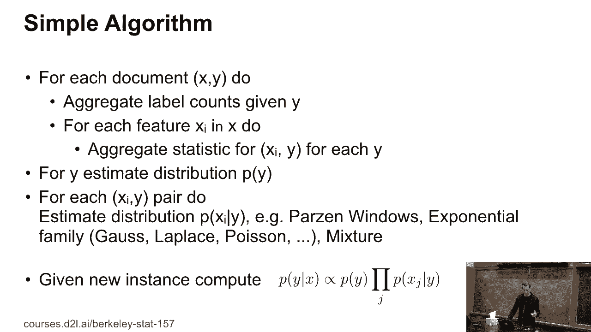
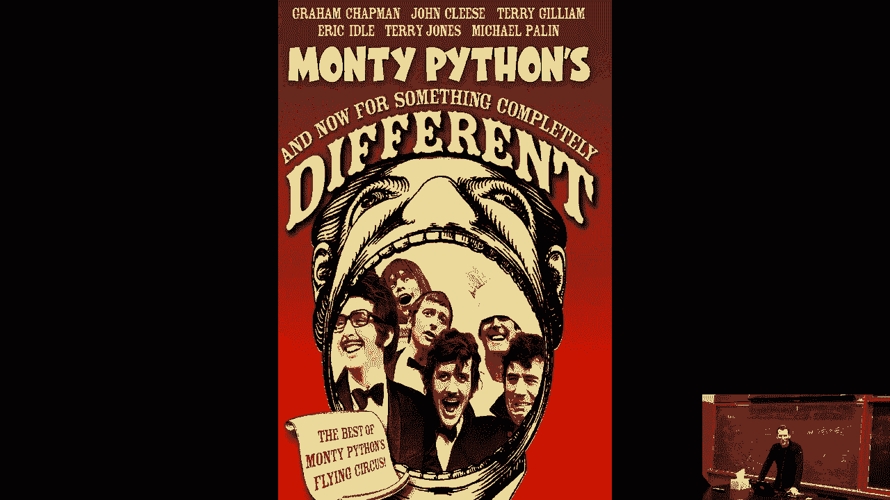

# P10：10. L2_5 Naive Bayes - Python小能 - BV1CB4y1U7P6

 And stuff。 So， naive base。 I guess， OK， who's heard of naive base before？

 So the reason why I'm covering it is twofold。 First of all， it's a ridiculously simple algorithm。 Secondly， to also demonstrate that you can use the tools， like these deep learning frameworks。 to do other things than just neural networks。 OK。 So what's the key assumption in naive base？ Well。 I'm assuming that P of word one， two of word in， given spam。

 factorizes nicely into P of W i given spam。 OK。 Straight forward。 And so then。 if I make this assumption in P of spam， given the words， my base rule is just。 given proportional to P of spam， times the product。 Right？ The only thing missing， and that's。 why we have the proportional， is the denominator。 And I'm going to be lazy and recompute the denominator。

 afterwards by just evaluating this right inside P of spam， times the product， for both spam and ham。 OK。 Actually， let's see this。 OK。 So what we need to do， therefore， in order。 to train our naive base classifier， are two very simple things。 The first thing is we need to compute P of spam。 Well， that's easy。

 I just look at all the emails that I'm getting。 I count how many spam， how many ham I have。 That's a pretty good estimate of P of spam。 And then， I care about P of W i given spam。 So I just look over the number of times the word， biagra occurs in spam and in ham emails。 And unless you're doing biological research， chances are that's a pretty significant feature。

 So the problem is if you have a naive base， plan of M-fulfurger， the assumption。 is that a lot of those things will be of equal probability。 In other words。 those phrases make absolutely no sense whatsoever。 But since we're looking at individual word probability， as well， you get nonsense。

 So that should already tell you that maybe naive base， is a little bit too naive。 So here's the graphical model。 But if you have never seen one， this is really just what。 depends on what is called the director graphical model， spam， and then the various words。 given spam。 So the assumption is that our friendly Nigerian spammer。

 sits at the keyboard and has a button for every word。 or that he will generate with a certain probability。 And the emails make no sense。 OK。 Have you ever seen this in practice？ Well， at some point， there was a spam attack。 which would have a completely spammy payload。 And then in the last line and the first line。

 there would be random keywords that were not very spammy at all。 Just sprinkled into it。 And the goal of this was to utterly confuse， the naive base spam filter and make the email go through。 And for a while， it succeeded because basically that spam， filter was utterly naive。 By the way。 obviously， statisticians， don't like drawing diagrams like the one on the left。

 It's tedious to draw those circles。 So they've invented their own for loop。 And that's the one on the right。 It's called a plate。 So that just means for all i going from one to end， do this。 Things get a bit more interesting。 if you have two for loops that are interlocking。 And then you can do things in stats。

 that aren't so easy to do on a computer。 Unfortunately， if you need to code it up。 you then need to bite the bullet and deal with this。 So for instance， for recommended systems。 that you have for all users， for all movies。 But then you really only look at the interactions。 between users and movies。 Anyway， this is just a short detour。

 Take a graphical models class if you're interested in this。 It's pretty cool stuff that you can do。 So what do we have？ Well， we have data like emails， labels， and maybe images。 And we need to get those probability distributions。 Mind you， this grows oversimplification。 This is just the header of an email。 The text starts at the very bottom。

 Everything else up there is essentially， metadata of what happened to this email。 as it was sent from the sender until it， got to your mail host wherever that may be。 And all of this information is useful to figure out， whether the email is legitimate。 So how do we build our very naive， naive base classifier？ Well。

 we want to get the feature probability。 In this case， I'm only going to care about binary。 P of xi equals-- is true given y。 So I just count the number of times。 that this holds divided by the total number of occurrences。 That gives me the probability for a feature i。 And I do that for all i。

 I also need the spam probability， and then I'm done。 Sounds good。 Can you see a rather fundamental problem with this。 besides the fact that this assumption is horrible？ Where could this go wrong？ Yes？

 If you have no occurrences of a particular feature。 Exactly。 So if you have no occurrence of a particular feature， then you'll get the done in Kruger effect。 the cruel end， of the naive base classifier， where the classifier。 will be utterly confident in something。 And it'll just say one or the other。

 Things get worse if you have one feature that always occurs， and that never occurred。 And then on the test data， you have the reverse。 And then you just get not a number。 So you're absolutely right。 This is when things can go horribly wrong。 So what people have done。 therefore， is they've just added the pseudo count to everything。

 They've just incremented all the numbers by one。 This is called Laplace smoothing。 What is interesting in this？ There is a lot of base in non-parametrics。 Chinese Western processes。 Dirichlet processes， and so on。 So take a class of two impitments， and he will cover this in。 I hope， a lot of detail。 So it's even a process named after him， the Pittman-Yor process。 Yep。

 We are going to barely scratch the surface。 Now， as said， here's a very simple algorithm。 For all the documents， aggregate the label counts， aggregate the various counts。 and then we'll look at that in code。

 Don't worry。 But before we do that， now for something completely different。

 And you wonder why that？ So this slide seems to be utterly unrelated。 to what I just told you before。 Why am I all of a sudden diving deep into floating point， numbers。 exponents， mantises， and other things？ Well， the thing is， so floating point numbers have--。 that's why they're called floating point numbers。 They have basically some part that。

 specifies precisely what the value is。 And then you have another term that。 specifies precisely what the order of magnitude is， the largest exponent of form is the mantissa。 And then， OK， you need one extra bit for the sign， but that's about it。 So if you have doubles。 then you have 64-bit， and life is good， and usually you don't get numerical level flows or underflows。

 If you have floats， you have 32-bit， and you maintain any exponent shrink。 That's still OK。 If you have 16-bit， things get really awful。 And then if you go to 8 and 4， and explain to you。 in the next slide why this matters， you need to do a lot of tricks to make it work。 OK。 So what are you supposed to do in this case？ And by the way， so the place where it occurs， is。

 for instance， if you're taking products of probabilities。 Each probability might look rather innocuous。 Let's say it's 50%。 And then all of a sudden。 you get 100 of those numbers， and then you get 2 to the minus 100， which is about 10。 to the minus 30。 So things get awful very quickly。

 And if you're adding things and normalizing and so on， you will get overflows， underflows。 not a number， and your code will not run。 So the culprit is that we are basically。 stuffing all the information into the exponent， and the matisse is pretty much unused。 So in other words， the trade-off， when the double storage format was defined。

 is the wrong one for dealing with probabilities。 So what are we supposed to do？ Well。 it's actually not that hard。 We just take logarithms。 Now all of a sudden。 multiplications become additions。 So everything's great。 The only thing we need to do is。 because when you add， probabilities， you need to exponentiate things， and then take the log again。

 then things could go bad。 So let me quickly write on the whiteboard what the issue is。 We want to compute log of e to the a plus e to the b。 Now。 let's say a and b are in the order of about 100。 This will give us horrible numerical overflow。 so we get inf， and inf here， and log of inf is inf， so things went badly wrong。

 But what you can do is， you can immediately， see that this is the same thing as a plus the log。 of e to the a minus a。 So that's 0 plus e to the b minus a。 This is potentially much better。 It's much better if b is less than a。 If b is larger than a， I can still get my overflow here。 and everything goes wrong。 So what I simply do is， I take the maximum of b and a， pull that out。

 and I subtract it on the inside again。 And this way， everything is numerically stable。 This is not just for deep learning， but also if you're doing graphical models and other things。 be very careful with this。 Otherwise， your code may actually not work。 So why do we care？ Well。 because on GPUs， essentially the speed goes as follows。

 Every time you have the floating point or the numerical， format by a factor of two。 things get twice as fast。 It's not entirely true because then there are also things。 like tensor cores that make things even more effective。 But you can basically think of it this way。 for a given bandwidth constraint， bandwidth budget。 I can pack two or four times as many numbers。

 into the same amount of data that I'm sending into a processor。 And mind you， it actually turns out。 that the amount of silicon goes quadratically， with the amount-- with the number of bits that you need。 So it's almost free to add lower precision operations。 So that's， for instance， why NVIDIA added。 int four on their new Turing GPUs。 Because it almost cost them nothing in terms of silicon。

 And they are probably hoping--， who knows-- yet whether that bit will pay off or not--。 that by adding those operations， you， can add some other--。 you can get an additional speed up by a factor of two。 for-- my guess is probably 1% or 2% larger chips。 And given that。

 you might happily take that speed up of two。 So you'd ask， might there be to figure out。 which algorithms can take advantage of this？ There's still some papers to be written。 OK。 So now that we have this--。

