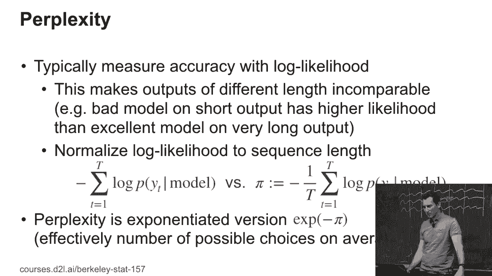
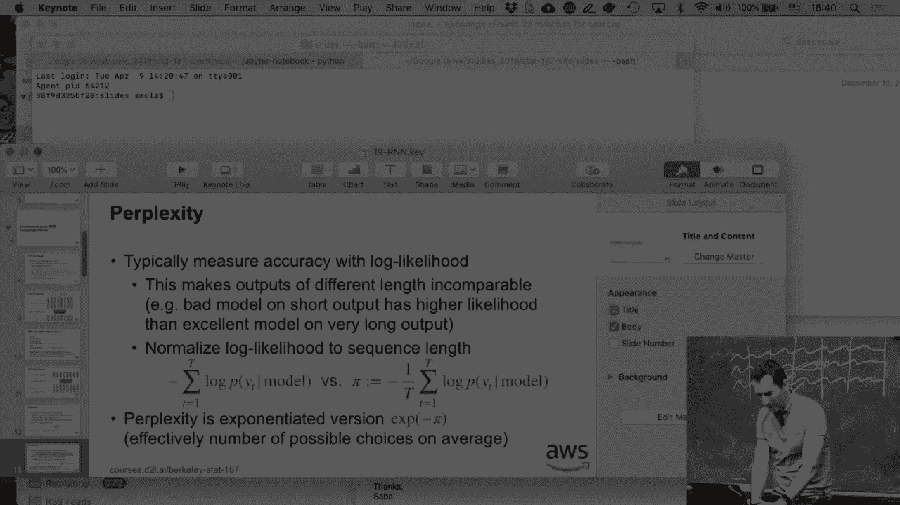
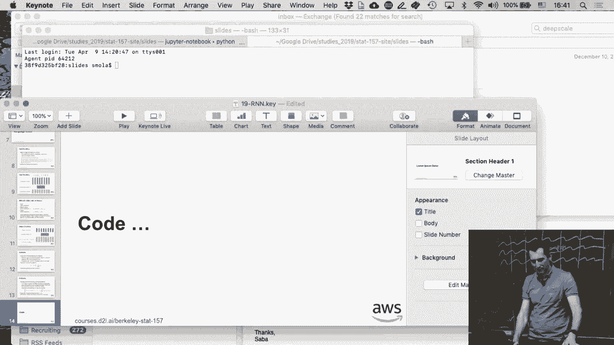

# P100：100. L19_3 RNN Mechanics - Python小能 - BV1CB4y1U7P6

 Okay， so this time we did things a little bit in the converse order， right？

 So we first looked at the code， and now we're looking at the slides。 The point of this was to find out a little bit whether this feels better or worse。 So give me some feedback after this。 So remember what you basically have is we encode the input。 right？ And we basically picked some granularity of words， characters or sub words。

 And then we mapped those to indicator vectors， right？

 So this was exactly the one-hot encoding before。 And then you might go and multiply it by an embedding matrix。 or， you might just feed it directly into your LSTM or RNN or， GRU whatever。 So you basically have some input like the time machine。 every character here goes into its canonical vector。 Then you have some embedding matrix， maybe。

 and then you get some embedded vectors。 And for individual characters， that's not such a big deal。 But once you have words or long as substring sequences， you would probably care。 Just because。 for instance， cats and cats are very similar words。 And you would want to make sure that already through the embedding。

 cat and cats are mapped to something very similar。 And so the RNN with state。 so you have the input vectors， you have the hidden state sequence， right？

 So where we iterate over it。 And then we have the output vector sequence。 And well。 as we saw before， we basically used the output and。 the maximum likelihood decoding that went with it as the input for the next step。 So remember what we did is we basically had this vector， this embedding vector for， the output。

 And then we used maximum likelihood decoding to turn this 43 dimensional。 vector into a character like， for instance， X。 And then we used the character X as the input。 which we then encoded again and， ran it through。 So there are a couple of type conversions that happened there。 Okay， and then for the output， yeah， you get exactly this。 So in the one-hot encoding。

 you just pick the Y-squared in it， but， you might have some other decoding vector。 Why would you care about having a decoding vector？ Rather than just picking the Y-squared in it。 Any ideas？ Okay， would I want to do this for characters？ Probably not， right？

 How about if my vocabulary is of the size 1 million？

 Do I want to decode into a million dimensional vector？ >> That's exactly the right one。 >> That's exactly the issue。 It would cost you a lot of memory， so you would not want to do that。 What you would have is you would probably decode into a thousand， maybe 2000 dimensions。 and then take maximum in a product with some reference， decoding matrix。 Okay， the gradients。

 we already had that， right？ This is exactly the， you don't want your gradients to be too large。 because otherwise things diverge。 And then you just clip to prevent that divergence。 And then， okay。 the last thing that we need， and， you might recall that from a previous homework， perplexity。 So here's the issue why we need to define a new quantity。 Okay。

 so let's say I want to build a language model， and I want to be able to test it both on， let's say。 tweets， and， also in entire books， right？ So a typical tweet is maybe around 200 characters long。 Typical book is maybe 150，000 to 200，000 characters long， right？

 So if I look at the log likelihoods， the log likelihood for the book is invariably going to be a lot worse。 So basically the negative log likelihood therefore a lot larger， then it is for a tweet， right？

 Because I have so many characters that there are so many times where I might not。 exactly estimate things accurately， so even if my language model is very good。 it might not get things overall right。 After all， otherwise I could expect my model to pretty much write a book from scratch。 right？ Well， which you can't， or at least not that particular book with， a high likelihood。

 So what you therefore do is you would go and take the log likelihood and。 normalize it by the sequence length。 After all， what I'm doing is I'm computing the negative log likelihood of。 the next character given the model and what I have， and。 I move through the entire sequence of characters。 And the perplexity of what I simply do is I take that quantity and。

 divide it by the sequence length。 So this is basically the average log likelihood per character。 that I would have for a tweet versus a book。 And all of a sudden tweets and books become a lot more comparable。 Okay， why does anybody have an idea why this is still， giving a little bit of。 why this is still favoring a little bit along sequences？ Okay， anybody else？ Okay， yes？

 >> Because they can contain much more types of information？ >> Yes， so if I have a long sequence。 what I can actually do is， I can use the information that I've seen at the beginning of the sequence to。 predict what's going to happen towards the end。 So for instance， if this book talks about。 I don't know， cameras， then the word camera is much more likely to reoccur。

 So therefore it's a good idea to maybe start tuning my language prediction。 model towards the words that I've seen so far in order to predict the next ones。 And so if you are looking at algorithms for a compression contest and whatever。 they all do stuff like this， that you may not necessarily have the computation to do in practice。

 But if you want to win a competition， you do it。 Now perplexity is just the exponentiated version of that。 It's actually e to the minus that。 The reason is you want to make sure。 actually it's a type of it should be e to the pi。

 because I added the minus doubly。

 That's what happens if you switch signs later。 Okay。 And so this is essentially the number of possible choices that you could have。 So if you're perfect。 then you're going to get e to the zero。 So then that just means with certainty。 know exactly what the next character is。 Perplexity of three， for instance， means that on average。

 I'm not sure between one and three characters that I would want to choose。 Doesn't quite mean one in three characters because I could have some with higher， probability。 some with lower probability， but on average it would be like one in three。 So therefore。 the best perplexity I could ever achieve is a one。 I just mean that I know exactly what comes next。

 Okay。 And that is， [BLANK_AUDIO]。

