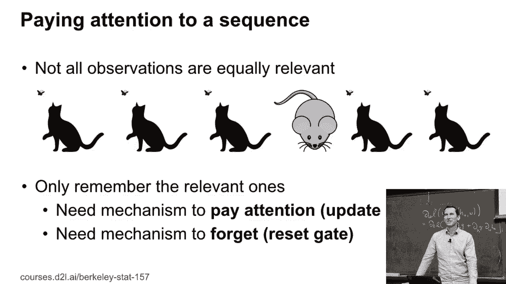
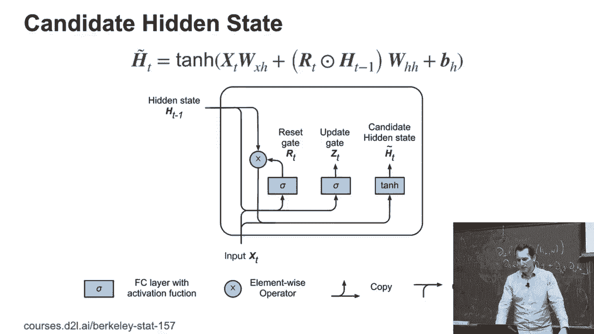
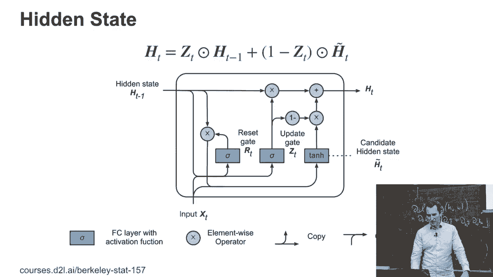
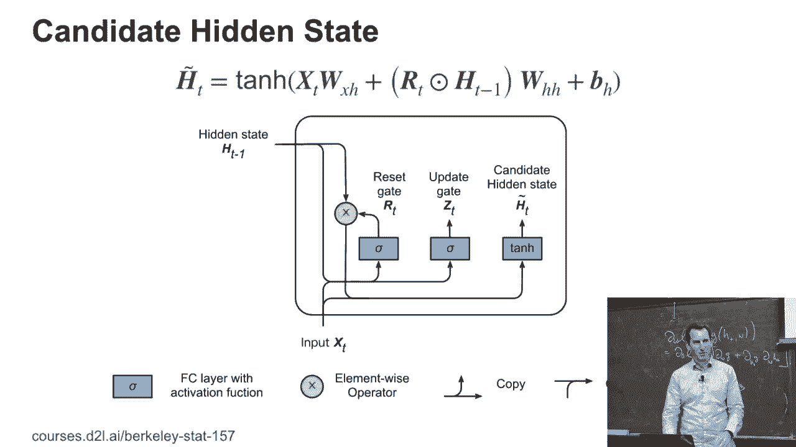
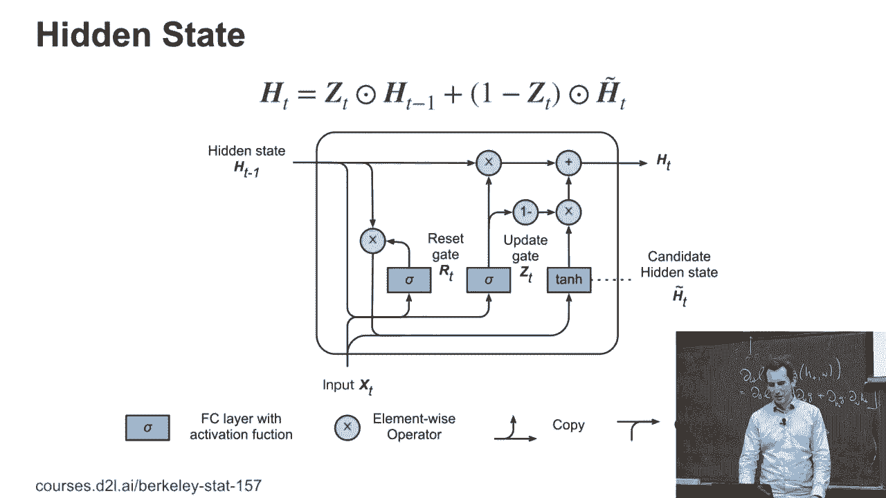
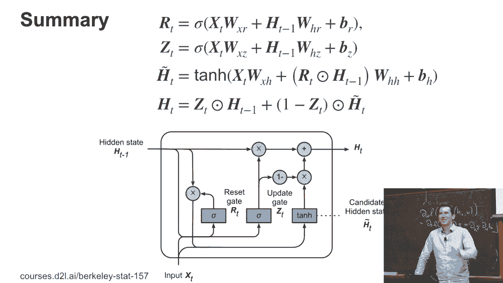
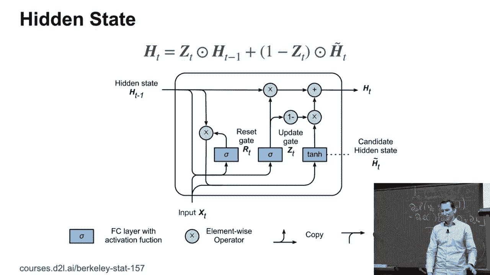
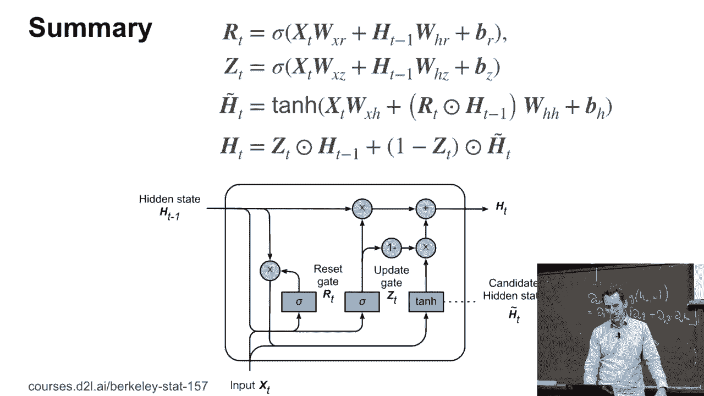

# P103：103. L19_6 门控递归单元（GRU）- Python小能 - BV1CB4y1U7P6

准备好讨论 GRU 了吗？这是我们将遇到的第一个非平凡的递归系统。

实际上，这就是它的直觉。事实上，它发生在 LSTM 之后很久。但动机是希望看看你是否能在减少计算的情况下获得大部分 LSTM 的好处。所以重点是，如果你有一个序列，那么并不是所有的观察值都同样相关。例如，如果我挠头。

这并不太相关。我希望我所讲的会更相关。因此，你可能会决定忘记我挠头的事实，或者它根本不会进入你的记忆，因为，嗯，反正这有什么关系，亚历克斯做什么，重要的是幻灯片上的内容。但因此，你需要两个机制。

你需要一个机制来决定何时关注。因此，基本上是何时更新你的状态。你还需要另一个机制来决定何时忘记。所以这就像是重置门。只有拥有这两个部分，你才能以有意义的方式操控你的状态。例如，如果我有一个机制，阻止我在十步内关注。

然后，我关于隐藏状态的梯度对于输出将直接通过这十个步骤，并且不受任何影响，对吧？因为我基本上保持了变量不变。同时，如果我决定忘记，就像运行 detach 但使用数学方法一样，对吧？

所以，通过忘记隐藏状态来断开梯度，实际上就像断开一样，做同样的事情。好的，这听起来有点抽象，但为什么你可能想要在忘记门中使用注意力的基本功能清晰了吗？

大家都明白了吗？好。那么，我们来看一下。

让我们实际上看看，边走边填充这个内容。所以我有一些隐藏状态，`ht - 1`，还有一些输入`xt`。然后我把这两件事情送到一个尚未定义的重置门和更新门。然后这两者本质上将是输入的线性函数，再加上一些非线性操作。所以这个非线性操作是 sigma。

我将方便地选择这种方式，使得它的值介于零和一之间，这样你知道，我基本上可以开关这些门，对吧？所以，例如，你知道，像正切这样的东西可能会做一些事情，嗯，差不多，但如果我稍微调整一下，它就会。所以这就是重置门和更新门。好的，大家都明白吗？好，行吗？

使用重置和更新机制是否类似于梯度偏移修正适应时间？

我不确定我现在能看到比较校正与重置门和更新门之间的联系。也许，我们可以下次再讨论这个问题。我现在真的没有看到那种联系。是吗？

它们总是像直线连接的，完全连接的吗？非常好的问题。在基本单元中，是的。现在，显而易见的问题是，你知道，如果你有其他东西，比如图像，你会怎么做？

你几乎肯定希望在卷积方面做些聪明的事情，对吧？

我认为有一两篇论文做到了这一点，并且它是有帮助的。如果还有某些数据类型没有做过这种处理，你应该完全写一篇这样的论文。这是一个非常非常深刻的见解，非常好。那么问题基本上是：我们是否总是有完全连接的东西？答案必须是，不。

无论你能否避免它。例如，如果你想关注图像中的某些部分，对吧。那么你基本上可以这样做，假设你有一帧图像。然后我基本上会在这里做一个卷积。那么，好的，我们有了我们的门控。

接下来我们需要的是候选隐藏状态。好的。所以在这个候选隐藏状态中，我做的基本上是计算，知道吗，x 乘以 w。所以基本上是输入与某个线性函数相乘。它是一个矩阵。所以它是输入的某个线性函数。而且我有一个偏置，因为这里每个人都喜欢偏置。

对吧？然后，嗯，我需要获取先前的输入状态。但是现在我正在做的是，我使用重置门来决定我实际上会按多少比例融入先前的输入状态。所以，如果重置门是零，那么我只会使用仅依赖于当前 x_t 和偏置的东西作为我的候选隐藏状态。对吧？换句话说，如果我的重置门是零，我正在重置我的，知道吗？

循环神经网络。如果重置门为一，意味着。我会像之前那样做，而不是其他方式。所以记住，在我们的 RNN 中，我们有一个关于 x 和 w 的线性函数，然后 h 给我们，知道吗？h_t 加一。现在，唯一的不同是，这是一个候选隐藏状态。候选是因为，嗯。

除了重置门之外，我们还需要决定是否真的要更新。所以这是最后一步。

换句话说，我通过仅仅取过去隐藏状态和候选隐藏状态的凸组合来计算我的隐藏状态。所以如果 z_t 为一，这基本意味着我不打算更新，对吗？

因为我只是打算使用 h_t 等于 h_t 减去 1。如果 z_t 为零，那么，嗯，我将完全更新。所以，如果你考虑到其中的偏置，它们是：你知道，z 和 r 都是零。所以如果 r 为零，那么我将重置。

所以我的偏向是，不要过多考虑过去的情况。

另一方面，我的偏好是更新我拥有的内容，而不是完全跳过更新。好的。所以这可能有点多。

让我们总结一下所有的数学。好的。是吗？ >> 这看起来有点像z的残差层什么的。像，为什么我们不能做一些简单的事情，比如直接... >> [听不清]， >> 对， >> [听不清]， >> 好的。 >> [听不清]， >> 所以，首先，残差连接会回来，因为你也可以使用带有残差状态的循环神经网络。

如果你将RNN堆叠成多层，你大多会使用这种方法。我们今天可能有机会讨论这个话题。至于这个 -- 我们会讨论残差单元。实际上，*是的*，你可以设计一个稍微不同的偏置，使得，默认情况下，它根本不会改变隐藏状态。对吧？在某种程度上。

那就默认是这样的，你知道，ht减去1等于ht。对吧。然后，如果我说，zt等于1，实际上就是这样发生的。但我本可以把最后一个方程反过来，变成ht减去1乘以1减去zt和htilde t乘以zt。我的猜测是，某个时刻有人尝试过这个方法，效果稍微差一点，所以大家才统一采用GRU的参数化。

但我无法指出一篇论文说，嗯，我们尝试了这两种方案，结果这个更好。有一篇来自Google Brain的论文，由Softfendler撰写，他们使用了一个基因算法来在一个庞大的状态空间中搜索，找到完美的隐藏细胞。然后他们得出了一个大约有40个单元的隐藏细胞。好的。

你没听说过这个细胞，可能就能告诉你关于它的所有信息。虽然它稍微好一点，但它并没有显著更好，*但它贵得惊人*。所以，另外一件事是，你可能听说过LSTM，却很少听说GRU。这是因为GRU的效果比LSTM稍微差一点。所以你可能会想，嗯。

为什么Alex要教我们那些不起作用的东西呢？对吧？嗯，不是它不起作用。其实有不少情况下它和其他方法一样有效。在那些情况下，GRU更可取，因为尽管这个故事看起来很复杂，*它仍然比LSTM便宜*。我会在接下来的内容中逐步带你了解所有的细节。

但这只是作为提醒，为什么人们会选择这样或那样的做法。是吗？

>> 为什么你坚持使用激活函数？ >> 好的，这是个很好的问题。首先，那些sigma，这些本质上是激活函数，将输入映射到输出，并且输出在0到1之间。这是以某种方式设计的，使得我得到凸组合，对吧？

所以如果我想要一个凸组合，我需要一个介于 0 和 1 之间的值。我相当确信，在某个时刻人们试过扩大范围，结果发现网络发散了或者做出了其他糟糕的事情。然后他们又回到了原点。但是这是一个好问题，一种方法是简单地修改 Python 代码，看看修改之后网络是否表现更好。现在，正切函数就是一个这样的例子，你必须考虑，嗯。

我为什么要费心去做这个？嗯，实际上这是有原因的。正切函数把所有值映射到 -1 和 1 之间。对于隐藏状态来说，这是一个非常理想的特性，对吧？

因为你希望你的隐藏状态有一个有意义的值，并且不希望它发散。你知道的，正切函数在原点附近是平滑的线性函数，所以一切都顺利通过。在饱和点至少它防止了梯度爆炸。否则训练这些网络将会是个大麻烦。再次强调。

正切函数是否是最优的激活函数，嗯，这是一个个人偏好的问题。至少即使在较大的激活值下，你仍然能得到一些微小的梯度。但是有可能有人能提出更好的方法吗？当然。如果你看一下 ReLU 与 Sigmoid 激活函数的对比。

这个是一个非常简单的技巧，却起到了决定性的作用。对于现代的深度网络而言，这加上 dropout 可以说是，嗯，我认为也是 Joffin 获得图灵奖的关键原因之一，对吧？我的意思是，这很简单的数学，没错？

>> 你能回到前一张幻灯片并做对比吗？就像整个幻灯片一样？ >> 好的。好的。那么，这是候选的隐藏状态，对吧？这还不是我们的隐藏状态。

所以这是 H 的上标波浪线。现在我用 H 的上标波浪线来更新实际的隐藏状态。所以我本可以把一切写成一个方程，对吧？

所以如果你看看最后两行，我基本上可以将它内联，对吧？

我基本上可以写出 H t 是 z t，指向右乘以 H t 减去 1，加上 1 减去 z t，指向右乘以，嗯，右边的表达式，基本上是这样的。正切函数，接下来的一切。我本可以将它内联出来。你的深度学习框架可能在实际应用中就这么做。

但它看起来就是很丑，而且很难理解，但这里面并没有什么特别深奥的东西。嗯。还有其他问题吗？是的？>> 好的。>> 好的。那么，好的，问题基本上是，嗯，网络是如何知道该记住什么和忘记什么的？

好的，假如你看一下这个，R t，如果R t为零，对吧，那么它就完全抹去H t - 1。所以这是从上面数的第三行，对吧？如果发生这种情况，那么H tilde t只依赖于x。没有它的话就会忘记。我会忘记它过去看到的一切。>> 我的意思是，如果H tilde t等于，但不是，如果x是，如果H t - 1是R t将是零。>> 好的。那么，好吧。

你可以做的，嗯，另一部分就是简单地看一下，嗯，更新函数。所以z t，更新门z t。所以如果它是z到，嗯，c，到1。那么我就不更新任何内容了，对吧？但如果我把它设置为零，那么我将使用所有的H tilde。所以，基本上，如果z为零而R为1。

那么我就回到了简单的R-n方程，对吧？

这是我们星期二做的那个。另一方面，如果我设定H，好吧。R为零，z为1，那么我就回到了没有隐状态的模型。或者说，它有一个常量隐状态，这样使得这个点变得不重要，对吧？是吗？

>> 所以你说，如果R为零，它将忘记Ruby状态。>> 正确。>> 但是如果R为零，z必须为1才会发生这种情况。>> 是的，严格来说，你说得对。所以，基本上，这两者是耦合的。是的。非常，非常好的观察。对。因为否则，我可以简单地设定R为零，z为1。

我仍然携带那个状态。对吧？所以，名字可能在高度参数化方面稍微有些误导。>> 那么，为什么要有这种两步候选，然后像一种移动的方式呢？

>> 没有特别的原因。除了人们可能尝试了10种不同的方式，而这是一种最好的。为什么我不能做任何代数变换呢？当然，我可以，对吧？只要数学是相同的，执行的内容也是一样的，所以这不是问题。但我建议，如果你有一个想法，知道如何构建一个更好的模型，你知道的。

R和N单元，你实际上去构建一个。事实上，我和Moo以及我的一个同事在午餐时讨论过这个。我们有一些想法想尝试，但我们还不知道它是否有效。但基本上这是一个相当奇怪的想法，关于该使用什么。所以，是的，我的意思是。

这个想法大概有四年了。让我们实际看一下它在代码中的运作。

[BLANK_AUDIO]。
