# P104：104. L19_7 门控循环单元在 Python 中的实现 - Python小能 - BV1CB4y1U7P6

好的，这就是著名的 GRU，由，嗯，Joel 提供，但也被其他人使用。我们首先做的事情是做我们之前做过的事。我们去，嗯，只是加载数据。好的，没问题。这个过程很简单，你已经看过这些代码行很多次了。我可能不需要详细讨论。

唯一不同的是，我们将隐藏单元的数量设置为 256。好的，这基本上与我们上次的设置完全相同。

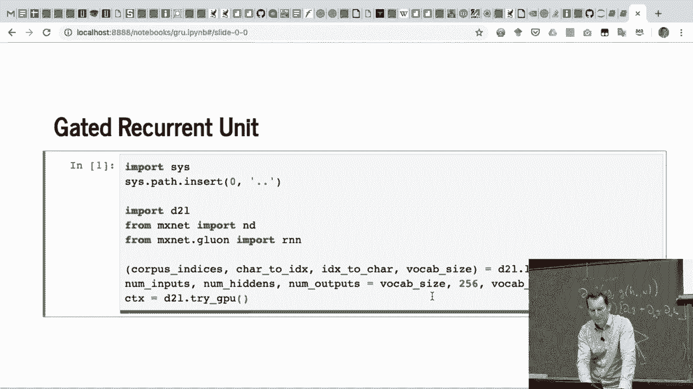

接下来我们需要实现一种方法来计算参数。

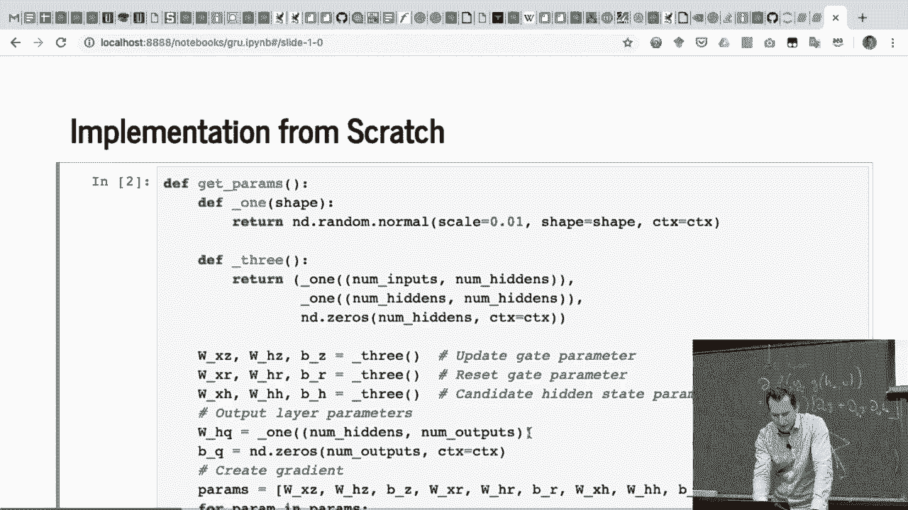

所以我们首先要帮助这些函数。这跟之前一样，只是之前我们只有高斯初始化的权重矩阵。现在，我们有一个用于输入，一个用于隐藏层，还有一个用于偏置的零初始化。

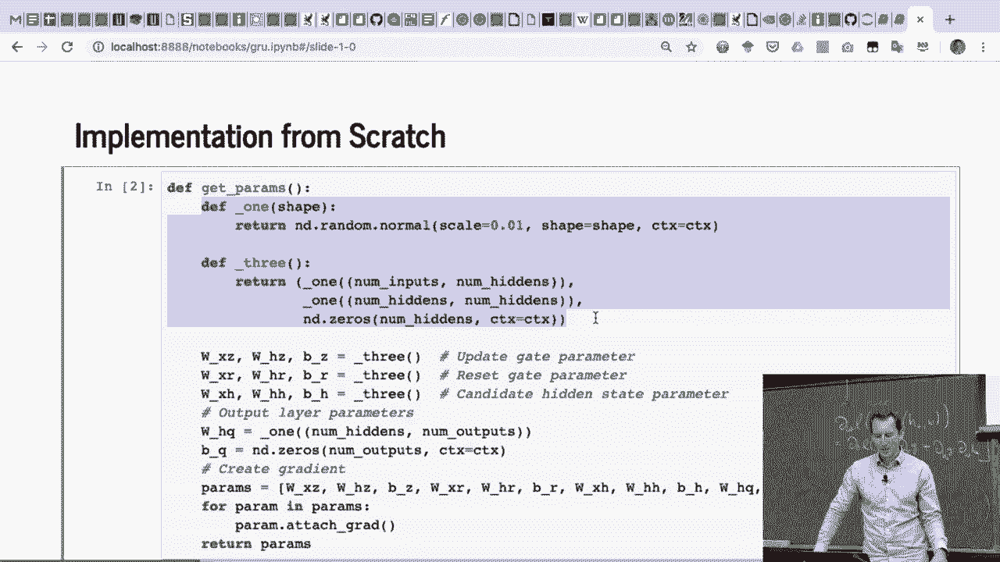

我们基本上需要三种不同参数类型的东西。对吧？我们需要更新门、重置门以及候选隐藏状态的参数。对了，这正是我们之前讨论的三个组成部分。所以我做的是，我，然后。好，我们也有输出。没错，还有一些权重矩阵和偏置，好的，明白了。

所以我只需初始化这些，这就是我的参数向量。这就是我需要的所有参数。接下来，我所做的就是遍历所有参数，并让它们都可以学习。换句话说，我为它们附加梯度。好了，到现在为止有问题吗？很好。所以这个过程完全是直接的，只是有点繁琐。

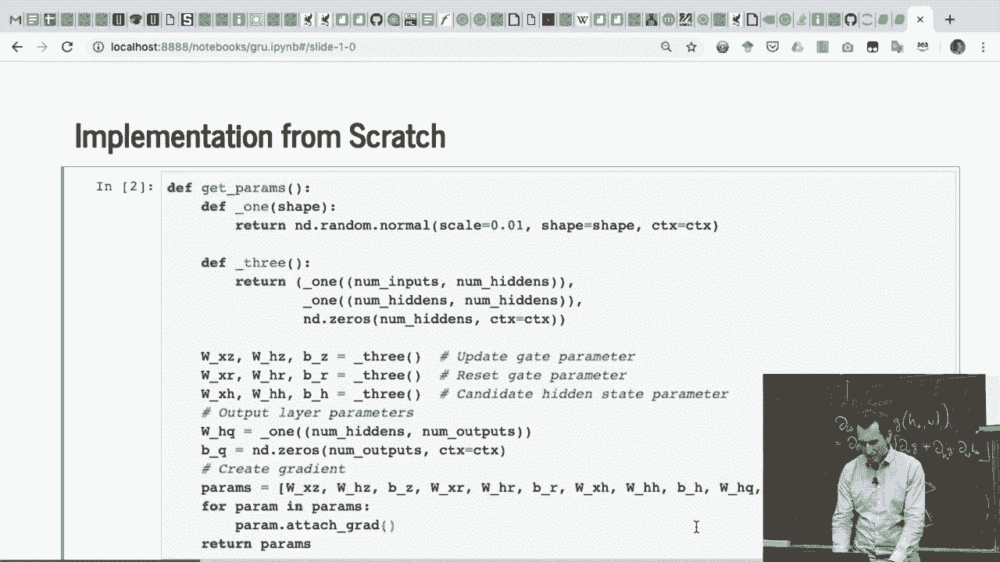

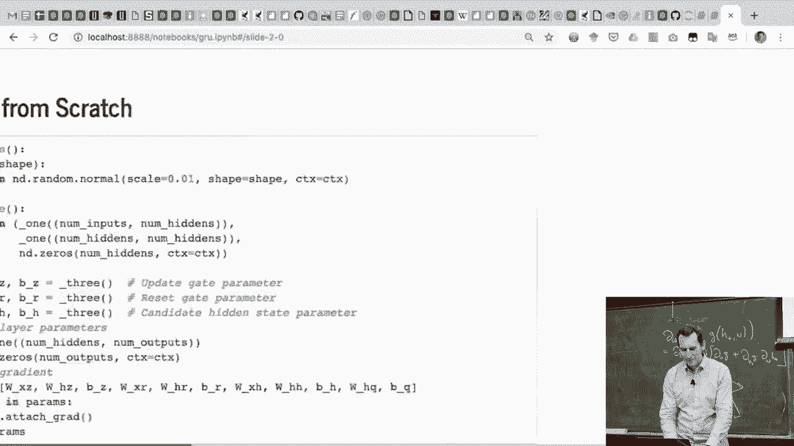

接下来的步骤是定义模型。好的，首先我会初始化状态。那总是一个好主意。基本上就是批量大小、隐藏状态单元和上下文。接下来，我需要定义 GRU。好的，它的输入是：输入、状态和参数。这跟我们之前的 RNN 单元完全一样。

这样做是故意的，因为我们希望调用签名保持一致。这样，我们就可以希望使用相同的优化器代码。所以我们做的第一件事是解包所有参数。好的，这在 Python 中很容易做到，对吧？

然后我们获取隐藏状态，嗯，之所以写成 `h，` 是因为状态实际上可能是一个状态变量的列表。所以，既然我们要处理一个列表，就需要能够从列表中提取第一个元素。我也可以写成 `state[0]`，那样也能提取出第一个元素。至于输出，到目前为止我们还没有任何输出，对吧？所以我们将它们初始化为零，初始化为空。

然后我们开始迭代输入。这个非常直接，简单来说。这里是我们的重置门和更新门。所以我们对X和H（作为输入）计算sigmoid，然后有偏置和相应的权重向量。明白了吗？

然后我们需要计算我们的候选隐藏状态。所以这只是之前结果的正切值。所以基本上就是这样。这就是我想要的。接着是重置门与你从中得到的结果相乘，嗯，如果你没有结合先前的状态的话。于是重置门乘上我们这里的矩阵与向量。

严格来说，我本可以在与H相乘之前做这个操作。然后尝试聪明一点，但实际上从计算角度来说没有区别。好的。最后，我得到我的隐藏状态Z乘以H加上Y减去Z乘以H的tilde。实际上，抱歉，之前确实有区别，是否拉进来会有影响。

那会是LSTM或GRU的一个不同变种。也许效果会更好。于是就得到这个，然后我只需生成我的输出，并将其附加到那上面。最后，他们返回新的隐藏状态H和输出。几乎就是我之前给你展示的数学公式，几乎是逐字逐句的。这是预先转换成可读格式的。

有什么问题吗？好的，这就像是完全的原始版本。好吧，接下来我们开始训练模型。

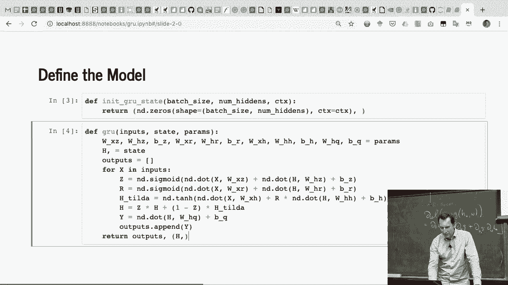

首先我们需要做的是设置几个参数。比如迭代次数，160。步数，35，批大小，32。然后学习率和梯度裁剪，分别是100和0.01。这个较高的学习率是因为我们已通过序列长度进行了归一化。然后我们基本上让模型进行预测。接下来我会立刻展示，如果你运行它，会发生什么。

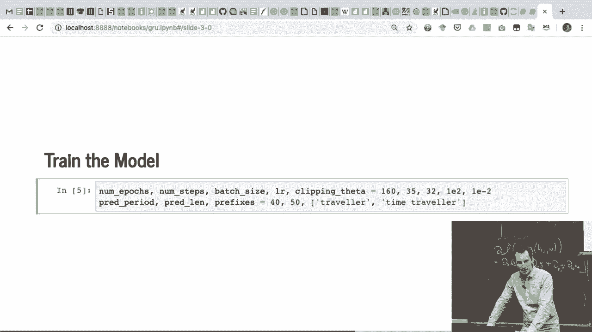

所以这需要一点时间，大约需要三分之三秒来完成一个周期。大概几分钟后就能完成。你基本上调用我们星期二定义的完全相同的训练预测函数。所以这基本上就像Keras中的fit函数，只是对于序列模型，它需要稍微更多的参数化。

所以你可以看到困惑度（perplexity）在下降，模型开始时生成一些垃圾，然后生成的内容稍微好一点，随着训练的进行，效果逐渐变好。所以在你的作业中，你将用莎士比亚的作品做这个。好的，我本来也可以选择Linux源代码。对，Andre Carpati有一篇非常不错的博客文章讲解如何做这个。

接着观察神经元的表现，这是一幅很棒的可视化图。那个人真的非常擅长教学。如果你有时间，读一读他的博客文章。好了，这基本上就是当你使用GRU训练时发生的情况。到目前为止有问题吗？

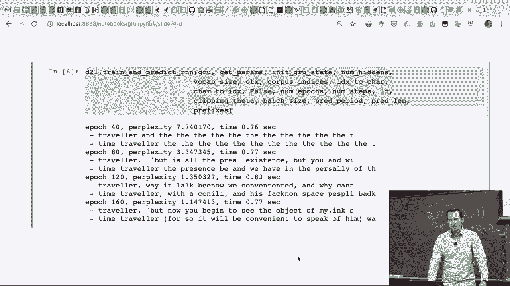

其实让我开始这个操作，或许我们能看到一些变化。

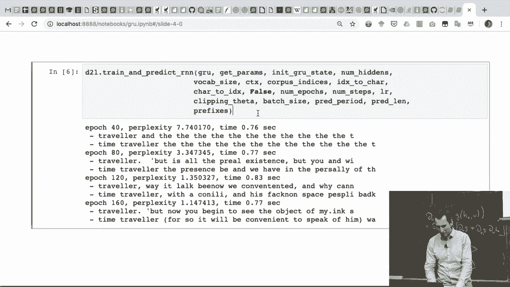

是吗？ >> [听不清]， >> 好的，如果我们想要增加更多的深度，你需要做的是。你基本上将第一个序列的输出作为第二个序列的输入，再依此类推，第三、第四、第五个序列，等等。我们大概会在周二讨论这个问题，也许在这节课结束之前，我们会稍微讲一些。

>> [听不清]， >> 你可以，通常来说那样会是的。

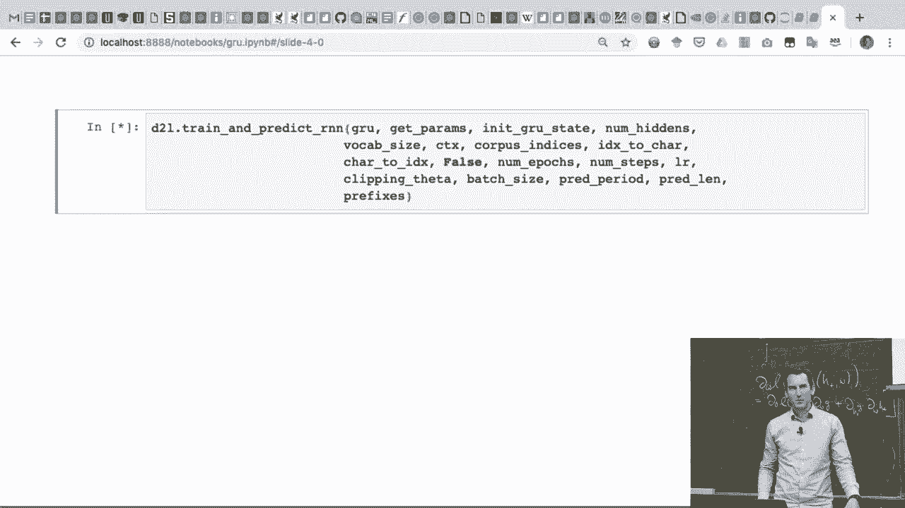

除非你强制将参数绑定在一起，否则可能并不是一个很好的主意。所以通常你会有不同的权重矩阵。你甚至可能有不同的维度，除非你想要有残差连接，那么你需要匹配维度，除非你有一个过渡层在其中。所以根据我们的进展，也许我们将详细探讨如何在许多细节上工程化这些东西。

但不管怎样，你现在已经看到我们在讨论时，它已经做了前 48 次操作。所以它并不超级快。记住，它是 0.8，0.9 秒，可能我的笔记本现在还在运行其他的东西。

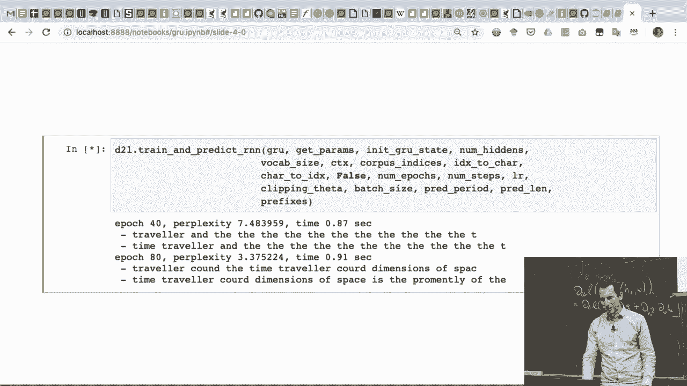

如果我要在 Glue 上实现这个，我需要编写更少的代码。你需要编写的代码就是：基本上只需要定义 GRU 层。所以你定义一个使用 GRU 的 RNN 单元，设置隐藏单元的数量。然后你将它直接输入到我们之前定义的 RNN 模型中。这也是为什么 RNN 模型可能比它应该有的要复杂的原因。

因为它在核心中接受了递归结构作为输入，其他的部分只是工具化，用来输入数据，然后提取结果。你看到的是，嗯，这个稍微快一点。

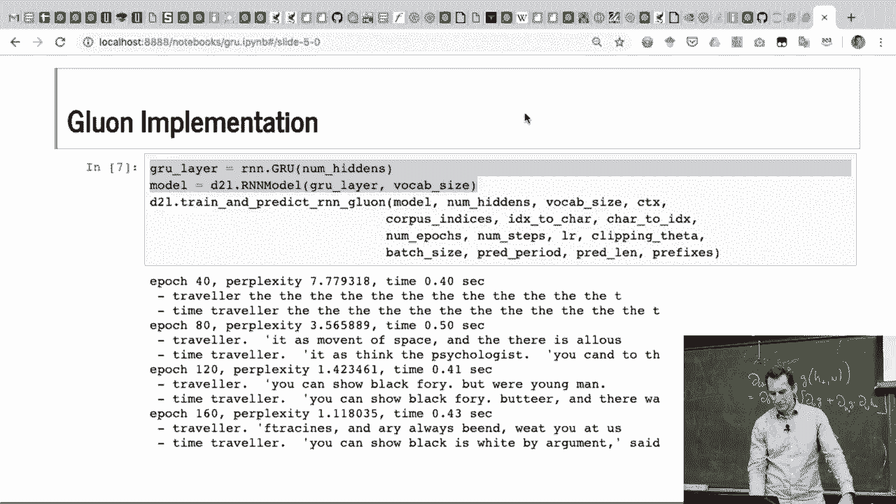

对，所以它需要 0.4 秒，而不是 0.8 或 0.9 秒。

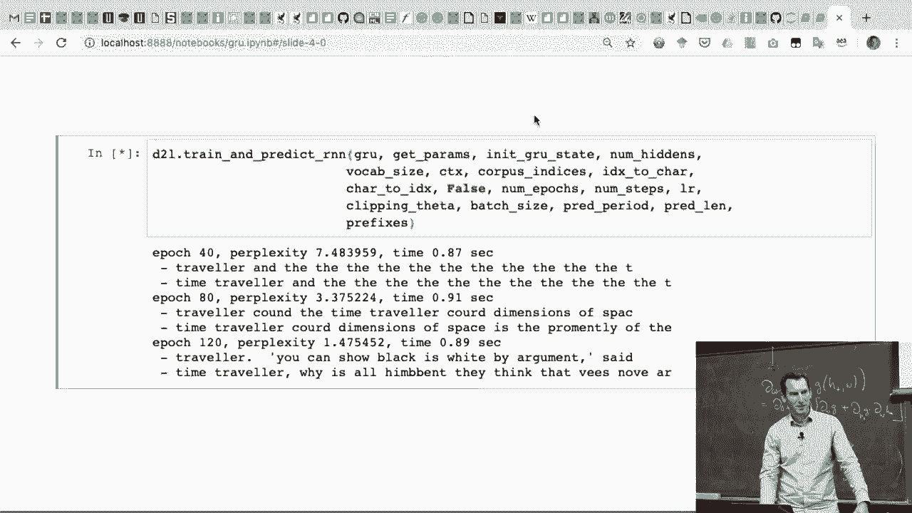

这就是我的笔记本。如果你使用 GPU，那差异会更大。好的，到目前为止有什么问题吗？是的。 >> 所以像语言模型这样的自动化，你说，发布就像是，我认为是将单词向量化，然后可能还要进行嵌入。 >> 我想问的是你是如何选择嵌入单词的，因为看起来单词并不一定需要完全通过向量来表示。

>> 好的，那么问题是，什么是好的词嵌入，你如何选择它，为什么？

首先，这个问题在过去几年里非常热，已经有很多研究了。我们实际上会讲解嵌入策略，例如 Word2Vec、fast text，然后也许还有序列字节对编码，等等。随着我们的进展，可能周二会讲一些。简短的版本是，是的。

除非你考虑上下文，否则你很难捕捉到词语在特定语境中的独特性。比如，拿“bank”这个词来说，对吧？它可以指河岸，也可以是我存放钱的地方。还可能是火车的转弯处，对吧？

你可能在银行里存款，可能坐在一个银行的柜台，或者在“三河银行”分行的银行里。好了，现在我们在一句话中拥有了所有四种意思。大多数NLP工具会惨败，对吧？所以，没错，单靠将词语映射到某个向量是做不到的。

人们曾尝试过这种方法，但它很棘手。更有效的方法是使用词语和它们的上下文。所以，你基本上是利用它们所处的公司，或者它们常出现的语境。这样能帮你解决问题。否则，你可能会遇到这样的问题。比如，我给你以下这个序列。你知道，福特。

林肯，好吧，接下来该怎么继续？你可以接着说，也许是克林顿，也许是肯尼迪，或者你可以接着说丰田和本田，对吧？嗯，因为，嗯，这是前两个苹果，分别是总统和汽车，对吧？嗯，也许是有充分理由的，因为他们希望拥有，嗯，至少在林肯的情况下。

他们希望拥有一个好名字。福特这个名字，恰好是一个并不罕见的名字。但他也会遇到类似的情况，比如Cougar和Jaguar以及其他一些名字。所以动物名也是很流行的。这些是你可以根据上下文很好地进行歧义消解的东西。

但，如果我一次只给你一个词，事情就没那么简单了。这是学习外语时常见的陷阱。你需要翻译一个词，然后打开字典，发现有五个可能的翻译。然后你会想，天啊。

你应该选择哪一个？几乎肯定会选错。因为你可能选择了在另一种语言中有不同对应词的词。所以就是这样。GRUs将会，好的。

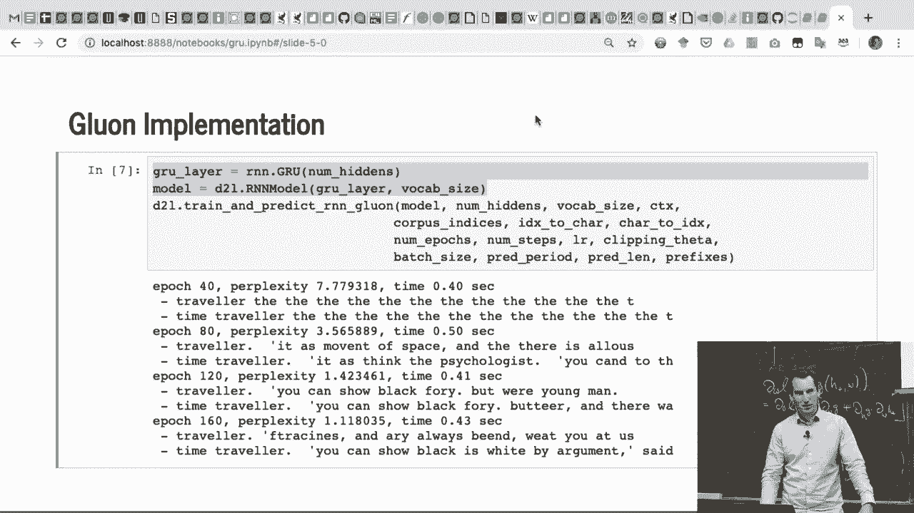

>> [听不清]， >> 是的，没错。这个问题我们稍后会继续讨论。

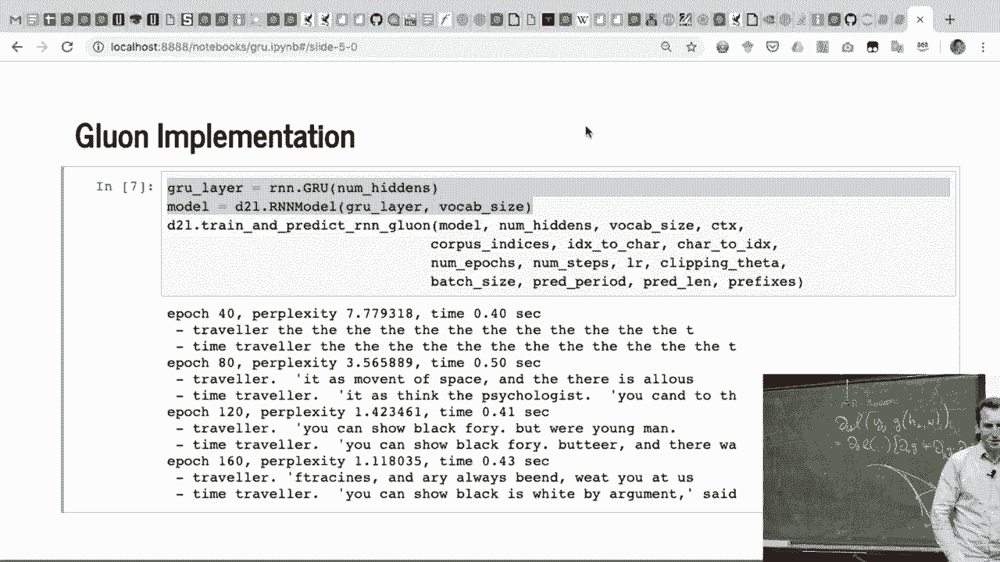

比如，某些幻灯片提到双向STM。好的，明白了吗？>> [听不清]， >> 是的，你可以学习这个矩阵。事实上，正是如此，嵌入矩阵正在被学习。通常是与任何卷积操作或其他序列模型一起进行的，可能是LSTM，也可能是Transformer。几乎默认情况下，你会对更大的系统进行联合训练。

只要你能承担，尽量使用更大的数据集。通常，你会在非常大的语料库上进行预训练。这就是我们得到GPT及其相关模型的原因。我们会在后续深入探讨这些问题。这些问题非常好，大家问得很棒。我们会一一解答。

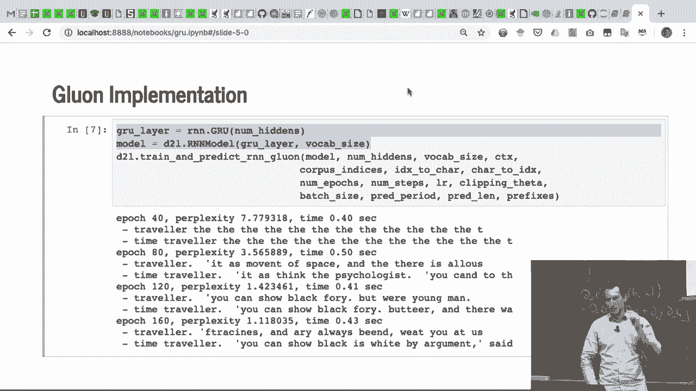

好的。[BLANK_AUDIO]。
