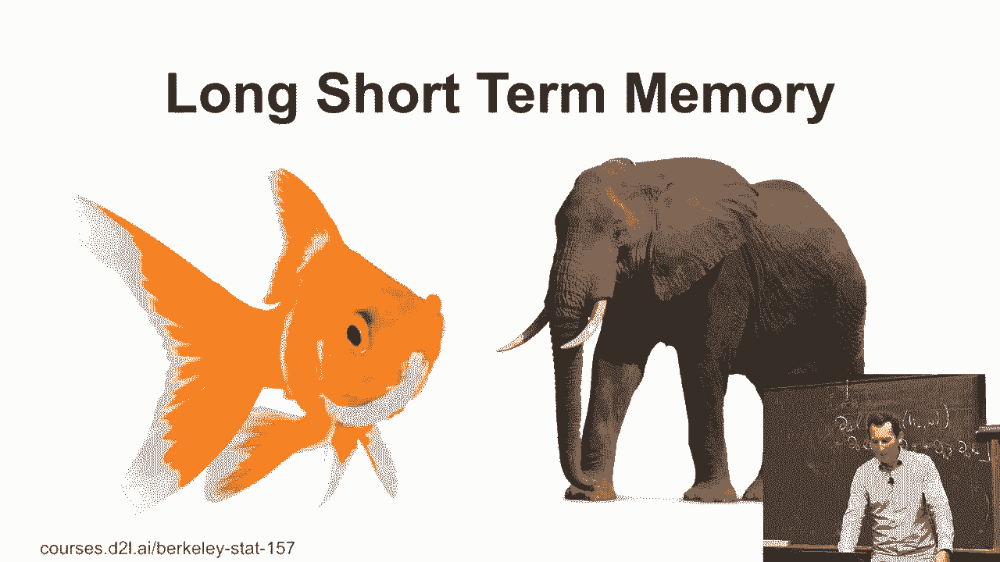
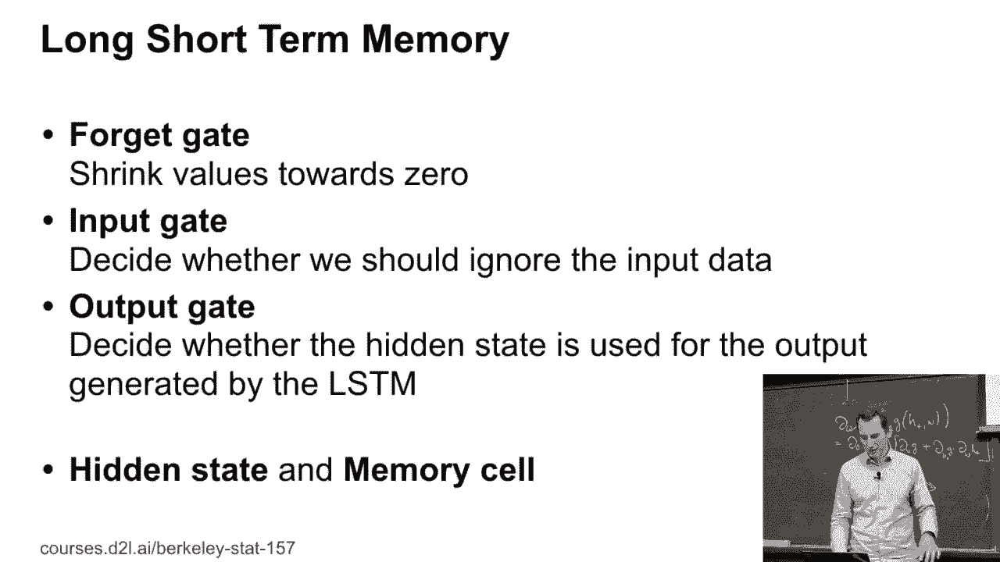
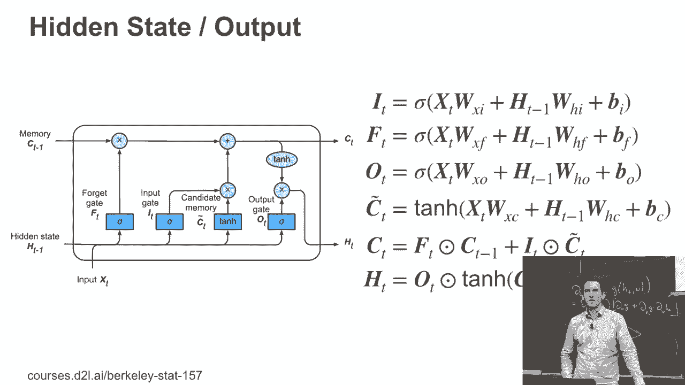

# P105：105. L19_8 长短期记忆 - Python小能 - BV1CB4y1U7P6

所以长短期记忆。这，背后有一个有趣的故事，或者说几个故事。

所以，如果你没听说过尤尔根·施密特伯尔，他是一个非常值得记住的研究者。你应该了解一下他。但基本上，在某个时刻，故事是这样的，你是一个伟大的天使。至少这是我听到的尤尔根版本，曾经有人向尤尔根·施密特伯尔提出了这个问题，你知道的。

记住时间序列中的东西等等。故事是这样讲的，然后基本上你就被设计出了一个叫做长短期记忆的东西。实际上，真正做这件事的是那个可怜的作者。我想那时他还是个硕士生。他们的起点可能是在1980年，'97，'98年左右。

当时这篇论文很奇怪。我是知道它的。就像，哦，又是一篇奇怪的神经网络论文。好吧，那有什么意义呢？对吧？

大家差不多都这么想。我觉得这是一件非常、非常、非常困难的事情。我觉得这是一件非常困难的事情。我觉得这是一件非常困难的事情。我觉得这是一件非常困难的事情。我觉得这是一件非常困难的事情。我觉得这是一件非常困难的事情。我觉得这是一件非常困难的事情。

我觉得这是一件非常困难的事情。我觉得这是一件非常困难的事情。我觉得这是一件非常困难的事情。我觉得这是一件非常困难的事情。我觉得这是一件非常困难的事情。我觉得这是一件非常困难的事情。我觉得这是一件非常困难的事情。我觉得这是一件非常困难的事情。

我觉得这是一件非常困难的事情。我觉得这是一件非常困难的事情。我觉得这是一件非常困难的事情。我觉得这是一件非常困难的事情。

我觉得这是一件非常困难的事情。我觉得这是一件非常困难的事情。我觉得这是一件非常困难的事情。我觉得这是一件非常困难的事情。我觉得这是一件非常困难的事情。我觉得这是一件非常困难的事情。我觉得这是一件非常困难的事情。我觉得这是一件非常困难的事情。

我觉得这是一件非常困难的事情。我觉得这是一件非常困难的事情。我觉得这是一件非常困难的事情。我觉得这是一件非常困难的事情。我觉得这是一件非常困难的事情。我觉得这是一件非常困难的事情。我觉得这是一件非常困难的事情。我觉得这是一件非常困难的事情。

我觉得这是一件非常困难的事情。我觉得这是一件非常困难的事情。我觉得这是一件非常困难的事情。我觉得这是一件非常困难的事情。我觉得这是一件非常困难的事情。我觉得这是一件非常困难的事情。我觉得这是一件非常困难的事情。我觉得这是一件非常困难的事情。

我认为这是一个非常困难的事情。我认为这是一个非常困难的事情。我认为这是一个非常困难的事情。

我认为这是一个非常困难的事情。我认为这是一个非常困难的事情。所以我们要做的第一件事是我们需要去设计门。这些门函数和之前完全一样。我们有I、F和O。它们只是sigmoid函数。它们是输入和隐藏状态的某种线性函数，再加上一些偏置。

到目前为止，这看起来和之前差不多。只是我们有三个，而之前只有两个。有了三个，你能做的比两个更多。所以没问题。接下来，让我们看看候选记忆。这就是事情变得有趣的地方。我们的候选记忆单元。

这不是隐藏状态。这是记忆。它基本上是通过，嗯，隐藏状态和输入的某种线性函数得到的。这就是记忆。好的。记住，你基本上可以像在电子学中一样将东西读入记忆单元。所以他们设计了这个。好的。那么，嗯。

接下来的事情是我需要决定是否忘记一些东西。所以它们被遗忘了，好的。这正是帮助我决定是否应该保留之前的东西，还是应该更新为新的东西。它是新的C波浪符号。所以这和我们之前讨论的Z和GRU有些相似。

但现在它只在记忆上操作。现在那段记忆还没有做任何有用的事情。它只是存在在那里。你无法读取它。你无法做任何事情。但我们已经用掉了一个门来决定我们是否应该重置记忆或如何更新它。好的。接下来有趣的事情来了。也就是说，隐藏门和输出门只是输出门乘以那段记忆单元。

好的，所以记住这个h t实际上会用来，嗯，操作记忆。然后这再次用来操作隐藏状态。所以你真的需要两个这样的变量，随时带着它们。这可能有点冗长和复杂。

这是整个事情的完整展现。所以我有三个门，I、F和O。分别是输入、忘记和输出。有候选记忆，C波浪符号。我有实际的记忆，C。然后我有输出，它只是记忆的某种函数。好的。所以这看起来，嗯，好吧，它更复杂了。我们正朝着一个Rück-Golberg机器的方向发展。但好吧，没问题。

为什么不呢？但它做的事情和我们之前讨论的非常相似。只是它们在如何参数化事物上有更多的表现自由。好的，到目前为止有问题吗？

好的。那么，在这种情况下。
