# P106：106. L19_9 Long Short Term Memory in Python - Python小能 - BV1CB4y1U7P6

 So let's look at the LSTM code。 First thing is we load the data。

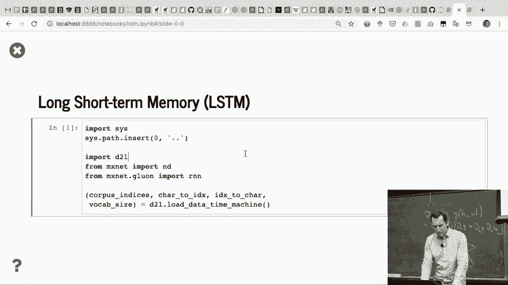

 So this is completely the same as before。

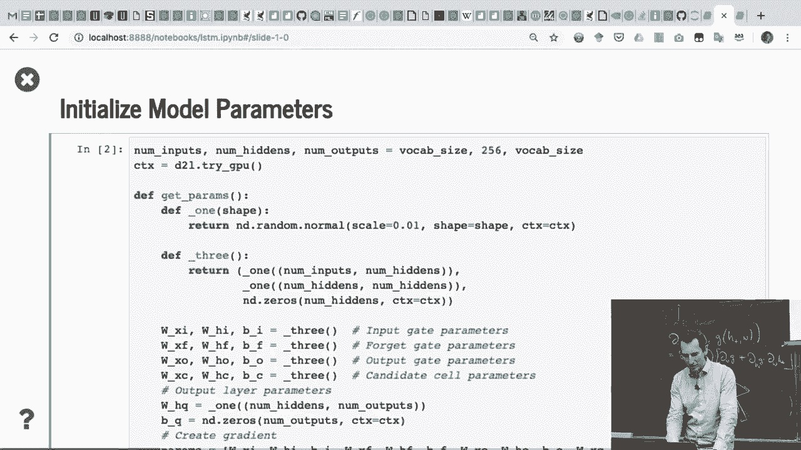

 And then we need to initialize the parameters。 And again。

 the parameter initializer is the same as before。 Just that we have one extra set of weight vectors。

 right？ So again， we initialize two with normal Gaussian， plus 1， the bias being 0。

 And they just have three groups of parameters， right？ The input gate， the forget gate。

 and the output gate， and the candidate cell parameters。 Let's block there。 Then， of course。

 I need the outputs。 Here we go。 And so now I stuff everything together。 And presto。

 I get my parameters with the gradients attached。 And that's what I return。

 So this is getting boring， right？ This is exactly the same code as what you've seen before。 Now。

 the next thing that we need to do。

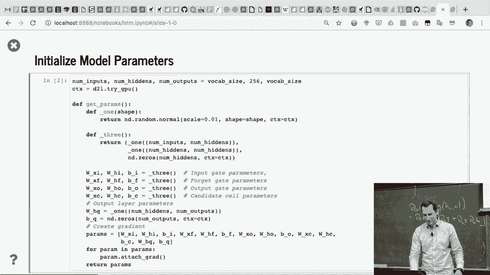

 is we need to initialize the state。 And well， this does nothing else。 But just return。

 in this case now， two vectors of 0s。 Why am I now returning two vectors of 0s rather than 1？

 Exactly perfect。 So this is exactly-- we have a state， and we have the memory cell。

 And both things need to be carried through。 So remember。

 the memory cell is something that just sits there， and does things in the background。

 I can't read it directly， but it still， needs to carry it with me。

 And what we'll see is now is we look at the actual code later。

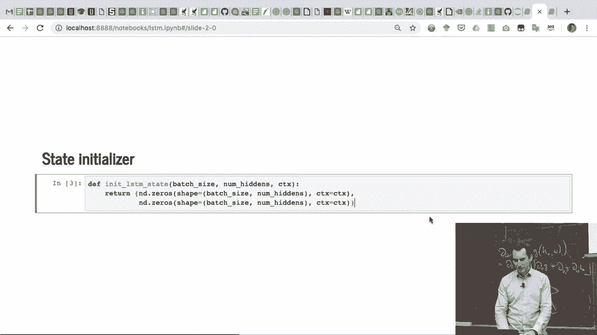

 that now the hidden state will actually decompose things， into those two pieces。

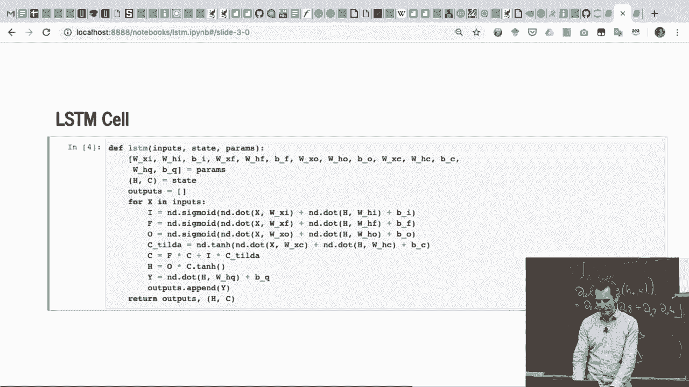

 So here's where the magic happens。 So these are my parameters。 I just decompose it。

 And this can be done nicely in Python。 And here now， I decompose my state， into hidden and memory。

 Now， the outputs are empty again。 And now， this is basically just the LSTM math。

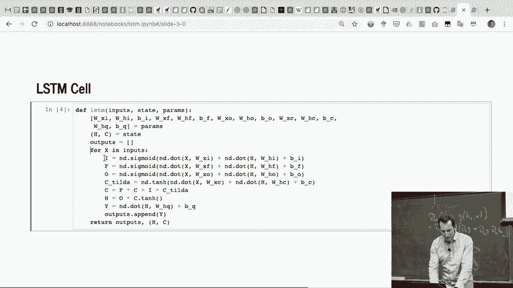

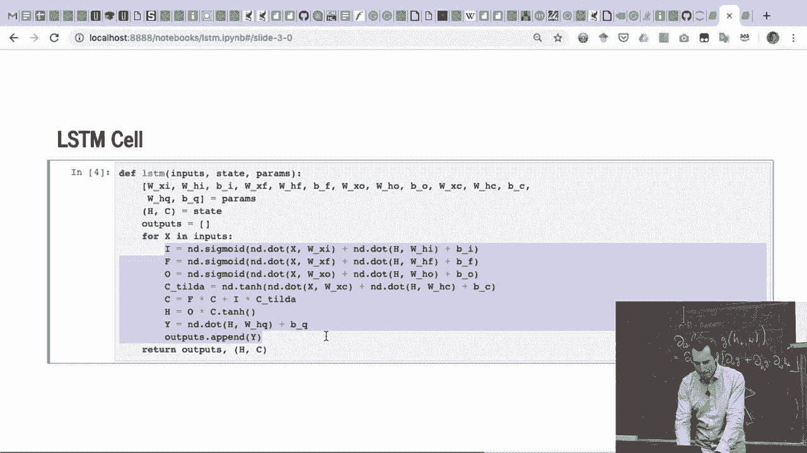

 So I have my three gates， IFNO， all nicely with sigmoids。

 I have CTIL that has the candidate memory with a tangent。 That operates on everything， right？

 You can see the green part of the bracket， being referring to all of that。

 I then have the actual memory cell， by using the candidate and the corresponding forget gate。

 And then here's the output。 And there we go。 And you just return this。

 So this is really just verbatim what we had on the slides。 But just a bit more detail。

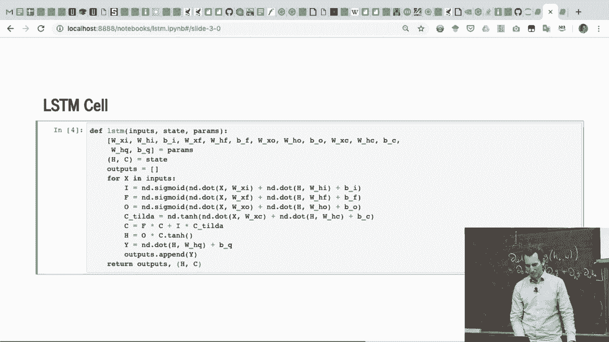

 And then training goes in exactly the same way as before。 Number of steps， all of that is the same。

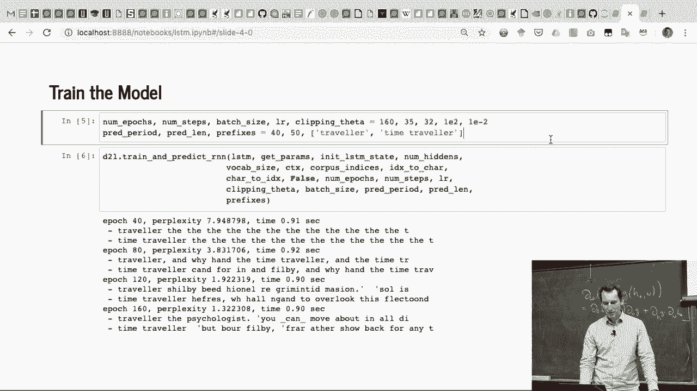

 And since we are a little bit out of time， as in actually pretty much out of time。

 I'm not going to run the training run。 But what you would see if you were to run it for long enough。

 is that it would work ever so slightly better than a GRU。 Yeah。

 so now you're asking yourself how to do that in GLUON。

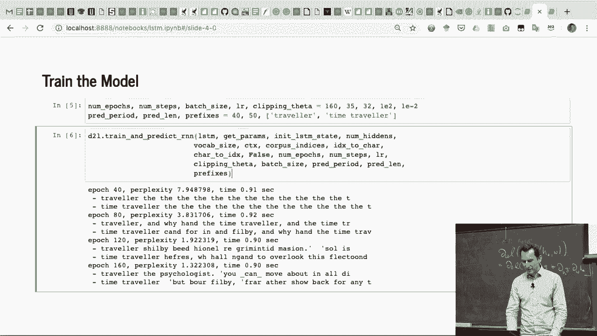

 Well， the only difference to what we saw before， is that now you don't invoke RNN。GRU， but RNN。LSTM。

 And press the U-F-U-LSTM。 The other thing to observe is that this is slower。 So before that。

 we had 0。3 seconds， and now we have 0。48。

 And here it's 0。9， rather than 0。7 or something like 0。8。 Basically， OK。

 my laptop is doing something in the background， so it's slowing it down。 But basically。

 the time would have been about that。 And so you run this， and you get your LSTM。 Good。 Now。

 doing anything fancy beyond that， is what we'll cover next Tuesday。 Then we'll go deep。

 We'll go bidirectional。 And we will probably get a little bit of a chance。

 to look at word embeddings。 So thanks for today。

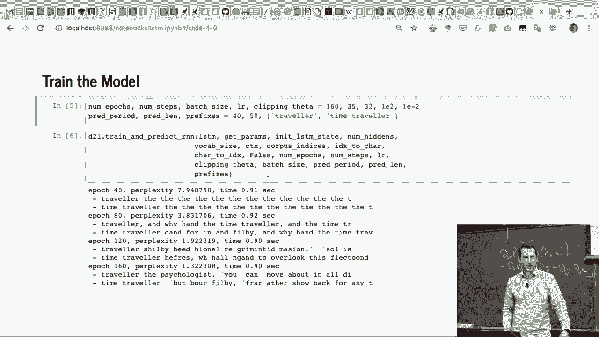

 Take care and see you next week。