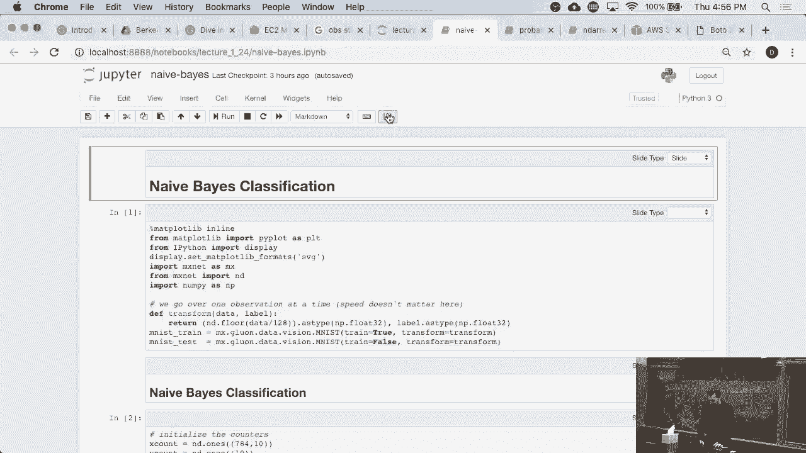
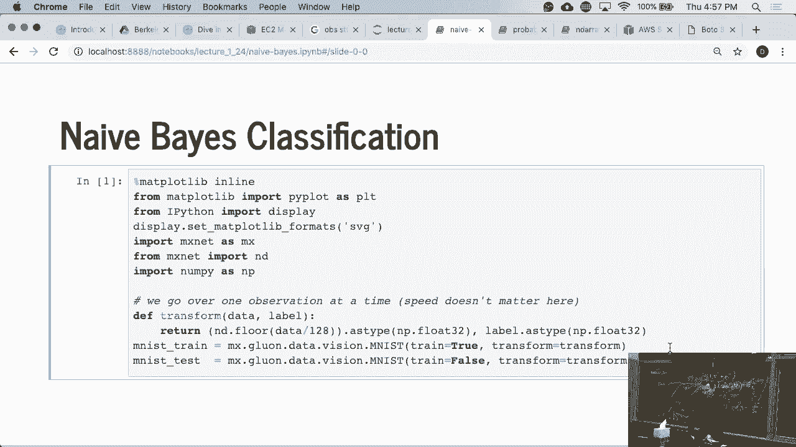
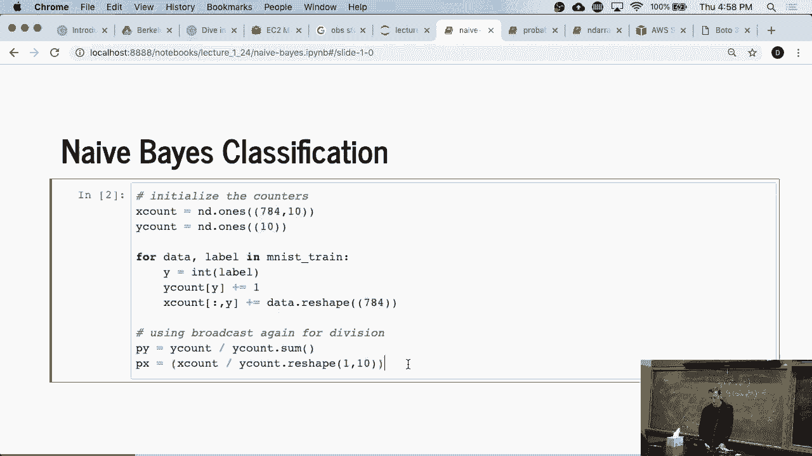
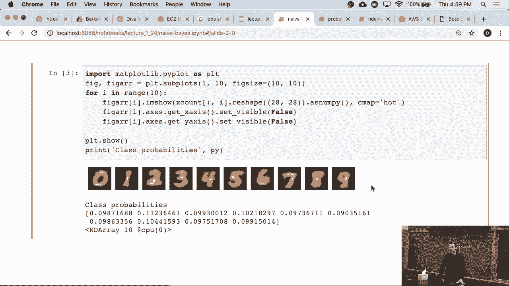
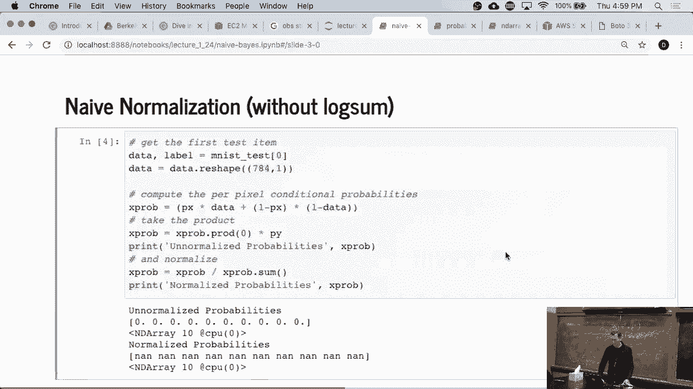
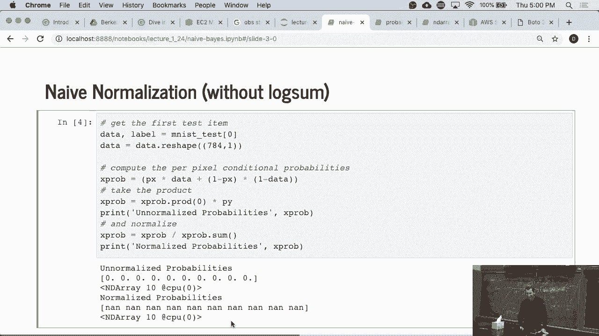
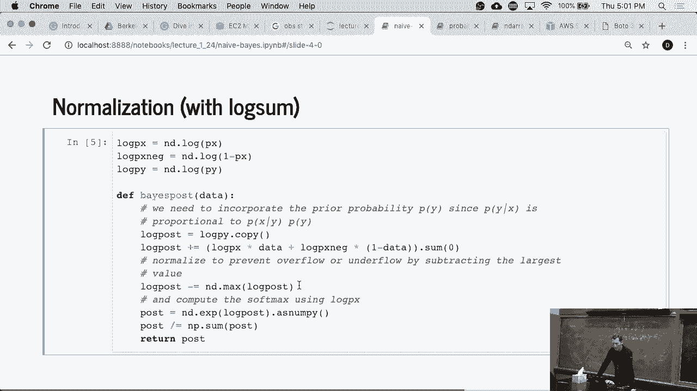
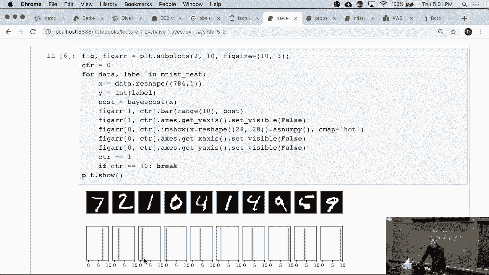
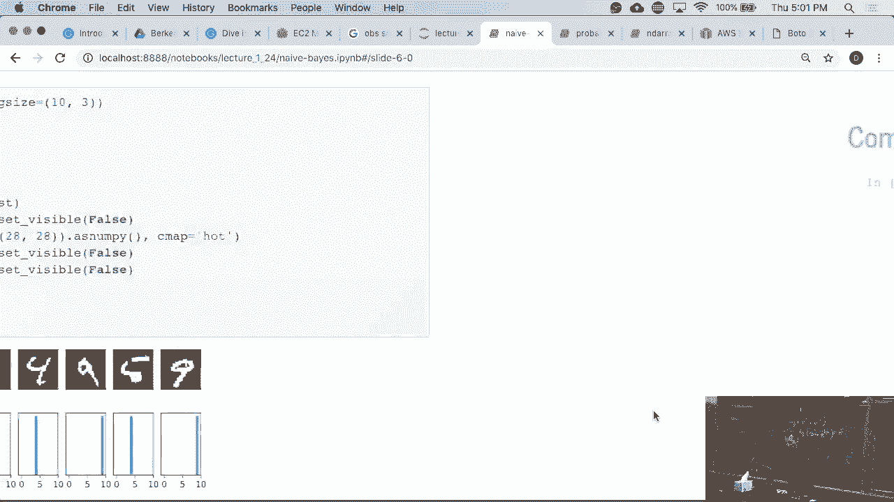
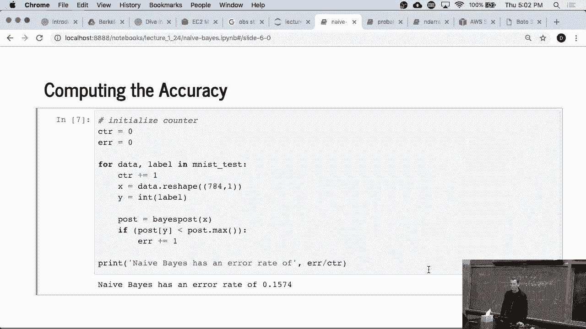

# P11：11. L2_6 Naive Bayes Jupyter - Python小能 - BV1CB4y1U7P6

 [LAUGHTER]。

 So and we might go for maybe two， three minutes over time。 I hope you're OK with that。

 Let's just look at Knave Base briefly。 So we'll do usual imports， MXNet and DRA。

 and we also import NumPy。 And the other thing is， so we actually。

 are going to load some training data。 And so since it's MNIST， well， it's an image data set。

 So it's just a standard image loader。

 So Knave Base， what we're going to do， is I'm going to allocate count statistics。

 So y count is kind of straightforward。 It's just a number of times。

 It's a digit classification data set。 So we have digits going from 0 to 9。

 So I need 10 dimensions for the y count。 And for the x counts， well， since these。

 are 28 by 28 pixels， I have a total of 784 dimensions。 The pixels are just black or white times 10。

 because I have 10 classes。 And so I need to basically count for every class how many。

 times that particular pixel is switched on。 So what this code does is nothing particularly exciting。

 except that it just goes over all the data， and just adds for the particular label something to it。

 So for instance， if this were labeled number 3， it would add to the third dimension of the x count something。

 And then in the end， while we go and divide， by the total number of observations， and likewise。

 we do that for the pixels。

 So very straightforward。 And so if you then look at this， well， these are fairly--。

 these are our mean-looking digits。 And this is basically the superposition， of all the 0s， the 1s。

 the 2s， the 3s， and so on。 And the class probabilities are pretty close to 1 over 10。

 Now that's actually all the information， that we need in order to perform classification。

 What we're going to do is we're going， to take the overlap of those digits with our new test。

 images， and we'll use that to estimate the probabilities。 The horrible assumption that we made。

 is that all the pixels are independent。

 That's obviously stupid， but let's see what happens。

 So this is just to illustrate that things go badly wrong， if I don't normalize properly。

 So what I'm doing is I'm computing the x probabilities。 So that's basically the probability。

 that that pixel is on times 1 minus probability that is off。 So this is for--。

 because my test image is 0s and 1s。 So basically， for all the places where the pixel is on。

 I need to look at px。 And for all the places where the pixel is off， I need to look at 1 minus px。

 These are probabilities that are between 0 and 1。 So then I take this term and multiply it by--。

 so I take the product over those probabilities， because we have them for each pixel。

 So I get 784 numbers times the y probabilities， appropriately in the zero dimension。

 because we need 10 classes。 And then I get the corresponding probabilities。 And if I wanted to--。

 you'd normalize to make sure that they all sum to 1， I divide by this。 And if I do this。

 I get garbage。

 You should rerun this code。 It doesn't take long on your laptop。 Now， if I am， therefore。

 a little bit more careful， what I'll do is I'll take the log of all those probabilities。

 So that's log px and log py and log px neck。 And now， rather than multiplication。

 so I just perform addition。 So I get this。 And then if I run this， low and behold。

 things work out nicely。

 So for those digits here， I get something， that's actually reasonably meaningful。

 So these are the conditional class probabilities， for those digits。 And if you screw in Tard。

 you'll， see that this is where the 7 should be， and this is where the 2 should be。

 and that's where the 1 is and the 0。

 So it works kind of decently。 OK？

 And you can compute the accuracy overall， and we get about a 15% error。 It's the baseline。

 We will very soon see deep networks that， will beat the space line into a balloon。

 But that's a topic for next week。 So thanks a lot for bearing with me a little bit longer。

 We'll go through more content on Tuesday。