# P13：13. L3_2 Sampling in Jupyter - Python小能 - BV1CB4y1U7P6

 Okay， so now let's look at what actually happens when we sample。 Okay。 first and simplest thing I can do is I can just， you know， draw random numbers， and。 in this case I'll just get some numbers between 0 and 1。 This is your run of the middle of a nullar。 you know， uniform random number generator running， on a CPU or GPU fairly efficiently。

 It's probably not the most statistically or cryptographically pure random number generator。 but one that's fairly fast。

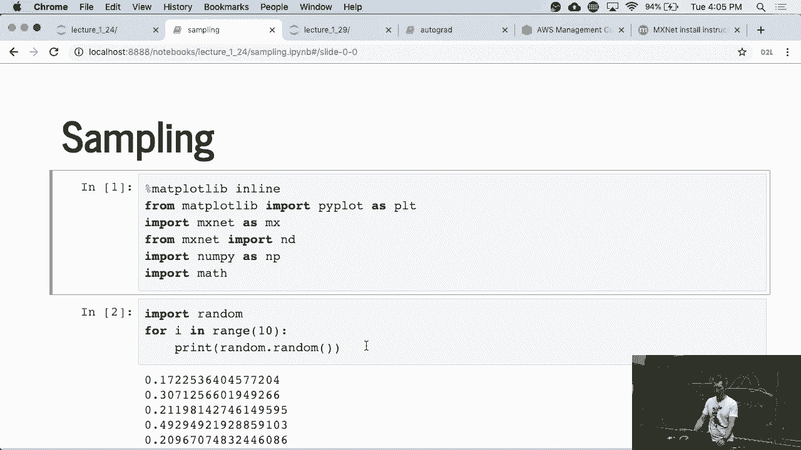

 So， but anyway， so that's what you get。 I guess nothing interesting to be seen here。 Now if I wanted to get random integers， well I could do that too。 And， you know。 that's invoked by a random int。 And so now you get numbers between this case 1 and 100 or actually 1 and 99 and lo and behold。 I actually get 1 twice。 Let's just see。 Okay， get something else now。

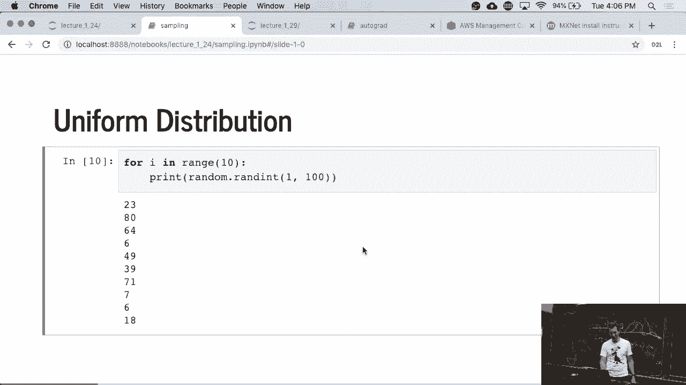

 Okay， so nothing particularly special here。 This is the picture that we saw before。 but now actually implemented。

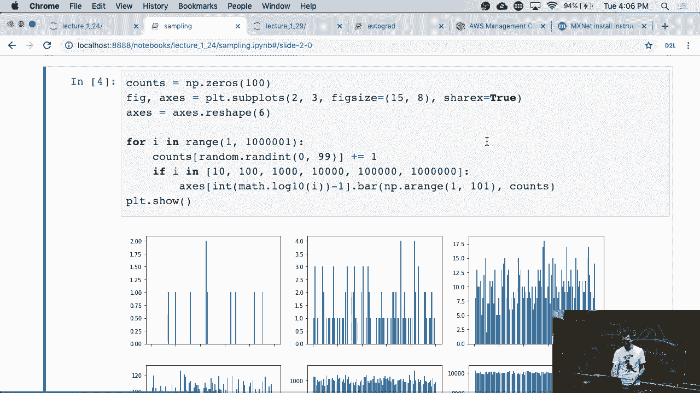

 Okay， let's explain what's going on。 So I'm just picking， you know， 100 pins and doing some。 you know， just plotting， remangling。 And I'm going to generate random integers between 0 and 99。 And okay， basically， yeah， so starting it off way。 Yeah， like that。 Now what I'm essentially doing is， if I is in the appropriate bin， then， you know， go。

 and add the count。 Otherwise， and then， you know， if the count， you know。 if my counter is between 10， 100， and 1000 and so on， I just go and， you know， plot this thing。 So what I did here， just for reference， I don't even bother pulling out random random。 random explicitly and then checking the entry。 I'm just indexing this directly， right？

 So counts of random random just goes directly into that field and it increments it by 1。 Okay。 so if， for instance， that value is 3， then it increments the bin that has value， 3。 Why do we have to go from 0 to 99？ Well， because it's Python。 Starts all the indices from 0。 And then we can see that as， you know， we sample more and more for， you know， million， terms， well。

 we get something that's fairly smooth but for， you know， 10， it's not so nice。 Okay。 any questions so far？

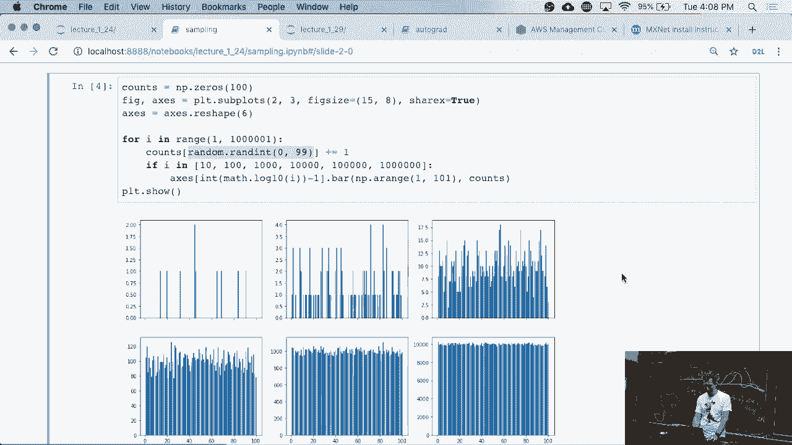

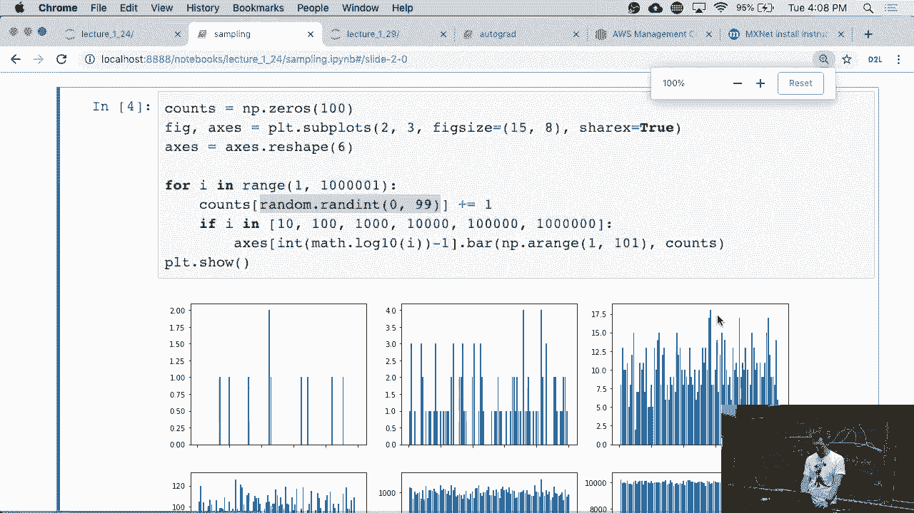

 I can do things like categorical distributions， right？ So in this case。 I'm just looking at two possible outcomes， you know， 0 and 1。 And what I'm doing is I'm picking an interval between 0 and 1， right？

 And if the random variable is below 0。35， and I say it's outcome 0， otherwise it's outcome， 0。35。 Okay， so I just hand engineer that sampler。 Okay， it's a pretty boring sampler。 I mean。 it's like tossing a bias coin。 And then I go and compute that thing again， right？

 So I basically just run this。 And yeah， I'm just checking for each of the random variables。 you know， a million of those， whether they are， you know， less or larger than 0。35。 I'm doing this in bulk here。 That's a lot faster than a full loop。 But I guess from homework one by now everybody knows that full loops are evil， right？

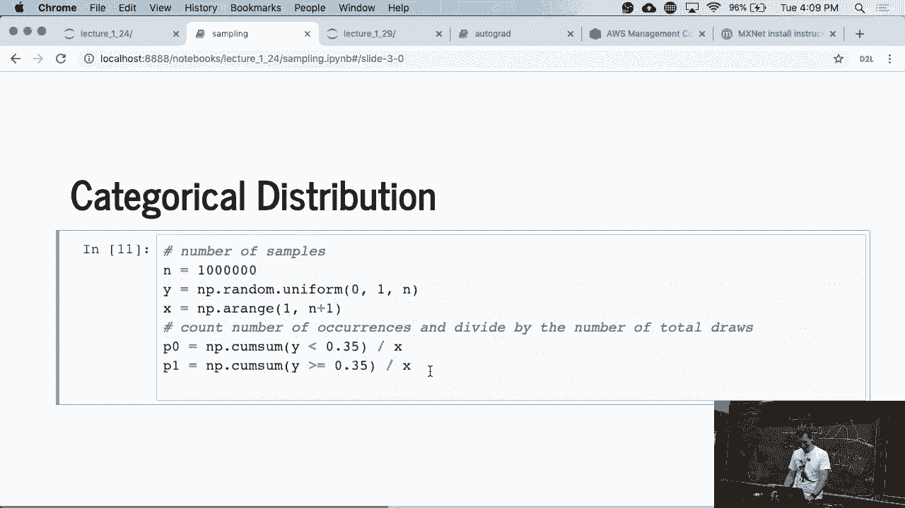

 And then I plot this。 So if you plot the corresponding fractions， I mean。 they all have to sum up to 1。 You can see that， you know。 this wiggles around a bit and eventually it goes to 0。35 and 0。65， as you would expect。 Okay。

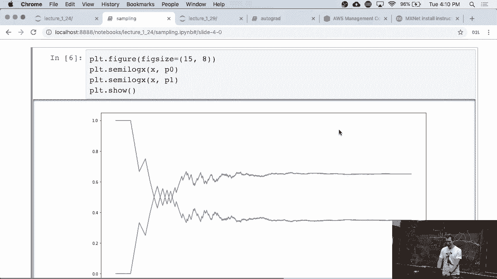

 Now， okay， last but not least， the normal distribution。 And this is how you plot 1。 Right？

 This is just， you know， creating range between minus 10 and 10， grid spacing 0。01。 Then you evaluate this function here。

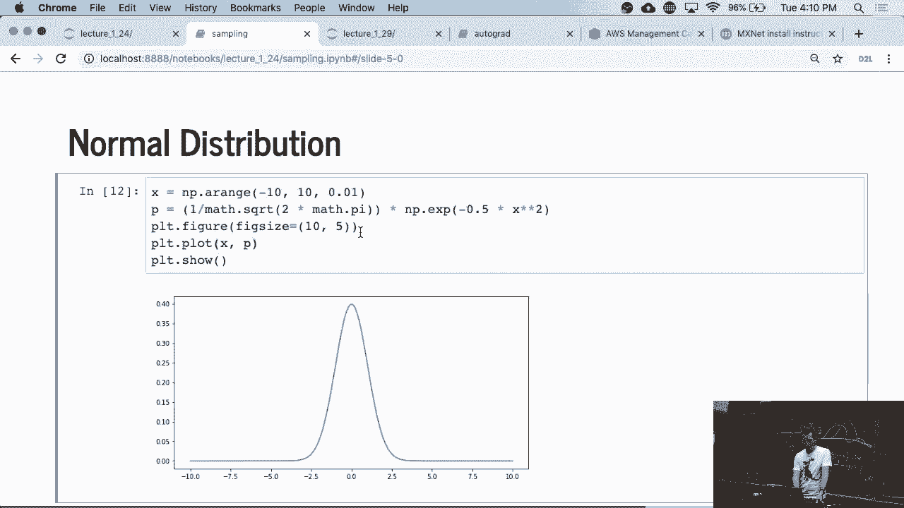

 You plot it。 And that's it。 Right。 Nothing particularly special。

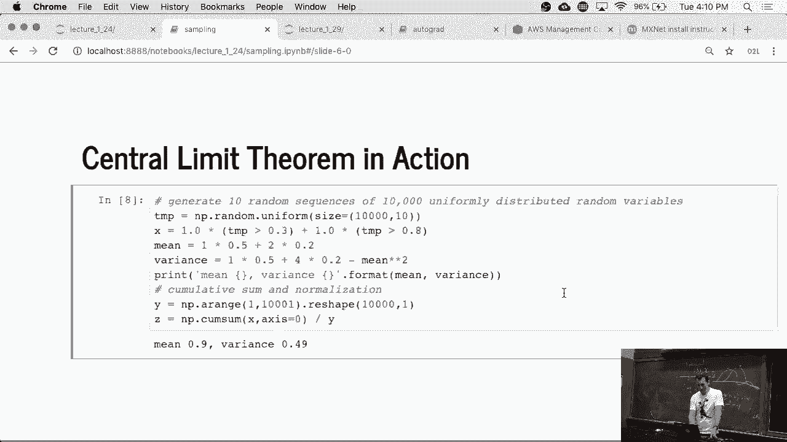

 Except that now what we're going to do is we're going to actually try out what our run。 our central limit theorem does。 So I'm going to create a run。 run in variable which is 0 with what probability？ Exactly。 Because if it's less than 0。3。 I don't get anything。 What's the probability that that run in variable is 1？ So the exciting。

 an interesting line is this one here， right？ What's the probability that the value is 1？

 You can also read it off in the code， right？ Okay。 Well， so temp is some， you know。 random numbers and they are between 0 and 1。 And I created， you know， some big array of that。 You know， I basically created 10 instances of， you know， 10，000 samples。 And now I'm checking for each entry in temp whether it's greater than 0。3。 Okay。 So therefore。

 for all the terms where it's not greater than 0。3， well， okay， it's 0。 Now for all the entries where it's greater than 0。8， well， basically two inequalities。 kick in in the same time。 So with probability therefore 0。2， it's 2。 And with probability 0。5。 it's 1。 There was a question over there。 Oh， okay。 Oh， okay。 Sorry， I didn't see you before。

 I apologize。 So this， by the way， is just， is also the answers of the question， right？ It's 0。5 times 1 plus 0。2 times 2。 And now this is actually just computing the variance as we would， right？

 This was exactly the decomposition that we have before。 So it's 0。5 times 1 squared and 0。2 times 2 squared， which is 4， minus mean squared。 Okay。 Then we can go and print this and then。 well， okay， we do a little bit of maintenance here。 We essentially just aggregate terms。 and divide them by the counts。 Okay， let's just do this。

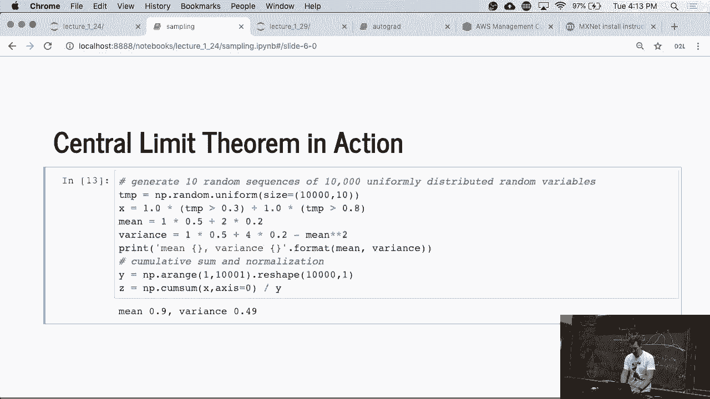

 Now let's print it。 So we， on this plot， you can see 10 executions of that average。

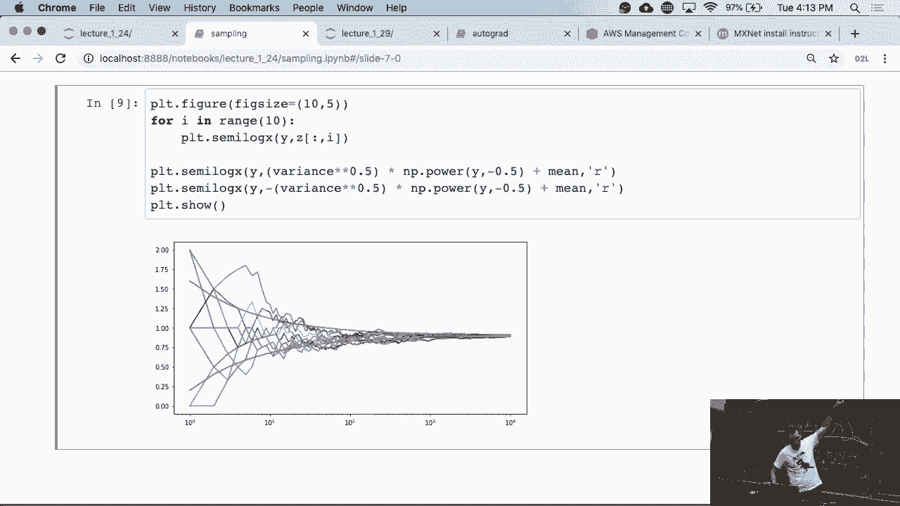

 And you can see that they're all pretty much converging to one， which just so happens to。 be the average here。 Well， closer one。 But then the other thing is you'll see the upper and the lower bound。 So look at that slide carefully because it'll help you for the own work。 Okay。 And with that。 we're done with the notebook。

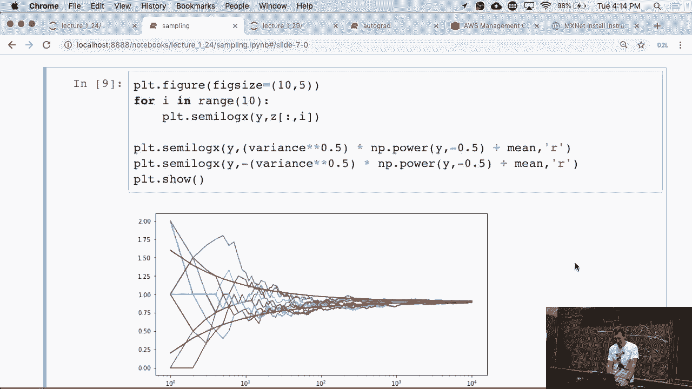

 Okay。