# P14：14. L3_3 Setting up a GPU instance on AWS - Python小能 - BV1CB4y1U7P6

 Okay， so the first thing we do is we go to a WS dot Amazon。com and I've already logged。

 in and let's actually launch an instance。

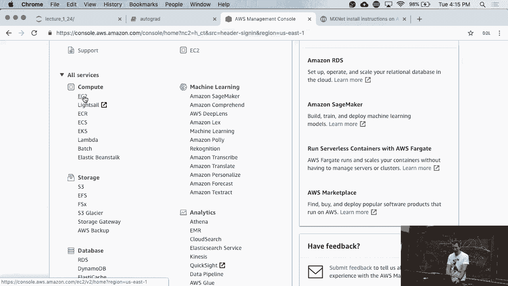

 So this time I've taken care， making sure that I launched the right instance。

 And I select let's say the deep learning base army Ubuntu version 15。0。

 Now if I want to run things on a GPU I need to select an instance that actually has a， GPU， right？

 So don't select something like a T2 instance because it does not have a GPU。

 So matter of fact your Raspberry Pi at home is probably faster than a T2 instance on average。

 or something like that。 So a T2 nano is about the smallest you can get。 Anyway。

 so let's take a GPU instance and one that I'm going to pick is a P2 X large。 Okay。

 now let's quickly illustrate the issue of the spot prices。

 So let's search for that and let's look for on demand instances on demand pricing。

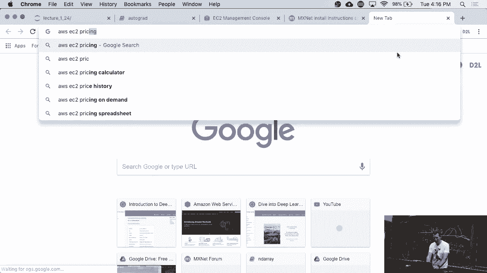

 And this is in Ohio and if you were to go somewhere else it would cost more。

 So these are GPU instances。 So P2 8X large has 8 GPUs， P2 16X large has 16 GPUs。

 The one that we're interested in here is a P2 X large that will be probably good enough。

 for most of what you're doing。 If you have projects that need a lot of compute， talk to us。

 we can help you with that and then， those circumstances should you have to pay， right？

 So we'll help you， we'll get you credits but we're not going to hand out blank checks to。

 everybody because at least we want to know what you're going to use it for。

 So no Bitcoin mining on AWS credits。 I mean it's a bad return right now anyway but still。

 In any case， if you look at the P2 X large， they cost about 90 cents an hour。

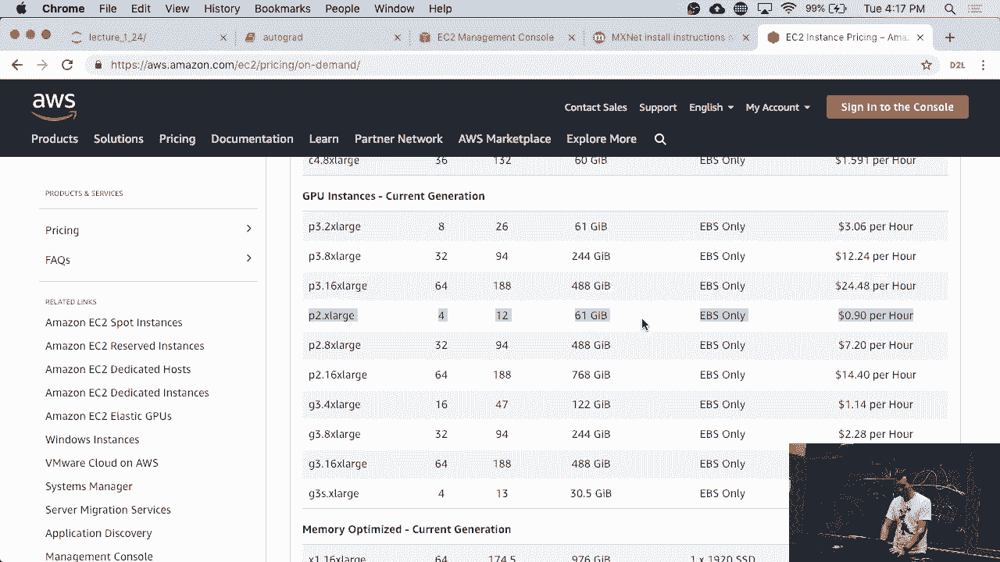

 And let's just look at that。 So that's what we pick。 Now let's look at spot instances。

 So those spot instances are a lot cheaper， right？ They're something between 37 and 30 cents an hour。

 Now you might wonder why on earth would people pay different amounts for that and where do。

 those spot instances come from in the first place？

 Spot instances are essentially surplus instances that currently nobody's really using at full。

 price because AWS tries very hard to make sure that when anybody comes and says hey I。

 want to have a machine， you need to have access capacity around。 So therefore we have some space。

 And rather than having those space sit idly， Amazon auctions them off， essentially eBay， style。

 And you get quite a bargain but there's a cash。 Catch is。

 if at some point somebody else comes along and is willing to pay either more on。

 the auction or full price while you're out。 The good thing is you don't pay for that last hour where you got kicked out。

 So in any case we actually don't want to get kicked out so we're going to bid a reckless， 50 cents。

 Don't make it a--that's still a bargain relative to 90 cents that you'd be paying otherwise。 Okay。

 now next add storage。 And here it's 50 gigabytes， mind you when that machine goes down those 50 gigabytes are。

 gone。

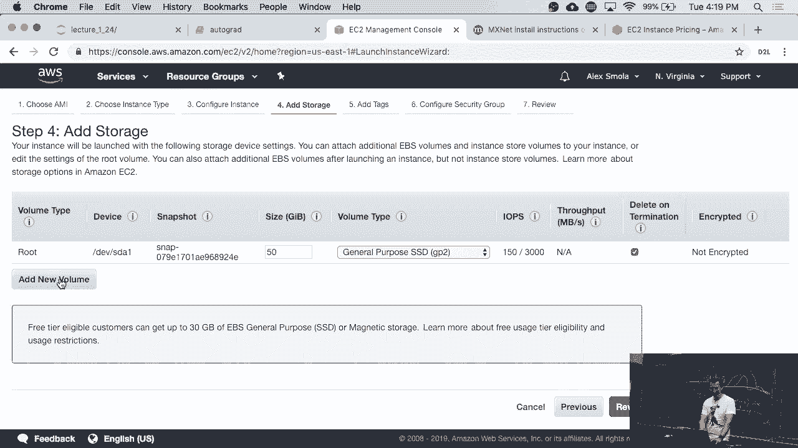

 So let's add a new volume and I'm going to--well， okay let's just create a new one for now。

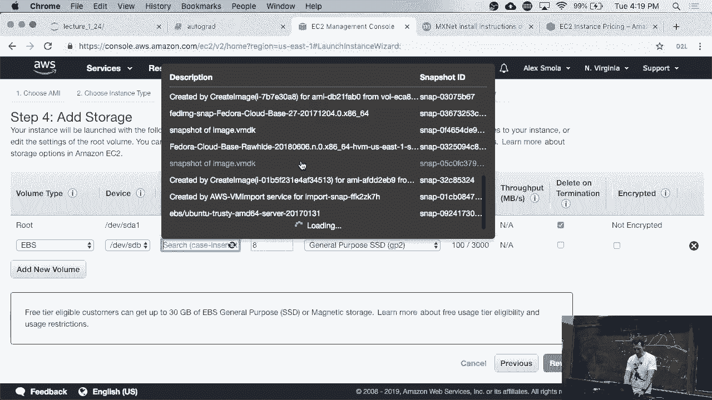

 So when I could snapshot this and so on but in any case let's do that。

 So this is going to be persistent so I can reuse it。

 Think of it like a USB key that you're attaching to it， right？ Going to add some tags。

 no security group， fine， insecure open to the world。 Okay。

 this is telling me that it's going to cost。

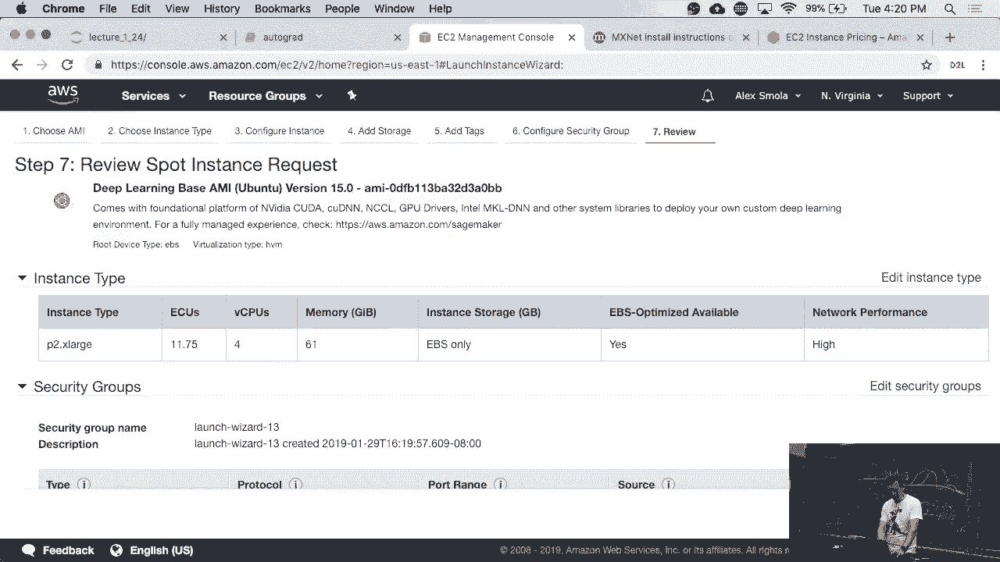

 And so now I don't have a key pair on this machine so start 157 and I download this key， pair。 Okay。

 this is now going to request the spot instance。

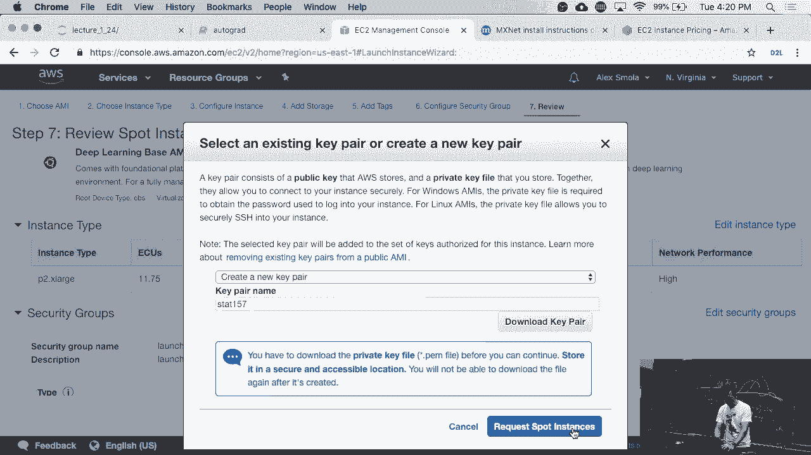

 Okay， here's spot instance is now being created， that's good。 View spot requests。

 And lo and behold this was actually fulfilled。 Great。

 So now I can click on it and it will tell me that it's initializing and doing its thing。

 In the meantime let's quickly go and do two things。 Let's quickly create an SSH directory。

 SSH keygen and then I would go and move this key into， SSH。

 And it may not agree with that simply because right now this is--no actually it should be， fine。

 We'll find out。 Okay， so here if we look at the instance we'll see that it's initializing so it's doing。

 its thing and here's the public IP number。 Okay， so SSH minus identity start 157 PEM， Ubuntu add。

 Okay， so since the first time I'm connecting to this machine it will ask me whether I really。

 want to connect to this and yes。 And basically it， you know。

 complaints that my SSH key is too insecure so it'll force me， to fix this。

 And so I'm going to use CH mod minus read A。 Okay， so CH mod 400。 Yep， now only I can read it。 Okay。

 good。 If we ask this agent in the machine now， I mean--so。

 Now at this point we can go and follow the install instructions that are posted for instance。

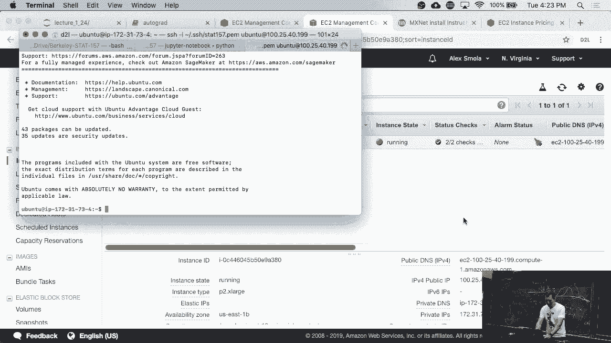

 on the forum。 This is really just combining things from a couple of slides。

 Now here's one important thing and this is where a couple of people got stuck。

 So this machine has different versions of CUDA installed， user。 You'll see that it has CUDA 8， 9， 9。

2 and CUDA 10 installed。 And in particular--it currently defaults to CUDA 9。0。 Right。

 So that's not necessarily what we want。 So we need to change it， let's say to CUDA 10。

 So actually the instructions have CUDA 9。2 pointing to it but anyway let's do this。

 So I just created some link。 If you've never seen sudo before。

 that just means you're doing that as root。 Okay， fine。 So now we have CUDA working。

 Next thing is we need to get CUDA。 Okay， let's execute it。

 It will now ask me whether I accept the license terms， yes。

 You can change all that with default flags but does it automatically。 Okay， fine。

 It sets this all up。 Yes。 Okay， now the reason why I have to do this is because now it's updated my path and now。

 if I want to find out whether Conda is in my path， well there we go。 Okay， good。

 So now we need to set up the appropriate environment and we're going to do this。

 And the only difference is that now we need to pick CUDA 10。0， so CU100。

 So now if you look at the ammo file for Glue on for the environment， you'll see that it。

 needs Python， Jupyter， Matplotlib， Pandas and then CUDA 100。 So if you're on a CPU version。

 you do not want to install the CUDA version， right？ On the other hand， if you need the GPUs。

 then well you need to do that。 So NVIDIA SMI shows me that I have one GPU right now on this machine。

 It's a K80 and it also shows that it's currently using the CUDA 10。0 version。 Okay。

 Everybody comfortable with that so far？ Okay， good。 Okay， let's do this。

 Conda in create and then source activate。 So it now does its thing and installs quite happily as it would。

 It takes a little while。 While it's doing that， actually let's just open another shell and already set it up with。

 port forwarding such that we can do this automatically。

 So if you don't know how to do port forwarding， let's go to d2l。ai and in the appendix it actually。

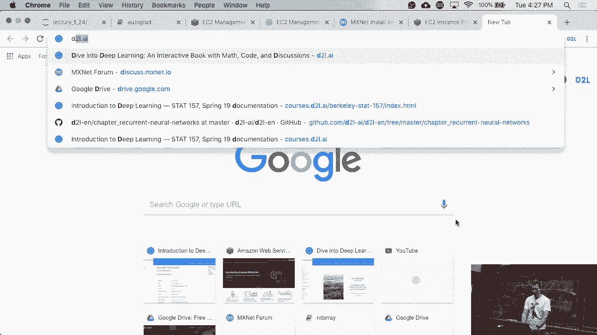

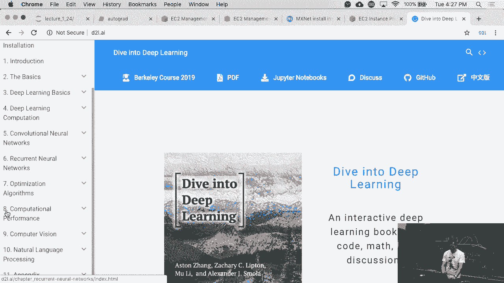

 will give you fairly detailed instructions on how to use Jupyter。

 So what we'll have to do is we'll have to add this to my SSH command。 SSH minus i。 Okay。

 Does anybody remember the IP number？ No。 125， 40， 199。 And now， okay。

 Actually I'll have to do something a little bit differently here。

 The reason is that I already have a local version of Jupyter running。

 And that's already running on port 8888。 So if I set the port forwarding to the same port and I basically have two services going。

 to the same port。 That doesn't work very well。 So let's just pick 88090。 Okay。

 And this should be fine。 And I used the argument in the wrong order。

 So let's log out and try this again。 And now things are fine。 Before that I had the error message。

 Let's just pull it up here。 Channel setup forward listener TCP/IP cannot listen to port 8888。

 Because there's already server running。 And we local Jupyter server。 So we're almost done。

 Please worry I have to do an install。 So actually I can just do this here。 Okay。

 So activating glo on。 And now Jupyter notebook。 And of course it's supremely unhappy because there's no local machine there。

 No local browser there。 So now we need to take this line here。

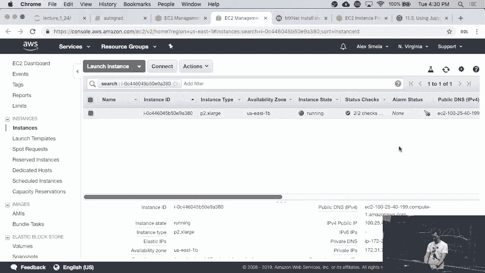

 Copy it into the browser。 And make one minor edit。 Because we need to connect on that new port。

 And lo and behold， we're now connected to our machine in the cloud。

 There are a couple of pitfalls to this。 So remember we launched a spot instance。

 So that spot instance unfortunately means that it could go down anytime。

 So this is not a nice situation to be in。 But fortunately we allocate as an extra disk。

 So we have this disk， XVDB。 So if you were to type in free， you would see that XVDA is our standard。

 It's basically hard drive number one。 And hard drive number B is XVDB。

 And right now it's not set up yet。 So sudo fdisk diff XVDB。 Right now there's nothing there。

 So let's create a new partition。 So remember that was the eighth gigabytes partition。 New partition。

 primary partition number one。 Make it all defaults。 And yeah。

 And it's already set up as a Linux partition so everything's good。 So I just write it back。 Good。

 Now I need to create a-- yes？ [INAUDIBLE]， That's the next line that I'm going to type in。

 So right now it's just a partition that's tagged as a Linux partition。

 The next thing I need to do is I need to set up X4。

 And I need to give XVDB1 because that was the primary partition one。

 And of course it's root because I'm formatting something。 Now I need to do one more thing。

 I need to create a local directory。 Payload， let's say。 And now I'm going to mount VDB1。

 And so now we have this thing mounted on Home Ubuntu Payload。 This is our second disk。

 That disk will not die if the machine dies。 So now let's go to Payload。 And of course this fails。

 The reason why it fails is because I mounted it as root。

 So now the last thing that I need to do is CH1A plus RvX。 This is insecure but fine。

 This basically means anybody can write on it。 Now it works。 Good。 And so now you can write on it。

 This creates partition。 And so that way if you have to do longer experiments and you want to make JWs。

 Creates go a little bit longer， maybe a factor of two or three more。 Do that。

 Now last thing about the costs and the pricing and the bids， you're not necessarily going。

 to pay your maximum bid。 It's just that you're not never going to pay more than your maximum bid。

 So it's just like eBay。 Let's say you want to buy that new laptop for up to $1。

000 in the second highest bid， a $700。 You're going to pay $700 for this laptop。

 So this is a second price auction。 And you can prove that it's incentive compatible。

 What happens on AWS with spot prices is a little bit more complicated。

 just there are multiple machines and so on。 And the math works out a little bit more interestingly。

 If you're interested in that， take an EC class like electronic commerce class。

 computational advertising and other things。 There's a lot of really nice stuff in there。

 Way beyond the scope of this class。 And so with that， we're going to do one thing。

 namely we're going to kill it all。 And then I hand over to move。 Shut down the notebook server。

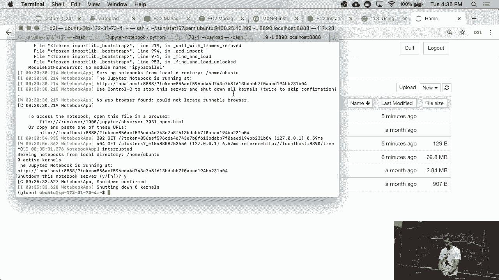

 OK， fine。 Locked out。 And now， so I can always click on instances。 And I can see this one's running。

 And actions， instance state， terminate。 Terminate this instance。 Now it's gone。 OK。

 so that was the very quick overview of how to set up a machine。 You can actually script all of this。

 such that you don't need to do this through the， command line every time。 Right？

 So you basically build a script。 Then you can actually launch spot instances from the command line。

 Execute that script there。 And then in five minutes later。

 after you've come back from making yourself a cup of coffee， you have the machine ready。

 I strongly recommend that you do that。 It's fairly straightforward scripting。 OK， yes？ [INAUDIBLE]。

 Well， yes， there。

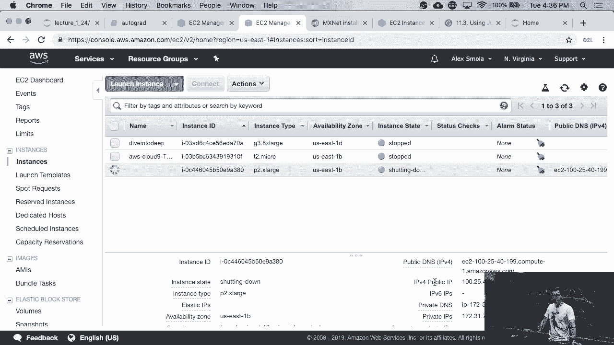

 The only thing is you have to put that into some executable file。 You'll probably need to put like。

 you know， use a bin bash or whatever in there。 You probably want to combine this with photo。

 Those scripts are not available， but I'm fairly sure that there are tons of similar scripts。

 available on the internet if you search for set up a spot instance on AWS script with， photo。 Well。

 we can do that。 OK。 And so the first link has something in there。 OK。

 This is a little bit more detailed。

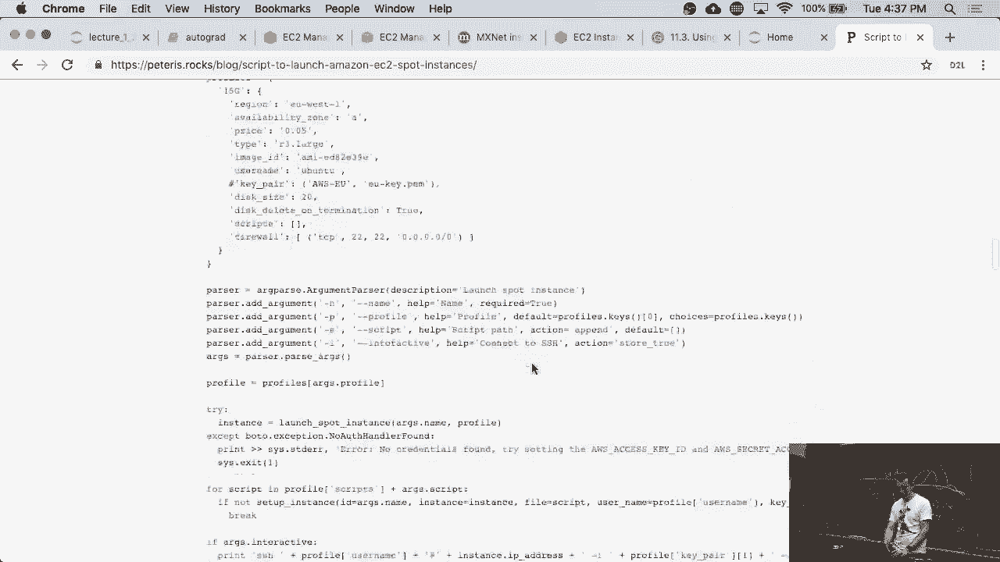

 There's a whole bunch of other interesting things， because you can pick instances and。

 so on。 But this was the--let me Google that for you type of solution。

 There's tons of stuff out there。 Yeah， use one that works for you。 OK， good。 So with that。

 I hand over to the grandmaster himself， Mu， and he'll talk about autograph， and related things。

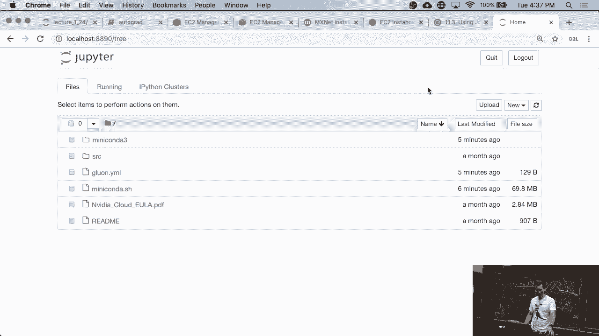