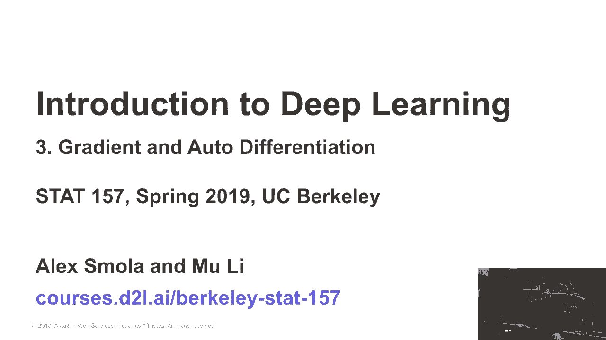
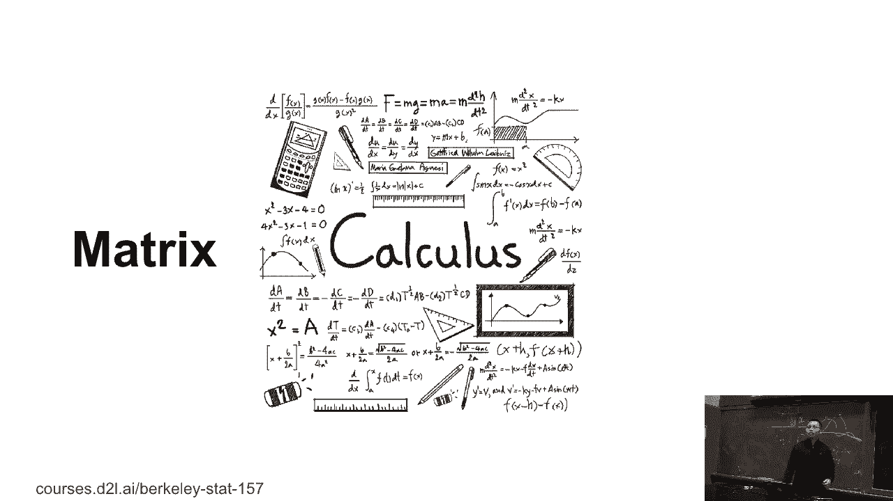
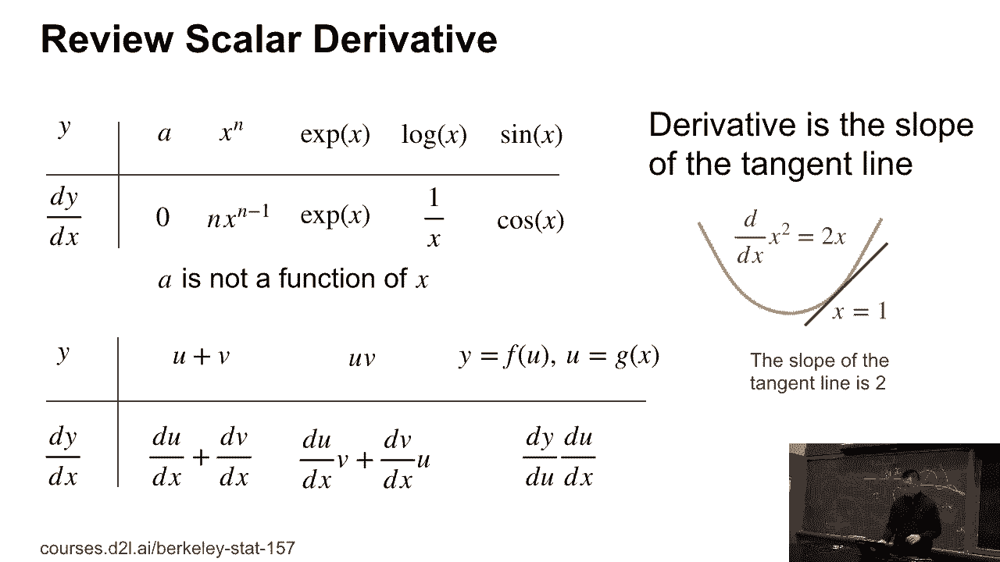
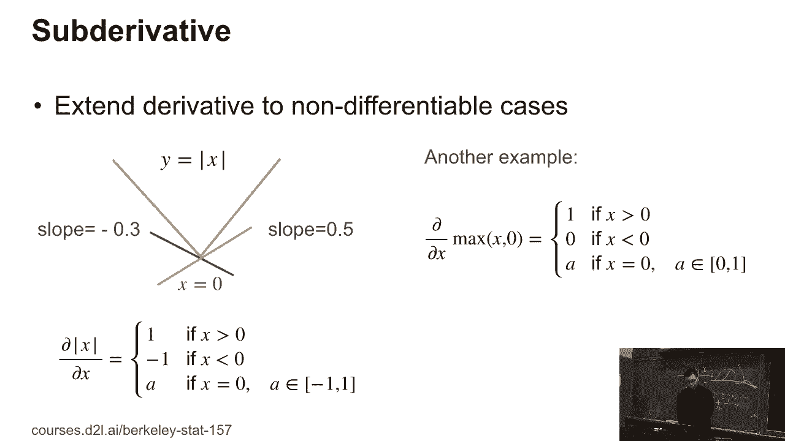
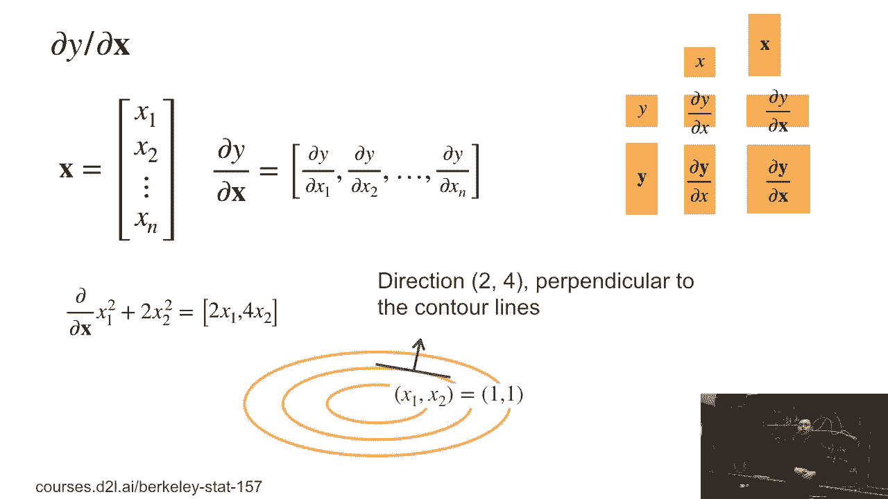
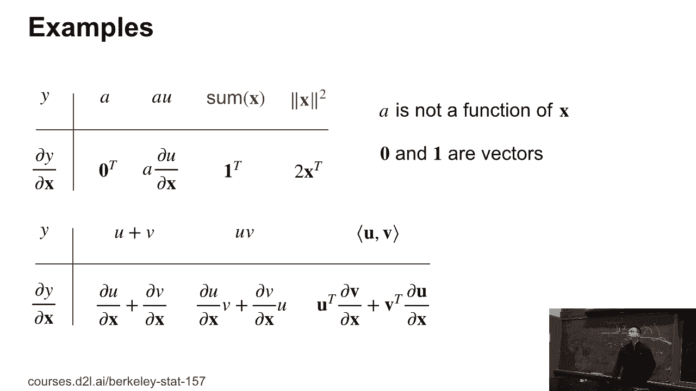
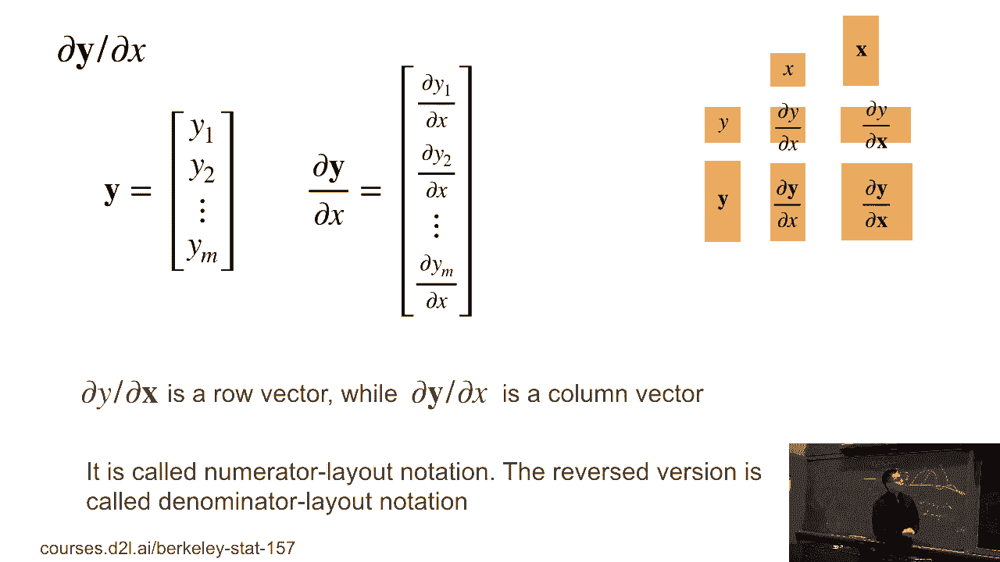
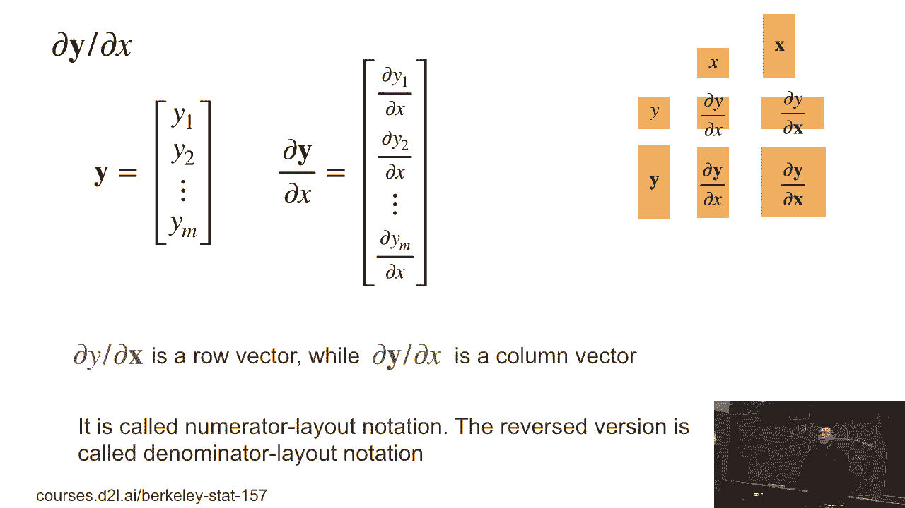
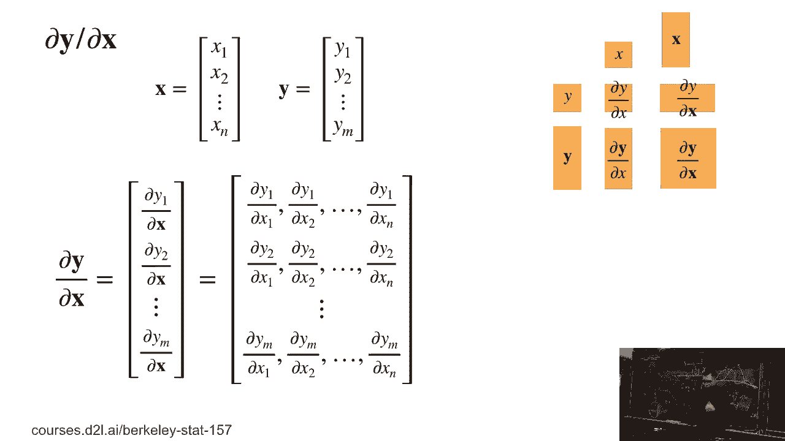
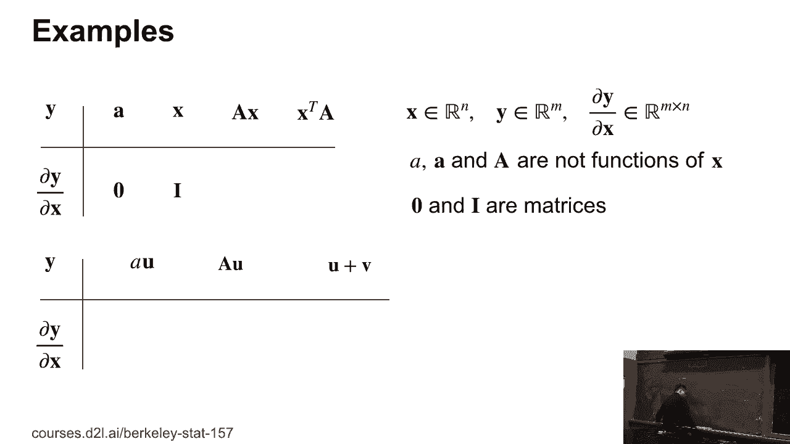

# P15：15. L3_4 Automatic Differentiation - Python小能 - BV1CB4y1U7P6

 So a lot less storage， some basic metric calculus。

 So how many of you guys knows metric calculus before？ OK， so good， like 20%。

 But I guess everybody should know scalar derivatives。 So here， y is a scalar。 x is scalar。

 So given y is a function of x， so we're going to compute， dy over dx。 Now if a is not function of x。

 so what's the results？ 0。 0， good。 So if x to the power of m， what's the results？ [INAUDIBLE]， Good。

 So that's--， everybody should know that exp is dx， exp， log x is 1 over x， and sine is cosine。 Also。

 we have if it's u plus v， we're， going to have du over dx plus du over dx。 If the u times v。

 we're going to have du over dx times v， plus dv over dx times u。 Similar for general。

 if y is a function of u， u is a function of x， we can write it down as dy over du， times du over dx。

 So that's it for scalars。 It's pretty simple。 The one important concept here is that the derivative。

 is a slope of the tangent line。 So here I draw a figure of the square of x。

 So there is a yellow line。 And at the point x equals to 1， we， know the derivative is 2x is 2。

 so that the slope of the tangent， line is 2。 So that's an important concept。

 We're going to use for gradient descent letter。 The other concept here is that not every function's。

 defrachable。 Similarly， at the first class， we talk about the L1 norm。

 It's actually a simple version。 It's the super value of x。 So at x equals to 0， at this point。

 it's not defrachable。 So every nigh， we can draw every nigh under the curve。

 And the slope can be the sub-defrachative。 So this is generalized， the derivative concept。

 And it's pretty useful， because we have a lot of functions， in deep learning。 Actually。

 it's not defrachable。 So here， in this particular case， the sub-derivative。

 of absolute value of x equals to 1， if it's f larger than 0， minus 1， x more than 0。

 At x equal to 0， it can be any value between minus 1 and 1。 In practice。

 we kind of choose a particular value。 It can be either minus 1， 1， or 0。

 Another example is the max operator。 It's also an important operator。

 We can use for max pooling method。 So given max x to 0， if x larger than 0 is 1。

 if x more than 0 is 0。 And at the point x equal to 0， we can choose any value， between 0 and 1。

 Usually， we pick up either 1 or 0。

 So now， we kind of generalize the scalars to vectors。 So that's a key thing。

 because all the neural networks， machine learning， we cannot talk about vectors。

 and matrix and tensor。 So let's first look at how we can make x and a y into vectors。

 So if both x and a y are scalars， we know the gradients， is a scalar。 So gradients， actually。

 if it's a vector， we call the gradients。 So now， if x is a vector， it's a column vector。

 And y is a scalar， which is the first row。 We cannot get partial y over partial x， can still vector。

 But now it's a row vector。 Similarly， if x is scalar， but a y is a vector。

 so the gradients will be a vector， has a same shape as y。 In the more general case。

 both x and y are vectors。 Now， we get the matrix of the gradients。 Now。

 we cannot dive deep into how they're calculated。

 Now， in the first case， x is a n dimensional vector。 It's from x1 to xn。 You have n elements here。

 Then， y is a scalar。 Then， partial y over partial x is a row vector。

 And the i's element is a derivative of y， with respect to xi。 So here， we should partial notation。

 This is a generalized D-rotation to vectors。 So let's look at the example here。

 If y equals to x1 squared plus 2 times x2 squared， then the first element of the gradient。

 is with respect to x1 is 2 times x1。 The second element is a respect to x2 is 4 times x2。 Now。

 the most important thing here， is that the gradient is a direction that you change the value， most。

 So in particular， at this point， x1 equals to 1， x2 equals to 1， we have a gradient is 2 and 4。

 So that is a point of direction perpendicular， to the counter line。

 which if we move the point along， these gradients， we can increase this value。

 We can increase the value of y。 So if we can decrease this value。

 we just move along the opposite direction of the gradients。

 So that concept is the fundamental thing， for the gradient descent for how we actually。

 solve the new anorems。

 Then， look some examples here。 Why the scalar？ And now x is the undimension vector。

 A is a non-function of x， so what's the result here？ You do element by element 0。

 It's a row vector of 0， which 0 is， a undimension of an nth vector， but it's a row vector。

 So how about 8 times u use a function of x？ So it's actually 8 times the gradient of u。

 with respect to x。 Another one， if we can assign element of x to get a scalar。

 then we get the all-one vectors。 It's a row vector again。 And the last one is the square of l2 long。

 Then we get 2 times the transpose of x。 We can still have all these rules here。 u plus v， u times v。

 and similar to the scalar options。 The only thing here is， like， in the product of u and v。

 we get u transpose times partial v over partial x， plus the transport of v times partial u。

 partial over partial x。 So we know that u is a row vector， and then partial v and partial x。

 that's a matrix。 A row vector times a matrix， you still get a row vector。 So as a result。

 we still get the row vector， that's graded。

 OK， so now if we can switch--。

 question？ [INAUDIBLE]， Yes， so we cannot talk about--。

 is that actually on the-- if both are vectors。

 we call the Jacobi matrix。 So now we switch。 Why is the vector？ X is scalar。 So in this case。

 we cannot get the column vector here。 So the i's element of the vector is the yi， partial yi。

 over partial x。 So y-- we changed the order。 So remember that if x is a vector。

 we get the row vector。 If a y is vector， we get a column vector。

 So this called the numerator layout。 We can transport as well。 We can let-- if x is vector。

 we get the column vector。 And if y is a vector， we get the row vector。 We can just switch。

 then we could denominator layout。 So that's a homework we're going to have in front。 But actually。

 we can change this to--， we are going to make a little bit trouble later。

 but we have a homework for that。

 In the last case， both y and x is a vector。 So the matrix we call the Jacobi matrix。

 So we can look into that。 We know that if y is vector， we get our column vector。

 So this means we have--， each row is we are being the partial yi over x。

 And partial yi over vector x is going to row matrix。 Sorry， it's a row vector。 So at the end。

 we got the matrix here。 So we can give some examples， having more clear understanding。

 of that。 So now we have both vectors y and x。 Assume a is a constant and a vector of constant。

 So what's the result of right now？ OK， all zeros。 So it's a matrix。 It's all zeros。

 The second question is like， if y equals to x， what， is partial x over partial x？ OK。

 identity matrix。 The reason is because-- let me write down a bit。

 So we know that the i's row and the j's column will be xi。

 So it equals to 1 if i equals to j and 0 if y， is not equal to j。 So we got identity matrix here。

 The second question is like， how to do a， which is a matrix， a times x with respect to x。

 So let me do that again here。 If a x-- so now we know this is a vector， partial。

 So we know that it's equals to partial a x。 So i's element with respect to x。

 So if we can write a to be a 0， a 1， it's the i's row of a。 And we stack vertically， we get a n。

 Then here， a x， the i's element will， be the inner product of a i times x。

 So which means here is the inner product of a i times x， equals to a i。 We talked about previously。

 So which means is actually， this is equal to a i。 And we stack a i together。 We call a。

 So the answer is a。 If we do a transpose， we can actually transpose--， we can do transpose。

 That's also pretty simple。 Just one。 Because for vector， you can transport the vector。

 It's a row vector。 Column vector doesn't matter。 So actually。

 it's equals to-- we transport y equals to a， prime x。 And so we get the transport a。 That's it。

 The other thing， we have a lot of similar thing for matrix， and vectors here。

 A times u is-- if a is a constant， it's a scalar。 We have a times partial u over partial x。

 If it's matrix， we put the matrix out。 And if the u plus v similes before。

 So now we can make more generalized case。 If x is a matrix， we cannot dive deeper into the details。

 how to calculate them。 But we can't give you the shapes， which is you can infer。

 what is actually calculated。 Let's look at the first step， though， when y is a scalar。

 So if x is scalar， we get a scalar。 x is vector， we get a row vector。 If x is matrix。

 we get a matrix。 But look at the shape。 X is u by k matrix。 But now。

 the gradient is like k by m matrix。 We reverse the shape here。 We do a transpose here。

 Look at the first row of column。 If x is scalar， if y is scalar， you get a scalar。 y is a vector。

 you get a vector。 Is that has the same shape？ If y is a matrix。

 you get a matrix with the same shape。 So now， look at the second row。 When y is a vector。

 the interesting case， is that if x is matrix， we got the shape is a 3D tensor。 The tensor shape。

 the first is shape m， from the vector of y。 y is the length m， n's vector。 The second k at n。

 shape from matrix A， but reverse the matrix here。 So it's m by k by n。 The last column。

 in the last row， if y is a matrix， x is a vector。 We still get-- we copy the matrix shape。

 and then got the n's of the x。 In the most complicated case， both x and y are matrix。

 We get a 3D tensor， a 4D tensor。 The first two shape， m and l， is a copy of the front y。

 And the third and the fourth shape， can't earn its copy for x， but reverse it。 So in general。

 you can get any arbitrary y， and arbitrary shape x。

 We first put the y shape before and reverse the shape of x， and the pen at n。

 So that is how we can do tensor calculus， actually。 Okay。

