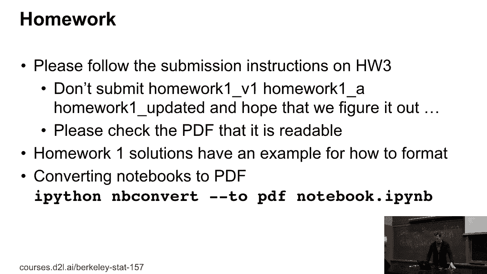
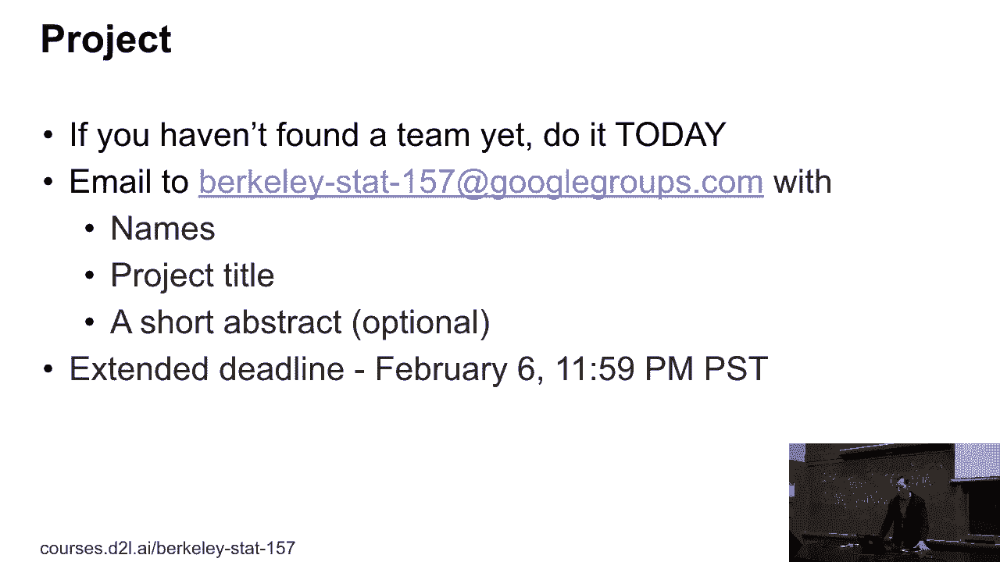
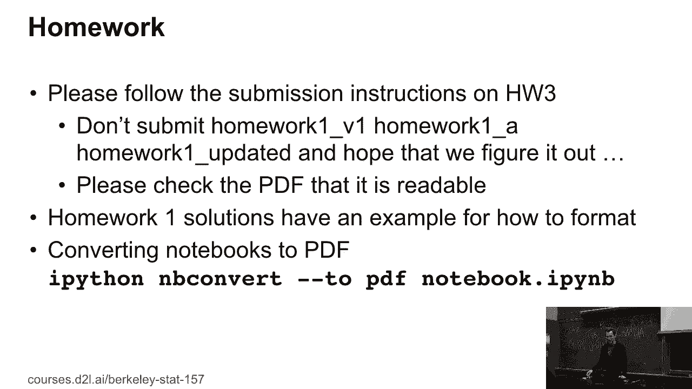
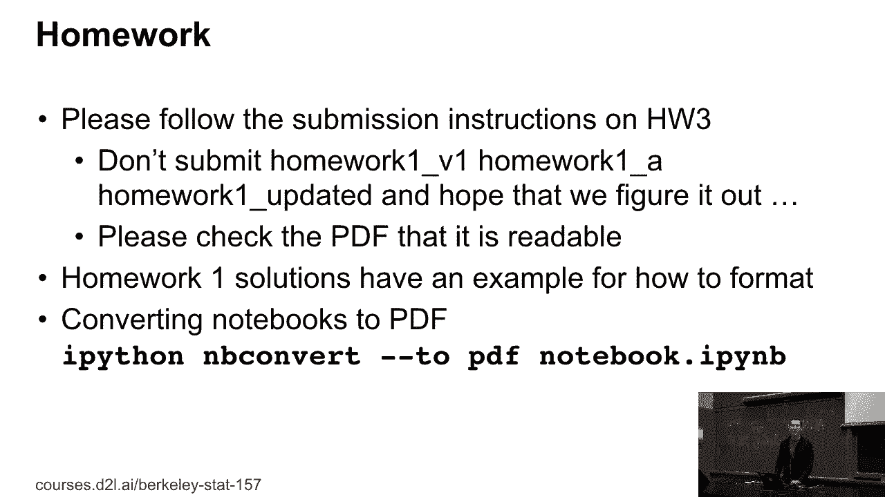

# P17：17. L5_1 Homework and Project Logistics - Python小能 - BV1CB4y1U7P6

 Okay。 So， welcome to today's class。 Okay， so welcome to today。 A couple of things。

 So， few logistics updates。 The first thing is， yeah， those， projects。 the registration was due yesterday。 Okay。 Who has not registered for the， projects yet？ Okay。 So。 I figured that that was what， I was going to happen。 So， you have time until。 tomorrow to find a team and register for the project。 I see two hands up。 Yes。 You first。 Okay。

 Good。 So。

 Send an email to that email address with names of your， teammates。 project title and a short abstract。 So， the project was due on -- was due yesterday， but will。 give you a grace period until tomorrow。 Okay。 There was another question。 If I submitted the project by uploading a PDF with those， things to my -- so。

 our TA's will go through this， and I hope they'll find it。 But I think you can make their， own。 email。 Okay。 So， thanks。 Who doesn't have a teammate yet？ Okay。 Everybody who does not have a teammate yet， keep your hands up。 Okay。 So。 who has a team of size three？ Size three？ Okay。 You guys raise your hands。 Well。

 raise them high otherwise。 Okay。 So， the thing is， if you don't -- if you have a small team。 here are some teammates， some prospective teammates， meet up， with them after the class。 Well。 you just -- if you have a， team of size four， likewise， take on some extra team members。 They all want to help。 They all want to learn。 So， do that。 Yes。 The project title can change。 Yes。

 So， you could have an obstrus project title right now and we， are not going to care。 So。 you can put as your project， title， watching paint dry。 Okay。 Now。 I wouldn't recommend that because it's a little bit silly。 But this is really just to make sure that you even have a team。 Right？ Now， in one month from now。

 there will be a short presentation of what you've been up to， so far。 Everybody gets five minutes or four minutes of， embarrassment up here on stage。 Okay。 By that time。 you don't want to have watching paint dry in it， anymore。 Yes。 Is there like -- is there like a -- is there like an example that。

 -- like what you recommend that you should attempt to have， a game？ Okay。 So， okay。 So。 let me go over this。 So， for tomorrow， all you need is names and a project title。 And if you want to put a little abstract in there， it's good。 If not， it's also okay。 If you're short of ideas， that's， what the TAs and that's what Mu and I are good for。

 We can help you。 But you need to come to the office hours and， we can talk about ideas。 Or talk to your friendly lecture， here at UC Berkeley who's maybe your advisor or you want to be。 advisor。 Right？ Or talk to some PhD students or some other fellow students。 Or just pick something really cool。 Right？ So， we can help。

 but we're not going to force you to do what， we suggest。 Right？ Okay。 Now， within the next month。 you want to get to more than， watching paint dry。 Within the next month， you want to。 have -- and this is what we'll be doing in four weeks -- a two-page， document up to two pages。 at least one page but no more than， two pages。 That describes what you're going to do。

 Some idea of how you're going to do it。 You don't have to have done the research yet。 but at least some， idea of how you're going to approach it。 Okay。 Watching the paint dry。 Okay。 Fine。 Requirements。 Camera。 Video recording equipment。 Patients。 Right？ Okay。 And then you want to have some idea of where you， for instance。

 going to get the data from or why it matters。 So， in other words。 this is the equivalent of the pitch deck。 Right？ And you get two slides at most。 And yet。 most get four minutes because we need one minute for， changing over。 Okay。 So。 if you get more than that within the next four weeks， it's awesome。

 And I'd strongly recommend that you， do because as the semester progresses， everybody gets busy。 And then in the end you have the end of semester madness， which， well， I guess means。 given that you're not only taking this， course， you will have to have madness from all the courses。 Don't do that to yourself。 Start early。 Okay。 I know we're all stress puppies。 We included。 So。

 guess when some of those slides were made， right？ So， yes。 Nonetheless。 you're doing yourself a favor if you start early。 I guess I'm not saying you're obvious here。

 Homeworks。 So， it turns out that people had lots of different。

 ideas of how to name their homeworks。 And in some cases。 several files were in the submissions folder。 So， this is maybe not exactly what happened。 but something like。

 this， somebody submitted a folder containing homework version 1。

 homework a and homework updated。 And Rachel and Ryan had the questionable pleasure of having。 to figure out which of those three homeworks is now the one that， you actually meant to submit。 Don't do that to your poor TA， right？ Because they will pick one and there's no guarantee they'll pick。 the right one。 Okay。 There will be some formatting。

 instructions in homework 3 that are more prescriptive。 Secondly。 we'll put out the reference solution for， homework 1。 which is essentially the Frankenstein-ish combined， solution of。 while solutions that you submitted for the， homework。 The good news is whoever submitted it did。

 it did actually really well。 But not everybody submitted。 Okay。 Lastly。 if you want to convert notebooks， to PDF， you can go to stack overflow。 You look at this slide which says IPython in B convert to， PDF notebook。ipi in B。 This will give you a PDF。 Yes， question？ Latex is now very well supported。 It's not really Latex。

 it's an HTML version of it。 So when we try to， oh， this one， I'm trying to。 try to do the IP converts。 The conversion will stop at the first exception that they have。 with the Latex because HTML not injects。 It's not how to recognize some of my data。 And then so what happens is my homework 2 gets a total of。

 that page like 10 when I have 16 out of 10。 Okay。 Oh， okay。 So a couple of things。 Okay。 So first of all， yes， apologies。 Math。jax is not quite Latex。 There are certain equation environments and so on that it， doesn't like。 There's not much you can do besides using stack， overflow which ones those are。 Secondly， so。

 but secondly， you probably shouldn't have 16。

 pages of solutions。 That means you're doing a way to， diligent job。 Each question。 it's okay to have a reasonably， precise answer。 But kudos。 That's serious work。 Okay。 If you're really in a fix there， submit that particular， solution as Latex。 So， you know。 that's why it's okay to， generate PDFs。 The only thing you need to make sure is that the。

 PDF actually renders properly。 The other thing you can always do。 is you can just print from Jupyter。 And so basically， just， you know。 use the print dialogue of your。

 browser and try that。 That may work better。 One important thing is look at the PDF before you submit it。 So some people submit it broken PDF。 You should check that in general in life when you submit PDFs。 like for a conference or any job application。 Make sure that the PDF that you're submitting is legible。 The home works are included in this。 But yes， PDF is fine。 But overall。

 if you're submitting 16 pages of home work， you're --， I mean， first of all， okay， it's awesome。 Secondly， you're probably investing more time than we thought。 you were going to invest in the solutions。 Right？ But --， kudos。 Okay。 There were -- I think one or two more questions。 Yes？

 >> Is there a requirement that was plotted by review use because， I had an issue that --。 your expert was just -- that my father had to export separately。 and code his files to make the clause work。 >> Hmm。 Just a good question。 It should not export the plot as separate PDF files。 Okay。 So for instance。

 if I just use MBConvert for rendering。

 it will not do that。 So -- so check your notebook conversion utilities。 It should not export plot as separate files。 So something is --， Again， that should not be the case。 We can maybe talk about it offline， but this looks like an， error in your configuration。 Any other questions？

 Okay。 Good。 So -- so far， full logistics。

