# P18：18. L5_2 Maximum Likelihood and Maximum a Posteriori - Python小能 - BV1CB4y1U7P6

 So， logistic regression。 So， the first thing we're going to do is we're actually going。

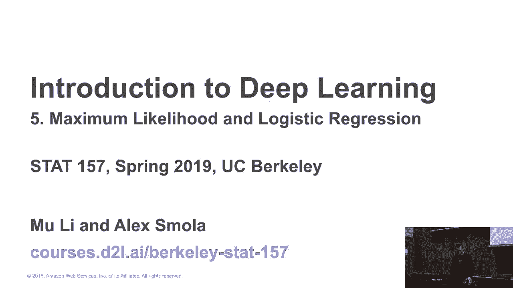

 to go back to maximum likelihood and maximum posterior and so on。 Just to motivate a little。 bit to Y on Earth， we had this weird， you know， least mid-squares loss。 So， maximum likelihood。

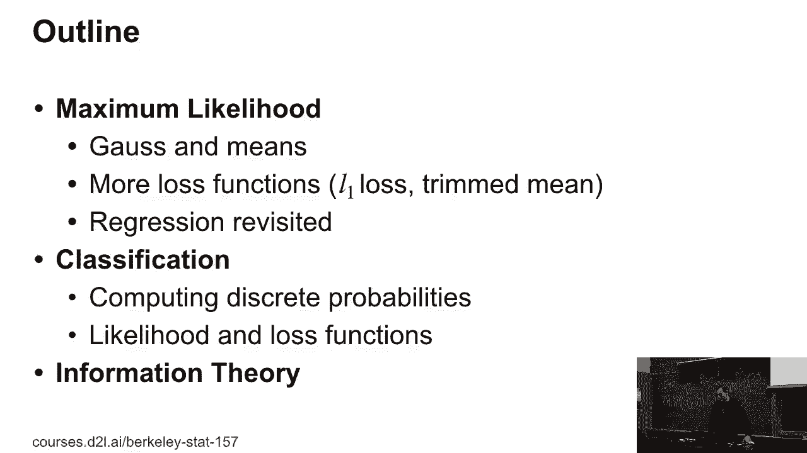

 and maximum posterior。 So， remember this is our normal distribution， right？ So， it's。 P of X is 1 over square 2 pi sigma squared e to the minus X minus mu squared over 2 sigma， squared。 right？ And that's what it looks like。 Pretty boring， right？ And then everybody， knows， well。 you know， if you want to get the mean， well， you take all the numbers。

 you sum them up and you divide by N。 And， you know， maybe， you know， in elementary school， kid or。 you know， something like that， they might already know about averages， right？ And。 they just like take those numbers， sum them up， divide， like， hey， let's divide all the。 cake fairly， you know， sum up all the cake pieces and split them in three， if it works。

 They probably don't know about variance， but， you know， everybody learned at some point， hey。 a good variance estimate is 1 over N， sum of ri equals 1 to N， X i minus mu hat， squared。 Actually。 it's a little bit more complicated if you want to do things right， because you need to， yeah。 But。 anyway， so for now， we're not going to go into any， few nesses here。

 But the obvious question is why on Earth this is actually a good idea， right？ I mean。 this is the first thing you learn， but then why that， right？ And you could， say， yeah。 because that's the mean and the variance of the Gaussian， but， you know， how。

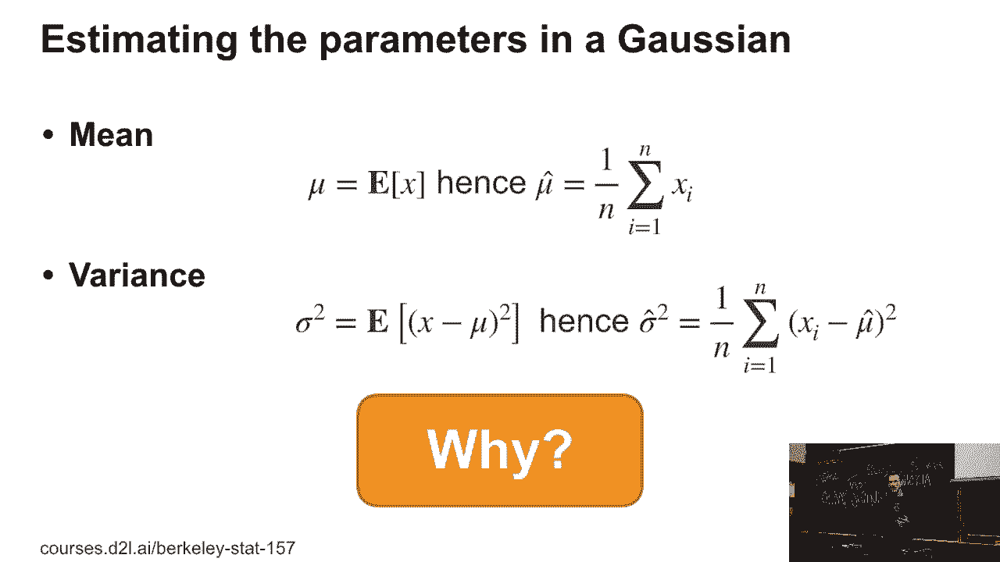

 did we get there？ So， let's actually derive this from first principles。 And we're going。 to do that by looking at something called the likelihood。 So the idea is we start with， some data X。 maybe X1 through Xn。 And in this case， I'm going to assume that the data has。 been drawn from a Gaussian。 So I'm assuming that I have P of X as parameterized by mu。

 and sigma squared。 Okay。 So do you notice that this really weird notation here where。 I'm not using a conditional， but just a semicolon？ Because I'm just treating mu and sigma squared。 as parameters of that distribution as opposed to as conditioned on these parameters。 Right？

 So these are just parameters that I so happen to pick。 Yes？ Pardon？

 Do both versions have any practical difference？ Well， in terms of the interpretation。 they mean different things。 So in one case， I'm assigning。 some statistical meaning to mu and sigma squared as， you know， maybe being drawn from some。 distribution or something。 In the other case， they are just some parameters， like the fact。

 that my coatings up in Poisson or the fact that， well， it rained this morning。 So they， are just。 you know， facts at this point。 And of course， I can go and write it out as I， would。 So I have the product I going from 1 to n， 1 over 2 Poisson squared e to the minus， you know。 xi minus mu squared over 2 sigma squared。 Now， if I want to find parameters。

 that fit the data really well， you know， for instance， you know， I could choose between。 a Gaussian and maybe， you know， an exponential distribution and five other distributions that。 there could be。 But if I pick a Gaussian， then I might go and， you know， maximize P of x。 as parameterized by mu and sigma squared with regard to mu and sigma squared。 So I'm going。

 to maximize the likelihood that the data was generated by the model。 It's not the probability。 because I can， you know， muck around with mu and sigma squared and so at this point it's。 no longer a probability。 But the only thing is that if I look at， you know， those likelihoods。 those numbers will get very， very small as I take many terms。 So the obvious thing you。

 do is rather than maximizing something that goes to zero， you take the negative log of。 it and now you again have something that's fairly well behaved。 So you minimize minus。 log P of x given mu and， well， parameterized by mu and sigma squared。 Okay。 So this is。

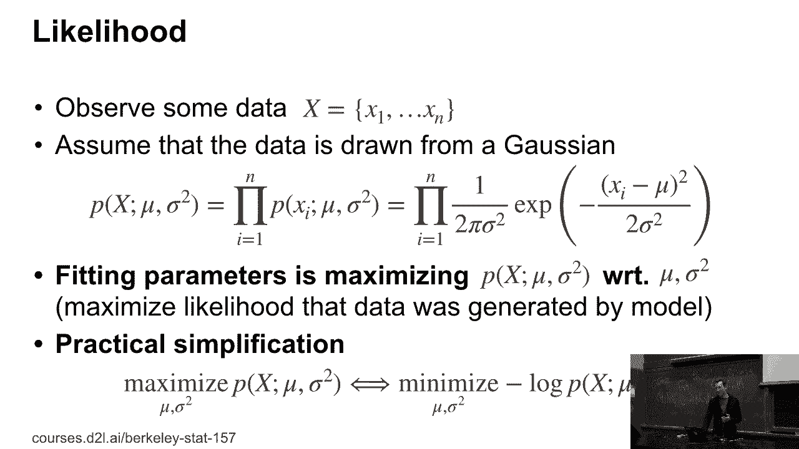

 really just cosmetics right now。 So let's actually do this。 So I minimize minus log P。 of x parameterized by mu and sigma squared and I can decompose it because every single。 observation was drawn independently， identically from the same distribution。 So sometimes statisticians， okay， let me take care of Mr。 Onyate and Indian villages。 Okay。 Okay。

 So I can go and decompose this。 Okay。 So IID。 Independently， independently， distributed。 This is the assumption that you want to see for， your real data。 This is when things are really nice。 Basically， it just means you can use one。 distribution for everything。 It's like a parallel for all two。 Equivalent。 Anyway， so in our， case。

 therefore the likelihood， the negative log likelihood decomposes into terms for every， single xi。 So you get a common term， namely， one half log of 2 pi sigma squared。 So that。 makes n over 2 of them。 And then I get the 1 over 2 sigma squared xi minus mu squared。 So I can just pull the sum in and so I get basically something that doesn't depend on。

 mu and something that does。 And so now if you were to minimize that with regard to mu。 you'd find that this is minimized for mu equals 1 over n， sum of ri equals 1 to n xi。 I'm not going to go and do this now explicitly because you've probably seen that derivation。 somewhere before。 But this now shows that mu is actually optimal solution for that。

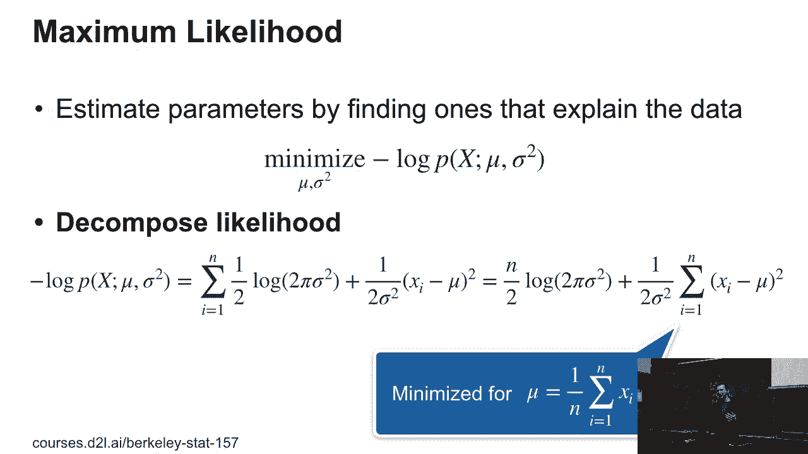

 OK。 Now， if I want to do the same thing for the variance， well， I take the same expression。 that I had above and take the derivative with regard to sigma。 Now， I'm going to do something。 a little bit sneaky。 I'm going to take the derivative with regard to sigma squared， with。 otherwise the expression just gets long and tedious。 And so now， the sigma squared is。

 n over 2 sigma squared minus 1 over 2 sigma to the 4， sum of i going from 1 to n xi minus。 mu squared。 And of course， this needs to vanish for optimality。 And so if I solve for sigma。 I get exactly the well-known variance。 So what does this all have to do with regression？ Well。 it's that this is exactly what we are going to use and what we are using when we。

 are performing a least mid-squares fit。 But before that， let's look a little bit at what。 maximum likelihood estimation really means。 OK。 So if I have， let's say， a likelihood。 of my parameters， and I just happen to pick a Gaussian here but whatever， then maximum。 likelihood will just go and find the mode of that distribution。 OK。 This case， it looks， quite nice。

 Yes？ [INAUDIBLE]， So because pi doesn't really depend on anything， right？

 And since I have the log of 2 pi， sigma， squared， since it's a constant。 it just gets the difference here that-- so the derivative， killed it。 But OK。 So if I have as my parameters for the likelihood， then I am just going to。 pick the mode of that distribution， which is OK。 But if I have that as my likelihood， profile。

 I'm going to pick the thing that's here on the peak。 And that may not be quite。 the right thing that I might want to do。 And here， I definitely wouldn't want to do that。 So something is a little bit off， right， with our maximum likelihood estimates。 Let's pick。 something a little bit closer to home。 Let's say you didn't do the homework。 Then-- OK。

 so that's the data。 Now I can come up with maybe four different parameterizations。 OK。 And they will all perfectly well explain the data being while you didn't do the homework。 One is the dog ate the homework。 OK， homework's gone， right？ Perfectly well explains it。 You。 were abducted by aliens。 OK。 Also， perfectly reasonable explanation for the fact that you。

 didn't do the homework or maybe you were too lazy or maybe your grandmother was sick， OK。 And you know， all those parameters perfectly well explain the data。 Now， of course， if you。 go to the TA， you would probably go and not necessarily come up with the alien hypothesis， first。 Why is that so？ OK。 Why wouldn't you say， "Hey， I was abducted by aliens and that's。

 why I couldn't do the homework。" Yes？ They wouldn't believe it。 They would not believe it。 Why would they not believe it？ Because no one gets it done correctly。 OK。 Because too lazy would lead to the maximum， likelihood。 like according to that function of this stuff。

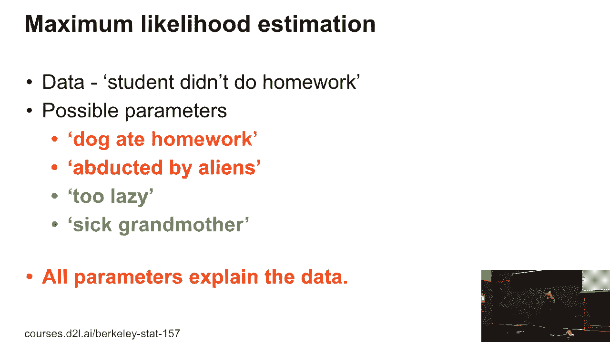

 So let's look at that， right？ So let's look at the posterior probability， right？ So this。 is now where we are turning our parameters from just parameters into something that's。 actually drawn from some unknown distribution of possible explanations。 And if you think about。 you know， the lazy student versus the grandma versus dogs and， OK。

 maybe we are a little bit too close to Area 51。 So let's give the probability for， alien abduction。 OK。 Let's make it 0。01%。 That's pretty high。 And the dog， you know， it's。 pretty close to 1% and the grandma， pretty close to 20% and， you know， with 80% you're， lazy。 So then the posterior probability， just using base rule， would be given by， you know， the。

 likelihood of the data， so P of X， parameterized by W， so given W， times， you know， the prior。 probability of that parameter being reasonable。 And what happens is that now you essentially。 end up adding a penalty term over the parameters to your standard maximum likelihood problem。 So sometimes people talk about penalized maximum likelihood and what they're doing is maximum。

 of a sorority and by the way， regularized max in does the same thing。 So people have invented。 the same algorithms under a lot of tricks， lots of names， and we'll actually see some。 of those in this class。 So in the context of， you know， this class of， you know。 estimating means and variances， I would maybe have minus log of P of X parameterized by mean sigma squared minus log P of。

 actually， in this case， mean sigma squared。 Yeah， so it's a little bit of a typo here。 So the homework， example， while everything has perfect log likelihood。 the prior is obviously vastly different and， so the TA will infer， well。 you probably didn't do the work。 We'll see what's too lazy。

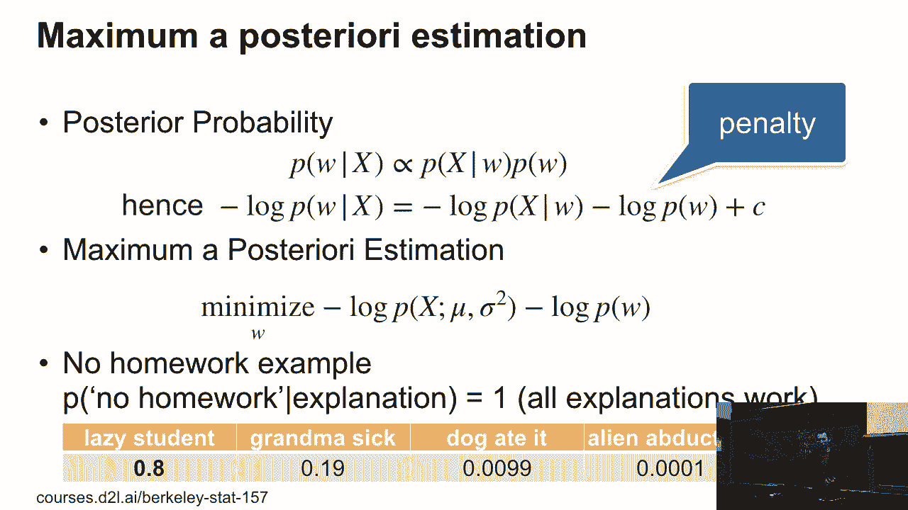

 So yeah， what does this all have to do with what Mu talked about last Friday？ Well， what。

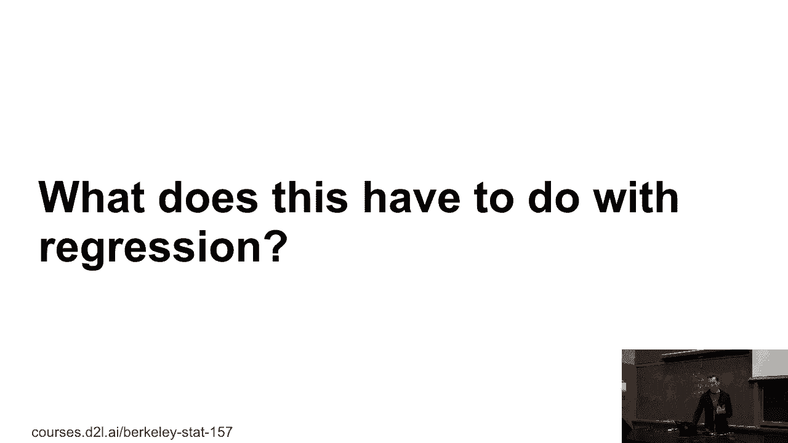

 we basically have in regression is we compare our observations YI with our model F of XI and， W。 And then we have an additional penalty， namely just corresponding to minus log of P， of W。 And so this will make sure that we don't pick crazy parameters。 So in our case。 we have this very simple data generation model， YI is F of XI and W plus epsilon I。 And then。

 maybe you put the Gaussian prior and W。 Mind you， if， you know， you had taken a machine。 learning class about four or five years ago， so this is what I was teaching at CMU for， PhD level。 this would have been a fairly advanced model to implement for PhD students。 You're。 going to do something slightly more complex than that in your homework easily。 It's going。

 to be only a few lines。 Yes？ >> So the question， sorry， can you go back to the previous line？

 I have a question about。

 that。 Yeah。 So are we saying that given if we assume the same for all options of the， priors。 then the maximum likelihood is always the evasion estimator？ So that's true。 If I had a uniform prior， the maximum likelihood and maximum probability， will be the same。 And that would be the reasonable assumption if you didn't know that aliens are。

 very rare and laziness is very prevalent， right？ So， but a good engineer will pick a prior。 that accurately reflects the problem。 So， for instance， if I was to look at the voltage。 just coming from an outlet， I would probably pick a prior which says， well， either the。 voltage is going to be zero volts or it's going to be in the order of 110 volts， right？

 Or if you grew up outside the United States， then quite often you might have 220 to 240， volts。 But this is something a good engineer would do。 And they would pick this as their。 prior and they would use it to adjust what they read off from the measurement device。 when they plug it into an outlet。 Very rarely would you see like a voltage of maybe 50 or。

 60 volts in an outlet。 I would be very odd。 The first thing a good electrician then would。 do is just measure again with a different voltmeter because they wouldn't believe it。 So。 but that's a very good question。 Okay。 Good。 So， now let's look at the optimization。

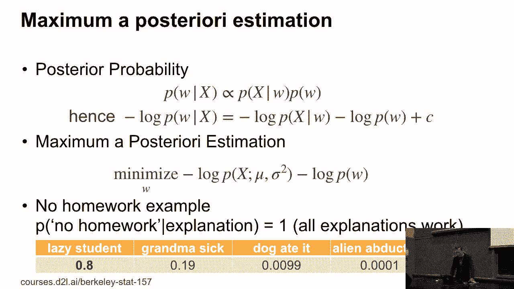

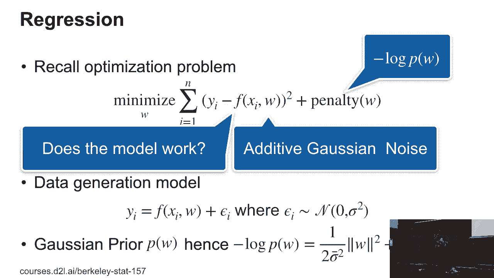

 problem。 This is exactly what we did last Friday。 We looked at， you know， one over。 n or one half yi minus f of xi and w squared。 And then some coefficient times， you know。 the penalty and w。 That was actually not what was implemented。 We actually implemented the。 maximum likelihood solution。 But that's just because we could get away with it because。

 we had so much data in very few parameters。 Okay。 Any other questions？ Yes？ [INAUDIBLE]， Okay。 Good。 So， going from the first to the second line is kind of straightforward， right？

 Because we have the likelihood term。 And the second term is just the Gaussian assumption。 I dropped all the， you know， additive constants， right？ I've just scooped them up on the right。 Now。 if I have this minimization problem， I can always multiply or divide by something。 without the problem really changing。 So， what I did is I divided by n， okay？ And then。

 multiply it by sigma squared。 Okay。 So， what happens is the first term here， right？ That。 just becomes 1 over 2n， the sum。 The second term now acquires n times sigma squared， sorry。 acquires sigma squared over sigma bar squared n。 And I just renamed that。 And then I renamed。 that into lambda。 Mind you， this very， in hindsight， very obvious transformation had people stomped。

 quite a bit when they were trying to compare Gaussian processes with support vector machines。 about 15 to 20 years ago。 And for about one or two years， people were arguing about which。 one was better until somebody realized that it's just a re-parameterization。 Okay。 I'm always。 simplifying things here， but yeah， this led to rather hilarious arguments that meant nothing。

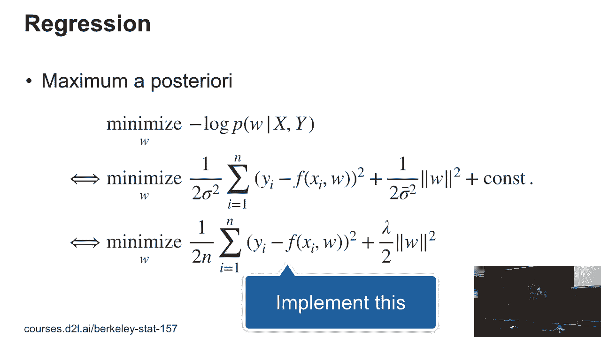

 Okay。 So。