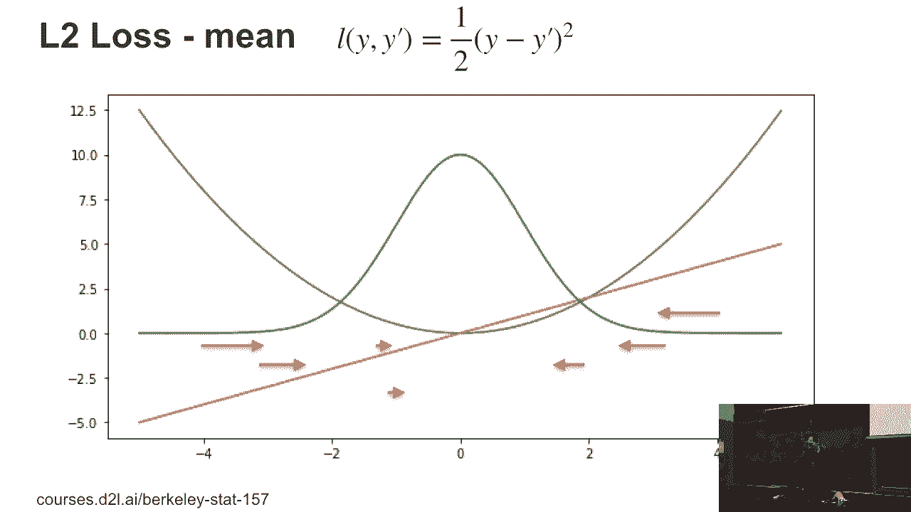
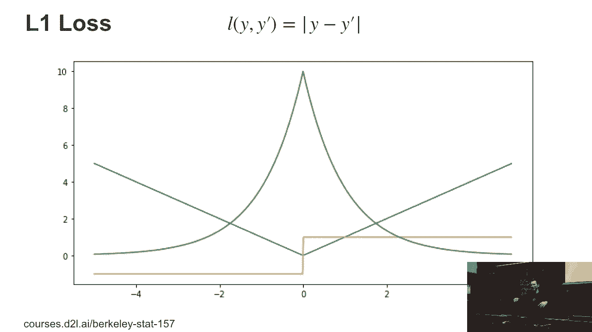
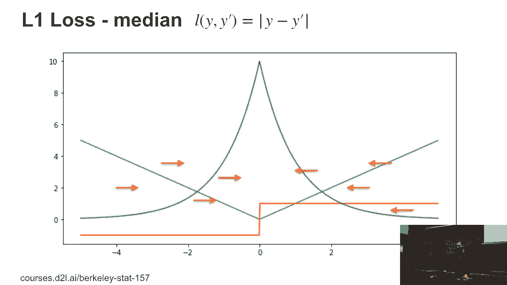
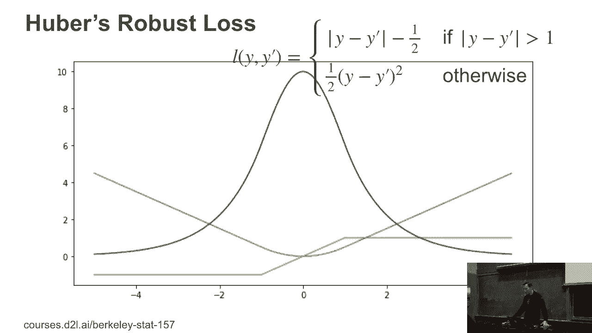

# P19：19. L5_3 Loss Functions - Python小能 - BV1CB4y1U7P6

 Loss functions。 Yeah， so， you know， what can we optimize over？ Well。 this is a very simple loss function。 All right， that's exactly the one that I just described。 So that's just a Gaussian。 And mind you， these plots are all， generated directly in blue one。 So let me explain to you what， you're seeing there。 So the blue function is the。

 function that I described。 So it's 1/2 y minus y hat squared。 The green function is e to the minus that loss function。 And of course， in this case。 as you can see， I picked y prime to， be zero。 And all I did is because I'm lazy。 I just normalized the screen function to integrate to one over。

 the range from minus 5 to 5 and ignoring everything that's outside。 But short of that。 that's a normal distribution。 The red line is the derivative of the blue line。 And that's automatically generated。 So as part of your， homework。 you're going to use autograph to automatically do this。 Okay。 Well， that sounds pretty boring here。

 right？ Because， you know， we can all just write out y minus y prime。 But there are other losses where this is actually really quite， an advantage。 Okay。 So let's take something like this。 Let's just look at what happens with the optimization。 So what we saw before is that if I minimize the L2 loss， I get exactly the mean out of it， right？

 And so I've just， you know， plotted with those red arrows the magnitude of the gradients if I。 have the observations， and that will give me the mean of them。 Okay。 So let's take the L1 loss。

 And again， I did exactly the same thing。 I took the absolute value function y minus y prime and I plotted。 this blue line。 Then I exponentiated it and I get the， green line again normalized to， you know。 integrate out to one on， the interval between minus five and five here。 And then the orange line is the derivative。 Again， automatically generated。

 Now this loss function has a rather fun property， right？ Namely。 its gradients are either minus one or one。

 So if I end up optimizing by， you know， trying to find the， point where the gradients balance out。 I need the same number， of points to the left and to the right。 So decisions call that the median。 If I had an odd number of points， I would， you know， pick that one， exactly。 otherwise I can pick anything in the interval between， two。 Mr。 Gray， this don't change。

 That's the median。 Okay。

 So now let's pick something a little bit weird。 So this is called Hoobers-Robost loss。 The Hoobers-Robost loss is weird insofar as it looks like the。 absolute value function on the branches。 So the blue line on the outside is a straight line。 And on the inside it's just a parabola。 So what it is， it's just a parabola which is then extended。

 continuously with a straight line。 And you need to squint really hard to figure out exactly where it。 crosses over。 Now if you plot the derivative， so that's the orange curve。 you can see it very easily。 And again that's automatically generated with glue on。 This way I don't have to do anything particularly fancy to， get it。

 And the green line again is the corresponding density。 So what is special about the robust loss？

 Well actually a lot because this one ensures if you have a。

 straight line， if you look at that， that you essentially perform。 trimming and you throw the largest and the smallest terms away。 And then you compute the mean within that。 The largest and smallest terms the gradients cancel out。 Anything in the middle， well you have your standard Gaussian。

 loss and everything just averages out there。 Yes？ >> [INAUDIBLE]， >> Okay。 It's a very good question namely what's the relation to outliers。 Now a trimming estimator effectively performs robust， estimation。 Now the little trick that I didn't mention here， that would be， something。

 I mean that a good stats class will cover。 You don't necessarily pick the thresholds of one and minus one。 for where you cross over as a hard constraint。 You adapt them dynamically to the estimation problem that you're。 just trimming away the smallest and the largest terms。 And that effectively performs outlier removal。 Except that when you're doing regression it doesn't exactly。

 remove the outlier， you're just bounding the influence and with。 that the gradient that any single observation can have。 So this way it's not that you're ignoring points that are at， their extremes。 you're just making sure that they don't， they cannot push things too hard。

 Now this is actually a very common technique that's being， used in deep learning training。 It's called gradient clipping。 Now gradient clipping sounds infinitely cooler than who was。 robust loss， but that's really what it does。 So I covered it here such that later on when we do things like。 gradient clipping， you understand what's really going on。

 There are some reasons why you'll need to do that because if。 your gradients are too large any optimization can diverge， but。 it also simply means that you shouldn't be giving individual， observations too much weight。 So this ranges a lot of optimization procedures a lot more。

 stable and here's the statistical reason for it。 Any other questions？ Yes？ >> Sorry。 I'm actually kind of confused。 So what are we trying to do here？

 Where do we develop different loss functions？ >> So we just looked at different loss functions and that's。 because well besides at least mean squares loss you might end。 up adding lots of different other loss functions to your。 optimization problem to perform different types of estimation。

 And what we're doing here is we're just covering the really。 really simple losses first namely for regression because here I。 can draw nice pictures once you go to structured multi-class， losses and so on。 It's a lot harder to visualize what's going on。 The other reason is I wanted to cover the connection between。

 gradient clipping and what you do otherwise namely that you do。 constrain the upper bound of the magnitude of the loss。 So if you have to a large vectorial loss you basically just。 make sure that the two norm of that vector doesn't exceed a， certain number。

 And since this is an undergrad class we're doing things。 the slightly quicker dirty way by giving you more intuition than， necessarily all the math。 So there's this tension between how much we can cover and how。 deep we go and that's where we give you the intuition that we。

 can't really dive into all the details to quite extent that a， graduate level class will do。 Okay so this is pretty much all that we have for regression。

