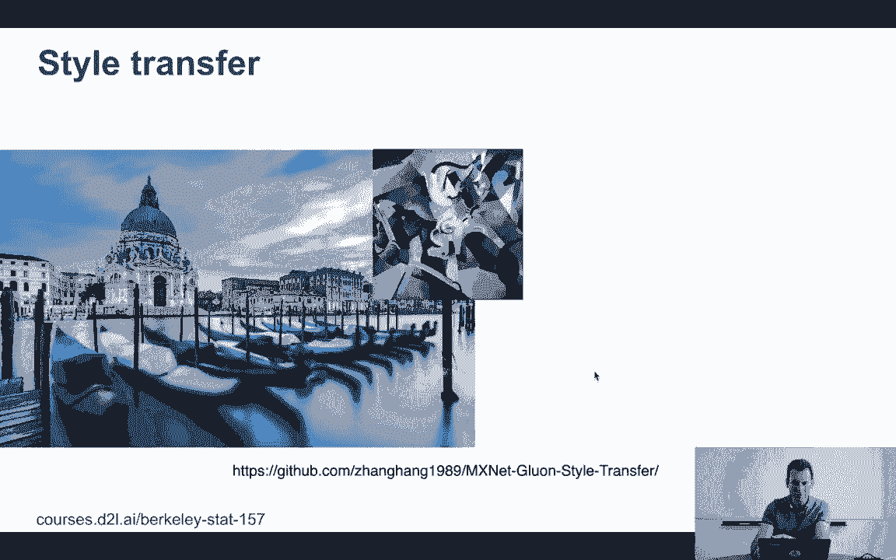
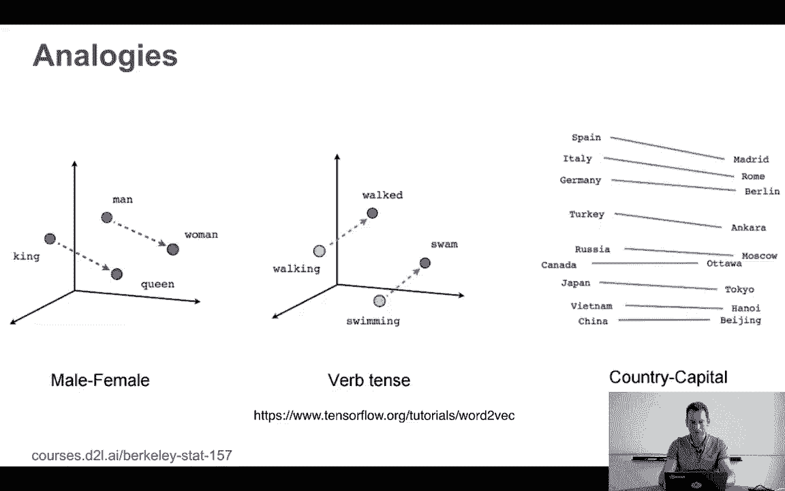
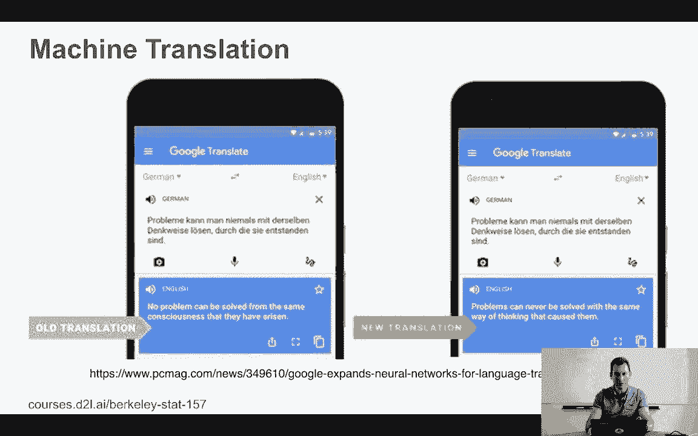
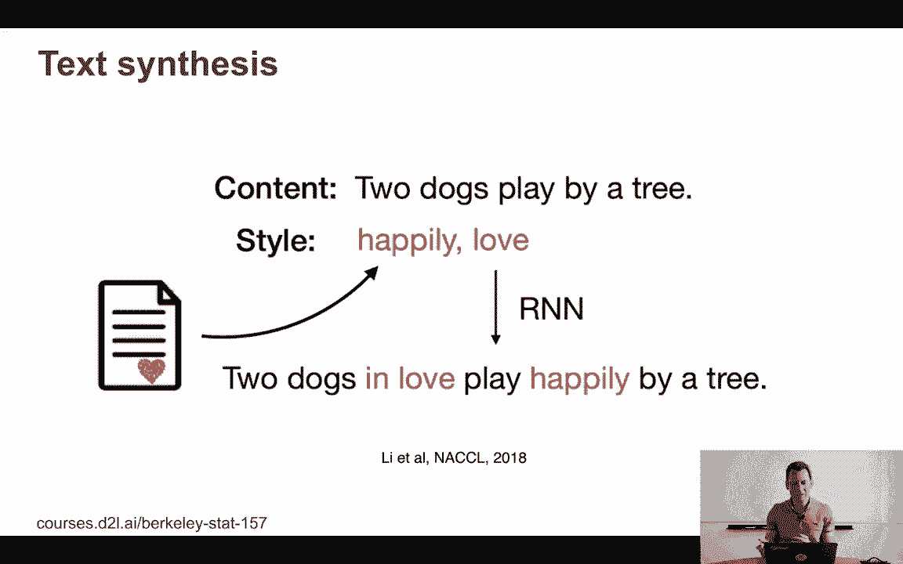
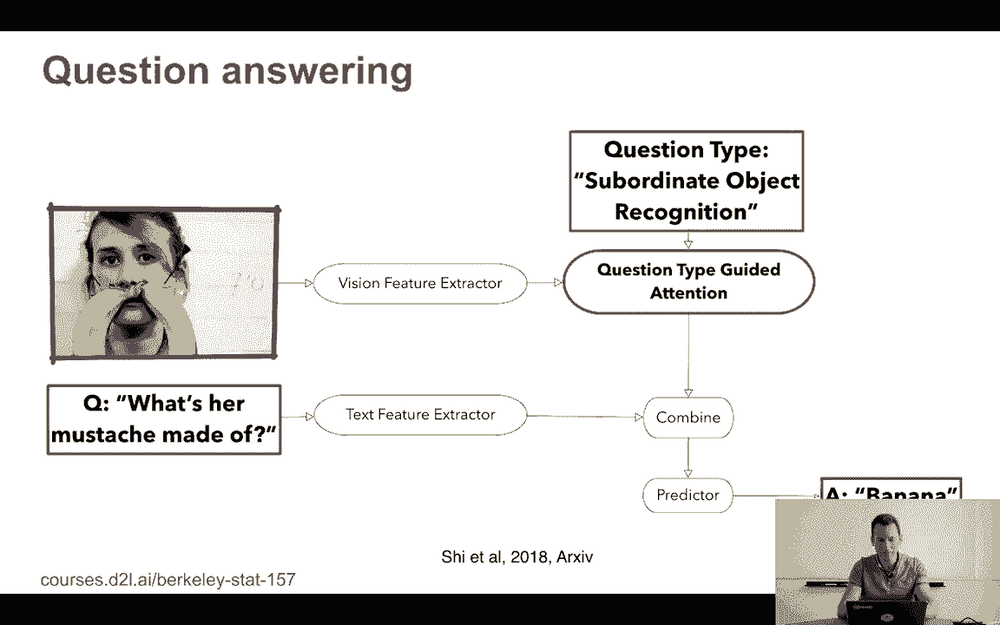

# P2：2. L1_2 深度学习概览 - Python小能 - BV1CB4y1U7P6

让我们开始深度学习吧。当然，这只是一个非常简短的概述，但这真的只是为了让你了解你可以用深度学习做什么，至少能让你对冰山一角有些了解。好的，所以你能做的一个显而易见的事情就是你可以对图像进行分类。

ImageNet 可能是第一个真正展示了计算机视觉深度学习能做什么的关键例子。如果你看这张图，2010年，当一切开始时，分类器的准确率其实相当混乱。它从，嗯，非常糟糕，一直到75%到80%，又降到30%左右。到了2012年，第一个团队。

你知道，实际上降到25%错误率以下的，是那个使用深度学习的团队。而且他们的表现明显优于其他所有团队。第二年，几乎所有团队都突破了25%的门槛，情况实际上改善得非常快，如果你往下看。基本上，到现在为止，准确率已经有所提高，这是2017年的情况。

所以基本上你可以根据衡量标准，得到在5%到10%之间相当不错的准确率。当然，物体识别并不是你能做的唯一事情，你还可以进行图像分割，然后进行标注。例如，Matterport在GitHub上有这个Mask RCNN代码。

你可以在 Glue 和 CV 或探测器中找到类似的实现。这里有许多分割算法，使用像我们在图像中看到的那些工具。对于物体识别，类似的卷积网络以及其他技巧可以真正实现分割。现在，你可以做一些完全不同的事情，比如风格迁移。例如。

假设你想要一个图像，你知道，左边是维纳斯。现在假设你想要一个看起来更像可能是前卫智能风格的东西。

好吧，你可以得到像这样的东西，或者你可以有那个风格，或另一个风格，依此类推。其实这个想法非常直接。也就是说，你希望有一张图像，其最后一层的激活看起来非常像你知道的那些图像，它们能被识别为维纳斯，但你还希望这张图像的低层次统计特征与目标图像非常相似，而这个目标图像就是你关心的。

现在，你可以把这些功能当作手机上的滤镜来使用。你也可以合成面孔，而且这些面孔看起来完全正常，它们在本质上是完全不自然的，因为它们都是合成生成的，去年的一篇论文展示了一种基于名人照片的非常棒的面孔合成算法。

你可以做完全不同的事情，比如类比，你基本上可以尝试嵌入单词。然后你可以玩一些游戏，比如“男人对女人就像国王对皇后”或“Walking变成Walk”或“Swimming变成Swam”或者，你知道，“国家首都就像西班牙对马德里就像意大利对罗马”。现在，如果你有这个，你可以尝试做数学，比如意大利减去罗马加上马德里等于西班牙。

至少这就是这个想法。而这些东西实际上运作得相当好，所以这，当然，允许你做诸如编码知识等事情，而“奇怪的”就像是“土耳其的首都是什么？”嗯，你从一个你知道首都的国家对开始，然后编码它。有比这更好的方法来做，但它给了你一个很好的想法，至少在这种情况下是这样的。

嵌入确实学到了一些相当有意义的东西。你可以用它做机器翻译，正如现在几乎每一个已部署的机器翻译工具都在某种形式上使用深度学习一样。

你可以合成像“Two Dogs Play Buy a Tree。”这样的文本，但你希望它们幸福地玩耍并相爱。我不确定狗是否能相爱，但无论如何，反正两只相爱的狗开心地玩耍，买了一棵树。你可以做到这一点。

或者你可以问“‘胡须迷宫’是什么？”如果你看这个，嗯，你知道，显然是一个女人，显然是一种高度不自然的芥末。好吧，至少我不认为香蕉是以这种方式生长的。所以你需要做的是你需要理解这个查询是什么，而这个查询显然是疯狂的，因为女性通常不会有甜菜。

然后你需要从计算机视觉中提取特征，并且你需要有一些机制来关注图像中的不同部分。例如，识别什么是计算机视觉。然后，当然，一旦你知道你在看哪个部分，对于香蕉来说，那是最简单的部分。关于如何做这件事有很多不同的算法。这是其中之一。

这是2018年一篇存档论文。它运作得相当好。

你可以为图片添加字幕。所以这里有几张狗狗做狗狗事情的图片，看起来相当开心。可爱的小狗坐在沙滩上心形的图案里。这些是人类生成的字幕。然后你可以问，嗯，你能自动生成这样的字幕吗？事实上，你可以做到这一点，例如。

这是2016年的一篇论文，你知道，你有这张漂亮的图片，展示了一只坐在沙滩上的狗，旁边还有一只狗。好吧，我认为这也是一个人类可能会生成的字幕。现在。这几乎就是对深度学习可以做的一些事情的非常简要的概述。我们将深入探讨这些内容。

我们将看看如何实现这些算法。你实际上将会去实现这些算法。但目前，这仅仅是为了激发你的兴趣，让你对这门课程充满期待。
