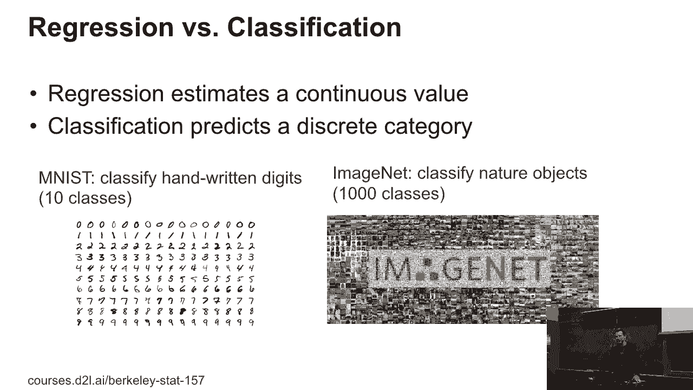
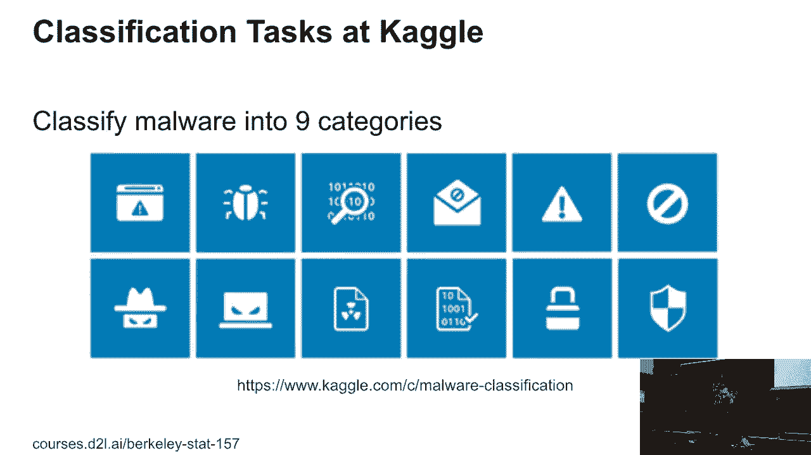
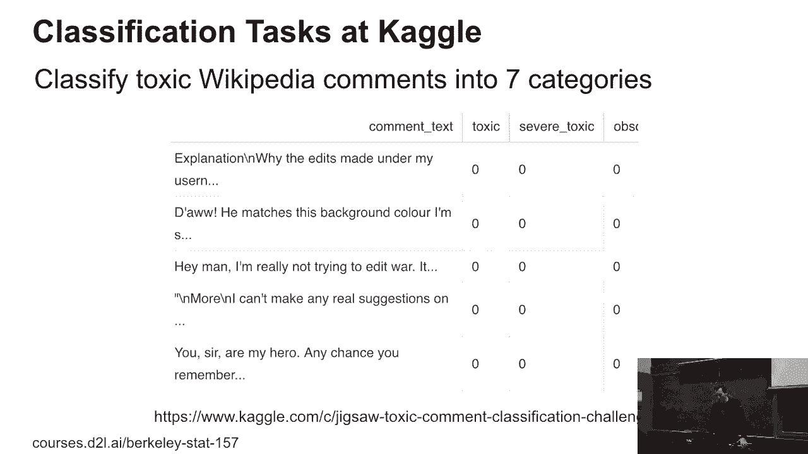
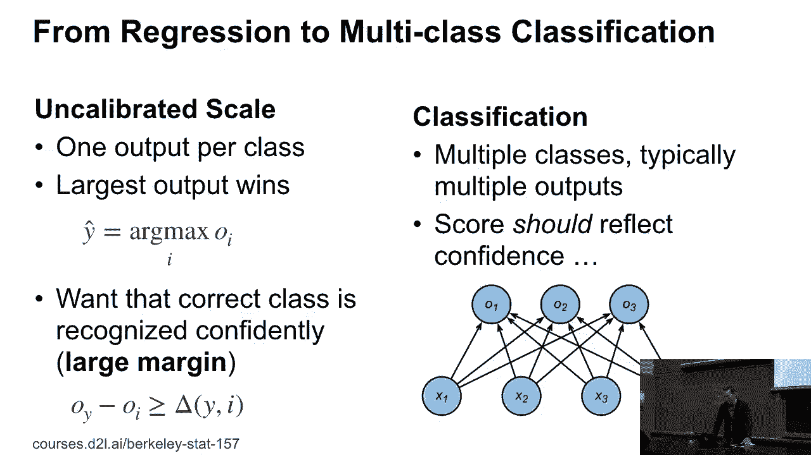
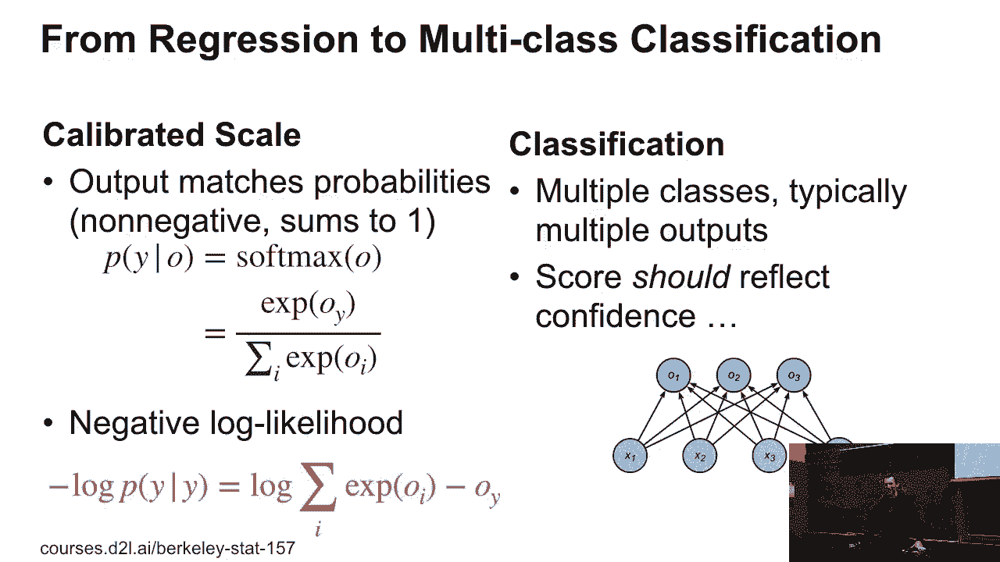
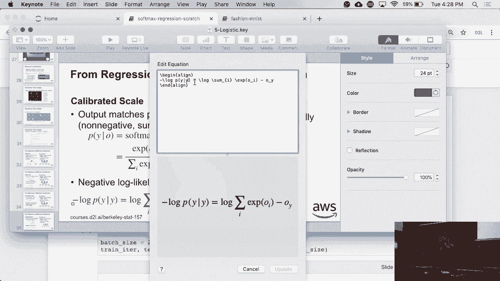
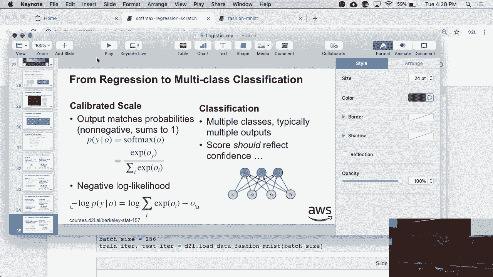
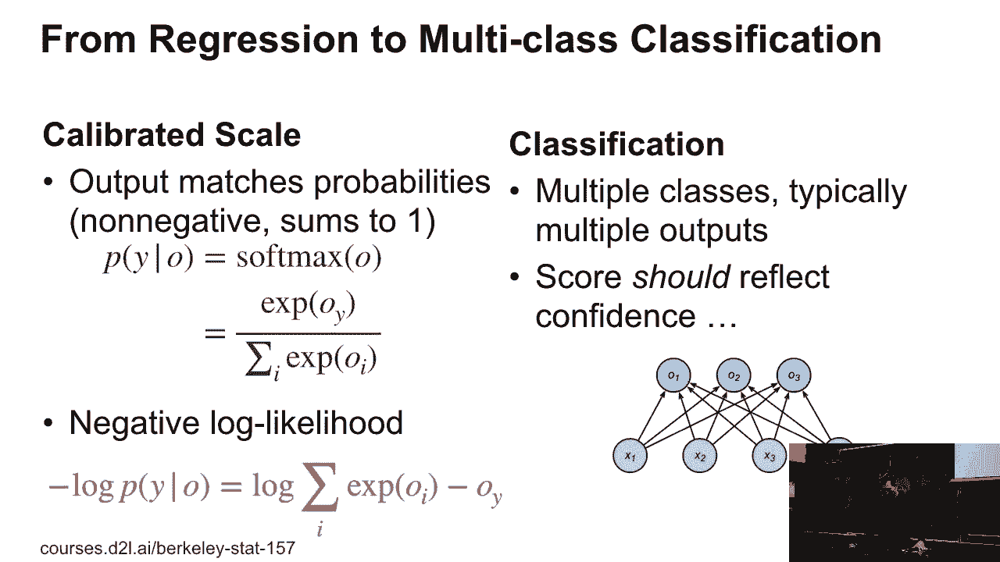
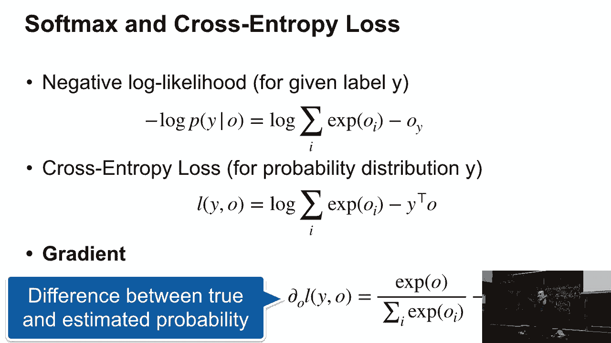

# P20：20. L5_4 Logistic Regression - Python小能 - BV1CB4y1U7P6

 So logistic regression， if you think about it， does something。 it needs to solve a very important problem。 If we have regression。 maybe one-dimensional multiple dimensions， well， we're basically trying to come up with estimates for a continuous value。 right？ Like house prices or maybe height and weight of a person， or I don't know， maybe， you know。

 number of times the sunshine per day and the temperature， you know， that would be， you know。 two variables or maybe the value of maybe， ten different securities on the stock exchange per day。 So any of those things are nice regression problems。 For classification。 you want to predict like a discrete category， like is it a cat or a dog， or what are the digits？ Or。

 you know， if you have ImageNet， then you might get a thousand classes。 And having a large。 actually the original ImageNet data set has more than a thousand， classes。 probably over ten thousand， but basically you are going to get a categorical discrete output。

 There are lots of different others。 So for instance on Kaggle。 you could try to classify proteins in terms of what they， are and what they do。 Or you could find out what type of malware you're dealing with。

 Or， you know， what are toxic Wikipedia commands in terms of， you know， which category they are。 Apparently there are prototypes like， hey， I'm not really trying to start an edit war。 but of course now I am， right？

 So to put that into perspective， so in regression， well。 we have like a natural scale typically in terms of， you know， the real value number。 And then the loss is often given to us in terms of， you know， differences between Y and F of X。 That may not always be the right loss。 For instance， if I look at the stock market。

 it's probably going to be the difference of the logarithms that I care about。 Because whether I'm trading Amazon， which trades at $1，600 or whether I'm trading， I don't know。 Facebook， which is probably $100 or so。 But it doesn't matter。 If I， let's say。 or I take a penny stock， which trades for maybe $1 and is close to being delisted。

 For that penny stock， if it's value increases by maybe 50 cents， that's a massive move of 50%。 right？ And since I might be buying a lot of those， well， I just struck it rich and， you know。 on the other hand， if Amazon goes up by 50 cents， well， that means nothing really happened， right？

 Because the base price was so high。 So you care about relative changes。 So in that case。 you wouldn't look at differences between values， but you would probably look at maybe the log of the ratio as well after losses。 In classification， typically you have many classes and the score should somehow。 reflect the confidence that we have in this。 And this is awfully vague， so， what could we do？ Well。

 the first thing we could do is we could just use the squared loss， right？ So I just encode。 you know， the classes with a vector of all 0s and 1， 1， right？ And every grace on it。 That sounds utterly weird， but people have done that。 And if you don't care about doing things particularly well， that actually works okay。

 So there are a couple of implementations， like for instance， VW for some time， use that， so WAPL。 WABL。 So there are plenty of reasons why， you might actually do that， and it's not too bad。 And you can even prove theorems that it's not too bad from the statistics side。 And then you just pick the largest output and that one wins。 But I would strongly advise against it。

 but people do it nonetheless， okay。 You could pick something like an uncalibrated scale。 And this is by the way what a support vector machine would have done。 So you pick the largest output， but you want to make sure that the correct。 output is much larger than all the incorrect outputs。

 And so what you have is you get this condition， OY minus OY。 is greater equal than some delta of Y and I。 And this delta tells me how bad it is to get things wrong。 So suppose you drive on a road and to your right hand side there's a cliff and。 to your left hand side there， maybe some lawn or whatever。 Then when you drive on this road。

 you will probably somewhat steer to the left。 Because it's not so bad if you drive into the lawn。 but it's pretty bad for， you if you fall down that cliff， right？

 So you will keep a larger margin relative to the outputs that will incur a large loss。 And under the right circumstances， you can engineer this loss function and。 this optimization problem in such a way that you can actually solve it efficiently。 And around maybe 2002， 2003， this was all the rage。 So there are probably about three。

 four hundred papers which come up with， really nifty tricks on how to do this。 Of how to solve this with some mathematical programming on the inside and， beautiful math。 we all played this game and yeah， it was the right thing to do at， some time。 Okay， no。 but we're not going to do that here。

 Instead， we are going to use something like a calibrated loss scale。 And this is just a very simple softmax， yes。 >> What is the output？ >> Oh， it's just the output。 So if you look at the diagram on the right， so we have X1 through X4， then we have O1 through O3。 these are the outputs。 >> The classes？ >> No， these are just outputs of the network， right？

 So these are just for the three neurons， the output neurons。 that are just the values that they produce。 But they have to name the variable somehow。 so it's just that。 Don't worry， it has nothing to do with big O notation。 By the way。 you do not need complexity theory to pass this class。 Somebody was very worried about that。

 You don't need complexity theory for this class， this would be overkill。 But in here。 it's really just a variable name。 So the softmax of the output is given by just。 exponentiating every coefficient individually。 So that ensures that all those things are non-negative。 That's great， because we want probabilities。 And then dividing it by the sum over all those terms。

 So quite honestly， if you had to hand the engineer something that maps a vector， to a probability。 you might have done something like that as well yourself。 Maybe rather than E。 you would have picked maybe OY squared， divided by the sum of the O's， you could have done that too。 But this one actually has a little bit nicer properties in terms of computing derivatives and so on。

 And the good thing is the negative log likelihood， this is left term down there。 This is a formula you should absolutely remember。 It will pursue you throughout the entire career and stats。 It's about the simplest exponential family you can imagine。 You will see this thing again。 Now。 okay， so it's everything sort of kind of clear in terms of logistic regression and what we're doing here。

 So that this is a probability envelope。 Okay。 >> [INAUDIBLE]， >> Exactly。 So that would be。 and yeah， so the typo is one of the reasons why I don't put up the slides before the class。 I hope that there will be fewer typos after the class。

 You have to be right。 Well， I could just fix this now。 [BLANK_AUDIO]。

 And there we go。 Okay， good。

 So now if we have that， well， so this is a nice loss function and we can plug that in。 And the good thing is every decent deep learning toolkit comes with an efficient implementation of this。 This is now， I think also explaining a little bit better why we talked about numerical stability and。 all of that about a week ago， right？ Because if any of those outputs are really large， then well。

 things can get unstable。 Now， quite often people don't actually refer to this loss， but。 they refer to something called the cross entropy loss。 This cross entropy loss looks just like the loss that we had before。 Just that rather than a single Y， we might now have an entire probability distribution of a label。

 And now I have just Y transposed O。 So if Y is coded with just all series and。 one one for the correct class， I get exactly the line above。 But more generally for probabilities。 I can now compare with that a desired， target probability to the probability that I'm estimating。 And we'll actually go over some information theory to explain why on earth we get this。

 But we may not have time today。 So let's look at the gradient next。 So the gradient of this just happens to be， and I'm going to derive this。 This is one of those fundamental derivations that will help you。 So remember。 we had our loss function log sum over i e to the oi minus， and then in this case， oi。 Okay。

 And so d o is going to be， well， here we have a log。 So we get in the denominator sum over i e to the oi。 And here， and this is at coordinate。 let's call it coordinate Y prime。 e to the oi prime minus delta Y prime。 Now。 what is this expression here？ Well， that's nothing else than p of Y given whole。

 p of Y prime given 0。 This is the empirical probability。 So if I were to plug in the cross entropy loss， so in other words， if we have here， o transpose Y。 I'll get Y out of here。 So in other words， what I'm really getting is p of Y given 0。 Well， I know。 of course， now I need to actually plug up， let me call this a probability here， minus p。

 So my gradient is now just a difference between the probability that I'm estimating。 and the probability that I should be seeing。 So we're basically back to the regression setting where we compared what we are estimating。 and what we should be seeing。 And what we are seeing。 And here， again。 we are taking differences between the estimates and what we should be。

 seeing in terms of what we're seeing to get our gradients。 Just that this is a more convoluted way of going about it。 Now， this sounds like a coincidence。 right？ That we're getting differences between truth and expectation。 And it's not a coincidence。 As a matter of fact， any exponential family will do that for you。 Even better。

 the second derivative of this will give you variances for any exponential family。 So this is one of the reasons why exponential families are so popular in statistics。 because the math works out really nicely。 Yes？ >> So we can characterize again what's the properties that comes with it？

 >> Okay。 Everybody cool with that so far because I'm going to raise it。 Okay， good。 So an exponential family， and this is really just a detour here。 I have p of x。 parameterized by theta， or actually let me parameterize by w， is given by some phi of x， well。 phi of x transposed w minus g of w。 Okay。 So this looks a little bit different from what we saw。

 This phi of x， in our case， it just keeps the vector the same。 And w is then just the corresponding way to fix the thing out。 g of w is the normalization。 That is this funky log sum over the exponential term。 That basically just makes sure that this is a proper probability distribution。

 So this is g of w is given by some overall x's。 All right。 And the nice thing is that the derivative， g of w， gives me the expectation of phi of x。 And furthermore， the second derivative gives me the variance。 Now。 this thing is exactly why the first term here is the probability。 All right。

 Because my sufficient statistics were just the indicators， right？

 So the expected value of that indicator function， which is one for， the specific class since here。 otherwise， if I take the expectation of that， that just gives me the probability vector。 So what we saw here is about the dumbest exponential family you can think of， but。 it's a very versatile one。 This is really just an aside。 If this looks too confusing for you。

 just disregard it。 You won't need it for the rest of the class。 Any other questions？ Okay。

 Good。 Now， before we do information theory， and this is of course Shannon himself。 let's look a little bit at how to do regression。 And that's about， I think。 all that will be able to do today。 So。

 [BLANK_AUDIO]。