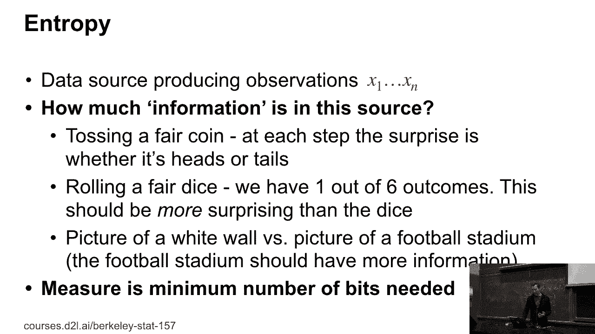
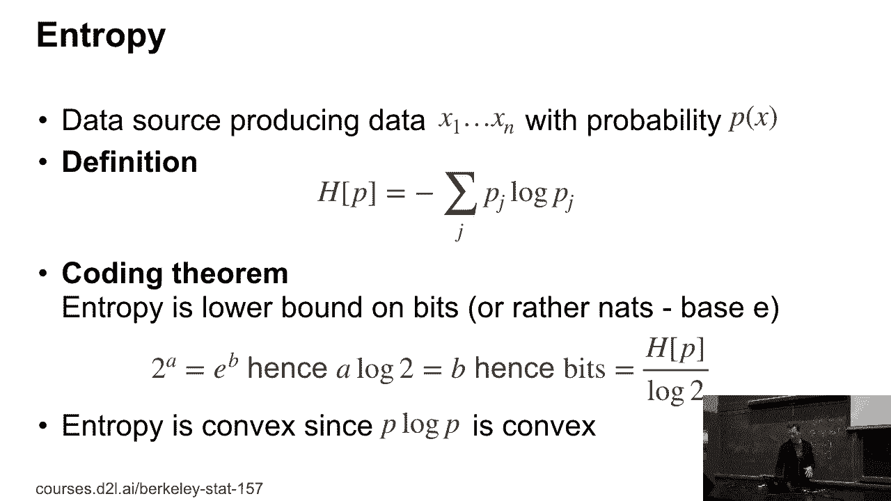
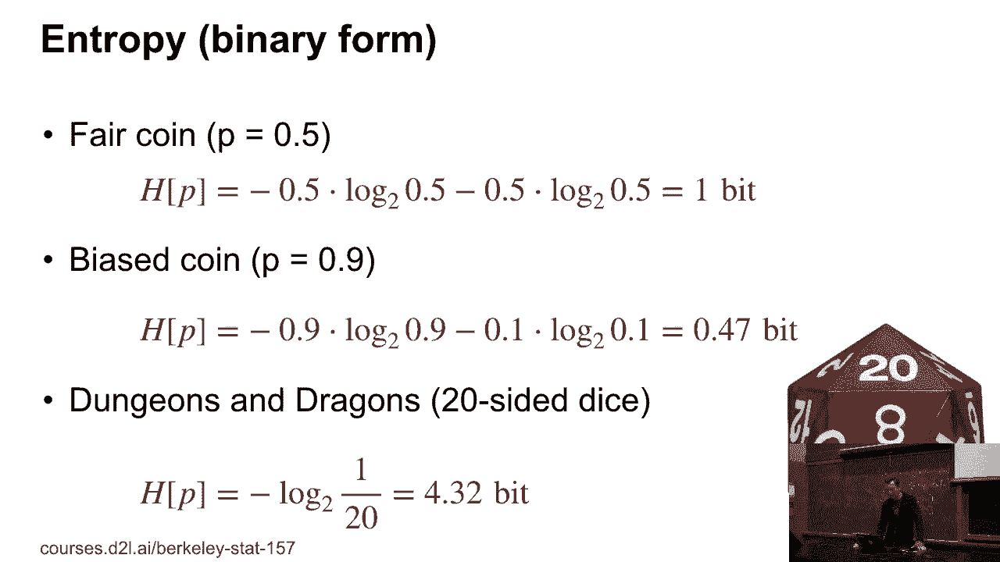
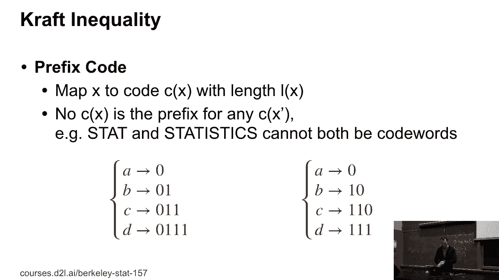
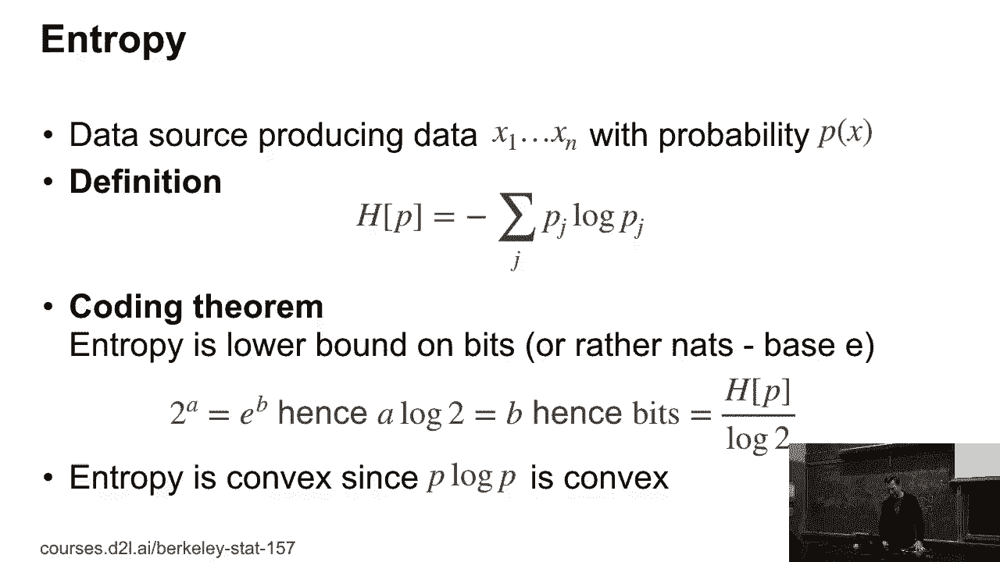
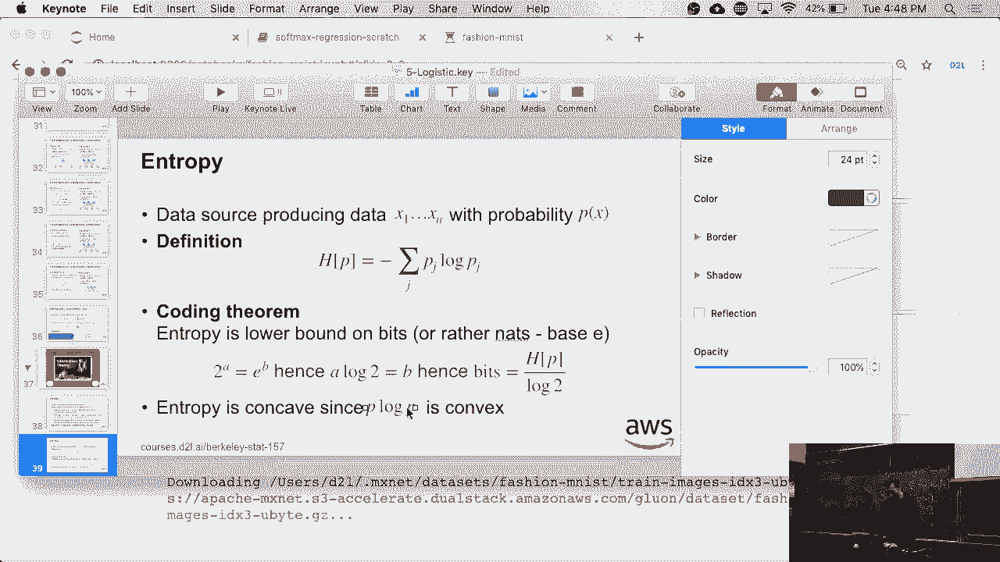
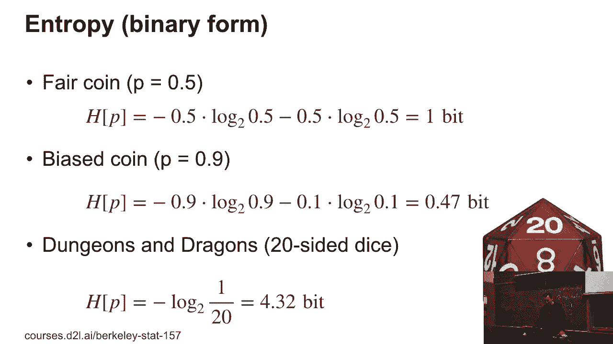
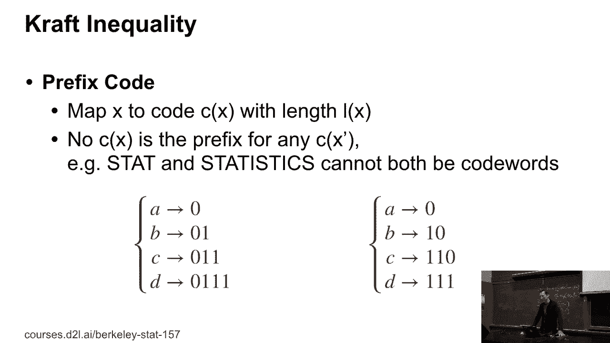
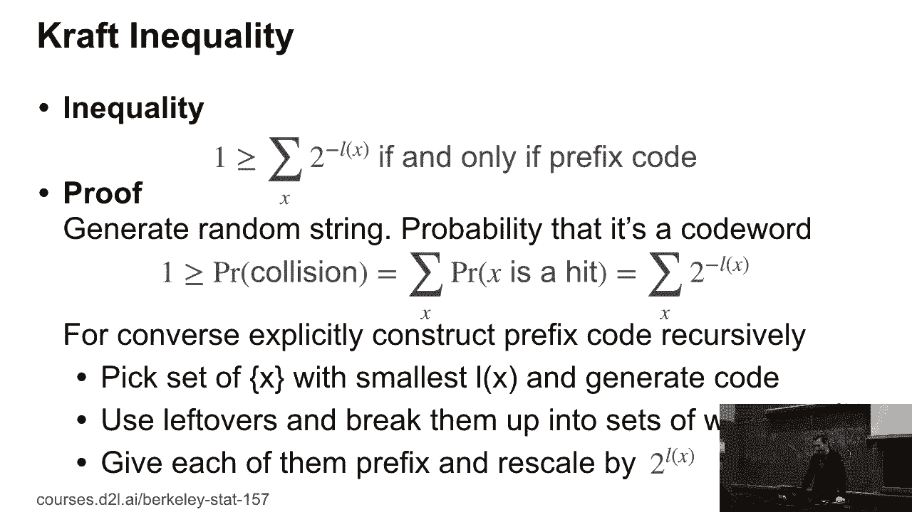
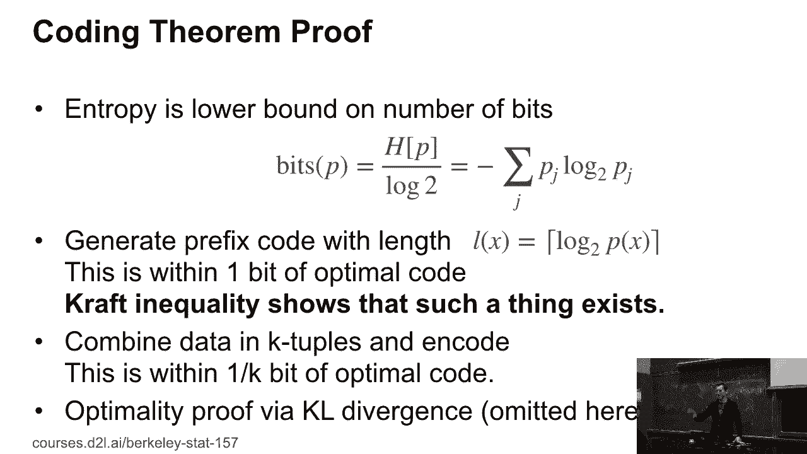

# P22：22. L5_6 Information Theory - Python小能 - BV1CB4y1U7P6

 So， okay。 So remember before that we had terms like cross entropy loss and so on thrown， around。 So the question is， you know， what does that even mean？ And this is really the。 super light skimmed milk version of information theory that I'm going to cover really just。 enough to make sense out of the other things that we're doing。 So entropy， the question。

 that Shannon started out with is， you know， let's say I have some data source producing。 observations X1 through Xn。 So like， how much information is there in this source？ Can we。 quantify this in some meaningful way？ So for instance， if I have， you know， a fair coin。 and then at each step， you know， the surprises， you know， whether it's heads or tails。 Now。

 if I roll a fair dice， you know， I get， you know， six possible outcomes and there should。 be more information in that than tossing a coin。 And then maybe， you know， maybe costing， two。 tossing two coins has more information than a dice or maybe not and then you can， argue about it。 It's kind of tricky。 Or if you think about it， you know， I could take。

 a picture of a white wall versus a picture of this lecture theater and obviously if I。 take a picture of all of you， this contains a lot more information than just taking a。 picture of a white wall。 And the nice way that how Shannon formulated this is by saying， well。 the entropy is the minimum number of bits that are needed to store this。 Okay？ Now。

 how do we formalize this？ So this is the ingenious definition of Shannon's name。 Namely， he defined。 the entropy H of P to be minus the sum overall outcomes J， PJ times log of PJ。 So in other， words。 it's the expected value of minus log P。 And then there's this very famous coding， theorem。 namely that the entropy is the lower bound on the number of bits or in this case， rather than that。

 so base E of that I needed。 And we're going to prove this in this class。 It's probably one of the more complex proofs that we'll do。 But afterwards you'll feel。 that the entropy is a lot less mysterious than it would be otherwise。 A couple of nice things。 So the entropy itself is convex since P log P is convex， right？ So linear function P。

 So log P is not convex， but P log P is convex because it bends up further than the linear， function。 But before we do that， let's actually look at a couple of things。 Let's take a fair。

 coin。 So if I have a fair coin， well， the entropy of that is， you know， one half log。 base two of one half， then another half log base two of one half， and so that's one bit。 And indeed。 if I wanted to encode， you know， ten coin tosses on a computer， I could just。 do that through a bit sequence。 Now， if I have a bias coin， so which with 90% probability。

 comes up heads and otherwise tails， then if you work out the numbers， so 0。9 times log。 base two of 0。9 plus the corresponding thing for 0。1， I get around to 0。41 bit。 So you can。 already intuitively see that a coin that mostly spits out， let's say， tails， should be easier。 to store as a sequence than something that， you know， will produce things at random。 Now。

 if you've played Dungeons and Dragons， you know that while they don't muck around with。 regular dice， they use a 20-sided dice。 And that 20-sided dice requires you to store around， 4。3 bit。 So there's a fair amount more information in each roll of a dice than you would have。 in the standard coin toss。 Okay。 In order to prove that theorem， we need to look a little。

 bit at what prefix codes are and something called a craft inequality。 Yes？ So then that's。

 correct。 Yes。 Yes。 Because。 Yeah， absolutely right。 Thank you。 So now， let's look at something。

 called a craft inequality。 So there's a code。 So codes are so-called prefix codes。 If I。 can map every symbol into， you know， a code， let's say， you know， 0s and 1s with some length。 L of x， and where no sequence is a prefix of another code word。 So for instance， I couldn't。 have as one code word dog and as another code word dog house。 That wouldn't work because。

 dog would be a prefix to dog house。 And prefix codes are very nice because they're very nice。 to decode。 I just， you know， go and look things up and then， you know， I find something and， then。 you know， I go and pick the next term。 And well， so for instance， you know， I can。 if I look at the first terms， well， that's not a prefix code， right？ Because the code。

 for A would be a prefix for B。 The code for B would be a prefix for C。 The code for C。 would be a prefix for D。 So that's pretty bad。 On the other hand， on the right hand side。 I encode A as a 0。 So now， the only option that I have left is that I pick for B 1 and， then 0。 And okay， in that case， I burn up the 1 0 as well。 So I can only do a 1 1， then， maybe 0 and then D。

 I'm just left with 1 1。 Okay。 So that would be a prefix code。 Now。

 here's a really cool inequality， a so-called craft inequality， which says that if and only， if。 you know， we have a prefix code， then the following holds， one is greater or equal， than the sum。 overall x is， of 2 to the minus the length of that code。 Okay。 So this is a。 pretty powerful inequality。 So， and to prove it， it's actually not that hard。 So first， of all。

 we want to prove that this sum actually， if we have a prefix code， is bounded by 1。 So what we can do is we can just look at all the collisions。 So basically， I go and generate。 a random string。 And I look at the probability that this random string actually happens to。 be a code word。 Now， if I sum over all those probabilities， right， that has to be bounded。

 by 1 because I can only hit that most 1 code word。 So 1 is greater or equal than the probability。 of collision with some code word。 So I can therefore sum over the probability that x。 is actually a hit。 So only one of them is going to be active at any time。 Now， since。 I generated the random string， the probability that it's a hit is given by 2 to the minus。

 lengths of that string。 Is it a random binary string？ All right。 Because I have， you know。 only 0 and 1， then the probability will be 1/2。 If I have， you know， 0， 0， then， you know。 the probability will be 1/4 because I have now two symbols and so on。 And since on the。 very left-hand side of this， we have， as an upper bound 1， we've just proved that if。

 we have a prefix code， then the inequality holds。 Okay。 Now comes the harder bit to prove。 that if the inequality holds， then we can actually engineer prefix code。 And this is。 about the simplest proof I can come up with。 There are lots of other slightly more elaborate。 proofs。 For instance， actually Wikipedia has one， but that may not be the simplest one。 Anyway。

 this is the simplest I could come up with。 So we're actually going to construct。 the prefix code explicitly， recursively。 So what I'm going to do is， I'm going to pick。 the set of x， which have the shortest sequence， well， which have the smallest L of x。 Okay。 So I know that for those guys， because， you know， the left-hand side of that sum is 1， right？

 So I know that for those guys， I can find a corresponding， you know， binary string。 and make them all unique quite easily。 And then I have some rest of all the probabilities。 Now what I do is， let's say for instance the length of the string is 3， so I get 2 to the， minus 3。 right？ So I get 1/8。 And maybe I have 5 of those guys。 So I have 3 left。 Now。

 I take the remaining probabilities， which have to be less than 3/8， and split them up。 into groups of 1/8 each。 I have them the corresponding。 And now I multiply everything by 2 to the。 minus 3， and I just recurs my algorithm of generating their prefix。 And basically giving。 all the remaining probability chunks their own unique prefix and then the rest is， you， know。

 just apply it again to the rest。 So in other words， all I'm doing is， I'm just。 working my way from the head， the tail of my set of numbers。 And whenever I find the。 next shortest term， I generate the prefix and then， you know， apply the same mechanism。 to the subsets again。 And so this way， at some point I'll run out of things that I need， to encode。

 And since at every time I didn't exhaust my entire budget of summing up to， 1， I'm done。 It's only one time that will probably have an infinite number of symbols。 and this proof doesn't work for an infinite number of symbols。 But for a finite 1 it will。 Okay。 So why do we need all of this？ Well， actually for a very simple reason。 Because。

 now we are going to prove the coding theorem with it。 Namely that the entropy is a lower。 bound on the number of bits。 And I think that's pretty much where we'll end。 The first thing。 is we're going to generate the prefix code with links L of X is the seal of log， well。 of minus log base 2 of P of X。 So I take the binary logarithm of the probability for every。

 event and it just round up to the next integer。 Now， each of the minus that has to sum up to， well。 sorry， 2 to the minus that， sum over all the strings has to sum up to less， less， equal than 1。 Because all I've done is， otherwise， if I have 2 to the log， you know， that's just。 sum over the over， let me write it out。 It's easier to explain。 So the sum over P of X over， X is 1。

 right？ Which is nothing else than the sum over X of 2 to the minus log base 2 of， P of X， right？

 Nothing special has happened。 Which is， of course， greater equal than the。 sum over X 2 to the minus seal of minus log base 2 of P of X。 Okay。 And now this is exactly。 where the crafting equality can kick in。 If the crafting equality says， if I have this。 then I can always find a prefix code。 Okay。 So what that shows， and of course， we know。

 that this is actually， you know， this itself is greater equal than 1/2。 Why does the upper。 bound hold？ That lower bound hold。 Yes。 So what happened is， if I go from minus log P。 of X to seal of log， minus log of P of X， then those two numbers will never differ by。 more than one， right？ They just round to the next integer。 Now if I round to the next integer， well。

 the difficulty discrepancy can be not no more than 1/2。 So this number can never。 be less than 1/2 that number。 Since that holds， and I know that this is one， this has to be。 one-half。 So that's what it means by saying， well， this is within one bit of the optimal， code。 right？ Because the theorem claims that， you know， it's exactly， you know， a log base， 2 of Pj。

 not the next integer up， right？ Okay。 Now how do we go from， you know， log base 2。 of Pj to making this work exactly？ Well， what we can do is we can just combine the data。 into k tuples， right？ So that will drive all the probabilities down to something much smaller。 But now since I'm combining， you know， k tuples， the rounding error of up to 1 will now get。

 split over k probabilities。 So that drives my rounding error to 1 over k rather than 1。 If I make those k tuples long enough， then everything works out fine。 Now the optimality， of that。 that there is no better code goes with， through a cool block library divergence。 and we'll do that on Thursday。 Just one quicker side。 So you might think， well， this is actually。

 really nice， right？ I mean， so coding theories is easy， right？ So why don't we have optimal， codes。 right？ Because after all， you know， I could just go and design some encoding algorithm。 Well。 the problem is that in order to make things work really well， I need very long sequences。 And very long sequences make for very expensive decoders。 And that's where， for instance， turbo。

 codes come in。 So if at some point you want to take a graduate level information theory， class。 they'll cover turbo codes and low density parity codes and all of that in a lot more， detail。 Okay。 so thanks for it today。 The homework will be up later tonight， including。 the solutions form two weeks ago。 Okay， good luck。 See you on Thursday。

