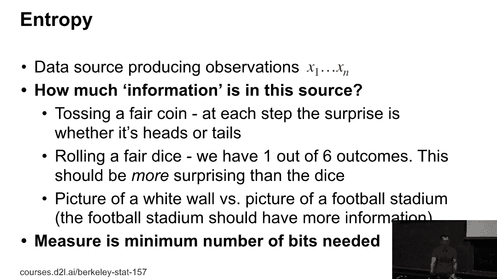
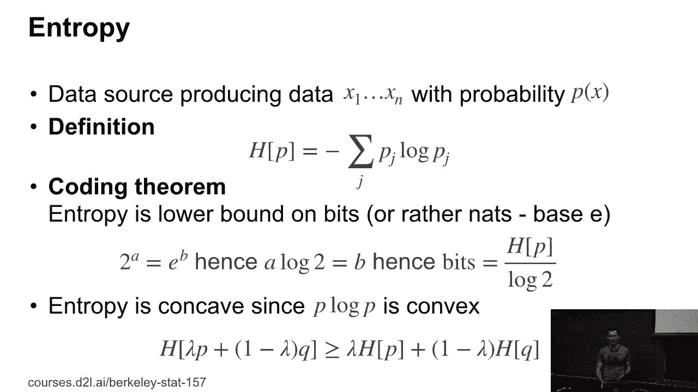
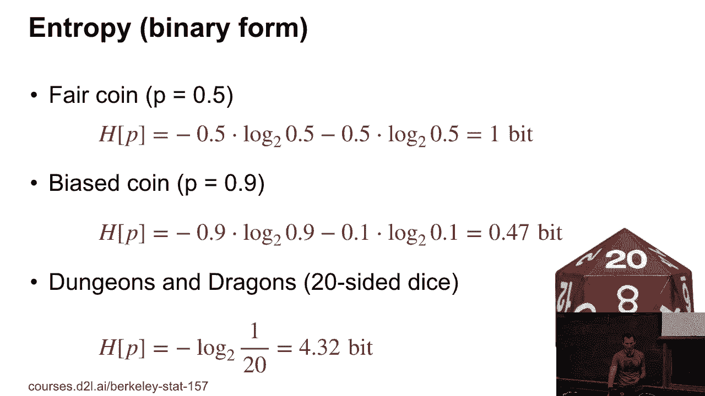
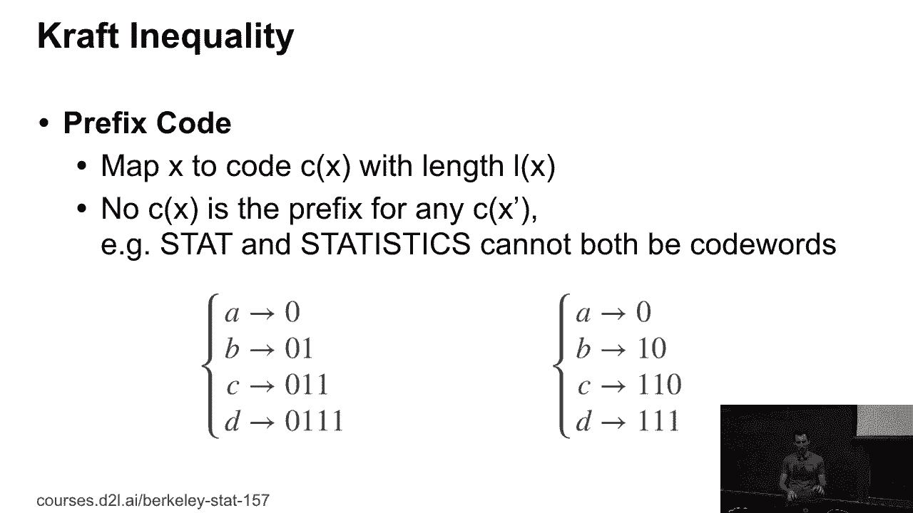
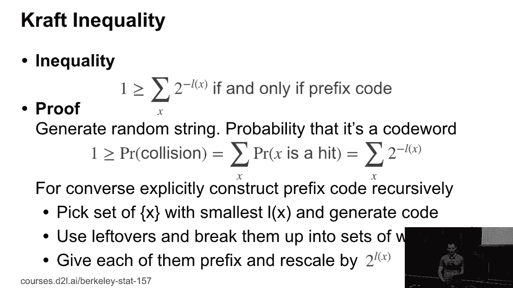
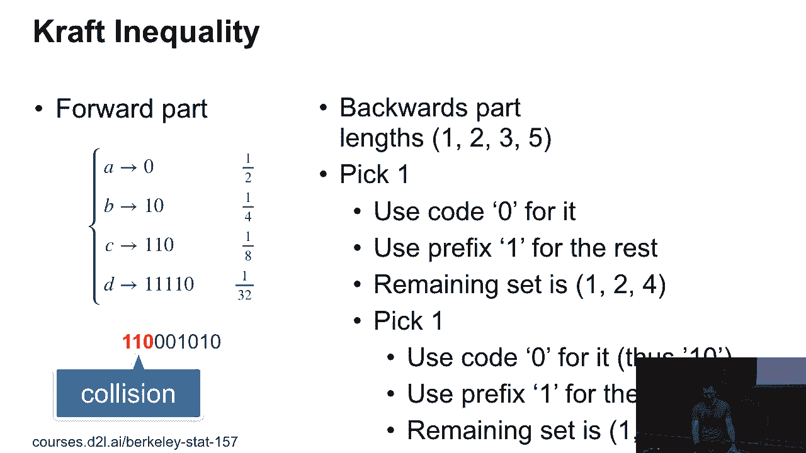
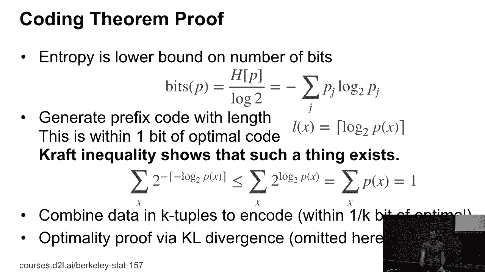
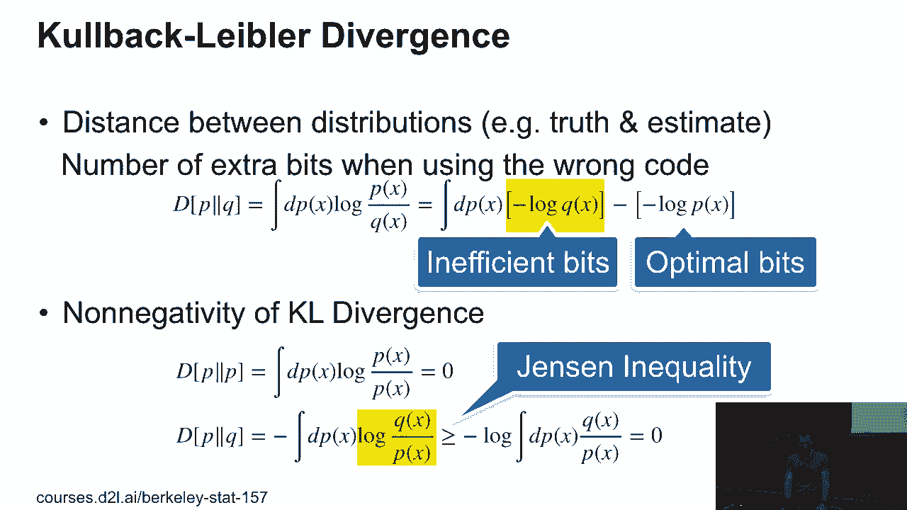
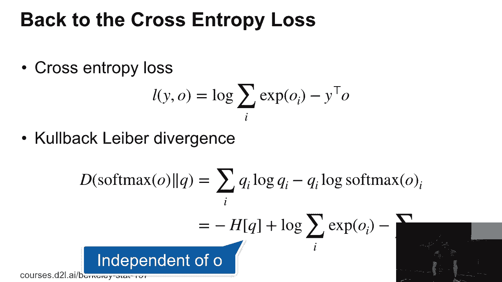
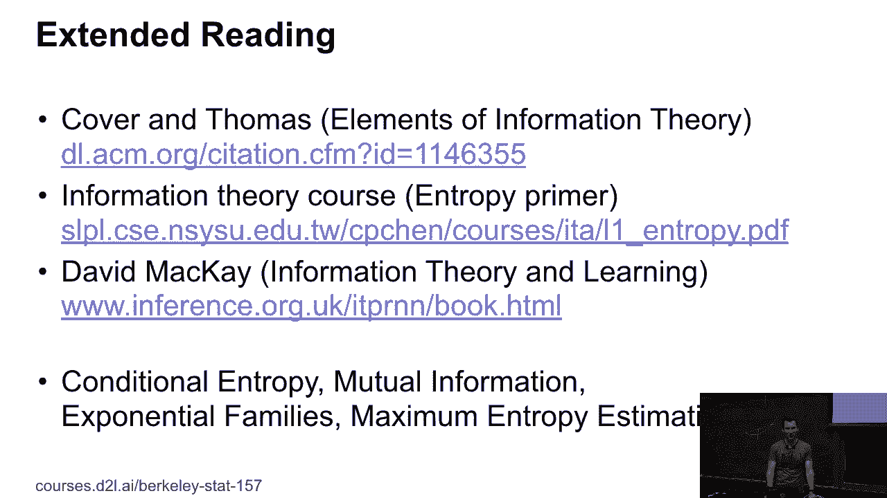

# P23：23. L5_7 信息论回顾 - Python小能 - BV1CB4y1U7P6

这是信息论部分的一些背景和回顾，我们在星期二没能完全覆盖的内容。我有几个问题关于Craft不等式以及为什么需要它。

那么我们简要回顾一下。记住，熵是通过负对数来表示的，嗯，pj的期望值。它是，这也是度量比特数或信息量的一个标准。你知道，我需要多少符号来存储和传输这些数据。现在，香农极限编码定理告诉我们，比特数的下界是分布的熵除以对数二。

所以就是通过对数二。进一步来说，熵是凹函数，因为p log p是凸函数。这意味着两个分布的混合的熵总是大于或等于各自熵的混合。换句话说，如果我拿两个数据源混合起来，那么不确定性只能相对于没有混合时增加。

这，嗯，应该是你预期的结果。好的。

然后我们回顾了一些简单事物的熵，比如硬币和。如果你玩地下城与龙。

然后我们就到了Craft不等式。所以首先简要回顾一下前缀码。前缀码是一种，如果我读取它们，通常在某个点我可以很容易地判断，好的，代码到此为止，因为没有其他东西能以这组代码字开始。在左边，我们有一些显然不是前缀码的东西。在右边。

它是一个前缀码，所以也更容易解码。A映射到零，B映射到一零，依此类推。基本上，前缀不能是单独的代码字。

好的。然后是Craft不等式。这个不等式基本上是说，如果我有一个编码，其中每个字符串L的长度满足L的总和对2的负L次方求和小于等于1。那么，首先，每个前缀码都满足这一条件。其次。

如果我有这种类型的长度分布，那么我可以为它找到一个前缀码。好的。

那么这个证明，下面是一个稍微更直观的版本，展示了如何进行操作。对于前向部分，你需要查看实际发生碰撞的概率。在这个例子中，我创建了一个随机字符串。它是，知道吗，1，1，0，那，那个，那个。然后你可以看到，好的，碰撞到C。你可以看到，这个字符串发生碰撞的概率是1/8。

不管我尝试与之碰撞的整个字符串有多长，因为我只是看前缀碰撞。对于以零开头的字符串，嗯，好吧，它与任意字符串发生碰撞的概率是二分之一。所以，如果因为我知道碰撞的总体概率是，你知道的，**小于等于**1，那么我得到了前缀的克拉夫不等式。然后。

为了证明反向部分，假设我有一个长度集，基本上是一个长度为1的字符串，一个长度为2的字符串，一个长度为3的字符串，一个长度为5的字符串。好吧，我只是从左边选数字，因为，嗯，我有点懒。而且你可以很容易地看出，这满足了克拉夫不等式。但是现在，如果我想实际生成，嗯，你知道。

一个基于这些的前缀编码，嗯，你要做的是首先选择其中最小的那个数字。或者如果你知道，可能有多个相同的。显然，如果我有 `1, 1`，那就不行，因为我已经用完了所有的概率。但好吧，我选择1。所以我使用这个编码，假设用零表示它。然后我将前缀1用于其余部分。

所以现在我从所有其他数字中减去一，对吧？所以我的2、3、5变成了1、2、4。然后我再次选择1，所以我使用零来表示它，因此现在得到，嗯，代码字是 `1, 0`。我将前缀 `1` 用于其余部分，剩余的集合现在是1、3，因为2、4被移位了。所以在每一步，我，嗯。

从列表中拿出一些符号。所以在某个时刻，我用完了符号。而且在任何时候，剩余的概率都不会超过我之前的概率。

好的，这就是为什么它有效。好吧，那么实际上拥有这个克拉夫不等式的原因是要证明，如果我选择一个基于 `-log2(p(x))` 的前缀编码。首先，我实际上可以构建这样的编码。这基本上就是我需要这个克拉夫不等式的原因。所以我需要它来进行构造性证明。那么，首先，选择链接，你知道。

下一个最大的整数是 `-log2(p(x))` 是一个合理的想法，因为如果我对 `2^(-ceil(-log2(p(x))))` 求和，对吧？这当然是 **小于等于** 跳过你知道的天花板操作符，对吧？因为那样数字会变大。嗯，数字变小，整体来说，它变大。好的。

所以我有 `2^log2(p(x))`，这其实就是 `p(x)`，也就是1。所以因此，我知道克拉夫不等式成立，因此，根据我们之前看到的构造，我们实际上已经构造出了一个编码。现在这个编码在位数上是最优的，因为最多我在 `log2(p(x))` 和下一个最大的整数之间浪费了一位。

我可以将其转化为只浪费 1/k 个比特的形式，方法是转向 k 二。最优性证明通过了 k-led 散度，这里省略了，但我们几乎会在下一张幻灯片上展示。因为我们反正需要使用 k-led 散度。

好的，那么**Kullback-Leibler 散度**是一种衡量两个分布之间距离的方法。有时人们认为这个**Kullback-Leibler 散度**是非常、非常神奇的东西，你知道的，非常难以理解究竟发生了什么。如果你仔细想想，它其实是一个非常、非常具体的量。所以让我们来看看。

至于目前我们假设知道最佳编码使用了 log p。当它使用了熵的最小比特数，对吧？或者说，实际上，熵是 log 二，没错？那么我可以问，如果我基于错误的分布选择一个编码，我期望使用多少比特？

因此，我可以通过仅仅取最佳比特和使用错误编码的比特之间的差异，来衡量真实分布与错误分布之间的距离。对吧，所以直觉上，这感觉是正确的做法。现在，错误的比特数就是如果我用负对数 q(x)，你知道的，用符号来存储某个 x。而正确的做法是用负对数 p(x)。

所以我只需取其期望值，即 d p(x) 的负对数 q(x) 减去负对数 p(x)，这只是说 log p 和 q 之间关系的一个非常复杂的方式。如果你，假设你学过大理论，你会对我这么轻率地处理这些感到震惊。你实际上会希望有更精确的微分公式，因此你会得到类似 dp 的东西。

dq，但我这里不会纠结于那些细节。毕竟，这是一个本科生课程，而且这大概是我们想要探讨的最理论化的内容。所以我们要做的。是的，我们要证明这个 KL 散度。因为**Kullback-Leibler**（很难发音），所以大家都说 KL 散度。

这实际上表现得很好。需要检查的是 p 和 p 之间的散度是否会消失。嗯，这很容易，因为它只是 log p 除以 p，这就是 log 1，结果是 0。所以期望值是 0。快问一下，为什么我称它为散度而不是距离？

是吗？它不是对称的。是的，它不是对称的。那么你能告诉我为什么它不是对称的吗？

我认为如果你在谈论 p 并保持表达式的位置，它会给你一个不同的——。没错。是的。没错。因为我有关于 p 的积分。所以如果你想一下，一个——那么 p 和 q 之间的散度就是我在用 q 的编码编码从 p 中抽取的数据时，我必须多付出的额外比特数。另一种方式是，我需要支付的额外比特数是我用 p 的编码来编码从 q 中抽取的码字时所需的比特数。

这两者不必一定相同。现在，接下来呢，我们需要证明——或者说我们想证明KL散度是非负的。因为如果我能证明它是非负的，并且只有在p等于q时它才会消失，那么我就成功了。然后我就知道这实际上是一个有意义的度量。而且除此之外。

如果这是低效和高效比特之间的差异，那么我知道，当香农编码定理成立时，对吧。那就是通道限制，因为我刚才证明了，任何其他的编码都会比我选择的这个更低效。所以我基本上在做的是——所以这是这张幻灯片上的最后一行。

所以我有dp x log q除以p。现在，logarithm是一个凹函数。所以如果我把它拿出来——对，——让我拿些粉笔。而负的logarithm，记住，是，当然，是一个凸函数。所以如果我有一个凸函数，那么我就有这两个点之间的期望。我们知道对于一个凸函数。

两点之间的直线在该函数的上方。换句话说，值的平均数大于平均值的值。好的。这也被称为实例不等式。而这正是我在这里调用的不等式，用以拉出对数。因此我现在得到的是大于等于负log x在dp x上的积分，除以——q x除以p。

所以p相互抵消了，然后我得到的是log 1，对吧，结果是0。这就是我证明这一点的方法。所以它非常直接，尽管你知道，影响很深远，但数学其实相当基础。好的，现在我们做了所有这些代数运算，那是为了什么呢？

我们回到交叉熵损失。所以记住，交叉熵损失是关于y和o的，假设y现在可能实际上是一个概率分布。是log，你知道的，sum over e到oi减去y转置o。好的，现在。如果我计算softmax o之间的KL散度，这基本上就是我在估计的内容。

嗯，q是真相，那么我得到的是，你知道的，sum over qi log qi减去qi log softmax oi。现在，我代入softmax的定义。它其实就是，知道吗，log sum over i e到oi。所以现在，通过简单的代数运算，我就得到了精确的交叉熵损失。

除了我还得到了一个与q相关的熵项。但由于这个项实际上与o无关，我可以忽略它。所以这就是我们如何从KL散度得到交叉熵损失的方式。所以当人们试图通过告诉你他们正在做最大熵方法来吓唬你时。

或者他们正在使用信息理论方法。大多数时候，他们只是在加或减去他们的常数，为了吓唬人。所以不要让他们这样对待你。

好了，现在这仅仅是冰山一角。是的，信息理论远不止这些。这是一本非常棒的书。我是说，它现在已经很老了。记得我做博士时，这本书已经是老书了，但即便现在，它依然是一本很棒的书。封面是托马斯（Thomas）的。如果你搜索一下，可能还可以在线找到一些版本。

有一门信息理论课程，讲得相当不错。里面有一些关于熵的幻灯片。接着是已故大卫·麦凯（David Mackay）的书。这是一本非常不错的书，可能比你所需的内容稍微详细一点，但如果你想深入学习信息理论，并了解这些内容如何与机器学习相关的话，

这是一个很好的地方。然后还有马丁·温赖特（Martin Wainwright）和迈克·乔丹（Mike Jordan）发表的大量论文。他们都是CST系的教师，并且在指数族等方面有大量的研究成果。那里的工作环境非常好。好了，以上就是我们关于信息理论的讨论。希望到目前为止，我没有让你对这些内容感到太害怕。

