# P25：25. L5_8b Softmax Classification in Python (Gluon version) - Python小能 - BV1CB4y1U7P6

 >> Okay。

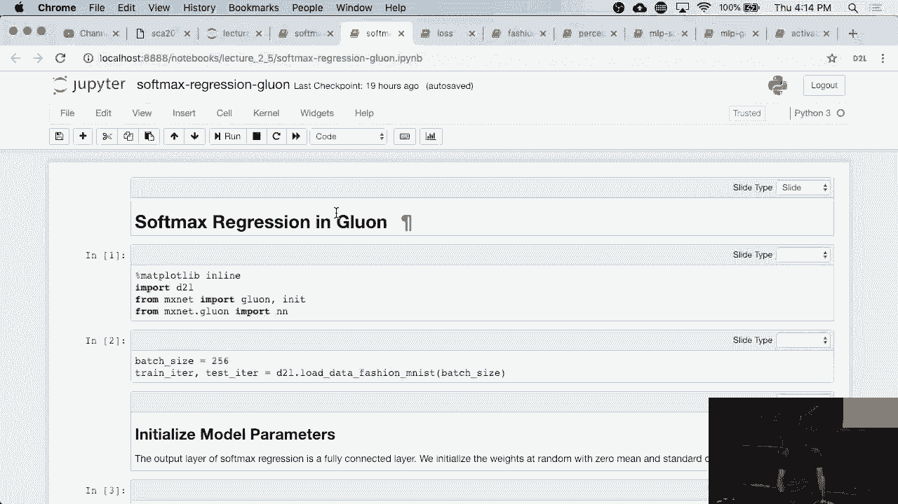

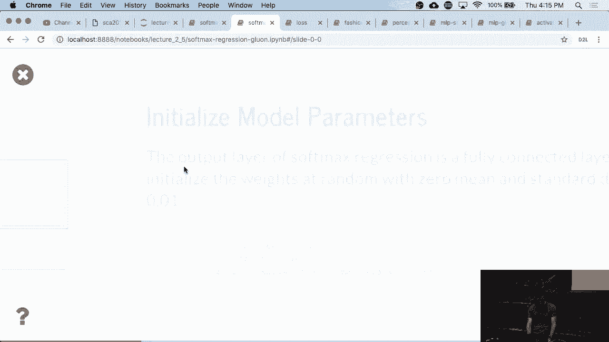

 So it looks exactly the same as before。 We just go and import the data。 Right？

 So this is exactly the same code as before。

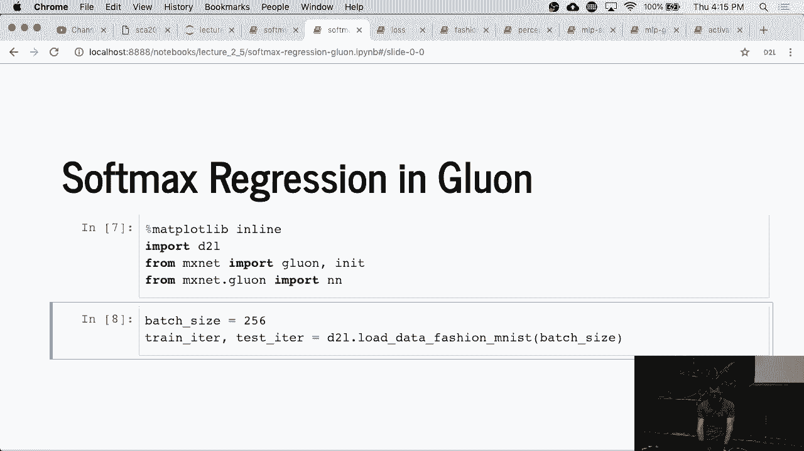

 The only difference is that now i can make my life really。

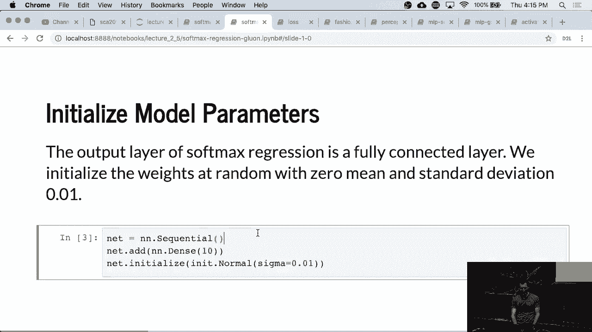

 Easy。 And i just define my network by saying， Hey， it's a sequential composition of layers。 And i have a whopping total of one layer。 And i want those parameters to be initialized with no。 Distribution with variance 0。01。 So that's it。

 The interesting thing is i didn't have to specify the， Input dimensions anymore。 The network is smart enough to。

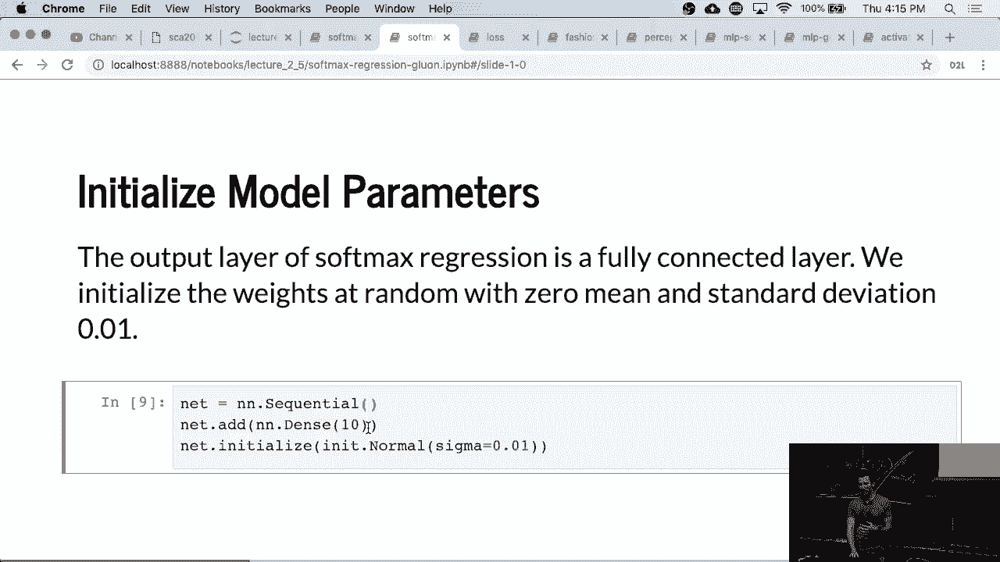

 Automagically configure the amount of parameters and the sizes。 And everything based on the size of the inputs。 So that's very convenient。 So if i， rather than 28。 By 28， i might have maybe 30 by 30 pixels。 It will still work nicely。 By the way。 this flexibility comes with a serious downside in， Practice。 So a customer who shall not be。

 Named took one of the computer vision models that we had that， Were trained on 224 by 224 pixels。 So fairly small image net size。 And they applied it to 4k。

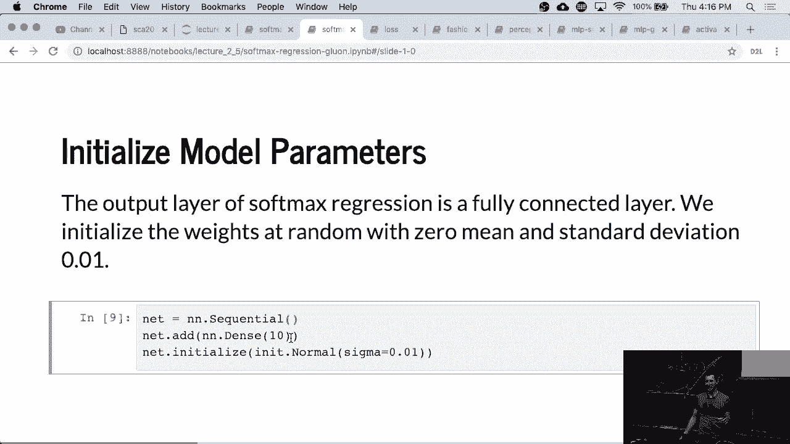

 Images。 Okay。 So those 4k images created a lot of intermediate memory。

 We'll get to convolution networks and so on later on。

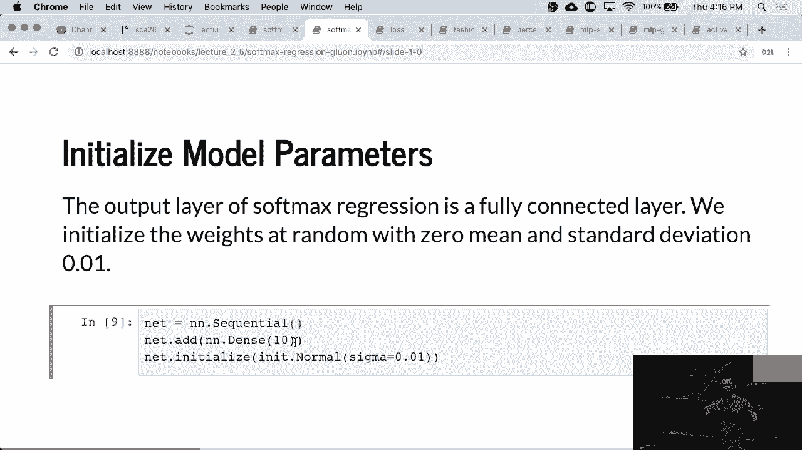

 But basically， the system ran pretty much out of memory and， Was horribly slow。 I mean。 it was mathematically correct。

 But it was a not terribly enlightened thing to do。 And then we got a report that our network isn't working。 So be careful when you make things automatic。 You can be pretty much sure that the users will abuse the。

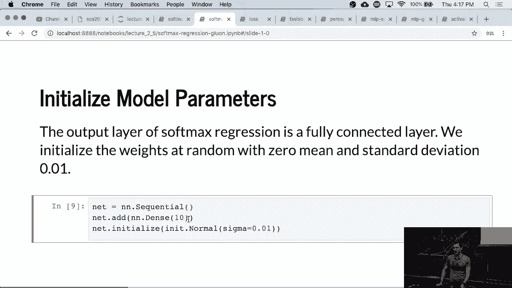

 Interface in some interesting ways。

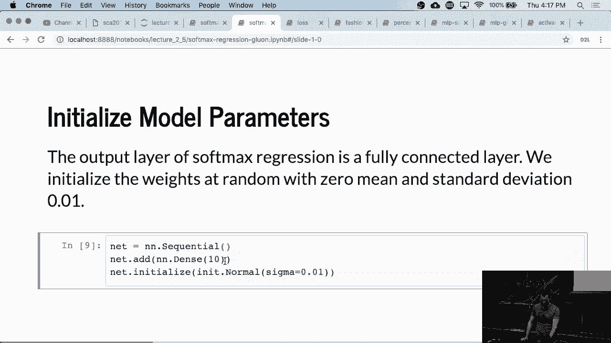

 Okay。 But we're not going to do that here， Obviously。 Okay。 So here's the softmax。 And now this is the numerically stable version of it。 So glue and loss， softmax cross entropy loss。 Okay。 We could have picked a shorter name， But you don't need to use it more than once。

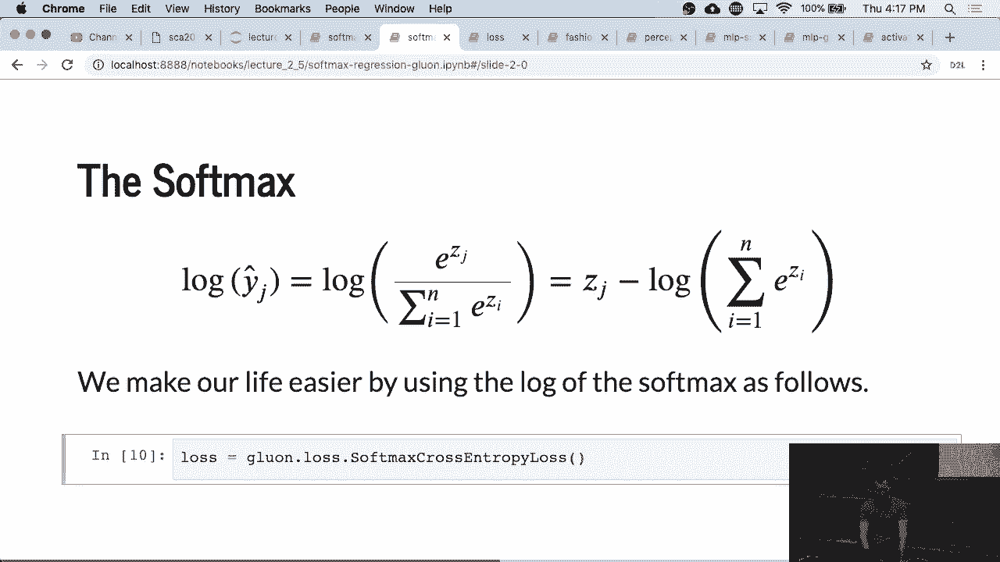

 Here's an optimization algorithm。 And a very simple one is， Stochastic rate descent。 It's actually doing something， Slightly smarter than Stochastic rate descent。 It's actually performing momentum and weight clipping and so on， Unless you switch it off。 So it's a very smart version of， S。G。D。 but for all intents and purposes， This one's fine。

 Just use that。

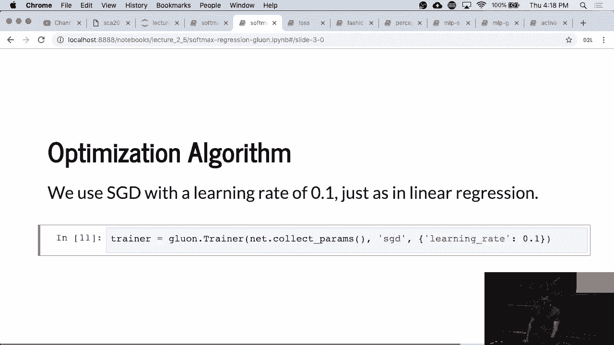

 Okay。 And then we can go and train。 And the call signature of this is exactly the same as what we。

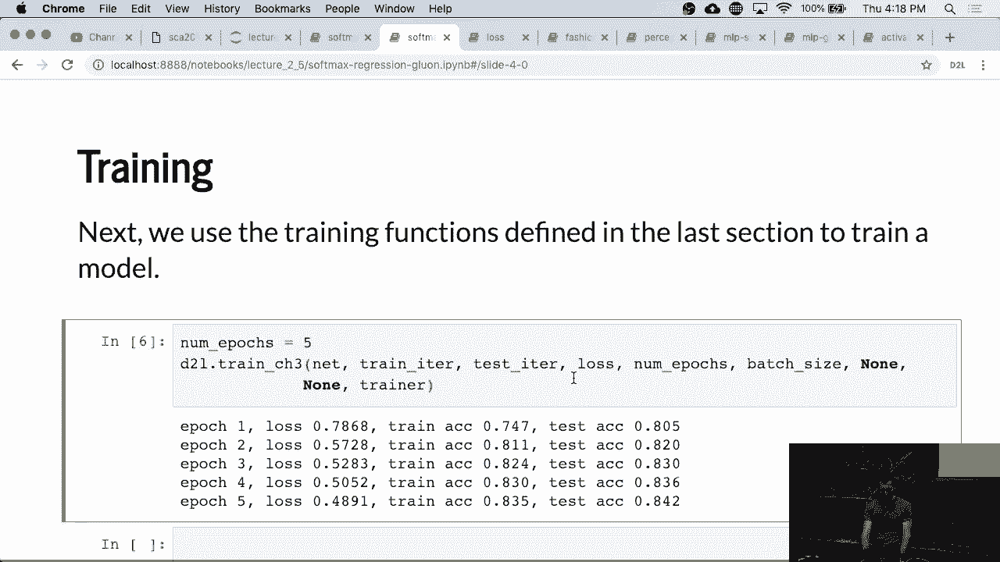

 Have before。 So except that it runs。

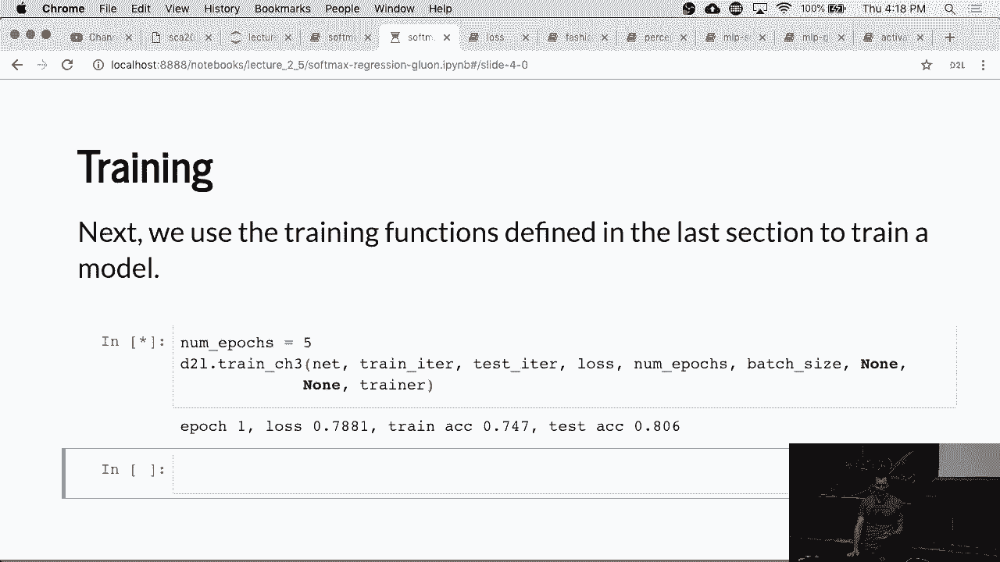

 Marginally faster， you probably wouldn't be able to tell much。 Here because the overall operations are still very。

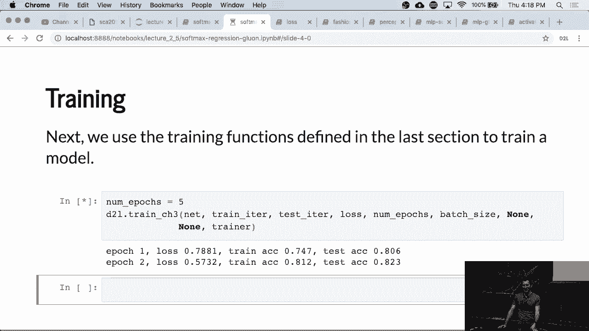

 Straight forward。 Once we go to more complex networks， We'll actually see that it does run faster。 Okay。 Anyway， so this is training that， Networking glue on。 It looks very similar。 Any questions so far？ Okay。

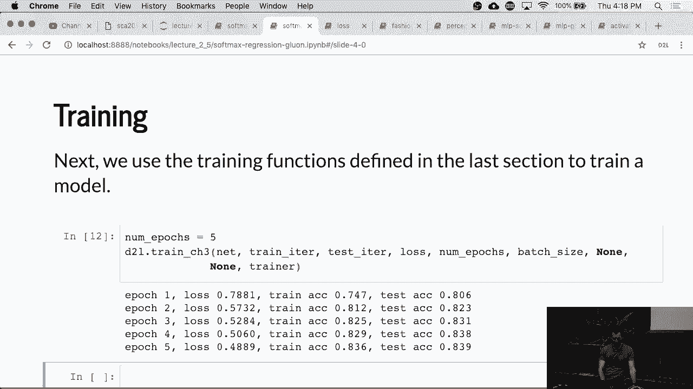