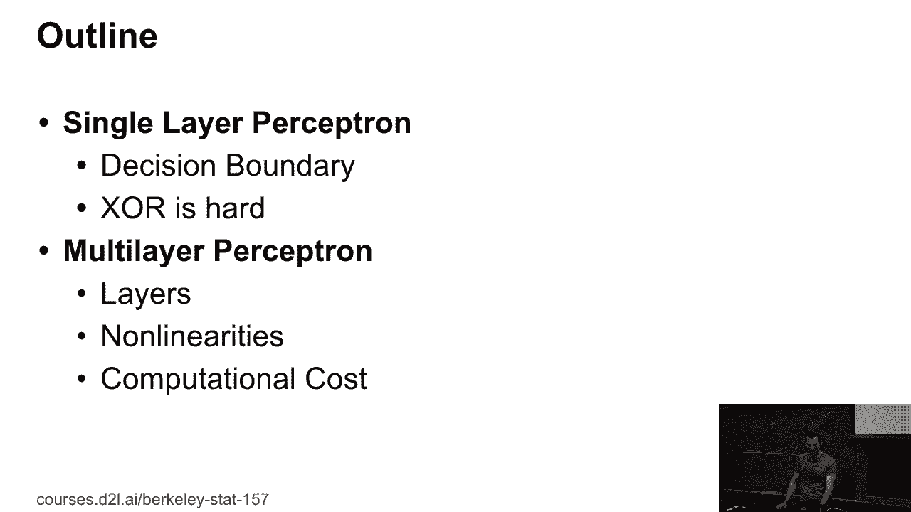
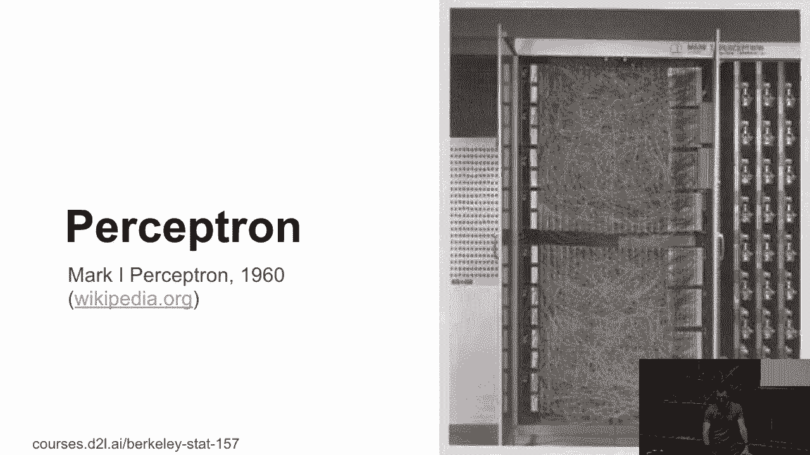
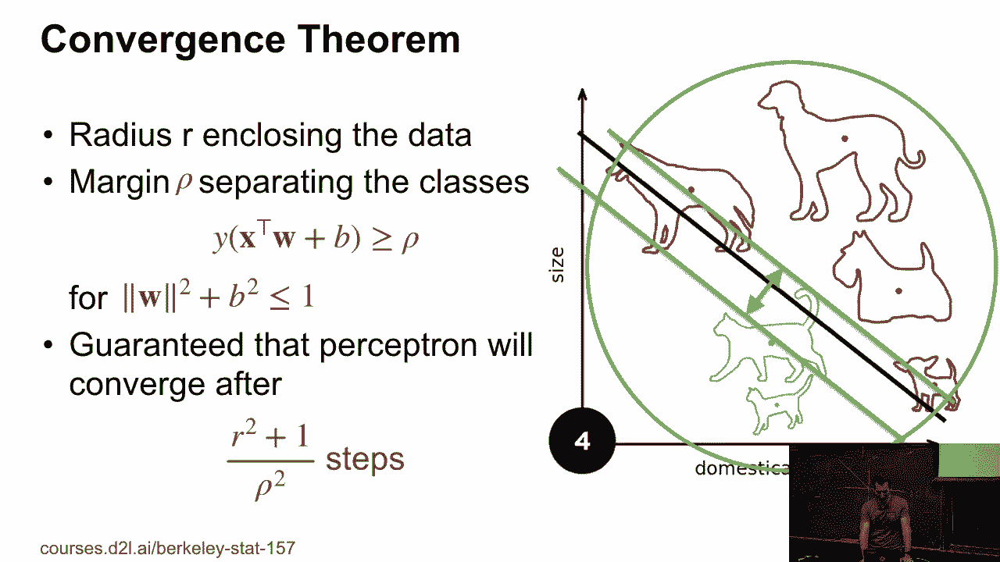
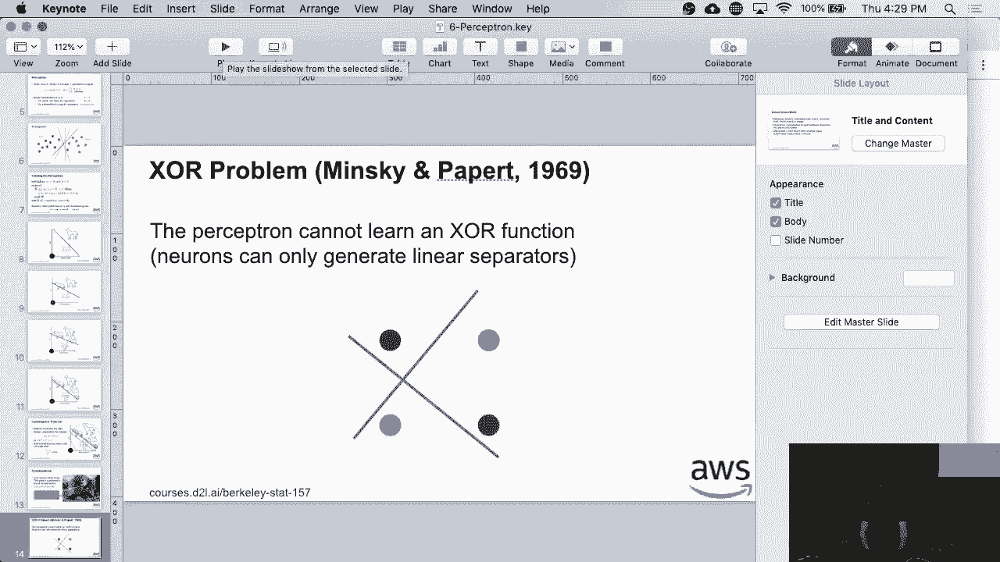
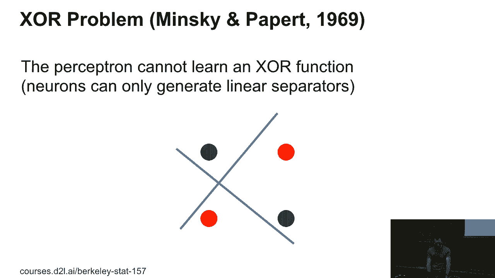
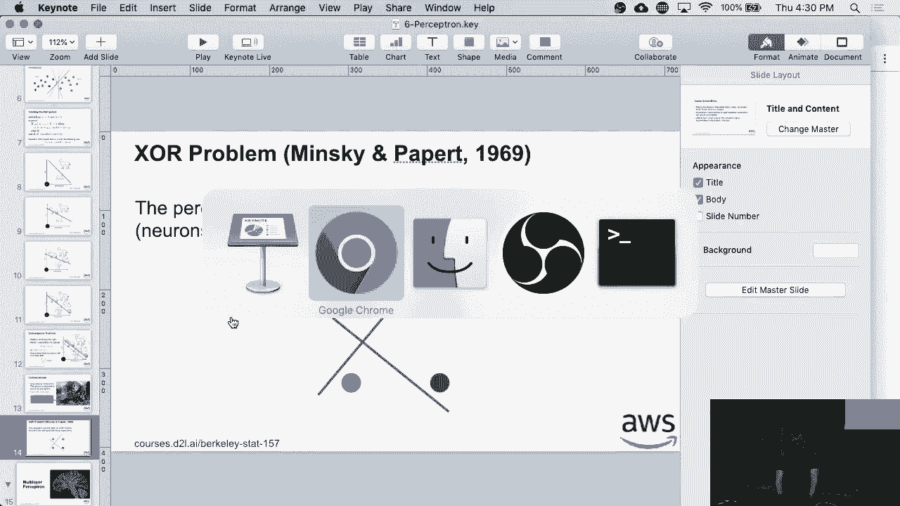
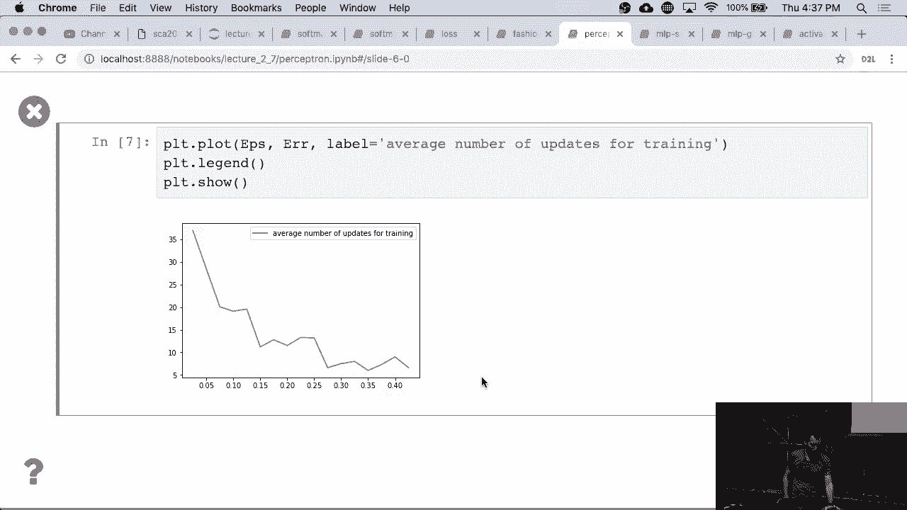

# P26：26. L6_1 Perceptron Algorithm - Python小能 - BV1CB4y1U7P6

 OK， so far we dealt with really boring stuff， so this was essentially state of the art， 1950， 1960。 So we need to move slowly to the '70s， and so I hope that by the end of today we will。 have reached the '70s。 So in order to do so， let's first actually look at a little bit what people in the '50s。 did with neural networks。 And so for that we need to look at the perceptron and what Mr。

 Rosenblatt did and all of that。

 And then we'll take care of the multi-layer perceptron。 So this is the Mark I perceptron， 1960。 It's a nice space heater。

 And yeah， so Bitcoin miners are small by comparison。 But anyway， so there's the perceptron， right？

 So we've already seen this a few times， so my output is some non-linear function of the。 inner product between， let's say， W and X， and then I have some constant and let's say。 it's one if it's positive and zero otherwise。 So this is nothing very special。 And mind you。 I mean this is like there are three different ways how you can look at this。

 So binary classification just outputs zero one。 But you could also have a real valued scalar term for regression or you could have probabilities。 and I mixed up those two lines。 So that'll be fixed in the slides later。 But if you look at what kind of decision boundaries you can get with this linear function， well。 if I have the normal equation for a plane， which this really is， if I require that W。X。

 plus B equals zero， they get any one of those lines。 And so I could， for instance。 classify ham from spam if I want to the spam filtering and， this is with a simple linear function。 Quick question， out of all those classifiers， which one do you like best？

 Who likes the red one best？ Hey， it's a nice color， right？ Okay， nobody likes red here。 Hey。 how about purple？ Okay。 How about black？ Okay。 How about green？ Okay。 So why did you all raise your hands for green？ Because I asked with last now。 So why do you like green best？ Yes？ It maximizes the margin of separation from any of the two classes。

 Now if you had done your PhD in the '90s， this would have led to support vector machines。 and all sorts of things。 And basically the way how to make this nonlinear would have been to map the entire data into。 some nonlinear representation space。 But since this is now almost， you know， it's 2019 now。 So you would do things by finding a good embedding of the data， which actually is the same thing。

 as mapping it into this nonlinear space， except that you're learning that in time。 So if you want to have a difference between kernels and neural networks， in one case， the。 engineer invents the embedding in neural networks， we learn it。 In any case。 this is a good way of separating data。 And it works quite well。

 Now how would you train such a thing？ And this is an algorithm。 This is probably the first deep learning algorithm ever。 All right。 So it's a perceptron algorithm of Frank-Rosenblatt。 It goes as follows。 Initialize w and b equals 0。 And then iterate to the data。 Whenever you get something wrong。

 so w dot x plus b times yi less equal than 0。 So that means I'm on the wrong side of the margin of the separator。 Then add yi times xi to the weight vector and add yi to the bias。 You keep on doing this until everything is classified correctly。 So this is the same thing as performing stochastic gradient descent with batch size 1 with this。

 loss function。 Let me write for you。 This is the loss function that I'm using。 Well， actually。 to be correct， this is the loss function。 So here I'm plotting yi times f of xi。 And this is the loss。 And so if y times f is greater equal than 0。 it means that I'm predicting class 1 and， the label is 1， so everything's good。 If I'm here。

 it means that label and prediction don't match。 And then I incur a loss that's proportional to how badly I get it wrong。 Now of course， the derivative of that is this function here。 In other words。 you get an update by just the observation that you have or you get no， update at all。 OK。 everybody's cool with that algorithm。 So this is shamelessly stolen from Wikipedia。

 Let's say I want to separate cats from dogs， I have some separator， I get the new observation。 I change the classifier， keep on doing this， and yeah， eventually I get that。 So there's actually a theorem。 And that theorem is exactly in terms of the margin of separation。 And so I've got the large margin cat and dog separator with exactly that width。

 And basically the theorem says if I can bound my data within some radius r and if for a unit。 vector w， so norm of w squared plus b squared less equal than 1。 So if I can find some weight vector and bias combination that's less equal than 1 in terms。 of overall length， then I'm guaranteed that the perceptron will converge after r squared。

 plus 1 over rho squared update steps。 Not number of observations but update steps。 So why is it update steps rather than number of observations？

 Have you ever been in a terribly boring lecture？ So if you ever were in a terribly boring lecture you learned nothing new and so you。 didn't learn anything， you didn't update the internal model。 On the other hand。 if you're in an interesting， exciting lecture， then you will very often。 have to update you in a model of how the world works。 You will update your parameters。

 So I hope that when I fall into this latter category， so you will converge rapidly。 But hey。 we're trying。 So now let's actually see how this works in practice。

 By the way， just one quick insert before we do this。 So this is game called black and white。 You guys probably don't remember it and the game makes you actually impost after this。 And so this game， so I'm telling you this because this is one of the very first applications。 of machine learning in a computer game。 So the thing was you basically played God and you had this avatar and the avatar would。

 try to do and mimic what you were doing。 And your goal was to teach the avatar to be benevolent if you want to play benevolent。 God or evil if you want to be evil。 So you could smash the villagers or you could feed them， right？

 Stuff like this。 So what they did is they used a perceptron algorithm to learn based on contextual parameters。 and so on what the avatar should do。 Now this would have worked really nicely if humans were actually consistent。 Turns out humans aren't always consistent at least not in their representation space。 picked by the game designers。 And so what happened is that basically the algorithm which should have converged towards。

 a avatar that's very beautifully trained didn't converge to that and the game just progressively。 became harder and harder to play。 Which is probably one of the reasons why you haven't heard of this game。 So bad machine learning actually ruined the entire game studio。 So don't do that。 So now before we go to the XOR problem we actually I'll leave you with that for a moment。

 Then we'll look at the examples。 So there was this AI winter around early 70s and this was due to those two guys。 Minsky， and Pappard。 And what they proved is that if I have a simple XOR problem my perceptron cannot learn。 it。 Basically fair line the reds and green dots this way I cannot find in the line that will。 happily separate those into reds and green separately。

 So that sounds like a pre-fundamental flaw to neural networks and that pretty much set。 back machine learning via like 5 to 10 years。

 And of course there's a nice solution to that because otherwise we wouldn't be teaching。

 machine learning now。 But let's actually look at the perceptron how it works。 So this is really just okay let's import the data just as I would。 And now to make things interesting I need to create some separable training problem and。 I'm just going to create some random data。 So now in order to make this problem separable so first of all okay I create a random weight。

 vector W fake and B fake and then I make sure I rescale it okay so this is essentially。 no weight in bias。 And then I go and create random data so they exist in the Y's。 And I go through all the data and I check whether the data can be accurately classified。 into let's say 1's or minus 1's according to W and if not then I throw it out otherwise， I keep it。

 So I basically assign it a label 1 or minus 1 and if it's too close to the margin I just。 throw it out。 So that's essentially all I'm doing so that's what this epsilon does right。 So this is the margin as scale greater than epsilon。 The margin is basically in a product here let's scale。

 So if I cannot separate it confidently I throw it out otherwise I add it to my training set。 So that's my data generator generates fake data。 And then well what I need I need some plotting routine I need to know I need to get the contour。 plots because otherwise I can't really tell exactly how well converse I am because okay。 so that's that that's kind of vanilla I don't think there's anything particularly exciting。

 in there we need to cover and so now if I wanted to run this it's not very good it basically。 created only data of one class。 So here we have some data read in blue dots that are reasonably well separable。 So now let's actually implement the perceptron algorithm and this perceptron algorithm does。 exactly what I described。 If y times inner product between w and x plus b is less equal than zero perform an update。

 and say that I made a mistake otherwise return zero and do nothing。 Okay so I start with w and b set to zero and iterate to the data。 And so basically I just perform a perceptron update and if I encounter an error I print。 up my parameters and then I just keep on updating things。

 Now for that let me quickly zoom back to the regular mode because it will not show very。 nicely otherwise。 Okay so let's run this code。 So initially it doesn't do very much this is my classifier and this green dot is what。 I misclassified so I get the separator。 Of course that's not particularly interesting so let's see what happens after I get one more。 observation okay here's another green dot。 So now this is positive class so now my classifier already starts looking a little bit closer。

 to what I should have gotten。 Okay after the next mistake this one here it starts separating the data quite nicely so。 we're pretty much done except that the bias is wrong。 Okay so here's another observation okay updates this。 The one updates that。 Another one here and okay so I'm done going over the data if I went through it another。

 time it would be converged。 So this is the perceptron algorithm in action I've basically shown you every single error。 that it made after one pass the data。 Any questions so far？

 Okay so now one thing that's kind of interesting is to check whether you know how difficult I。 make the problem actually has any bearing on how many updates I need to make。 So what I'm doing is I basically just pick a range between you know 0。25 and 0。025 and 0。025。 has a range of parameters for the margin so large margin means easy problem narrow margin。

 means difficult problem right。 And then I just go and actually generate random data do that a few times run the perceptron。 algorithm count how many times it takes until it's done and then I plot this。 So I'm not going to run this piece of code right now which this would take a while because。 it's very efficiently written。 But if you ran it and waited for a while you will get this curve。

 So remember where we had the perceptron convergence theorem where we had basically no radius of。 a margin right。 This is exactly that bound nine practice。 But of course in reality it's a little bit better than the worst case bound but you can。 still see the same behavior namely you can see that as the margin gets wider the number。

 of updates decreases so for a very simple problem I might need only maybe four or five。 updates in order to converge。 Whereas for a really difficult problem I might need you know 20， 30。 40 updates。 Okay。 Any more questions about the perceptron？ Okay， cool。

