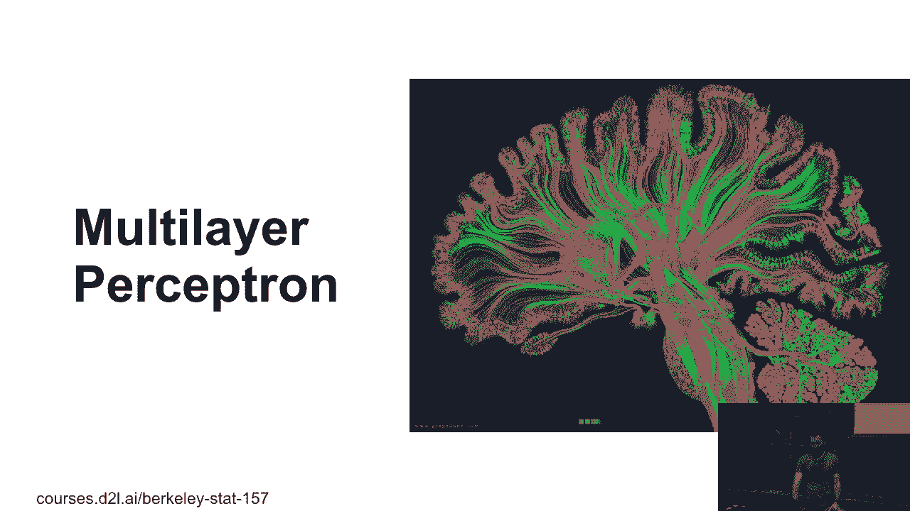
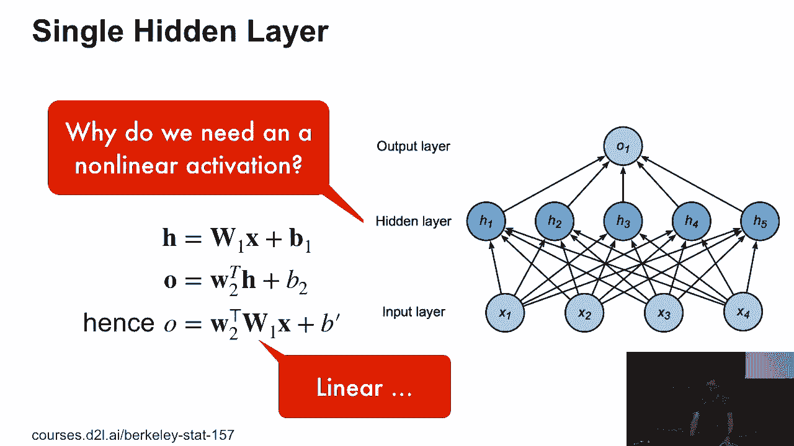
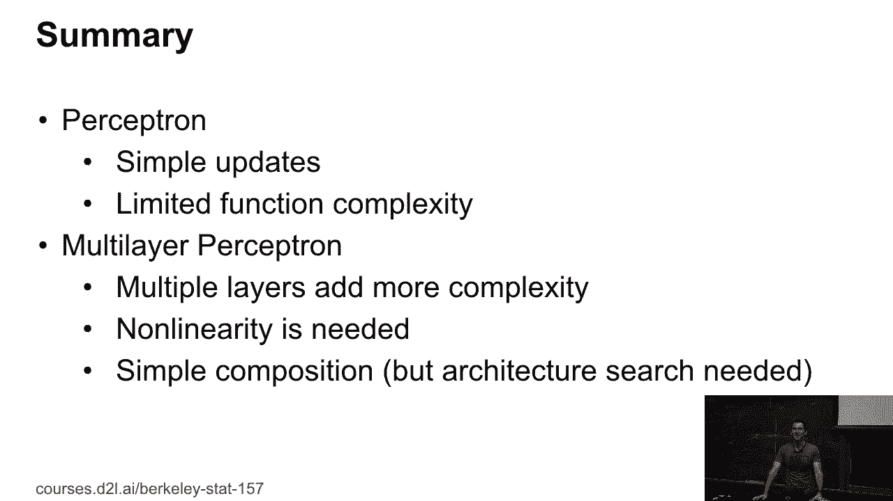

# P27：27. L6_2 Multilayer Perceptron - Python小能 - BV1CB4y1U7P6

 So in the exo problem， we had the issue that a linear， separator isn't going to be able to separate。 well， some， very， very simple data。 Now， the obvious solution in hindsight is to go to more。 than one layer。 And mind you， the brain does the same thing， so there's。 this pretty picture of the brain。 And it's connectivity structure。

 OK， so what does this all have to do with XOR？ So let's just look at those two classifiers。 So one that just splits for a result， and one that splits vertically。 Neither of those actually helps， but I could easily， implement each of them as a linear classifier。 So I have the blue one and the orange one， and they split， other points， one， two， three， four。

 according to those， plus and minus signs。 But now the really cool thing is that if I take the product。 of those two classifiers， I get a solution to the exo， problem。 which is utterly unsurprising given that I can， actually write XOR as multiplications in this way。 So this should surprise absolutely nobody， but logically。

 it's quite neat because this is really just a deep network， with a hidden layer。 So I'm taking first output， second output， multiplying it， together in the next layer I'm done。 OK。 so that looks nice。 Let's see whether we can do more。 So here's a single hidden layer。 And if I have a classification problem for the output， well， here's the output。

 I'm going to call the output O and the hidden layer H。 Now， in this case。 I mean I have some degree of freedom， besides choosing which parameters to pick。 I can choose how many hidden units I have。 If I take a lot of them， I can possibly model a more。 complex function class。 If I pick very few of them， I can't do so much。

 And there's a very nice fundamental work， which says， I。 can pretty much approximate any interesting function by just， adding enough hidden units。 The problem is this is a beautiful general theoretical， result that's utterly useless in practice。 Because nobody would ever do this because this would give， you a very unpleasant。

 not easy to work with function class。 But at least you know you could do it if you really wanted to。 So here's the math。 We have some input x。 We have some output。 We have hidden for the hidden layers。 So we have some parameters w at 1 and bias 1。 For the output， we have some vector w2 and bias w2。 So that's the scalar。 And so for the hidden layer， I have some nonlinearity of w1， times x plus b1。

 And then for the output， I have w2 transpose h plus b2。 And the sigma is an activation function。 So why do I need an activation function？ Any ideas？ Yes？ Otherwise。 it's just that you don't have an activation， function no matter how many layers you add on this。 Exactly。 So otherwise， I end up with a linear function after all。

 Because I can just apply one after the other。 And one matrix multiply by the next one。 It's never going to be nonlinear。 Actually， I can make matters worse by adding more layers。 Why could I make things worse？ Why is it a terrible idea？ Overfitting？ Not really， because， I mean。 ultimately， it's just a linear function， except that you have a really， weird parameterization。

 But you're on to something。 Some other suggestions？ Yes？ [INAUDIBLE]， No。 that's the same thing as overfitting。 That's not really going to help us。 But some very practical issues。 [INAUDIBLE]， So exactly。 So there are two things。 The first thing is it might take forever to converge。

 because I have a very large set of equivalent networks。 And so I may not converge very well。 and it'll just run， around in that space。 The second thing， and that's the more mathematically。 dramatic one， is I may actually have a less expressive， network that way。 So let's say I have 10-dimensional input， a 10-dimensional output。 In the middle。

 I have maybe five hidden units。 Then I automatically force my network。 to be just of dimensionality 5， in terms of basic rank of， that matrix。 And that considerably restricts what I can do。 So not only do I lose expressiveness， I can actually。 make things worse in a simple linear model。 So that's why we need an activation。

 So here's some activation functions。 It's one of the simpler ones。 It's 1 over 1 plus e to the minus x。 And this used to be a very popular activation function。 a long time ago。 He seems to you nobody uses this one now anymore。 Does anybody have an idea of why this is actually， a really bad idea？

 So Jan LeCah even used to have a stop sign with the sigmoid， in it and across through。 So why is it a bad idea？ Yes？ [INAUDIBLE]， Exactly。 So for very negative inputs and for very positive inputs， the gradient goes to zero。 And there's this tiny goldilocks zone somewhere between， maybe minus 2 and 2。

 where interesting things happen。 And if by some bad luck， your input scale got out of range。 such that you ended up in either one of those two flat， regions。 then your optimization algorithm would， essentially get stuck。 which you wouldn't get any meaningful， gradients anymore， everything vanishes。

 It just takes forever to converge。 So there's another one。 It's a tangent。 And then one's just as bad， because it's just the same， thing as before， just with different scales。 So you can actually show that these two functions are， equivalent after some rescaling。 Now what does everybody use now？ Everybody uses this thing called relu。 Rectified linear unit。

 But relu sounds so much fancier。 It's just a max of x and 0。 Right？

 So if you talk relu then everyone goes like， oh， you know， deep learning arc。 Jargen。 So that's why remember that you can impress people。 Now this actually doesn't have this problem quite so much， anymore。 So at least it only has half that problem。 So there's a half space where your gradient will not vanish。

 Actually， for that half space， your gradient will be just one。 For the other half space。 it's still zero。 But OK， it's at least a lot better。 So given that， at some point。 some people came up with an， idea， well， let's fix their pro on the left hand side and。 use something called a prelude。 And the prelude is essentially the relu。

 But just where the constant zero is then shifted a little， bit below or above。 And that really then is also learnable to some extent。 So in other words。 rather than this function here， you use， maybe that。 Then you have some coefficient alpha and you can learn it。 In some cases。

 it makes things a little bit better。 So don't bother unless you really know you have this， problem。 So these are all the activation functions。 So now we can do multi-class classification。 And the only thing we need to do for that is we have input， layer， hidden layer， output layer。 And then I run a softmax on top of that。 So in terms of math， well， hidden layer is sigma of w1。

 times x plus b。 The output is w2 times h plus b。 And then y is softmax of o。 And I should have both faced o here。 So then， because we like this so much， well， we can have。 more layers。 And if you use only graph， well， that's easy。 But at some point。 it gets really hard to specify that way。 So this is where specifying networks in code is going to。

 be a lot easier。 Now， once you have that， you have a lot more freedom of， design。 free design parameters， right？ You can add more layers。 You can make it deeper。 You can add more hidden units。 And depending on how you do this， for instance， you could。 make a network that's just straight up and then just。

 goes to outputs or that's narrow in the middle and it gets， wider again。 And this is really something where you may want to tune。 things a little bit for the specific data set at hand。 And so that is all about multi-layer perceptrons。 You now will have just enough time to actually try this。

 out in practice。 Any questions so far on the theory？

 No questions？ Good， awesome。 [BLANK_AUDIO]。

