# P29：29. L7_1 模型评估、过拟合与欠拟合 - Python小能 - BV1CB4y1U7P6

今天我们将讨论模型选择和两种识别方法。

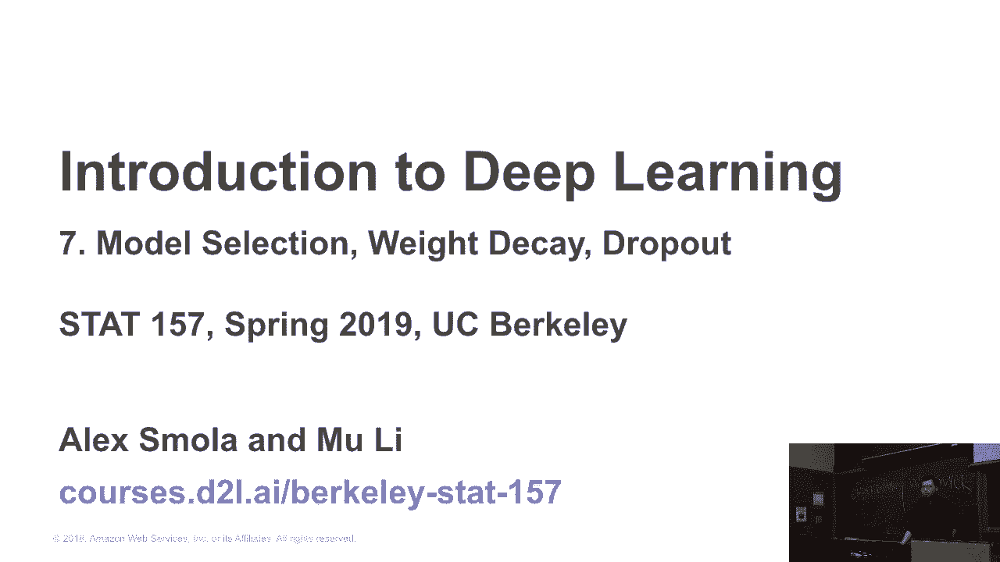

所以让我们从作业四开始。其实，这将是一个非常有趣的作业。你将参加一个Kaggle竞赛，预测房屋销售价格。我们已经讨论了好几次房屋销售价格的问题。现在，你的任务是将作业提交到Kaggle。我们将为你提供一个基准模型。

我们已经提供了如何下载数据集，如何构建基准模型，如何提交。我们已经有了这些步骤。但这个模型只是提供了一个非常基础的模型，你可能会在Kaggle上排到1000名左右。现在，你的任务是尽最大努力。半年前，我们也开始了这个活动，班上十个学生成功进入了Kaggle的前十名。

但现在情况有点复杂，因为半年已经过去。可能有2000人参加了Kaggle竞赛。所以你不太可能在一周内进入前三名，但你可以尽力而为。所以我们建议你与团队合作，特别是你的项目团队。你可以和你的团队合作，熟悉你的队友。

因此，我们还将为前三名个人或团队提供500美元的ADOP积分，他们实际上在你提交的作品中排名前三。所以这500美元将有助于你的项目，你可以用它来尝试甚至是更复杂的模型。所以这是作业四。在周四，我们将一起回顾我们将要使用的笔记本。

但我们建议你尽早开始，因为Kaggle没有未来账户。你每天最多只能尝试五次。而且你有很多想法需要尝试。可能需要五个小时。如果你打算花五个小时，我建议你每天花一小时，而不是在最后一天集中五小时。好的。

这就是作业四。

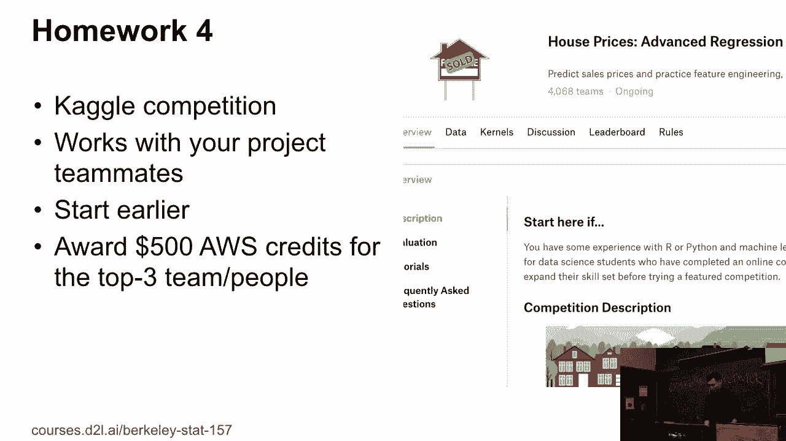

所以今天我们将讨论模型评估。让我们考虑另一个例子。我们没有这个例子的竞赛，但这是一个激励性的例子。假设有一个雇主雇佣你调查谁会按时偿还贷款。你收到了100名申请者的信息。你获得了每个申请者的所有信息。

你获得了所有申请者的个人资料、银行账单和面试视频。然后是100名申请者的一个月数据。五个人在三年内违约。你的任务是预测未来谁可能无法违约。

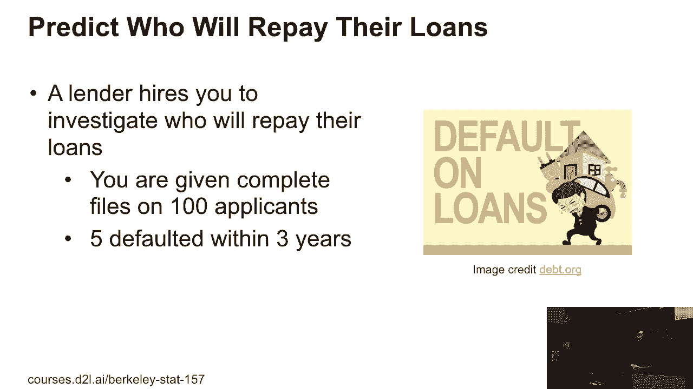

然后你查看数据，惊讶地发现所有五个违约的人在面试中都表现得非常自信。这是一个相当强烈的信号，因为这里没有人实际做出夸大的行为。所以这意味着，平均来说，大家的自信表现可能较低，但这里我们有100%的自信。这可能意味着某些东西。比如那些特别自信的人可能更容易违约。

但你永远不知道。可能是巧合，也可能是一些有意义的事情。只要你能够找到这些信息，你就可以建立模型。模型也许能够找到这个强信号。然后你的模型可能会把这个信号当作你拥有的最强信号。

在面试期间发放传单时，你的模型会立即告诉你，好的，这个家伙不能违约。那么这里有什么问题呢？谁知道这里有什么问题呢？好的，可能是另一个问题，另一个答案。好的，这里的一个问题是我们只有五个违约的人。如果我们有10,000名申请者，其中有100人违约，也许每个人的违约机会就不那么明显了。

传单就像他的下属。好的，所以希望这个动机示例能告诉你，很多因素对于你在应用中构建好模型至关重要。

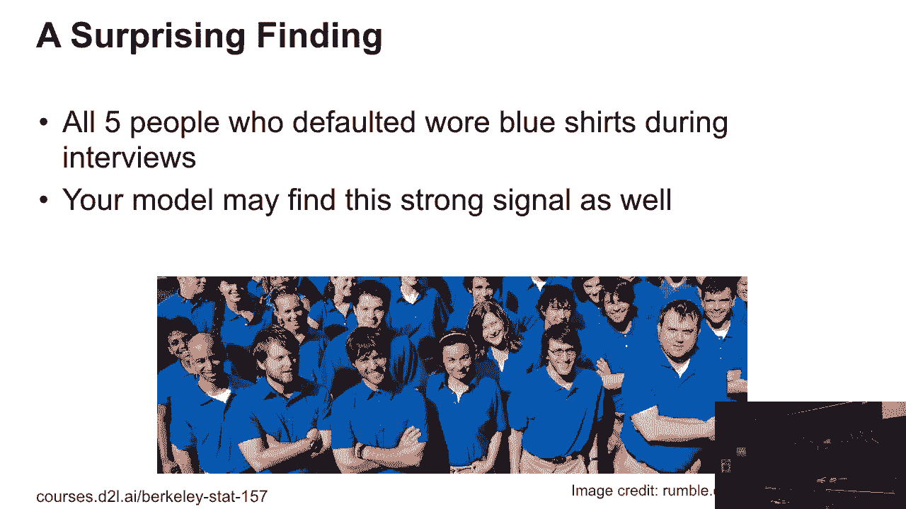

所以我们先来谈谈模型评估。

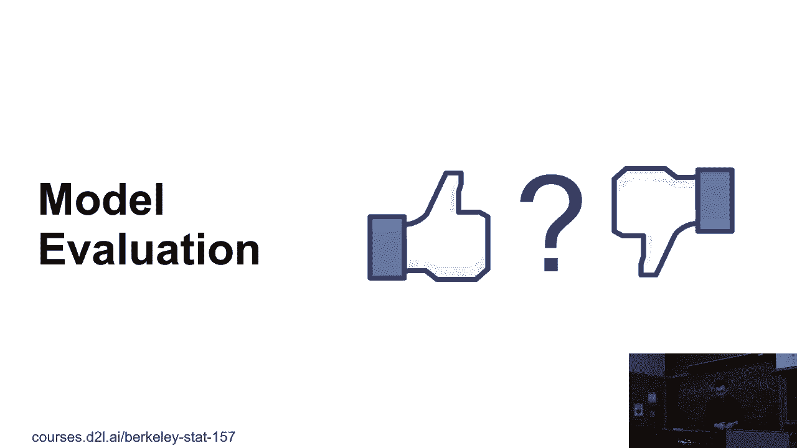

到目前为止，我们只谈论了如何计算训练数据集上的箭头。训练数据集是你用来训练模型以获得模型参数的数据。在实践中，我们更关心的是泛化箭头，也就是模型在新数据上的箭头，这是你之前从未见过的数据。让我们举个例子。

假设我们要为未来的考试做准备。例如，假设我们没有期末考试。但你可以根据之前的考试路径来进行考试。你是否按照这些考试来进行训练，我们称之为“训练箭头”？

这并不能保证你在未来的考试中得到好成绩。例如，有一个学生通过死记硬背所有答案，在路径考试中得到了零分。而另一位优秀的学生则试图理解解决方案背后的原因。他可能没有得到零分，但这个学生可能在未来的考试中做得更好。

所以我们可以将这个扩展到作业上。例如，我们已经发布了两次作业的解决方案。那么你可以为今天讨论的第三次或第四次作业做准备，参考所有第二次作业的解决方案。这里可能有什么问题呢？谁知道呢？

比如我们准备前两次作业的原因，抱歉，问题是，我们为什么要基于第一次或第二次作业来准备第三或第四次作业？这里可能有什么问题呢？

这里的问题在于，第一和第二次作业涵盖了不同的主题。如果你在第一和第三次作业中做得很好，你可能已经理解了相关的主题。但对于第一作业，你做得很好，但不一定理解第三和第四次作业。但是考试不同，考试是覆盖整个课程内容的。

今年和明年我们假设这个领域的变化不大。我们覆盖的考试是类似的话题。这就是为什么我们可以根据过去的考试来准备未来的考试，但基于过去的作业准备作业却比较困难。

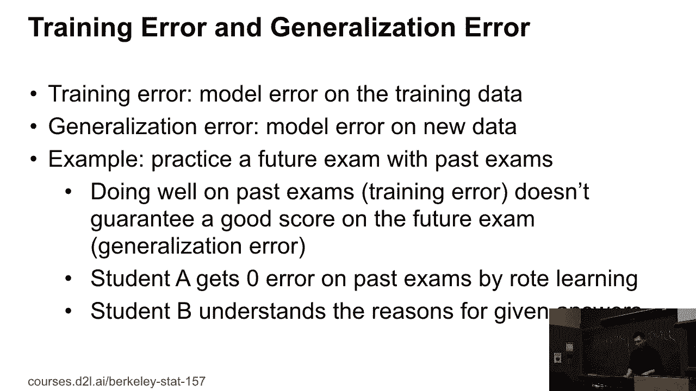

我们关心的是泛化误差。我们需要准备如何评估。通常我们做的一件事是，我们有验证数据集。这个数据集用于评估模型，而不是训练数据的一部分。这个数据集我们不会用来更新你的模型。

比如在这里，我们可以将一半的训练数据作为验证数据集，然后在剩余的另一半数据上训练模型。机器学习中常见的第一个错误就是将训练数据和验证数据集混淆。让我举个真实的例子。几年前，我们有一个团队尝试训练如何对图像进行分类。他们尝试的第一个数据集是对ImageNet进行分类。

ImageNet包含了百万级的图像，涉及数千种物体。他们在ImageNet上训练了模型。然后，他们想评估这个模型的效果。这个团队做的事情是让另一个人尝试给你提供相同的数据。我给你所有的标签，现在你的任务是把这些标签当作猫、狗，去Google搜索，抓取图像，并使用这个新数据集来验证这个模型。

这里可能有什么问题？有没有人有什么想法？我们在ImageNet上训练，然后在Google上搜索并抓取图像来验证你拥有的模型。问题是，在原始的ImageNet数据集上，他们搜索了查询词或Google，然后获取了一堆图像并进行了标注。如果另一个人尝试搜索一个细节，假设在Google上输入查询词，你可能得到相同的图像。它可能已经是训练的一部分。

取消清洗。我们成功了，因为我们与Google进行比较，与我们自己的验证数据集上的其他来源进行对比。我们的服务获得了最高的分数。如果我们真的尝试，结果可能没有那么好。不同之处可能非常微小，因此你需要非常小心训练和验证数据集的使用，特别是如果你做研究，发现哦，我得到的准确度比...要高很多。

之前的工作表明，95%的好结果可能是因为漏洞。首先你需要关注你使用的验证数据集。你不能把训练数据和验证数据集混合在一起。验证数据集将用于评估模型。

你可以根据验证数据集选择模型。你可以尝试不同的学习率，尝试不同的模型架构，然后根据验证错误来选择模型。接下来还有一个数据集，我们称之为测试数据集。

所以这个数据集类似于验证数据集。你可以用它来评估模型的准确性。但你只能使用一个数据集。例如，你在第一次参加考试时获得了分数，下次考试你可能没有算在内。如果你要建造一栋房子，最终房子的售价将会评估你的策略。

你没有第二次机会。如果你曾经参加过比赛，你就知道有一个公开排行榜。每次有些结果，你无法立即得到反馈。但有一个私人排行榜，它更接近比赛结束时的结果。

所以人们会根据私人排行榜评估他们的表现。因此，私人排行榜只能在比赛结束后使用一次。测试数据集更接近泛化误差。因为你只会尝试一次。而验证数据集的准确率通常会更高，因为你是基于模型选择的。

在验证数据集上，你选择模型，预处理这些数据。但实际上，我们并不使用测试数据集，只会使用一次。在实际中，我们讨论的是，这个模型的测试准确率通常意味着验证数据集的准确率。所以在这门课上，我们将使用测试数据。测试准确率实际上意味着验证数据集的准确率。

严格来说，测试数据集只能用来作为比赛或者期末考试的成绩。那就是测试误差。

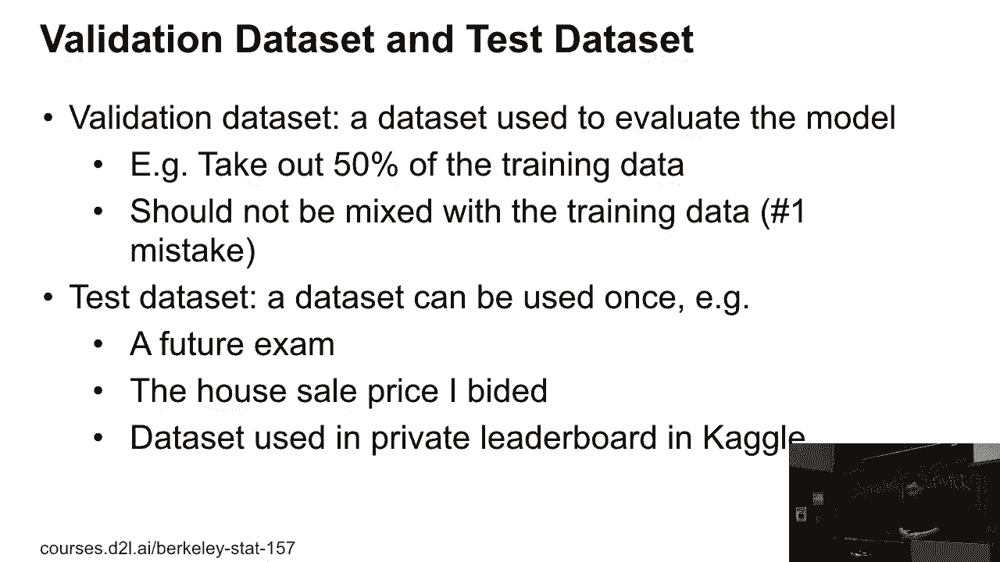

好的，一个常见的问题是我们没有足够的数据。因为验证数据集是带有标签的。在实际中，我们通常将部分训练数据作为验证数据集。如果我们使用一半的数据作为验证数据集，那么我们可以用剩下的一半数据来训练模型。

如果数据量很小，那么我们可以讨论为什么这是一个问题。你没有足够的数据来训练一个模型。你可以使用的一个常见做法是K折交叉验证。这是你在作业中将使用的关键方法。所以接下来的工作是这样的。给定训练数据，示例是有标签的。我们将数据分成K部分。然后我们重复这个过程。

每一次，从1到K，我们选择其中一部分数据作为验证数据集，剩下的K-1部分作为训练数据集。我们在训练数据集上训练模型，并在验证数据集上获得验证准确率。我们重复K次，然后计算K次的平均验证误差。

这个是交叉验证准确率或交叉验证误差的关键。所以如果你选择一个很大的K值，这意味着我们将用来训练的数据量很大。例如，如果我们选择K等于100，那么我们将使用99%的数据来训练。这对你的模型有好处。但问题在于，你需要重复100次实验。

这可能非常昂贵。实际上，我们应该选择K等于5或10。如果模型比较简单，我们可以选择更大的K值，可能是20，50。但如果数据量很大，或者算法比较复杂，我们可以选择较小的K值。好，有什么问题吗？好。那么，接下来我们将在作业4中实现K折交叉验证。

我们将在星期四讨论这个问题。我们知道如何评估模型，我们将讨论两种训练中的异常情况。一种叫过拟合，一种叫欠拟合。这是模型训练中的两个常见问题。

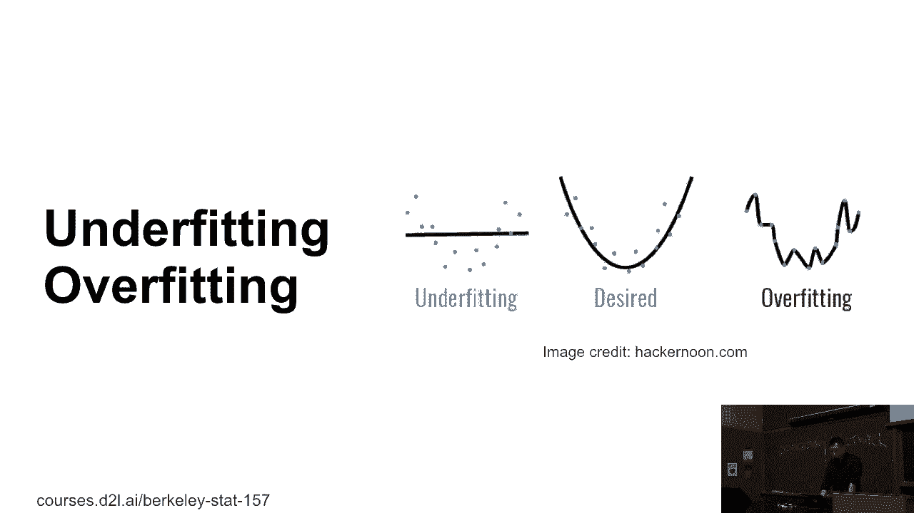

一般来说，有两件事是关键的。一是数据的复杂度，二是模型的容量。我们稍后可以深入探讨细节，但首先给你一个概览，了解如何操作。那么如何操作呢？怎么做呢？怎么做呢？怎么做呢？所以当数据简单，你有一个小模型时，

因为模型将要输入数据，如果模型的容量较低而数据较简单，一切都会正常工作。类似地，如果数据复杂，我们可以使用复杂的模型来处理这些数据。这里的问题是，如果数据复杂而模型简单，数据就无法被模型充分学习，这就是欠拟合。

如果你有简单的数据，但使用了复杂的模型，那么模型能够记住所有的数据点，这叫做过拟合。

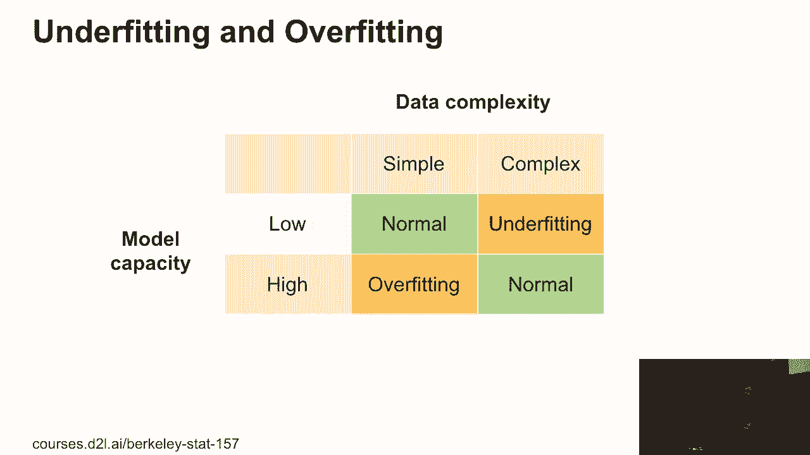

严格来说，模型容量是模型处理数据集的能力，处理你的函数，处理分布的能力。所以如果你没有容量的模型，很难处理这个训练数据集。例如，我们这里有一堆狗，但我们选择了一个线性模型，这只是一个单一的线。

很难用一条线来拟合这条弯曲的狗。高容量模型可以记住整个训练数据集。例如，如果你使用高阶曲线来拟合这只狗，我们可以在这里得到零误差，但这就是过拟合。你知道这条曲线太大了，太复杂了。所以这是一个著名的图形，展示了模型容量如何影响所有训练误差或训练损失。

或者是泛化损失。所以横轴是模型容量或模型复杂度，纵轴是损失。你从左边开始，那里是你有低容量的模型。无论是训练损失还是训练误差，还是泛化损失、泛化误差，都可能非常高。所以我们称之为欠拟合。当我们增加模型的复杂度时，

我们看到，随着模型容量的增加，训练损失在减少。所以，给定相同的数据集，我们使用更复杂的模型，那么更容易处理训练数据集。但是泛化损失，这是我们感兴趣的，可能一开始会减少，但最后可能会增加。泛化损失和训练损失之间的差距就叫做过拟合。

所以当模型更复杂时，差距会更大。这样就更容易过拟合。最优点是你选择一个模型，它具有最低的泛化损失。通常这个点在中间。你不能让模型太简单，也不能让模型太复杂。到目前为止有任何问题吗？问题？[听不清]。

训练和评估之间的区别，我的意思是，训练是你在训练数据集上计算的损失。而验证误差是在验证数据集上计算的误差，这些数据不会被用于训练。还有其他问题吗？有问题吗？[听不清楚的内容]。

那么为什么会出现过拟合？举个例子，在第一个例子中，你看到一个人无法违约，穿蓝色衬衫。所以你找出100%违约的人，但那个信号太强了。也就是说，过拟合。如果你有一个非常复杂的模型，你无法只拟合训练数据。你在拟合噪声。

因为数据中有很多噪声，你会拟合所有这些噪声。而拟合噪声意味着你会遇到不同的噪声，你不能拟合所有这些不同的噪声。然后，你的泛化误差实际上会增加。还有其他问题吗？有问题吗？

[听不清楚的内容]，这个好问题不能在几分钟内涵盖。还有其他问题吗？好的。那么这里的关键是，如何估算模型的容量？这是一个相当困难的问题。我们有一个完整的领域来解决这个问题。所以首先，比较不同算法的容量是非常困难的。

你可能有三种算法，决策树、随机森林，或者你可能使用过梯度提升（XGBoost）。然后将树模型与新分析方法进行比较。这就是本课的重点，它非常难。因为它们的假设不同，很难比较不同的算法。所以在给定算法家族的情况下，例如所有这些感知机。

我们不能简单地比较复杂度。有两个主要因素很重要。一个是模型中有多少个参数？我们有两个例子。上面的是线性感知机或线性回归。假设数据有D个维度，权重有D个元素。加上偏差，我们的参数总数是D+1。

最底层的是两层感知机。你有输入维度D，隐藏层的大小是M，输出类别数是K。那么在第一层你有(D+1)乘以M个参数。在第二层，你有(M+1)乘以K个参数。所以你知道，在第二个模型中，你的参数比第一个模型要多得多。

这意味着多层感知机应该有较高的复杂度，相比于线性回归。所以第二个问题是，如何现在为模型设置合适的值？例如在训练过程中，我可以说这个模型只会在-1到+1的范围内调整参数。所以相比于相同的模型，这个模型的容量较低。

但我们可以从任何数字或任何实数中挑选出值。所以我们稍后可以深入探讨第二个问题。第一个问题其实就是这节课的核心内容。我们可以讨论不同的新型结构化架构。实际上就是不同的新架构，如何平衡卷积神经网络（CNN）或长短期记忆网络（LSTM）的模型复杂度。

我们现在可以深入探讨第一类信件。

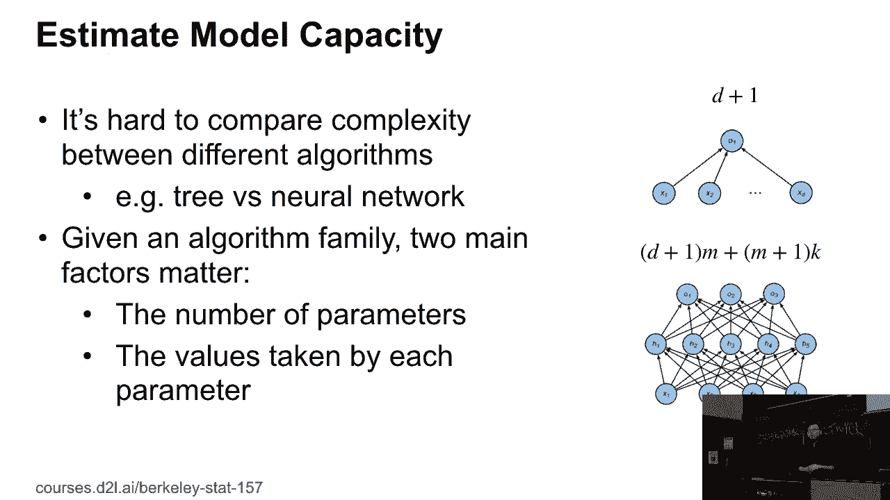

所以有一个领域叫做统计学习理论，这是理解这个问题的理论领域。对于这个话题，我们实际上有一门四学分的课程来讲解它。我们只能简单地介绍一下静态学习理论。所以在这个理论中。

一个核心主题是估计模型的能力。为了估计模型的能力，有一个叫做 VC 维度的概念。它不是风险投资（venture capital），而是由两位科学家提出的虚拟 VC。所以 VC 维度是用来估计模型能力的，它有一个通用的形式，但现在我们只讨论简化版。也就是说，我们可以谈论分类模型。

对于分类模型，VC 维度是我们能拥有的最大数据集。所以无论我们如何给这个数据集分配标签，我们总能找到一个模型来完美地分类这个数据集。因此，这就是该模型能记住所有数据点的最大数据集。

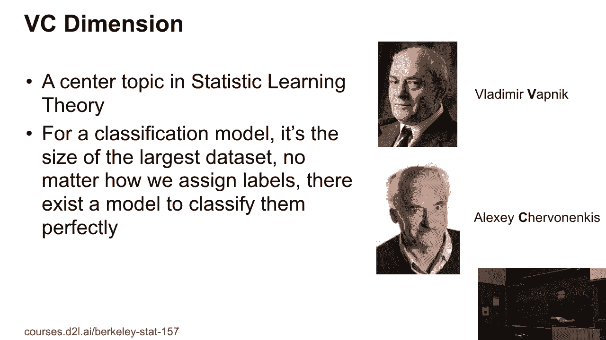

我们来看一个具体的例子。假设是 2D 感知机。我们知道 VC 维度是 3，这意味着对于任意三个点，无论我们如何给这些点分配标签，我们总能找到一个 2D 感知机，也就是一条直线，来正确地分类数据集。所以它不是四，因为我们已经证明如果是轴向问题，情况就不同。

一条直线并不足够。你需要一个曲线或一个多层感知机来进行分类。这意味着 2D 感知机的 VC 维度是 3。所以对于 2D 感知机，它有二维输入，也就是说，它有两个权重元素，和偏置一起，参数的数量实际上是 3。所以一般来说。

如果你有感知机，我们有 N 个参数，其中输入是减去 1 维度的，再加上偏置，VC 维度就是 M，这意味着你拥有的特征越多，构建的模型就越复杂。我们还可以在一些假设下将这个扩展到多层感知机。所以我们假设有激活函数。但一般来说。

你可以看到它是 M 加上 log 2 M，这是参数的数量。一般来说，你在模型中放入的参数越多，模型的能力就越强。明白了吗？

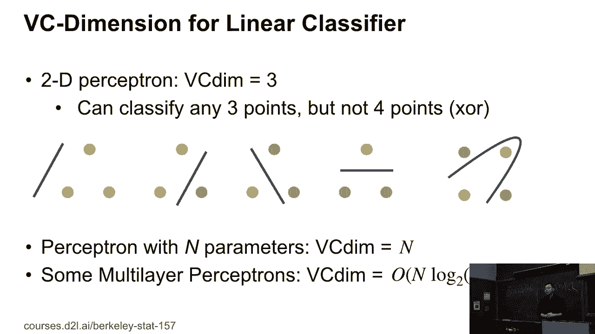

所以，VC 维度实际上提供了关于为什么一个模型有效的一些理论。通过 VC 维度，我们可以缩小训练误差和泛化误差之间的差距。因此，它非常有用。但这里的问题是，它实际上从不讨论 VC 维度和深度学习，原因有两个。第一，模型的复杂性让它更难提供关于为何有效或无效的洞见。第二。

对于深度神经网络来说，估计VC维度相当困难。它只讨论感知机，但如果要扩展到卷积网络，难度就更大了。所以，类似的想法是，统计学习理论中有很多工具，但将这些应用到深度学习中非常困难。因此，深度学习理论在所有这些模型开发的进展上还是滞后。

所以这就是为什么理论研究者们实际上付出很多努力，试图赶上这些理论的原因。所以在这门课中，我们可能不会深入探讨数据分析的理论。

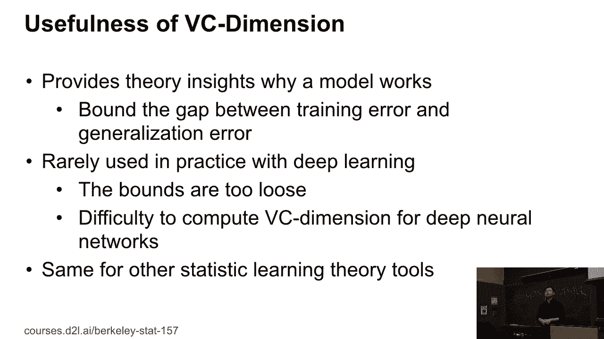

最后一点，我们讨论的是模型的容量。我们也有数据的复杂性。所以，影响数据复杂性的因素相当多。例如，在上面那一部分，我们使用的数据集是在笔记本上，底部是ImageNet。它包含了成千上万的图像。你可以看到，ImageNet比我们使用的合成数据集更加复杂。

因此，许多因素影响数据的复杂性。例如，你有多少个样本？

样本越多，你的数据集可能就越复杂。对于深度学习来说，理想的数据集通常在100,000到1百万之间。如果样本太少，你无法构建非常深的神经网络。如果样本太多，那么你可以构建许多复杂的模型，但复杂度可能会非常高。然后，对于每个样本来说。

你可以考虑我们拥有多少元素或者特征。对于图像，你可以在图像中有一分钟的元素。对于广告、许多其他事物，你可以有数十亿的特征。同时，我们还关注数据的结构。所以我们有时间结构，也有空间结构。例如，考虑一个社交网络。

它更复杂，因为我们有人与人之间的交互。这比没有人与人之间交互的情况要复杂。所以对于视频，或者其他类型的数据，你有时间序列。对于股票数据，你也有时间序列。我有时间信息。因此，你的数据集也变得更加复杂。

我们谈论的是多样性，意思是数据集中有多少不同的对象或概念。ImageNet有1,000个对象。你有另外一个C文件，里面有10个对象。所以ImageNet更加复杂。此外，在每个类别中，示例的多样性也是一个问题。所以你会看到，如果你拍了一张狗的照片，每只狗看起来都差不多，那么多样性就很低。

如果你拿一只狗，拥有很多颜色和物种，那么复杂性就很高。到目前为止，有什么问题吗？[BLANK_AUDIO]。

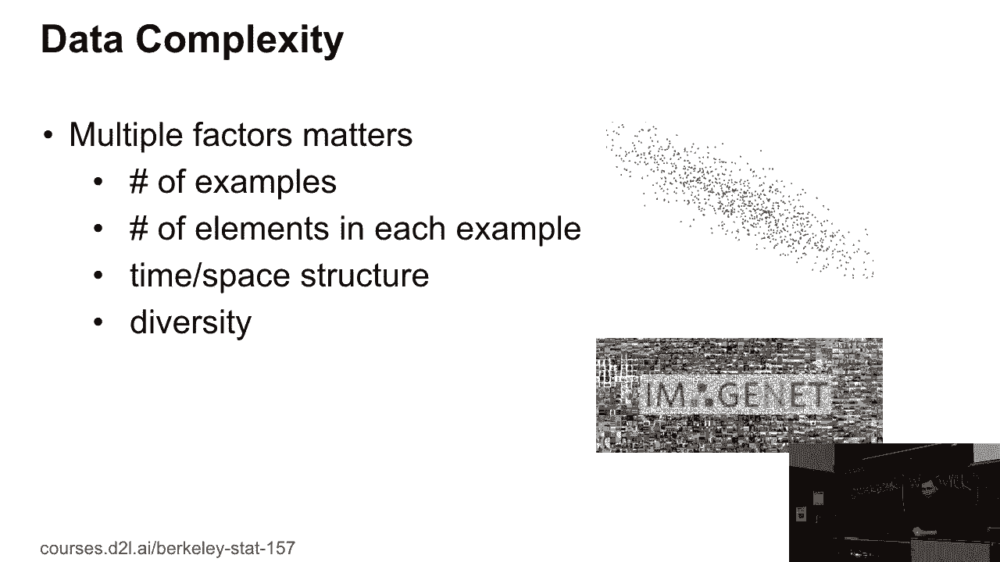
