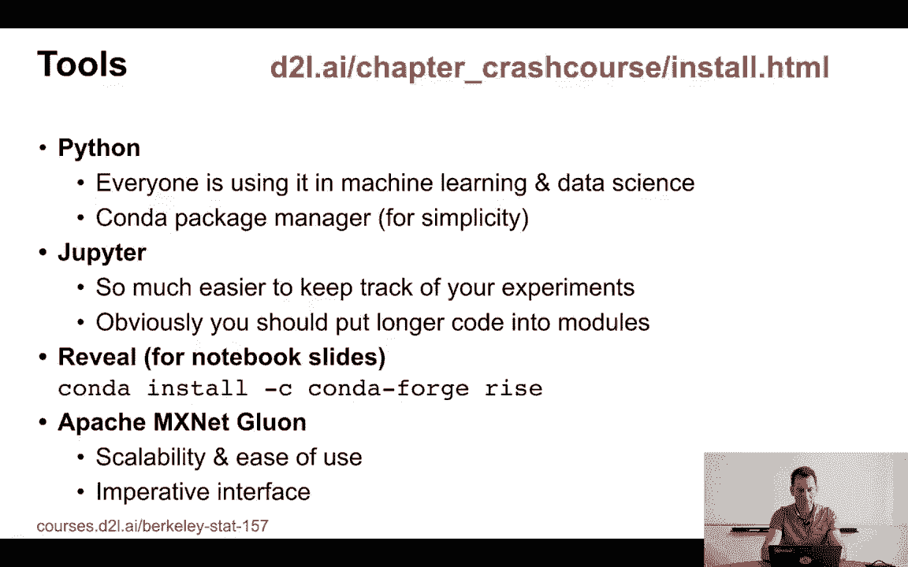
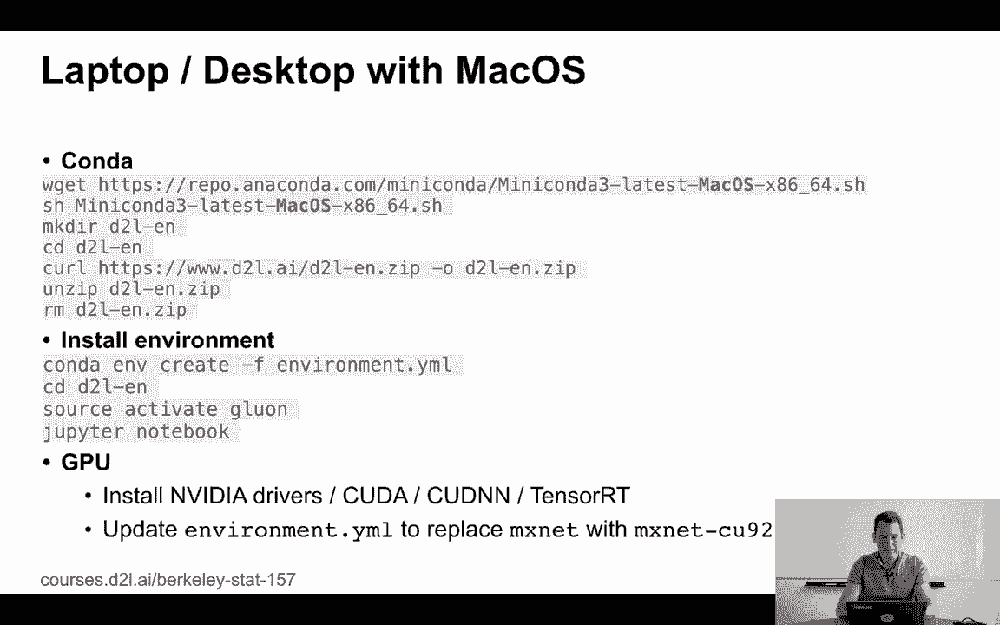
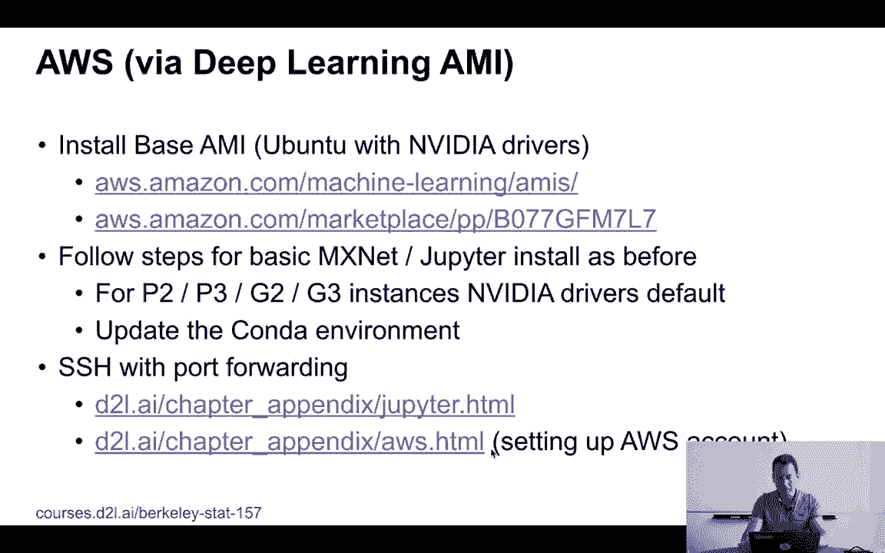
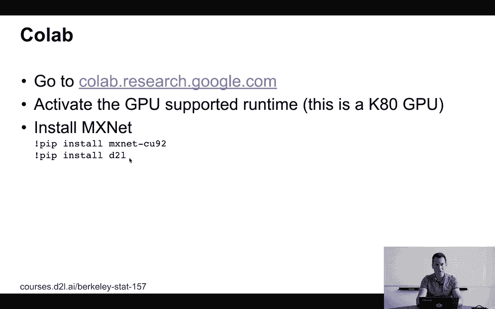

# P3：3. L1_3 软件 - Python小能 - BV1CB4y1U7P6

现在，这是一个关于深度学习的课程，既有理论也有实践。为了完成实践部分，我们需要讨论软件，如何安装，如何获取帮助，以及基本上在哪里可以运行这些东西。那么，开始吧。我们将要使用的工具是Python，实际上，几乎每个人都在使用它。

Python在机器学习和数据科学中无处不在。我们将使用Conda作为包管理器，简化操作。有关更详细的安装说明，可以参考d2l.ai中的安装章节。所以，这里只是一个概览。现在，在Python中，我们将使用笔记本。

这意味着Jupyter。这样你就能更轻松地跟踪所有的实验。如果你只写大约100到200行代码，Jupyter是一个非常合适的工具，用于构建这样的东西。现在，如果你有更大的软件项目，试图把所有东西都做在Jupyter里，这样就会产生一些乱七八糟的代码。但对于本课程的目的来说…

这已经足够了。所以，如果你有非常长的、大型的软件项目，可能在你的课程项目中，你会想在Jupyter中进行一些实验，然后再将代码放到适当的库中。如果你想以我在讲座中使用的相同幻灯片格式享受我展示的所有笔记本，你需要通过Conda安装RISE。否则…

你其实不需要它。你可以直接查看这些笔记本。最后但同样重要的是，你需要一个深度学习框架。我们为本课程选择的是MXNet-Glue on。选择它的原因是它非常可扩展，易于使用，并且具有良好的命令式接口。

它在各种硬件上运行良好，并且能够很好地扩展。如果你使用的是其他深度学习框架，你仍然能够从所有的理论和模型中受益。但如果你想跟着实践，实际尝试一些代码，你需要安装MXNet。

那么，如何操作呢？如果你有一台通用的Linux云机器，或者你有一台Linux笔记本电脑或桌面电脑，那就相当简单，你只需从Conda下载最新的mini-conda安装程序。然后从d2l-en.zip获取我们书籍的最新版本。解压缩后，你会找到一个环境，其中包含所有相关的包。

然后，所需的全部操作就是通过Conda创建这个环境。非常简单。只需运行`Conda.n.create -f`，后面跟上文件名`environment.yml`，然后完成。接着激活Glue on环境。这是我们提供的环境。所以，输入`source activate Glue on`，进入笔记本就完成了。如果没有GPU，那就…

你需要安装 NVIDIA 驱动程序、CUDA、CUDA-en.n。可能还需要 TensorRT。好吧，NVIDIA 有他们自己的一套做法，你需要按照他们网站上的说明来操作。这可能会比实际安装 MXNet 稍微花费你更多的时间。有一点很重要，你需要更新环境变量，环境.yml，去。

例如，替换 MXNet 为 MXNet-cu92，以支持 CUDA 9.2，或者任何你在观看本视频时可能使用的 CUDA 版本。这只是为了确保你能在设备上实际使用 GPU。如果你没有 Linux 系统，而是使用 Mac，指令几乎是一样的。

唯一的区别是你将 Linux 替换为 Mac OS。所以如果你对比一下，实际上只有一个词需要改变。如果你使用的是 Windows 系统，情况稍有不同。你需要下载一个退出文件。所以是 Windows x8664 exit。另一个不同之处是 CondaActivation 命令看起来稍微不同。

你只需输入 `activate Lorne`。之前你需要输入 `source activate Lorne`，现在只需要 `activate Lorne`。这就是 Windows、Mac OS 和 Linux 之间的唯一差异。

如果你不想经历安装 NVIDIA 驱动程序的所有麻烦，因为这可能需要一些时间，而且如果你以前没有做过，你可能需要注册一个开发者账户，等等。你可以直接在 AWS 上完成这一过程。所以你可以选择从深度学习的基础 AMI 开始。

所以如果你点击上面的链接，你会找到所有相关的资料。一些机器学习的 AMI，目前最新的是这个，但是如果你稍后观看，可能这个版本会被更新的版本所取代，包含更先进的 NVIDIA 驱动等。因此，去那里，查找基础 AMI。然后按照基础 MXNet 2 的步骤进行。

安装过程和之前一样，显然对于 P2P3、G2、G3 或任何其他 GPU 实例，你需要安装相应的 NVIDIA 驱动程序，更新 Conda 环境后，你就完成了。现在，这将允许你在云端的机器上运行 MXNet，但显然，如果你想使用 Jupyter，就会遇到一个小问题，对吧？

因为 Jupyter 在运行的机器上设置了一个 Web 服务器，而你需要避免两件事，首先你要避免让这个 Web 服务器对外开放，因为否则，任何人都可能连接到你刚启动的这台机器，并在这台机器上执行任何他们想做的事情，甚至可能获得 root 权限。

所以，确保不让这台机器对外开放是你的利益所在。你要做的是使用 SSH 安全外壳来进行端口转发。它的作用是基本上拦截远程云机器上 Web 服务器打开的端口，并通过 SSH 隧道将任何来自这个端口的请求转发到你的本地机器。

对，端口在那里。这真的是一些基本信息，你知道它是信号传导通道，然后你可以在本地的网页浏览器上启动那个端口，通常是Jupyter端口，并运行它。我们实际上会在接下来的几讲中看到这在实际操作中的应用，当我们需要GPU时。现在来看一下Jupyter的操作说明，并详细了解如何操作。

显然，你需要设置一个AWS账户，所以在第二讲中，我们会更详细地介绍如何启动机器实例等内容，但你也可以直接访问书中的网站，查看AWS的附录，我们会引导你完成如何操作的细节。如果你需要AWS的学术积分，可以给我们发邮件，我们会为你提供合适的支持。

信用代码。如果你想使用Colab，当然可以，你只需访问colab.research.google.com，确保激活GPU支持的运行时，你需要选择适当的运行时。然后，在你实际运行MXNet之前，你需要将这两行代码添加到配置中，分别是`pip install MXNet-cu92`和`pip install d2l`，然后你就可以开始运行了。

在Colab上。现在，Colab挺不错的，因为它提供由Google赞助的免费的GPU访问，至少在Google决定继续赞助的情况下是这样的。缺点是，如果机器长时间没有活动，它会被关闭，所以你不能指望晚饭后回来时一切都在，需要做检查点等其他操作。

你的笔记本有些内容会保存下来，但本地机器上的变量会丢失。

不会。所以你得到了一些松动的。 [BLANK_AUDIO]。
