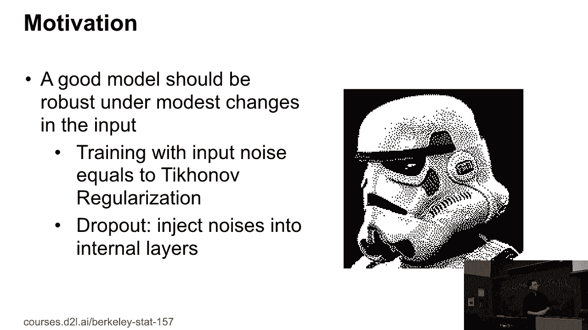
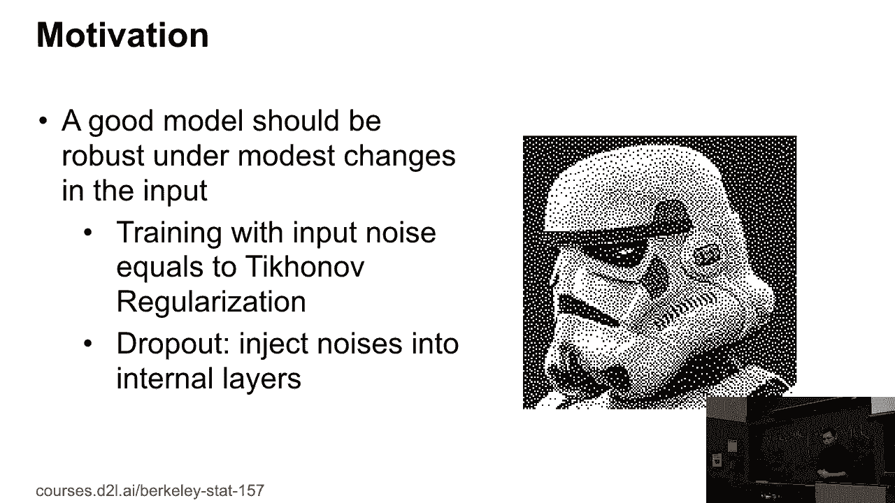
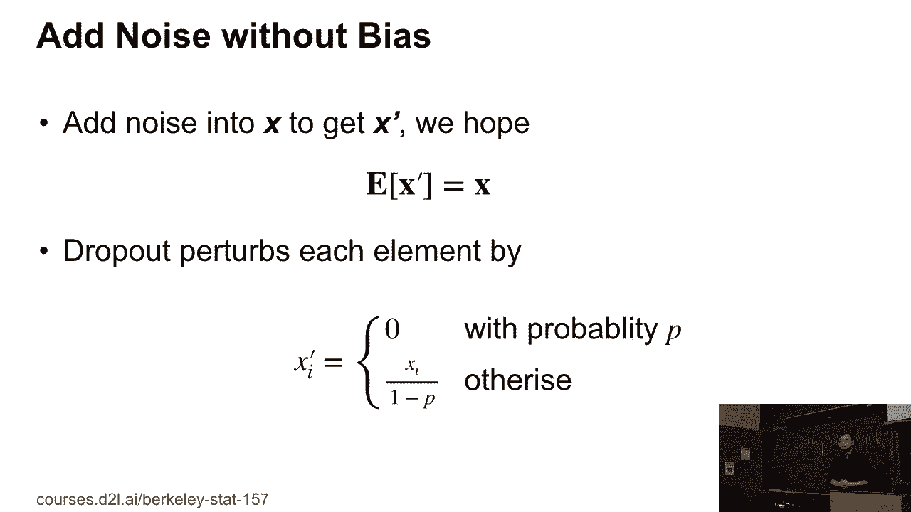
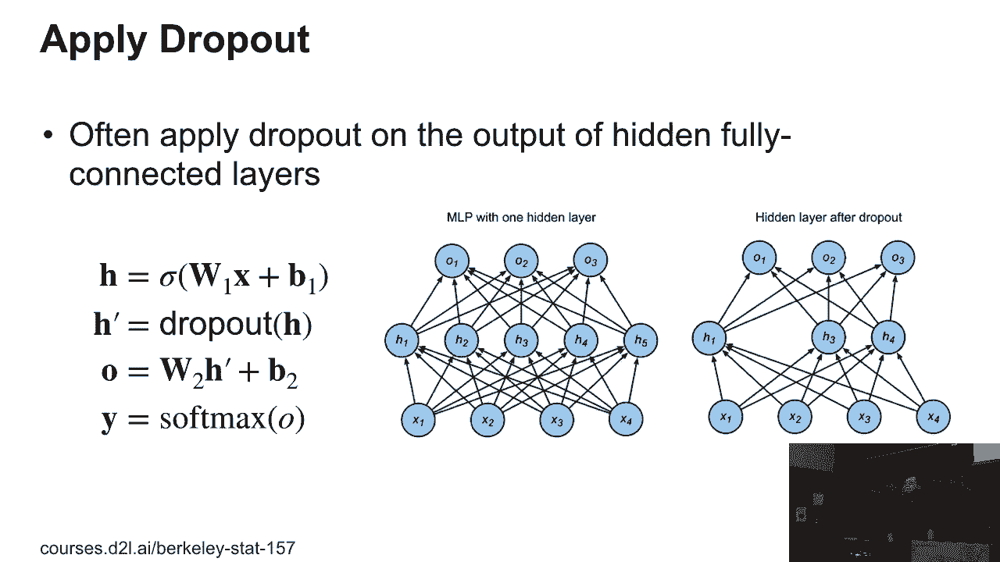
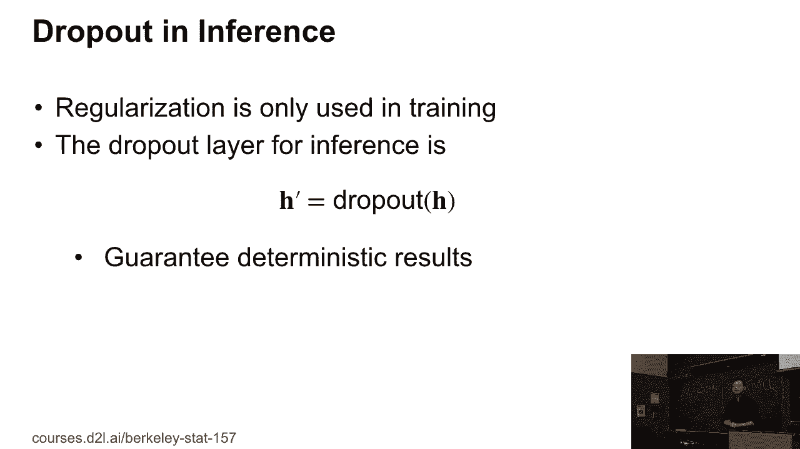

# P32：32. L7_4 Dropout - Python小能 - BV1CB4y1U7P6

最后一个概念叫做dropout。大约四年前它非常流行。但现在我们已经知道它是如何工作的。

什么时候我们可以应用dropout。这个思想是，一个好的模型应该对输入的变化具有鲁棒性。例如，你可以识别图像中的物体，改变角度、光线，或其他任何因素，你仍然应该能够识别出这个物体。比如这张图，你仍然能识别出它是什么。

无论加入多少噪声。很久以前，人们已经知道可以将噪声添加到训练数据中。这相当于向损失函数中添加正则化。但是dropout的思路是这样的，因为你有新的网络，多个层次，dropout向内部层添加噪声，而不是调整输入。特别地。

如果x是某一层的输出。

然后应用dropout得到x prime，它的期望值等于x。所以我们对x prime加入噪声，但我们至少不改变期望值。你有动机这样做。特别地，dropout的做法是，你选择一个概率p，或者我们称之为dropout概率，然后以概率p将xi设为0。否则。

我们保持xi值，但除以1减去p，这样期望值仍然不变。明白了吗？现在，如何应用dropout呢？

Dropout通常应用于全连接层的输出。所以我们现在只谈全连接层。之后我们将讨论其他层次。但dropout通常只应用于全连接层。原因是全连接层是所有层次中拥有最多模式能力的层，我们无法谈论其他层次。

所以对于这些特定的层，我们可以应用dropout作为该层的正则化。特别地，它的作用是，如果边缘是某一层的输出，意味着我们尝试加上权重W，再加上偏置，应用激活函数。然后我们对边缘应用dropout，得到新的边缘prime。然后边缘prime将适应下一个层。

所以，如果你看这里的例子，内部层我们有五个输出，从边缘1到边缘5。如果我们应用dropout，可能会把边缘2和边缘5设为0。也就是说，我们移除了边缘1和边缘5的值到下一个层次，并且保留了其他3的值。因此，期望值上我们没有改变任何东西。所以，dropout大概是这样的——。

这不是每次都会发生——每次我们训练时，都会运行一个故障路径，我们实际上应用了dropout。这意味着每次你丢弃的节点是不同的。所以你不能先做dropout，然后固定所有的东西，永久丢失边缘2和边缘5。每次我们丢弃不同的节点。

到目前为止有任何问题吗？

所以job-file是一种正则化。在推理过程中，我们**不应该**应用正则化，因为正则化仅在训练时有用，限制训练过程中权重的选择。在推理过程中，job-file只是一个返回值，你可以放一个数值。所以这就是在推理和训练时我们所做的。

不同的行为。所以你仍然可以在工作中应用，但在推理时，我们**更倾向于**获得确定性的结果。所以在推理时我们什么都不做。到目前为止有问题吗？

好的。
