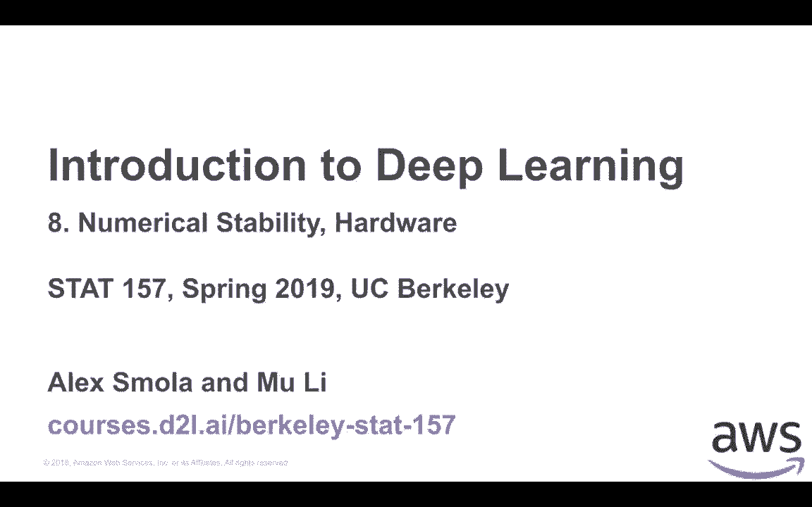
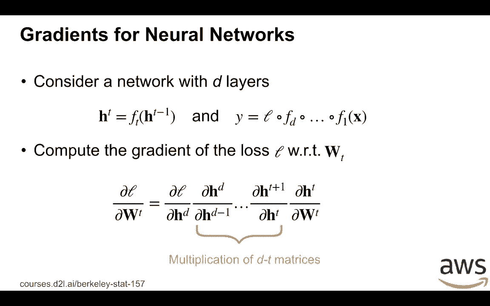
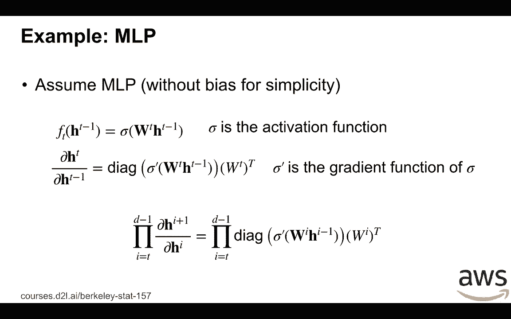
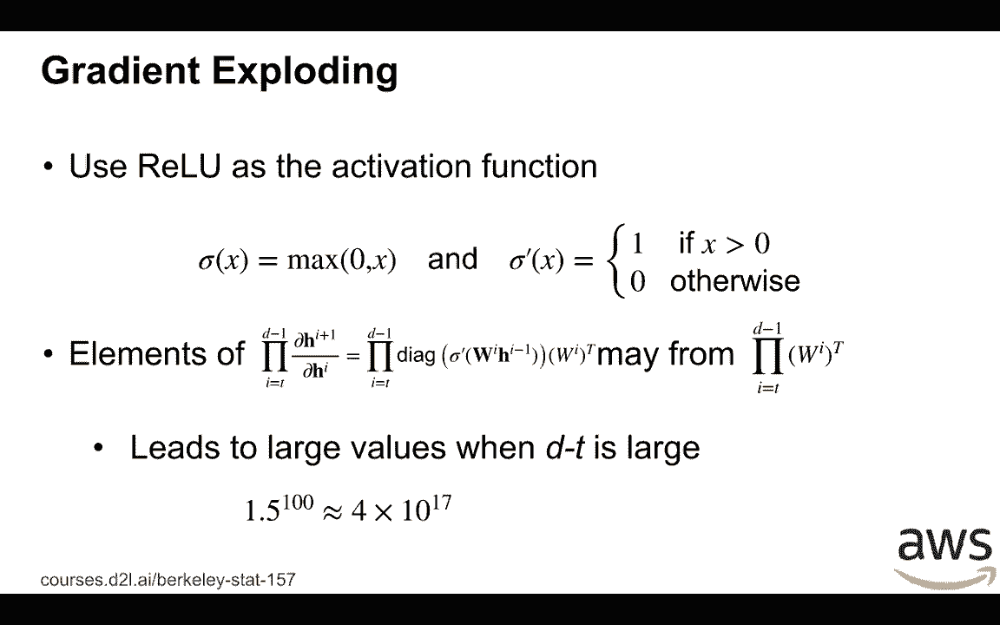
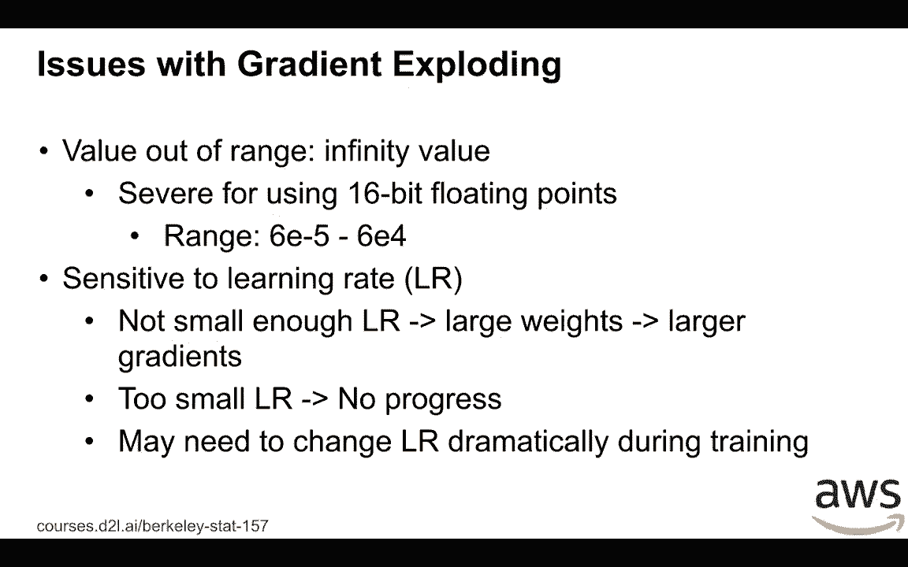
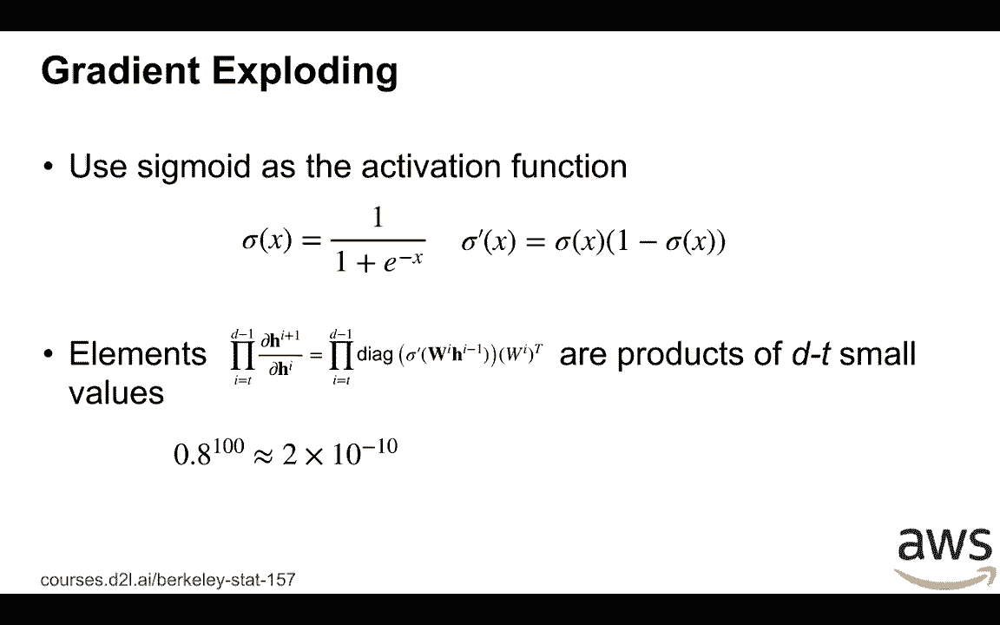
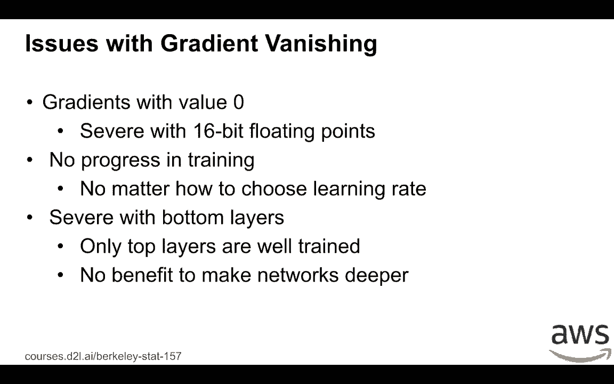
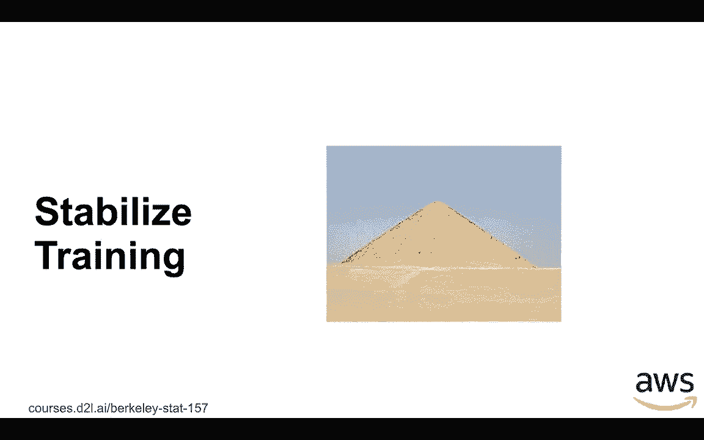

# P34：34. L8_1 Gradient Exploding and Vanishing - Python小能 - BV1CB4y1U7P6

 This is a re-record of Nx8。

 Let's start with numerical stability。

 Consider simple neural network。 We have D layers here。 The input of the T's layer is called hT minus 1， and the output is hT。 This layer has a function called ft， transfer the input hT minus 1 into output hT。 Given input x to the network， the final output of y is we first put x into the first layer f1。

 until to the last layer fd and then fit into the last function l。 The thing here we want to consider is compute the gradients of the last l with respect to wt。 The first layer of the t's is the prime of the t's layer。 Remember the chain rule we have partial l over partial wt equals firstly partial l over the last output of the t's layer。

 which is hD。 Then we compute the gradients layer by layer。 We first compute the gradients over the last layer， which is partial hD over partial hD minus 1。 hD is the output of the d's layer， hD minus 1 is the input of this layer。 So we apply by d minus t times until we get partial hT plus 1 over partial hT。 Finally。

 we get the output of the d's t's layer with respect to the prime of the parameter。 which is partial hT over partial wt。 The key thing here。 think about the middle of these equations that is we do multiplication over d minus t matrix。

 So this could be cause problem。 The one of the problems called gradients is floating。 So soon that we use a number larger than 1 here， we use a 1。5 and a power to 100。 then we get a very large number。 The second issue called a gradient vanishing。 That is we use a number less than 1 and a power to a large number。

 and then we get a very small number。 So these two problems cause the training issues。

 Let's consider concrete example。 Consider we have a multi-layer perception。 That is we remove the bias for simplicity。 So because as mlp。 so we know that given the input hT plus 1， which is the input to the t's layer。 we know the functions equals to wt times hT plus minus 1。

 wt is the parameter hT plus 1 is the input。 And then we feed this one into the activation function sigma。 To compute the gradients of this layer， we know that by general we first compute the gradients with respect to the activation function。 which the output is a vector and the input is not a vector。 We know that the gradients are matrix。 So here is actually a diagonal matrix。 It's a diagonal of sigma prime。

 prise the gradient function of sigma and fit into the input wt plus hT plus 1。 And then we compute the gradients of the function of the dense layer function。 which is simply just the wt transpose。 So then apply the chain rule that we know that we want to do d minus 1 on multiplications。 that is a product of d minus t， diagonal matrix， and also a bunch of weight matrix as well。

 Then what we are going to do？ For example， let's use a value as activation function。 That is。 sigma x is just a max of 0 and x。 So then we know the gradient function of sigma is just if x is larger than 0。 then it is 1， otherwise it's 0。 So now the element of this d plus t multiplications。 it could be from just the products of all these parameters。

 because the diagonal matrix can be either 0 or 1。 So then if wi contains numbers larger than 1 and d plus t is pretty large。 which means either the length will steep this large， or we use the bottom layers close to the input。 which is this small， then the element of the products may condense very large numbers。 So this causes gradient exploding。

 So what problem is gradient exploding？ In the streaming case， we can run out of range。 We got infinity values。 So when we got the infinity values， nothing will get correct numbers。 This is especially true if we can use 60-bit floating point。 So this point has a very small range。 It's pretty easy to go infinity。 Even that we still in the range。

 which is we didn't get infinity values， this large values could be sensitive to the non-irate。 If we didn't choose a small enough linear rate， then we apply very large modification to the weights by SGD。 then the larger weights in the next time cause the even larger gradients。 So it can be in go infinity。 But if we choose two small linear rate。

 then we maybe got no progress because each time we apply little values into the weights。 And because the value can be changed in a very wide range。 then during training it could be very large， it could be very small。 and we need to change the linear rate dramatically during the training procedure according to the actual values。

 So this causes a lot of trouble， and what you can see is that it causes instability during training。

 The second problem is gradient vanishing。 So again。 let's use the previous multi-layer perception example。 But here we changed activation function into sigmoid。 We know the sigmoid definition is 1/1+e2-x。 And the gradient function of the sigmoid is just a sigmoid function times 1-digmoid output。

 So here we draw a picture of the sigmoid function。 the x-axis is the input x and the y is the function value。 The important thing here is that the origin i is a gradient function of sigmoid。 What we can see is that even the small number of x values is not too large。

 for example slightly larger than 4， or slightly smaller than -4， then we get very small gradients。 And the problem here is that because the gradient is a multiplication of all these diagonal matrix here。 and then these diagonal matrix can contain very small numbers。 Then the gradients is just a product of t-t d-t small values。

 so which cost the elements could be very small。

 So what's the problem with gradients vanishing？ And on the extremely case the gradients are zero。 because it's too small， especially if we're using 16-4-bit floating point， if it's like more than 1。 e-6， then all these values are zero。 If we get a zero gradients。 no matter how we change and generate， we still get zero update for the gradients。

 So which means no training progress。 And especially that with bottom layers which is close to the input。 which means that t is small， then the bottom layers have smaller gradients comparing to the top layers。 which is close to the loss function。 And then only top layers we're aware of trend。 because it's get a larger gradients。 And the other bottom layers with the small gradients。

 So on the consider stringing case that we have 100 layers and the top layers。 the top 20 layers get a large gradients and the bottom 80 layers get almost a zero gradients。 Then it's almost equals to just a joint， a nano with 20 layers。 which means it's pretty hard to make a deeper new network。

 And also it's cost you a lot of other troubles we're going to talk about later。 [BLANK_AUDIO]。

