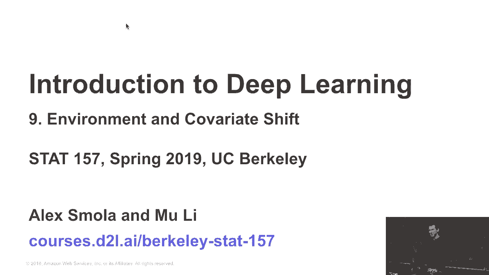
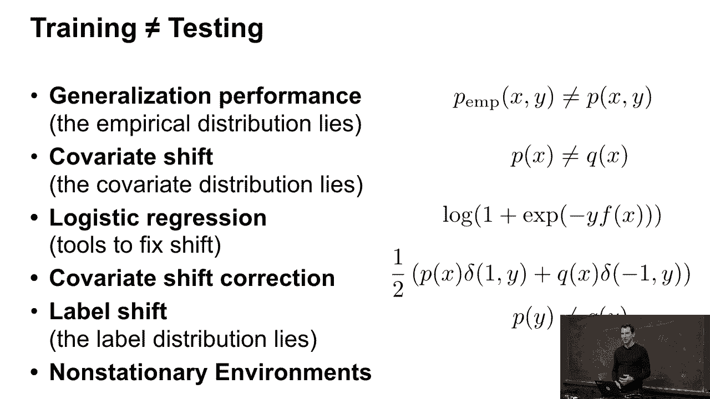
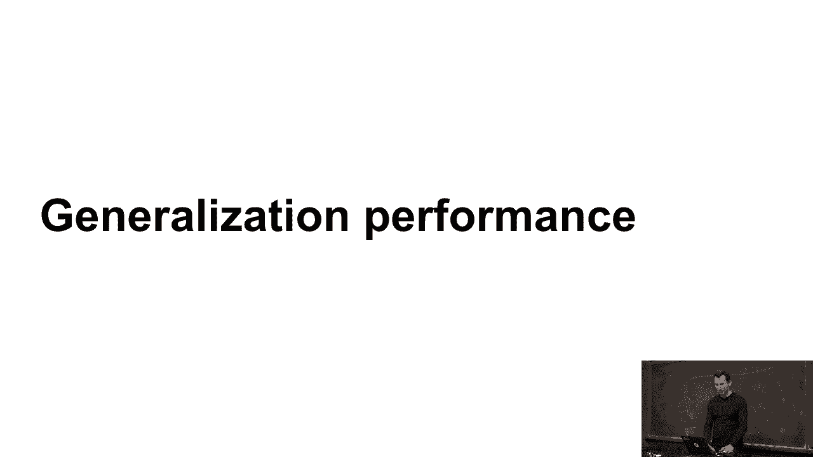
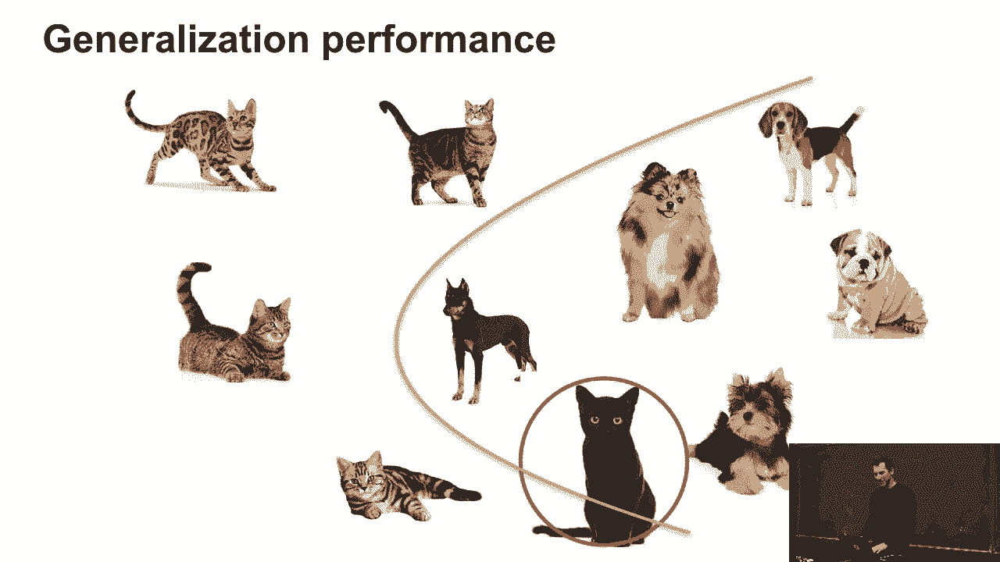
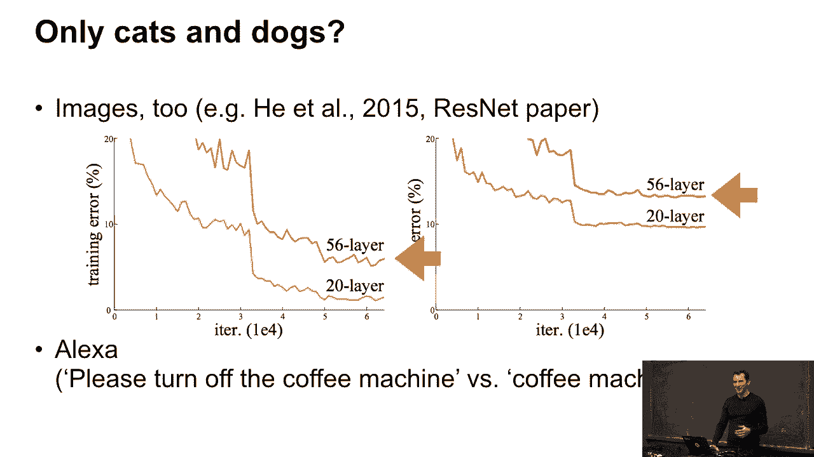
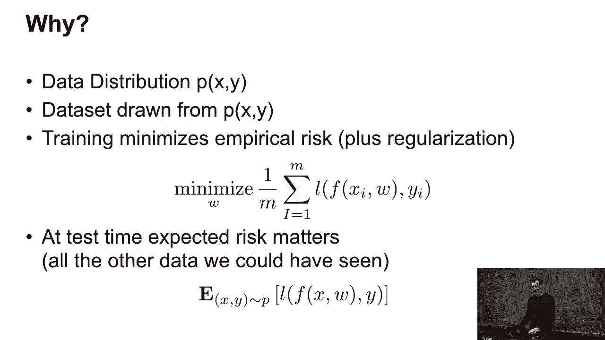
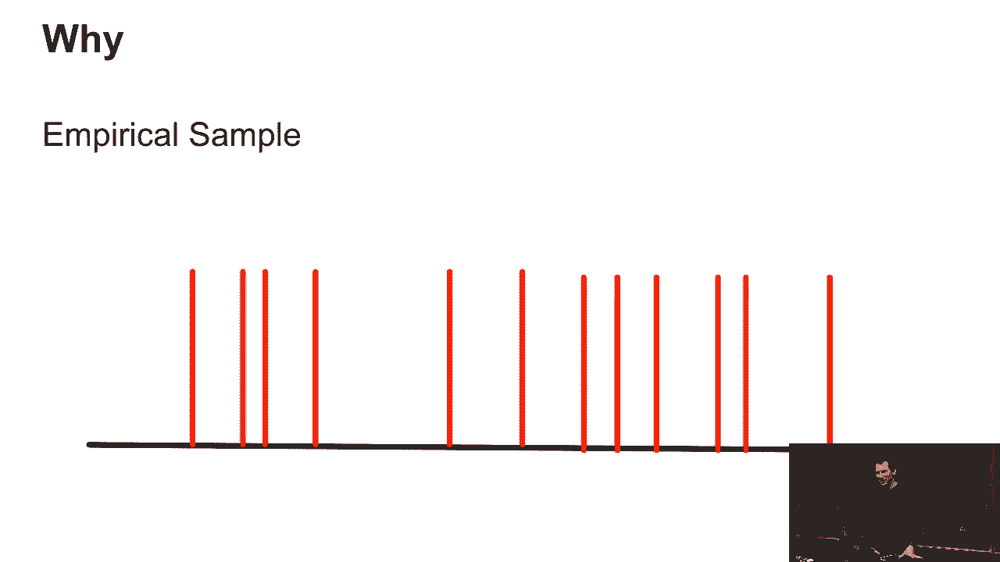
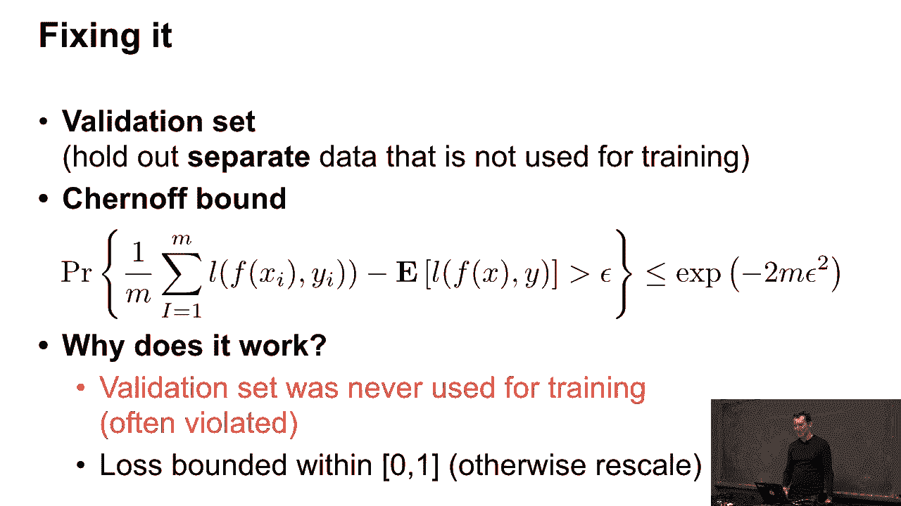
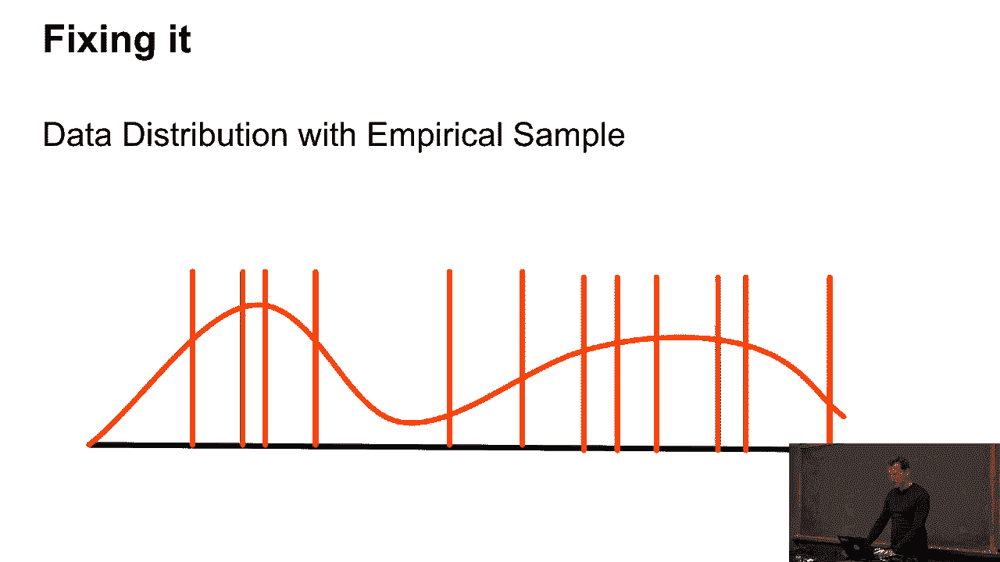
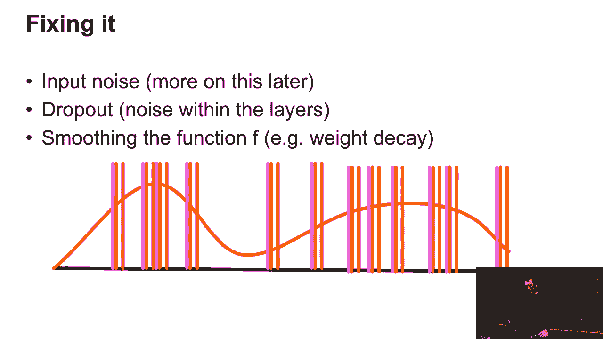

# P39：39. L9_1 经验风险与期望风险 - Python小能 - BV1CB4y1U7P6

今天我们将讨论协变量偏移和环境问题。这将是一个理论性较强的讲座。相关的笔记作为作业留给大家。实际上，作业并不难。如果你看看我们到目前为止做的内容，这实际上是我们之前所做问题的一个简化版本。

好的，那么今天我讲的主要内容是，当训练和测试时间之间的情况不同的时候。你们已经在泛化性能和过拟合方面遇到过这些问题，特别是经验分布存在偏差的事实。

经验分布其实并不是你以后会看到的样子。可以把经验分布看作是，Alex 教授一门课并分发作业。真正的测试分布就是期中考试，对吧？

我们将尽量使这种偏差尽可能小。但由于显而易见的原因，你可能并不总是能做到这一点。然后你可能会遇到协变量偏移，这意味着协变量分布存在偏差。换句话说，我在训练时看到的样子与测试时看到的不同。就像Alex写作业时的情况一样。

正常时间的作业，然后是助教写的考试。你可以预期后者会有所不同。接下来，我会给你一些如何通过逻辑回归来解决这些问题的思路。我还会讲解协变量偏移修正。然后我会讲解标签偏移。

标签偏移实际上是协变量偏移的一个特例，至少在许多情况下是这样。最后，我们会讨论非平稳环境。这些就是今天我们要讲的内容。在数学上不会太深入，虽然其中会有一些数学内容。

但这并不会非常深入。不过，它在概念上非常重要，因为它会解决你以后在实践中使用机器学习时遇到的许多问题。我几乎可以保证，你们会遇到这些问题。

遇到这些问题之一。那么接下来，我们来讨论泛化性能。

这个是众所周知的，对吧？假设我们想要分类猫和狗，然后我们构建了我们的分类器。很好。接着有一只新的狗，嗯，这只杜宾犬表现得不好。那么我们需要调整我们的假设。好吧，然后，问题又重新出现，直到有一只猫出现，而这只猫也表现不好。所以你可以看出问题所在。基本上是这样。

仅仅因为在训练集上表现良好，并不能保证你在测试集上也会表现良好。

所以现在，当然，这不仅仅是猫和狗。这是2015年ResNet论文中的一个截图。这里面有很多内容。基本上，如果你看一下训练误差和测试误差，左边是训练误差，右边是测试误差。这是针对一个20层和56层深度网络的情况。在这两种情况下。

训练误差通常比测试误差低，尤其是对于更复杂的网络和更复杂的问题，你会经常看到这种情况。你在非常简单的问题上可能看不到这么多，因为你不会遇到太多过拟合。分类问题相对简单。

所以如果我有一百万个观测值，100维的线性模型，嗯，我不会看到太多东西。但实际上，在这种情况下，你必须问自己，为什么我只使用线性模型？或者为什么有人甚至会费心收集这么多数据？

但这不仅仅适用于图像。例如，对于Alexa，你可能在训练集里看到类似这样的内容。请关闭咖啡机，而当你把产品发布出去后，某人对Alexa说“咖啡机关掉”。然后你需要从一个情况推广到另一个情况。

它可能有效，也可能无效。那么，究竟发生了什么呢？我们有一个数据分布，p(x, y)，并且我们有一个从这个分布中抽取的数据集。但在训练时，当然，我们只最小化经验风险。所以这仅仅是对x，y，i对的情况。我会使用一些正则化来保持模型行为良好。但在测试时。

预期风险很重要，或者至少，除非你明确知道测试问题是什么。在这种情况下，例如，Wapnik创造了“转导”这个术语。就像我在考试前把期中考试题目发给你们，虽然没有答案。你们如果拿到这些，可能会考得更好。但通常情况下，你并不知道这个。

所以让我们假设我们实际上关心的是预期风险。

所以，如果这是我的数据分布，它当然是一个密度。那么我可能有这些作为经验样本。现在，它实际上是一个相当不错的样本——我承认我作弊了，所以你可以清楚地看到，这个间距太规则了，不可能是从这个分布中抽取出来的。但为了图示的目的。

它起作用了。但实际上，你只有这个。所以现在你不知道强度到底是什么样子。

那么，如何解决这个问题呢？解决的方法之一是你保留一个单独的验证集，然后你可以使用类似链界的方法。谁听说过链界方法？不错。你们这些人都知道。那么那些没有听说过的人，回头去维基百科查一下这个词条。但这实际上是它的作用。

它告诉你，经验平均值在高概率下不会偏离期望太多。在这种情况下，如果我的损失函数在0和1之间有界。那么重要的是，这些都是行为良好的随机变量。所以在这种情况下，损失函数的界限是0到1之间。那么经验平均值。

1除以m，i从1到m，L(f(x_i, y))等等，经验平均值不会偏离期望太多，而且不会偏离超过epsilon，且其概率小于等于e的负2m倍epsilon平方。这真是太棒了，对吧？我的意思是，这是一个界限，如果我给你两倍的数据量。

它会迅速降低概率。它将你原本的概率平方化。所以假设之前的概率是0.1，那么如果我给你两倍的数据，概率就变成了0.01。这是一个非常快的收敛速度。但这个方程中有一个非常不愉快的部分，那就是epsilon的平方。

因为这意味着如果我想让我的准确率，比如说，将epsilon从0.1降低到0.01，对吧？

所以这就像是准确率提高了10倍。我需要100倍的数据量才能做得好。所以这是通常不能做到的事情。尽管如此，在机器学习中，通常到现在为止，对于大数据集，我们其实有了一些规模较大的验证数据集，对吧？你可能会有至少10,000个观察数据。所以m为10,000意味着你可能。

选择一个像是10的负2次方，或者10的负3次方这样的epsilon。即使如此，你仍然能得到一个还算可以的结果。事实证明，如果损失函数行为良好，你实际上可以得到更紧的界限。例如，如果你大部分时间做得不错，那么你可能不需要一系列的界限，而是可以使用类似伯恩斯坦不等式这样的工具。

有很多非常出色的研究。比如说，参加彼得·巴特利特（Peter Bartlett）的课程，如果你对此感兴趣，或者参加马丁·韦恩赖特（Martin Wainwright）的课程。这里有很多集中讨论重要课程的内容。这大概是属于研究生水平的内容。不过你可以从中获得很多乐趣。但之所以有效，是因为我们从来没有。

使用验证集进行训练。不幸的是，很多时候人们违反了这一点。假设我们有ImageNet竞赛，对吧？ImageNet竞赛有几百万张用于训练的图像，以及用于测试的图像。人们一步步改进他们的模型，目的是为了在验证集上表现得更好。但现在，实际上你是在进行多次测试。

所以，如果之前的保证是在1%的失败概率下成立，而我进行五次测试，那么突然间我的失败率就上升到了5%，对吧？所以你需要为此付出代价。这就是为什么基准数据集能存在很长时间的原因之一。人们最终会对这个基准数据集进行过拟合，而不是实际去学习知识。

这就是为什么现在，如果有人告诉你，应该使用他们的新算法，因为它在MNIST上表现得很好，你应该运行。总之，怎样才能在实践中稍微解决这个问题呢？

好的，我可以举个例子，向数据中添加一点噪声。于是我就稍微迭代了一下。然后我不再只是使用观察数据，而是使用一些稍微相似的东西。我可以通过强制使计算启动函数非常平滑来做到这一点，这样小的变化就不重要了。

或者它只是应用小的变化。后者导致了像输入噪声训练和丢弃正则化这样的技术。前者则给你正则化理论。而且不出所料，这两者实际上是紧密相连的。例如，有一篇非常好的1995年Chris Bishop的论文。

它表示，训练时加入输入噪声，相当于进行正则化，这就连接了这两者。而整篇论文正好证明了这个标题。因此，这是少数几篇，你只看标题就够了的论文，明白了吗？不过实际上，你应该看看证明。

这是一个非常简单而优雅的证明。那么我们来——。
