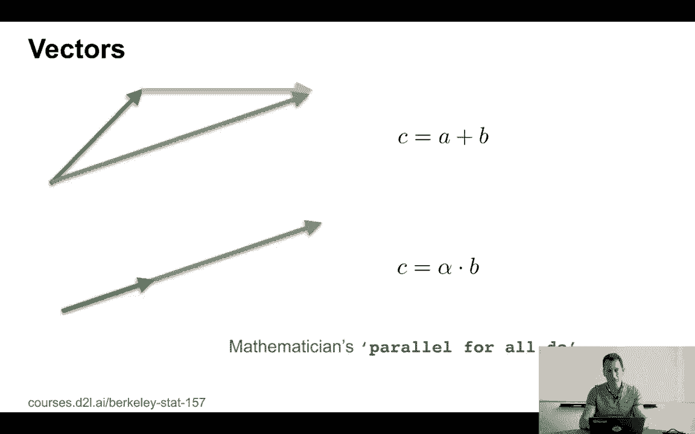
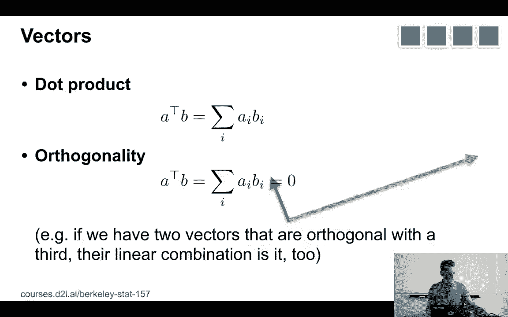
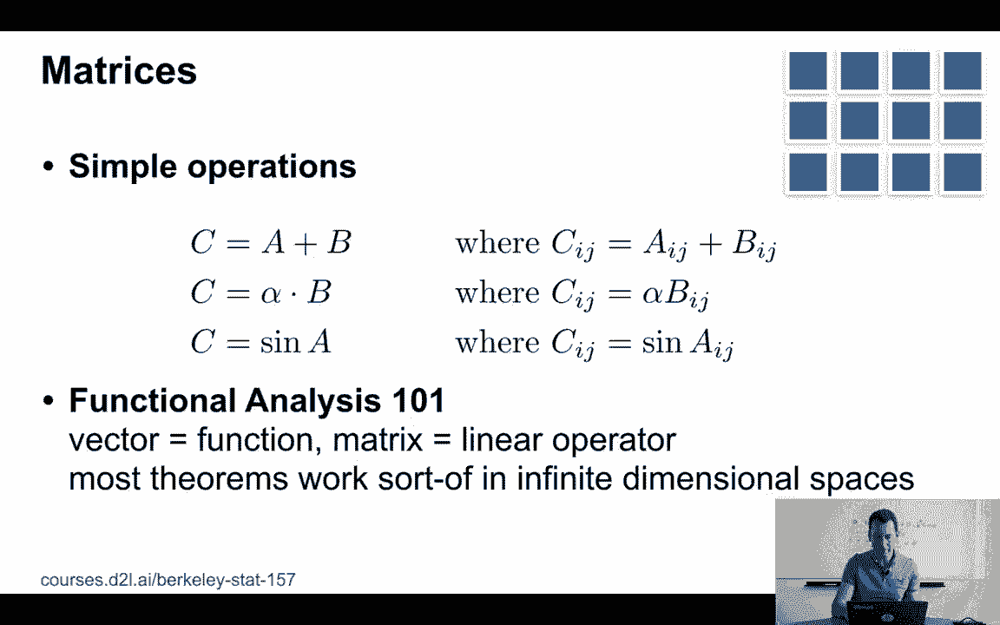
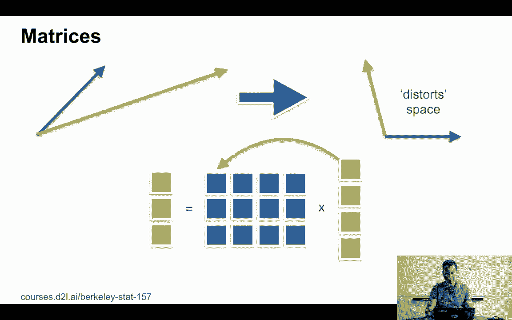
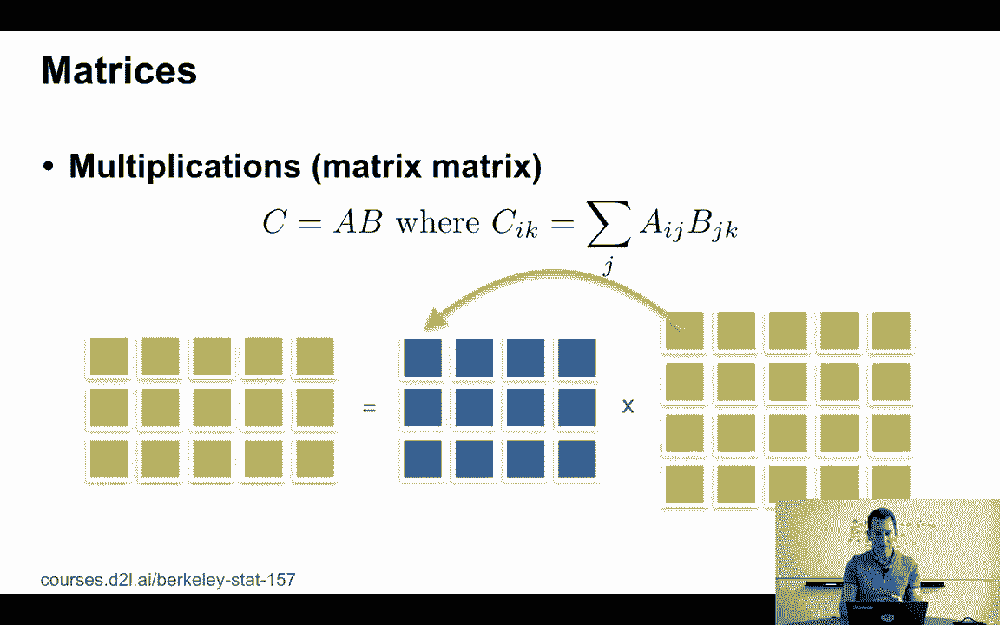
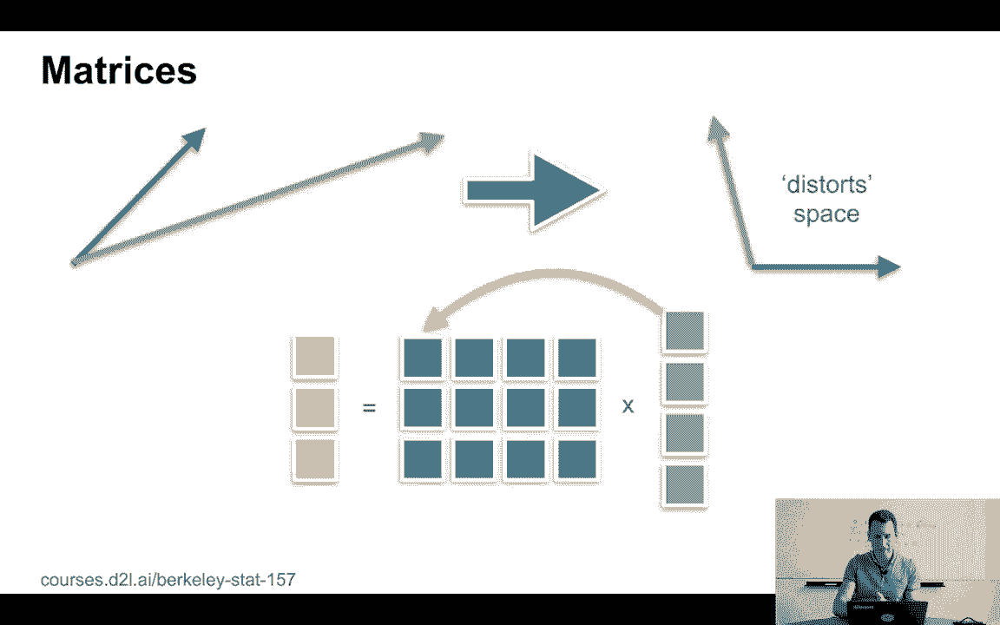
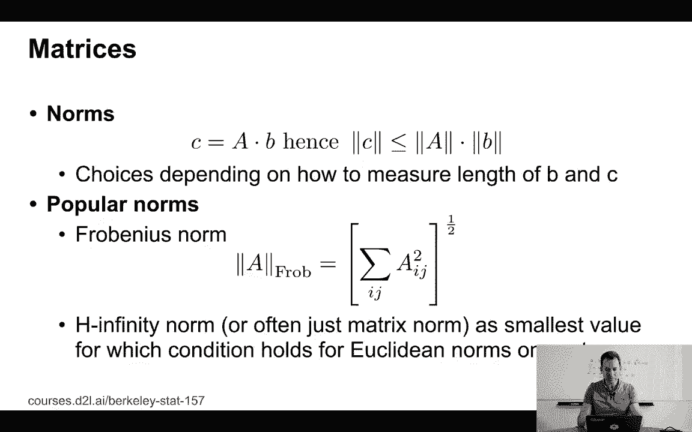
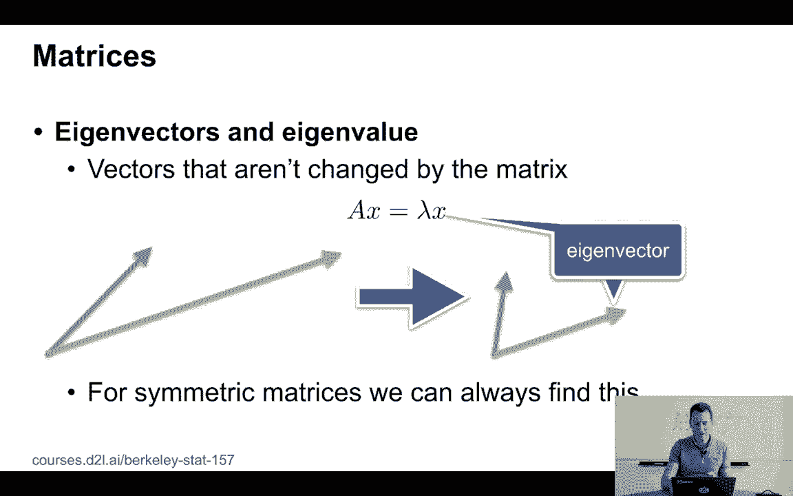
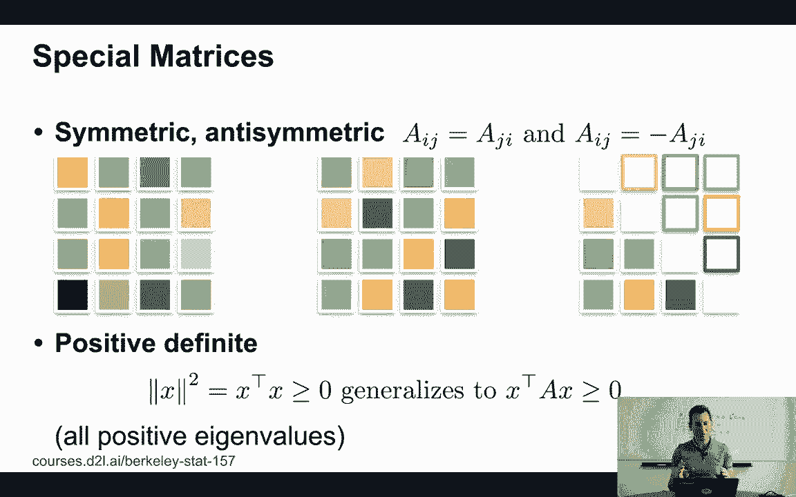
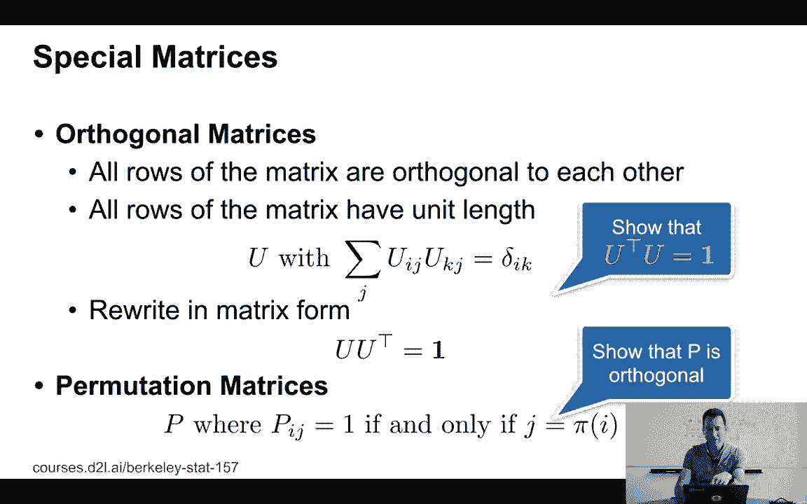

# P4：4. L1_4 Linear Algebra - Python小能 - BV1CB4y1U7P6

 The first tool that we'll need to cover when we want to deep learning is linear algebra。 Well。

 the reason is very simple because a lot of the tools that are required in deep learning。

 are large amounts of computations。 And linear algebra is just really good at representing those。

 It's also really good at representing many， many of the functions that we'll work with。

 So we need to get started。 Now， this obviously is no substitute for a proper linear algebra class。

 But we'll try to cover all the basic things that you'll need at least to get started。

 and the rest will probably cover in learning by doing。 So let's start with something very simple。

 First thing are scalars。 The scalars is something that we all know。

 You can do simple things with them。 You can add them。 You can multiply them。

 You can compute functions like sine or cosine of them。 And you can do things like， well。

 what's the length of a？ Well， it's a if a is greater than zero and minus a otherwise。

 so it's just the absolute value。 This does a couple of nice things。

 It satisfies the triangle inequality。 So a plus b is less equal to a。

 the length of a plus the length of b。 And the absolute value of a times b is the absolute value of a times the absolute value of b。

 No particular surprises here。 Now， let's look at vectors。 Again， I can do very simple things。

 I can add them。 So c is a plus b。 And in this case， I have ci is ai plus bi。

 I can also multiply alpha and b。 And now in this case。

 so you already noticed it's not I'm multiplying a and b。

 What I'm doing is I'm basically coordinate wise multiplying the bis with some coefficient alpha in order to get ci。

 I can also do things like the sign of a and in this case， I'm just applying it element wise。 Now。

 the interesting thing is when it comes to measuring the length， well， you know。

 I have a little bit of freedom。 But the most common thing that we would do is we would probably define the length of a vector a to be just the Euclidean length of that。

 So the sum over i going from 1 to m ai squared and then the square root。 I mean， for， you know。

 two dimensions， that's a Pythagoras theorem。 And in general， well。

 that's just how you define the length， right？ Now。

 a really useful thing of links or norms as mathematicians call them is the norm of a is greater or equal than 0 for all a。

 And that the norm of a plus b is less equal to the norm of a plus the norm of b。

 So this is just our triangle inequality again。 And furthermore， if I scale a with b， then I get。

 you know， absolute value of a times the length of b。 Why the absolute value of a？ Well。

 because otherwise I could get something negative。 Now。

 the norm that we just looked at isn't the only one。 There are lots of others。 For instance。

 imagine that you're in Manhattan and you want to go from maybe 2nd Avenue 5th Street to maybe 4th Avenue 10th Street。

 Well， you would basically have to traverse the avenues and you would have to traverse the streets。

 And you can't re-walk diagonally unless there is some derelict block and you go across a construction site。

 But in general， you basically go either East West or North South。

 And so therefore the distance is really the distance in streets plus the distance in avenues。

 which is why a distance that's defined this way is sometimes also called the Manhattan distance。

 Make a long story short， it's basically the sum of what the absolute values of the coefficient-wise distances。

 In other words， also the L1 distance。 Now， if you look at it in pictures， well， vector addition。

 let's say we add the blue and the orange vector， well in that case we get the green vector。

 All you do is you take one vector and you piece it together with the other vector and then you get the diagonal vector that combines them。

 Likewise， scaling vectors is easy so I can， for instance， half C equals alpha times B。

 And all I'm doing is I'm taking the original vector and just making it longer。 Now。

 why do mathematicians like this？ Because it's essentially their version of writing a parallel for all do。

 Now the latter is by the way also music is because this is exactly what GPUs are really good at。

 where it's also easy to write code。 So this is sometimes called a trivial way of parallelizing things。

 And we all like it when it's easy for our GPUs to do work nicely in parallel。

 which is why people like to write things down in pictures or as we'll soon see also matrices。

 A rather important property is the dot product。 So the dot product is the sum of the coefficient wise products。

 So in other words， A transpose B is the sum over I of AI BI。 Now we call two vectors orthogonal。

 If A transpose B equals zero。 So you might ask， well， is that something special？ Yes。

 actually it turns out that if we have two vectors that are orthogonal to a third one。

 then their linear combination is also orthogonal。 So let's actually quickly prove this on the whiteboard。

 We have vectors， let's say， A， B， where both are A transpose C equals zero and B transpose C equals zero。

 Then of course， alpha times A plus beta times B transpose C。

 well that's nothing else than alpha times A transpose C plus beta times B transpose C。

 And we'll already know that this is zero and that term is zero。 So this is of course zero。

 So we've just proven that any linear combination of those two vectors also has to be orthogonal to C。

 This type of linearity is something rather convenient that will be exploiting in the future。

 Now matrices do something very， very similar。 I can， for instance， add them together。

 I can multiply them。 It turns out matrices actually also form a vector space。 So in that sense。

 they're not that much different from what we have before。 I can， you know。

 adding them is just the atom coefficient wise。 You can overall scale them。

 You can apply point wise things like sine and cosine。

 But I will be able to do other things with them as well。 Namely。

 I can multiply them and this is where actually all the magic happens。

 Now functional analysis then takes this yet further by going from finite dimensional objects。

 to infinite dimensional objects。 So this is often a little bit more complex。

 For all intents and purposes here， essentially assume that wherever we have a vector。

 you can substitute that for a function。 Wherever we had a matrix。

 you can substitute it for a linear operator。 And most theorem sort of kind of work in the same way in infinite dimensional spaces。

 except that， yeah， you have sums over possibly infinite numbers of terms。

 And that adds a little bit of mathematical complexity。 A lot of interesting things happen。

 You can prove lots of exciting new theorems and the proofs get more complicated。

 But the intuition pretty much carries over。 One word of caution。

 when we apply functions to matrices， we apply them coefficient wise。 In some cases。

 mathematicians may actually mean that we apply them to the matrices as entire arguments。

 So for instance， you could have something like a matrix exponential。

 So e to some matrix and that's of course， you know， identity matrix plus， you know。

 matrix plus matrix squared times one-half plus， you know， one-six times the matrix three times。

 And so on， so just， you know， as you would have in the tail expansion， we don't do that here。

 So assume the dumbest plainest simplest definition of what sin or cosine of a matrix is。

 unless we explicitly say so otherwise。

 Now， multiplications， you can do very simple things。 For instance。

 you can multiply a matrix by a vector。 All it is， if you will。

 it's just taking inner products between the matrix， between the vector， and the first of the matrix。

 the vector and the second of the matrix and so on and so on。 And so therefore。

 if I have a three by four matrix times a four dimensional vector。

 I get the three dimensional vector out of it。 In other words， C equals a times B。 So in that case。

 I get， you know， C_i equals， you know， sum over j aij B_j。 Okay。

 What that means in practice is that those matrices， effectively， distort the space。

 they perform some shear transform on a bunch of vectors to get some new vectors out of it。

 Now， I can do those multiplications， not just between matrices and vectors。

 but between pairs of matrices。 For instance， if I don't just have a single vector for。

 in the green case as before。

 but I have multiple of them， then I just stack up the results as they go。 And with that。

 if I multiply a three by four matrix by a four by five matrix。

 then I get a three by five matrix out of it。 And very unsurprisingly。

 I get that C_i_k is now the sum over j aij B_jk。

 Norms are a rather useful thing to have in this case。

 And those norms are defined in such a way that the inequality holds。 If I have C equals a times b。

 then the inequality has to hold that the norm of C has to be less equal。

 than norm of a times the norm of b。 And now， depending on how you define the norms on C and B。

 you get different definitions for the norm of a。 And one of the more common ones is that if you assume that C and B satisfy the。

 Euclidean norm， so basically L2 norm， then while the norm of a is what sometimes also referred to as。

 the largest eigenvalue of that matrix。 Now， this really can lead you down a rabbit hole and there's this beautiful area of functional analysis。

 and operator theory。 And I would strongly encourage you to take a class on that。

 If you're interested in these things， for the purpose here of this course。

 we'll only worry really about two things。 One is the largest eigenvalue and we'll get to them in a moment。

 The other one is just the sum over the squares of all the entries of the matrix。 In other words。

 I'm treating the matrix like a vector by just taking the matrix。

 smashing it out to a long vector and summing over all the terms。

 And this is also called the Frobenius norm。

 Okay。 Now， I briefly mentioned the eigenvectors and eigenvalues。 Well。

 eigenvectors are those vectors that aren't changed by the matrix。

 So what I get is that basically A times X is lambda times X and of course that doesn't hold in general。

 but for an eigenvector， all the matrix does is just makes it longer or shorter。

 It doesn't actually change its direction。 Now， for symmetric matrices。

 I can always find a complete decomposition of the matrix。 In general， that's not true。

 So there we go。

 Now， symmetric matrices and special matrices beyond that， well。

 let's just quickly look at what they look like。 On the left， I have some completely generic matrix。

 Matrix is symmetric if I have aij equals aji。 In other words， if I flip the entries。

 I get the same thing。 And the matrix in the middle actually does that if you look at the colors and they represent the numerical entries。

 you can see that I could flip the matrix over on its main diagonal and get the same matrix back。

 Now， if I have something antisymmetric， namely aij is minus aji， then， okay。

 I try to illustrate that by the matrix on the right。

 And since it's pretty hard to draw in pictures negative numbers or the opposite sign。

 I just switched the border colors and the holodal colors。

 And the blue and the blue and white parts are meant to be inverse of each other or as in negatives。

 Now， a very obvious consequence of aij equals minus aji is that the diagonal of the antisymmetric matrix has to be all zeros。

 Because in that case， I have aii equals minus aii and that can only be satisfied with zeros。

 The last thing in this context are positive definite matrices and they generalize the notion of what it means to compute the length of a vector。

 Remember， the norm squared in the equivalence of x squared is x transpose x。

 So this generalizes to x transpose Ax greater to equal to zero。

 So matrices A that satisfy this property for all x are positive semi-definite matrices that satisfy this property strictly for all non-zero vectors are positive definite。

 Now， a couple more things。 So orthogonal matrices。

 So all the rows of a matrix are orthogonal to each other。 And in this case。

 we refer to this matrix as an orthogonal matrix。 So what that means is if I take an inner product between one row and another row。

 so uij and ukj， so these are different rows。 If I sum over all the j。

 so that's like the dot-drug between those two rows， then I get delta ik。 In other words。

 it's zero if the rows don't match and it's one if they do match。

 So I know that all the vectors have unit links。 Unit links means links one。

 And that also they are mutually orthogonal。 Now， as homework。

 you can show that if u u transpose equals one， then also u transpose u equals one。 Now。

 the latter is just writing out that former matrix form。 Special matrices are permutations。

 So permutation matrices are the ones where pij is one if and only j is given by a permutation of i。

 So pi is some permutations that I picked。 And this permutation then defines a matrix。 Now。

 why do we care about stuff like this in deep learning？ For instance。

 if we have an embedding of words or whatever， well， we might have some word id。

 and then we get some mapping to some dimension that we actually care about。 Yeah。

 that's one of the reasons why we care。 Also quick assignment for you。

 Try to prove that p is orthogonal。 This matrix， pij， that I just defined。

 this permutation matrix is an orthogonal matrix。

 Now， lastly， why do we really care about it？ Okay， so this is a picture of Nvidia's Turing GPU。

 And if you look at it， you see lots of repeated patterns。 You see all those little cells。

 Those are essentially cores。 And GPUs have many， many， many of them。

 And it just means that they can process many， many operations in parallel simultaneously。

 So in video GPUs have around 2，000 of them AMD GPUs have some other number。

 And it's a little bit of an architectural choice of how many you pick and how powerful they are。

 But basically suffice it to say they can process many operations in parallel simultaneously。

 which allows you to do a lot of things like matrix vector multiplies efficiently。 Okay。 Okay。

