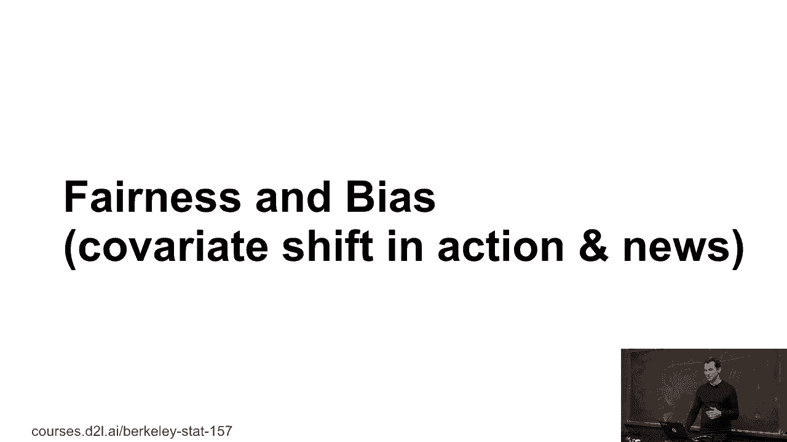

# P40：40. L9_2 协变量漂移 - Python小能 - BV1CB4y1U7P6

>> Qouserative correction。

再拿我们的训练集来举个例子，对吧？猫和狗。那可能会出什么问题呢？好吧，我们进行了分类器的测试。对吧？当然，这根本不起作用，对吧？

因为它无法识别那种猫。所以你可能会想，嗯，你知道，这很明显，为什么会有人做这种事？你知道，怎么可能这么天真呢？嗯，这里有几个例子。所以在网页搜索中，假设你想建立一个搜索引擎，或许你有一些搜索引擎的页面相关性数据。但现在你决定，好的，我的搜索引擎在加拿大、英国、澳大利亚等地变得非常流行了。

不要说不同语言的国家，即使是所有讲英语的市场，你知道，搜索相关性也可能不同。所以，举个例子，你可能会认为加拿大人可能更有礼貌，更关心熊和女王。

然后也许，你知道，皇家骑警，对吧？所以你可以明显看到，搜索结果应该会有些许不同。或者在语音识别中，假设我用西海岸口音来训练这个系统，然后我想把它部署出去，假设我把它部署在德克萨斯州，或者更糟的是，我把它部署到像我这样不讲英语的人身上。

对吧？然后语音识别系统失败了。我猜大多数人可能都遇到过这个问题。比如你拨打某个热线，他们告诉你说：“嘿，这是新的语音操作系统。”然后你开始变得很生气，因为这个语音操作系统根本听不懂你，对吧？

这就是协变量漂移。因为系统训练时使用的参考分布。像我们在座的大多数人。或者即使是事物有不同的名称，实际上是同一样东西。所以，你知道，汽水可能被称作pop、coke或其他名字。这些差异甚至存在于同一个国家内。所以，这里是软饮料名称的分布。

对吧？然后，美国不同地区的红蓝分裂。这与你通常看到的有所不同。是的，人们称某些东西为pop、coke或soda。好吧，显然，你知道，在亚特兰大附近，他们叫它coke，因为，嗯，你知道，coke在那里，但不管怎样，这里有。

相当多样。所以，即使你建立了一个语音识别系统，假设你在加利福尼亚建立了它，然后因为你在马萨诸塞州波士顿还有一个研究实验室。你的系统在叫“汽水”的时候会运行得非常好，对吧？

但它们不会适用于其他人。所以，这有点好笑。嗯，这些可不是那么好笑的事情。所以，第一个事情实际上发生过。假设你是一个医疗创业公司，你想设计一个血液测试来检测某人是否患有前列腺癌。

结果证明，从生病的老年男性那里获得血样其实相当容易，因为他们生病了，他们说，“嘿，如果你能找到一种血液测试方法来更早地检测出来，那真的很好。”所以，生病的人通常非常愿意捐献他们的血液，对吧？然后他们意识到，好吧，我们有了这个小问题。

没有足够的健康男性数据。实际上，这涉及到一些伦理问题，因为，你知道，如果你只是采集血液并发现，这个人可能生病了，但你不知道是否应该相信你的测试。那么，你会打电话给这个人，吓他一跳，说，“嘿，看这里”吗？

我们的测试已经设置好了，你可能得了癌症，但我们不确定。另一方面，好吧，我是应该闭嘴让这个人可能死去吗，对吧？所以，获得这些数据并不容易。长话短说，他们有了一个很棒的主意，因为他们在大学校园里，学生们成本低，而且，大概是为了免费啤酒。

他们愿意捐献少量的血液。所以他们收集了很多血液并进行了分析。然后他们找到了我，问我，Alex，你能帮我们建立一个分类器吗？我告诉他们，可以，可能会非常完美地工作，但其实它会完全没用，因为，嗯。

他们的健康人群基本上是20多岁的男性，这些人可能运动更多、喝酒更多，是大学生之类的。而另外，生病人群是患有前列腺癌的老年男性，所以区分老年人和年轻人的分类器会非常有效，对吧？这就是协变量偏移，嗯，基本上他们搞砸了。

最后可用的现金用完了，这个创业公司也就结束了。请注意，这是由几位大学教授经营的，但并没有募捐。另一个案例，强化学习。假设我用你知道的，当前策略收集数据，然后，你知道，我的策略会改变，因为，你知道。

我在玩星际争霸或者击杀怪物，或者在我的服务中心控制空调系统方面变得越来越好。所以现在到了测试的时间，好吧。因为环境对此有反应，好吧，你知道，也许我的算法不再那么有效了。所以有很多关于回放缓存的有趣工作。

策略学习和丙烷的发现。所以，假设你去上Peter、Bill或Sege Levine的课，你知道，你会学到更多这方面的内容。然后，还有一些比如，数据库这样的事情。假设我们建立了一个自学习的数据库，自调优数据库。这个数据库是在2017年的使用模式上进行调优的，然后你部署它，你部署它。

所以我可能应该将其更新到 2019，但如果我在 2018 部署它，那么 2017 年的模式可能仍然稍有不同。所以我的算法将不再是最优的。长话短说，协方差是真实存在的，并且几乎默认假设你有那种问题。所以我们来看一下数学。现在训练风险，假设我有，你知道。

无限量的数据，所以我们不用担心这个。实际上并不是很多，但我基本上将积分 dx 最小化为。 dx p(x) dy p(y | x) 之类的某种损失。但它是测试时间，并且我假设 p(y | x)，所以你知道，给定数据的正确标签是什么。

这在训练时间和测试时间之间不会改变。所以举个例子，谈到生病的人，他们不管怎样都会生病，对吧？但我只是有更多一种类型的生病人，而另一种则较少。所以在测试时间，我不再有 dp 的积分，而是有 dq 的积分。所以我真正应该做的是，我应该最小化。

相对于从 q 分布中抽取的数据的经验风险。但显然，在测试时间我没有标签。所以我能做的是，这其实非常简单，dx q(x) f(x)。我可以把它写成 dx p(x)，然后我有 q(x) / p(x)，再乘以 f(x)。

所以我基本上得到了这个比率 q 和 p。如果你上过测度理论课程，你可能会讨厌我列出这个方程式，因为你真正需要的，实际上是相对尼科杜姆导数 dq/dp。但我们现在不关心这些细节。所以如果你有兴趣并且学过测度理论，嗯。

有一种更简洁的写法，但暂时我们就先看这个。现在的问题是你需要那个密度比率。有一种方法是，嗯，我估计 p。我估计 q。然后我拿那个比率，结果就不太好了，对吧？

因为密度估计真的非常非常难。不要做那个。相反，事实证明，获取这两个分布比率，实际上更容易获得。现在我会告诉你怎么做，你实际上将在作业中详细完成这个。

