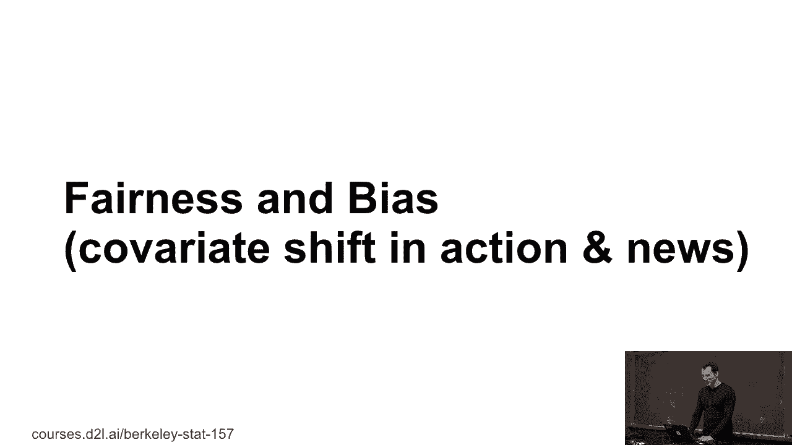
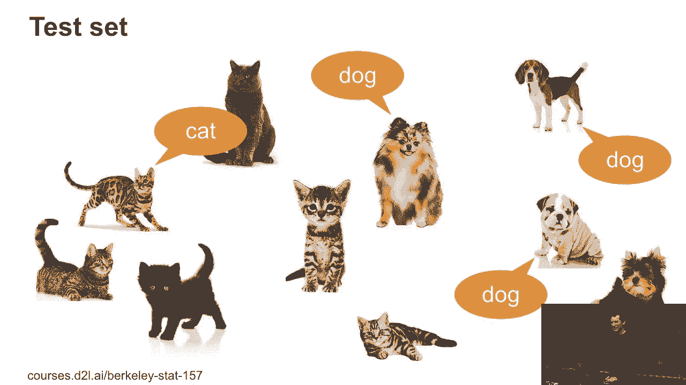
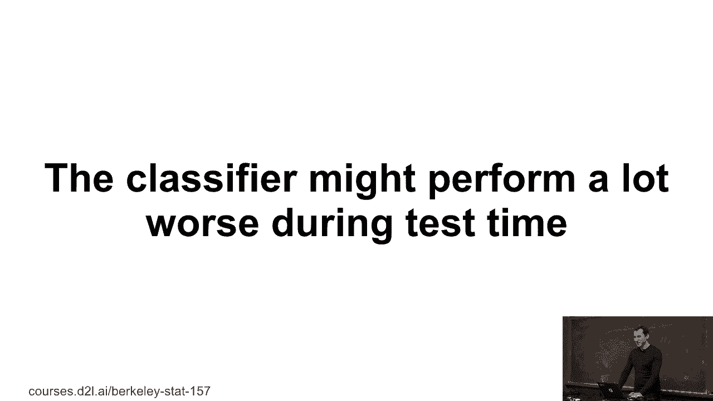
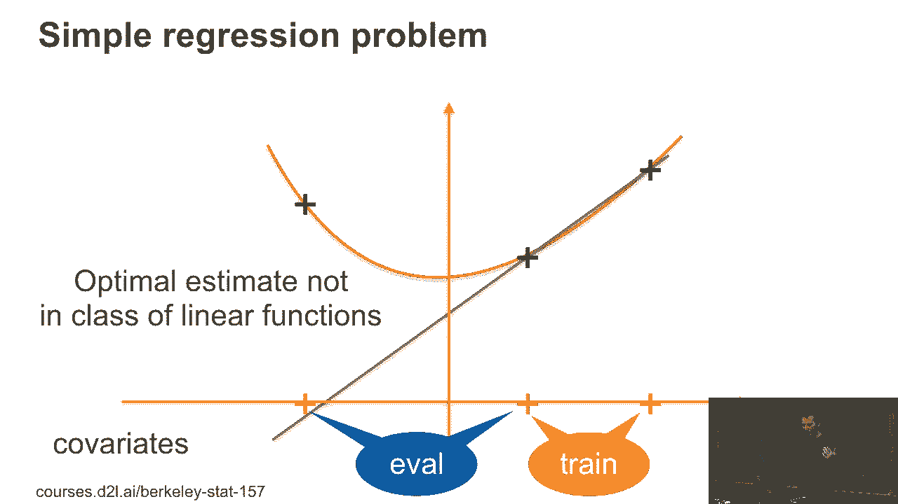
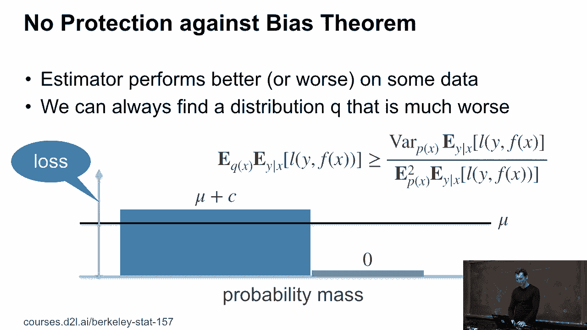
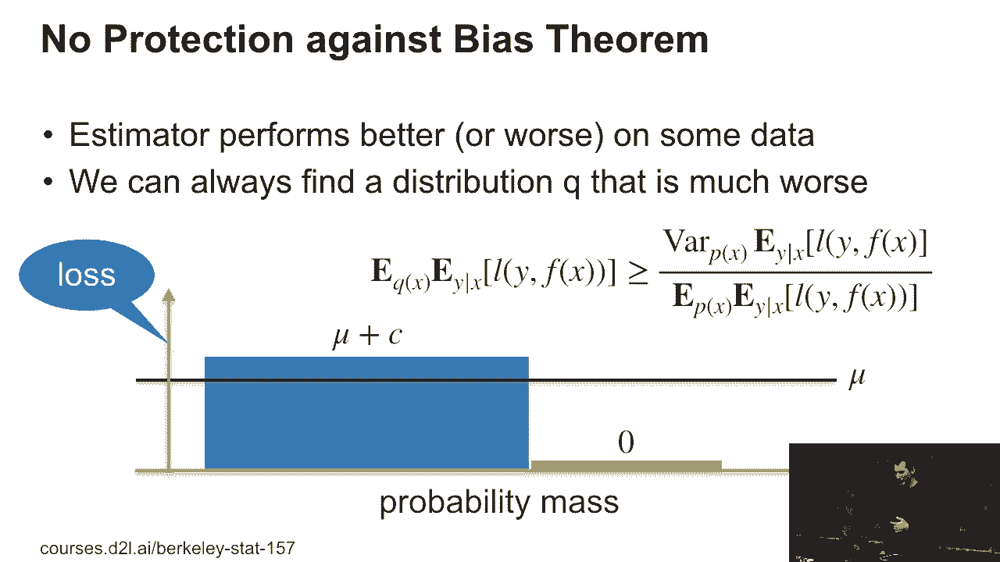
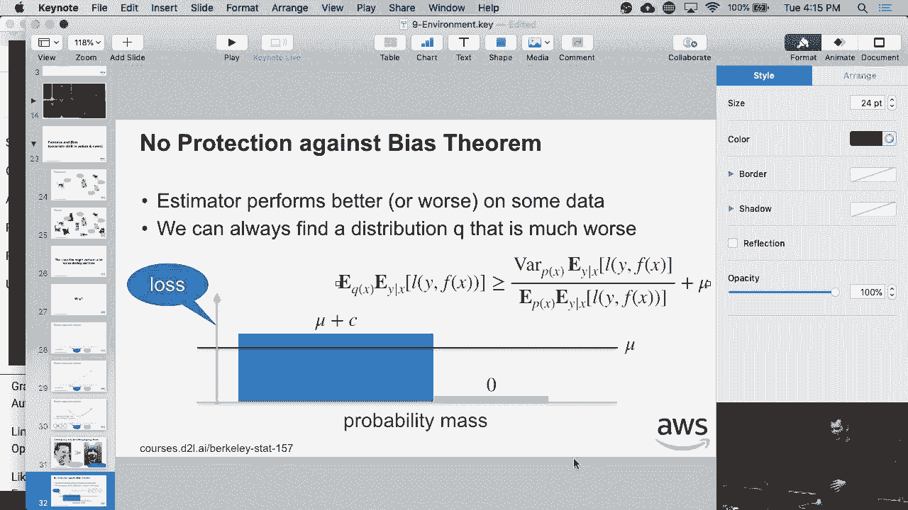
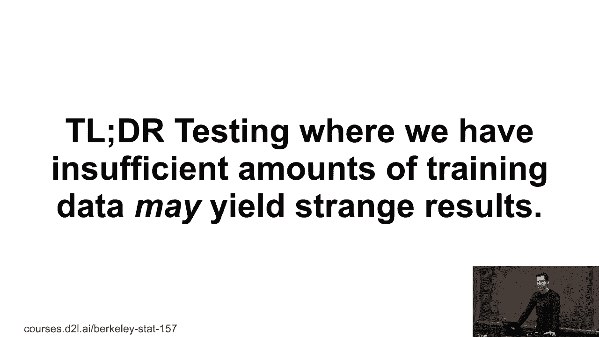

# P41：41. L9_3 Covariate Shift and Bias - Python小能 - BV1CB4y1U7P6

 Let's talk about fairness and bias in the news。 So you may have heard some things about how maybe one sister。

 or another is really so much biased。 And this has to do with all those evil engineers being。

 for instance， white and male， well， or whatever。 But let's actually dive into the math of what's going on。

 Right？ So let's say this is my training set。

 OK。 No cats and dogs again。 Doesn't my test set？ And so this test set has a lot more gray animals in it。

 It also has a lot more cats。 And they look a bit different。

 So I wouldn't expect the system to work terribly well， in this case。

 Right？ OK， so let's bottom line the classifier。

 might perform a lot worse during test time。 So what's going on？

 Let's look at a really simple problem here。 And this will-- or there are at least two reasons。

 why it might perform worse。 So let's say I have three possible observations。 And then I have two。

 maybe at the evaluation time， and one at training time and two at training time。

 And I have those black crosses as my data point。 And in this case， things work out nicely。

 I train on my training set。 I get this linear function。 And it works very well at evaluation。

 So I could get lucky， right？ Where am I get this？ So the only difference between these two things。

 is that now the black crosses up there。 So now at evaluation time， what I really should have done。

 is， well， I should have gotten something like this。

 We're rather-- if I had trained on something that， looks like the evaluation distribution。

 I would have probably gotten the other solid line。 That's decreasing。 In other words。

 it may very well be， that if I have very little data， the optimal estimate。

 that I get at test time will be considerably different。

 and worse than the one that I get at training time。 This is a simple counterexample。

 The other thing is this one here， right？ So you're training data set。 And yeah。

 I can assure you no Photoshop was， used for the picture on the right。

 This is just pure lens distortion。 So what can happen is that the training data set could be。

 that you're training only on really beautiful faces， right？ On IMDB。 And then， unfortunately。

 test time， while things go a little bit worse。 So now let's actually quantify this mathematically。

 So there's a tiny little theorem here， and I'll give you a bit of the reason of what's going on。

 And I'm calling this the no protection against bias theorem。 Essentially。

 what it tells you is that if I have some， estimator， which on average gets you some accuracy mu。

 some performance mu， but then I have some variance， in the accuracy。

 So this is basically just the variance， with regard to distribution p of the expected value of basically。

 how well it performs the expected loss。 Then I can always find some other distribution q。

 such that the performance under this q distribution， is worse than the variance divided by the mean。

 And there's a typo here。 There should be no square in the bottom。

 Let me quickly fix this because this， is bad。 So in other words， variance divided by mean is--。

 and actually， this is--。

 well， it's still incorrect because I need to add plus mu to it。 Sorry。 Yeah。 Yeah。 So basically。

 things-- I can always make things worse。

 if there's some variation over how well I perform over the data set。

 That means in practice that I can always， pick some images， some faces， some demographics。

 maybe more black cats， maybe more gray cats， maybe tall dogs， maybe short dogs。

 And it will work worse for them。 And there's absolutely nothing you can safeguard against it。

 You can turn this into an optimization problem， and stay tuned for the paper that comes out of this。

 But basically， there's no protection。

 So now， why am I saying this？ Because people act a little bit surprised sometimes。

 when they build a machine learning service。 And then they find out that their service works better。

 on some data than on other data。 So if you don't have a lot of data for a certain subset。

 your performance may be quite a bit off。 And well， yeah， that's essentially the big warning here。

 So if you deploy machine learning products in practice。

 and then have to deal with people who don't understand math。

 they might find complaints and infer it will even in products， where it's just pure math。 OK。

 so that's as far as what bias and covariative correction。

 is concerned。