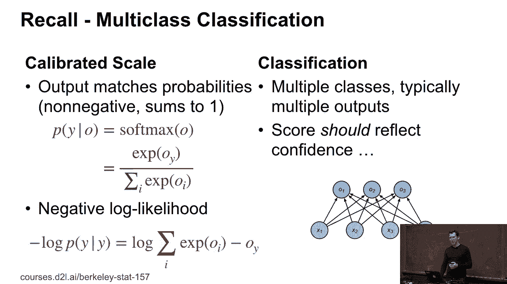
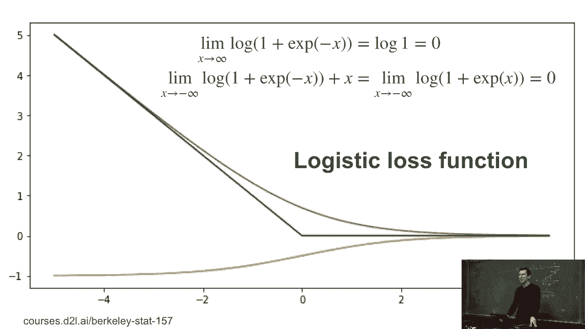
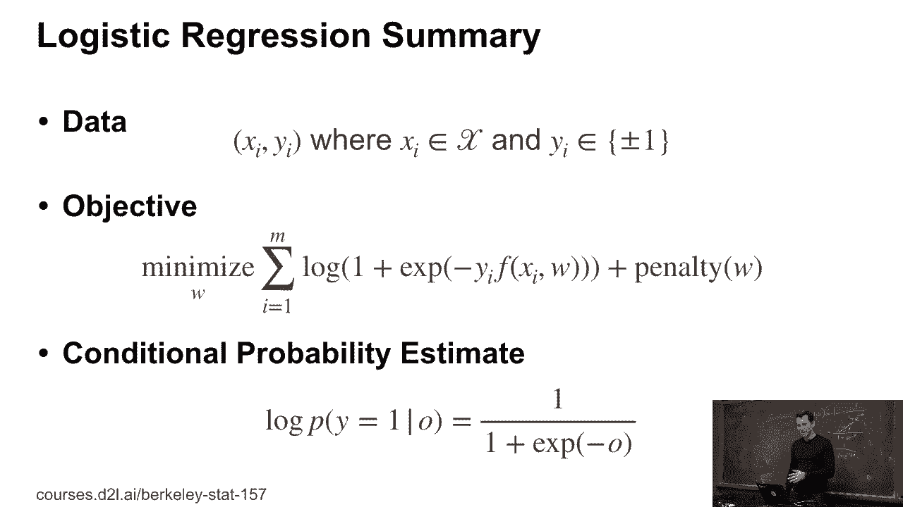
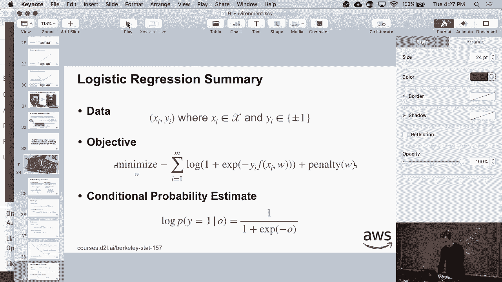
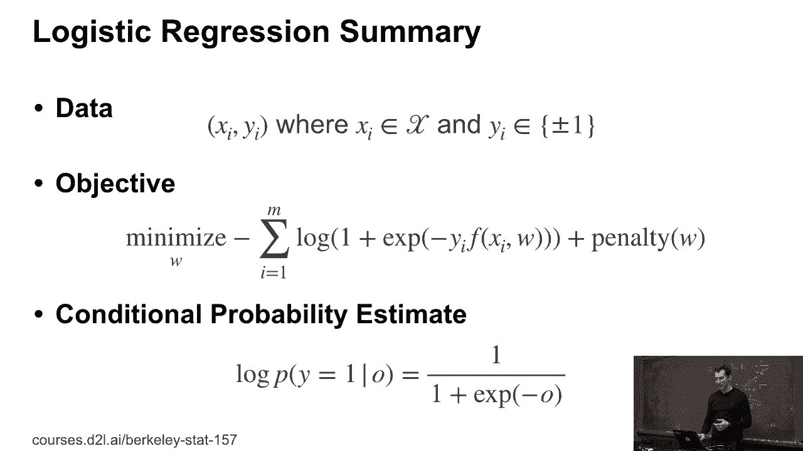

# P42：42。L9_4 逻辑回归 - Python小能 - BV1CB4y1U7P6

好的，现在让我们看看如何真正解决这个问题。为此，我需要介绍一个叫做逻辑回归的概念，它实际上是我们之前在处理多类分类时已经做过的一种特例。记住多类分类吗？这是大约两周前的一张幻灯片。

在那里，我们基本上说过，我们希望得到经过校准的概率。所以你对所有类别求和，OY，E的OY次方，对E的OY次方求和。这个量，softmax，是一个合理的概率分布，和为1，一切表现良好。负对数似然函数则看起来像是，这种类型的。

持续求和E的OY次方减去OY。这样就好了。那么如果我们只有两个类别呢？

实际上，如果我们只有两个类别，正如你们可能已经发现的那样，你具有加法不变性。所以你可以将常数加到所有的输出中，它们会得到相同的概率。好的，假设我有类别1和-1。那么P（Y=1|O）是E的OY次方除以E的负O次方减去1。再加上E的OY次方。现在我可以将常数加到O1和O-1上。

所以我得到和之前一样的表达式，只是现在加上了C。显然，我可以通过除以所有这些C来再次提取它们，得到原始表达式。换句话说，我有加法下的不变性。好了，如果我有这个就很好，因为我实际上可以去简化一些东西。

所以我可以做的是，我可以将O-1设置为0。为什么我要这么做呢？嗯，为什么不呢，对吧？

所以我得到的P（Y=1|O）是E的OY次方除以E的0次方，也就是1，加上E的O次方。现在我去除以E的O次方，就得到了1/(1+E的负O次方)。这就是逻辑回归。现在，你可能想要做的最后一件事是计算P（Y=-1|O）。好吧，让我们在白板上显式地做这个计算。P（Y=-1|O）。

这是1减去1/(1+E的负O次方)，对吧？也就是1+E的负O次方。这里我有E的负O次方。因为我有1+E的负O次方，减去1。所以这是我得到的结果。这样，我就可以消去这个。所以除以它。这样我得到1，然后得到E的O次方，换句话说，我得到这个。

现在我可以简化这个。P（Y|O）是1/(1+E的负YO次方)。这正是我们之前得到的结果。这只是一个非常方便的简化，因为现在在计算损失时，我不需要if else条件，而是可以通过简单的乘法来处理。下面是逻辑回归损失函数。所以蓝色的函数就是逻辑回归损失。

那是负对数P(Y | X)。橙色函数是条件类概率。没错，它其实不是斜率，抱歉。它也恰好是条件类概率，但我们不会深入探讨这一点。有趣的是，这个橙色曲线是通过使用luan计算的。

我实际上并没有求导，我只是跑了自动求导。因为我很懒。而且用一行代码要比动脑筋简单得多。现在，最后一件我们可能需要做的事情是得到渐近线。所以如果我有X趋向于无穷大的渐近线。

这应该和以前的作业非常相似。所以我得到的，当然，X趋向于无穷大。E的负X次方趋向于0，所以我得到很多1，这就是0。所以这就证明了X趋向无穷大的渐近线是常数函数0。对于X趋向负无穷大，我将从中减去函数负X。

所以我得到的是1加上E的负X次方加X的对数。将其转化为指数形式后，我得到的是1加E的X次方的对数。现在，再次地，对于X趋向于负无穷大，第二项消失，所以我又得到了0。因此，通过这一点，我刚刚证明了这个绿色函数给了我X趋向正负无穷大的渐近线。而橙色函数是斜率。到目前为止有任何问题吗？

所以，为了快速总结一下，不用担心，接下来的内容我们会经常用到。特别是当我们看看协方差修正时。所以我有一些数据，方便的是人们选择了类1和类-1。我有一些目标，它是1加E的负某个项的对数。

事实上，我这里搞错了。需要加一个负号。让我赶紧修正一下。我可能还会对参数加上一些惩罚项。

条件概率就是1除以1加E的负O次方。这也恰好给了我导数。这不是巧合，它和指数族的工作方式有很大关系。如果你对这方面感兴趣，可以去修一门关于指数族的统计学课。如果你理解了它们都遵循相同的数学基础，你会发现有很多非常漂亮的数学，可以简化很多事情。

