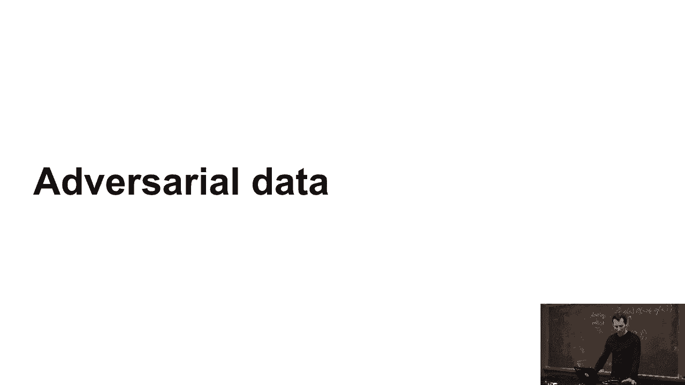
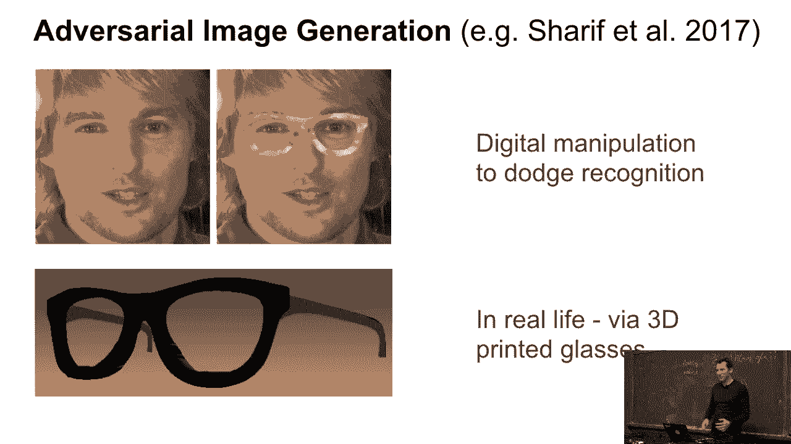
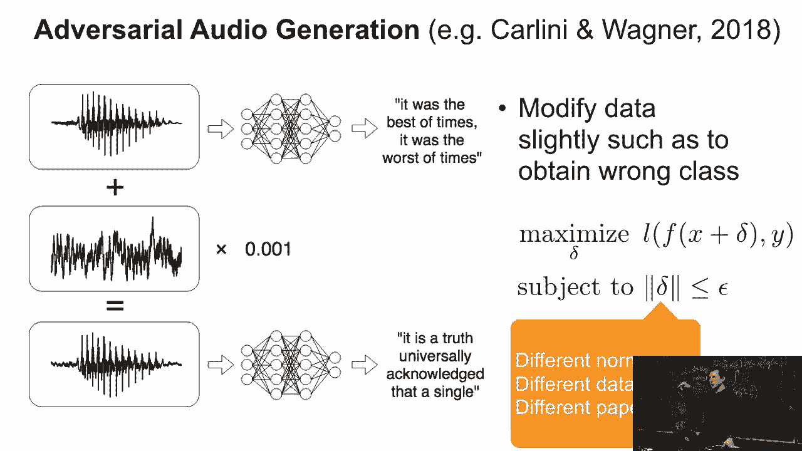
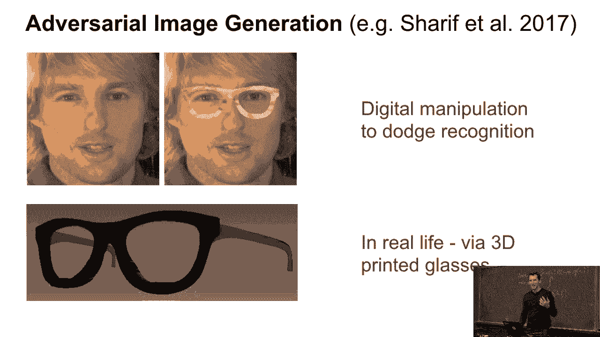
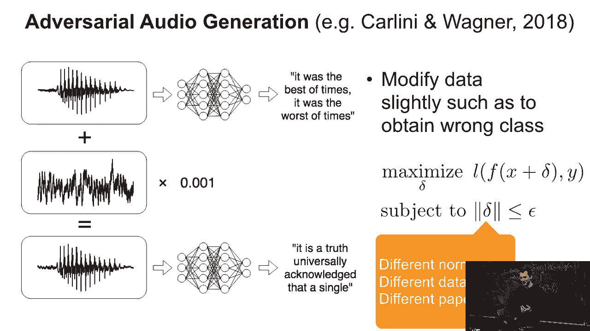
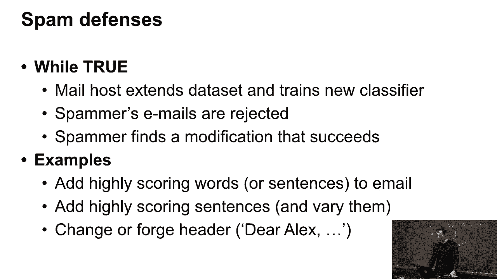
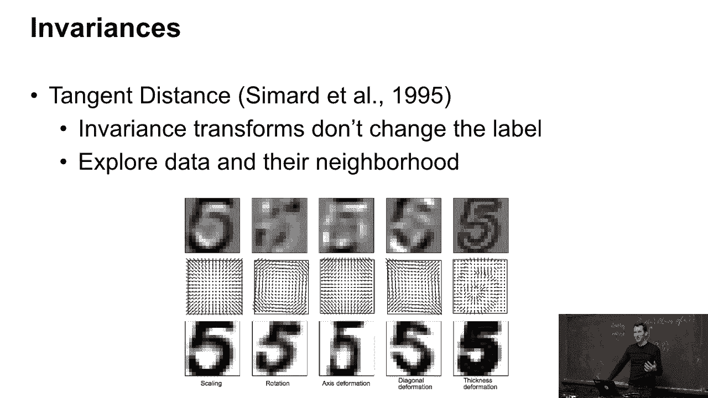
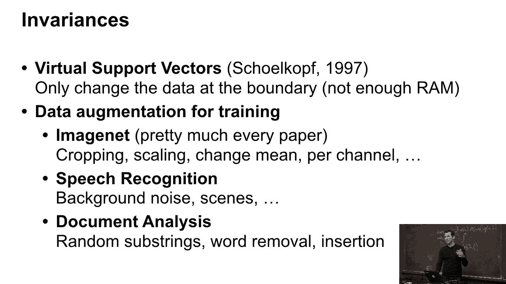
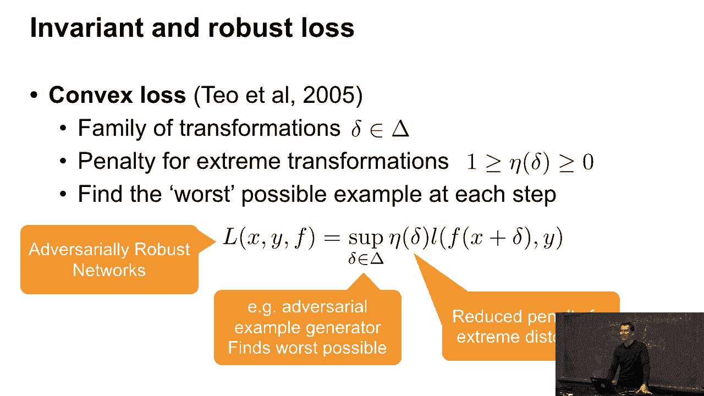
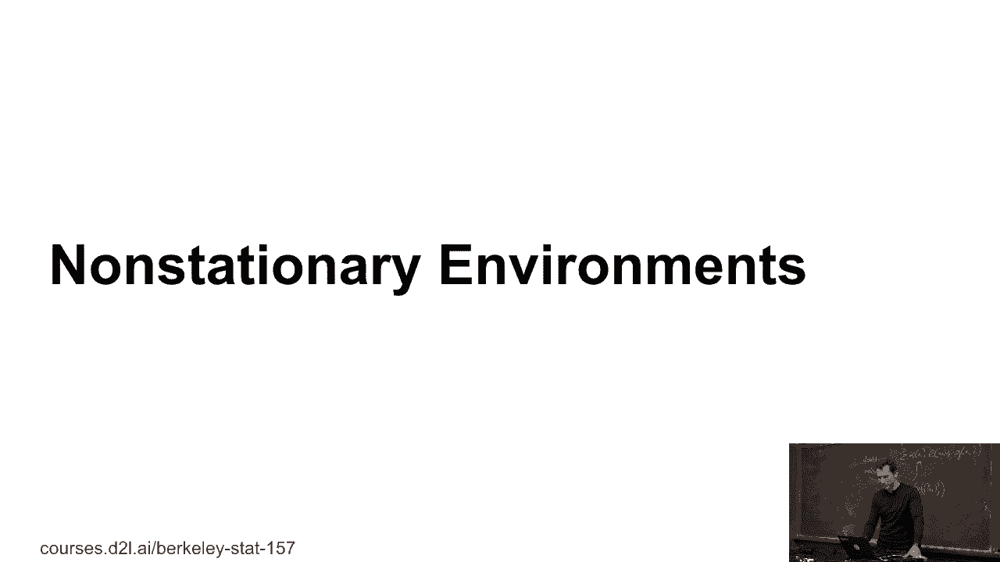

# P45：45. L9_7 敌对数据 - Python小能 - BV1CB4y1U7P6

另一个话题，敌对数据。

看起来我们已经相当顺利地通过这个实验了。那么，假设我们想做名人识别，嗯，好吧，那是Jeff，而他右边的那位。嗯，那是Andy Jassy，AWS的CEO。对，没错，它确实能识别出我们的CEO，这是件好事，对吧？所以，如果你是《国家询问报》……

你可以用它来判断过滤器是否包括了Jeff。但你怎么能逃避这种情况呢？

然后有一篇2017年的酷论文，他们基本上就是在这位绅士的照片上“Photoshop”了一下。他看起来有点像奥斯汀·鲍尔斯，戴着一些非常夸张的眼镜。实际上他们还真的3D打印了这些眼镜，做得非常酷，并且根据图案设计了它们。结果他们成功地欺骗了人脸识别系统，对吧？我的意思是，不，当然你不会像这样，知道的吧。

被欺骗了，对吧？我的意思是，它还是同一个人，但人脸识别系统却被欺骗了，对吧？这当然是，知道的，取决于你怎么看，是一件可怕的事情，还是一件伟大的事情。

那么，究竟发生了什么呢？顺便提一下，这是去年伯克利的一篇论文。他们用音频做了同样的实验。他们拿了一段音频流，你知道的，是某部狄更斯小说。它就是“最好的时光，最坏的时光”。他们在其中加了少量噪音，突然间，它开始变成文本了。

来自言语识别器的宪法。所以你首先知道，天哪，他们是怎么做到的，因为如果你把它回放给人类，他们甚至都不知道某些东西是假的。然而言语识别器却惨败了。于是他们基本上做了这样一件事，嗯，你知道的……

让我们尝试最大化损失，如果我只做一个非常小的改变。

对数据进行了扰动。你应该已经从中看到一些东西了，嗯。我希望没有人会在现实中戴这种眼镜，因为它们看起来实在是太怪异了。所以，这意味着人脸识别系统……

它从未真正为这种奇怪的数据进行过训练。

那么，为什么它能工作呢？嗯，基本上，如果你把它看作是训练和自然测试数据，它们生活在一个相对较小的输入子集上，你可以有的输入。而敌对数据稍微偏离了这个支持集。它的偏离方式让它看起来仍然是合理的，但当然……

如果你问一个人，知道的，这个圈子左边的生物是什么？我猜我们一半的人，如果他们没有其他的上下文，可能会说，嗯，那是一个打扮成猫的医生，对吧？或者是一个猫医生之类的，像是儿童故事中的角色。但他们不一定会说是猫，对吧？所以这是在展示不自然的数据。

因此，对不自然数据做出非常意外反应就不会让人感到惊讶了。嗯，这是一两年前在新闻中广泛讨论的内容——对抗性数据生成将摧毁机器学习，之类的内容，对吧？

所以这就像是似乎是全新的东西，但实际上并不是。我们至少已经处理这个问题20年了。至少自从电子邮件出现以来，垃圾邮件就一直存在，对吧？垃圾邮件发送者别无他法。嗯，除了，当然，你知道的，给你写19封关于如何，嗯，你知道的，骗你的邮件。

如果你想从一个尼日利亚的王子那里获得一些钱，但为了突破垃圾邮件防护系统，他们需要以某种方式修改电子邮件内容，使其仍然是关于那个王子的尼日利亚王子，想要给你他的百万财富，但又要让它看起来不被垃圾邮件过滤器识别出来，关于那个来自尼日利亚的王子，对吧？

所以他们会给其中添加其他单词。他们可能会在某些方面扰动邮件文本，是人类会忽视的那种，但是垃圾邮件过滤器会捕捉到。所以例如，你可以向其中添加高分词汇，你可以使用句子。你可以实际写出“亲爱的Alex，某某王子已经预定了给你2000万美元”，然后垃圾邮件过滤器就会识别出来。

你知道，利用这样的特征，任何发送给我的邮件，如果称呼是亲爱的Alex，那很可能是一个认识我的人的邮件。嗯，它就能通过。所以对抗性数据几乎从人们开始使用机器学习那一刻就存在了。它并不新鲜。只是，如果你将其应用于图像，就显得不太一样了。

这很吸引眼球，你可以写出很棒的博客文章，对吧？

例如，这是一个人们实际使用不变性的例子。这个例子来自1995年，切平面距离。它是由Patrice、Imar和其他人来自AT&T实验室的研究成果。对于手写数字识别，他们研究了不同类型的不变性。在这种情况下，这不是回收数据，而是实际上在增强数据集。

当我们进行图像分类时，稍后我们将看到很多这样的内容。我们会研究数据加载器，基本上是预处理器，其中包括裁剪和扭曲等操作。这里他们用它来处理数字。你可以缩放数字，调整它的大小，变小或者变大。你可以旋转它，可以变形它的轴线，可以挤压它，还可以改变其粗细。

这些是中间的相应向量场，展示了它到底是如何工作的。然后你只是看这个切平面，看看在这个切平面内的距离。如果在这个平面内距离很近，那么你可以说它还是一个5。所以这是利用不变性来帮助你的。

这已经存在很长时间了。基本上，你提到了它。每个人都在做这个。在语音识别中，人们会添加背景噪音。他们改变场景和其他元素，以提高系统的鲁棒性，来增强数据。文档分析。你可能会添加或删除一些单词。比如说，举个例子。

虚拟支持向量机，Bernard Shilkoff 使用它是因为他的计算机内存不够。所以这是一种特定的、独特的方式来增强数据。

数据集在那儿。那么，背后的数学是什么？有一个小的损失函数，几乎涵盖了所有的情况。基本上，你做的是，你有一个损失函数，它在数据上被调用，再加上一些扰动 delta。你为这个扰动付出代价。所以，现在，你不仅仅是在 x 和 y 上遭受损失，而是会在 x 和 y 的扰动版本上遭受损失。

你在玩一个游戏，敌方将尝试找到数据的最坏扰动。而你则在尝试找到在这种情况下仍然表现良好的最佳函数。所以这是1995年的对抗性数据生成。是的，这就是对抗性数据。到目前为止有任何问题吗？好，没问题。

