# P47：47. L10_1 深度学习框架，Gluon (1) - Python小能 - BV1CB4y1U7P6

在硬件之后，我们可以进一步讨论前端框架。

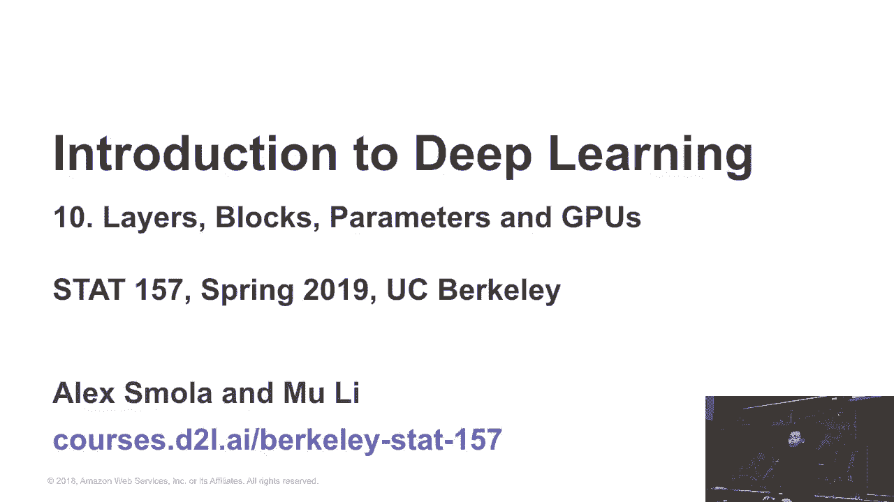

所以我们知道有一堆框架，横轴是年份。你可以看到，Ciano，Cafe，Cafe 来自伯克利，尤其是很多新的东西，特别是。大约三年前有四个框架，其他的东西。所以我们可以简要介绍每个框架的主要设计决策以及其他内容。

是那个代理，或者说是仅仅存在的那个。

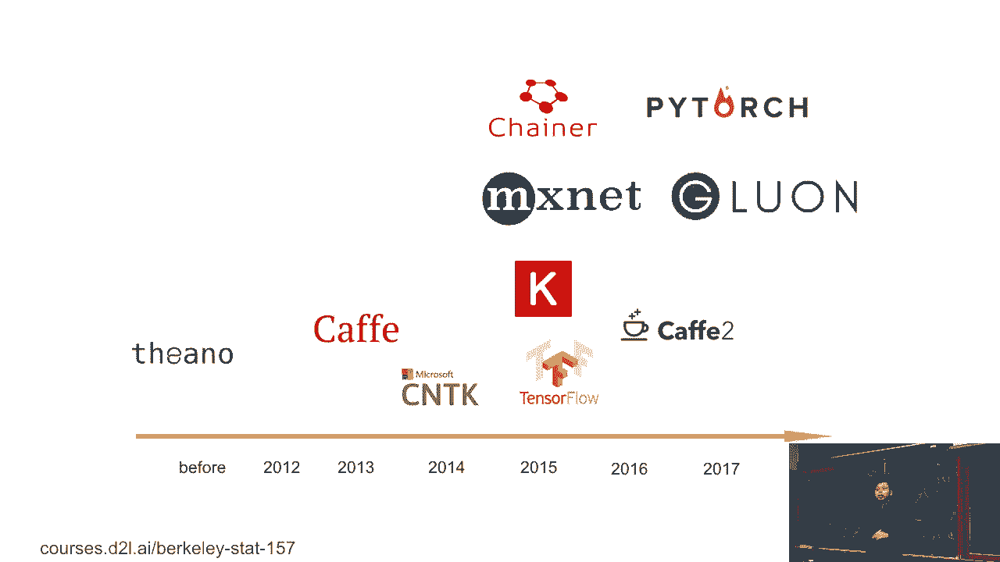

第一个是 Cafe。Cafe 来自伯克利。它是大约四年前最流行的计算机视觉框架。所以它的程序接口是这样的，你给我一个协议规范。你可以写一段文本来描述网络层。例如。

这是 RESTNet 1011 网络的一部分，如何定义层。我们有层次结构，我们有底层是什么，顶层是什么，还有顶层及其前置层在这里。所以这里提到的，是 Cafe 拥有非常好的 Cvmore 覆盖。它是一堆卷积网络，我们下周无法讲解。并且它是可移植的。

这意味着它是一个单一的二进制文件。你可以抓取它并在任何地方运行。但是，如果你想做像 Python 级别的交互式编程，那时它并不那么灵活，程序会非常困难。而且，这一层我实际上没有展示完整。单一定义有四千行代码，这意味着有四个单独的层。

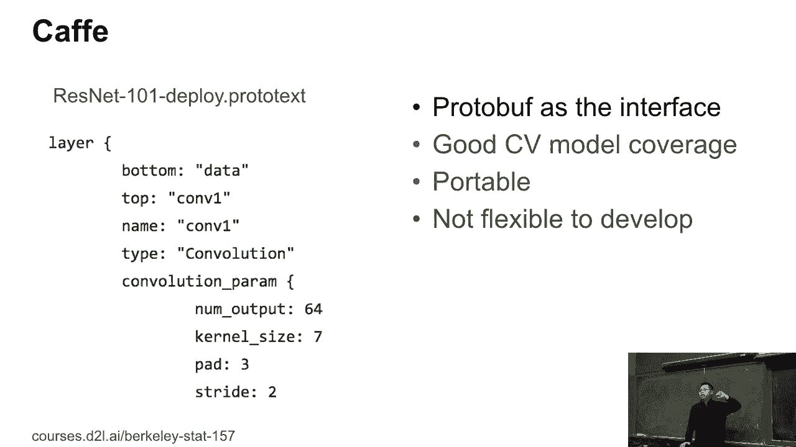

一个四层网络。之后，TensorFlow 可能是目前最流行的深度学习框架。它提供了特定领域的语言，叫做 DSL（领域特定语言）用于 Python。所以 TensorFlow 就像 Python，但又不是 Python。它有成千上万的运算符。事实上，TensorFlow 就是你想要的所有东西都可以在其中找到。

你还可以使用许多功能，进行训练、部署，做你想做的一切。但这里的问题是，TensorFlow 的代码有点难以理解。如果你之前没有学习过，它对 Python 用户来说会比较难。举个例子，如果你阅读这段代码，你可能不知道这个 state OPs 赋值到底等于什么。

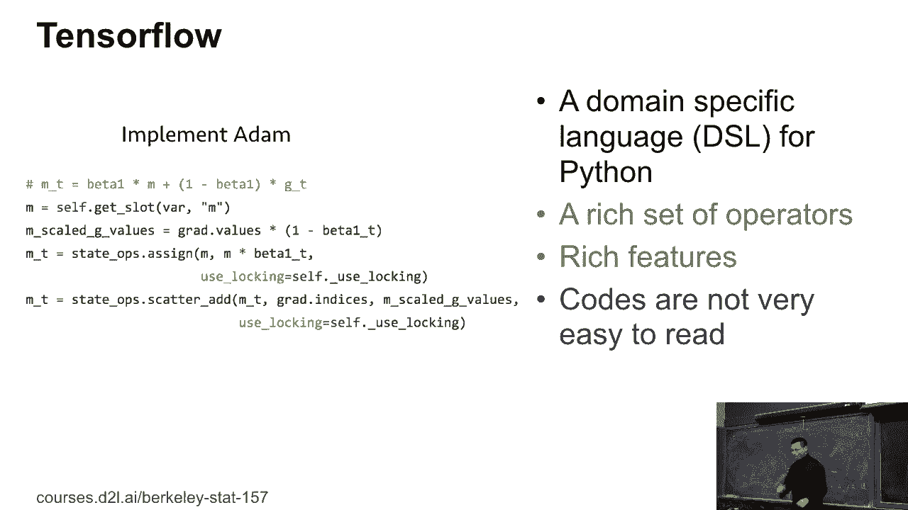

但它有点难理解。另一方面，Chaos 是一个客户端。它就是一个旨在简化开发过程的工具。例如，下面是如何使用 Chaos 来定义一个多层感知机。它跟我们之前在 Groom 中所做的非常相似。Chaos 只是一个客户端。

你可以使用不同的后端。例如，你可以，实际上，对于原始用途。现在 CML 使用的是 TensorFlow，你也可以使用 M stand 或 CNT cache 后端。所以你关心的是，它比 TensorFlow 使用起来要简单一些。但可能会更慢，因为前端有一些开销，然后你就。

尝试使用TensorFlow时，你的库看起来可能在最后更高效一些。但它在开发和调试上不太方便，因为你会看到这里有一个编译步骤。你定义的模型进行编译，实际上就是所谓的符号编程。我们之前稍微提到过，这使得获取中间结果变得有些困难。

结果并进行交互式操作。

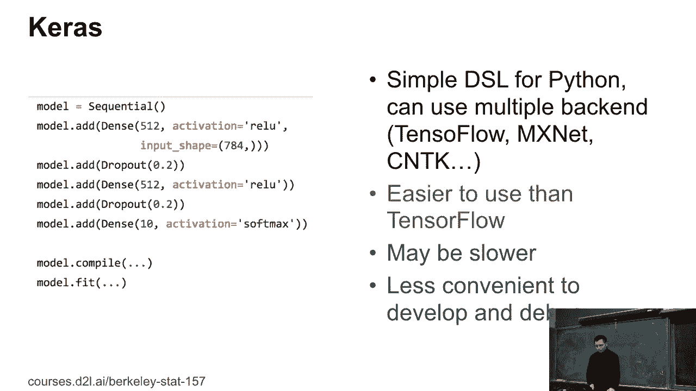

另一个非常流行的框架是PyTorch。PyTorch来自于PyTorch。实际上，PyTorch从Torch中获取了Tensor接口，并且还获取了来自Channel的UNL接口。所以它完全基于Python，这意味着它非常容易理解。如果你是Python用户，你可以轻松阅读PyTorch代码。

由于它与Python紧密集成，PyTorch在部署时可能会遇到一些困难，尤其是在工业应用中。有时候你的应用是用Java编写的，而你需要在Java中运行Python，这会比较强大。而且如果你想在手机上运行，通常不需要Java，这会带来很多效率问题。但PyTorch使用起来非常简单。

它在研究领域变得越来越流行。

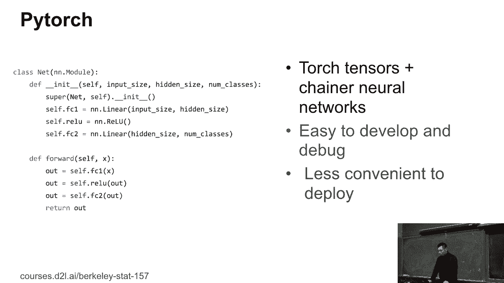

所以这门课是基于M-Snet的。原始的M-Snet包含了一个类似Tensor库的长部分，正如你之前看到的，叫做ND。最后像神经网络这样的网络是一个简单的网络，这意味着你定义网络，编译它，并将数据输入进行训练。M-Snet的原始设计是为了提高性能。

我们希望获得最佳性能，因此我们牺牲了一些可用性。在那个时候，大家还不太了解，因为那时社区很小，几乎都是专家，所以我们并不关心可用性。

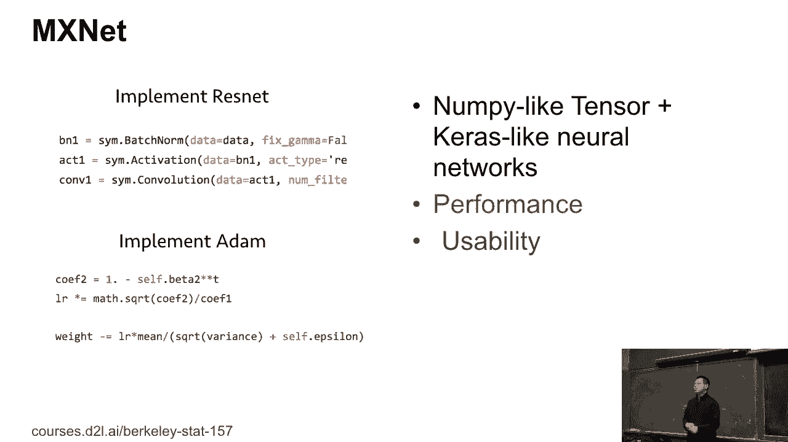

之后，社区的发展使得PyTorch变得比TensorFlow容易使用十倍，我们意识到是时候做一个类似PyTorch的框架了。所以Gluon实际上和PyTorch非常相似，都是用于神经网络的框架。所以在这里我们定义网络，然后可以做类似我们之前介绍的事情。Gluon使得开发代码和调试变得更加容易，这和PyTorch类似。

与符号接口相比，有时会稍微慢一些，因为你会失去一点性能。在使用PyTorch进行交互体验时，通常情况下你不需要太在意，除非你是自动驾驶公司，拥有大量4K视频，真的非常注重性能。然而在大多数情况下，这并不是问题。

对于作业来说，你不需要担心这些。所以这就是我们两年前的情况，以及我们过去两年真正学到的东西，随着越来越多的学生和工程师加入，大家对框架的关注越来越少，它只不过是一个工具。

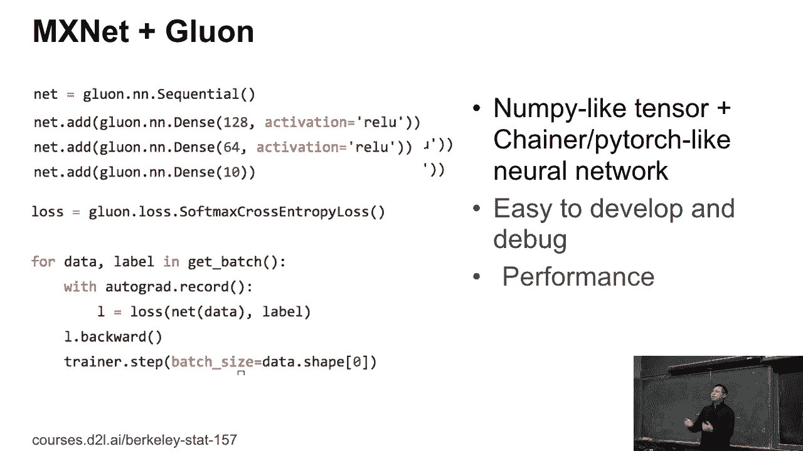

框架是一个工具，可以帮助你完成任务。例如，对于研究人员，他们真的想要一个已经实现的基准模型。这样我可以在基准模型的基础上进行修改，训练我自己的应用。而对于工程师来说，我更关心的是数据抓取、模型训练和部署。那些才是我真正关心的。所以，从一年前开始，我们尝试了，好的。

让我们把注意力集中到应用上。例如，有一个叫做Glone CV的东西。它是一个计算机视觉工具包，提供了大量的图像规格，涵盖了所有这些流行的模型，比如物体检测、语义分割等，许多分割任务，像人脸识别、许多其他应用。

它有一堆预训练模型，你可以直接抓取并使用，也有所有这些训练脚本来重现结果。重现结果其实很难，因为为了让论文看起来炫酷，你需要很多花里胡哨的东西，但要得到结果，你需要很多技巧。例如。

很多著名的论文我们也会在课堂上讲到，声明说是的，我们设计了一个网络，我有这个故事。而且我们已经让基准测试提高了5%。哦，这可是一件大事，大家都会跃跃欲试。是的，那太炫了。实际上，当我们深入研究实现过程时，我们发现提升3%的主要技巧就是针对Softmax的。

你可以给0表示NACTIVE，1表示正数。但你知道，Softmax回归需要适应0，否则会太难。你可以做的是，将正数从0改成0.9，并将NACTIVE从0改成0.1。这是软标签的成本，这样可以提升3%的效果。好吧，确实有很多技巧可以让事情发生。所以这个工具正是为了实现这些目的。

让我们调查所有的技巧，并找到优先级更高的技巧，来应用于所有这些模型。你实际上可以从中获得很多好的成果。所以，也有一堆项目，比如，好的，如何利用数据集为你找到一个模型。我们的反馈是，嗯，这是一个家庭作业项目，因为你只是简单地抓取它，并用我们3.9的代码就能找到你想要的。

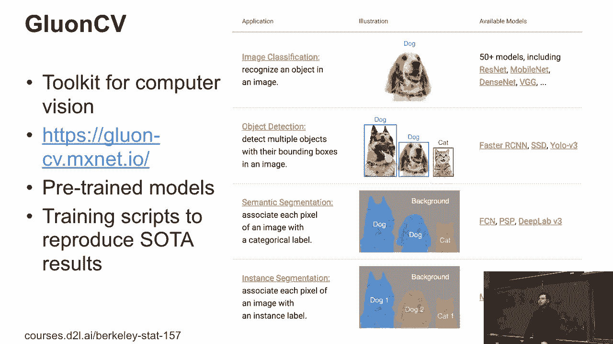

这真是太简单了。最后，我们有LOP，很多生产模型，脚本可以做大量的LOP工作。特别是，如果你看新闻，你会发现有一个新的算法叫做基于鸟类或变换器网络的算法，特别流行，还有来自OpenAI的GPT2。你可以获得很多不错的结果。这对于LOP来说是一件大事。所以最初我们可能不会过多讲解变换器鸟类模型，但根据写作的需要，

也许我们接下来要采用一种叫做鸟类或变换器模型的技术。

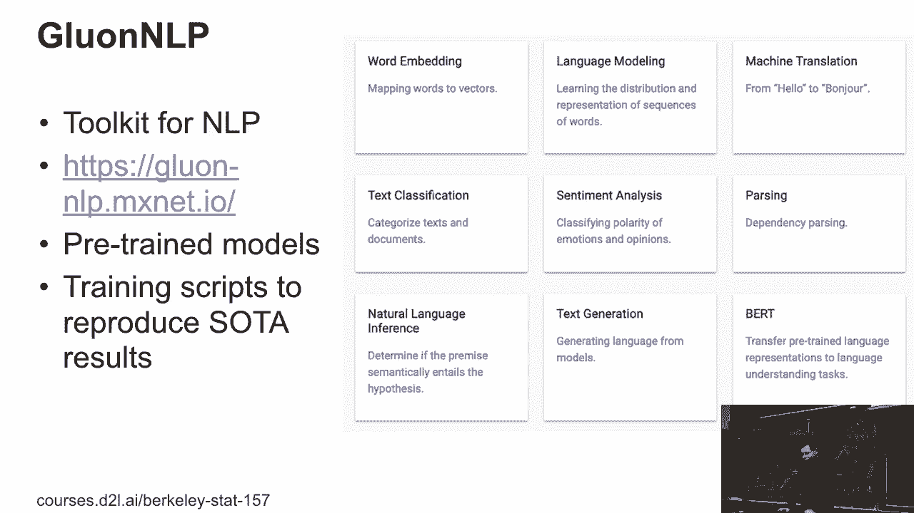

另一个你们团队可以做的是图神经网络。也就是说，你可以利用社交图数据集，或者声音推荐数据集，来构建关联的图神经网络。DGI就是为此而设计的。这是一个相对较新的研究领域，每个框架都可以成为一个重要的研究领域。

目前进展比较慢，但我们在这一领域的进展非常快。

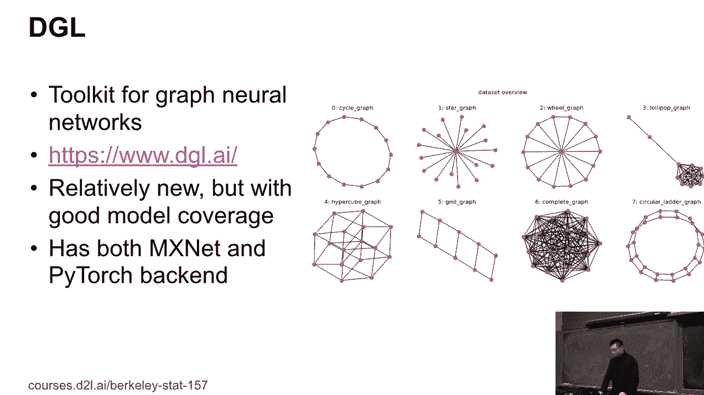

过去几年，每个框架都非常快速。例如，MSNAT我们今年有更多的工具包，另外我们学到的一点是，像第一次作业我们得到的反馈，告诉我ND删除了Lumpy，实际上它是不兼容的。例如，如果你做BOE索引，它实际上不支持这一点。所以是的。

我们采纳了这些反馈，现在我们可以复制ND，也许一年后，你会引入一个新的包，叫做NP，它是100%不兼容现有包的，这意味着我们可以在Lumpy中添加GPU支持，也可以在Lumpy中加入自动图优化。所以这就像是，如果明年我们再次在伯克利教授课程，我们可以使用一个非兼容包。

它就是使用非兼容包。我们看到的第二个领域是，确实人们关心性能，像是对于CPU和GPU，我们能够利用编译器技术，实际上我们可以看到整个网络，并对网络的图进行规模优化。在CPU和GPU上，我们可以获得额外50%的性能提升，更重要的是，越来越多的深度学习应用在H或移动电话、ASIC上运行，所以我们抱有希望。

今年年底我们将涵盖更多硬件内容。另外，还有一个问题，像是我的笔记本有GPU，为什么我无法在笔记本上使用GPU。抱歉，你通常没有独立显卡，你可能只有英特尔集成显卡。但现在，也许到今年年底，人们可以在英特尔或AMD的GPU上运行所有GPU代码。

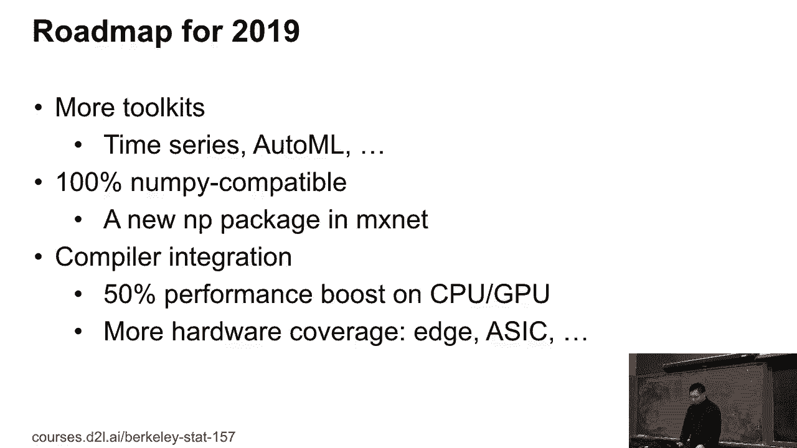

接下来，关于Groom我们会提供一些教程。我们已经讨论过NDR接口，现在再多讲一点如何编写代码。

新网络。所以这里有三件事，如何创建和定义新的网络和层，如何初始化和操作参数。最后，因为我们下周可以开始教授卷积神经网络，可能更倾向于使用GPU进行多层感知器，笔记本可能足够好，但对于卷积神经网络，CPU速度太慢。

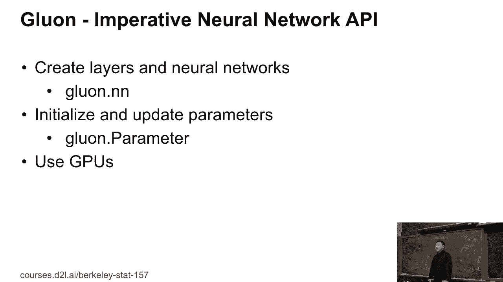

[BLANK_AUDIO]。
