# P48：48. L10_1 深度学习框架，Gluon - Python小能 - BV1CB4y1U7P6

在硬件之后，我们可以稍微聊一下前端框架。

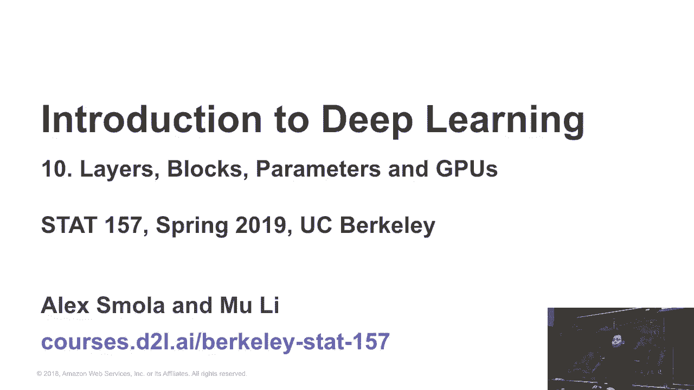

所以我们知道有许多框架，横轴是年份。你可以看到Ciano，Cafe，Cafe来自伯克利，并且很多新的事物，尤其是四年前的四个框架和其他的东西。因此，我们可以简要介绍每个框架，主要的设计决策是什么。

这是一个代理，或者说它是唯一的那个。

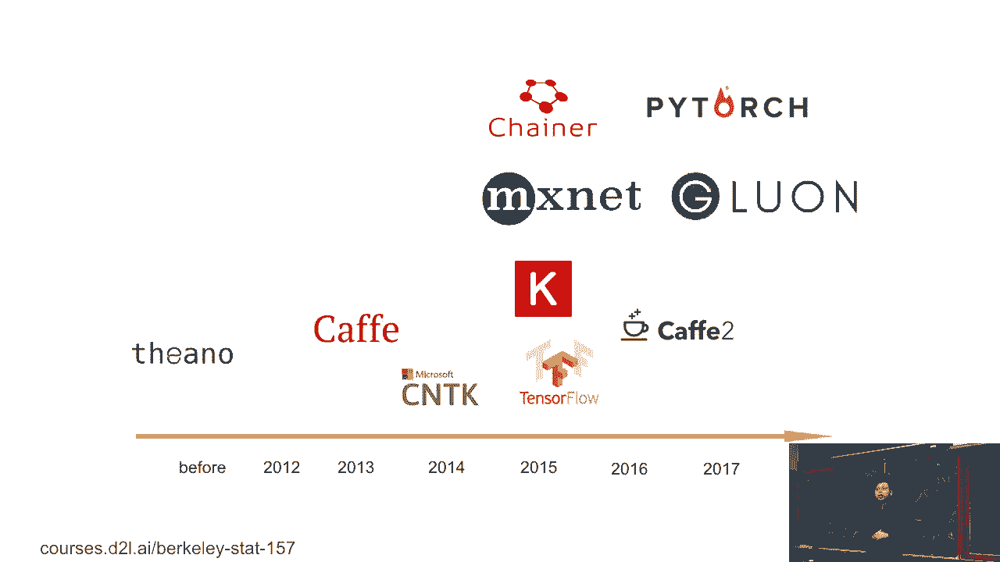

第一个是Cafe。Cafe由伯克利大学开发。四年前，它是计算机视觉领域最流行的框架之一。所以它的程序接口是，你给我一个协议，描述层次，你可以写一个文本来描述这些层。例如：

这是RESTNet 1011网络的一部分，如何定义各个层。我们有不同的层，底层是什么，顶层是什么，还有这里的顶层和“prime”层。所以这里的一个是Cafe，具有非常好的Cvmore覆盖性。这是一系列的卷积网络，下一周我们将无法讲解，且它是可移植的。

这意味着它是一个单一的二进制文件。你可以抓取它并在任何地方运行。但那时它不那么灵活，如果你想做像Python那样的交互式程序，会很困难。而且这个层次，我实际上没有展示完整。单个定义有四千行代码，意味着这是一个四单层的定义。

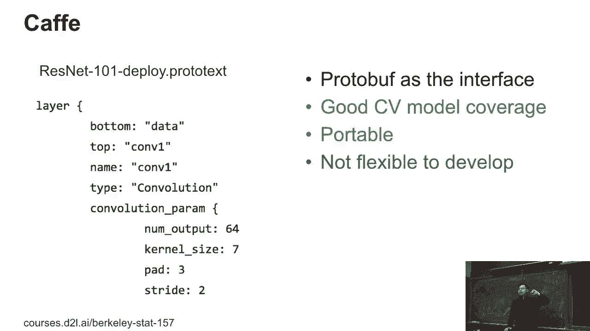

一个四单网络。之后，TensorFlow可能是目前最流行的衰退框架。它提供了特定领域的语言，叫做DSL，用于Python。所以TensorFlow就像Python，但又不完全是Python。它有成千上万个操作符。所以实际上，它是一个可以满足你在TensorFlow中使用的一切需求的框架。

你还可以使用许多功能进行训练、部署，做你想做的所有事情。但这里的问题是，TensorFlow代码有点难以理解。如果你之前没有学习过它，作为一个Python用户，如果你读到这段代码，你可能不知道这个状态OPs赋值实际上是什么意思。

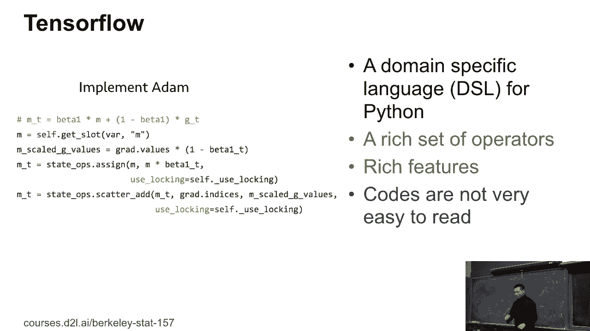

但它有点难以理解。另一方面，Chaos是一个客户端。它就是为了简化开发过程而设计的。比如，这里是如何使用Chaos定义一个多层感知器的。它和我们以前在Gluon中做的非常相似。Chaos就是一个客户端。

你可以使用不同的后端。例如，你可以，确实，可以像原始使用一样。现在CML正在使用TensorFlow，你也可以使用M站点或者CNT缓存后端。所以，你关心的是，它相对于TensorFlow来说，使用起来非常简便。但可能会稍慢，因为你在前端会有一点开销。

尝试在你的Libia中使用TensorFlow探测器时，你会发现它在效率上看起来稍微好一些，最终效果更佳。因为你会看到有一个编译步骤在这里，所以开发调试变得不那么方便。你编译定义的模型实际上被称为符号编程。我们之前稍微讨论过，这种方式让你更难获取中间过程。

结果并进行交互操作。

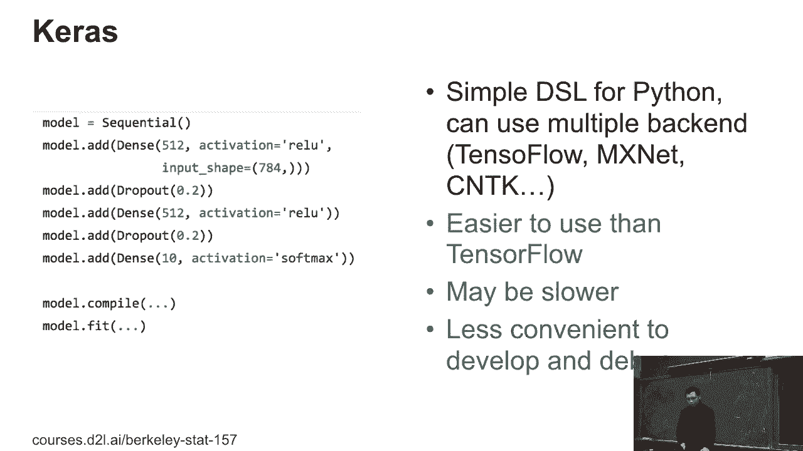

另一个非常流行的是PyTorch。PyTorch来自Torch，实际上从Torch中抓取了Tensor接口，并且也抓取了来自Channel的UNL接口。所以它完全基于Python，这意味着它非常容易理解。如果你是Python用户，你可以轻松阅读PyTorch的代码。

由于与Python的紧密集成，PyTorch特别难以部署，尤其是在工业应用中。有时你的应用可能是用Java编写的，而你需要在Java中运行Python，那就非常强大。而且如果你想在手机上运行，实际上你不一定需要Java，这样可以避免很多效率问题。但PyTorch非常易于使用。

它在研究界变得非常流行。

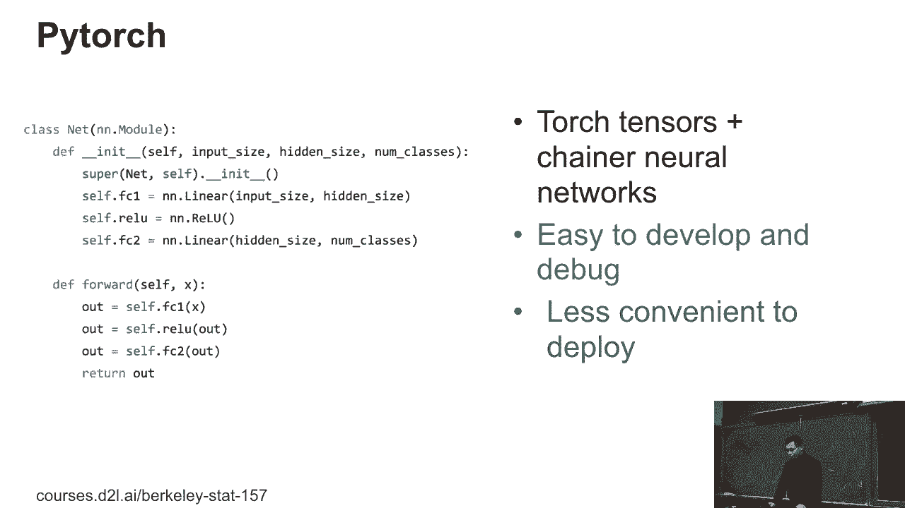

这个课程是基于M-Snet的。原始的M-Snet有一个类似Tensor库的部分，你之前已经见过，叫做ND。它的最终目标是像神经网络那样简单的网络，意味着你定义网络，编译它，并将数据输入进行训练。M-Snet的原始设计是为了优化性能。

我们希望获得最佳性能，因此会牺牲一些可用性。那时人们还不知道，那时还是早期的阶段，社区很小，每个人都是专家，所以当时我们并不在乎可用性。

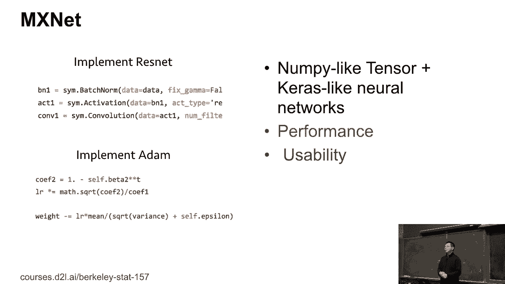

之后，社区发展起来了，PyTorch比TensorFlow更易于使用，甚至变得简单了十倍，我们学到了：是的，让我们使用像PyTorch这样的东西。因此，Gluon实际上非常类似于中国的PyTorch，用于神经网络。因此，在这里我们定义网络，然后可以做这些事情，做一些我们之前介绍的普通操作。因此，Gluon使得代码开发和调试变得更容易，这与PyTorch相似。

相比符号接口，PyTorch有时会稍慢一些，因为你会失去一些性能。然而，对于使用PyTorch的交互式体验来说，大多数情况下你并不在意，除非你是自动驾驶汽车公司，拥有大量4K视频，且非常关注性能。但在大多数情况下，这并不重要。

对于家庭作业来说，你并不在意这些。因此，这就是我们两年前的情况，也是过去两年我们真正学到的东西：随着越来越多的学生和工程师加入，大家对框架的关注越来越少，它只是一个工具。

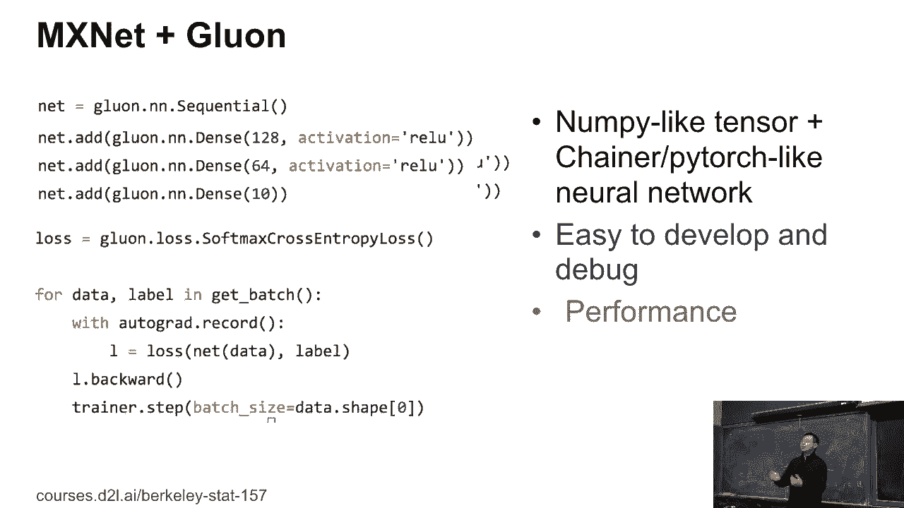

框架是一个让你完成任务的工具。例如，对于研究人员来说，他们真的希望有一些基准模型。已经实现的模型可以作为基础，我可以基于这些基准模型进行修改并训练我自己的应用程序。而对于工程师来说，我更关心的是抓取数据，训练模型和部署。这些才是我真正关注的。所以从一年前开始，我们尝试了，好的。

让我们有两个孩子专注于应用。比如有一个叫Glone CV的工具包。这是一个计算机视觉工具包。它提供了一堆图像规格。所有这些流行的模型，这里包括目标检测、语义分割，还有很多分割任务，比如人脸识别，很多内容。

所以它有一堆预训练模型，你可以直接抓取并使用。还提供了所有这些训练脚本来重现结果。重现结果相当困难，因为为了让你的论文更出彩，你需要很多。酷炫的东西，但要得到结果，你得有很多技巧。比如说。

许多著名的论文我们也会在课堂上教授，声称，没错。让我们设计一个网络，我有这个故事。而我们通过基准模型提高了5%。哦。那是件大事，人们都跃跃欲试。是的，这听起来很酷。实际上，我们仔细看了实现。我们发现，那个大招，能带来3%的提升，比如Softmax。

你可以给0表示无效，1表示有效。但你知道，对于Softmax回归来说，拟合0否则太难了。你可以做的是将有效的数字从0改成0.9，将无效改成0，从0改到0.1。这是软标签的代价，这样可以带来3%的提升。好吧，有很多技巧可以让事情发生。所以这个工具是为了，嗯。

让我们梳理所有技巧，找到这些模型的优先级技巧。你实际上可以从中获得很多好处。所以也有一堆项目，比如，嗯。我们来抓一个数据集，为你找到一个模型。我们的反馈是，嗯。就像是一个作业项目，因为你只是抓取它，使用我们的3.9代码，你就能找到它。

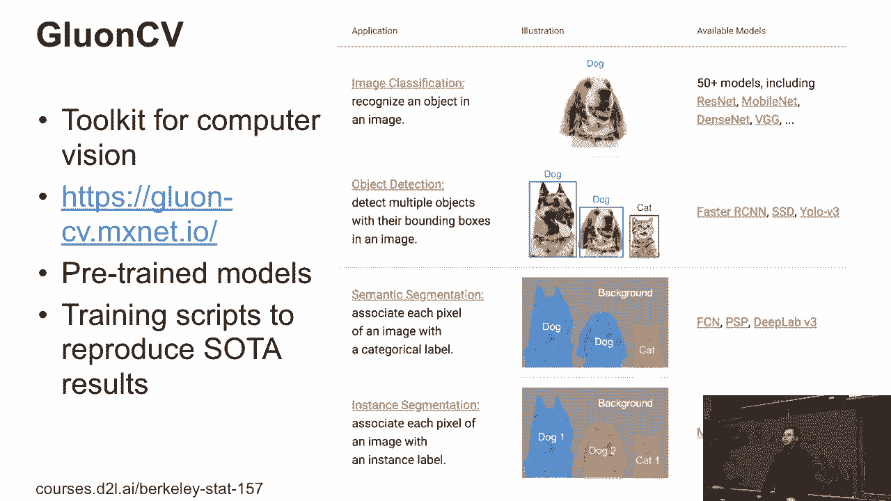

那么简单。最后我们有了LOP，很多生产模型、脚本并执行大量的LOP工作。尤其是，如果你看新闻的话，最近有一种新算法叫做Birds或基于变换器的网络，十分流行，还有来自OpenAI的GPT-2。你会得到很多好的结果。这对LOP是个大事。所以最初我们可能不会过多讲解变换器Birds，但根据写好的。

新闻，我们可能会讲解一下Birds或变换器模型。

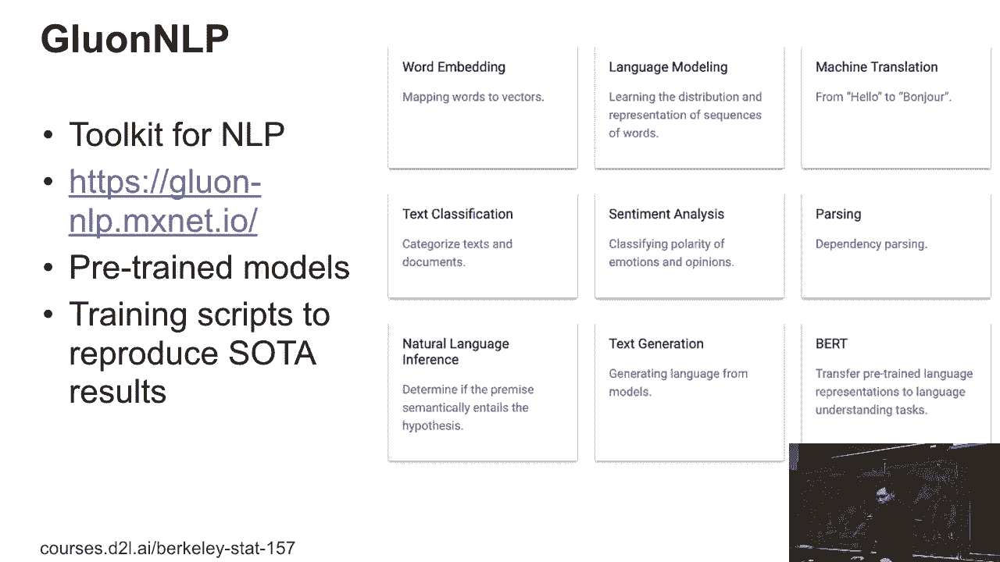

另一个，你们有一个团队在做图神经网络。所以意味着你可以使用社交图数据集，或推荐数据集，构建图卷积神经网络。DGI就是为此而生。这是一个相对较新的研究主题。每个框架其实都是一个大领域。

现在速度确实很慢，但我们在这一领域进展非常快。

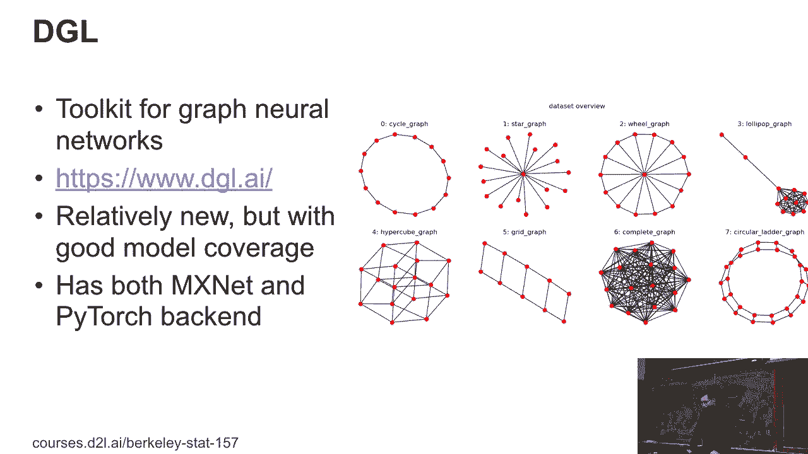

过去几年每个框架都发展得很快。例如，对于MSNAT，我们今年有更多的工具包，另外我们学到的一件事是：比如说第一份作业，我们收到了反馈。是的，反馈告诉我ND删除了Lumpy，实际上它是不兼容的。例如，如果你做Boe索引，它实际上不支持。所以是的。

我们采纳了这个反馈，现在我们可以在一年后复制ND，并且接着你可以引入一个新的包叫做NP，它是100%不兼容原有包的，这意味着我们可以为Lumpy添加GPU支持，也可以为Lumpy添加自动签名功能。所以，类似的，也许明年我们能再次在伯克利授课时使用一个非兼容包。

它只需要使用非兼容包。第二个领域是，我们发现大家确实关心性能，比如说对于CPU和GPU，我们能够利用编译器技术，对于编译器来说，我们可以看到整个网络，并进行图形网络的规模优化。在CPU和GPU上，我们可以获得50%的性能提升，更重要的是，越来越多的深度学习应用正在移动到H或手机，甚至ASIC上，所以我们希望

在今年年底之前，我们还会涵盖更多硬件。另一个问题是：是的，我的笔记本电脑有GPU，为什么我不能在笔记本上使用GPU？抱歉，通常你没有一个视频GPU，你可能只有Intel的GPU。但现在，也许在今年年底，大家可以在Intel或AMD的GPU上运行所有GPU代码。

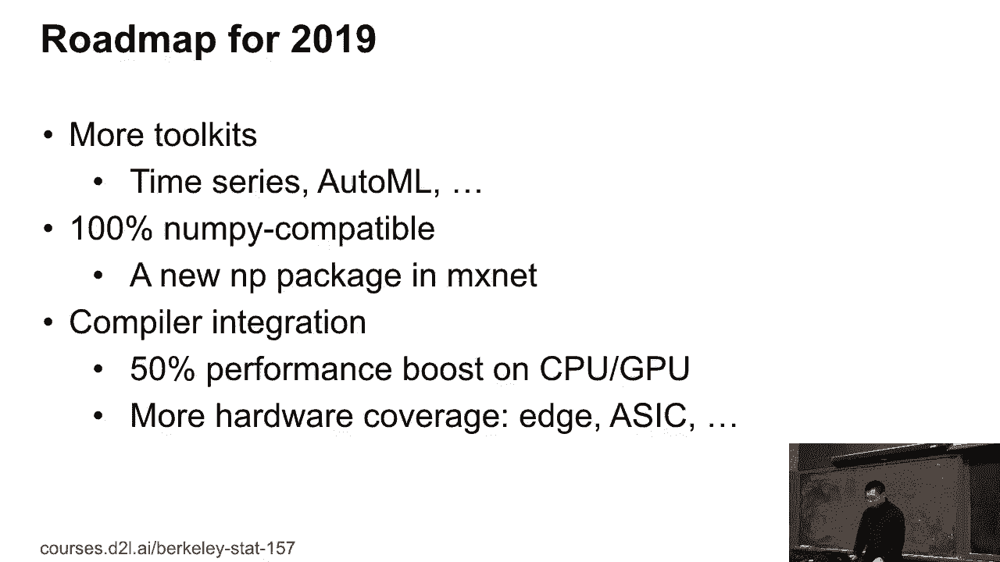

所以接下来，让我们提供一些关于Groom的教程。我们已经讨论过NDR接口，现在我们会更多地讲解如何编写代码。

新的网络。所以这里有三件事：如何创建和定义新的网络和层，如何初始化和操作参数。最后，由于我们可以在下周开始教授卷积神经网络，我们可能更倾向于使用GPU进行多层感知，笔记本电脑也许足够好，但对于卷积神经网络，CPU太慢了。

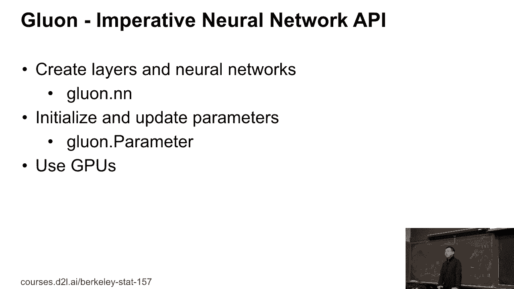

[BLANK_AUDIO]。
